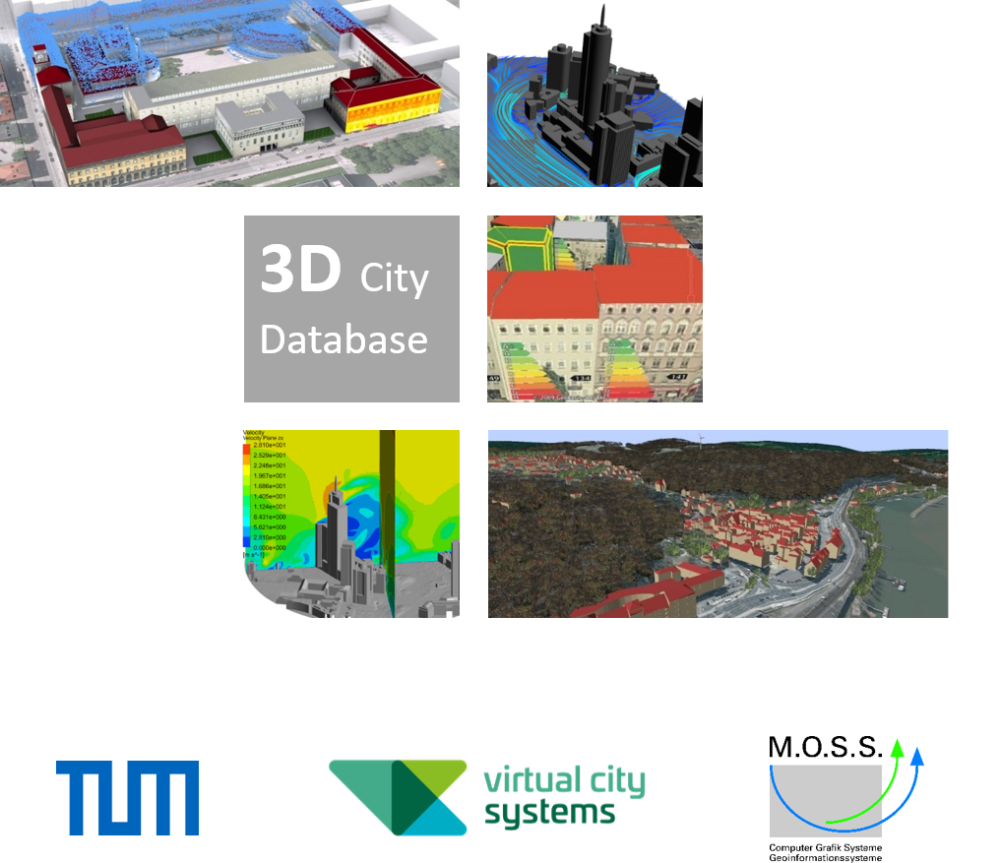

# 3D City Database User Manual

> [!NOTE]
> This repository hosts the 3DCityDB v4 user manual. Although 3DCityDB v5 is now available, 3DCityDB v4
> remains stable and operational. However, it is in **maintenance mode**, meaning no significant new features are
> planned, though existing bugs will continue to be addressed. Development is now focused on 3DCityDB v5, and we recommend
> upgrading to benefit from new features and improvements. Please refer to the [3DCityDB v5 user manual](https://3dcitydb.github.io/3dcitydb-mkdocs/)
> for more information.

The 3DCityDB User Manual is built and hosted on [ReadTheDocs.org](https://readthedocs.org).
Please use the link below to find the online version of this documentation.

<br/>
<p align="center">:arrow_right: http://3dcitydb-docs.rtfd.io/ :arrow_left:</p>
<br/>



The images on the cover page were provided by:

- Chair of Photogrammetry and Remote Sensing & Chair of Cartography, Technische Universität München

- Geobasisdaten: © Stadtvermessung Frankfurt am Main

- IDAC Ltd, UK.

- Virtual City Systems, Berlin, Germany

- Chair of Geoinformatics, Technische Universität München. Image created based on master thesis work of Matthias Körner, jointly supervised with HTW Dresden

- 3D City Model of Berlin © Berlin Partner GmbH

- M.O.S.S. Computer Grafik Systeme GmbH, Taufkirchen, Germany

## How to build this documentation

### Build with Docker

To avoid setting up the build environment, it is recommended to use [Docker](https://docs.docker.com/get-docker/)
and [this Docker image](https://github.com/BWibo/sphinx-rtd-docker) to build this documentation.

#### Build process

1. Clone this repo and navigate to the repo folder:

   ```bash
   git clone https://github.com/3dcitydb/3dcitydb-docs.git
   cd 3dcitydb-docs
   ```

2. Mount the current directory to the images `/docs` folder and build the HTML version:

    ```bash
    docker run --rm \
      -v $PWD:/docs \
    bwibo/sphinx-rtd make html
    ```

3. The build files are in `build/html`.

### Build in a local Python environment

To build this documentation following tools are required:

- Python 3.6+: <https://www.python.org/>
- Sphinx: <https://www.sphinx-doc.org/en/master/usage/installation.html>
- Sphinx ReadTheDocs Theme: <https://sphinx-rtd-theme.readthedocs.io/en/stable/>
- Sphinx copybutton: <https://sphinx-copybutton.readthedocs.io/en/latest/>

Run this to install all dependencies in an existing Python environment using
[pip](https://packaging.python.org/tutorials/installing-packages/https://packaging.python.org/tutorials/installing-packages/):

```python
pip install -U sphinx
pip install -U -r source/requirements.txt
```

#### Build process

1. Clone this repo and navigate to the repo folder:

   ```bash
   git clone https://github.com/3dcitydb/3dcitydb-docs.git
   cd 3dcitydb-docs
   ```

2. Build the HTML version of the documentation:

   - Linux:

      ```bash
      make html
      ```

      **Note:** If `make` is not available on your system, you can get it from
      packages:

        - Debian based Linux: `apt-get install make` or `apt-get install build-essential`.
        - Alpine Linux: `apk add make` or `apk add alpine-sdk`.

   - Windows:

      ```cmd
      make.bat html
      ```

3. The build files are in `build/html`.

## Documentations of previous versions

Documentations of previous versions are available as PDF here:
<https://www.3dcitydb.org/3dcitydb/documentation/>
