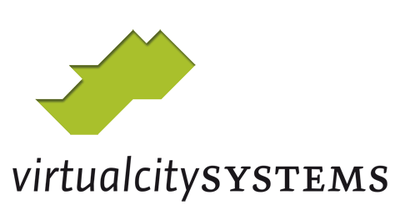
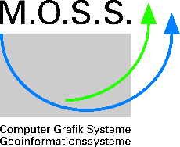

3dcitydb-docs
#############

**3D City Database for CityGML**

Geobasisdaten: © Stadtvermessung Frankfurt am Main
IDAC Ltd, UK.
Chair of Geoinformatics, Technische Universität München. Image
      created based on master thesis work of Matthias Körner, jointly
      supervised with HTW Dresden
3D City Model of Berlin © Berlin partner GmbH

|tum_logo|

Chair of Photogrammetry and Remote Sensing & Chair of Cartography, Technische Universität München

|vcs_logo|

virtualcitySYSTEMS GmbH, Berlin, Germany

|moss_logo|

M.O.S.S. Computer Grafik Systeme GmbH, Taufkirchen, Germany

Versions of software packages
-----------------------------

This documentation covers the following versions of the 3D City Database
and its tools.

============================= ===================
**Software package**          **Version**
============================= ===================
3D City Database              4.0.1, 4.0.0
Importer/Exporter and plugins 4.2.x, 4.1.x, 4.0.0
3DCityDB-Web-Map-Client       1.6.2
Web Feature Service           4.2.x, 4.1.x, 4.0.0
============================= ===================

