.. contents::
   :depth: 3
..

3D City Database for CityGML

**Version 4.0**

**Documentation**

**2019**

|image0|

|image1|

| |image2|\ |image3|
| **The images on the cover page were provided by:**

-  Chair of Photogrammetry and Remote Sensing & Chair of Cartography,
      Technische Universität München

-  Geobasisdaten: © Stadtvermessung Frankfurt am Main

-  IDAC Ltd, UK.

-  virtualcitySYSTEMS GmbH, Berlin, Germany

-  Chair of Geoinformatics, Technische Universität München. Image
      created based on master thesis work of Matthias Körner, jointly
      supervised with HTW Dresden

-  3D City Model of Berlin © Berlin partner GmbH

-  M.O.S.S. Computer Grafik Systeme GmbH, Taufkirchen, Germany

Versions of software packages
=============================

This documentation covers the following versions of the 3D City Database
and its tools.

============================= ===================
**Software package**          **Version**
============================= ===================
3D City Database              4.0.1, 4.0.0
Importer/Exporter and plugins 4.2.x, 4.1.x, 4.0.0
3DCityDB-Web-Map-Client       1.6.2
Web Feature Service           4.2.x, 4.1.x, 4.0.0
============================= ===================

Active participants in development
==================================

==================== =========================================================== ============================
**Name**             **Institution**                                             **Email**
==================== =========================================================== ============================
Thomas H. Kolbe      Chair of Geoinformatics,                                    thomas.kolbe@t\ um.de
                     Technische Universität München                             
Son H. Nguyen                                                                    son.nguyen@tum.de
                                                                                
| Kanishk Chaturvedi                                                             kanishk.chaturvedi@tum.de
| Bruno Willenborg                                                              
| Andreas Donaubauer                                                             | b.willenborg@tum.de
                                                                                 | andreas.donaubauer@tum.de
Claus Nagel          virtualcitySYSTEMS GmbH, Berlin                             cnagel@virtualcitysystems.de
                                                                                
Zhihang Yao                                                                      zyao@virtualcitysystems.de
Harald Schulz        M.O.S.S. Computer Grafik Systeme GmbH, Taufkirchen, Germany hschulz@moss.de
                                                                                
Philipp Willkomm                                                                 pwillkomm@moss.de
                                                                                
György Hudra                                                                     ghudra@moss.de
Felix Kunde          Beuth University of Applied Sciences                        felix-kunde@gmx.de
==================== =========================================================== ============================

Participants in earlier developments
====================================

The 3D City Database Version 4.0 and its tools are based on earlier
versions. During the development phase 2006-2012 at the *Institute for
Geodesy and Geoinformation Science, TU Berlin*, the following
individuals contributed to the development:

=============================== =============================================================================== =========
**Name**                        **Institution**                                                                 **Email**
=============================== =============================================================================== =========
Thomas H. Kolbe                 Institute for Geodesy and Geoinformation Science, Technische Universität Berlin *
                                                                                                                *
Claus Nagel                                                                                                    
                                                                                                               
Javier Herreruela                                                                                              
                                                                                                               
Gerhard König                                                                                                  
                                                                                                               
Alexandra Lorenz (geb. Stadler)                                                                                
                                                                                                               
Babak Naderi                                                                                                   
Felix Kunde                     University of Potsdam                                                          
=============================== =============================================================================== =========

During the development phase 2004-2006 at the *Institute for Cartography
and Geo­information, University of Bonn*, the following individuals
contributed to the development:

================== ================================================================ =========
**Name**           **Institution**                                                  **Email**
================== ================================================================ =========
Thomas H. Kolbe    Institute for Cartography and Geoinformation, University of Bonn
                                                                                   
Lutz Plümer                                                                        
                                                                                   
Gerhard Gröger                                                                     
                                                                                   
Viktor Stroh                                                                       
                                                                                   
Jörg Schmittwilken                                                                 
Andreas Poth       lat/lon GmbH, Bonn                                              
                                                                                   
Ugo Taddei                                                                         
================== ================================================================ =========

Table of Contents
=================

`Disclaimer 11 <#disclaimer>`__

`1 Introduction 13 <#introduction>`__

`1.1 Main features of 3DCityDB 15 <#main-features-of-3dcitydb>`__

`1.2 System and design decisions 20 <#system-and-design-decisions>`__

`1.3 List of changes between software versions
21 <#list-of-changes-between-software-versions>`__

`1.3.1 Notable changes between 4.0 and 3.3
21 <#notable-changes-between-4.0-and-3.3>`__

`1.4 Development history 23 <#development-history>`__

`1.5 Acknowledgements 24 <#acknowledgements>`__

`2 Data Modelling and Database Design
27 <#data-modelling-and-database-design>`__

`2.1 Simplification compared to CityGML 2.0.0
27 <#simplification-compared-to-citygml-2.0.0>`__

`2.1.1 Multiplicities, cardinalities and recursions
27 <#multiplicities-cardinalities-and-recursions>`__

`2.1.2 Data type adaptation 28 <#data-type-adaptation>`__

`2.1.3 Project specific classes and class attributes
28 <#project-specific-classes-and-class-attributes>`__

`2.1.4 Simplified design of GML geometry classes
28 <#simplified-design-of-gml-geometry-classes>`__

`2.2 UML class diagram 28 <#uml-class-diagram>`__

`2.2.1 Geometric-topological Model 29 <#geometric-topological-model>`__

`2.2.2 Implicit Geometry 30 <#implicit-geometry>`__

`2.2.3 Appearance Model 31 <#appearance-model>`__

`2.2.4 Thematic model 34 <#thematic-model>`__

`2.2.4.1 Core Model 34 <#core-model>`__

`2.2.4.2 Building model 36 <#building-model>`__

`2.2.4.3 Bridge Model 39 <#bridge-model>`__

`2.2.4.4 CityFurniture Model 42 <#cityfurniture-model>`__

`2.2.4.5 Digital Terrain Model 43 <#digital-terrain-model>`__

`2.2.4.6 Generic Objects and Attributes
45 <#generic-objects-and-attributes>`__

`2.2.4.7 LandUse Model 47 <#landuse-model>`__

`2.2.4.8 Transportation Model 47 <#transportation-model>`__

`2.2.4.9 Tunnel Model 49 <#tunnel-model>`__

`2.2.4.10 Vegetation Model 52 <#vegetation-model>`__

`2.2.4.11 WaterBodies Model 53 <#waterbodies-model>`__

`2.3 Relational database schema 55 <#relational-database-schema>`__

`2.3.1 Mapping rules, schema conventions
55 <#mapping-rules-schema-conventions>`__

`2.3.1.1 Mapping of classes onto tables
55 <#mapping-of-classes-onto-tables>`__

`2.3.1.2 Explicit declaration of class affiliation
55 <#explicit-declaration-of-class-affiliation>`__

`2.3.2 Conceptual database structure
58 <#conceptual-database-structure>`__

`2.3.3 Database schema 59 <#database-schema>`__

`2.3.3.1 Metadata Model 59 <#metadata-model>`__

`2.3.3.2 Core Model 62 <#core-model-1>`__

`2.3.3.3 Tables for geometry representation
64 <#tables-for-geometry-representation>`__

`2.3.3.4 Appearance Model 71 <#appearance-model-1>`__

`2.3.3.5 Building Model 76 <#building-model-1>`__

`2.3.3.6 Bridge Model 82 <#bridge-model-1>`__

`2.3.3.7 CityFurniture Model 84 <#cityfurniture-model-1>`__

`2.3.3.8 Digital Terrain Model 85 <#digital-terrain-model-1>`__

`2.3.3.9 Generic Objects and Attributes
87 <#generic-objects-and-attributes-1>`__

`2.3.3.10 LandUse Model 89 <#landuse-model-1>`__

`2.3.3.11 Transportation Model 89 <#transportation-model-1>`__

`2.3.3.12 Tunnel Model 91 <#tunnel-model-1>`__

`2.3.3.13 Vegetation Model 93 <#vegetation-model-1>`__

`2.3.3.14 WaterBody Model 94 <#waterbody-model>`__

`2.3.4 Sequences 95 <#sequences>`__

`2.3.5 Definition of the CRS for a 3D City Database instance
96 <#definition-of-the-crs-for-a-3d-city-database-instance>`__

`3 Implementation and Installation
99 <#implementation-and-installation>`__

`3.1 System requirements 99 <#system-requirements>`__

`3.1.1 3D City Database 99 <#d-city-database>`__

`3.1.2 Importer/Exporter Tool 99 <#importerexporter-tool>`__

`3.2 Installation of the Importer/Exporter and the 3D City Database SQL
Scripts
100 <#installation-of-the-importerexporter-and-the-3d-city-database-sql-scripts>`__

`3.3 Setting up the database schema
102 <#setting-up-the-database-schema>`__

`3.3.1 Shell Scripts 102 <#shell-scripts>`__

`3.3.2 SQL Scripts 103 <#sql-scripts>`__

`3.3.3 Installation steps on Oracle Databases
103 <#installation-steps-on-oracle-databases>`__

`3.3.4 Installation steps on PostgreSQL
106 <#installation-steps-on-postgresql>`__

`3.4 Working with multiple database schemas 108 <#_Toc948700>`__

`3.4.1 Create and address database schemas
108 <#create-and-address-database-schemas>`__

`3.4.2 Read and write access to a schema
109 <#read-and-write-access-to-a-schema>`__

`3.4.3 Schema support in stored procedures
109 <#schema-support-in-stored-procedures>`__

`3.5 Migration from previous major releases
110 <#migration-from-previous-major-releases>`__

`3.5.1 V2 to V4 Migration on Oracle
111 <#v2-to-v4-migration-on-oracle>`__

`3.5.2 V2 to V4 Migration on PostgreSQL
113 <#v2-to-v4-migration-on-postgresql>`__

`3.5.3 V3 to V4 Migration 113 <#v3-to-v4-migration>`__

`3.6 Upgrade between minor releases
113 <#upgrade-between-minor-releases>`__

`4 Stored procedures and additional features
115 <#stored-procedures-and-additional-features>`__

`4.1 User-defined data types 115 <#user-defined-data-types>`__

`4.2 CITYDB_UTIL 116 <#citydb_util>`__

`4.3 CITYDB_CONSTRAINT 117 <#citydb_constraint>`__

`4.4 CITYDB_IDX 118 <#citydb_idx>`__

`4.5 CITYDB_SRS 119 <#citydb_srs>`__

`4.6 CITYDB_STAT 120 <#citydb_stat>`__

`4.7 CITYDB_OBJCLASS 120 <#citydb_objclass>`__

`4.8 CITYDB_DELETE 120 <#citydb_delete>`__

`4.9 CITYDB_ENVELOPE 123 <#citydb_envelope>`__

`5 Importer/Exporter 125 <#importer-exporter>`__

`5.1 Running and using the Importer/Exporter
125 <#running-and-using-the-importer-exporter>`__

`5.2 Database connections and operations
128 <#database-connections-and-operations>`__

`5.2.1 Managing and establishing database connections
128 <#managing-and-establishing-database-connections>`__

`5.2.2 Executing database operations
130 <#executing-database-operations>`__

`5.3 Importing CityGML files 137 <#importing-citygml-files>`__

`5.4 Exporting to CityGML 142 <#exporting-to-citygml>`__

`5.4.1 SQL queries 147 <#sql-queries>`__

`5.4.2 XML query expressions 149 <#xml-query-expressions>`__

`5.4.2.1 <typeNames> parameter 149 <#typenames-parameter>`__

`5.4.2.2 <propertyNames> projection clause
151 <#propertynames-projection-clause>`__

`5.4.2.3 <filter> selection clause 152 <#filter-selection-clause>`__

`5.4.2.4 <count> parameter 160 <#count-parameter>`__

`5.4.2.5 <lods> parameter 161 <#lods-parameter>`__

`5.4.2.6 <appearance> parameter 162 <#appearance-parameter>`__

`5.4.2.7 <tiling> parameter 163 <#tiling-parameter>`__

`5.4.2.8 targetSrid attribute 164 <#targetsrid-attribute>`__

`5.4.2.9 Using address information and 3DCityDB metadata in queries
164 <#using-address-information-and-3dcitydb-metadata-in-queries>`__

`5.4.2.10 Using XML queries in batch processes
166 <#using-xml-queries-in-batch-processes>`__

`5.5 Exporting to KML/COLLADA/glTF 167 <#exporting-to-kmlcolladagltf>`__

`5.5.1 Support of GenericCityObject having any geometry types
174 <#support-of-genericcityobject-having-any-geometry-types>`__

`5.5.2 Loading exported models in Google Earth and Cesium Virtual Globe
175 <#loading-exported-models-in-google-earth-and-cesium-virtual-globe>`__

`5.6 Preferences 178 <#preferences>`__

`5.6.1 CityGML import preferences 179 <#citygml-import-preferences>`__

`5.6.1.1 Continuation 179 <#continuation>`__

`5.6.1.2 gml:id handling 180 <#gmlid-handling>`__

`5.6.1.3 Address 181 <#address>`__

`5.6.1.4 Appearance 183 <#appearance>`__

`5.6.1.5 Geometry 183 <#geometry>`__

`5.6.1.6 Indexes 185 <#indexes>`__

`5.6.1.7 XML validation 186 <#xml-validation>`__

`5.6.1.8 XSL Transformation 187 <#xsl-transformation>`__

`5.6.1.9 Import log 188 <#import-log>`__

`5.6.1.10 Resources 189 <#resources>`__

`5.6.2 CityGML export preferences 192 <#citygml-export-preferences>`__

`5.6.2.1 CityGML version 192 <#citygml-version>`__

`5.6.2.2 Tiling options 192 <#tiling-options>`__

`5.6.2.3 CityObjectGroup 193 <#cityobjectgroup>`__

`5.6.2.4 Address 194 <#address-1>`__

`5.6.2.5 Appearance 195 <#appearance-1>`__

`5.6.2.6 XLinks 196 <#xlinks>`__

`5.6.2.7 XSL Transformation 197 <#xsl-transformation-1>`__

`5.6.2.8 Resources 198 <#resources-1>`__

`5.6.3 KML/COLLADA/glTF export preferences
199 <#kmlcolladagltf-export-preferences>`__

`5.6.3.1 General Preferences 199 <#general-preferences>`__

`5.6.3.2 Rendering Preferences 204 <#rendering-preferences>`__

`5.6.3.3 Information Balloon Preferences
213 <#information-balloon-preferences>`__

`5.6.3.4 Altitude/Terrain Preferences
220 <#altitudeterrain-preferences>`__

`5.6.3.5 General setting recommendations
225 <#general-setting-recommendations>`__

`5.6.4 Management of user-defined coordinate reference systems
227 <#management-of-user-defined-coordinate-reference-systems>`__

`5.6.5 General preferences 229 <#general-preferences-1>`__

`5.6.5.1 Cache 229 <#cache>`__

`5.6.5.2 Import and export path 230 <#import-and-export-path>`__

`5.6.5.3 Network proxies 230 <#network-proxies>`__

`5.6.5.4 API Keys 231 <#api-keys>`__

`5.6.5.5 Logging 232 <#logging>`__

`5.6.5.6 Language selection 234 <#language-selection>`__

`5.7 Map window for bounding box selections
235 <#map-window-for-bounding-box-selections>`__

`5.8 Using the command line interface (CLI)
238 <#using-the-command-line-interface-cli>`__

`6 Importer/Exporter plugins 241 <#importer-exporter-plugins>`__

`6.1 Introduction to the plugin architecture
241 <#introduction-to-the-plugin-architecture>`__

`6.2 Spreadsheet Generator Plugin (SPSHG)
242 <#spreadsheet-generator-plugin-spshg>`__

`6.2.1 Definition 242 <#definition>`__

`6.2.2 Plugin installation 242 <#plugin-installation>`__

`6.2.3 User Interface 243 <#user-interface>`__

`6.2.3.1 Main Parameters 243 <#main-parameters>`__

`6.2.3.2 Columns 244 <#columns>`__

`6.2.3.3 Content Source 249 <#content-source>`__

`6.2.3.4 Output 249 <#output>`__

`6.3 ADE Manager Plugin 256 <#ade-manager-plugin>`__

`6.3.1 Definition 256 <#definition-1>`__

`6.3.2 Plugin installation 256 <#plugin-installation-1>`__

`6.3.3 User Interface 258 <#user-interface-1>`__

`6.3.3.1 ADE Registration 258 <#ade-registration>`__

`6.3.3.2 ADE Transformation 261 <#ade-transformation>`__

`6.3.4 Workflow of extending the Import/Export Tool
264 <#workflow-of-extending-the-importexport-tool>`__

`7 Web Feature Service 271 <#web-feature-service>`__

`7.1 System requirements 271 <#system-requirements-1>`__

`7.2 Installation 272 <#installation>`__

`7.3 Configuring the Web Feature Service
274 <#configuring-the-web-feature-service>`__

`7.3.1 Database settings 274 <#database-settings>`__

`7.3.2 Capabilities settings 277 <#capabilities-settings>`__

`7.3.3 Feature type settings 278 <#feature-type-settings>`__

`7.3.4 Operations settings 279 <#operations-settings>`__

`7.3.5 Postprocessing settings 280 <#postprocessing-settings>`__

`7.3.6 Server settings 281 <#server-settings>`__

`7.3.7 Cache settings 282 <#cache-settings>`__

`7.3.8 Constraints settings 282 <#constraints-settings>`__

`7.3.9 Logging settings 283 <#logging-settings>`__

`7.4 Using the Web Feature Service
284 <#using-the-web-feature-service>`__

`7.4.1 Basic functionality 284 <#basic-functionality>`__

`7.4.1.1 WFS operations 284 <#wfs-operations>`__

`7.4.1.2 Service URL 285 <#service-url>`__

`7.4.1.3 Service bindings 286 <#service-bindings>`__

`7.4.1.4 CityGML feature types 286 <#citygml-feature-types>`__

`7.4.1.5 Exception reports 287 <#exception-reports>`__

`7.4.2 GetCapabilities operation 287 <#getcapabilities-operation>`__

`7.4.3 DescribeFeatureType operation
288 <#describefeaturetype-operation>`__

`7.4.4 ListStoredQueries operation 290 <#liststoredqueries-operation>`__

`7.4.5 DescribeStoredQuery operation
291 <#describestoredquery-operation>`__

`7.4.6 GetFeature operation 293 <#getfeature-operation>`__

`7.5 Web-based WFS client 295 <#web-based-wfs-client>`__

`8 3DCityDB-Web-Map-Client 297 <#dcitydb-web-map-client>`__

`8.1 System requirements 298 <#system-requirements-2>`__

`8.2 Installation and configuration
298 <#installation-and-configuration>`__

`8.3 Using the 3D web client 300 <#using-the-3d-web-client>`__

`8.3.1 Overview of the relevant features and functionalities
300 <#overview-of-the-relevant-features-and-functionalities>`__

`8.3.2 Handling KML/glTF models with online spreadsheet
305 <#handling-kmlgltf-models-with-online-spreadsheet>`__

`8.3.3 Handling Web Map Service data
312 <#handling-web-map-service-data>`__

`8.3.4 Handling Digital Terrain Models
314 <#handling-digital-terrain-models>`__

`8.3.5 Interaction with 3D objects 316 <#interaction-with-3d-objects>`__

`8.3.6 Mobile Support Extension 322 <#mobile-support-extension>`__

`8.3.7 Using the 3D Web Client from the 3DCityDB homepage
324 <#using-the-3d-web-client-from-the-3dcitydb-homepage>`__

`9 3DCityDB Docker Images 325 <#dcitydb-docker-images>`__

`9.1 Getting started 325 <#getting-started>`__

`9.2 Further images 326 <#further-images>`__

`10 References 327 <#references>`__

`Appendix A Changelog 331 <#changelog>`__

`A.1 3D City Database relational schema
331 <#d-city-database-relational-schema>`__

`A.1.1 General changes 331 <#general-changes>`__

`A.2 3D City Database scripts 331 <#d-city-database-scripts>`__

`A.3 3D City Database stored procedures
332 <#d-city-database-stored-procedures>`__

`A.3.1 General changes 332 <#general-changes-1>`__

`A.3.2 UTIL package 332 <#util-package>`__

`A.3.3 IDX package 332 <#idx-package>`__

`A.3.4 SRS package 332 <#srs-package>`__

`A.3.5 STAT package 332 <#stat-package>`__

`A.3.6 DELETE package 332 <#delete-package>`__

`A.3.7 DELETE_BY_LINEAGE package 333 <#delete_by_lineage-package>`__

`A.3.8 ENVELOPE package 333 <#envelope-package>`__

`A.4 3D City Database Importer/Exporter
333 <#d-city-database-importerexporter>`__

`A.4.1 General changes 333 <#general-changes-2>`__

`A.4.2 CityGML import 333 <#citygml-import>`__

`A.4.3 CityGML export 334 <#citygml-export>`__

`A.4.4 KML/COLLADA/glTF export 334 <#kmlcolladagltf-export>`__

`A.5 Web Feature Service 334 <#web-feature-service-1>`__

`A.6 3D Web Map Client 335 <#d-web-map-client>`__

`Appendix B 3DCityDB @ TU München 337 <#dcitydb-tu-münchen>`__

`B.1 Interactive Cloud-based 3D Webclient
337 <#interactive-cloud-based-3d-webclient>`__

`B.2 Research Projects in which 3DCityDB is being used
338 <#research-projects-in-which-3dcitydb-is-being-used>`__

`B.3 Current and future work on 3DCityDB
338 <#current-and-future-work-on-3dcitydb>`__

`Appendix C 3DCityDB @ virtualcitySYSTEMS
339 <#dcitydb-virtualcitysystems>`__

`C.1 virtualcityDATABASE 339 <#virtualcitydatabase>`__

`C.2 virtualcitySUITE – The 3D City Platform
340 <#virtualcitysuite-the-3d-city-platform>`__

`Appendix D 3DCityDB @ M.O.S.S. 341 <#dcitydb-m.o.s.s.>`__

`D.1 novaFACTORY at a glance 341 <#novafactory-at-a-glance>`__

`D.2 novaFACTORY 3D GDI 342 <#novafactory-3d-gdi>`__

Disclaimer
==========

The *3D City Database (3DCityDB) version 4.0* has been developed in
collaboration of the *Chair of Geoinformatics, Technische Universität
München (TUMGI), virtualcitySYSTEMS GmbH,* and *M.O.S.S. Computer Grafik
System GmbH.* 3DCityDB is free and Open Software licensed under the
Apache License, Version 2.0. See the file LICENSE file shipped together
with the software for more details. You may obtain a copy of the license
at http://www.apache.org/licenses/LICENSE-2.0.

Please note that releases of the software before version 3.3.0 continue
to be licensed under GNU LGPL 3.0. To request a previous release of the
3D City Database under Apache License 2.0 create a GitHub issue at
https://github.com/3dcitydb.

THE SOFTWARE IS PROVIDED BY *TUMGI* "AS IS" AND "WITH ALL FAULTS."
*TUMGI* MAKES NO REPRESENTATIONS OR WARRANTIES OF ANY KIND CONCERNING
THE QUALITY, SAFETY OR SUITABILITY OF THE SOFTWARE, EITHER EXPRESSED OR
IMPLIED, INCLUDING WITHOUT LIMITATION ANY IMPLIED WARRANTIES OF
MERCHANTABILITY, FITNESS FOR A PARTICULAR PURPOSE, OR NON-INFRINGEMENT.

*TUMGI* MAKES NO REPRESENTATIONS OR WARRANTIES AS TO THE TRUTH, ACCURACY
OR COMPLETENESS OF ANY STATEMENTS, INFORMATION OR MATERIALS CONCERNING
THE SOFTWARE THAT IS CONTAINED ON AND WITHIN ANY OF THE WEBSITES OWNED
AND OPERATED BY *TUMGI*.

IN NO EVENT WILL *TUMGI* BE LIABLE FOR ANY INDIRECT, PUNITIVE, SPECIAL,
INCIDENTAL OR CONSEQUENTIAL DAMAGES HOWEVER THEY MAY ARISE AND EVEN IF
*TUMGI* HAVE BEEN PREVIOUSLY ADVISED OF THE POSSIBILITY OF SUCH DAMAGES.

Introduction
============

Virtual 3D city and landscape models are provided for an increasing
number of cities, regions, states, and even countries. They are created
and maintained by public authorities like national and state mapping
agencies as well as by cadastre institutions and private companies. The
3D topography of urban and rural areas is essential for both visual
exploration and a range of different analyses in, for example, the urban
planning, environmental, energy, transportation, and facility management
sectors.

3D city models are nowadays used as an integrative information backbone
representing the relevant urban entities along with their spatial,
semantic, and visual properties. They are often created and maintained
with full coverage of entire cities and even countries, i.e. all real
world objects of a specific type like buildings, roads, trees, water
bodies, and the terrain are explicitly represented. In most cases the 3D
city model objects have well-defined identifiers, which are kept stable
during the lifetime of the real world objects and their virtual
counterparts. Such complete 3D models are a good basis to organize
different types of data and sensors within Smart City projects as they
build a stable platform for information linking and enrichment.

In order to establish a common understanding and interpretation of the
urban objects and to achieve interoperable access and exchange of
complete 3D models including the geometric, topologic, visual, and
semantic data, the Open Geospatial Consortium (OGC) has issued the
CityGML standard [Kolbe 2009]. CityGML defines a feature catalogue and
data model for the most relevant 3D topographic elements like buildings,
bridges, tunnels, roads, railways, vegetation, water bodies, etc. The
data model is mapped to an XML-based exchange format using OGC’s
Geography Markup Language (GML).

The 3D City Database (3DCityDB) is a free Open Source package consisting
of a database schema and a set of software tools to import, manage,
analyse, visualize, and export virtual 3D city models according to the
CityGML standard. The database schema results from a mapping of the
object oriented data model of CityGML 2.0 to the relational structure of
a spatially-enhanced relational database management system (SRDBMS). The
3DCityDB supports the commercial SRDBMS Oracle (with ‘Spatial’ or
‘Locator’ license options) and the Open Source SRDBMS PostGIS (which is
an extension to the free RDBMS PostgreSQL). 3DCityDB makes use of the
specific representation and processing capabilities of the SRDBMS
regarding the spatial data elements. It can handle also very large
models in multiple levels of details consisting of millions of 3D
objects with hundreds of millions of geometries and texture images.

3DCityDB is in use in real life production systems in many places around
the world and is also being used in a number of research projects. For
example, the cities of Berlin, Potsdam, Munich, Frankfurt, Zurich,
Rotterdam, Singapore all keep and manage their virtual 3D city models
within an instance of 3DCityDB. The companies virtualcitySYSTEMS (VCS)
and M.O.S.S., who are also partners in development, use 3DCityDB at the
core of their commercial products and services to create, maintain,
visualize, transform, and export virtual 3D city models (see Appendix B,
Appendix C, and Appendix D for examples how and where TUM,
virtualcitySYSTEMS, and M.O.S.S. employ 3DCityDB in their projects).
Furthermore, the state mapping agencies of all 16 states in Germany
store and manage the state-wide collected 3D building models in CityGML
LOD1 and LOD2 using 3DCityDB. In 2012 the previous version of 3DCityDB
and the developer team received the Oracle Spatial Excellence Award,
issued by Oracle USA.

Since 3DCityDB is based on CityGML, interoperable data access from user
applications to the database can be achieved in at least two ways:

1) by using the included high-performance CityGML Import/Export tool or
      the included basic Web Feature Service 2.0 in order to exchange
      the data in CityGML format (Version 2.0 or 1.0), and

2) by directly accessing the database tables whose relational structures
   are fully explained in detail within this document. It is easy to
   enrich a 3D city model by adding information to the database tables
   in some user application (using e.g. the database APIs of programming
   language like C++, Java, Python, or of ETL tools like the Feature
   Manipulation Engine from Safe Software). The enriched dataset then
   can be exchanged or archived by exporting the city model to CityGML
   without information loss. Analogously, 3DCityDB can be used to import
   a CityGML dataset and then access and work with the city model by
   directly accessing the database tables from some application programs
   or ETL software.

The Import/Export tool also provides functionalities for the direct
export of 3D visualization models in KML, COLLADA, and glTF formats. A
tiling strategy is supported which allows to visualize even very large
3D city and landscape models in geoinformation systems (GIS) or digital
virtual globes like Google Earth or CesiumJS Virtual Globe. The
Import/Export tool comes with an API to create further importers,
exporters, and database administration tools. One export plugin coming
with the software installer package is the so-called ‘Spreadsheet
Generator Plugin’ (SPSHG) which allows to export thematic data of 3D
objects into tables in CSV and Microsoft Excel format that can be easily
uploaded to and published as online spreadsheets, for instance, within
the Google Cloud. Starting from release 3.3.0, the 3DCityDB software
package comes with the CesiumJS-based 3D viewer called
“3DCityDB-Web-Map-Client” which can link the 3D visualization models
with online spreadsheets and facilitates interactive visualization and
exploration of 3D city models over the Internet within web browsers on
desktop and mobile computers. The most significant new functionality in
release 4.0.0 is the support of CityGML Application Domain Extensions
(ADEs). ADEs extend the CityGML datamodel by domain specific object
types, attributes, and relations.

**This document describes the design and the components of the 3D City
Database as well as their usage for the new major release 4.0.0 which
has been developed and implemented by the three partners in development,
namely the Chair of Geoinformatics at Technische Universität München,
virtualcitySYSTEMS, and M.O.S.S. The development is continuing the
previous work carried out at the Institute for Geodesy und
Geoinformation Science (IGG) of the Berlin University of Technology and
the Institute for Cartography and Geoinformation (IKG) of the University
of Bonn.**

**This document has been completely reworked, integrated, extended, and
edited from the previous 3DCityDB documentations (version 3.3.0, version
2.0.1, and the documentation addendum on 3DCityDB version 2.1.0 and the
Importer/Exporter tool version 1.6.0). Some figures and texts are cited
from the** OpenGIS City Geography Markup Language (CityGML) Encoding
Standard, Version 2.0.0 **[Gröger et al. 2012].**

Main features of 3DCityDB
-------------------------

Many (but not all) of the features referring to object modelling and
representation are implied by following the CityGML standard 2.0.0
issued by the Open Geospatial Consortium.

-  **CityGML 2.0.0 and 1.0.0 compliant database**: The implementation
   defines the classes and relations for the most relevant topographic
   objects in cities and regional models with respect to their
   geometrical, topological, semantical, and appearance properties.
   Included are generalization hierarchies between thematic classes,
   aggregations, relations between objects, and spatial properties.
   These thematic information go beyond graphic exchange formats and
   allow to employ virtual 3D city models for sophisticated analysis
   tasks in different application domains.

-  **Implementation on the basis of a spatially-enhanced relational
   database manage­ment system (Oracle 10G R2 or higher with
   Spatial/Locator option; PostgreSQL 9.1 or higher with PostGIS
   extension 2.0 or higher):** For the representation of all vector and
   grid geometry the built-in data types provided by the SRDBMS are used
   exclusively. This way, special solutions are avoided and different
   geoinformation systems, CAD/BIM systems, and ETL software systems can
   directly access (read and write) the geometry objects stored in the
   SRDBMS.

-  **Support for CityGML Application Domain Extensions (ADEs):**
   Semantic 3D city models are employed for many different applications
   from diverse domains like energetic, environmental, driving, and
   traffic simulations, as-built building infor­mation modeling
   (as-built BIM), asset management, and urban information fusion. In
   order to store and exchange application specific data aligned and
   integrated with the 3D city objects, the CityGML datamodel can be
   extended by new feature types, attributes, and relations using the
   CityGML ADE mechanism. ADEs are specified as (partial) GML
   application schemas using the modeling language XML Schema. Starting
   from release 4.0.0 the 3DCityDB database schema can be dynamically
   extended by arbitrary ADEs like the Energy ADE, UtilityNetwork ADE,
   Dynamizer ADE, or national CityGML extensions like IMGeo3D (from The
   Netherlands). Since ADEs can define an arbitrary number of new
   elements with all types and numbers of spatial properties, a
   transformation method has been developed to automatically derive the
   relational database schemas for arbitrary ADEs from the ADE XML
   schema files. Since we intended to follow similar rules in the
   mapping of the object-oriented ADE models onto relational models as
   we used for the (manual) mapping of the CityGML datamodel onto the
   3DCityDB core schema, the Chair of Geoinformatics at TUM developed a
   new transformation method based on graph transformation systems. This
   method is described in detail in [Yao & Kolbe 2017] and is
   implemented within the “ADE Manager” plugin for the Importer/Exporter
   software tool. It performs a sophisticated analysis of the XML schema
   files of an ADE, the automatic derivation of additional relational
   table structures, and the registration of the ADE within the
   3DCityDB. Furthermore, SQL scripts are generated for each ADE for
   e.g. the deletion of ADE objects and attributes from the database.
   Please note that in order to support also the import and export of
   CityGML datasets with ADE contents, a Java library for the specific
   ADE has to be implemented. This library has to perform the handling
   of the CityGML ADE XML elements and the reading from and writing into
   the respective ADE database tables using JDBC and SQL. An example how
   to develop such a Java library is given for a Test ADE in the
   3DCityDB github repository [1]_.

-  **Tool for importing and exporting CityGML data:** The included
   Importer/Exporter software tool allows for high performance importing
   and exporting of CityGML datasets according to CityGML versions 2.0
   and 1.0. The tool allows processing of very large datasets (>> 4 GB),
   even if they include XLinks between CityGML features or XLinks to 3D
   GML geometry objects. The multi-threaded programming exploits
   multiprocessor systems or multikernel CPUs to speed up the processing
   of complex XML-structures, resulting in high performance database
   access. Objects can be filtered during import or export according to
   spatial regions (bounding box), their object IDs, feature types,
   names, and levels of detail. Bounding boxes can be interactively
   selected using a map window based on OpenStreetMap (OSM). A tiling
   strategy is implemented in order to support the export of very large
   datasets. In case of a very high number of texture images they can be
   automatically distributed in a configurable number of subdirectories
   in order to avoid large directories with millions of files which can
   render a Microsoft Windows operating systems unresponsive. The
   Importer can also validate CityGML files and can be configured to
   only import valid features. It considers CityGML ADE contents, if the
   ADEs have been registered in the database and specific Java libraries
   for reading/writing the ADE contents from/into the ADE database
   tables is provided (see above). The Importer/Exporter tool can be run
   in interactive or batch mode.

-  **Tool for exporting visualization models in KML, COLLADA, and glTF
   formats:** This tool exports city models from the 3D city database in
   KML, COLLADA, and glTF formats which can directly be viewed and
   interactively explored in geoinformation systems (GIS) or digital
   virtual globes like Google Earth or Cesium WebGL Virtual Globe. A
   tiling strategy is supported where only tiles in the vicinity of the
   viewer’s location are being loaded facilitating the visualization of
   even very large 3D city and landscape models. Information balloons
   for all objects can be configured by the user. The exported models
   are especially suited to be visualized using the
   3DCityDB-Web-Map-Client (see below), an Open Source 3D web viewer
   that is based on the CesiumJS Webglobe framework with many functional
   extensions.

-  **Tool for exporting data to spreadsheets:** The ‘Spreadsheet
   Generator’ (SPSHG) allows exporting thematic data of 3D objects into
   tables in CSV and Microsoft Excel format which can be uploaded to a
   Google Spreadsheet within the Google Document Cloud. For every
   selected geoobject one row is being exported where the first column
   always contains the GMLID value of the respective object. The further
   columns can be selected by the user. This tool can be used to export
   attribute data from e.g. buildings like the class, function, usage,
   roof type, address, and further generic attributes that may contain
   information like the building energy demand, potential solar energy
   gain, noise level on the facades etc. The spreadsheet rows can be
   linked to the visualization model generated by the KML/COLLADA/glTF
   Exporter. This is illustrated in Appendix B.

-  **Tool for 3D visualization and interactive exploration of 3D models
   on the web:** The ‘3DCityDB-Web-Map-Client’ is a WebGL-based 3D web
   viewer which extends the Cesium Virtual Globe to support efficient
   displaying, caching, prefetching, dynamic loading and unloading of
   arbitrarily large pre-styled 3D visualization models in the form of
   tiled KML/glTF datasets generated by the KML/COLLADA/glTF Exporter.
   It provides an intuitive user interface to facilitate rich
   interaction with 3D visualization models by means of the enhanced
   functionalities like highlighting the objects of interests on
   mouseover and mouseclick as well as hiding, showing, and shadowing
   them. Moreover, the 3DCityDB-Web-Map-Client is able to link the 3D
   visualization model with an online spreadsheet (Google Fusion Table)
   in the Google Cloud and allows viewing and querying the thematic data
   of every city object according to its GMLID. For details see also
   [Chaturvedi et al. 2015, Yao et al. 2016].

-  **Web Feature Service (WFS) 2.0:** The 3DCityDB comes with an OGC
   compliant implementation of a basic WFS 2.0 allowing web-based access
   to the 3D city objects stored in the database. WFS clients can
   directly connect to this interface and retrieve 3D content for a wide
   variety of purposes. The implementation currently satisfies the
   *Simple WFS* conformance class. The WFS considers CityGML ADE
   contents, if the ADEs have been registered in the database and
   specific Java libraries for reading/ writing the ADE contents
   from/into the ADE database tables is provided (see above). An
   implementation of a full, transactional WFS is commercially available
   from one of the development partners, see Appendix C.

-  **Support of different kinds of multi-representations: Levels of
   detail, different appearances, (and with Oracle RDBMS only) planning
   versions and history: Every geoobject as well as the DTM can be
   represented in five different resolution or fidelity steps (Levels of
   Detail, LOD). With increasing LOD, objects do not only obtain a more
   precise and finer geometry, but do also gain a thematic refinement.**

**Different appearance data may be stored for each city object.
Appearance relates to any surface-based theme, e.g. infrared radiation
or noise pollution, not just visual properties. Consequently, data
provided by appearances can be used as input for both presentation and
analysis of virtual 3D city models. The database supports feature
appearances for an arbitrary number of themes per city model. Each LOD
of a feature can have individual appearances. Appearances can represent
– among others – textures and georeferenced textures. All texture images
can be stored in the database.**

**The version and history management employs Oracle’s Workspace Manager
and, hence, is only available for 3DCityDB instances running on an
Oracle RDBMS. It is largely transparent to application programs that
work with the database. Procedures saved within the database (Stored
Procedures) are provided, which allow for the management of planning
alternatives and versions via application programs.**

-  **Complex digital terrain models:** DTMs may be represented in four
   different ways in CityGML and therefore also in the 3D city database:
   regular grids, triangular irregular networks (TINs), 3D mass points
   and 3D break lines. For every level of detail, a complex DTM
   consisting of any number of DTM components and DTM types can be
   defined. Besides, it is possible to combine certain kinds of DTM
   representations for the same geographic area with each other (e.g.
   mass points and break lines or grids and break lines). In Oracle
   Spatial (but not Locator) Grid-based DTMs may be of arbitrary size
   and are composed from separate tiles to a single overall grid using
   the Oracle GeoRaster functionality. Please note that the
   Import/Export tool provides functions to read and write TIN, mass
   point, and break line DTM components, but not for raster based DTMs.
   GeoRaster data would have to be imported and exported using other
   tools from e.g. Oracle, ESRI, or Safe Software.

-  **Complex city object modelling**: The representation of city objects
   in the 3D city database ranges from coarse models to geometrically
   and semantically fine grained structures. The underlying data model
   is a complete realization of the CityGML data model for the levels of
   detail (LOD) 0 to 4. For example, buildings can be represented by
   simple, monolithic objects or can consist of an aggregation of
   building parts. Extensions of buildings, like balconies and stairs,
   can be classified thematically and provided with attributes just as
   single surfaces can be. LOD4 completes a LOD3 model by adding
   interior structures for 3D objects. For example, LOD4 buildings are
   composed of rooms, interior doors, stairs, and furniture. This allows
   among other things to select the floor space of a building, so that
   it can later be used e.g. to derive SmartBuildings or to form 3D
   solids by extrusion [Döllner et al. 2005]. Buildings can be assigned
   addresses that are also stored in the 3D city database. Their
   implemen­tation refers to the OASIS xAL Standard, which maps the
   address formats of the different countries into a unified XML schema.
   In order to model whole complexes of buildings, single buildings can
   be aggregated to form special building groups. The same complex
   modelling applies to the other CityGML feature types like bridges,
   tunnels, transportation and vegetation objects, and water bodies.

-  **Representation of generic and prototypical 3D objects:** Generic
   objects enable the storage of 3D geoobjects that are not explicitly
   modelled in CityGML yet, for example dams or city walls, or that are
   available in a proprietary file format only. This way, files from
   other software systems like architecture or computer graphics
   programs can be imported directly into the database (without
   interpretation). However, application systems that would like to use
   these data must be able to interpret the corresponding file formats
   after retrieving them back from the 3D geodatabase.

Prototypical objects are used for memory-efficient management of objects
that occur frequently in the city model and that do not differ with
respect to geometry and appearance. Examples are elements of street
furniture like lanterns, road signs or benches as well as vegetation
objects like shrubs, certain tree types etc. Every instance of a
prototypical object is represented by a reference to the prototype, a
base point and a transformation matrix for scaling, rotating and
translating the prototype.

The geometries (and appearances like textures, colors etc.) of generic
objects as well as prototypes can be stored either using the geometry
datatype of the spatial database management system (Oracle
Spatial/Locator or PostGIS) or in proprietary file formats. In the
latter case a single file may be saved for every object, but the file
type (MIME type), the coordinate transformation matrix that is needed to
integrate the object into the world coordinate reference system (CRS)
and the target CRS have to be specified.

-  **Extendable object attribution:** All objects in the 3D geodatabase
   can be augmented with an arbitrary number of additional generic
   attributes. This way, it is possible to add further thematic
   information as well as further spatial properties to the objects at
   any time. In combination with the concept of generic 3D objects this
   provides a highly flexible storage option for object types which are
   not explicitly defined in the CityGML standard. Every generic
   attribute consists of a triple of attribute name, data type, and
   value. Supported data types are: string; integer and floating-point
   numbers; date; time; binary object (BLOB, e.g. for storing a file);
   geometry object according to the specific geometry data type of
   Oracle or PostGIS respectively; simple, composite, or aggregate 3D
   solids or surfaces. Please note that generic attributes of type BLOB
   or geometry are not allowed as generic attributes in CityGML (and
   will, thus, not be exported by the CityGML exporter). However, it may
   be useful to store binary data associated with the individual city
   objects, for example, to store derived 3D computer graphics
   representations.

-  **Free, also recursive grouping of geoobjects:** Geoobjects can be
   grouped arbitrarily. The aggregates can be named and may also be
   provided with an arbitrary number of generic attributes (see above).
   Object groups may also contain object groups, which leads to nested
   aggregations of arbitrary depth. In addition, for every object of an
   aggregation, its role in the group can be specified explicitly
   (qualified association).

-  **External references for all geoobjects:** All geoobjects can be
   provided with an arbitrary number of references to corresponding
   objects in external data sources (i.e. hyperlinks / linked data). For
   example, in case of building objects this allows to store e.g. the
   IDs of the corresponding objects in official cadasters, digital
   landscape models (DLM), or Building Information Models (BIM). Each
   reference consists of an URI to the external data store or database
   and the corresponding object ID or URI within that external data
   store or database.

-  **Flexible 3D geometries:** The geometry of most 3D objects can be
   represented through the combination of solids and surfaces as well as
   any - also recursive - aggregation of these elements. Each surface
   may has attached different textures and colors on both its front and
   back face. It may also comprise information on transparency.
   Additional geometry types (any geometry type supported by the spatial
   database management system Oracle Spatial/Locator or PostGIS) can be
   added to the geoobjects by using generic attributes.

-  **Open Source and Platform Independence:** The entire software is
   freely accessible to the interested public. The 3DCityDB is licensed
   under the Apache License, Version 2.0, which allows including
   3DCityDB in commercial systems. You may obtain a copy of the Apache
   License at http://www.apache.org/licenses/LICENSE-2.0. Both the
   Importer/Exporter tool and the Web Feature Service are imple­mented
   in Java and can be run on different platforms and operating systems.

-  **Docker support:** We now provide Docker images for 1) a complete
   3DCityDB installation pre-installed within a PostGIS SRDBMS, 2) a
   webserver with an installed 3DCityDB-Web-Map-Client, 3) a 3DCityDB
   WFS. We also provide a Docker-compose script to launch all three
   Docker containers in a linked way with just a single command. Details
   are given in Section 9 and in the respective github
   repositories [2]_. Docker is a runtime environment for
   virtualization. Docker encapsulates individual software applications
   in so-called containers, which are – in contrast to virtual machines
   – light-weight and can be deployed, started and stopped very quickly
   and easily. Using our Docker images a 3DCityDB can be installed by a
   single command.

System and design decisions
---------------------------

The 3D City Database is implemented as a relational database schema
using the spatial datatypes provided by a spatially-enhanced relational
database management system (SRDBMS). Above, external software
applications and database stored procedures are provided working on this
database schema. Since only Oracle with the Spatial or Locator licensing
option (10G R2 or higher) and PostgreSQL (9.3 or higher) with PostGIS
extension (2.0 or higher) offer comprehensive support for 3D spatial
data, the 3D City Database schema is being provided for these two
systems only.

**In addition to the general advantages arising from the usage of a
widely used relational database management system (RDBMS), both Oracle
Spatial/Locator and PostgreSQL/ PostGIS offer some important performance
characteristics that allow an efficient imple­men­tation of the required
functionalities:**

-  Both RDBMS support spatial data types with coordinates ranging from
      2D to 4D. Spatial indexes and filters can be 2D or 3D allowing for
      efficient spatial selections in very large city models.
      Furthermore, the spatial data types are supported by a number of
      commercial and Open Source GIS that provide a database connection
      as for example ESRI’s ArcGIS/ArcSDE or Safe Software’s Feature
      Manipulation Engine (FME). This enables such systems to directly
      access the data stored in the 3D geodatabase.

-  Rules can be implemented using stored procedures and trigger
   mechanisms which propagate updates of objects to likewise affected
   objects in the database (transparent for the user).

**The data model of the 3D City Database is based on the CityGML 2.0
standard. The object-oriented data model of CityGML has been mapped to a
purely relational data model with the exception that geometry objects
are mapped to the spatial datatypes provided by the SDBMS. In order to
achieve high performance for data manipulations and queries the mapping
was done manually with a number of optimizations. A few simplifying
assumptions where made regarding the usage of the CityGML concepts in
the real world helping to increase performance. These are documented in
chapter** **2.1.**

**Surface-based geometries like Polygons, TINs, MultiSurfaces as well as
Solids are stored in a special way: they are decomposed into their
primitive surfaces and each surface is stored as an individual tuple in
one big surface table. The reason for this is that each surface can be
assigned multiple appearances (e.g. textures) in CityGML and, thus, each
appearance must be explicitly linkable to the corresponding surface. For
Solids also the solid geometry objects are stored in addition to their
decomposed boundary surfaces allowing to apply spatial operations on
them like the computation of the volume.**

**The provided software tools like the Importer/Exporter application are
implemented in the Java language in order to be platform independent.
The tools have been confirmed to run under Microsoft Windows, Linux, and
Apple Mac OS X. High performance is achieved by exploiting
multi-threading on multiprocessor or multi-core CPU systems.**

List of changes between software versions
-----------------------------------------

Notable changes between 4.0 and 3.3
~~~~~~~~~~~~~~~~~~~~~~~~~~~~~~~~~~~

New features and functionalities:

-  Importer/Exporter 4.2: Reworked Plugin API to support non-GUI
   plugins.

-  Importer/Exporter 4.2: Property projections can now also be defined
   for abstract feature types.

-  Importer/Exporter 4.1: Added support for using SQL and XML queries
   for CityGML exports to be able express more flexible and complex
   filter conditions

-  Importer/Exporter 4.1: Added support for importing CityGML data from
   (G)ZIP files and exporting CityGML content to (G)ZIP files

-  Importer/Exporter 4.1: OSM Nominatim is now used as default geocoder
   for the map window. Google Map API services can still be used for the
   map window and for KML/COLLADA exports but require an API key.

-  Management and storage of arbitrary CityGML ADEs with the 3DCityDB,
   the Importer/Exporter ADE Manager Plugin and the 3DCityDB WFS

-  New 3DCityDB Docker images to support continuous integration
   workflows

-  New metadata tables ADE, SCHEMA, SCHEMA_REFERENCING and
   SCHEMA_TO_OBJECTCLASS for registering CityGML ADEs

-  New prefilled metadata table AGGREGATION_INFO that supports the
   automatic generation of DELETE and ENVELOPE scripts

-  New function to create entries in USER_SDO_GEOM_METADATA view
   (Oracle)

-  Function objectclass_id_to_table_name now has a counterpart:
   table_name_to_objectclass_ids returning an array of objectclass ids
   (CITYDB_OBJCLASS package in Oracle, part of a data schema in
   PostgreSQL)

-  New database procedures to enable/disable foreign key constraints to
   speed up bulk write operations (CITYDB_CONSTRAINT package in Oracle,
   part of the citydb_pkg schema in PostgreSQL)

-  New SQL script to create additional data schemas in one database
   (PostgreSQL)

-  New shell and SQL scripts to grant read-only or full read-write
   access to another schema.

-  Importer/Exporter can connect to different database schemas with the
   same user

-  Enabling XSL transformations on CityGML imports and exports as well
   as WFS responses

-  New database operation panel to change the spatial reference system
   used in the database (incl. optional coordinate transformation)

-  New LoD filter for CityGML exports

-  3DCityDB WFS allows for exporting into the CityJSON format

Improved and updated features and functionalities:

-  Moved interactive prompts from SQL to batch/shell scripts for better
   setup automation

-  Added OBJECTCLASS_ID column to all feature tables to distinguish
   objects from CityGML ADEs. Also extended OBJECTCLASS table by more
   feature-specific details and inserted new entries for feature
   properties such as geometry, generic attributes etc.

-  Improved performance on stored procedures by reducing amount of
   dynamic SQL. Therefore, schema_name parameter has been removed from
   DELETE and ENVELOPE scripts. Under PostgreSQL these scripts (as well
   as the INDEX_TABLE) are now part of a data schema such as citydb.

-  DELETE and ENVELOPE are now generated automatically in order to deal
   with schema changes introduced by ADEs. Therefore, the function
   prefix has been shortened to del\_ and env\_ not hit the character
   limit under Oracle,

-  The CITYDB_DELETE_BY_LINEAGE package has been removed. The only
   function left is del_cityobjects_by_lineage which is now part of the
   DELETE package

-  Database migration scripts for version 2.1.0 or version 3.3.0 to
   version 4.0.0

-  Switching from Ant to Gradle as the new build system for the
   Importer/Exporter tools

-  Allow import of CityGML files with flat hierarchies between city
   objects

-  Added support for importing gml:MultiGeometry objects containing only
   polygons

-  Added support for exporting to glTF v2.0

-  3DCityDB WFS now supports CORS and provides a KVP over HTTP GET
   endpoint for every operation simplifying the integration with GIS and
   ETL software such as FME

Development history
-------------------

The development of the 3D City Database was always closely related to
the development of the CityGML standard [Kolbe & Gröger 2003]. It was
started back in 2003 by *Dr. Kolbe* and *Prof. Plümer* at the *Institute
for Cartography and Geoinformation at University of Bonn*. In the period
from November 2003 to December 2005 the official virtual 3D city model
of Berlin, commissioned by *The Berlin Senate* and *Berlin Partner
GmbH*, was developed within a pilot project funded by the European Union
[Plümer et al. 2005, Berlin 3D]. Since then, the model has been playing
a central role in the three-dimensional spatial data infrastructure of
Berlin and opened up a multitude of applications for the public and
private sector alike. As an example the virtual city model is
successfully used for presentation of the business location, its urban
development combined with application related information to
politicians, investors, and the public in order to support civic
participation, provide access to decision-making content, assist in
policy-formulation, and control implementation processes [Döllner et al.
2006]. 3DCityDB was key in demonstrating the real world usage of CityGML
to the Open Geospatial Consortium on the one hand, and the practical
usability and versatility of CityGML to the city of Berlin on the other
hand. This first develop­ment phase was carried out by University of
Bonn in collaboration with the company *lat/lon GmbH*. Oracle Spatial
was the only supported SDBMS in that phase and the next (3DCityDB
Versions 0.2 up to 1.3).

Within the framework **Europäische Fonds für regionale Entwicklung
(**\ EFRE II) the project *Geodatenmanagement in der Berliner Verwaltung
– Amtliches 3D-Stadtmodell für Berlin* allowed for upgrading the
official 3D city model based on the former CityGML specification draft
0.4.0 in the year 2007. **The developments were carried out by the
Institute for Geodesy und Geoinformation Science (IGG) of the Berlin
University of Technology (where Kolbe became full professor for
Geoinformation Science in 2006) on behalf of the Berliner
Senatsverwaltung für Wirtschaft, Arbeit und Frauen and the Berlin
Partner GmbH (former** Wirtschaftsförderung Berlin International\ **).
The relational database model (3DCityDB versions 1.4 up to 1.8) was
implemented and evaluated in cooperation with 3DGeo GmbH (later bought
by Autodesk GmbH) in Potsdam. A special database interface for
LandXPlorer was provided by 3DGeo / Autodesk.** Later on, a first
version of the Java based CityGML Importer/Exporter was developed
[Stadler et al. 2009].

**In August 2008, CityGML 1.0.0 became an adopted standard of the Open
Geospatial Consortium (OGC). In the follow-up project Digitaler
Gestaltplan Potsdam starting in 2010 the 3DCityDB version 2 was
developed which brought support for all CityGML 1.0.0 feature types. The
KML/COLLADA exporter was added as well as a ‘Matching’ plugin. This
project was carried out by IGG of TU Berlin on behalf of and in
collaboration with the company virtualcitySYSTEMS (VCS) in Berlin. In
2012 the developer team at TU Berlin received the** *Oracle Spatial
Excellence Award for Education and Research* from *Oracle USA* for our
work on 3DCityDB. Also in 2012 3DCityDB was ported to PostgreSQL/PostGIS
by *Felix Kunde*, a master student from the *University of Potsdam*, who
did his master thesis in collaboration with *IGG* [Kunde 2013].

In August 2012, CityGML 2.0.0 became an adopted standard of the Open
Geospatial Consor­tium (OGC). In September 2012, Prof. Kolbe moved from
IGG, TU Berlin to the *Chair of Geoinformatics at Technische Universität
München* (TUM). The companies virtualcity­SYSTEMS GmbH in Berlin and
M.O.S.S. Computer Grafik Systeme GmbH in Taufkirchen (near Munich) have
also been using the 3D City Database in their commercial projects for a
number of years. In this context, the Chair of Geoinformatics at TUM and
the companies virtualcitySYSTEMS and M.O.S.S. signed an official
collaboration agreement on the joint further development of 3DCityDB and
its tools. The work on the new major release version 3.0.0 began in 2013
when Dr. Nagel finished his PhD and joined the company VCS. In Version
3.3.0 the new 3D web client was being added. The webclient was developed
by Zhihang Yao with contributions from Kanishk Chaturvedi and Son
Nguyen. In 2015 Zhihang Yao and Kanishk Chaturvedi were awarded the
first price in the 'Best Students Contribution' of the 'Web3D city
modeling competition' under the annual ACM SIGGRAPH Web3D Conference for
the 3DCityDB-Web-Map-Client.

The work on version 4.0.0 – especially the support of CityGML ADEs –
began in 2015 in the course of the PhD work of Zhihang Yao. One part of
his PhD thesis is focusing on the model transformation of CityGML ADEs
onto spatial relational databases using pattern matching and graph
transformation rules. Support of CityGML ADEs in the Importer/Exporter
required a substantial rewriting of the citygml4j Java library, the
Importer/Exporter and WFS source code performed by Dr. Nagel starting
from 2016. Felix Kunde worked, among others, on performance improvements
and restructuring of the PL/(pg)SQL scripts. Son Nguyen added support
for mobile devices in the 3DCityDB-Web-Map-Client in 2017. Docker
support was added by Bruno Willenborg in 2018. Starting from 2017 all
partners worked on updating diverse functionalities, scripts,
documentation, and on testing.

Acknowledgements
----------------

The 3D City Database project team is grateful and appreciative for the
financial assistance and support we received from partners that
contributed to the development of version 4.0 and the work on the ADE
support.

**Government Technology Agency of Singapore**

The Government Technology Agency of Singapore (GovTech Singapore) has
been developing a 3D city standard for Singapore based on CityGML, to
establish a common 3D representation of the city-state. GovTech wanted
to extend the representation to include other city features through the
ADE approach, and had worked with virtualcitySYSTEMS GmbH to start the
development of the ADE support on 3DCityDB. The intent is to open source
the 3DCityDB ADE support to the international community, so as to
encourage wider adoption and implementation of the CityGML standard and
ADEs.

**CADFEM International GmbH**

Founded in 1985, CADFEM is one of the pioneers of numerical simulation
based on the Finite Element Method and one of the largest European
suppliers of Computer-Aided Engineering. Through the Leonard Obermeyer
Center of the Technical University Munich, CADFEM supports the research
on digital methods for the design, creation and maintenance of the built
environment and the work on the 3D City Database. Bridging the gap
between simulation systems and 3D GIS / BIM is a key requirement for
enabling multi-physics Urban Simulations and for building Digital Twins
of the urban space. The CityGML ADE mechanism supports this in two ways:
1) city features can be enriched with data that is relevant for
simulations, and 2) simulation results can be brought back into the city
model, turning it into a dynamic knowledge base. CADFEM is supporting
the 3D City Database project to leverage the adoption and usage of
CityGML ADEs in the field of Urban Simulations.

**Climate-KIC of the EIT**

Climate-KIC is a so-called ‘Knowledge and Innovation Community’ about
Climate Change and Mitigation. It is one of three Knowledge and
Innovation Communities (KICs) created in 2010 by the European Institute
of Innovation and Technology (EIT). The EIT is an EU body whose mission
is to create sustainable growth. Most 3DCityDB developments at TU Munich
were done in the context of the projects Energy Atlas Berlin, Modeling
City Systems (MCS), Smart Sustainable Districts (SSD), and Smart
District Data Infrastructure (SDDI), all financially supported by
Climate-KIC.

**
**

Data Modelling and Database Design
==================================

**In this section the slightly simplified data model with respect to
CityGML is described at the conceptual level using UML class diagrams.
These diagrams form the basis for the implementation-dependent
realization of the model with a relational database system which is
presented in section** **2.3. However, UML diagrams may also form the
basis for other implementations e.g. for the definition of an exchange
format based on XML or GML. The UML diagrams of the 3D city model are
depicted in section** **2.2.**

Simplification compared to CityGML 2.0.0
----------------------------------------

CityGML is a common information model for 3D urban objects and provides
a comprehensive and extensible representation of the objects. It is
explained in detail in the CityGML specification [Gröger et al. 2008,
Gröger et al. 2012] and [Kolbe 2009]. An analysis of the previous
versions of the 3D City Database indicated that for the data collected
and processed a less complex schema is sufficient. Using a simplified
schema usually allows improving system performance. Therefore, the first
task was related to database design aspects with respect to adjusting
the comprehensive CityGML features. As result a simplified database
schema was generated, allowing an optimized workflow and guaranteeing
efficient processing time. The related UML-diagrams were discussed and
coordinated with the project partners and translated into the relational
schema. Based on this work the SQL scripts for setting up the Oracle and
PostgreSQL database schema were generated. Please note, that all test
CityGML datasets (versions 1.0.0 and 2.0.0) from the CityGML homepage
(and others) can be stored and managed without restrictions with this
simplified database schema.

Multiplicities, cardinalities and recursions
~~~~~~~~~~~~~~~~~~~~~~~~~~~~~~~~~~~~~~~~~~~~

Simplifications with respect to the CityGML specification were made as
follows:

-  **Multiplicities of attributes**

Attributes with a variable amount of occurrences (*) are substituted by
a data type enabling the storage of arbitrary values (e.g. data type
String with a predefined separator) or by an array with a predefined
amount of elements representing the number of objects that participate
in the association. This means that object attributes can be stored in a
single column.

-  **Cardinalities and types of relationships**

n:m relations require an additional table in the database. This table
consists of the primary keys of both elements’ tables which form a
composite primary key. If the relation can be restricted to a 1:n or n:1
relationship the additional table can be avoided. Therefore, all n:m
relations in CityGML were checked for a more restrictive definition.
This results in simplified cardinalities and relations.

-  **Simplified treatment of recursions**

Some recursive relations are used in the CityGML data model. Recursive
database queries may cause high cost, especially if the amount of
recursive steps is unknown. In order to guarantee good performance,
implementation of recursive associations receive two additional columns
which contain the ID of the parent and of the root element. For example,
if all building parts related to a specific building are queried, only
those tuples containing the ID of the building as root element have to
be selected. Thus, typical queries concerning object geometry remain
high-performance.

Data type adaptation
~~~~~~~~~~~~~~~~~~~~

Data types specified in CityGML were substituted by data types which
allow an effective representation in the database. Strings for example
are used to represent code types and number vectors; GML geometry types
were changed to the database geometry data type. Matrices are stored
each one as String data type, with values listed in a row-major sequence
separated by spaces.

Project specific classes and class attributes
~~~~~~~~~~~~~~~~~~~~~~~~~~~~~~~~~~~~~~~~~~~~~

The 3D city database may contain some classes for representation of
project specific metadata, version control and attributes for
representation of additional project specific information. Since this
information is represented in the CityGML specification differently or
even not at all, appropriate classes and class attributes are added or
respectively adopted.

Simplified design of GML geometry classes
~~~~~~~~~~~~~~~~~~~~~~~~~~~~~~~~~~~~~~~~~

Spatial properties of features are represented by objects of GML3’s
geometry model based on the ISO 19107 standard ‘Spatial Schema’ [Herring
2001], representing 3D geometry according to the well-known Boundary
Representation (B-Rep, cf. [Foley et al. 1995]). Actually only a subset
of the GML3 geometry package is used. Moreover, for 2D and 3D
surface-based geometry types a simpler but equally powerful model is
used: These geometries are stored as polygons, which are aggregated to
*MultiSurfaces*, *CompositeSurfaces*, *TriangulatedSurfaces*, *Solids*,
*MultiSolids*, as well as *CompositeSolids*.

UML class diagram
-----------------

The following pages cite several parts of the CityGML specification
[Gröger et al., 2012] which are necessary for a better understanding.
Main focus is put on explaining the customization and the differences to
the CityGML standard.

Design decisions in the model are explicitly visualised within the UML
diagrams. Following models are presented in detail:

-  Geometric-topological model

-  Appearance model

-  Thematic Model

   -  CityGML Core

   -  Building model

   -  Bridge model

   -  City furniture

   -  Digital Terrain Model

   -  Generic objects and attributes

   -  Land use

   -  Transportation objects

   -  Tunnel model

   -  Water bodies

   -  Vegetation objects

For intuitive understanding, classes which will be merged to a single
table in the relational schema, are shown as orange blocks in the UML
diagrams. n:m relations, which only can be represented by additional
tables, are represented as green blocks. ­­­­­­­­­­­­­­­­­­­­­­­­

Geometric-topological Model
~~~~~~~~~~~~~~~~~~~~~~~~~~~

The geometry model of CityGML consists of primitives, which may be
combined to form complexes, composite geometries or aggregates. A
zero-dimensional object is modelled as a *Point*, a one-dimensional as a
\_\ *Curve.* A curve is restricted to be a straight line, thus only the
GML3 class *LineString* is used.

Combined geometries can be aggregates, complexes or composites of
primitives (see illustration in figure 1). In an *Aggregate*, the
spatial relationship between components is not restricted. They may be
disjoint, overlapping, touching, or disconnected. GML3 provides a
special aggregate for each dimension, a *MultiPoint*, a *MultiCurve, a
MultiSurface* or a *MultiSolid*. In contrast to aggregates, a *Complex*
is topologically structured: its parts must be disjoint, must not
overlap and are allowed to touch, at most, at their boundaries or share
parts of their boundaries. A *Composite* is a special complex provided
by GML3. It can only contain elements of the same dimension. Its
elements must be disjoint as well, but they must be topologically
connected along their boundaries. *A Composite* can be a
*CompositeSolid,* a *CompositeSurface, or CompositeCurve*.

|image4|

Figure 1: Different types of aggregated geometries [Gröger et al., 2012]

The modelling of two-dimensional and three-dimensional geometry types is
handled in a simplified way. All surface-based geometries are stored as
polygons, which are aggregated to *MultiSurfaces*, *CompositeSurfaces*,
*TriangulatedSurfaces*, *Solids*, *MultiSolids*, as well as
*CompositeSolids* accordingly. This simplification substitutes the more
complex representation used for those GML geometry classes in grey
blocks in Figure 2. Mapping the UML diagram to the relational schema now
requires only one table (SURFACE_GEOMETRY), which is explained in
chapter 2.3.3.3.

|image5|

| Figure 2: Geometrical-topographical model.
| For simplification the geometry classes in the grey block are
  substituted by the construct in the orange block

In order to implement topology, CityGML uses the XML concept of *XLinks*
provided by GML. Each geometry object that should be shared by different
geometric aggregates or different thematic features is assigned a unique
identifier, which may be referenced by a GML geometry property using a
*href* attribute. The XLink topology is simple and flexible and nearly
as powerful as the explicit GML3 topology model. However, a disadvantage
of the XLink topology is that navigation between topologically connected
objects can only be performed in one direction (from an aggregate to its
components), not (immediately) bidirectional, as it is the case for
GML’s built-in topology.

Implicit Geometry
~~~~~~~~~~~~~~~~~

The concept of implicit geometries is an enhancement of the GML3
geometry model.

An implicit geometry is a geometric object, where the shape is stored
only once as a prototypical geometry, for example a tree or other
vegetation objects, a traffic light or traffic sign. This prototypic
geometry object is re-used or referenced many times, wherever the
corresponding feature occurs in the 3D city model. Each occurrence is
represented by a link to the prototypic shape geometry (in a local
Cartesian coordinate system), by a transformation matrix that is
multiplied with each 3D coordinate of the prototype, and by an anchor
point denoting the base point of the object in the world coordinate
reference system. The concept of implicit geometries is similar to the
well-known concept of **primitive instancing** used for the
representation of **scene graphs** in the field of computer graphics
[Foley et al. 1995].

|image6|

Figure 3: Implicit Geometry model

Implicit geometries may be applied to features from different thematic
fields in order to geometrically represent the features within a
specific level of detail (LOD). Thus, each CityGML thematic extension
module (like *Building*, *Bridge*, and *Tunnel* etc.) may define spatial
properties providing implicit geometries for its thematic classes.

The shape of an implicit geometry can be represented in an external file
with a proprietary format, e.g. a VRML file, a DXF file, or a 3D Studio
MAX file. The reference to the implicit geometry can be specified by an
URI pointing to a local or remote file, or even to an appropriate web
service. Alternatively, a GML3 geometry object can define the shape.
This has the advantage that it can be stored or exchanged inline within
the CityGML dataset. Typically, the shape of the geometry is defined in
a local coordinate system where the origin lies within or near to the
object’s extent. If the shape is referenced by an URI, also the MIME
type of the denoted object has to be specified (e.g. “model/vrml” for
VRML models or “model/x3d+xml” for X3D models).

The implicit representation of 3D object geometry has some advantages
compared to the explicit modelling, which represents the objects using
absolute world coordinates. It is more space-efficient, and thus more
extensive scenes can be stored or handled by a system. The visualization
is accelerated since 3D graphics hardware supports the scene graph
concept. Furthermore, the usage of different shape versions of objects
is facilitated, e.g. different seasons, since only the library objects
have to be exchanged.

Appearance Model
~~~~~~~~~~~~~~~~

Information about a surface’s appearance, i.e. observable properties of
the surface, is considered an integral part of virtual 3D city models in
addition to semantics and geometry. Appearance relates to any
surface-based theme, e.g. infrared radiation or noise pollution, not
just visual properties and can be represented by – among others –
textures and georeferenced textures. Appearances are supported for an
arbitrary number of themes per city model. Each LoD of a feature can
have individual appearances. Each city object or city model respectively
may store its own appearance data. Therefore, the base CityGML classes
\_\ *CityObject* and *CityModel* contain a relation *appearance* and
*appearanceMember* respectively.

|image7|

Figure 4: Appearance model

Themes are represented by an identifier only. The appearance of a city
model for a given theme is defined by a set of objects of class
*Appearance*, referencing this theme through the attribute *theme*. All
appearance objects belonging to the same theme compose a virtual group.
An *Appearance* object collects surface data relevant for a specific
theme through the relation *surfaceDataMember*. Surface data is
represented by objects of the abstract class \_\ *SurfaceData*. Its only
attribute is the *Boolean* flag *isFront*, which determines the side
(front and back face of the surface) a surface data object applies to.

A constant surface property is modelled as material. A surface property,
which depends on the location within the surface, is modelled as
texture. Each surface object can have both a material and a texture per
theme and side. This allows for providing both a constant approximation
and a complex measurement of a surface’s property simultaneously. If a
surface object is to receive multiple textures or materials, each
texture or material requires a separate theme. The mixing of themes or
their usage is not explicitly defined but left to the application.

Materials define light reflection properties being constant for a whole
surface object. The definition of the class *X3DMaterial* is adopted
from the X3D and COLLADA specification (cf. X3D, COLLADA specification):

-  *diffuseColor* defines the colour of diffusely reflected light.

-  *specularColor* defines the colour of a directed reflection.

-  *emissiveColor* is the colour of light generated by the surface.

All colours use RGB values with red, green, and blue chanels, each
defined as value between 0 and 1. Transparency is stored separately
using the *transparency* element where 0 stands for fully opaque and 1
for fully transparent. *ambientIntensity* specifies the minimum
percentage of *diffuseColor* that is visible regardless of light
sources. *shininess* controls the sharpness of the specular highlight. 0
produces a soft glow while 1 results in a sharp highlight. *isSmooth*
gives a hint for normal interpolation. If this Boolean flag is set to
true, vertex normals should be used for shading (Gouraud shading).
Otherwise, normals should be constant for a surface patch (flat
shading). Target surfaces are specified using target elements. Each
element contains the URI of one target surface geometry object.

The base class for textures is *\_AbstractTexture*. Here, textures are
always raster-based 2D textures. The raster image is specified by
*imageURI* using a URI and may contain an arbitrary image data resource,
even a preformatted request for a web service. The image data format can
be defined using standard MIME types in the *mimeType* element. Textures
can be qualified by the attribute *textureType*, differentiating between
textures, which are specific for a certain object (*specific*) and
prototypic textures being typical for that object surface (*typical)*.
Textures may also be classified as *unknown*. The specification of
texture wrapping is adopted from the COLLADA standard. Possible values
of the attribute *wrapMode* are *none*, *wrap*, *mirror*, *clamp* and
*border*.

*\_AbstractTexture* is further specialised according to the texture
parameterisation, i.e. the mapping function from a location on the
surface to a location in the texture image. Texture parameterisation
uses the notion of texture space, where the texture image always
occupies of the region [0,1]² regardless of the actual image size or
aspect ratio. The lower left image corner is located at the origin. To
receive textures, the mapping function must be known for each surface
object.

The class *GeoreferencedTexture* describes a texture that uses a
planimetric projection. Such a texture has a unique mapping function
which is usually provided with the image file (e.g. georeferenced TIFF)
or as a separate ESRI world file. The search order for an external
georeference is determined by the Boolean flag *preferWorldFile*.
Alternatively, inline specification of a georeference similar to a world
file is possible. This internal georeference specification always takes
precedence over any external georeference. *referencePoint* defines the
location of the centre of the upper left image pixel in world space and
corresponds to values 5 and 6 in an ESRI world file. Since
*GeoreferencedTexture* uses a planimetric projection, *referencePoint*
is two-dimensional and the *orientation* defines the rotation and
scaling of the image in form of a 2x2 matrix (a list of 4 doubles in
row-major order corresponding to values 1, 3, 2, and 4 in an ESRI world
file). The CRS of this transformation is identical to the
*referencePoint*\ ’s CRS. If neither an internal nor an external
georeference is given, the *GeoreferencedTexture* is invalid. Target
surfaces are specified using target elements. Each element contains the
URI of one target surface geometry object. All target surface objects
share the mapping function defined by the georeference.

The class *ParameterizedTexture* describes a texture with a
target-dependent mapping function. Each target surface geometry object
is specified as URI in the *uri* attribute of a separate *target*
element. The mapping is defined by associated classes of
*\_TextureParameterization*:

-  *TexCoordList* for the concept of texture coordinates, defining an
   explicit mapping of a surface’s boundary points to points in texture
   space, and

-  *TexCoordGen* when using a common 3x4 transformation matrix from
   world space to texture space, specified by the attribute
   *worldToTexture.*

Thematic model
~~~~~~~~~~~~~~

The thematic model consists of the class definitions for the most
important types of objects within virtual 3D city models. Most thematic
classes are (transitively) derived from the basic classes *Feature* and
*FeatureCollection*, the basic notions defined in ISO 19109 and GML3 for
the representation of features and their aggregations. Features contain
spatial as well as non-spatial attributes, which are mapped to GML3
feature properties with corresponding data types. Geometric properties
are represented as associations to the geometry classes described in
chapter 2.2.1 The thematic model also comprises different types of
interrelationships between Feature classes like aggregations,
generalizations, and associations.

The aim of the explicit modelling is to reach a high degree of semantic
interoperability between different applications. By specifying the
thematic concepts and their semantics along with their mapping to UML
and GML3, different applications can rely on a well-defined set of
*Feature* types, attributes, and data types with a standardised meaning
or interpretation. In order to allow also for the exchange of objects
and/or attributes that are not explicitly modelled in CityGML, the
concepts of *GenericCityObjects* and *GenericAttributes* have been
introduced.

Core Model
^^^^^^^^^^

The base class of all thematic classes within CityGML’s data model is
the abstract class \_\ *CityObject*. \_\ *CityObject* provides a
creation and a termination date for the management of histories of
features as well as generic attributes and external references to
corresponding objects in other data sets. \_\ *CityObject* is a subclass
of the GML class *Feature*, thus it may inherit multiple names from
*Feature*, which may be optionally qualified by a *codeSpace*. This
enables the differentiation between, for example, an official name from
a popular name or names in different languages (c.f. the name property
of GML objects, Cox et al., 2004). The generalisation property
*generalizesTo* of \_\ *CityObject* may be used to relate features,
which represent the same real-world object in different LoD, i.e. a
feature and its generalized counterpart(s). The direction of this
relation is from the feature to the corresponding generalised feature.

Features of \_\ *CityObject* and its specialized subclasses may be
aggregated to a *CityModel*, which is a feature collection with optional
metadata. Generally, each feature has the attributes *class*,
*function*, and *usage*, unless it is stated otherwise. The *class*
attribute can occur only once, while the attributes *usage* and
*function* can be used multiple times. The *class* attribute describes
the classification of the objects, e.g. road, track, railway, or square.
The attribute *function* contains the purpose of the object, like
national highway or county road, while the attribute *usage* defines
whether an object is e.g. navigable or usable for pedestrians. The
attributes *class*, *function* and *usage* are specified as
*gml:CodeType*. The values of these properties can be enumerated in code
lists. Furthermore, for each feature the geographical extent can be
defined using the *Envelope* element. Minimum and maximum coordinate
values have to be assigned to opposite corners of the feature’s bounding
box.

|image8|

Figure 5: Core Model and thematic top level classes

The subclasses of \_\ *CityObject* comprise the different thematic
fields of a city model, in the following covered by separate thematic
models: building model (\_*AbstractBuilding*), tunnel model
(*\_AbstractTunnel*), bridge model (*\_AbstractBridge*), city furniture
model (*CiyFurniture*), digital terrain model (*ReliefFeature*), land
use model (*LandUse*), transportation model (*TransportationObject*),
vegetation model (\_*VegetationObject*), water bodies model
(*WaterObject*) and generic city object model (*GenericCityObject*). The
latter one allows for the modelling of features, which are not
explicitly covered by one of the other models. The separation into these
models strongly correlates with CityGML’s extension modules, each
defining a respective part of a virtual 3D city model.

3D objects are often derived from or have relations to objects in other
databases or data sets. For example, a 3D building model may have been
constructed from a two-dimensional footprint in a cadastre data set. The
reference of a 3D object to its corresponding object in an external data
set is essential, if an update must be propagated or if additional data
is required (like the name and address of a building’s owner in a
cadastral information system). In order to supply such information, each
\_\ *CityObject* may have *External References* to corresponding objects
in external data sets. Such a reference denotes the external information
system and the unique identifier of the object in this system.

*CityObjectGroups* aggregate *CityObjects* and furthermore are defined
as special *CityObjects*. This implies that a group may become a member
of another group realizing a recursive aggregation schema. Since
*CityObjectGroup* is a feature, it has the optional attributes *class*,
*function* and *usage*. The *class* attribute allows a group
classification with respect to the stated function and may occur only
once. The *function* attribute is intended to express the main purpose
of a group, possibly to which thematic area it belongs (e.g. site,
building, transportation, architecture, unknown etc.). The attribute
*usage* can be used, if the object’s usage differs from its function.
The attributes *class*, *function* and *usage* are specified as
*gml:CodeType*. The values of these properties can be enumerated in code
lists.

Each member of a group may be qualified by a role name, reflecting the
role each *CityObject* plays in the context of the group. Furthermore, a
*CityObjectGroup* can optionally be assigned an arbitrary geometry
object. This may be used to represent a generalised geometry generated
from the member’s geometries. The parent association linking a
*CityObjectGroup* to a *CityObject* allows for the modelling of generic
hierarchical groupings. This concept is used, for example, to represent
storeys in buildings. See Figure 5 for the simplified UML diagram.

Building model
^^^^^^^^^^^^^^

Buildings can be represented in five levels of detail (LoD0 to LoD4).
The building model allows the representation of simple buildings that
consist of only one component, as well as the representation of complex
relations between parts of a building, e.g. a building consisting of
three parts – a main house, a garage and an extension. The parts can
again consist of parts etc. The subclasses *Building* and *BuildingPart*
of \_\ *AbstractBuilding* enable these modelling options.

|image9|

Figure 6: Example of buildings consisting of one and two building parts
[Gröger et al., 2008]

In the case of a simple, one-piece house there is only one *Building*
which inherits all attributes and relations from *\_AbstractBuilding*
(cf. **Fehler! Verweisquelle konnte nicht gefunden werden.**). However,
such a *Building* can also comprise *BuildingParts* which likewise
inherit all properties from *\_AbstractBuilding*: the building’s class,
function (e.g. residential, public, or industry), usage, year of
construction, year of demolition, roof type, measured height, and the
number and individual heights of all its storeys above and below ground
(cf. Figure 7).

|image10|

Figure 7: UML diagram of *Building* model

Furthermore, *Addresses* can be assigned to *Buildings* or
*BuildingParts*. In particular, *BuildingParts* may again comprise
*BuildingParts* as components, because the composition relation is
inherited. This way a tree-like hierarchy can be created whose root
object is a *Building* and whose non-root nodes are *BuildingParts*. The
attribute values are generally filled in the lower hierarchy level,
because basically every part can have its own construction year and
function. However, the function can also be defined in the root of the
hierarchy and therefore span the whole building. The individual
*BuildingParts* within a *Building* must not penetrate each other and
must form a coherent object.

The geometric representation of an \_\ *AbstractBuilding* is
successively refined from LOD0 to LOD4. Therefore, a single building can
have multiple spatial representations in different levels of detail at
the same time by *Solid*, *MultiSurface*, and/or *MultiCurve* (cf.
Figure 7).

In LoD0, the building can be represented by horizontal, 3-dimentional
surfaces describing the footprint and the roof edge. In LoD1, a building
model consists of a geometric representation of the building volume.
Optionally, a *MultiCurve* representing the *TerrainIntersectionCurve*
can be specified. This geometric representation is refined in LoD2 by
additional *MultiSurface* and *MultiCurve* geometries, used for
modelling architectural details like a roof overhang, columns, or
antennas. In LoD2 and higher LoDs the outer facade of a building can
also be differentiated semantically by the classes \_\ *BoundarySurface*
and *BuildingInstallation*. A \_\ *BoundarySurface* is a part of the
building’s exterior shell with a special function like wall
(*WallSurface*), roof (*RoofSurface*), ground plate (*GroundSurface*),
or closing surface (*ClosureSurface*) as shown in Figure 8. Closure
surfaces can be used to virtually seal open buildings as for example
hangars, allowing e.g. volume calculation. The *BuildingInstallation*
class is used for building elements like balconies, chimneys, dormers,
or outer stairs, strongly affecting the outer appearance of a building.
A *BuildingInstallation* is used for the representation of chimneys,
stairs, balconies etc. and optionally has the attributes *class*,
*function,* and *usage*.

|image11|

Figure 8: Boundary surfaces

In LoD3, the openings in \_\ *BoundarySurface* objects (doors and
windows) can be represented as thematic objects. In LoD4, the highest
level of resolution, also the interior of a building, composed of
several rooms, is represented in the building model by the class *Room*.
The aggregation of rooms according to arbitrary, user-defined criteria
(e.g. for defining the rooms corresponding to a certain storey) is
achieved by employing the general grouping concept provided by CityGML.
Interior installations of a building, i.e. objects within a building
which (in contrast to furniture) cannot be moved, are represented by the
class *IntBuildingInstallation*. If an installation is attached to a
specific room (e.g. radiators or lamps), they are associated with the
*Room* class, otherwise (e.g. in case of rafters or pipes) with
*\_AbstractBuilding.* A *Room* may have the attributes *class*,
*function,* and *usage* referenced to external code lists. The *class*
attribute allows a classification of rooms with respect to the stated
function, e.g. commercial or private rooms, and occurs only once. The
*function* attribute is intended to express the main purpose of the
room, e.g. living room, kitchen. **The attribute usage can be used if
the object’s usage differs from its function.** Both attributes can
occur multiple times.

The visible surface of a room is represented geometrically as a *Solid*
or *MultiSurface*. Semantically, the surface can be structured into
specialised \_\ *BoundarySurfaces*, representing floor (*FloorSurface*),
ceiling (*CeilingSurface*), and interior walls (*InteriorWallSurface*)
(cf. Figure 8). Room furniture, like tables and chairs, can be
represented in the CityGML building model with the class
*BuildingFurniture*. A *BuildingFurniture* may have the attributes
*class*, *function,* and *usage*.

Bridge Model
^^^^^^^^^^^^

The bridge model was developed in analogy to the building model (cf.
section 2.2.4.2) with regard to structure and attributes [Gröger et al.,
2008]. The bridge model allows for the representation of the thematic,
spatial and visual aspects of bridges and bridge parts in four levels of
detail, LOD 1 – 4. A (movable or unmovable) bridge can consist of
multiple *BridgeParts*. Like *Bridge*, *BridgePart* is a subclass of
*\_AbstractBridge* and hence, has the same attributes and relations. The
relation *consistOfBridgePart* represents the aggregation hierarchy
between a *Bridge* (or a *BridgePart*) and it’s *BridgeParts*. By this
means, an aggregation hierarchy of arbitrary depth can be modelled. The
semantic attributes of an \_\ *AbstractBridge* are *class*, *function*,
*usage* and *is_movable*. The attribute class is used to classify
bridges, e.g. to distinguish different construction types (cf. Figure
9). The attribute function allows representing the utilization of the
bridge independently of the construction. Possible values may be railway
bridge, roadway bridge, pedestrian bridge, aqueduct, etc. The option to
denote a usage which is divergent to one of the primary functions of the
bridge (function) is given by the attribute usage. Each *Bridge* or
*BridgePart* feature may be assigned zero or more addresses using the
address property.

|image12|

Figure 9: Example of bridge consisting of bridge parts

The spatial properties are defined by a solid for each of the four LODs
(relations *lod1Solid* to *lod4Solid*). In analogy to the building
model, the semantical as well as the geometrical richness increases from
LOD1 (blocks model) to LOD3 (architectural model). Interior structures
like rooms are dedicated to LOD4. To cover the case of bridge models
where the topology does not satisfy the properties of a solid
(essentially water tightness), a multi-surface representation is allowed
(*lod1MultiSurface* to *lod4MultiSurface*). The line where the bridge
touches the terrain surface is represented by a terrain intersection
curve, which is provided for each LOD (relations
*lod1TerrainIntersection* to *lod4TerrainIntersection*). In addition to
the solid representation of a bridge, linear characteristics like ropes
or antennas can be specified geometrically by the *lod1MultiCurve* to
*lod4MultiCurve* relations.

The thematic boundary surfaces of a bridge are defined in analogy to the
building module. \_\ *BoundarySurface* is the abstract base class for
several thematic classes, structuring the exterior shell of a bridge as
well as the visible surfaces of rooms, bridge construction elements and
both outer and interior bridge installations. From *\_BoundarySurface*,
the thematic classes *RoofSurface*, *WallSurface, GroundSurface,
OuterCeilingSurface, OuterFloorSurface, ClosureSurface, FloorSurface,
InteriorWallSurface*, and *CeilingSurface* are derived.

|image13|

Figure 10: Different *BoundarySurfaces* of a bridge

Bridge elements which do not have the size, significance or meaning of a
*BridgePart* can be modelled either as *BridgeConstructionElement* or as
*BridgeInstallation*. Elements which are essential from a structural
point of view are modelled as *BridgeConstructionElement*, for example
structural elements like pylons, anchorages etc. (cf. Figure 9, Figure
11). A general classification as well as the intended and actual
function of the construction element are represented by the attributes
*class*, *function*, and *usage*. The visible surfaces of a bridge
construction element can be semantically classified using the concept of
boundary surfaces representing floor (*FloorSurface*), ceiling
(*CeilingSurface*), and interior walls (*InteriorWallSurface*) (cf.
Figure 10). Whereas a *BridgeConstructionElement* has structural
relevance, a *BridgeInstallation* represents an element of the bridge
which can be eliminated without collapsing of the bridge (e.g. stairway,
antenna, and railing) (cf. Figure 11). *BridgeInstallations* occur in
LOD 2 to 4. The class *BridgeInstallation* contains the semantic
attributes class, function and usage. The attribute class gives a
classification of installations of a bridge. With the attributes
function and usage, nominal and real functions of the bridge
installation can be described.

|image14|

Figure 11: Example of bridge consisting of *BridgeConstructionElement*
and *BridgeInstallation*

In LOD3 and LOD4, a \_\ *BoundarySurface* may contain *\_Openings* like
doors and windows. The classes *BridgeRoom*, *IntBridgeInstallation* and
*BridgeFurniture* allow for the representation of the bridge interior.
They are designed in analogy to the classes *Room*,
*IntBuildingInstallation* and *BuildingFurniture* of the building module
and share the same meaning. The bridge interior can only be modelled in
LOD4.

|image15|

Figure 12: UML diagram of bridge model

CityFurniture Model
^^^^^^^^^^^^^^^^^^^

City furniture objects are immovable objects like lanterns, traffic
lights, traffic signs, flower buckets, advertising columns, benches,
delimitation stakes, or bus stops. The class *CityFurniture* may have
the attributes *class*, *function and usage* (cf. UML-diagram, Figure
13). Their possible values are explained in detail in the CityGML
specification. The class attribute allows an object classification like
traffic light, traffic sign, delimitation stake, or garbage can, and can
occur only once. The function attribute describes, to which thematic
area the city furniture object belongs to (e.g. transportation, traffic
regulation, architecture etc.), and can occur multiple times. The
attribute *usage* denotes the real purpose of the city object, and can
occur multiple times as well.

|image16|

Figure 13: City furniture model

Since *CityFurniture* is a subclass of *CityObject* and hence is a
feature, it inherits the attribute *gml:name*. As with any *CityObject*,
*CityFurniture* objects may be assigned *ExternalReferences* and
*GenericAttributes*. For *ExternalReferences* city furniture objects can
have links to external thematic databases. Thereby, semantical
information of the objects, which cannot be modelled in CityGML, can be
transmitted and used in the 3D city model for further processing, for
example information from systems of power lines or pipelines, traffic
sign cadastre, or water resources for disaster management.

City furniture objects can be represented in city models with their
specific geometry, but in most cases the same kind of object has an
identical geometry. The geometry of *CityFurniture* objects in LoD 1-4
may be represented by an explicit geometry (*lodXGeometry* where X is
between 1 and 4) or an *ImplicitGeometry* object
(*lodXImplicitRepresentation* with X between 1 and 4). In the concept of
*ImplicitGeometry* the geometry of a prototype city furniture object is
stored only once in a local coordinate system and referenced by a number
of features. Spatial information of city furniture objects can be taken
from city maps or from public and private external information systems.
In order to specify the exact intersection of the DTM with the 3D
geometry of a city furniture object, the latter can have a
*TerrainIntersectionCurve* (TIC) for each LoD. This allows for ensuring
a smooth transition between the DTM and the city furniture object.

Digital Terrain Model
^^^^^^^^^^^^^^^^^^^^^

CityGML includes a very adaptable digital terrain model (DTM) which
permits the combination of heterogeneous DTM types (grid, TIN, break
lines, mass points) available in different levels of detail.

A DTM fitting to a certain city model is represented by the class
*ReliefFeature*. This is a *CityObject* having the LoD step that fits
the DTM as attribute. A relief consists of several *ReliefComponents*.
Each of these components that are likewise *CityObjects* also comprises
a LoD step. Individual geometrical types of the components are defined
by the four subclasses of *ReliefComponent*: breaklines, triangular
networks (TINs), mass points, and grids (raster). Geometrically, the
corresponding ISO 19107 or GML classes define these types: breaklines by
a single *MultiCurve*, TINs by *TriangulatedSurfaces*, mass points by
*MultiPoint*, and raster by *RectifiedGridCoverage*.

|image17|

Figure 14: UML diagram representing the digital terrain model

A relief can contain *ReliefComponents* of heterogeneous type and
different LoDs. A relief in LoD2, for example, can contain some
*LoD3-TIN-ReliefComponents* beside a *LoD2-Raster-ReliefComponent*. In
some cases even a LoD1 grid may exist in some regions of the relief.

In order to geometrically separate the individual components of a grid,
which can exist in different LoD, the validity polygon of a component
*(extent)* is used. This polygon defines the scope in which the
component is valid. A grid with three components is shown in Figure 15.
It depicts a coarse raster containing two high-resolution TINs (TIN 1
and 2). The validity polygon of the raster is represented by the blue
line, while the validity polygons of the TINs are bordered in green and
red. In this case, the validity polygon of the raster (grid) has two
holes where the raster (grid) is not valid, although it does exist.
Instead, the high-resolution TINs are used for the representation of the
terrain in these regions. That means the validity polygons of the TINs
exactly fit the two holes in the validity polygon of the raster (grid).

|DTM_1|

Figure 15: A relief, consisting of three components and its validity
polygons

(from: [Plümer et al., 2005])

In the simplest and most frequent case, the validity polygon of a grid
corresponds exactly with its Bounding box, i.e. the spatial extent of
the grid.

Generic Objects and Attributes
^^^^^^^^^^^^^^^^^^^^^^^^^^^^^^

The concept of generic objects and attributes has been introduced to
facilitate the storage and exchange of 3D objects, which are not covered
by explicitly modelled classes within CityGML or which requires
additional attributes. These generic extensions are realised by the
class *GenericCityObject* and the data type *genericAttribute* (cf.
Figure 16).

A *GenericCityObject* may have the attributes *class, function,* and
*usage* are specified as *gml:CodeType*. The *class* attribute allows an
object classification within the thematic area such as bridge, tunnel,
pipe, power line, dam, or unknown. The *function* attribute describes to
which thematic area the *GenericCityObject* belongs (e.g. site,
transportation, architecture, energy supply, water supply, unknown
etc.). The attribute *usage* can be used, if the object's usage differs
from its function. Each \_\ *CityObject* and all thematic subclasses can
have an arbitrary number of *genericAttributes*. Data types may be
*String*, *Integer*, *Double* (floating point number), *URI* (Unified
Resource Identifier), *Date,* and *gml:MeasureType.* The attribute type
is defined by the selection of the particular subclass of
*\_genericAttribute* (*stringAttribute*, *intAttribute* etc.). In
addition, generic attributes can be grouped using the
*genericAttributeSet* class which is derived from *\_genericAttribute*
and thus is also realized as generic attribute. Its value is the set of
contained generic attributes.

|image19|

Figure 16: *GenericCityObject* model

The geometry of a *GenericCityObject* can either be an explicit GML3
geometry or an *ImplicitGeometry*. In the case of an explicit geometry,
the object can have only one geometry for each LoD, which may be an
arbitrary 3D GML geometry object (class *\_Geometry*, which is the base
class of all GML geometries, *lodXGeometry, X in 0…4*). Absolute
coordinates according to the reference system of the city model must be
given for the explicit geometry. In the case of an *ImplicitGeometry*, a
reference point (anchor point) of the object and optionally a
transformation matrix must be given. In order to compute the actual
location of the object, the transformation of the local coordinates into
the reference system of the city model must be processed and the anchor
point coordinates must be added. The shape of an *ImplicitGeometry* can
be given as an external resource with a proprietary format, e.g. a VRML
or DXF file from a local file system or an external web service.
Alternatively, the shape can be specified as a 3D GML3 geometry with
local Cartesian coordinates using the property *relativeGeometry*.

In order to specify the exact intersection of the DTM with the 3D
geometry of a *GenericCityObject,* the latter can have
*TerrainIntersectionCurves* for every LoD. This is important for 3D
visualization but also for certain applications like driving simulators.
For example, if a city wall (e.g., the Great Wall of China) should be
represented as a *GenericCityObject,* a smooth transition between the
DTM and the road on the city wall would have to be ensured (in order to
avoid unrealistic bumps).

LandUse Model
^^^^^^^^^^^^^

*LandUse* objects describe areas of the earth’s surface dedicated to a
specific land use. They can be employed to represent parcels in 3D.
Figure 17 shows the UML diagram of land use objects.

Every *LandUse* object may have the attributes *class* (e.g. settlement
area, industrial area, farmland etc.), *function* (purpose, e.g.
cornfield), and *usage* which can be used, if the way the object is
actually used differs from the function. Since the attributes *usage*
and *function* may be used multiple times, storing them in only one
string requires a single white space as unique separatorRelational
database schema.

|image20|

Figure 17: *LandUse* model

The *LandUse* object is defined for all LoD 0-4 and may have different
geometries for each LoD. The surface geometry of a *LandUse* object is
required to have 3D coordinate values. It must be a GML3 *MultiSurface*,
which might be assigned appearance properties like material
(*X3DMaterial*) and texture (\_*Abstract­Texture* and its subclasses).

Transportation Model
^^^^^^^^^^^^^^^^^^^^

The transportation model of CityGML is a multi-functional, multi-scale
model focusing on thematic and functional as well as
geometrical/topological aspects. Transportation features are represented
as a linear network in LoD0. Starting from LoD1, all transportation
features are geometrically described by 3D surfaces.

The main class is *TransportationComplex* (cf. Figure 19) which
represents, for example, a road, a track, a railway, or a square. It is
composed of the parts *TrafficArea* and *AuxiliaryTrafficArea*. Figure
18 depicts an example for a LoD2 *TransportationComplex* configuration
within a virtual 3D city model. The *Road* consists of several
*TrafficAreas* for the sidewalks, road lanes, parking lots, and of
*AuxiliaryTrafficAreas* below the raised flower beds.

|image21|

Figure 18: LoD2 representation of a transportation complex

(from: [Gröger et al., 2008])

The road itself is represented as a *TransportationComplex*, which is
further subdivided into *TrafficAreas* and *AuxiliaryTrafficAreas*. The
*TrafficAreas* are those elements, which are important in terms of
traffic usage, like car driving lanes, pedestrian zones and cycle lanes.
The *AuxiliaryTrafficAreas* are describing further elements of the road,
like kerbstones, middle lanes, and green areas.

|image22|

Figure 19: UML model for transportation complex

*TransportationComplex* objects can be thematically differentiated using
the subclasses *Track, Road, Railway,* and *Square.* Every
*TransportationComplex* has the attributes *class, function* and
*usage*, referencing to the external code lists. The attribute *class*
describes the classification of the object. The attribute *function*
describes the purpose of the object like, for example national motorway,
country road, or airport, while the attribute *usage* can be used, if
the actual usage differs from the function.

In addition, both *TrafficArea* and *AuxiliaryTrafficArea* may have the
attributes *class*, *function*, *usage*, and *surfaceMaterial*. The
attribute *class* describe the classification of the object. For
*TrafficArea*, the attribute *function* describes whether the object is
a car driving lane, a pedestrian zone, or a cycle lane, while the
*usage* attribute indicates which modes of transportation can use it
(e.g. pedestrian, car, tram, roller skates). The attribute
*surfaceMaterial* specifies the type of pavement and may also be used
for *AuxiliaryTrafficAreas* (e.g. asphalt, concrete, gravel, soil, rail,
grass etc.). The *function* attribute of the *AuxiliaryTrafficArea*
defines, among others, kerbstones, middle lanes, or green areas. The
possible values are specified in external code lists.

*TransportationComplex* is a subclass of *\_TransportationObject* and of
the root class *\_CityObject*. The geometrical representation of the
*TransportationComplex* varies through the different levels of detail.
In the coarsest LoD0, the transportation complexes are modelled by line
objects establishing a linear network. Starting from LoD1, a
*TransportationComplex* provides an explicit surface geometry,
reflecting the actual shape of the object, not just its centreline. In
LoD2 to LoD4, it is further subdivided thematically into *TrafficAreas*,
which are used by transportation, such as cars, trains, public
transport, airplanes, bicycles, or pedestrians and in
*AuxiliaryTrafficAreas*, which are of minor importance for
transportation purposes, for example road markings, green spaces or
flower tubs.

Tunnel Model
^^^^^^^^^^^^

The tunnel model is closely related to the building model. It supports
the representation of thematic and spatial aspects of tunnels and tunnel
parts in four levels of detail, LOD1 to LOD4. The UML diagram of the
tunnel model is shown in Figure 21. The pivotal class of the model is
\_\ *AbstractTunnel*, which is a subclass of the thematic class *\_Site*
(and transitively of the root class *\_CityObject*). *\_AbstractTunnel*
is specialized either to a Tunnel or to a TunnelPart. Since an
*\_AbstractTunnel* consists of TunnelParts, which again are
*\_AbstractTunnels*, an aggregation hierarchy of arbitrary depth may be
realized. Both classes Tunnel and TunnelPart inherit the attributes of
*\_AbstractTunnel*: the class of the tunnel, the function, the usage,
the year of construction and the year of demolition. In contrast to
*\_AbstractBuilding*, Address features cannot be assigned to
*\_AbstractTunnel*.

|image23|

Figure 20: Example of a tunnel modelled with two tunnel parts

The geometric representation and semantic structure of an
*\_AbstractTunnel* is shown in Figure 21. The model is successively
refined from LOD1 to LOD4. Therefore, not all components of a tunnel
model are represented equally in each LOD and not all aggregation levels
are allowed in each LOD. An object can be represented simultaneously in
different LODs by providing distinct geometries for the corresponding
LODs.

|image24|

Figure 21: UML diagram of tunnel model

Similar to the building and bridge models (cf. chapters 2.2.4.2 and
2.2.4.3), only the outer shell of a tunnel is represented in LOD1 – 3,
which is composed of the tunnel’s boundary surfaces to the surrounding
earth, water, or outdoor air. The interior of a tunnel may only be
modelled in LOD4.

In LOD1, a tunnel model consists of a geometric representation of the
tunnel volume. Optionally, a *MultiCurve* representing the
*TerrainIntersectionCurve* can be specified. The geometric
representation is refined in LOD2 by additional *MultiSurface* and
*MultiCurve* geometries. In LOD2 and higher LODs the outer structure of
a tunnel can also be differentiated semantically by the classes
*\_BoundarySurface* and *TunnelInstallation*. A boundary surface is a
part of the tunnel’s exterior shell with a special function like wall
(*WallSurface*), roof (*RoofSurface*), ground plate (*GroundSurface*),
outer floor (*OuterFloorSurface*), outer ceiling (*OuterCeilingSurface*)
or *ClosureSurface* (see Figure 22). The *TunnelInstallation* class is
used for tunnel elements like outer stairs, strongly affecting the outer
appearance of a tunnel. A *TunnelInstallation* may have the attributes
*class*, *function* and *usage*.

|image25|

Figure 22: Different BoundarySurfaces of a tunnel

In LOD3, the openings in *\_BoundarySurface* objects (doors and windows)
can be represented as thematic objects. In LOD4, the highest level of
resolution, also the interior of a tunnel, composed of several hollow
spaces, is represented in the tunnel model by the class *HollowSpace*.
This enlargement allows a virtual accessibility of tunnels, e.g. for
driving through a tunnel, for simulating disaster management or for
presenting the light illumination within a tunnel. The aggregation of
hollow spaces according to arbitrary, user defined criteria (e.g. for
defining the hollow spaces corresponding to horizontal or vertical
sections) is achieved by employing the general grouping concept provided
by CityGML (cf. chapter 2.2.4.1). Interior installations of a tunnel,
i.e. objects within a tunnel which (in contrast to furniture) cannot be
moved, are represented by the class *IntTunnelInstallation*. If an
installation is attached to a specific hollow space (e.g. lamps,
ventilator), they are associated with the *HollowSpace* class, otherwise
(e.g. pipes) with *\_AbstractTunnel*. A *HollowSpace* may have the
attributes *class*, *function* and *usage* whose possible values can be
enumerated in code lists. The *class* attribute allows a general
classification of hollow spaces, e.g. commercial or private rooms, and
occurs only once. The function attribute is intended to express the main
purpose of the hollow space, e.g. control area, installation space, and
storage space. The attribute *usage* can be used if the way the object
is actually used differs from the *function*. Both attributes can occur
multiple times. The visible surface of a hollow space is represented
geometrically as a *Solid* or *MultiSurface*. Semantically, the surface
can be structured into specialized *\_BoundarySurfaces*, representing
floor (*FloorSurface*), ceiling (*CeilingSurface*), and interior walls
(*InteriorWallSurface*). Hollow space furniture, like movable equipment
in control areas, can be represented in the CityGML tunnel model with
the class *TunnelFurniture*. A *TunnelFurniture* may have the attributes
*class, function* and *usage*.

Vegetation Model
^^^^^^^^^^^^^^^^

The vegetation model of CityGML distinguishes between solitary
vegetation objects like trees and vegetation areas, which represent
biotopes like forests or other plant communities. Single vegetation
objects are modelled by the class *SolitaryVegetationObject*, while for
areas filled with specific vegetation the class *PlantCover* is used.

|vegetation1|

Figure 23: Image illustrates objects of the vegetation model

(from: [Gröger et al., 2008])

The geometry representation of a *PlantCover* feature may be a
*MultiSurface* or a *MultiSolid*, depending on the vertical extent of
the vegetation. For example, regarding forests, a *MultiSolid*
representation might be more appropriate (cf. Figure 23).

The UML diagram of the vegetation model is depicted in Figure 24. A
*SolitaryVegetation­Object* may have the attributes *class* (e.g. tree,
bush, grass), *species* (species’ name, e.g. Abies alba), *usage*, and
*function* (e.g. botanical monument)\ *, height,* *trunkDiameter* and
*crownDiameter*. A *PlantCover* feature may have the attributes *class*
(plant community)\ *, usage, function* (e.g. national forest) and
*averageHeight*. Since both *SolitaryVegetationObject* and *PlantCover*
are *CityObjects*, they inherit all attributes of a city object, in
particular its name (*gml:name)* and an *ExternalReference* to a
corresponding object in an external information system, which may
contain botanical information from public environmental agencies.

|image27|

Figure 24: Vegetation Model

The geometry of a *SolitaryVegetationObject* may be defined in LoD 1-4
by absolute coordinates, or prototypically by an *ImplicitGeometry*.
Season dependent appearances may be mapped using *ImplicitGeometries.*
For visualisation purposes, only the content of the library object
defining the object’s shape and appearance has to be swapped.

A *SolitaryVegetationObject* or a *PlantCover* may have a different
geometry in each LoD. Whereas a *SolitaryVegetationObject* is associated
with the \_\ *Geometry* class representing an arbitrary GML geometry (by
the relation *lodXGeometry*), a *PlantCover* is restricted to be either
a *MultiSolid* or a *MultiSurface*.

WaterBodies Model
^^^^^^^^^^^^^^^^^

The water bodies model represents the thematic aspects and 3D geometry
of rivers, canals, lakes, and basins. In LoD 2-4 water bodies are
bounded by distinct thematic surfaces. These surfaces are the obligatory
*WaterSurface*, defined as the boundary between water and air, the
optional *WaterGroundSurface*, defined as the boundary between water and
underground (e.g. DTM or floor of a 3D basin object), and zero or more
*WaterClosureSurfaces*, defined as virtual boundaries between different
water bodies or between water and the end of a modelled region (cf.
Figure 25\ **Fehler! Verweisquelle konnte nicht gefunden werden.**). A
dynamic element may be the *WaterSurface* to represent temporarily
changing situations of tidal flats.

|image28|

Figure 25: Definition of waterbody attributes (from: [Gröger et al.,
2012])

Each *WaterBody* object may have the attributes *class* (e.g. lake,
river, or fountain), *function* (e.g. national waterway or public
swimming) and *usage* (e.g. navigable) referencing to external code
lists. Since the attributes *usage* and *function* may be used multiple
times, storing them in only one string requires a unique delimiter.

*WaterBody* is a subclass of the root class *\_CityObject*. The
geometrical representation of the *WaterBody* varies for different
levels of detail. The *WaterBody* can be differentiated semantically by
the class \_\ *WaterBoundarySurface.* A \_\ *WaterBoundarySurface* is a
part of the water body’s exterior shell with a special function like
*WaterSurface*, *WaterGroundSurface* or *WaterClosureSurface.* As with
any \_\ *CityObject*, *WaterBody* objects as well as *WaterSurface*,
*WaterGroundSurface*, and *WaterClosureSurface* objects may be assigned
*ExternalReferences* and *GenericAttributes.*

Both LoD0 and LoD1 represent a low level of illustration and high grade
of generalisation. Here the rivers are modelled as *MultiCurve* geometry
and brooks are omitted. Seas, oceans, and lakes with significant extent
are represented as *MultiSurfaces.* (cf. Figure 26)

|image29|

Figure 26: Waterbody model

Starting from LoD1, water bodies may also be modelled as volumes filled
with water, represented by *Solids*. If a water body is represented by a
*Solid* in LoD2 or higher, the surface geometries of the corresponding
thematic *WaterClosureSurface*, *WaterGroundSurface*, and *WaterSurface*
objects must coincide with the exterior shell of the *Solid*. This can
be ensured, if for one LoD X the respective *lodXSurface* elements
(where *X* is between 2 and 4) of *WaterClosureSurface*,
*WaterGroundSurface*, and *WaterSurface* reference the corresponding
polygons (using XLink) within the *CompositeSurface* that defines the
exterior shell of the *Solid*. Furthermore, every
\_\ *WaterBoundarySurface* must have at least one associated surface
geometry attached.

The water body model implicitly includes the concept of
*TerrainIntersectionCurves* (TIC), e.g. to specify the exact
intersection of the DTM with the 3D geometry of a *WaterBody* or to
adjust a *WaterBody* or *WaterSurface* to the surrounding DTM. The rings
defining the *WaterSurface* polygons implicitly delineate the
intersection of the water body with the terrain or basin.

Relational database schema
--------------------------

Mapping rules, schema conventions
~~~~~~~~~~~~~~~~~~~~~~~~~~~~~~~~~

Mapping of classes onto tables
^^^^^^^^^^^^^^^^^^^^^^^^^^^^^^

Generally, one or more classes of the UML diagram are mapped onto one
table; the name of the table is identical to the class name (a leading
underscore indicating an abstract class is left out). Classes are
combined into a single table according to the class relations as shown
in the UML diagrams by using orange coloured boxes. The scalar
attributes of the classes become columns of the corresponding table with
identical name.

The types of the attributes are customized to corresponding database
(Oracle/PostgreSQL) data types (see Table 1). Some attributes of the
data type date were mapped to TIMESTAMP WITH TIME ZONE to allow a more
accurate storage of time values.

=============================================================== ============================== ============================
**Data type mapping (excerpt)**                                                               
**UML**                                                         **Oracle**                     **PostgreSQL / PostGIS**
**String, anyURI**                                              **VARCHAR2, CLOB**             **VARCHAR, TEXT**
**Integer**                                                     **NUMBER**                     **NUMERIC**
**Double, gml:LengthType**                                      **BINARY_DOUBLE**              **DOUBLE PRECISION**
**Boolean**                                                     **NUMBER(1,0)**                **NUMERIC**
**Date**                                                        **DATE,**                      **DATE,**
                                                                                              
                                                                **TIMESTAMP WITH TIME ZONE**   **TIMESTAMP WITH TIME ZONE**
**Primitive Type (Color, TransformationMatrix, CodeType etc.)** **VARCHAR2**                   **VARCHAR**
**Enumeration**                                                 **VARCHAR2**                   **VARCHAR**
**GML Geometry, textureCoordinates**                            **SDO_GEOMETRY**               **GEOMETRY**
**GML RectifiedGridCoverage**                                   **SDO_GEORASTER & SDO_RASTER** **RASTER**
**Texture (only reference of type anyURI in CityGML)**          **BLOB**                       **BYTEA**
=============================================================== ============================== ============================

Table 1: *Data type mapping*

Explicit declaration of class affiliation
^^^^^^^^^^^^^^^^^^^^^^^^^^^^^^^^^^^^^^^^^

In the (meta) table OBJECTCLASS, all class names (attribute CLASSNAME)
of the schema are managed. The relation of the subclass to its parent
class is represented via the attribute SUPERCLASS_ID in the subclass as
a foreign key to the ID of the parent class (see **Fehler! Verweisquelle
konnte nicht gefunden werden.**).

The table OBJECTCLASS is used to efficiently determine the affiliation
to a class in the superclass tables. In addition, the table CITYOBJECT
contains the attribute OBJECTCLASS_ID which refers to the respective
table OBJECTCLASS. This way, while looking at a tuple in CITYOBJECT, the
subclass and – if needed – the name of the class can be determined
directly. This mechanism has also been adopted in other tables that are
used to store different CityGML features, e.g. THEMATIC_SURFACE (for all
different *BoundarySurfaces* of a *Building* feature) or
BUILDING_INSTALLATION (outer or interior) etc. Please consider that
using CityGML ADEs could lead to additional OBJECTCLASS_IDs in this
table (please also refer to 2.3.3.1 Metadata Model).

=============== =========================== =================
**OBJECTCLASS**                            
=============== =========================== =================
**ID**          **CLASSNAME**               **SUPERCLASS_ID**
0               Undefined                  
1               \_GML                      
2               \_Feature                   1
3               \_CityObject                2
4               LandUse                     3
5               GenericCityObject           3
6               \_VegetationObject          3
7               SolitaryVegetationObject    6
8               PlantCover                  6
9               WaterBody                   105
10              \_WaterBoundarySurface      3
11              WaterSurface                10
12              WaterGroundSurface          10
13              WaterClosureSurface         10
14              ReliefFeature               3
15              \_ReliefComponent           3
16              TINRelief                   15
17              MassPointRelief             15
18              BreaklineRelief             15
19              RasterRelief                15
20              \_Site                      3
21              CityFurniture               3
22              \_TransportationObject      3
23              CityObjectGroup             3
24              \_AbstractBuilding          20
25              BuildingPart                24
26              Building                    24
27              BuildingInstallation        3
28              IntBuildingInstallation     3
29              \_BuildingBoundarySurface   3
30              BuildingCeilingSurface      29
31              InteriorBuildingWallSurface 29
32              BuildingFloorSurface        29
33              BuildingRoofSurface         29
34              BuildingWallSurface         29
35              BuildingGroundSurface       29
36              BuildingClosureSurface      29
37              \_BuildingOpening           3
38              BuildingWindow              37
39              BuildingDoor                37
40              BuildingFurniture           3
41              BuildingRoom                3
42              TransportationComplex       22
43              Track                       42
44              Railway                     42
45              Road                        42
46              Square                      42
47              TrafficArea                 22
48              AuxiliaryTrafficArea        22
49              FeatureCollection           2
50              Appearance                  2
51              \_SurfaceData               2
52              \_Texture                   51
53              X3DMaterial                 51
54              ParameterizedTexture        52
55              GeoreferencedTexture        52
56              \_TextureParametrization    1
57              CityModel                   49
58              Address                     2
59              ImplicitGeometry            1
60              OuterBuildingCeilingSurface 29
61              OuterBuildingFloorSurface   29
62              \_AbstractBridge            20
63              BridgePart                  62
64              Bridge                      62
65              BridgeInstallation          3
66              IntBridgeInstallation       3
67              \_BridgeBoundarySurface     3
68              BridgeCeilingSurface        67
69              InteriorBridgeWallSurface   67
70              BridgeFloorSurface          67
71              BridgeRoofSurface           67
72              BridgeWallSurface           67
73              BridgeGroundSurface         67
74              BridgeClosureSurface        67
75              OuterBridgeCeilingSurface   67
76              OuterBridgeFloorSurface     67
77              \_BridgeOpening             3
78              BridgeWindow                77
79              BridgeDoor                  77
80              BridgeFurniture             3
81              BridgeRoom                  3
82              BridgeConstructionElement   3
83              \_AbstractTunnel            20
84              TunnelPart                  83
85              Tunnel                      83
86              TunnelInstallation          3
87              IntTunnelInstallation       3
88              \_TunnelBoundarySurface     3
89              TunnelCeilingSurface        88
90              InteriorTunnelWallSurface   88
91              TunnelFloorSurface          88
92              TunnelRoofSurface           88
93              TunnelWallSurface           88
94              TunnelGroundSurface         88
95              TunnelClosureSurface        88
96              OuterTunnelCeilingSurface   88
97              OuterTunnelFloorSurface     88
98              \_TunnelOpening             3
99              TunnelWindow                98
100             TunnelDoor                  98
101             TunnelFurniture             3
102             HollowSpace                 3
103             TexCoordList                56
104             TexCoordGen                 56
105             \_WaterObject               3
106             \_BrepGeometry              0
107             Polygon                     106
108             BrepAggregate               106
109             TexImage                    0
110             ExternalReference           0
111             GridCoverage                0
112             \_genericAttribute          0
113             genericAttributeSet         112
=============== =========================== =================

Conceptual database structure
~~~~~~~~~~~~~~~~~~~~~~~~~~~~~

Starting from version 4.0.0, the 3DCityDB database schema has been
slightly modified to support the handling of CityGML ADEs (Application
Domain Extensions). With this enhancement, user-defined database schemas
can be dynamically created and attached to a 3DCityDB instance for
storing ADE data contents. In addition, every existing CityGML class
table is now equipped with an OBJECTCLASS_ID column which allows to
distinguisch the stored data contents of different CityGML and ADE
classses having inheritance relationships. Moreover, a set of new
metadata tables are introduced in addition to the existing OBJECTCLASS
table, for holding the relevant meta-information of the registered
CityGML ADEs. In general, all 3DCityDB tables now logically belong to
one of the three modules *Metadata Module*, *Core Data Module*, and
*Dynamic Data Module*, whose relations are shown in the following
figure.

|image30|

Figure 27: New conceptual 3DCityDB database structure for handling
CityGML ADEs

The green tables enclosed in the *Core Data Module* represent those
database tables that are responsible for storing the standard CityGML
models such as *Building*, *Transportation, Tunnel, CityFurniture,
CityObjectGroup, Generic, Appearance* etc. This module comprises
basically the tables of the database schema of previous versions of the
3DCityDB (cf. the next section for more details). For a given CityGML
ADE, an additional group of database tables forming a separate module
belonging to the *Dynamic Data Module* (pink tables in the figure) can
be created and attached to the 3DCityDB database schema. In addition,
the relationships (e.g. generalization/specialization and associations)
among the model classes of CityGML and CityGML ADEs are adequately
reflected using database foreign key constraints which allow to ensure
the data integrity and consistency within the database system. The
*Metadata Module* associated with the *Dynamic Data Module* is utilized
for storing the relevant meta-information (e.g. the XML namespaces,
schema files, and class affiliations etc.) about ADEs as well as the
referencing relations among the ADE and CityGML application schemas.
This way, the dependencies between the registered ADE application
schemas can be directly read from the 3DCityDB database schema to
facilitate the database administration process, i.e. the registration
and deregistration of multiple CityGML ADEs within a 3DCityDB instance.

Database schema
~~~~~~~~~~~~~~~

In the following paragraph, the tables of the relational schema are
displayed graphically and described in detail. The description is based
on the remarks on UML charts in chapter 2.2. Focus is put on situations
where the conversion into tables leads to changes in the model.

The figures are taken from Oracle JDeveloper, which allows to design
different diagrams and reuse already defined tables. JDeveloper
(v12.2.1) was used to design the database schema and extract SQL DDL
scripts automatically for Oracle databases. It is a freeware IDE by
Oracle and can be downloaded at:
http://www.oracle.com/technetwork/developer-tools/jdev.

For PostgreSQL databases the Open Source tool pgModeler (v0.8.2) has
been used to maintain the schema. Packed installers can be purchased at
http://pgmodeler.com.br/ or the user compiles the software from the
source code available at GitHub
(https://github.com/pgmodeler/pgmodeler).

Starting from version 3.0.0 of the 3DCityDB the corresponding schema
modelling projects are shipped with the release and can be edited by the
user to create customized SQL scripts. However, the 3DCityDB
Import/Export tool only supports the default schema, unless it is not
reprogrammed against the user’s new database schema.

Metadata Model
^^^^^^^^^^^^^^

An overview of the relational structure of the *Metadata Module* is
shown in Figure 28. The table ADE serves as a central registry for all
the registered CityGML ADEs each of which corresponds to a table row and
the relevant ADE metadata attributes are mapped onto the respective
columns. For example, each registered ADE shall own a globally unique ID
value for identification purpose. This ID value could be a UUID
(Universally Unique Identifier) which can be automatically generated and
stored in the column ADEID while registering the ADE. The columns NAME
and DESCRIPTION are mainly used for storing the basic description
information of each ADE. The column VERSION denotes the version number
of an ADE and allows to distinguish different release versions. In the
3DCityDB database schema, the database objects like tables, indexes,
foreign key constrains, and sequences of a certain ADE shall be named by
starting with a unique prefix. This allows applications to rapidly fetch
out the database schema of a certain ADE using a wildcard filter. In
this way, it is possible to automatically perform some kinds of
statistics on the ADE data contents stored in the individual tables. In
addition, the column XML_SCHEMAMAPPING_FILE is used to store the
XML-formatted schema mapping information of each ADE and is henced
defined with the CLOB data type. Another CLOB-typed column is
DROP_DB_SCRIPT where the SQL statements for dropping the individual ADE
database schema is saved and can be easily retrieved and carried out at
the database side. Moreover, the CREATION_DATE and CREATION_PERSON are
two application-specific attribute columns for providing the information
about who and when have operated the ADE registration process. This
meta-information is typically helpful for 3DCityDB users to accomplish
the administration work e.g. searching and cleaning up those ADEs that
are outdated or registered by certain database users.

|image31|

Figure 28: Technical implementation of the 3DCityDB Metadata Module in a
relational diagram

A CityGML ADE may consist of multiple application schemas one of which
should be the root schema referencing the others. Such dependency
information along with the meta-information of the individual schema are
stored in two tables, namely SCHEMA and SCHEMA_REFERENCING. The
SCHEMA_REFERENCING table is an associative table which contains two
foreign key columns REFERENCED_ID and REFERENCING_ID to link the
respective referencing and referenced schemas. In the table SCHEMA, the
flag attribute IS_ADE_ROOT is used for denoting the root schema that
directly or indirectly references all the other ADE schemas of an ADE.
In this way, the dependency hierarchy of the ADE schemas can be fully
represented in a relational model to facilitate the reconstruction of
the original schema relations through user applications. For each
schema, its meta-information such as the schema location, namespace,
namespace prefix, source XML schema definition file, as well as the file
type (e.g. plain XML text or archived) of the schema can also be stored
in the further columns of the SCHEMA table. The column CITYGML_VERSION
refers to the consideration that an ADE schema may have two different
versions, because they can be defined based on both CityGML version
1.0.0 and 2.0.0 at the same time.

The table OBJECTCLASS is a central registry for enumerating not only the
standard CityGML classes but also the classes of the registered ADEs.
Each class is assigned with a globally unique numeric ID for querying
and accessing the class-related information. As explained in the section
2.3.1.2, the ID values ranging from 0 to 113 have already been reserved
for the standard CityGML classes. Thus, the ID values of the registered
ADE classes must be larger than 113. Concerning the situation that more
additional feature classes might be introduced into the future versions
of the CityGML standard, a certain range of integer values must be
preserved and shall not be used for ADEs. Therefore, for each ADE, it is
recommended to assign its classes with a set of relatively large integer
values which can be incrementally sequenced with an initial value of
**10000**. In order to avoid the class ID conflict, each ADE shall own a
certain large value range which can be centrally maintained and
organized by an official community like the 3DCityDB group. The
OBJECTCLASS table also contains a few additional columns like the
IS_ADE_CLASS which is a flag attribute to denote which classes are
belonging to ADEs. Another column named TABLENAME refers to the table
name of a CityGML or ADE class and provides the basic information about
model mapping. The last two columns SUPERCLASS_ID and BASECLASS_ID are
two foreign key columns of the ID column for representing the
inheritance hierarchy of all the CityGML and ADE classes in a relational
structure.

In addition to the inheritance relationship, the aggregation
relationship between CityGML and ADE classes can also be represented
within a 3DCityDB instance by means of the table AGGREGATION_INFO. Its
first two columns CHILD_ID and PARENT_ID are two foreign key columns
which point to the primary key column of the table OBJECTCLASS to
reflect the two related classes. The aggregation or composition
relationship between each pair of classes can be distinguished by using
the flag attribute IS_COMPOSITE whose value can either be 0
(aggregation) or 1 (composition). In 3DCityDB, each
aggregation/composition is logically mapped onto a foreign key column or
an associative table for joining the two respective class tables. This
meta-information can also be stored in the table AGGREGATION_INFO using
its column JOIN_TABLE_OR_COLUMN_NAME. In addition, the multiplicity of
the individual aggregation/composition are stored in the two numeric
columns MIN_OCCURS and MAX_OCCURS. In case of a 0..\* relationship where
the value of the multiplicity end is unbounded, the value in the column
MAX_OCCURS shall be set NULL.

.. _core-model-1:

Core Model
^^^^^^^^^^

**CITYOBJECT, CITYOBJECT_SEQ**

All *CityObjects* (and instances of the subclasses like *Buildings*
etc.) are represented by tuples in the table CITYOBJECT. The fields are
identical to the attributes of the corresponding UML class, plus
additional columns for metadata like LAST_MODIFICATION_DATE,
UPDATING_PERSON, REASON_FOR_UPDATE and LINEAGE.

The bounding box (*gml:Envelope*) is stored as rectangular geometry
using five points, that join the minimum and maximum x, y and z
coordinates of the bounding box and define it completely. For backwards
compatibility reasons (to Oracle 10g), the envelope cannot be stored as
a volume.

|envelope_basis_3f|

Figure 29: The *CityObject*\ ’s envelope specified by two points with
minimum and maximum coordinate values (left: black points) is stored as
a 3D rectangle (right: black polygon using five points)

In order to identify each object, a unique identifier is essential.
Therefore, the column GMLID stores the *gml:id* value of every city
object. But since *gml:ids* cannot be guaranteed to be unique over
different CityGML files, the column GMLID_CODESPACE is provided in
addition. It may contain, for instance, the full path to the imported
CityGML file containing the object. The combination of GMLID and
GMLID_CODESPACE should be ensured to be unique for each *CityObject*.

The attributes NAME or NAME_CODESPACE can contain more than one
*gml:name* proper­ty. In this case they have to be separated by the
string '--/\-- ' (more details on the following page). The CityGML
exporter will then create multiple occurrences of <gml:name> elements.

The attribute OBJECTCLASS_ID provides information on the class
affiliation of the *CityObject*. This helps to identify the proper
subclass tables.

The next free ID value for the table CITYOBJECT is provided by the
database sequence CITYOBJECT_SEQ. This ID is also reused in the separate
tables for the different thematic features.

**CITYMODEL, CITYMODEL_SEQ**

*CityObject* features may be aggregated to a single *CityModel*. A
*CityModel* serves as root element of a CityGML feature collection. In
order to provide a unique identifier in table CITYMODEL, the next
available ID value is provided by the sequence CITYMODEL_SEQ.

**EXTERNAL_REFERENCE, EXTERNAL_REF_SEQ**

The table EXTERNAL_REFERENCE is used to store external references; the
foreign key CITYOBJECT_ID refers to the associated *CityObject*. The
sequence EXTERNAL_REF_SEQ provides the next available ID value for
EXTERNAL_REFERENCE.

**CITYOBJECTGROUP, GROUP_TO_CITYOBJECT**

The aggregation concept described in paragraph 2.1.1 is realized by two
tables. The n:m relationship between an object group (table
CITYOBJECTGROUP) consisting of city objects contained in CITYOBJECT is
realized by the table GROUP_TO_CITYOBJECT, which associates the IDs of
both tables. Table 2 shows an example, in which two buildings are
grouped to a hotel complex.

============================= ========= ============= ================== ====================== ========= =============
**CITYOBJECTGROUP (excerpt)**                                                                            
**ID**                        **CLASS** **CLASS\_**   **FUNCTION**       **FUNCTION_CODESPACE** **USAGE** **USAGE\_**
                                                                                                         
                                        **CODESPACE**                                                     **CODESPACE**
**1**                         **NULL**  **NULL**      **Building group** **NULL**               **Hotel** **NULL**
============================= ========= ============= ================== ====================== ========= =============

======================= ====================== =================
**GROUP_TO_CITYOBJECT**                       
**CITYOBJECT_ID**       **CITYOBJECTGROUP_ID** **ROLE**
**2**                   **1**                  **Main building**
**4**                   **1**                  **Annex**
======================= ====================== =================

======================== ================== ============= ============ ============================== ===============
**CITYOBJECT (excerpt)**                                                                             
**ID**                   **OBJECTCLASS_ID** **GML_ID**    **ENVELOPE** **CREATION_DATE**              **TERMINATION\_
                                                                                                      DATE**
**2**                    **26**             **Build1632** **GEOMETRY** **2015-02-02 09:26:07.441+01** **NULL**
**4**                    **26**             **Build1633** **GEOMETRY** **2015-02-02 09:26:07.441+01** **NULL**
**1**                    **23**             **Group1700** **NULL**     **2015-02-02 09:26:07.441+01** **NULL**
======================== ================== ============= ============ ============================== ===============

Table 2: Cityobjectgroup tables

For attributes CLASS, FUNCTION and USAGE there is an additional
\_CODESPACE column in order to specify the source of code lists used for
values (e.g. by a globally unique URL). As a CityGML feature like
*CityObjectGroup* can have multiple instances of attributes *class*,
*function* and *usage* but only one target column exist in the table,
values are separated by the string sequence '--/\-- '. The CityGML
exporter will then create multiple occurrences of corresponding
elements. Normalization rules were not applied in this case in order to
avoid many joins when querying all information of building objects.
Array types weren’t used either as their implementation varies between
different database systems.

This concept applies to all CityGML features and can therefore be found
in every object table (except for boundary surfaces of buildings,
bridges and tunnels). They do not appear once in the CITYOBJECT table,
because they are belonging to the namespace of a certain thematic module
and should be stored along with other attributes of that feature.

|image33|

Figure 30: Database schema of the CityGML core elements

Tables for geometry representation
^^^^^^^^^^^^^^^^^^^^^^^^^^^^^^^^^^

The representation of the geometry stored in table SURFACE_GEOMETRY
differs substantially from the UML chart explained in the CityGML
specification; nevertheless, it offers about the same functionality.

**SURFACE_GEOMETRY, SURFACE_GEOMETRY_SEQ**

In the database schema the geometry consists of planar surfaces which
correspond each to one entry in the table SURFACE_GEOMETRY. The
surface-based geometry is stored as attribute GEOMETRY (in each case
exactly one planar polygon, possibly including holes). The implicit
geometry is stored as attribute IMPLICIT_GEOMETRY. The volumetric
geometry is stored as attribute SOLID_GEOMETRY and its boundary surfaces
(outer shell) will be stored as attribute GEOMETRY as well. Any surface
may have textures or a colour on both sides. Textures are stored within
the tables which implement the appearance model (cf. chapter 2.2.3).

The geometry information in the fields GEOMETRY and IMPLICIT_GEOMETRY of
the table SURFACE_GEOMETRY is limited as follows:

====================================================================================================================================================================== ====================================================================================================================
**Geometry storage in Surface Geometry – polygonal geometry**                                                                                                         
**Oracle**                                                                                                                                                             **PostGIS**
-  SDO_GTYPE must have the type *Polygon*, i.e. a polygon with 3D coordinates (SDO_GTYPE = 3003),                                                                      -  **Only POLYGON Z is allowed, i.e.** a polygon with 3D coordinates
                                                                                                                                                                      
-  SDO_ETYPE must be 1003/2003 with SDO_INTERPRETATION = 1 (i.e. polygon with 3D coordinates in the boundary, bounded just by line segments, possibly including holes) -  Polygons might have holes
                                                                                                                                                                      
-  In addition Oracle allows the representation of a rectangle by two corner points (SDO_ETYPE=1003/2003, with SDO_INTERPRETATION = 3)                                 -  The IMPLICIT_GEOMETRY column has no SRID defined. Thus, entries in that column will have the SRID 0 automatically
                                                                                                                                                                      
-  SDO_SRID of implicit geometries can be any SRID Oracle supports. No spatial index is defined on the column by default.                                             
====================================================================================================================================================================== ====================================================================================================================

Table 3: *Storage of polygonal geometry*

A solid is the basis for 3-dimensional geometry. The extent of a solid
is defined by the boundary surfaces (outer shell). A shell is
represented by a composite surface, where every shell is used to
represent a single connected component of the boundary of a solid. It
consists of a composite surface (a list of *OrientableSurfaces*)
connected in a topological cycle. Unlike a ring, a shell's elements have
no natural sort order. Like rings, shells are simple. The geometry in
the field SOLID_GEOMETRY of the table SURFACE_GEOMETRY is limited as
follows:

=================================================================================================================================================================== =============================================================================================
**Geometry storage in Surface Geometry – 3D geometry**                                                                                                             
**Oracle**                                                                                                                                                          **PostGIS**
-  SDO_GTYPE must have the type *Solid*, i.e. a solid with 3D coordinates (SDO_GTYPE = 3008)                                                                        -  **Only POLYHEDRALSURFACE is allowed, i.e.** the outer shell of a solid with 3D coordinates
                                                                                                                                                                   
-  SDO_ETYPE must be 1007 (simple solid) or 1008 (composite solid).                                                                                                 -  A simple polyhedral surface can be represented by using several polygons as its boundary
                                                                                                                                                                   
-  A simple solid can be represented by using several polygons as its boundary (SDO_ETYPE=1007, with SDO_INTERPRETATION = 1).                                      
                                                                                                                                                                   
-  The composite solid can be constructed with a number of simple solids, e.g. a composite solid with 4 simple solids (SDO_ETYPE=1008, with SDO_INTERPRETATION = 4)
=================================================================================================================================================================== =============================================================================================

Table 4: *Storage of 3D geometry*

Surfaces can be aggregated to form a complex of surfaces or the boundary
of a volumetric object. The aggregation of multiple surfaces, e.g.
F\ :sub:`1` to F\ :sub:`n`, (IDs 6 to 10 in Figure 31 / Figure 32) is
realized the way that the newly created surface tuple F\ :sub:`n+1` (ID
2) is not assigned a geo­metry (cf. Table 5). Instead, the PARENT_ID of
the surfaces F\ :sub:`1` to F\ :sub:`n` refer to the ID of
F\ :sub:`n+1`.

|image34|

Figure 31: Geometry hierarchy for the solid geometry shown in Figure 32

In addition, a further tuple (ID 1) is introduced, which represent the
solid and defines the root element of the whole aggregation structure.
Each surface references to its root, using the ROOT_ID attribute. This
information has big influence on the system performance, as it allows to
avoid recursive queries. If e.g. the retrieval of all surface elements
forming a specific building is of importance, simply those tuples have
to be selected which contain the related ROOT_ID. On the downside there
also follows the limitation that each tuple in SURFACE_GEOMETRY can only
belong to one aggregate.

Various flags characterise the type of aggregation: IS_TRIANGULATED
denotes a TriangulatedSurface, IS_SOLID distinguishes between surface
(0) and solid (1), and IS_COMPOSITE defines whether this is an aggregate
(e.g. *MultiSolid*, *MultiSurface*) or a composite (e.g.,
*CompositeSolid*, *CompositeSurface*).

Based on these flags the geometry types listed in 5 can be
distinguished. To distinguish a *MultiSolid* from a *MultiSurface* its
child elements have to be analysed: In case the child is a *Solid*, the
geometry can be identified as *MultiSolid*.

============================ =========== =============== ================== ============ ============
\                            **isSolid** **isComposite** **isTriangulated** **Geometry** **SOLID\_**
                                                                                        
                                                                                         **GEOMETRY**
============================ =========== =============== ================== ============ ============
Polygon, Triangle, Rectangle                                                GEOMETRY     NULL
MultiSurface                                                                NULL         NULL
CompositeSurface                                                            NULL         NULL
TriangulatedSurface                                                         NULL         NULL
Solid                                                                       NULL         GEOMETRY
MultiSolid                                                                  NULL         NULL
CompositeSolid                                                              NULL         GEOMETRY
============================ =========== =============== ================== ============ ============

Table 5: Attributes determining aggregation types

Aggregated surfaces can be grouped again with other (compound) surfaces,
by generating a common parent. This way, arbitrary aggregations of
*Surfaces*, *CompositeSurfaces*, *Solids*, *CompositeSolids* can be
formed. Since all tuples in an aggregated geometry refer to the same
ROOT_ID all tuples can be retrieved efficiently from the table by
selecting those tuples with the same ROOT_ID.

The aggregation schema allows for the definition of nested aggregations
(hierarchy of components). For example, a building geometry
(*CompositeSolid*) can be composed of the house geometry
(*CompositeSolid*) and the garage geometry (*Solid*), while the house’s
geometry is further decomposed into the roof geometry (*Solid*) and the
geometry of the house body (*Solid*).

In addition, the foreign key CITYOBJECT_ID refers directly to the
CityGML features to which the geometry belongs. In order to select all
geometries forming the city object one only has to select those with the
same CITYOBJECT_ID.

In order to provide a unique identifier in table SURFACE_GEOMETRY, the
next available ID value is provided by the sequence
SURFACE_GEOMETRY_SEQ.

**Example:** The geometry shown in the figure below consists of seven
surfaces which form a volumetric object. In the table it is represented
by the following rows:

|image35|

Figure 32: LoD 1 building - closed volume bounded by a
*CompositeSurface* which consists of single polygons

==================== =============== ============ ========== ========= ============= ========================== ======================
**SURFACE_GEOMETRY**                                                                                           
**ID**               **GMLID**       **PARENT\_** **ROOT\_** **IS\_**  **IS\_**      **GEOMETRY**               **SOLID\_**
                                                                                                               
                                     **ID**       **ID**     **SOLID** **COMPOSITE**                            **GEOMETRY**
**1**                **UUID_lod1**   **NULL**     **1**      **1**     **0**         **NULL**                   **GEOMETRY for Solid**
**2**                **lod1Surface** **1**        **1**      **0**     **1**         **NULL**                   **NULL**
**3**                **Left1**       **2**        **1**      **0**     **0**         **GEOMETRY for surface 3** **NULL**
**4**                **Front1**      **2**        **1**      **0**     **0**         **GEOMETRY for surface 4** **NULL**
**5**                **Right1**      **2**        **1**      **0**     **0**         **GEOMETRY for surface 5** **NULL**
**6**                **Back1**       **2**        **1**      **0**     **0**         **GEOMETRY for surface 6** **NULL**
**7**                **Roof1**       **2**        **1**      **0**     **0**         **GEOMETRY for surface 7** **NULL**
==================== =============== ============ ========== ========= ============= ========================== ======================

Table 6: Excerpt of table SURFACE_GEOMETRY representing the example
given in Figure 32

In addition, two further attributes are included in SURFACE_GEOMETRY:
IS_XLINK and IS_REVERSE.

**IS_XLINK**

CityGML allows for sharing of geometry objects between different
geometries or different thematic features using the XLink concept of
GML3. For this purpose, the geometry object to be shared is assigned an
unique *gml:id* which may be referenced by a GML geometry property
element through its *xlink:href* attribute. This concept allows for
avoiding data redundancy. Furthermore, CityGML does not employ the
built-in topology package of GML3 but rather uses the XLink concept for
the explicit modelling of topology (see [Gröger et al. 2008], p. 25).

Although an XLink can be seen as a pointer to an existing geometry
object the SURFACE_GEOMETRY table does not offer a foreign key attribute
which could be used to refer to another tuple within this table. The
main reason for this is that the referenced tuple typically belongs to a
different geometry aggregate, e.g. a different *gml:Solid* object, and
thus contains different values for its ROOT_ID and PARENT_ID attributes.
Therefore, foreign keys would violate the aggregation mechanism of the
SURFACE_GEOMETRY table.

The recommended way of resolving of XLink references to geometry objects
requires two steps: First, the referenced tuple of the SURFACE_GEOMETRY
table has to be identified by searching the GMLID column for the
referenced *gml:id* value. Second, all attribute values of the
identified tuple have to be copied to a new tuple. However, the ROOT_ID
and PARENT_ID of this new tuple have to be set according to the context
of the referencing geometry property element.

**Please note:**

1. If the referenced tuple is the top of an aggregation (sub)hierarchy
   within the SURFACE_GEOMETRY table, then also **all nested tuples have
   to be recursively copied** and their ROOT_ID and PARENT_ID have to be
   adapted.

2. Copying existing entries of the SURFACE_GEOMETRY table results in
   tuples sharing the same GMLID. Thus, these values cannot be used as a
   primary key.

When it comes to exporting data to a CityGML instance document, XLink
references can be rebuilt by keeping track of the GMLID values of
exported geometry tuples. Generally, for **each and every** tuple to be
exported it has to be checked whether a geometry object with the same
GMLID value has already been processed. If so, the export routine should
make use of an XLink reference.

However, checking the GMLID of each and every tuple may dramatically
slow down the export process. For this reason, the IS_XLINK flag of the
SURFACE_GEOMETRY has been introduced. It may be used to explicitly mark
just those tuples for which a corresponding check has to be performed.
The IS_XLINK flag should be used in the following manner. The
Importer/Exporter provides a corresponding reference implementation.

1. **During import**

a. By default, the IS_XLINK flag is set to “0”.

b. If existing tuples have to be copied due to an XLink reference,
   IS_XLINK has to be set to “1” for *each and every* copy. Please note,
   that this rule comprises all copies of nested tuples.

c. Furthermore, IS_XLINK has to be set to “1” on the original tuple
   addressed by the XLink reference. If this tuple is the top of an
   aggregation (sub)hierarchy, IS_XLINK remains “0” for all nested
   tuples.

2. **During export**

a. The export process just has to keep track of the GMLID values of
   those geometry tuples where IS_XLINK is set to “1”.

b. When it comes to exporting a tuple with IS_XLINK set to “1”, the
   export process has to check whether it already came across the same
   GMLID and, thus, can make use of an XLink reference in the instance
   document.

c. For each tuple with IS_XLINK=0 no further action has to be taken.

Especially due to (2c), the IS_XLINK attribute helps to significantly
speed up the export process when rebuilding XLink references. Please
note, that this is the only intended purpose of the IS_XLINK flag.

**IS_REVERSE**

The IS_REVERSE flag is used in the context of *gml:OrientableSurface*
geometry objects. Generally, an *OrientableSurface* instance cannot be
represented within the SURFACE_GEOMETRY table since it cannot be encoded
using the flags IS_SOLID, IS_COMPOSITE, and IS_TRIANGULATED (cf. Table
5). However, the IS_REVERSE flag is used to encode the information
provided by an *OrientableSurface* and to rebuild *OrientableSurfaces*
during data export.

According to GML3, an *OrientableSurface* consists of a base surface and
an orientation. If the orientation is “+”, then the *OrientableSurface*
is identical to the base surface. If the orientation is “-“, then the
*OrientableSurface* is a reference to a surface with an up-normal that
reverses the direction for this *OrientableSurface*.

During import, only the base surfaces are written to the
SURFACE_GEOMETRY table. The following rules have to be obeyed in the
context of *OrientableSurface*:

1. If the orientation of the *OrientableSurface* is “-“, then

a. The direction of the base surface has to be reversed prior to
   importing it (generally, this means reversing the order of coordinate
   tuples).

b. The IS_REVERSE flag has to be set to “1” for the corresponding entry
   in the SURFACE_GEOMETRY table.

c. If the base surface is an aggregate, then steps (a) and (b) have to
   be recursively applied for all of its surface members.

2. If the *OrientableSurface* is identical to its base surface (i.e., if
   its orientation is “+”), then the base surface can be written to the
   SURFACE_GEOMETRY table without taking any further action. The
   IS_REVERSE flag has to be set to “0” (which is also the default
   value).

3. Please note, that it is not sufficient to just rely on the
   *gml:orientation* attribute of an *OrientableSurface* in order to
   determine its orientation since *OrientableSurfaces* may be
   arbitrarily nested.

Flipping the direction of the base surface in step (1a) is essential in
order to guarantee that the objects stored within the GEOMETRY column
are always correctly oriented. This enables applications to just access
the GEOMETRY column without having to interpret further attributes of
the SURFACE_GEOMETRY table. For example, in the case of a viewer
application this allows for a fast rendering of a virtual 3d city scene.

When exporting CityGML instance documents, the IS_REVERSE flag can be
used to rebuild *OrientableSurface* in the following way:

1. If the IS_REVERSE flag is set to “1” for a table entry, the exporter
   routine has to reverse the direction of the corresponding surface
   object prior to exporting it (again, this means reversing the order
   of coordinate tuples).

2. The surface object has to be wrapped by a *gml:OrientableSurface*
   object with *gml:orientation*\ =”-”.

3. If the surface object is an aggregate, its surface members having the
   **same value** for the IS_REVERSE flag *may not* be embraced by
   another *OrientableSurface*. However, if the IS_REVERSE value
   changes, e.g., from “1” for the aggregate to “0” for the surface
   member, also the surface member has to be embraced by a
   *gml:OrientableSurface* according to (2). Since there might be nested
   structures of arbitrary depth this third rule has to be applied
   recursively.

Like with the IS_XLINK flag, the Importer/Exporter tool provides a
reference implementation of the IS_REVERSE flag.

.. _appearance-model-1:

Appearance Model
^^^^^^^^^^^^^^^^

**APPEARANCE, APPEARANCE_SEQ**

The table APPEARANCE contains information about the surface data of
objects (attribute DESCRIPTION), its category is stored in attribute
THEME. Since each city model or city object may store its own appearance
data, the table APPEARANCE is related to the tables for the base classes
*CityObject* and *CityModel* by two foreign keys which may be used
alternatively. The classes *Appearance* and \_\ *SurfaceData* represent
features, which can be referenced by GML identifiers. For this reason,
the attributes GMLID and GMLID_CODESPACE were added to the corresponding
tables.

|image36|

Figure 33: Appearance database schema

**SURFACE_DATA, TEX_IMAGE, APPEAR_TO_SURFACE_DATA**

An appearance is composed of data for each surface geometry object.
Information on the data types and its appearance are stored in table
SURFACE_DATA.

IS_FRONT determines the side a surface data object applies to
(IS_FRONT=1: front face IS_FRONT=0: back face of a surface data object).
The OBJECTCLASS_ID column denotes if materials or textures are used for
the specific object (values: *X3DMaterial*, *Texture* or
*GeoreferencedTexture*). Materials are specified by the attributes
X3D_xxx which define its graphic representation. Details on using
georeferenced textures, such as orientation and reference point, are
contained in attributes GT_xxx. See chapter 2.2.3 for more information
on SURFACE_DATA attributes or the CityGML specification [Gröger et al.
2012, p. 33-45] which explains the texture mapping process in detail.

Raster-based 2D textures are stored in table TEX_IMAGE. The name of the
corresponding images for example is specified by the attribute
TEX_IMAGE_URI. The texture image can be stored within this table in the
attribute TEX_IMAGE_DATA using the BLOB data type under Oracle and the
BYTEA data type under PostgreSQL.

Table APPEAR_TO_SURFACE_DATA represents the interrelationship between
appearances and surfaces for different themes.

**TEXTUREPARAM**

Attributes for mapping textures to objects (point list or transformation
matrix) which are defined by the CityGML classes
*\_TextureParameterization*, *TexCoordList*, and *TexCoordGen* are
stored in the table TEXTUREPARAM.

|BuildingAppearance|

Figure 34: Simple example explaining texture mapping using texture
coordinates

================ ============ ============= ============= ===========
**TEXTUREPARAM**                                         
**SURFACE\_**    **IS_TEXTURE **WORLD_TO**  **TEXTURE\_   **SURFACE
                 \_PARAME                   COORDINATES** \_DATA_ID**
**GEOMETRY**     TRIZATION**  **\_TEXTURE**              
                                                         
**\_ID**                                                 
**7**            **1**        **NULL**      **GEOMETRY**  **20**
**…**            **…**        **…**         **…**         **…**
================ ============ ============= ============= ===========

Table 7: Example for table TEXTUREPARAM

Texture coordinates are applicable to polygonal surfaces, whose
boundaries are described by a closed linear ring (last coordinate is
equal to first). Coordinates are stored with a geometry data type. The
WORLD_TO_TEXTURE attribute defines a transformation matrix from a
location in world space to texture space. For more details see the
CityGML Implementation Specification [Gröger et al. 2012].

|LoD1-2|

Figure 35: Visualisation of a simple building in LoD1 and LoD2 using the
appearance model. Two themes are defined for the building and the
surrounding terrain: (a) building in summertime and (b) building in
wintertime

Six surface representations are listed in table SURFACE_DATA (cf. Table
10). First of all, a homogeneous material is defined (ID=1), represented
by a 3-component (RGB) colour value which will be used for both
appearances (summer and winter). This also applies to a general side
façade texture (ID=3, Figure 36 right) which is repeated (wrapped) to
fill the entire surface. For each of the front side, the back side and
the ground two images are available: parameterized ones for the sides
(Figure 36 left and middle) and georeferenced ones for the ground and
the roof surfaces (Figure 38). The information of textures is stored in
a separate table TEX_IMAGE. The coordinates for mapping the textures to
the object are stored in table TEXTUREPARAM. For the general side
texture (SURFACE_DATA_ID=3) five coordinate pairs are needed to define a
closed ring (here: rectangle). Table SURFACE_GEOMETRY contains the
information of all geometry parts that form the building and its
appropriate 3D coordinates (cf. tables on the next page).

See the following page for an example of the storage of appearances in
the city database. Figure 36 and Figure 38 show the images used for
texturing a building in LoD2. In LoD1, a material definition is used to
define the wall colors of the building.

Table 8 to Table 11 show a combination of tables representing the
building’s textures. There are different images available for summer and
winter resulting in two themes: Summer and Winter. The tuples within the
tables are color-coded according to their relation to the respective
theme:

-  Green: only summer related data

-  Light-grey: only winter related data

-  Orange: both summer and winter related data

Figure 37 shows the LoD2 representation of summer appearances (theme
Summer).

-  

|image39|

============== ========= ========== ================ =================
**APPEARANCE**                                      
**ID**         **GMLID** **THEME**  **CITYMODEL_ID** **CITYOBJECT_ID**
**...**                  **...**    **...**          **...**
**1**          **App1**  **Summer**                  **1000**
**2**          **App2**  **Winter**                  **1000**
**...**                  **...**    **...**          **...**
============== ========= ========== ================ =================

======================== =================== ======================
**                                           
APPEAR_TO_SURFACE_DATA**                     
**APPEARANCE_ID**        **SURFACE_DATA_ID**  **COMMENTS**
**1**                    **7**                **LoD1 S**
**2**                    **7**                **LoD1 W**
**1**                    **8**                **LoD2 ground/roof S**
**1**                    **3**                **LoD2 façade S**
**1**                    **4**                **LoD2 front/back S**
**2**                    **5**                **LoD2 ground/roof W**
**2**                    **3**                **LoD2 façade W**
**2**                    **6**                **LoD2 front/back W**
======================== =================== ======================

Table 8: Excerpt of table APEARANCE

The relation to the building feature is given by the foreign key
CITYOBJECT_ID

Table 9: APPEAR_TO_SURFACE table

|image40|\ |image41|\ |image42|

| front_back\_
| summer.png

| front_back\_
| winter.png

| facade.png
| summer & winter

SURFACE_DATA_ID = 4 SURFACE_DATA_ID = 6 SURFACE_DATA_ID = 3

Figure 36: Images for parameterized textures

Figure 37: Surface geometries for the building in LoD2 (the IDs for LoD1
are the same as in Figure 31)

================ ============ ============================= ===================== ================ ================= ========================= ======================
**SURFACE_DATA**                                                                                                                              
**ID**           **IS_FRONT** **OBJECTCLASS_ID**            **X3D_DIFFUSE_COLOR** **TEX_IMAGE_ID** **TEX_WRAP_MODE** **GT_ORIENTATION**        **GT_REFERENCE_POINT**
**7**            **1**        **53 (X3DMaterial)**          **1.0 0.6 0.0**                                                                   
**3**            **1**        **54 (ParameterizedTexture)**                       **31**           **wrap**                                   
**4**            **1**        **54**                                              **32**           **none**                                   
**6**            **1**        **54**                                              **33**           **none**                                   
**8**            **1**        **55 (GeoreferencedTexture)**                       **34**           **none**          **0.05 0.0 0.0 0.066667** **GEOMETRY**
**5**            **1**        **55**                                              **35**           **none**          **0.05 0.0 0.0 0.066667** **GEOMETRY**
================ ============ ============================= ===================== ================ ================= ========================= ======================

============= ================== =========================
**TEX_IMAGE**                   
**ID**        **TEX_IMAGE_DATA** **TEX_IMAGE_URI**
**31**        **BLOB(…)**        **facade.png**
**32**        **BLOB(…)**        **front_back_summer.png**
**33**        **BLOB(…)**        **front_back_winter.png**
**34**        **BLOB(…)**        **ground_summer.png**
**35**        **BLOB(…)**        **ground_winter.png**
============= ================== =========================

Table 10: Excerpt of table SURFACE_DATA and table TEX_IMAGE

   |image43|

================ ==================== ====================== ======================= ============= ==========================
**TEXTUREPARAM**                                                                                   
**SURFACE\_**    **IS_TEXTURE\_**     **WORLD_TO\_**         **TEXTURE_COORDINATES** **SURFACE\_**  C
                                                                                                    *OMMENTS*
**GEOMETRY_ID**  **PARA-METRIZATION** **TEXTURE**                                    **DATA_ID**   
**30**           **0**                **NULL**               **NULL**                **8**          **LoD 2 ground S**
**16**           **0**                **NULL**               **NULL**                **8**          **LoD 2 roof left S**
**17**           **0**                **NULL**               **NULL**                **8**          **LoD 2 roof right S**
**13**           **1**                **NULL**               **GEOMETRY**            **4**          **LoD 2 front S**
**15**           **1**                **NULL**               **GEOMETRY**            **4**          **LoD 2 back S**
**12**           **1**                **NULL**               **GEOMETRY**            **3**          **LoD 2 façade left S/W**
**11**           **1**                **NULL**               **GEOMETRY**            **3**         
**14**           **1**                **-0.4 0.0 0.0 1.0**   **NULL**                **3**          **LoD 2 façade right S/W**
                                                                                                   
                                      **0.0 0.0 0.3333 0.0**                                       
                                                                                                   
                                      **0.0 0.0 0.0 1.0**                                          
**30**           **0**                **NULL**               **NULL**                **5**          **LoD2 ground W**
**16**           **0**                **NULL**               **NULL**                **5**          **LoD 2 roof left W**
**17**           **0**                **NULL**               **NULL**                **5**          **LoD 2 roof right W**
**13**           **1**                **NULL**               **GEOMETRY**            **6**          **LoD 2 front W**
**15**           **1**                **NULL**               **GEOMETRY**            **6**          **LoD 2 back W**
**2**            **0**                **NULL**               **NULL**                **7**          **LoD1 walls S/W**
**10**           **0**                **NULL**               **NULL**                **8**          **LoD1 roof S/W**
================ ==================== ====================== ======================= ============= ==========================

Ground\_

winter.png

SURFACE_DATA_ID = 5

|image44|

Table 11: Table TEXTUREPARAM

Ground\_

summer.png

SURFACE_DATA_ID = 8

Figure 38: Images for georeferenced textures (The image
*round_winter.png* is assigned to the terrain and the roof surfaces of
the building both in LoD1 and LoD2 within the winter theme (a),
*ground_summer.png* within the summer theme (b))

**
**

.. _building-model-1:

Building Model
^^^^^^^^^^^^^^

|image45|

Figure 39: Building database schema

**BUILDING**

The building model, described in paragraph 2.2.4.2 at the conceptual
level, is realised by the tables shown in Figure 39. The three CityGML
classes *AbstractBuilding*, *Building* and *BuildingPart* are merged
into the single table BUILDING. They can be distinguished on behalf of
the OBJECTCLASS_ID. The subclass relationship with CITYOBJECT arises
from using identical IDs, i.e. **for each tuple in** **BUILDING**
**there must exist a tuple within** **CITYOBJECT** **with the same**
**ID**.

============ ============== ============== ======= ============= ============= ================ ======= ============
**BUILDING**                                                                                           
**ID**       **BUILDING\_** **BUILDING\_** **...** **LOD0_FOOT** **LOD0_ROOF** **LOD1_MULTI\_** **...** **LOD4\_**
                                                                                                       
             **PARENT_ID**  **ROOT_ID**            **PRINT_ID**  **PRINT_ID**  **SURFACE_ID**           **SOLID_ID**
**1**        **NULL**       **1**                  **10**        **NULL**      **NULL**                 **NULL**
**2**        **1**          **1**                  **NULL**      **NULL**      **20**                   **NULL**
**3**        **1**          **1**                  **NULL**      **NULL**      **30**                   **NULL**
**4**        **2**          **1**                  **NULL**      **NULL**      **NULL**                 **400**
**5**        **2**          **1**                  **NULL**      **NULL**      **NULL**                 **500**
**6**        **3**          **1**                  **NULL**      **NULL**      **NULL**                 **600**
**7**        **3**          **1**                  **NULL**      **NULL**      **NULL**                 **700**
============ ============== ============== ======= ============= ============= ================ ======= ============

The component hierarchy within a building is realized by the foreign key
BUILDING_PARENT_ID which refers to the superordinate building
(aggregate) and contains NULL, if such does not exist. This way, a
tree-like structure arises also for building aggregates.
BUILDING_PARENT_ID points at the predecessor in the tree. The foreign
key BUILDING_ROOT_ID refers directly to the top level (root) of a
building tree. In order to select all parts forming a building one only
has to select those with the same BUILDING_ROOT_ID (cf. Table 12).

Table 12: Tree-like structure for recursive decomposition of buildings

The meaning and the name of most fields are identical to those of the
attributes in the UML diagram (cf. Figure 7). Like for
*CityObjectGroups* there are additional \_CODESPACE columns for the
attributes *class*, *function* and *usage*. A \_CODESPACE column is also
added for the *roofType* attribute as it is specified as *gml:CodeType*
in CityGML. For every attribute including measure information like
*measuredHeight* or *storeyHeightsAboveGround* etc. an additional \_UNIT
column is provided to specify the unit of measurement.

Geometry is represented by several foreign keys LOD0_FOOTPRINT_ID,
LOD0_ROOFPRINT_ID, LODx_MULTI_SURFACE_ID (1≤ x ≤ 4), and LODx_SOLID_ID
(1 ≤ x ≤ 4) which refer to entries in the SURFACE_GEOMETRY table and
represent each LoD’s surface geometry.

Optionally the geometry of the terrain intersection curve is stored in
the attribute LODx_TERRAIN_INTERSECTION (1 ≤ x ≤ 4) using database
geometry type (see Table 13). Additional line-typed building elements
such as antennas are optionally modelled by the attribute
LODx_MULTI_CURVE (1 ≤ x ≤ 4, using the same database geometry like for
terrain intersection curves).

============================================================================================================================================================ =========================================================================================================================
**Geometry storage in Building table – Intersection curves**                                                                                                
**Oracle**                                                                                                                                                   **PostGIS**
-  SDO_GTYPE must have the type *MultiCurve / MultiLine*, i.e. a composite geometry of different line string segments with 3D coordinates (SDO_GTYPE = 3006) -  **Only MULTILINESTRING Z is allowed, i.e.** a composite geometry of different line string segments with 3D coordinates
                                                                                                                                                            
-  SDO_ETYPE must be 1 (straight line segments) as curved geometries are not allowed in CityGML and SDO_INTERPRETATION must be 2                             -  The geometry type MULTICURVE is not used as CityGML does not allow geometry with arcs
============================================================================================================================================================ =========================================================================================================================

Table 13: *Storage of composite line string geometry*

**THEMATIC_SURFACE**

The table THEMATIC_SURFACE represents thematic boundary features.
CityGML class \_\ *BoundarySurface* has a number of concrete subclasses
representing different types of surfaces. One possibility would be to
represent each of these classes by its own table. Here, we choose the
approach to create one table representing all those classes. No own
tables for the subclasses of \_\ *BoundarySurface* were created in the
relational schema; instead, the type of the boundary surface is given by
the foreign key OBJECTCLASS_ID in the table THEMATIC_SURFACE. Allowed
integer values:

-  30 (*CeilingSurface*)

-  31 (*InteriorWallSurface*)

-  32 (*FloorSurface*)

-  33 (*RoofSurface*)

-  34 (*WallSurface*)

-  35 (*GroundSurface*)

-  36 (*ClosureSurface*)

-  60 (*OuterCeilingSurface*)

-  61 (*OuterFloorSurface*)

If a CityGML ADE is used that extends any of the classes named above,
further values for OBJECTCLASS_ID may be added by the ADE manager. Their
concrete numbers depend on the ADE registration (cf. section 6.3.3.1).

The aggregation relation between buildings and the corresponding
boundary surfaces results from the foreign key BUILDING_ID of the table
THEMATIC_SURFACE which refers to the ID of the respective building. The
same applies to references between surfaces of building installations
(BUILDING_INSTALLATION_ID) and rooms (ROOM_ID). Thematic surfaces and
the corresponding parent feature should share their geometry: the
geometry should be defined only once and be used conjointly as XLinks.
The SURFACE_GEOMETRY, which for example geometrically defines a roof,
should at the same time be a part of the volume geometry of the parent
feature the roof belongs to.

**Example:**

In Figure 40, a building geometry is shown consisting of several surface
geometries enclosing the outer building shell. Please note that the left
wall (ID 5) is composed of two polygons (IDs 11 and 12) and that the
roof is split into a left and a right part (IDs 20 and 21) each of which
again consists of two polygons, the roof surface and an overhanging
part. In the SURFACE_GEOMETRY table (cf. Table 14), the attribute
IS_COMPOSITE is set to 1 for the tuples with IDs 5, 20 and 21
characterising them as composite surfaces. The surface geo­metries are
semantically classified as roof, wall or ground surface by adding an
entry into the THEMATIC_SURFACE table and linking this entry with the
corresponding geometry tuple in SURFACE_GEOMETRY. In Table 15, an
excerpt of the THEMATIC_SURFACE table is depicted. The tuple with ID 70
represents a *RoofSurface* by setting the OBJECTCLASS_ID attribute to
the value 33. For its geometry, the tuple references ID 21 in the
SURFACE_GEOMETRY table via the LOD2_MULTI_SURFACE_ID attribute (cf.
Table 15).

|summer_roofoverhang_last|

Figure 40: LoD2 building with roof overhangs, highlighted in red

============================== =============== ============ ========== ========= ============= ========= ==================================
**SURFACE_GEOMETRY (excerpt)**                                                                          
**ID**                         **GMLID**       **PARENT\_** **ROOT\_** **IS\_**  **IS\_**      **IS\_**  **GEOMETRY**
                                                                                                        
                                               **ID**       **ID**     **SOLID** **COMPOSITE** **XLINK**
**3**                          **UUID_LoD2**   **NULL**     **3**      **0**     **0**         **0**     **NULL**
**5**                          **Left_Wall**   **3**        **3**      **0**     **1**         **0**     **NULL**
**11**                         **Left_Wall_1** **5**        **3**      **0**     **0**         **0**     **Geometry comp (5-1) surface 11**
**12**                         **Left_Wall_2** **5**        **3**      **0**     **0**         **0**     **Geometry comp (5-2) surface 12**
**13**                         **Front**       **3**        **3**      **0**     **0**         **0**     **Geometry surface 13**
**14**                         **Right_Wall**  **3**        **3**      **0**     **0**         **0**     **Geometry surface 14**
**15**                         **Back**        **3**        **3**      **0**     **0**         **0**     **Geometry surface 15**
**16**                         **Roof_part_1** **21**       **3**      **0**     **0**         **1**     **Geometry surface 16**
**17**                         **Roof_part_2** **20**       **3**      **0**     **0**         **1**     **Geometry surface 17**
**18**                         **Overhang_1**  **21**       **3**      **0**     **0**         **0**     **Geometry of overhang 18**
**19**                         **Overhang_2**  **20**       **3**      **0**     **0**         **0**     **Geometry of overhang 19**
**20**                         **Roof_right**  **3**        **3**      **0**     **1**         **0**     **NULL**
**21**                         **Roof_left**   **3**        **3**      **0**     **1**         **0**     **NULL**
**…**                          **…**           **…**        **…**      **…**     **…**         **…**     **…**
**30**                         **UUID_Solid**  **NULL**     **30**     **1**     **0**         **0**     **NULL**
**31**                         **UUID_CS**     **30**       **30**     **0**     **1**         **0**     **NULL**
**32**                         **Roof_part_1** **31**       **30**     **0**     **0**         **1**     **Geometry surface 16**
**33**                         **Roof_part_2** **31**       **30**     **0**     **0**         **1**     **Geometry surface 17**
**…**                          **…**           **…**        **…**      **…**     **…**         **…**     **…**
============================== =============== ============ ========== ========= ============= ========= ==================================

Table 14: Excerpt of table SURFACE_GEOMETRY\ *. Geometry* objects are
stored as database geometry datatype

============================== ============= ================== =============== =========== ========================= ===========
**THEMATIC_SURFACE (excerpt)**                                                                                       
**ID**                         **….**        **OBJECTCLASS_ID** **BUILDING_ID** **ROOM_ID** **LOD2_MULTI_SURFACE_ID** **...**
**...**                        **.........** **...**                            **.......**                           **.......**
**70**                         **.........** **33**             **1**           **NULL**    **21**                    **.......**
**....**                       **.........** **....**                           **.......**                           **.......**
============================== ============= ================== =============== =========== ========================= ===========

Table 15: Excerpt of table THEMATIC_SURFACE

In addition to thematic boundary surfaces, assume that we also want to
represent the building volume as separate *solid geometry* that is
stored with the building itself. For this purpose, another tuple with ID
30 is added to the SURFACE_GEOMETRY table whose IS_SOLID attribute is
set to 1. This tuple is referenced from BUILDING using the LOD2_SOLID_ID
attribute (cf. Table 16).

According to the CityGML specification, the surface geometries forming
the solid geometry shall reference the geometries of the thematic
boundary surfaces using GML’s XLink mechanism. Therefore, the referenced
geometries have to be copied and inserted as new tuples into
SURFACE_GEOMETRY. Moreover, the IS_XLINK flag has to be set to 1 for the
referenced geometries and their copies (see chapter 2.3.3.3 for
details). In Table 15, this is illustrated for the geometries with ID 32
and 33, which are copies of the tuples with ID 16 and 17 respectively.
Note, that the overhanging roof parts (IDs 18 and 19) are not referenced
by the solid geometry, because they are dangling surfaces and not part
of the volume.

====================== ============= ==================== =========== ================= =================
**BUILDING (excerpt)**                                                                 
**ID**                 **….**        **BUILDING_ROOT_ID** **...**     **LOD1_SOLID_ID** **LOD2_SOLID_ID**
**...**                **.........** **...**              **.......**                  
**1**                  **.........** **1**                **.......** **NULL**          **30**
**....**               **.........** **....**             **.......**                  
====================== ============= ==================== =========== ================= =================

Table 16: Excerpt of table BUILDING

**BUILDING_INSTALLATION**

The UML classes *BuildingInstallation* and *IntBuildingInstallation* are
realized by the single table BUILDING_INSTALLATION. Internal and
external objects are distinguished by the attribute OBEJCTCLASS_ID
(external 27, internal 28). The relation to the corresponding parent
feature arises from the foreign key BUILDING_ID or ROOM_ID, whereas the
surface based geometry in LoD 2 to 4 is given via the foreign keys
LODx_BREP_ID (2 ≤ x ≤ 4) referring to the table SURFACE_GEOMETRY.

Additional point- or line-typed building installation elements such as
antennas can be modelled by the attribute LODx_OTHER_GEOM (2 ≤ x ≤ 4)
using the database geometry type (any GTYPE, ETYPE etc. in Oracle and
GEOMETRY Z in PostGIS). Since CityGML 2.0.0 building installations can
also be represented by using prototypes which are stored as library
objects implicitly. The information needed for mapping prototype objects
to buildings consists of a base point geometry (LODx_IMPLICIT_REF_POINT
(2 ≤ x ≤ 4)), a transfor­mation matrix (LODx_IMPLICIT_TRANSFORMATION (2
≤ x ≤ 4)), which is stored as a string, and a foreign key reference to
the IMPLICIT_GEOMETRY table (LODx_IMPLICIT_REP_ID (2 ≤ x ≤ 4)) where a
reference to an explicit surface based geometry in LoD 2 to 4 is saved.

**OPENING**

Openings (CityGML class *Opening*) are represented by the table OPENING
and are only allowed in LoD3 and 4. No individual tables are created for
the subclasses. Instead, the differentiation is achieved by the foreign
key OBJECTCLASS_ID which refers to the attribute ID of the (meta) table
OBJECTCLASS. Valid integer values are 39 (*Door*) and 38 (*Window*). If
a CityGML ADE is used that extends any of the two classes *Door* or
*Window*, further values for OBJECTCLASS_ID may be added by the ADE
manager. Their concrete numbers depend on the ADE registration (cf.
section 6.3.3.1).

Table OPENING_TO_THEM_SURFACE associates an opening ID in table OPENING
with a thematic surface ID in table THEMATIC_SURFACE representing the
m:n relation between both tables. An address can be assigned to a door
(table OPENING) by the foreign key ADDRESS_ID in the table OPENING.
Furthermore, addresses may be assigned to buildings (see table ADDRESS
for detailed information).

Like with building installations openings can be modelled via implicit
geometry since CityGML 2.0.0. Thus, the OPENING table does contain the
columns LODx_IMPLICIT_REP_ID, LODx_IMPLICIT_REF_POINT and
LODx_IMPLICIT_-TRANSFORMATION, too.

**ROOM**

Room objects are allowed in LoD4 only. Therefore, the only keys
LOD4_MULTI_SURFACE_ID and LOD4_SOLID_ID are referring to the table
SURFACE_GEOMETRY. Additionally, the foreign keys to tables BUILDING and
CITYOBJECT are necessary to map the relationship to these tables.

**BUILDING_FURNITURE**

As rooms may be equipped with furniture (chairs, wardrobes, etc.), a
foreign key referencing to ROOM_ID is mandatory. The geometry of
furniture objects can be described explicitly using the attribute
LOD4_OTHER_GEOM representing the point- or line-typed entities or using
the foreign key LOD4_BREP_ID referring to the table SURFACE_GEOMETRY.
Alternatively, the geometry of furniture objects may be represented by
using prototypes (*ImplicitGeometry*) which are stored as library
objects. Again, the information needed for mapping prototype objects to
rooms consists of a base point, a transformation matrix and a reference
to the IMPLICIT_GEOMETRY table.

**ADDRESS, ADDRESS_TO_BUILDING, and ADDRESS_SEQ**

Addresses are realized by the table ADDRESS. The m:n relation with
buildings arises from the table ADRESS_TO_BUILDING which associates a
building ID and an address ID. An address can also be assigned to a door
(table OPENING) by the foreign key ADDRESS_ID in the table OPENING. The
same applies to addresses of bridges (incl. a table ADRESS_TO_BRIDGE)
and bridge openings.

The next available ID for the table ADDRESS is provided by the sequence
ADDRESS_SEQ.

-  

.. _bridge-model-1:

Bridge Model
^^^^^^^^^^^^

|image47|

Figure 41: Bridge database schema

The bridge model, described in paragraph 2.2.4.3 at the conceptual
level, is realised by the tables shown in Figure 41. The relational
schema is identical to the building schema for the most parts except for
the naming. Please, refer to the explanation of the building schema on
the previous pages for a complete understanding. The main differences to
the building schema are the following:

-  Bridges cannot be modelled in LoD 0. Therefore, no corresponding
   columns appear in the BRIDGE table.

-  CityGML features belonging to bridges, such as boundary surfaces,
   installations, openings, rooms and furniture, are mapped to separate
   specific tables and are not stored in already existent ones (e.g.
   THEMATIC_SURFACE, OPENING, ROOM). Thus, values in OBJECTCLASS_ID
   columns are different as well. The reason for this is to provide a
   schema that is as close to the UML model as possible. There are
   slight differences between the building and the bridge model that
   would lead to ambiguous references e.g. a boundary surface of the
   building namespace cannot reference to a bridge construction element.

-  OBJECTCLASS_ID of table BRIDGE_THEMATIC_SURFACE allows the values:

   -  68 (*BridgeCeilingSurface*),

   -  69 (*InteriorBridgeWallSurface*)

   -  70 (*BridgeFloorSurface*),

   -  71 (*BridgeRoofSurface*),

   -  72 (*BridgeWallSurface*),

   -  73 (*BridgeGroundSurface*),

   -  74 (*BridgeClosureSurface*),

   -  75 (*OuterBridgeCeilingSurface*),

   -  76 (*OuterBridgeFloorSurface*).

..

   If a CityGML ADE is used that extends any of the classes named above,
   further values for OBJECTCLASS_ID may be added by the ADE manager.
   Their concrete numbers depend on the ADE registration (cf. section
   6.3.3.1).

-  In the BRIDGE_INSTALLATION table external bridge installations can be
      identified by the OBEJCTCLASS_ID 65 and internal ones by 66.

-  The CityGML class *BridgeConstructionElement* is represented by the
   table BRIDGE_CONSTR_ELEMENT. Its schema is analogue to the
   BRIDGE_INSTALLATION table for the most parts. The relation to the
   corresponding bridge results from the foreign key BRIDGE_ID. Explicit
   and implicit geometry or a decomposition through boundary surfaces is
   possible. Additionally, terrain intersections curves of construction
   elements can also be stored.

-  The OBJECTCLASS_ID column in table BRIDGE_OPENING can be of integer
   value 79 (*BridgeDoor*) or 78 (*BridgeWindow*). They are associated
   to entries in the table BRIDGE_THEMATIC_SURFACE via the
   BRIDGE_OPEN_TO_THEM_SRF link table. If a CityGML ADE is used that
   extends any of the two classes *BridgeDoor* or *BridgeWindow*,
   further values for OBJECTCLASS_ID may be added by the ADE manager.
   Their concrete numbers depend on the ADE registration (cf. section
   6.3.3.1). Like openings of building, bridge openings can have
   addresses assigned to it.

.. _cityfurniture-model-1:

CityFurniture Model
^^^^^^^^^^^^^^^^^^^

The CityGML feature class CityFurniture and its attributes specified in
the UML (cf. Figure 13) diagram are directly mapped the CITY_FURNITURE
table and its corresponding columns.

|image48|

Figure 42: CityFurniture database schema

The geometry of city furniture objects is represented either as a
surface-based geometry object (LODx_BREP_ID, where 1 ≤ x ≤ 4) related to
table SURFACE_GEOMETRY, as a point- or line-typed object
(LODx_OTHER_GEOM, where 1 ≤ x ≤ 4) or as implicit geometry
LODx_IMPLICIT_REP_ID, LODx_IMPLICIT_REF_POINT,
LODx_IMPLICIT_TRANSFORMATION with 1 ≤ x ≤ 4). Optionally terrain
intersection curves can be stored for city furniture objects.

.. _digital-terrain-model-1:

Digital Terrain Model
^^^^^^^^^^^^^^^^^^^^^

A tuple in the table RELIEF_FEATURE represents a complex relief object,
which consists of different relief components. It has an attribute LOD
that describes the affiliation of the relief object to a certain level
of detail (LoD) of the city model. The individual components of a
complex relief object are stored in the tables BREAKLINE_RELIEF,
TIN_RELIEF, MASSPOINT_RELIEF and RASTER_RELIEF. Every relief component
has an attribute LOD that describes the affiliation to a certain level
of detail (resolution, accuracy). However, individual components of a
complex relief object may belong to different LoD and may be
heterogeneous, i.e. a mixture of TINs, grids and mass points.
Optionally, the geometrical separation between the individual relief
components of a complex relief object can be realized via polygons
(attribute EXTENT), which specify the validity area of the relief
component. Every relief component has an attribute NAME that is used for
naming of the component. The relief as well as every relief component
are derived from CITYOBJECT and receive the same ID as the *CityObject*.
Table RELIEF_FEAT_TO_REL_COMP represents the interrelationship between
relief features and relief components.

|image49|

Figure 43: Digital Terrain Model database schema

A raster relief is the only feature in CityGML that can be described by
a grid coverage. Corresponding database types are SDO_GEORASTER in
Oracle Spatial 11g or higher (not available in Oracle Locator) and
RASTER in PostGIS 2.0 or higher. In Oracle for each table that stores
SDO_GEORASTER an additional table of type SDO_RASTER is mandatory
(raster data table = RDT). It stores the metadata of the SDO_GEORASTER.

In case of that a grid representation is introduced to other features in
CityGML in the future, numerous RDT tables would be created when storing
grids along with the thematic tables. Thus, a central table called
GRID_COVERAGE is used to register all grid data and to prevent numerous
additional tables in the 3DCityDB schema. This concept is analogue to
the storage of surface-based geometry whereas SURFACE_GEOMETRY is the
central table.

Since Oracle Spatial 11g the SDO_GEORASTER type supports Oracle
Workspace Manager. Therefore, the table GRD_COVERAGE_RDT can be
versioned for history management. However, Oracle Spatial doesn’t allow
user to version-enable the tables, where *GeoRaster* objects are stored.
Hence, the table GRID_COVERAGE cannot be versioned using the Oracle
Workspace Manager.

Geometry attributes for different relief components are limited to these
value domains:

**BREAKLINE_RELIEF**

-  **BREAK_LINES and RIDGE_OR_VALLEY_LINES**

   -  **Oracle: MultiLine (GTYPE 3006)**

   -  **PostGIS: MultiLineString Z**

**TIN_RELIEF**

-  STOP_LINES and BREAK_LINES

   -  **Oracle: MultiLine (GTYPE 3006)**

   -  **PostGIS: MultiLineString Z**

-  RELIEF_POINTS

   -  Oracle: *MultiPoint* (GTYPE 3001 or 3005)

   -  PostGIS: *MultiPoint Z*

-  TIN

   -  TIN triangles could be stored as triangulated surfaces in table
      SURFACE_GEOMETRY

**MASSPOINT_RELIEF**

-  RELIEF_POINTS

   -  Oracle: *MultiPoint* (GTYPE 3001 or 3005)

   -  PostGIS: *MultiPoint Z*

**RELIEF_COMPONENT**

-  EXTENT (defines the validity extents of each relief component)

   -  Oracle: *Polygon* (GTYPE 3003, ETYPE 1003, SDO\_ INTERPRETATION 1
      or 3 (optimized rectangle))

   -  PostGIS: *Polygon Z*

.. _generic-objects-and-attributes-1:

Generic Objects and Attributes
^^^^^^^^^^^^^^^^^^^^^^^^^^^^^^

3D city models will most likely contain attributes, which are not
explicitly modelled in CityGML. Moreover, there may be 3D objects that
are not covered by the thematic classes of CityGML. Generic objects and
attributes help to support the storage of such data.

**GENERIC_CITYOBJECT**

For generic objects the full variety of different geometrical
representations known from other tables is offered. Explicit
(LODx_BREP_ID, LODx_OTHER_GEOM) and implicit geometry
(LODx_IMPLICIT_REP_ID, LODx_IMPLICIT_REF_POINT,
LODx_IMPLICIT_TRANS-FORMATION) as well as terrain intersection curves
(LODx_TERRAIN_INTERSECTION) (all with 0 ≤ x ≤ 4).

|image50|

Figure 44: GenericCityObject and generic attributes database schema

**CITYOBJECT_GENERICATTRIB, CITYOBJECT_GENERICATT_SEQ**

**The table CITYOBJECT_GENERICATTRIB is used to represent the concept of
generic attributes. However, the creation of a table for every type of
attribute was omitted. Instead a single table CITYOBJECT_GENERICATTRIB
represents all types and the types are differentiated via the values of
the attribute DATATYPE.**

**The table provides fields for every data type, but only one of those
fields is relevant in each case. An overview of the meaning of the
entries in the field DATATYPE is given in** Table 17\ **. The relation
between the generic attribute and the corresponding CityObject is
established by the foreign key CITYOBJECT_ID.**

============ =======================================================
**DATATYPE** **attribute type**
**1**        **STRING**
**2**        **INTEGER**
**3**        **REAL**
**4**        **URI**
**5**        **DATE**
**6**        **MEASURE**
**7**        **Group of generic attributes**
**8**        **BLOB**
**9**        **Geometry type**
**10**       **Geometry via surfaces in the table SURFACE_GEOMETRY**
============ =======================================================

Table 17: Attribute type

**Please note that the binary and geometric data types (incl. geometry
via surfaces) are not supported by CityGML and cannot be exported using
the CityGML Import / Export tool! But, if a user wants to add additional
attributes to thematic tables, he should use the schema of the
CITYOBJECT_GENERICATTRIB table rather than adding additional columns to
existing tables, because only in this way the Import / Export tool can
automatically write them to CityGML.**

Moreover, generic attributes can be grouped using the CityGML class
*genericAttributeSet*. Since *genericAttributeSet* itself is a generic
attribute, it may also be contained in a generic attribute set
facilitating a recursive nesting of arbitrary depth. This hierarchy
within a *genericAttributeSet* is realized by the foreign key
PARENT_GENATTRIB_ID which refers to the superordinate
*genericAttributeSet* (aggregate) and contains NULL, if such does not
exist. The foreign key ROOT_GENATTRIB_ID refers directly to the top
level (root) of a *genericAttributeSet* tree. In order to select all
generic attributes forming a *genericAttributeSet* one only has to
select those with the same ROOT_GENATTRIB_ID.

The next available ID for the table CITYOBJECT_GENERICATTRIB is provided
by the sequence CITYOBJECT_GENERICATT_SEQ.

.. _landuse-model-1:

LandUse Model
^^^^^^^^^^^^^

The CityGML feature class *LandUse* and its attributes specified in the
UML (cf. Figure 17) diagram are directly mapped the LAND_USE table and
its corresponding columns. The relation to table SURFACE_GEOMETRY is
established by the foreign keys LODx_MULTI_SURFACE_ID, where 0 ≤ x ≤ 4.

|image51|

Figure 45: LandUse database schema

.. _transportation-model-1:

Transportation Model
^^^^^^^^^^^^^^^^^^^^

For the realisation of transportation objects two tables are provided:
TRAFFIC_AREA and TRANSPORTATION_COMPLEX.

**TRAFFIC_AREA**

Next to the common attribute triple *class*, *function* and *usage*
traffic areas can store information about their *surfaceMaterial*. In
the UML model this attribute is specified as *gml:CodeType* which makes
an additional \_CODESPACE column necessary. The representation of
geometry is handled by foreign keys LODx_MULTI_SURFACE_ID (with 2 ≤ x ≤
4). The aggregation relation between a transportation complex and the
corresponding traffic areas results from the foreign key
TRANSPORTATION_COMPLEX_ID. The foreign key OBJECTCLASS_ID indicates
whether a tuple represents a *TrafficArea* (value 47) or an
*AuxiliaryTrafficArea* (value 48) feature. If a CityGML ADE is used that
extends any of the two classes *TrafficArea* or *AuxiliaryTrafficArea*,
further values for OBJECTCLASS_ID may be added by the ADE manager. Their
concrete numbers depend on the ADE registration (cf. section 6.3.3.1).

**TRANSPORTATION_COMPLEX**

As shown in the UML diagram, every traffic area object may have the
attributes *class*, *function* and *usage*. For differentiation between
the subclasses an OBJECTCLASS_ID column is used again:

-  42 (*TransportationComplex*)

-  43 (*Track*)

-  44 (*Railway*)

-  45 (*Road*)

-  46 (*Square*)

If a CityGML ADE is used that extends any of the classes named above,
further values for OBJECTCLASS_ID may be added by the ADE manager. Their
concrete numbers depend on the ADE registration (cf. section 6.3.3.1).

In the coarsest level transportation complexes are modelled by line
objects. The corresponding column is called LOD0_NETWORK of geometry
type *MultiCurve* in Oracle and *MultiLineString Z* in PostGIS. Starting
form LOD1 the representation of object geometry is handled by foreign
keys LODx_MULTI_SURFACE_ID (with 1 ≤ x ≤ 4).

|image52|

Figure 46: Transportation database schema

.. _tunnel-model-1:

Tunnel Model
^^^^^^^^^^^^

|image53|

Figure 47: Tunnel database schema

The tunnel model, described in paragraph 2.2.4.9 at the conceptual
level, is realised by the tables shown in Figure 47. The relational
schema is identical to the building and bridge schema for the most parts
except for the naming. Please, refer to the explanation of the building
schema on the previous pages for a complete understanding. The main
differences to the building schema are the following:

-  Tunnels cannot be modelled in LoD 0. Therefore, no corresponding
      columns appear in the TUNNEL table.

-  The CityGML feature *HollowSpace* can be seen analogue to the feature
      *Room* of a building or a bridge

-  CityGML features of tunnels, such as boundary surfaces,
      installations, openings, hollow spaces and furniture, are mapped
      to separate specific tables and are not stored in already existent
      ones (e.g. THEMATIC_SURFACE, OPENING). The reason for this is to
      provide a schema that is as close to the UML model as possible.
      There are slight differences between the building and the tunnel
      model that would lead to ambiguous references e.g. a boundary
      surface of the building namespace cannot reference to a tunnel
      feature.

-  OBJECTCLASS_ID of table TUNNEL_THEMATIC_SURFACE allows the values:

   -  89 (*TunnelCeilingSurface*),

   -  90 (*InteriorTunnelWallSurface*)

   -  91 (*TunnelFloorSurface*),

   -  92 (*TunnelRoofSurface*),

   -  93 (*TunnelWallSurface*),

   -  94 (*TunnelGroundSurface*),

   -  95 (*TunnelClosureSurface*),

   -  96 (*OuterTunnelCeilingSurface*),

   -  97 (*OuterTunnelFloorSurface*).

-  In the TUNNEL_INSTALLATION table external tunnel installations can be
      identified by the OBJECTCLASS_ID 86 and internal ones by 87.

-  The OBJECTCLASS_ID column in table BRIDGE_OPENING can be of integer
   value 100 (*BridgeDoor*) or 99 (*BridgeWindow*). They are associated
   to entries in the table TUNNEL_THEMATIC_SURFACE via the
   TUNNEL_OPEN_TO_THEM_SRF link table.

-  If a CityGML ADE is used that extends any of the named classes above,
   further values for OBJECTCLASS_ID may be added by the ADE manager.
   Their concrete numbers depend on the ADE registration (cf. section
   6.3.3.1).

-  In contrast to the building model tunnels and tunnel openings do not
   have addresses.

.. _vegetation-model-1:

Vegetation Model
^^^^^^^^^^^^^^^^

The vegetation model specified in paragraph 2.2.4.10 is realized by the
tables shown in Figure 48 which correspond largely to the UML model.

|image54|

Figure 48: Vegetation database schema

**SOLITARY_VEGETAT_OBJECT**

The attributes *class*, *function, usage, species*, *height*,
*trunkDiameter*, and *crownDiameter* describe single vegetation objects.
The attribute *species* is of type *gml:CodeList* in CityGML that can be
referenced to a certain codespace. Therefore, another \_CODESPACE column
is provided in the SOLITARY_VEGETAT_OBJECT table. Similar to the
building table attribute with measure information can optionally be
coupled with a reference to the used measuring scale by an additional
\_UNIT column.

The geometry of the vegetation can either be described explicitly using
the attribute LOD4_OTHER_GEOM or LOD4_BREP_ID or implicitly using a
foreign key relation the IMPLICIT_GEOMETRY table including a reference
point and optionally a transformation matrix (LODx_IMPLICIT_REP_ID,
LODx_IMPLICIT_REF_POINT LODx_IMPLICIT_TRANSFORMATION, with 1 ≤ x ≤ 4).

**PLANT_COVER**

Information on vegetation areas are contained in attributes *usage*,
*class*, *function*, and *averageHeight*. There is also a \_UNIT column
to specify the scale the *averageHeight* values are based on. The
geometry is restricted to a *MultiSurface* or (and this is unique for
*PlantCover* features) a *MultiSolid*, represented respectively by the
foreign keys LODx_MULTI_SURFACE_ID (with 1 ≤x ≤ 4) and
LODx_MULTI_SOLID_ID which refer to the SURFACE_GEOMETRY table.

WaterBody Model
^^^^^^^^^^^^^^^

**WATERBODY, WATERBOD_TO_WATERBND_SRF**

The modelling of the WATERBODY database schema corresponds largely to
the respective UML model. For LoD0 and LoD1 additional attributes are
added, e.g. for modelling river geometry (LODx_MULTI_CURVE).

The geometries of LOD0 and LOD1 areal water bodies are stored within the
table SURFACE_GEOMETRY. The foreign keys LODx_MULTI_SURFACE_ID (with 0 ≤
x ≤ 1) refer to the corresponding rows. Geometry for water filled
volumes is handled in a similar way using foreign keys LODx_SOLID_ID
(with 1 ≤ x ≤ 4).

For mapping the *boundedBy* aggregation which identifies the water
body’s exterior shell managed by the WATERBOUNDARY_SURFACE table, the
additional table WATERBOD_TO_WATERBND_SRF is needed to realise the m:n
relationship.

**WATERBOUNDARY_SURFACE**

The exterior shell of a *WaterBody* can be differentiated semantically
using features of the type \_\ *WaterBoundarySurface*. These features
are stored in the WATERBOUNDARY_SURFACE table and can be distinguished
by the OBJECTCLASS_ID attribute:

-  11 (*WaterSurface*)

-  12 (*WaterGroundSurface*)

-  13 (*WaterClosureSurface*)

If a CityGML ADE is used that extends any of the named classes above,
further values for OBJECTCLASS_ID may be added by the ADE manager. Their
concrete numbers depend on the ADE registration (cf. section 6.3.3.1).

Since every \_\ *WaterBoundarySurface* object must have at least one
associated surface geometry, the foreign keys LODx_SURFACE_ID (with 2 ≤x
≤ 4, no *MultiSurface* here) are used to realise these relations.

|image55|

Figure 49: WaterBody database schema

Sequences
~~~~~~~~~

Figure 50 lists predefined sequences from which multiple users may
generate unique integers for primary keys automatically. Sequences help
to coordinate primary keys across multiple rows and tables. For
instance, the ID values of the BUILDING table are generated from the
CITYOBJECT_SEQ sequence. The sequences are defined to start with 1 and
to be incremented by 1 when a sequence number is generated. It is highly
recommended to generate ID values for all tables by using the predefined
sequences only.

The sequence GRID_COVERAGE_RDT_SEQ does not exist in the PostgreSQL
version as the corresponding table does not exist.

|image56|

Figure 50: Overview of all sequences used in 3DCityDB

Definition of the CRS for a 3D City Database instance
~~~~~~~~~~~~~~~~~~~~~~~~~~~~~~~~~~~~~~~~~~~~~~~~~~~~~

The definition of the CRS of a 3D City Database instance consists of two
components: 1) a valid *Spatial Reference Identifier* (SRID, typically
the EPSG code) and 2) an OGC GML conformant *definition identifier* *for
the CRS*. Both components are defined during the database setup (see
chapter 3.3) and are further stored in the table DATABASE_SRS (see
Figure 28).

The SRID is an integer value key pointing to spatial reference
information within Oracle’s MDSYS.CS_SRS table or PostGIS’
SPATIAL_REF_SYS table. Both DBMSs are shipped with a large number of
predefined spatial reference systems. **At setup time, the SRID chosen
as default value for the 3D City Database instance must already exist in
the mentioned tables.**

The GML conformant **CRS definition identifier** is used as value for
the gml:srsName attribute on GML geometry elements when exporting
database contents to CityGML instance documents. It should follow the
OGC recommendation for the Universal Resource Name (URN) encoding of
CRSs given in the **OGC Best Practice Paper Definition identifier URNs
in OGC namespace** [Whiteside 2009]. At setup time, please make sure to
provide a URN value which corresponds to the spatial reference system
identified by the default SRID of the database instance. Since CityGML
is a 3D standard, the URN encoding **shall** **always represent a
three-dimensional CRS** which, for example, can be denoted as compound
coordinate reference systems [Whiteside 2009]. The general syntax of a
URN encoding for a compound reference system is as follows:

   | urn:ogc:def:crs,crs:\ *authority*:*version*:*code*,crs:\ *authority*:
   | *version*:*code*

Authority, version, and code depend on the information authority
providing the CRS definition (e.g. EPSG or OGC). The following example
shows a possible combination of an SRID (here referring to a 2D CRS) and
CRS URN encoding (3D) to set up an instance of the 3D City Database:

| **SRID:** 31466
| **URN:** urn:ogc:def:crs,crs:EPSG:7.7:31466,crs:EPSG:7.7:5783

The example SRID is referencing a Projected CRS defined by EPSG (DHDN /
3-degree Gauss-Krüger zone 2; used in the western part of Germany;
EPSG-Code: 31466). The URN encodes a compound coordinate reference
system which adds a Vertical CRS as height reference (DHHN92 height,
EPSG-Code: 5783).

Implementation and Installation
===============================

The 3D City Database comes with SQL scripts for setting up an instance
of the relational schema on a spatial database system (Oracle
Spatial/Locator or PostgreSQL/PostGIS) and with a database loading and
extracting tool called Importer/Exporter. Installers are available for
download at http://www.3dcitydb.org. The source code of the 3D City
Database project is hosted on https://github.com/3dcitydb. Please follow
the instructions on the next pages to complete a proper installation.

The individual components of the 3D City Database are also available as
images for the Docker virtualization technology. This makes it possible
to install and configure a 3D City Database with a single command line
statement in almost any runtime environment. See chapter 9 for more
details.

System requirements
-------------------

3D City Database
~~~~~~~~~~~~~~~~

Setting up an instance of the 3D City Database requires a running
installation of an Oracle or PostgreSQL database server.

**Oracle**

Supported version are **Oracle 10g R2** **or higher**. The 3D City
Database requires spatial data support provided either through the
Oracle *Spatial* or *Locator* extension. It is highly recommended to
install available patches to avoid unexpected errors and to benefit from
the latest functionality. For Oracle 10g R2, at least patch set
10.2.0.4.0 is required for using the KML/COLLADA/glTF export
capabilities.

**PostgreSQL**

Supported versions are **PostgreSQL 9.3 or higher** with the **PostGIS
extension 2.0 or higher**. Please also make sure to always install the
latest patches and updates.

The SQL scripts to create the database schema are written to be executed
by the default command-line-based client interface of the DBMS – which
is **SQL*Plus** for Oracle and **psql** for PostgreSQL. The scripts
include meta commands specific to these clients and would not work
properly when using a different client software. So please make sure
SQL*Plus or psql is installed on the machine from where you want to
setup the 3D City Database.

Importer/Exporter Tool
~~~~~~~~~~~~~~~~~~~~~~

The Importer/Exporter tool can run on any platform providing support for
Java 8 (or higher). It has been successfully tested on (but is not
limited to) the following operating systems:

-  Microsoft Windows XP, Vista, 7, 8, 10;

-  Apple Mac OS X and macOS;

-  Ubuntu Linux 9 to 18.

Prior to the setup of the Importer/Exporter tool, the **Java 8 Runtime
Environment** (or higher) **must be installed on your system**. The
installation package can be obtained from
http://www.java.com/en/download. Follow the installation instructions
for your operating system.

The Importer/Exporter is shipped with a universal installer that will
guide you through the steps of the setup process. A full installation of
the Importer/Exporter including documentation and example CityGML files
requires approx. 505 MB of hard disk space. Installing only the
mandatory application files will use approx. 350 MB of hard disk space.
Installation packages can be selected during the setup process.

The Importer/Exporter runs with 1 GB of main memory per default. This
setting should be reasonable on most platforms and for most
import/export procedures. If required, you can *manually* adapt the main
memory limits in the starter script of the program. Please refer to
chapter 5.1 for more details.

Installation of the Importer/Exporter and the 3D City Database SQL Scripts
--------------------------------------------------------------------------

Download the universal installer from the 3DCityDB website at
http://www.3dcitydb.org or at
https://github.com/3dcitydb/importer-exporter/releases and save it to
your local file system. The installer is shipped as an executable Java
Archive (JAR) file. To run the installation wizard, simply double-click
on the *3DCityDB-Importer-Exporter-4.1.0-Setup.jar* file.

|image57|

Figure 51: Installation wizard of Import/Export tool (Step 5).

After accepting the license agreement and specifying an installation
directory, you can choose the software packages to be installed. It is
recommended to at least select the packages ‘\ *3D City Database*\ ’ and
‘\ *Documentation’*. The ‘\ *3D City Database*\ ’ package contains all
SQL scripts that are required for setting up an instance of the 3D City
Database on your spatial database system. Please refer to chapter 3.3
for a step-by-step guide on how to use the SQL scripts. The package
‘\ *Sample CityGML and KML/COLLADA datasets*\ ’ contains license-free
sample data that may be used in first tests.

The option ‘\ *Plugins*\ ’ allows a user to install plugins for the
Importer/Exporter, which add further functionality to the tool. This
release is shipped with the ‘\ *Spreadsheet Generator Plugin*\ ’ and the
‘\ *ADE Manager Plugin*\ ’. A documentation of both plugins is provided
in chapters 6.2 and 6.3. More plugins may be added in future releases.

The ‘\ *3D Web Map Client*\ ’ is a web-based viewer for 3DCityDB content
and provides high-performance 3D visualization and interactive
exploration of arbitrarily large semantic 3D city models on top of the
open source Cesium Virtual Globe (refer to chapter 8 for the complete
documentation).

After successful installation, the contents of all selected installation
packages are available in the installation directory. To run the
Importer/Exporter, simply use the starter script in the *bin* subfolder
(refer to chapter 5.1 for more information).

.. note::
   Before the Importer/Exporter can connect to an Oracle/PostgreSQL
database, **the 3D City Database schema must have been set up**. Please
follow the instructions provided in the next chapter.

The installation directory contains the following subfolders:

================= ============ ===================================================================================================================================================================================================================
**Folder**        **Optional** **Explanation**
3dcitydb          **x**        **Contains all SQL scripts and stored procedures for operating the 3DCityDB**
3d-web-map-client **x**        **Contains a ZIP archive containing all files required to install the 3D Web Map Client on a web server**
ade-extensions                 **Contains extension packages to support CityGML ADEs.** ADE extensions only must be copied to this directory to make them available in the program.
bin                            **Platform-specific starter scripts to launch the Importer/Exporter. For instance, under Windows, double-click on 3DCityDB-Importer-Exporter.bat to run the program**
contribs                       **Third-party tools required by the Importer/Exporter (e.g. collada2gltf converter binaries)**
lib                            Contains all libraries required by the Importer/Exporter
licence                        Contains the license documents for Importer/Exporter
manual            x            Contains the documentation for the **3DCityDB and the tools**
plugins                        Contains plugins of the Importer/Exporter. Plugins only have to be copied to this directory to make them available in the program.
samples           x            Contains CityGML and KML/COLLADA test datasets
templates                      Contains HTML templates for information balloons for KML/COLLADA exports, a selection of coordinate reference systems in the form of XML documents, and example XSLT stylesheets to be used in imports and exports.
uninstaller                    Contains a JAR executable that uninstalls the Importer/Exporter
README.txt                     A brief information about the application
================= ============ ===================================================================================================================================================================================================================

Table 18: Contents of the installation directory.

Setting up the database schema
------------------------------

The required scripts for setting up the 3D City Database are in the
installation directory of the Importer/Exporter within the
*3dcitydb/oracle/* or *3dcitydb/postgresql/* subfolders.

Shell Scripts
~~~~~~~~~~~~~

In previous versions of the 3D City Database the setup was managed
through user prompts in SQL scripts. To facilitate continuous
integration workflows these inputs have been moved to batch (Windows)
and shell scripts (UNIX/Linux/macOS). The following table provides an
overview of the different shell scripts:

========================== ====== ===== ==========================================================================================================
File                       Oracle PgSQL Explanation
========================== ====== ===== ==========================================================================================================
CONNECTION_DETAILS         x      x     Sets database credentials
CREATE_DB                  x      x     Runs all scripts for creating the relational schema of the 3DCityDB incl. user-defined types and functions
CREATE_SCHEMA                     x     Creates an additional 3DCityDB instance in a separate schema within the same database
DROP_DB                    x      x     Deletes all elements of the 3DCityDB
MIGRATION/ DROP_DB_V2             x     Deletes all deprecated elements of a 3DCityDB v2 after a successful migration towards v4
DROP_SCHEMA                       x     Removes a given database schema that contains a 3DCityDB instance
MIGRATION/ GRANT_ACCESS_V2 x            Grants access on a 3DCityDB v2 to a v4 user (only relevant for migration)
GRANT_ACCESS               x      x     Grants read-only of read-write access on the 3DCityDB for a given user
MIGRATION/ MIGRATE_DB      x      x     Starts the migration process from an older version
REVOKE_ACCESS              x      x     Revokes access rights for a given user
========================== ====== ===== ==========================================================================================================

Table 19: Overview of all shell scripts within 3dcitydb/oracle or
3dcitydb/postgresql folder.

The batch/shell scripts can be executed on double click. On some
UNIX/Linux distributions though, you will have to run the .sh scripts
from within a shell environment. Please open your favorite shell and
check whether execution permission is set for the starter script. Change
to the installation folder and enter the following to make the starter
script executable for the owner of the file, e.g.:

chmod u+x CREATE_DB.sh

Afterwards, simply run the shell script by typing:

./CREATE_DB.sh

.. note::
   The **database connection details need to be set** in the
CONNECTION_DETAILS script prior to executing the batch/shell scripts.

SQL Scripts
~~~~~~~~~~~

The SQLScripts directory contains four subfolders:

**SCHEMA**

Includes SQL files about the logical (tables, constraints) and physical
(datatypes, indexes) database schema of the 3D City Database exported
from the schema modelling tools JDeveloper (Oracle) or pgModeler
(PostgreSQL) (with minor changes). INSERT statements for the prefilled
lookup tables OBJECTCLASS and AGGREGATION_INFO as well as converter
functions between table names and objectclass IDs can be found in the
OBJECTCLASS subfolder. Because of PostgreSQL’s way to handle database
schemas the SCHEMA folder contains a few more scripts with stored
procedures. See next chapter for more details.

**CITYDB_PKG**

Contains scripts that create database objects and stored procedures
mainly to be used by the Importer/Exporter application. They are written
in PL/SQL (Oracle) or PL/pgSQL (PostgreSQL) and grouped by the type of
operation (data manipulation, maintenance etc.). The APIs are introduced
in chapter 4.

**UTIL**

This folder assembles different database management utilities:

-  Grant and revoke read rights to and from the 3D City Database.

-  Create additional database schemas with a 3D City Database layout
   (PostgreSQL-only)

-  Enable or disable versioning (execution can be time-consuming)
   (Oracle-only)

-  Update table statistics for spatial columns (PostgreSQL-only)

**MIGRATION**

Provides a migration path from previous releases to the newest version.
See chapter 3.4 for more details. This folder will also include upgrade
scripts for upcoming minor releases.

Installation steps on Oracle Databases
~~~~~~~~~~~~~~~~~~~~~~~~~~~~~~~~~~~~~~

**Step 1 - Define a user for the 3D City Database**

A dedicated database user should be created for your work with the 3D
City Database. This user must have the roles CONNECT and RESOURCE
assigned and must own the privileges CREATE SEQUENCE and CREATE TABLE.

.. note::
   The privileges CREATE SEQUENCE and CREATE TABLE are required for
enabling and disabling spatial indexes. It is *not sufficient* to
inherit these privileges through a role.

**Step 2 – Edit the CONNECTION_DETAILS[.sh \| .bat] script**

Go to the 3dcitydb/oracle/ShellScrpts directory, choose the folder
corresponding to your operating system and open the file named
CONNECTION_DETAILS within a text editor. There are five variables that
will be used to connect to the DBMS. If **SQL*Plus** is already
registered in your system path, you do not have to set the directory for
the SQLPLUSBIN variable. The other parameters should be obvious to
Oracle users. Here is an example how the complete CONNECTION_DETAILS can
look like:

SQLPLUSBIN= C:\Oracle\instantclient_11_2

HOST=localhost

PORT=1521

SID=orcl

USERNAME=citydb_v4

Note, that the scripts to grant or revoke read access require SYSDBA
privileges. You can specify a SYSDBA user in the CONNECTION_DETAILS
script under an additional parameter called SYSDBA_USERNAME.

**Step 3 - Execute the CREATE_DB script:**

As soon as the database credentials are defined run the CREATE_DB script
– located in the same folder as CONNECTION_DETAILS (see also chapter
3.3.1).

**Step 4 - Define the coordinate reference system**

When executing the CREATE_DB script, the user is prompted for the
coordinate reference system (CRS) to be used in the 3D City Database.
You have to enter the Oracle-specific SRID (spatial reference ID) of the
CRS which – in most cases – resembles the EPSG code of the CRS. There
are three prompts in total to define the spatial reference:

-  First, specify the SRID to be used for the geometry columns of the
   database. Unlike previous version of the 3D City Database there is no
   default CRS defined.

-  Second, specify the SRID of the height system if no true 3D CRS is
   used for the data. This can be regarded as metadata and has no effect
   on the geometry columns in the database. The default value is 0 –
   which means “not set”.

-  Third, provide the GML-conformant uniform resource name (URN)
   encoding of the CRS. The default value uses the OGC namespace and
   comprises of the first two user inputs:
   urn:ogc:def:crs,crs:EPSG::<crs1>[,crs:EPSG::<crs2>].

More information about the SRID and the URN encoding can be found in
chapter 2.3.5.

**Step 5 – Enable or disable versioning**

After providing the CRS information, the user is asked whether or not
the database should be versioned-enabled. Versioning is realized based
on Oracle’s *Workspace Manager* functionality (see the Oracle
documentation for more information). Please enter ‘yes’ or ‘no’. The
default value ‘no’ is confirmed by simply pressing *Enter*. Note that,
in general, insert, update, delete and index operations on
version-enabled tables *take considerably more time* than on tables
without versioning support.

**Step 6 – Choose Spatial or Locator license option**

You can set up a 3D City Database instance on an Oracle database with
*Spatial* or *Locator* support. Since *Locator* differs from *Spatial*
with respect to the available spatial data types, you need to specify
which license option is valid for your Oracle installation. Simply enter
‘L’ for *Locator* or ‘S’ for *Spatial* (default value) to make your
choice.

.. note::
   Since *Locator* lacks the GeoRaster data type, the 3D City
Database tables for storing raster reliefs (RASTER_RELIEF,
GRID_COVERAGE, GRID_COVERAGE_RDT) are not created when choosing Locator.

.. note::
   Several spatial operations and functionalities that are
available in Oracle *Spatial* are not covered by the *Locator* license
even though they might be available from your Oracle installation. It is
the **responsibility of the database user** to observe the Oracle
license option. Choosing *Locator* or *Spatial* when setting up the 3D
City Database does neither affect the license option nor the users’
responsibility.

The following figure exemplifies the required user input during steps 4
to 6.

|image58|

Figure 52: Example user input when executing CREATE_DB on an Oracle
database.

**Step 7 – Check if the setup is correct**

After successful completion of the setup procedure, the tables,
sequences and packages (that contain stored procedures) should appear in
the user schema.

Versioning of the database can also be switched on and off at any time.
The corresponding scripts are ENABLE_VERSIONING.sql and
DISABLE_VERSIONING.sql. These scripts invoke routines of the Oracle
Workspace Manager and will take some time for execution depending on the
amount of data stored in the 3D City Database instance.

Last but not least, the schema and stored procedures of the 3D City
Database can be dropped with the DROP_DB script, which is executed like
CREATE_DB. Similar to CREATE_DB, you need to provide the license option
(*Locator* or *Spatial*). Note that the script will **delete all data**
stored in the 3D City Database schema. The database user will, however,
not be deleted.

Installation steps on PostgreSQL
~~~~~~~~~~~~~~~~~~~~~~~~~~~~~~~~

**Step 1 - Create an empty PostgreSQL database**

Choose a superuser or a user with the CREATEDB privilege to create a new
database on the PostgreSQL server (e.g. 'citydb_v4'). As owner of this
new database, choose or create a user who will later set up the 3D City
Database instance. Otherwise, more permissions have to be granted. In
the following steps, this user is called 'citydb_user'.

Connect to the database and type:

**CREATE DATABASE** citydb_v4 **OWNER** citydb_user;

or use a graphical database client such as *pgAdmin* that is shipped
with PostgreSQL. Please check the *pgAdmin* documentation for more
details.

**Step 2 – Add the PostGIS extension**

The 3D City Database requires the PostGIS extension to be added to the
database. This can **only be done as superuser**. The extension is added
with the following command (or, alternatively, using *pgAdmin*):

**CREATE EXTENSION** postgis;

Some 3D operations such as extrusion or volume calculation are only
available through the PostGIS **SFCGAL** extension. **The installed
PostGIS add-on should at least be on version 2.2** to execute the DDL
command:

**CREATE EXTENSION** postgis_sfcgal;

**Step 3 – Edit the CONNECTION_DETAILS[.sh \| .bat] script**

Go to the 3dcitydb/postgresql/ShellScrpts directory, choose the folder
corresponding to your operating system and open the file named
CONNECTION_DETAILS within a text editor. There are five variables that
will be used to connect to the DBMS. If **psql** is already registered
in your system path, you do not have to set the directory for the PGBIN
variable. The other parameters should be obvious to PostgreSQL users.
Here is an example how the complete CONNECTION_DETAILS can look like:

PGBIN= C:\PostgreSQL\9.6\bin

PGHOST=localhost

PGPORT=5432

CITYDB=citydb_v4

PGUSER=citydb_user

**Step 4 - Execute the CREATE_DB script**

As soon as the database credentials are defined run the CREATE_DB script
– located in the same folder as CONNECTION_DETAILS (see also chapter
3.3.1).

**Step 5 – Specify the coordinate reference system**

Like with the Oracle version, the user is prompted to enter the SRID
used for the geometry columns, the SRID of the height system and the URN
encoding of the coordinate reference system to be used (see chapter
2.3.5. for more information).

.. note::
   The setup process will terminate immediately if an error occurs.
Reasons might be:

-  The user executing CREATE_DB.sql is neither a superuser nor the owner
   of the specified database (or does not own privileges to create
   objects in that database);

-  The PostGIS extension has not been installed; or

-  Parts of the 3D City Database do already exist because of a previous
   setup attempt. Therefore, make sure that the schemas ‘citydb’ and
   ‘citydb_pkg’ do not exist in the database when setting up the 3D City
   Database.

After a series of log messages reporting the creation of database
objects, the chosen reference system is applied to the spatial columns
(expect for those that will store data with local coordinate systems).
This takes some seconds and is finished when the word ‘Done’ is
displayed.

**Step 5 – Check if the setup is correct**

The 3D City Database is stored in a separate PostgreSQL schema called
‘citydb’. The stored procedures are written to a separate PostgreSQL
schema called ‘citydb_pkg’. Usually different schemas have to be
addressed in every query via dot notation, e.g.

**SELECT** \* **FROM** citydb.building;

Fortunately, this can be avoided when the corresponding schemas are on
the database **search path**. The search path is **automatically
adapted** during the setup. Execute the command

**SHOW** search_path;

to check if the schemas citydb, citydb_pkg and public (for PostGIS
elements) are contained.

.. note::
   When using the created 3D City Database as a template database
for new databases, the search path information is not transferred and
thus has to be set again, e.g.:

   **ALTER DATABASE** new_citydb_v4 **SET** search_path **TO** citydb,
   citydb_pkg, public;

   The search path will be updated upon the next login, not within the
   same session.

To drop the 3D City Database with all data, execute the DROP_DB.sql
script in the same way like CREATE_DB.sql. Simply dropping the schemas
‘citydb’ and ‘citydb_pkg’ in a cascading way will also do the job.

Working with multiple database schemas
--------------------------------------

Most users rarely work with only one 3D City Database. They maintain
multiple instances for each data set, for different city projects or
user groups and probably for various test demos. The new ability to
manage CityGML ADEs sets the ground for even more experiments. This
chapter explains how to manage multiple 3D City Databases in separate
schemas.

Create and address database schemas
~~~~~~~~~~~~~~~~~~~~~~~~~~~~~~~~~~~

**Databases and schemas in PostgreSQL**

PostgreSQL provides a clustering concept for database schemas that
allows users to group multiple instances of the 3D City Database. This
means within one database object a user can create more schemas like in
the ‘citydb’ schema, that store the table layout of the 3D City
Database. They can be regarded as separate namespaces. To address the
different namespaces, dot notation should be used in queries. Note, if
tables are not schema-qualified the first namespace in the database
search path (see chapter 3.3.4) that contains the tables will be used.
One advantage of using multiple schemas instead of many databases is the
ability to join tables from different namespaces. Cross-database queries
are not directly possible in PostgreSQL (see *postgres_fdw* extension).

To create an additional 3D City Database instance within a given
database run the CREATE_SCHEMA shell script and define a name for the
new schema. The new instance will obtain the CRS from the ‘citydb’
schema, which can be changed later (see chapter 4.5). To drop a schema,
call the DROP_SCHEMA shell script.

**Oracle user schemas**

In Oracle, schemas are bound to one user. All user schemas belong to one
database. There is no clustering concept like in PostgreSQL, so a
CREATE_SCHEMA script would not make too much sense. In fact, a new
instance should be created with a new user and the CREATE_DB script.
Like with PostgreSQL schemas, it is possible to join tables from
different user namespaces if sufficient privileges were granted (see
next chapter). As another alternative Oracle databases can be set under
version control with the Oracle Workspace Manager so that a user can
also work with multiple versions of a city model in separate
*workspaces*. To change the workspace a user must execute the
DBMS_WM.GotoWorkspace procedure.

Read and write access to a schema
~~~~~~~~~~~~~~~~~~~~~~~~~~~~~~~~~

A shell script called GRANT_ACCESS is provided to grant either READ-ONLY
(RO) or READ-WRITE (RW) access rights to a 3D City Database instance.
The user who acts as the grantor must be specified in the
CONNECTION_DETAILS file. The user name of the grantee must be entered
when executing the script.

**Read-only access rights**

Granting only read access is useful if you want to protect your data
from unauthorized or accidental modification. This is the default
setting in the GRANT_ACCESS script. Read-only users will be allowed to:

-  connect to the given database schema and use its objects (tables,
   views, sequences, types etc.),

-  export data in both CityGML and KML/COLLADA formats,

-  generate database reports, query the index status and calculate
   envelopes.

But they can neither import new data into the 3DCityDB nor alter the
data already stored in the tables in any way (incl. updating envelopes,
dropping and creating indexes).

**Read and write access rights**

By choosing the RW option in the GRANT_ACCESS script the grantee will
also be able to perform UPDATE and DELETE operations against the schema
content. This is especially useful for Oracle users, who want to manage
different database schemas with primarily one user. In PostgreSQL
however, one user can be the owner of multiple schemas. Still, write
access can be interesting in a multi-editor scenario.

.. note::
   Dropping and creating indexes is not possible in PostgreSQL, if
you’re not the owner of the table.

**Revoke access**

Like with the GRANT_ACCESS script, access rights can also be revoked, of
course. Simply call the REVOKE_ACCESS script and enter the user name of
the grantee and the schema name from which the rights shall be revoked
from.

Schema support in stored procedures
~~~~~~~~~~~~~~~~~~~~~~~~~~~~~~~~~~~

Since v3.0.0, most stored procedures of the 3D City Database offer an
input argument to specify the schema name against which the operation
will be executed. The default for Oracle is the schema of the currently
connected user, for PostgreSQL it is \`citydb`. For v4.0 this parameter
has been removed for those type of stored procedures that operate on the
logical level of the database, because managing different ADEs in
separate schemas can result in a different table structure. E.g. one
central delete script is not guaranteed to work against every schema.
Thus, for PostgreSQL these procedures are now part of an instance schema
such as ‘citydb’ (see also chapter 4). Instead of calling a delete
function from the central ‘citydb_pkg’ schema like this:

**SELECT** citydb_pkg.delete_cityobject(1, ‘my_schema’);

you now have to schema-qualify the function itself:

**SELECT** my_schema.delete_cityobject(1);

In Oracle, every stored procedure could be called this way, as every
user schema stores the PL/SQL packages.

Migration from previous major releases
--------------------------------------

**Scripts are located in the folder
3dcitydb/[oracle/postgresql]/MIGRATION within the installation directory
of the Importer/Exporter tool. A migration path is provided for 3D City
Databases of version 2.1 and of version 3.3.**

*Hint:* Another **safe and simple migration approach is to** export the
database content from the v2.x/v3.x instance as CityGML with the
previous version of the Importer/Exporter and to re-import the data into
the new 3D City Database version by using the new Importer/Exporter
shipped with this release. This approach might take more time though,
depending on the amount of data stored in the database.

.. note::
   The migration scripts do not handle version-enabled tables under
Oracle. Therefore, if you are using Oracle and have enabled versioning,
then exporting and re-importing the data is the recommended way to
migrate to the new 3DCityDB version.

To start the migration process run the MIGRATE_DB shell script. Make
sure, the database credentials taken from the CONNECTION_DETAILS file
are correct. With the first input you need to enter the major version
number of the currently installed 3D City Database instance – either 2
or 3. **To identify the actual version of your 3D City Database you can
use the Importer/Exporter tool to connect to the 3D City Database
instance that you want to upgrade. Starting from v3.0.0 the version
string is printed to the console window after the connection has been
successfully established as shown below (see chapter** **5.2.1 for
details).**

|image59|

Figure 53: Version information of a 3D City Database.

**If the version string does not show up, you are running a v2.x
instance. Alternatively, the version information can also be queried
using database-side functions. For** Oracle the command is:

SQL> select MAJOR_VERSION from table(CITYDB_UTIL.CITYDB_VERSION);

For PostgreSQL it is:

psql> SELECT major_version FROM citydb_pkg.citydb_version();

If the function is not known to the system, you are probably running a
v2.x instance. For Oracle Database, migrating from v2 to v4 has some
prerequisites which will be explained in detail in the next chapter.

V2 to V4 Migration on Oracle
~~~~~~~~~~~~~~~~~~~~~~~~~~~~

**Step 1 – Upgrade an existing installation**

The migration to v4.0 **must be carried out on a version 2.1.0
instance** of the 3D City Database. Versions prior to version 2.1.0 must
first be upgraded to 2.1.0 since the internal storage of envelopes of
city objects changed substantially. Corresponding upgrade scripts are
shipped with the v2.1.0 release. Upgrades to 2.1.0 can be carried out
from any older version 2.0.0 to 2.0.6. A more detailed description of
the upgrade procedure can be found in the document “Documentation of the
3D City Database v2.1.0 and the Importer/Exporter v1.6.0”.

Before upgrading your 3D City Database, a database backup is highly
recommended to secure all data. The latter can be easily done using the
Importer/Exporter tool or by tools provided by Oracle.

**Important:** Please note that the last step in the upgrade process is
a lengthy one. Altering the internal storage of the envelopes of all
city objects in a large and/or versioned database may take hours.
Depending on their initial state, spatial indexes may be disabled and
re-enabled in the process, adding to the duration as a whole. This
process MUST NOT be interrupted since it could lead to an inconsistent
state. Please be patient and remember that backing up all of your data
before starting any database upgrade is the commonly recommended
practice.

**Step 2 – Creating a new installation**

The migration script transfers data from a user schema with the v2.1.0
installation to another user schema that has to contain the 3D City
Database schema v4.0. Install the new version like it is described in
chapter 3.3 if not done so yet.

**Step 3 – Grant select on v2.1.0 schema to v4.0 schema**

**The migration process requires that the user with the v4.0 schema can
access the user schema with the v2.1.0 version. Therefore, run the
GRANT_ACCESS_V2 shell script (see chapter** **3.3.1) as the V2 user.
When executed the user is requested to type in the schema name for the
3D City Database v4.0 instance.**

**Step 4 – Run MIGRATE_DB**

Now, start the MIGRATE_DB script located in the same folder like
GRANT_ACCESS_V2 as the V4 user. Choose the value 2 as first input and
specify the name of the schema with the v2.1.0 instance.

**Step 5 – Be sure of using unique texture URIs**

Starting from v3.0.0 of the 3D City Database, textures that are
referenced to more than one geometry are no longer stored redundantly in
the SURFACE_DATA table but only once in the TEX_IMAGE table. This
optimization can also be done during the migration process, if it is
guaranteed that texture URIs are unique and not used for different
texture files. Otherwise, some textures would get lost during the
migration and remaining images would be referenced to wrong surfaces.
Therefore, if you can assure the non-existence of duplicate texture
URIs, verify with ‘y’ or ‘yes’. In case you know that textures in the
database are named equally (or if you do not know) you can still run the
script by entering ‘n’ or nothing (because it is the default). Entries
in the TEX_IMAGE column of the SURFACE_DATA table from version 2.1 are
then further mapped 1:1 to the TEX_IMAGE table of version 4.0.

.. note::
   A simple unification of texture URIs in advance of the migration
will not help to store the textures only once, because same textures
with different URIs are regarded as different image files and would all
end up in the new TEX_IMAGE table. You would have to compare the binary
data itself.

**Step 6 – Choose Spatial or Locator license option**

With the last input parameter you specify the database license running
on your Oracle server, like you have done when setting up the v4.0
instance of the 3D City Database. Choose ‘S’ for Spatial (which will
additionally migrate raster data) and ‘L’ for Locator.

**Step 7 – Check if the setup is correct**

The script temporary disables databases indexes and foreign key
constraints and creates an additional package with migration procedures
(CITYDB_MIGRATE). The package is removed again when the migration
progress is completed and the message "DB migration is completed
successfully." is displayed on the console. It is recommended to
generate a database report of the new user schema and compare it with a
report of the schema that contains the 2.1 instance of the 3D City
Database (done with the previous version of the Import/Export tool).
**Verify that**

-  **no city objects are missing (do a database report),**

-  **indexes and foreign keys got activated again,**

-  **relations between features and attributes are correct, and**

-  **exports look correct inside a viewer application.**

**Step 8 – Drop the deprecated v2.x schema**

**If the migration was successful, the v2.x user simply has to invoke
the DROP_DB (of version 2.x) to drop the deprecated schema. Deleting the
v2.x user works as well.**

V2 to V4 Migration on PostgreSQL
~~~~~~~~~~~~~~~~~~~~~~~~~~~~~~~~

**Step 1 – Run MIGRATE_DB**

**For PostgreSQL, setting up a new v4.0 instance is not necessary.
Simply execute the MIGRATE_DB shell script and choose the value 2 as
first input.**

**Step 2 – Be sure of using unique texture URIs**

Like with the Oracle version, you are requested to guarantee that no
texture URI is used for different images. See Step 5 in the workflow
explanation of the Oracle version for further details.

**Step 3 – Check if the setup is correct**

After a series of log messages reporting the selection of data from the
v2.x schema, updates of references and the creation of database objects,
the script is finished with the message '3DCityDB migration complete!'.
**If the old database schema is not dropped during the migration (see
last step), both versions of the 3D City Database will remain in one
database. This is actually a good thing, because you can further compare
if everything has been transferred correctly.**

**Idempotent migration**

**If the migration process has been interrupted by the user or by severe
software errors, the migration script can simply be executed again (only
if the old v2.x schema still exists) without manually dropping already
created parts of the v4.0 schema because the script does it for you.**

**Step 4 – Drop** **the deprecated v2.x schema**

**To remove the deprecated parts of your 3D City Database invoke the
DROP_DB_V2 shell script. DO NOT execute the DROP_DB script as the old
and new instance of the 3D City Database are both stored inside the same
database (new = citydb schema, old = public schema). DROP_DB drops all
database schemas where it finds a DATABASE_SRS table, so all you data
would be lost. Be careful!**

V3 to V4 Migration
~~~~~~~~~~~~~~~~~~

**The migration process from v3 to v4 does not require any user inputs
after entering the value 3 in the MIGRATE_DB script (except for choosing
the license under Oracle). Please note, that schema changes on existing
tables are applied with ALTER TABLE statements which can lock these
tables for a longer period if they contain millions of rows.**

Upgrade between minor releases
------------------------------

**Every minor release of the 3D City Database is shipped with an upgrade
script if necessary. Starting from version 4.x.x it can be found in the
MIGRATION folder. Like with other database DDL tasks a shell script will
be provided as well to ease the upgrade process. Make sure to first
check the current version of your 3D City Database installation before
performing an upgrade, as mentioned in the migration chapter** **3.5.**
During an upgrade check the output messages of the script for errors and
warnings. The process should finish the message “3D City Database
upgrade complete”.

Stored procedures and additional features
=========================================

The 3D City Database is shipped with a set of stored procedures referred
to as the CITYDB package (formerly known as the GEODB package in v2.x).
They are automatically installed during the setup procedure of the 3D
City Database. For the Oracle version, it comprises of eight PL/SQL
packages. In the PostgreSQL version, functions are written in PL/pgSQL
and stored either in their own database schema called ‘citydb_pkg’ or as
part of an instance schema like ‘citydb’. Many of these functions and
procedures expose certain tasks on the database side to the
Importer/Exporter client. When calling stored procedures, the package
name has to be included for the Oracle version. With PostgreSQL, the
‘citydb_pkg’ schema has not to be specified as prefix since it is put on
the database *search path* during setup.

|image60|\ |image61|

Figure 54: Graphical database client connected to the 3D City Database
(left: SQL Developer (Oracle), right: pgAdmin 4 (PostgreSQL)

User-defined data types
-----------------------

The Oracle version defines a set of user-defined data types that are
used by functions from the PL/SQL packages. They are not necessary in
PostgreSQL, because of how it deals with arrays and returns of multiple
variables.

-  STRARRAY, a nested table of the data type VARCHAR2

-  ID_ARRAY, a nested table of the data type NUMBER

-  DB_VERSION_OBJ, an object that bundles version information of the
   installed 3D City Database instance

-  DB_VERSION_TABLE, a nested table of DB_VERSION_OBJ

-  DB_INFO_OBJ, an object that bundles metadata of the used reference
   system

-  DB_INFO_TABLE, a nested table of DB_INFO_OBJ

The definition of the data types can be found in the SQL file for the
CITYDB_UTIL package.

CITYDB_UTIL
-----------

The CITYDB_UTIL package can be seen as a container for various single
utility functions. If further releases will bring more stored procedures
with similar functionality some of them will probably be outsourced in
their own package (like CITYDB_CONSTRAINT in v4.0). Nearly all functions
take the schema name as the last input argument (“schema-aware”).
Therefore, they can be executed against another user schema in Oracle or
database schema in PostgreSQL. Note, for the function get_seq_values the
schema name must be part of the first argument – the sequence name, e.g.
'my_schema.cityobject_seq'.

Here is overview on API of the CITYDB_UTIL package in Oracle:

====================================================================================================================================================== ================ =============================================================================================
Function                                                                                                                                               Return Type      Explanation
====================================================================================================================================================== ================ =============================================================================================
**citydb_version**                                                                                                                                     DB_VERSION_TABLE Returns version information of the currently installed 3DCityDB
**construct_solid** (*geom_root_id*)                                                                                                                   SDO_GEOMETRY     Tries to construct a solid geometry based on a given root_id value in SURFACE_GEOMETRY table
**db_info** (*schema_name*)                                                                                                                            3 OUT variables  Returns three columns: schema_srid INTEGER, schema_gml_srs_name VARCHAR2, versioning VARCHAR2
**db_metadata** (*schema_name*)                                                                                                                        DB_INFO_TABLE    Returns a set of 3DCityDB metadata
**drop_tmp_tables** (*schema_name*)                                                                                                                    void             Drop existing temporal tables
**get_id_array_size** (ID_ARRAY)                                                                                                                       NUMBER           Returns the size of an ID_ARRAY nested table
**get_seq_values** (*seq_name*, *seq_count*)                                                                                                           ID_ARRAY         Returns the next k values of a given sequence
**min** (NUMBER, NUMBER)                                                                                                                               NUMBER           Returns the smaller of two given numbers
**sdo2geojson3d** (SDO_GEOMETRY, *decimal_places*, *compress_tags*, *relative2mbr*)                                                                    CLOB             Returns a given geometry into a 3D GeoJSON character object
**split** (VARCHAR2, *delimiter*)                                                                                                                      STRARRAY         Splits a String based on a given delimiter into a STRARRAY object
**ST_Affine** (SDO_GEOMETRY, *row1col1, row1col2, row1col3, row2col1, row2col2, row2col3, row3col1, row3col2, row3col3, row1col4, row2col4, row3col4*) SDO_GEOMETRY     Performs an affine transformation on a given geometry a given 3x3 matrix plus 3 offset values
**string2id_array** (VARCHAR2, *delimiter*)                                                                                                            ID_ARRAY         Transforms a String into an ID_ARRAY with a given delimiter
**to_2d** (SDO_GEOMETRY, *srid*)                                                                                                                       SDO_GEOMETRY     Returns a geometry without Z values
**versioning_db** (*schema_name*)                                                                                                                      VARCHAR2         Returns either ‘ON’ or ‘OFF’
**versioning_table** (*table_name*, *schema_name*)                                                                                                     VARCHAR2         Returns either ‘ON’ or ‘OFF’
====================================================================================================================================================== ================ =============================================================================================

Table 20: API of CITYDB_UTIL package for Oracle

The PostgreSQL API includes less functions, as some functionality is
provided by the PostGIS extension, such as ST_AsGeoJSON, ST_Affine and
ST_Force2D. Returning multiple variables is always performed with OUT
variables.

================================================== =============== ====================================================================================================================================================
Function                                           Return Type     Explanation
================================================== =============== ====================================================================================================================================================
**citydb_version** ()                              4 OUT variables Returns version information of the currently installed 3DCityDB
**db_info** (*schema_name*)                        3 OUT variables Returns three columns: schema_srid INTEGER, schema_gml_srs_name TEXT, versioning TEXT
**db_metadata** (*schema_name*)                    6 OUT variables Returns six variables: schema_srid INTEGER, schema_gml_srs_name TEXT, coord_ref_sys_name TEXT, coord_ref_sys_kind TEXT, wktext TEXT, versioning TEXT
**drop_tmp_tables** (*schema_name*)                void            Drop existing temporal tables
**get_seq_values** (*seq_name*, *seq_count*)       SETOF INTEGER   Returns the next k values of a given sequence
**Min** (NUMERIC, NUMERIC)                         NUMERIC         Returns the smaller of two given numbers
**versioning_db** (*schema_name*)                  TEXT            Returns ‘OFF’
**versioning_table** (*table_name*, *schema_name*) TEXT            Returns ‘OFF’
================================================== =============== ====================================================================================================================================================

Table 21: API of CITYDB_UTIL package for PostgreSQL

CITYDB_CONSTRAINT
-----------------

The CITYDB_CONSTRAINT packages includes stored procedures to define
constraints or change their behavior. A user can temporarily disable
certain foreign key relationships between tables, e.g. the numerous
references to the SURFACE_GEOMETRY table. The constraints are not
dropped. While it comes at the risk of data inconsistency it can improve
the performance for bulk write operations such as huge imports or the
deletion of thousands of city objects.

It is also possible to change the delete rule of foreign keys from ON
DELETE NO ACTION (use 'a' as input) to ON DELETE SET NULL ('n') or ON
DELETE CASCADE ('c'). Switching the delete rule will remove and recreate
the foreign key constraint. The delete rule does affect the layout of
automatically generated delete scripts as no explicit code is necessary
in case of cascading deletes. However, we do not recommend to change the
behavior of existing foreign key relationships because some delete
operations might not work properly anymore. For Oracle databases, there
is an additional procedure to define spatial metadata for single
geometry column. All functions are schema-aware and their return type is
void.

================================================================================================================================ ===================================================================================================================
Function                                                                                                                         Explanation
================================================================================================================================ ===================================================================================================================
**set_column_sdo_metadata** (*geom_column_name*, *dimension*, *srid*, *table_name*, *schema_name*)                               Inserts a new entry in the USER_SDO_GEOM_METADATA view for a given geometry column
**set_enabled_fkey** (*fkey_name*, *table_name*, BOOLEAN, *schema_name*)                                                         Disables / enables a given foreign key constraint
**set_enabled_geom_fkeys** (BOOLEAN, *schema_name*)                                                                              Disables / enables all foreign key constraints that reference the SURFACE_GEOMETRY table
**set_enabled_schema_fkeys** (BOOLEAN, *schema_name*)                                                                            Disables / enables all foreign key constraints within a given user schema
**set_fkey_delete_rule** (*fkey_name*, *table_name*, *column_name*, *ref_table*, *ref_column*, *on_delete_param*, *schema_name*) Changes the delete rule of a given foreign key constraint
**set_schema_fkey_delete_rule** (*on_delete_param*, *schema_name*)                                                               Changes the delete rule of all foreign key constraint within a given user schema
**set_schema_sdo_metadata** (*schema_name*)                                                                                      Inserts new entries in the USER_SDO_GEOM_METADATA view for all geometry columns of a given schema (some expections)
================================================================================================================================ ===================================================================================================================

Table 22: API of CITYDB_CONSTRAINT package for Oracle

There is only one significant difference in the API in PostgreSQL.
Instead of specifying the name, table and schema of a foreign key, the
OID of the corresponding integrity trigger is enough. This is because
there is no ALTER TABLE command in PostgreSQL to disable foreign keys.

================================================== =========================================================
Function                                           Explanation
================================================== =========================================================
**set_enabled_fkey** (*fkey_trigger_oid*, BOOLEAN) Disables / enables a given foreign key constraint trigger
================================================== =========================================================

Table 23: Notable difference in the API of CITYDB_CONSTRAINT package for
PostgreSQL

CITYDB_IDX
----------

The package CITYDB_IDX provides functions to create, drop, and check
both spatial and non-spatial indexes on tables of the 3D City Database
by using a user-defined data type called INDEX_OBJ. In the Oracle
version, the data type offers three member functions to construct an
INDEX_OBJ. In the PostgreSQL version, these are just separate functions
within the ‘citydb_pkg’ schema:

-  construct_spatial_3d for a 3-dimensional spatial index

-  construct_spatial_2d for a 2-dimensional spatial index

-  construct_normal for a normal B-tree index

The easiest way to take use of this package is by using the
Importer/Exporter (see chapter 5.2.2), which provides an interface for
enabling and disabling indexes (ON and OFF). Disabling spatial indexes
can accelerate some operations such as bulk imports, deletion of many
objects, and migration of data from a 3D City Database v2.1.0 instance
to version 4.0. The methods used by the Importer/Exporter iterate over
the entries in the INDEX_TABLE table which is part of the database
schema. In order to include more indexes the user need to insert their
metadata into INDEX_TABLE. The differences between Oracle and PostgreSQL
only apply to different data types. Instead of STRARRAY an array of TEXT
is used as return type.

============================================================== =========== ============================================================================================================
Function                                                       Return Type Explanation
============================================================== =========== ============================================================================================================
**create_index**\ (INDEX_OBJ, *is_versioned*, *schema_name*)   VARCHAR2    Creates a new index based on the metadata of the input INDEX_OBJ. Returns a text status.
**create_normal_indexes** (*schema_name*)                      STRARRAY    Creates indexes for all normal indexes to be found in INDEX_TABLE. Returns an array of status reports.
**create_spatial_indexes** (*schema_name*)                     STRARRAY    Creates indexes for all spatial indexes to be found in INDEX_TABLE. Returns an array of status reports.
**drop_index** (INDEX_OBJ, *is_versioned*, *schema_name*)      VARCHAR2    Drops an index that matches the metadata of the input INDEX_OBJ. Returns a text status.
**drop_normal_indexes** (*schema_name*)                        STRARRAY    Drops indexes that match all normal indexes to be found in INDEX_TABLE. Returns an array of status reports.
**drop_spatial_indexes** (*schema_name*)                       STRARRAY    Drops indexes that match all spatial indexes to be found in INDEX_TABLE. Returns an array of status reports.
**get_index**\ (*table_name, column_name, schema_name*)        INDEX_OBJ   Returns an INDEX_OBJ from INDEX_TABLE based on the inputs
**index_status**\ (INDEX_OBJ, *schema_name*)                   VARCHAR2    Returns a text status for an index that matches the metadata of the input INDEX_OBJ
**index_status**\ (*table_name*, *column_name*, *schema_name*) VARCHAR2    Returns a text status for an index that matches the input argument
**status_normal_indexes** (*schema_name*)                      STRARRAY    Returns an array of status reports for all normal indexes to be found in INDEX_TABLE
**status_spatial_indexes** (*schema_name*)                     STRARRAY    Returns an array of status reports for all spatial indexes to be found in INDEX_TABLE
============================================================== =========== ============================================================================================================

Table 24: API of CITYDB_IDX package for Oracle

CITYDB_SRS
----------

The package CITYDB_SRS provides functions and procedures dealing with
the coordinate reference system used for an 3D City Database instance.
The most essential procedure is change_schema_srid to change the
reference system for all spatial columns within a database schema. If a
coordinate transformation is needed because an alternative reference
system shall be used, the value ‘1’ should be passed to the procedure as
the third parameter. If a wrong SRID had been chosen by mistake during
setup, a coordinate transformation might not be necessary in case the
coordinate values of the city objects are already matching the new
reference system. Thus, the value 0 should be provided to the procedure,
which then only changes the spatial metadata to reflect the new
reference system. It can also be omitted, as 0 is the default value for
the procedure. Either way, changing the CRS will drop and recreate the
spatial index for the affected column. Therefore, this operation can
take a lot of time depending on the size of the table. Note that in
Oracle, the reference system cannot be changed for another user schema.
So, there is no *schema_name* parameter. The is also an additional
function called get_dim(column_name, table_name, schema_name) to fetch
the dimension of the spatial column which is either 2 or 3.

============================================================================================================= =========== ==================================================================================================================================================================
Function                                                                                                      Return Type Explanation
============================================================================================================= =========== ==================================================================================================================================================================
**change_column_srid** (*table_name, column_name, dimension, srid, do_transform, geometry_type, schema_name*) void        Changes the reference system for a given geometry column. Spatial metadata is needed to recreate the spatial index.
**change_schema_srid** (*srid, gml_srs_name, do_transform, schema_name*)                                      void        Changes the reference system for all spatial columns inside a database schema. The second parameter needs to be a GML-compliant URN to the CRS (see chapter 2.3.5)
**check_srid** (*srid*)                                                                                       TEXT        Returns the message 'SRID ok' if the CRS with the given EPSG code exists in the database. Returns 'SRID not ok' if not.
**is_coord_ref_sys_3d** (*srid*)                                                                              INTEGER     Tests if CRS with given EPSG code is a 3D CRS. Returns 1 if yes and 0 if not.
**is_db_coord_ref_sys_3d** (*schema_name*)                                                                    INTEGER     Tests if the current CRS of a given schema is a 3D one. Returns 1 if yes and 0 if not.
**transform_or_null** (GEOMETRY*, srid*)                                                                      GEOMETRY    Applies a coordinate transformation on the input geometry with the given CRS. Returns NULL, if the input geometry is not set.
============================================================================================================= =========== ==================================================================================================================================================================

Table 25: API of CITYDB_SRS package for PostgreSQL

CITYDB_STAT
-----------

The package CITYDB_STAT currently only serves a single purpose: To count
all entries in all tables and generate a report as an array of string
values (STRARRAY data type in Oracle, text[] in PostgreSQL). The
tabulator escape sequence \\t is used to generate a nice looking report
for the Importer/Exporter.

=============================================== =========== =============================================================================================================================
Function                                        Return Type Explanation
=============================================== =========== =============================================================================================================================
**table_content** (*table_name*, *schema_name*) NUMBER      Returns the count result obtained from a query against the given table
**table_contents** (*schema_name*)              STRARRAY    Returns a text array with row count results for most tables in 3D City Database (excluding metadata tables and system tables)
=============================================== =========== =============================================================================================================================

Table 26: API of CITYDB_STAT package for Oracle

CITYDB_OBJCLASS
---------------

The CITYDB_OBJCLASS package only provides two convenience functions to
cast between table names and ID values of the OBJECTCLASS table. In
contrast to the previously introduced packages these functions cannot be
applied against different database schemas as this would require dynamic
SQL. While it would not be problem when converting single values, the
performance with dynamic SQL could be a lot worse when these functions
are integrated in a full table scan. Therefore, for PostgreSQL they are
now part of the ‘citydb’ schema as pure SQL functions. In Oracle, they
make up another PL/SQL package.

=================================================== =========== ==========================================================================
Function                                            Return Type Explanation
=================================================== =========== ==========================================================================
**objectclass_id_to_table_name** (*objectclass_id*) VARCHAR2    Returns the corresponding table name to a given object class ID
**table_name_to_objectclass_ids** (*table_name*)    ID_ARRAY    Returns an array of object class IDs that a are managed in the given table
=================================================== =========== ==========================================================================

Table 27: API of CITYDB_OBJCLASS package for Oracle

CITYDB_DELETE
-------------

The package CITYDB_DELETE consists of several functions that facilitate
to delete single and multiple city objects. Each function automatically
takes care of integrity constraints between relations in the database.
The package is meant as low-level API providing a delete function for
each relation (except for linking tables) – from a single polygon in the
table SURFACE_GEOMETRY (del_surface_geometry) up to a complete
*CityObject* (del_cityobject) or even a whole *CityObjectGroup*
(del_cityobjectgroup). This should help users to develop more complex
delete operations on top of these low-level functions without
re-implementing their functionality.

Most of the stored procedures take the **primary key ID value** of the
entry to be deleted as input parameter and return the ID value if the
entry has been successfully removed. So, if NULL is returned, the entry
is either already gone or the deletion did not work due to an error.
Nearly every delete function comes with a pendant to delete multiple
entries at once. These alternative functions take an **array of ID
values** as input and return an array of successfully deleted entries.
For PostgreSQL, the array is unrolled inside the functions as PL/pgSQL
can return a SET OF INTEGER values.

In order to illustrate the low-level approach of this package, assume a
user wants to delete a building feature together with all its nested sub
features. For this purpose, the user calls the del_building (or
del_cityobject) function, which internally leads to subsequent calls to
the following stored procedures:

-  del_building for the building and its dependent building parts
   (recursive call)

-  del_thematic_surface for dependent boundary surfaces of the building
   (nested call of del_opening for dependent openings of the boundary
   surfaces)

-  del_building_installation for dependent outer installations of the
   building (nested call of del_thematic_surface for boundary surfaces
   of the installations)

-  del_room for dependent rooms of the building (nested call of
   del_thematic_surface for interior boundary surfaces,
   del_building_installation for interior installation and
   del_building_furniture for furniture within the room)

-  del_address for dependent addresses that are not referenced by other
   buildings and bridges

-  del_implicit_geometry for each prototype geometry of a nested
   feature, e.g. *Openings*, *BuildingInstallation*

-  del_surface_geometry for deleting the geometry of the building and
   its nested features

-  del_cityobject to remove the entry in the CITYOBJECT table that
   corresponds to the deleted building and the deleted child features
   (also deletes generic attributes, external references, appearances,
   etc.)

Note, that global *Appearances* with no direct reference to a
*CityObject* are not deleted during such a deletion process. Therefore,
the method cleanup_appearances should be executed afterwards, to remove
all *Appearance* information (incl. entries in tables
APPEAR_TO_SURFACE_DATA, SURFACE_DATA and TEX_IMAGE). Like with the
stored procedures from the CITYDB_OBJCLASS package, the delete functions
are part of the ‘citydb’ schema and not ‘citydb_pkg’. This is not only
because of a better performance without dynamic SQL. It is mandatory as
**the code for the** **delete functions is generated automatically based
on the foreign keys**.

The del\_ prefix is used to not exceed 30 characters in Oracle. As
explained in chapter 3.4, managing different CityGML ADEs in different
schema would require different delete scripts for each schema. A simple
code block to delete objects based on a query result can look like this:

**Oracle:**

**-- single version**

**DECLARE**

deleted_id **NUMBER**;

dummy_ids ID_ARRAY := ID_ARRAY();

**BEGIN**

  **FOR** rec **IN** (**SELECT** \* **FROM** cityobject **WHERE** ...)
**LOOP**

    deleted_id := citydb_delete.del_cityobject(rec.id);

  **END** **LOOP**;

dummy_ids := citydb_delete.cleanup_appearances;

**END**;

**-- array version**

**DECLARE**

pids ID_ARRAY := ID_ARRAY();

deleted_ids ID_ARRAY := ID_ARRAY();

dummy_ids ID_ARRAY := ID_ARRAY();

**BEGIN**

  **SELECT** id **BULK COLLECT INTO** pids

**FROM** cityobject **WHERE** ...;

  deleted_ids := citydb_delete.del_cityobject(pids);

dummy_ids := citydb_delete.cleanup_appearances;

**END**;

**PostgreSQL:**

**-- single version**

**SELECT** citydb.del_cityobject(id) **FROM** cityobject **WHERE** ... ;

**SELECT** citydb.cleanup_appearances();

**-- array version**

**SELECT** citydb.del_cityobject(array_agg(id))

**FROM** cityobject **WHERE** ... ;

**SELECT** citydb.cleanup_appearances();

Which delete function to use depends on the ratio between the number of
entries to be deleted and the total count of objects in the database.
One array delete executes each necessary query only once compared to
numerous single deletes and can be faster. However, if the array is huge
and covers a great portion of the table (say 20% of all rows) it might
be faster to go for the single version instead or batches of smaller
arrays. Nested features are deleted with arrays anyway.

The previously available CITYDB_DELETE_BY_LINEAGE package has been
included into the CITYDB_DELETE package and reduced to only one
function. It allows to delete multiple city objects that share a common
value in the LINEAGE column of the CITYOBJECT table. The procedure
cleanup_schema provides a convenient way to reset an entire 3DCityDB
instance under both Oracle and PostgreSQL. After invoking this
procedure, all entries from all tables are deleted and all sequences are
reset.

The following table only lists functions that differ from each other
where del_cityobject stands for the general layout of a delete function:

================================================ =========== ============================================================================================================================================================================================
Function                                         Return Type Explanation
================================================ =========== ============================================================================================================================================================================================
**cleanup_appearances** (*only_global*)          ID_ARRAY    Removes unreferenced *Appearences* incl. *SurfaceData* and textures and returns an array of their IDs. Pass 1 (default) to only delete global appearances, or 0 to include local appearances
**cleanup_schema** (*schema_name*)               void        Truncates most tables and resets sequences in a given 3D City Database schema
**cleanup_table** (*table_name*)                 ID_ARRAY    Removes entries in given table which are not referenced by any other entities
**del_cityobject** (NUMBER)                      NUMBER      Removes the *CityObject* with the given ID incl. all references to other tables. The ID value is returned on success
**del_cityobject** (ID_ARRAY)                    ID_ARRAY    Removes *CityObjects* with the given IDs incl. all references to other tables. An array of IDs of successfully deleted objects is returned
**del_cityobjects_by_lineage** (*lineage_value*) ID_ARRAY    Removes all *CityObjects* on behalf of a LINEAGE value and returns an array of their IDs
================================================ =========== ============================================================================================================================================================================================

Table 28: API of CITYDB_DELETE package for PostgreSQL

================================================ ============== ==========================================================================================================================================================================================
Function                                         Return Type    Explanation
================================================ ============== ==========================================================================================================================================================================================
**cleanup_appearances** (*only_global*)          SET OF INTEGER Removes unreferenced *Appearences* incl. *SurfaceData* and textures and returns an set of their IDs. Pass 1 (default) to only delete global appearances, or 0 to include local appearances
**cleanup_schema** (*schema_name*)               void           Truncates most tables cascadingly and resets sequences in a given 3D City Database schema
**cleanup_table** (table*\_name*)                SET OF INTEGER Removes entries in given table which are not referenced by any other entities
**del_cityobject** (INTEGER)                     INTEGER        Removes the *CityObject* with the given ID incl. all references to other tables. The ID value is returned on success
**del_cityobject** (INTEGER[ ])                  SET OF INTEGER Removes *CityObjects* with the given IDs incl. all references to other tables. A set of IDs of successfully deleted objects is returned
**del_cityobjects_by_lineage** (*lineage_value*) SET OF INTEGER Removes all *CityObjects* on behalf of a LINEAGE value and returns a set of deleted IDs
================================================ ============== ==========================================================================================================================================================================================

Table 29: API of CITYDB_DELETE package for PostgreSQL

CITYDB_ENVELOPE
---------------

The package CITYDB_ENVELOPE provides functions that allow a user to
calculate the maximum 3D bounding volume of a *CityObject* identified by
its ID. For each feature type, a corresponding function is provided
starting with env\_ prefix. In PostgreSQL, they are part of an instance
schema like ‘citydb’ and not ‘citydb_pkg’ due to unforeseen schema
changes by adding CityGML ADEs.

The bounding volume is calculated by evaluating all geometries of the
city object in all LoDs including implicit geometries. In PostGIS, they
are first collected and then fed to the ST_3DExtent aggregate function
which returns a BOX3D object. In Oracle the aggregate function
SDO_AGGR_MBR is used which produces a 3D optimized rectangle with only
two points. The box2envelope function turns this output into a diagonal
cutting plane through the calculated bounding volume. This surface
representation follows the definition of the ENVELOPE column of the
CITYOBJECT table as discussed in chapter 2.3.3.2 (see also Figure 29).
All functions in this package return such a geometry.

The CITYDB_ENVELOPE API also allows for updating the ENVELOPE column of
the city objects with the calculated value (by simply setting the
*set_envelope* argument that is available for all functions to *1*).
This is useful, for instance, whenever one of the geometry
representations of the city object has been changed or if the ENVELOPE
column could not be (correctly) filled during import and, for example,
is NULL.

To calculate and update the ENVELOPE of all city objects of a given
feature type, use the get_envelope_cityobjects function and provide the
OBJECTCLASS_ID as parameter. If *0* is passed as OBJECTCLASS_ID, then
the ENVELOPE columns of all city objects are updated. To update only
those ENVELOPE columns having NULL as value, set the *only_if_null*
parameter to *1*.

============================================================================================== =========== ==============================================================================================================================================================================
Function                                                                                       Return Type Explanation
============================================================================================== =========== ==============================================================================================================================================================================
**box2envelope** (BOX3D)                                                                       GEOMETRY    Takes a BOX3D and returns a 3D polygon that represents a diagonal cutting plane through this box. Under Oracle the input is an optimized 3D rectangle (SDO_INTERPRETATION = 3)
**env_cityobject** (*cityobject_id, set_envelope*)                                             GEOMETRY    Returns the current envelope representation of the given *CityObject* and optionally updates the ENVELOPE column
**get_envelope_cityobjects** (*objectclass_id, set_envelope, only_if_null*)                    GEOMETRY    Returns the current envelope representation of all *CityObjects* of given object class and optionally updates the ENVELOPE column with the individual bounding boxes
**get_envelope_implicit_geometry** (*implicit_rep_id, reference_point, transformation_matrix*) GEOMETRY    Returns the envelope of an implicit geometry which has been transformed based on the passed reference point and transformation matrix
**update_bounds** (*old_box, new_box*)                                                         GEOMETRY    Takes two GEOMETRY objects to call box2envelope and returns the result. If one side is NULL, the non-empty input is returned.
============================================================================================== =========== ==============================================================================================================================================================================

Table 30: API of CITYDB_ENVELOPE package for PostgreSQL

Importer/Exporter
===================

The *3D City Database Importer/Exporter* is a Java-based front-end for
the 3D City Database and allows for high-performance loading and
extracting 3D city model data.

The supported import and export operations are:

-  Import of CityGML models (cf. chapter 5.3);

-  Export data as CityGML models (cf. chapter 5.4);

-  Export data in KML/COLLADA/glTF format (cf. chapter 5.5); and

-  Export data as spreadsheets (available as plugin, cf. chapter 6.2).

Please refer to chapter 3.1 for system requirements and a documentation
of the installation procedure.

|image62|\ The 3D City Database Importer/Exporter is free software under
the *Apache License, Version 2.0*. See the LICENSE.txt file shipped with
the software for more details. For a copy of the Apache License, Version
2.0, please visit http://www.apache.org/licenses/.

Running and using the Importer/Exporter
-----------------------------------------

The 3D City Database Importer/Exporter offers both a graphical user
interface (GUI) and a command line interface (CLI). The CLI allows for
embedding the tool in batch processing workflows and third-party
applications. The usage of the CLI is documented in chapter 5.8.

To launch the GUI, simply use the starter scripts located in the *bin*
subfolder of the installation directory of the 3D City Database
Importer/Exporter. A desktop icon as well as shortcuts in the start menu
of your operating system will additionally be available in case you
chose to create shortcuts during setup. Depending on your platform, one
of the following starter scripts is provided:

-  3DCityDB-Importer-Exporter.bat (Microsoft Windows family)

-  3DCityDB-Importer-Exporter.sh (UNIX/Linux/Mac OS family)

On most platforms, double-clicking the starter script or its shortcut
runs the Importer/Exporter.

For some UNIX/Linux distributions, you will have to run the starter
script from within a shell environment though. Please open your
favourite shell and first check whether execution rights are correctly
set on the starter script. If not, change to the installation folder and
enter the following command to make the starter script executable for
the owner of the file:

chmod u+x 3DCityDB-Importer-Exporter.sh

Afterwards, simply run the software by issuing the following command:

./3DCityDB-Importer-Exporter.sh

.. note::
   With every release, the README.txt file in the installation
folder provides up-to-date and version-specific information on how to
run the Importer/Exporter.

The starter scripts define default values for the Java Virtual Machine
(JVM) that runs the Importer/Exporter. Most importantly, they specify
the minimum amount of main memory for the application through the –Xms
parameter of the JVM. The default value has been chosen to be reasonable
for most platforms but may need to be *adapted to your needs* before
launching the application (e.g., if you want to increase or limit the
available main memory).

The graphical user interface of the Importer/Exporter is organized into
four main components as shown in Figure 55. A *menu bar* [1] is located
either below (Windows, some Linux distributions) or above (Mac, some
Linux distributions) the title bar. The main application window is
divided into an *operations window* [2] that renders the user dialogs of
the separate operations of the Importer/Exporter and a *console window*
[4] that displays log messages. Via the View entry in the menu bar, the
console window can be detached from the main window and rendered in a
separate window. At the bottom of the operations window, a *status bar*
[3] provides information about running processes and database
connections.

|image63|

Figure 55: Organization of the Importer/Exporter GUI.

The tab menu on top of the operations window lets you switch between the
operations of the Importer/Exporter and their user dialogs. The
following tabs are available:

-  Import Import of CityGML models into the database

-  Export Export of city model data as CityGML

-  KML/COLLADA/glTF Export Export of city model data in KML, COLLADA or
      glTF format

-  Database Database connection settings and operations

-  Preferences Preference settings for each operation

.. note::
   If you have installed plugins, the tab menu may contain
additional entries. Please refer to the documentation of your plugin in
this case.

The main menu bar [1] offers the entries File, Project, View and Help.
The File menu only contains one entry Exit to close the application.

The Project menu lets a user store and load settings from a config file.
The separate menu entries provide the following functionality:

========================== ===================================================================================================================================================================================================================================================================================
*Open Project…*            Load a config file and recover all settings from this file.
========================== ===================================================================================================================================================================================================================================================================================
*Save Project*             Save all settings made in the GUI to the default config file.
*Save Project As…*         Save all settings made in the GUI to a separate config file.
*Restore Default Settings* Set all settings to default values.
*Save Project XSD As…*     Save the XML Schema defining the XML structure of config files to a separate file. The XML Schema is helpful in case a user wants to manually edit the config file. Only config files conforming to the XML Schema definition will be successfully loaded by the Importer/Exporter.
*Recently Used Projects…*  List of recently loaded config files.
========================== ===================================================================================================================================================================================================================================================================================

.. note::
   The Importer/Exporter uses one *default config file* per
operating system user running the Importer/Exporter. All settings made
in the GUI are automatically stored to this default config file when the
Importer/Exporter is closed and are loaded from this file upon program
start. The default config file is named project.xml and is stored in the
*home directory* of the user. Precisely, you will find the config file
in the subfolder 3dcitydb/importer-exporter/config. However, the
location of the home directory differs for different operating systems.
Using environment variables, the location can be identified dynamically:

-  %HOMEDRIVE%%HOMEPATH%\3dcitydb\importer-exporter\config (Windows 7
   and higher)

-  $HOME/3dcitydb/importer-exporter/config (UNIX/Linux, Mac OS families)

The View menu affects the GUI elements of the Importer/Exporter and
offers the following entries:

============================= ======================================================================
*Open map window*             Opens the 2D map window for bounding box selections (cf. chapter 5.7).
============================= ======================================================================
*Detach Console*              Renders the console window in a separate application window.
*Restore default perspective* Restores the GUI to its default settings.
============================= ======================================================================

Finally, the Help menu gives access to an Info dialog and the Read Me
file shipped with the Importer/Exporter. Amongst other information, the
Info dialog displays the official *version and build number* of the
Importer/Exporter.

Database connections and operations
-----------------------------------

The Database tab of the operations window shown in the figure below
allows a user to manage and establish database connections [1] and to
execute database operations [2].

|image64|

Figure 56: Database tab.

Managing and establishing database connections
~~~~~~~~~~~~~~~~~~~~~~~~~~~~~~~~~~~~~~~~~~~~~~

In order to connect to an instance of the 3D City Database, valid
connection parameters must be provided on the Database tab.

Mandatory database connection details comprise the *username* and
*password* of the database user, the *type* of the database, the
*server* name (network name or IP address) and *port* number (default:
1521 for Oracle; 5432 for PostgreSQL) of the database server, and the
*database* name (when using Oracle, enter the database SID or service
name here). The optional *schema* parameter lets you define the database
schema you which to connect to. Leave it empty to connect to the default
schema. More information on how to work with multiple 3DCityDB schemas
can be found in chapter 3.4. If you need assistance, ask your database
administrator for connection details and schemas. For convenience, a
user can choose to *save* the *password* in the config file of the
Importer/Exporter. Please be aware that the password will be stored as
plain text.

To manage more than one database connection, connection details are
assigned a short *description* text. The drop-down list at the top of
the Database tab allows a user to switch between connections based on
their description. By using the *Apply*, *New*, *Copy* and *Delete*
buttons, edits to the parameters of the currently selected connection
can be saved, a new connection with empty connections details can be
created, and existing connections can be copied or deleted from the
list.

The *Connect* / *Disconnect* button lets a user connect to / disconnect
from a 3D City Database instance based on the provided connection
details.

.. note::
   With this version of the Importer/Exporter, you will be able to
**connect to version 4.0 to 3.0 instances** of the 3D City Database
**but not to any previous version**. See chapter 3.5 for a guide on how
to migrate a version 2 and 3 instances of the 3D City Database to the
latest version 4.0.

The console window logs all messages that occur during the connection
attempt. In case a connection could not be established, error messages
are displayed that help to identify the cause of the connection problem.
Otherwise, the console window contains information about the connected
3D City Database instance like those shown in Figure 57. This
information comprises the version of the 3D City Database, the name and
version of the underlying database system, the connection string, the
schema name, the spatial reference system ID (SRID) as well as its name
and GML encoding (as specified during the setup of the 3D City
Database), and whether the database tables are version-enabled.

|image65|

Figure 57: Log messages for a successful database connection.

This information can be requested from a connected 3D City Database at
any time using the *Info* button on the Database tab. Upon successful
connection, the description of the active connection is moreover
displayed in the title bar of the application window.

Executing database operations
~~~~~~~~~~~~~~~~~~~~~~~~~~~~~

After having established a connection to an instance of the 3D City
Database, the Database tab (cf. [2] in Figure 56) offers the following
database operations to be executed on that instance:

-  Generating a database report;

-  Calculating/updating the bounding box of selected feature types;

-  Managing indexes on database tables;

-  Managing the spatial reference system of the database; and

-  Displaying supported CityGML ADEs.

**Generating a database report.** A database report is a list of all
tables of the 3D City Database together with their total number of rows.
This operation therefore provides a quick overview of the contents of
the 3D City Database. The report is printed to the console window.

|image66|

Figure 58: Generating a database report.

If the database is version-enabled (Oracle only), the database report
can be created for the contents of a specific *workspace* [1] at a given
*timestamp* [2]. If no workspace is specified, the default workspace is
chosen per default (Oracle: *LIVE*). If the workspace does not exist, a
corresponding error message is provided. Workspaces are not a feature of
the 3D City Database but are managed through the *Oracle Workspace
Manager* tool. Please refer to the Oracle database documentation for
details. Since PostgreSQL currently does not support workspaces, the
corresponding input fields are disabled when connecting to a 3D City
Database running on PostgreSQL.

**Calculating/updating the bounding box.** This dialog lets you
calculate the 2D bounding box of the city objects stored in the
database. The bounding box is useful, for instance, as input to spatial
filters in CityGML imports and exports as well as KML/COLLADA/glTF
exports (see documentation of the corresponding operations).

|image67|

Figure 59: Calculating the bounding box for selected feature types.

The coordinate values of the lower left (*x\ min*, *y\ min*) and upper
right (*x\ max*, *y\ max*) corner of the calculated bounding box are
rendered in the corresponding fields of the dialog [3]. The values are
also copied to the clipboard of your operating system and can therefore
easily be pasted into the import and export dialogs. You can also
manually copy the values to the clipboard by clicking the
|C:\devel\java\impexp-oss\resources\jar\resources\img\common\bbox_copy.png|
button [4], or by right-clicking on a data field [3] and choosing the
corresponding option from the context menu.

The calculation of the bounding box can be restricted to a specific city
object type such as Building or WaterBody [1]. Like the generation of a
database report, the user can request the bounding box for city objects
living in a specific *workspace* at a given *timestamp* if the database
is version-enabled (Oracle only). The coordinate values can optionally
be transformed into a user-defined coordinate *reference system* that is
available from the drop-down list [2]. Per default, the coordinate
values are presented in the same reference system as specified for the
3D City Database instance during setup. See chapter 2.3.5 for details on
how to define and manage user-defined reference systems.

By using the map button
|C:\devel\java\impexp-oss\resources\jar\resources\img\common\map_select.png|
[4], the calculated bounding box is rendered in a separate 2D map window
for visual inspection as shown below. The usage of this map window is
described in chapter 5.7.

|image70|

Figure 60: Map window for displaying and choosing bounding boxes. Note
that the coordinate values of the bounding box are shown in the upper
left component.

The calculation of the bounding box is based on the values stored in the
ENVELOPE column of the CITYOBJECT table. If this column is NULL or
contains an incorrect value (e.g., in case the value could not correctly
filled during import or the geometry representation of a city object has
been changed), then the resulting bounding box will be wrong and
subsequent operations might not provide the expected result. To fix the
ENVELOPE values in the database, simply let the Importer/Exporter
*create missing* values (i.e., replace NULL values) or *recreate all*
values by clicking on the corresponding buttons [5]. This update process
either affects only the city objects of a given feature type or all city
objects based on the selection made in [1].

.. note::
   This process directly updates the ENVELOPE column of the
affected city objects and might take long to complete since the new
values are calculated by evaluating all geometries of the city objects
in all LoDs including implicit geometries.

**Managing indexes.** The Importer/Exporter allows the user to manually
activate or deactivate indexes on predefined tables of the 3D City
Database schema, and to check their status.

|image71|

Figure 61: Managing spatial and normal indexes.

The operation dialog differentiates between *spatial indexes* on
geometry columns and *normal indexes* on columns with any other datatype
[1]. The buttons *Activate*, *Deactivate*, and *Status* trigger a
corresponding database process on spatial indexes only, normal indexes
only or both index types depending on which checkboxes are selected [1].
Again, the user can define a *workspace* and *timestamp* on which the
operation shall be executed if the database is version-enabled (Oracle
only).

The index operations only affect the following subset of all indexes
defined by the 3D City Database schema:

-  *Spatial index* on column ENVELOPE of table CITYOBJECT

-  *Spatial index* on column GEOMETRY of table SURFACE_GEOMETRY

-  *Spatial index* on column SOLID_GEOMETRY of table SURFACE_GEOMETRY

-  *Normal index* on columns GMLID, GMLID_CODESPACE of table CITYOBJECT

-  *Normal index* on column LINEAGE of table CITYOBJECT

-  *Normal index* on columns GMLID, GMLID_CODESPACE of table
   SURFACE_GEOMETRY

-  *Normal index* on columns GMLID, GMLID_CODESPACE of table APPEARANCE

-  *Normal index* on column THEME of table APPEARANCE

-  *Normal index* on columns GMLID, GMLID_CODESPACE of table
   SURFACE_DATA

-  *Normal index* on columns GMLID, GMLID_CODESPACE of table ADDRESS

The result of an index operation is reported in the console window as
shown below. For instance, Figure 62 shows the result of a status query
on both spatial and normal indexes. The status *ON* means that the
corresponding index is enabled.

|image72|

Figure 62: Result of a status query on spatial and normal indexes.

.. note::
   It is *strongly recommended* to *deactivate the spatial indexes
before running a CityGML import* on a *big amount of data* and to
reactive the spatial indexes afterwards. This way the import will
typically be a lot faster than with spatial indexes enabled. The
situation may be different if only a small dataset is to be imported.

.. note::
   Activating and deactivating indexes can take a long time,
especially if the database fill level is high. Note that the operation
**cannot be aborted** by the user since this would result in an
inconsistent database state.

**Managing the spatial reference system of the database.** When setting
up a 3DCityDB instance, you have to choose a spatial reference system
(SRS) by picking a spatial reference ID (SRID) supported by the database
and a corresponding SRS name identifier (*gml:srsName*) that is used in
CityGML exports (see chapter 3.3). These settings can be easily changed
at any later time using the reference system operation.

|image73|

Figure 63: Changing the SRS information of the 3DCityDB instance.

After connecting to a 3DCityDB, the *SRID* and *gml:srsName* input
fields shown in the above dialog [1] are assigned the current values
from the database. Simply edit the fields to pick a new SRID or SRS name
identifier. Since changing the SRID potentially affects all geometries
in your database and thus may take a long time to complete, the *SRID*
field is disabled per default. Click on *Edit* [2] to enable changes to
this field. Use the *Check* button [2] to make sure that your new SRID
value is supported by the database. The *gml:srsName* field provides a
drop-down list of common SRS identifier encoding schemes (such as OGC
URN encoding, see chapter 2.3.5). You may pick one of these proposals
(be careful to replace the HEIGHT_SRID token with the correct value if
required) or enter any other value.

When changing the SRID, you can choose whether the *coordinates* of
geometry objects already stored in the database should be *transformed*
to the new SRID or whether only the *metadata* should be *updated* [3].
The latter option might be enough, for example, if you accidentally
picked a wrong SRID that does not match the imported geometries when
setting up the database, and you simply want to correct this mistake.

Click on *Apply* to update the reference system information in the
database according to your settings. The *Restore* button lets you
discard any changes made to the *SRID* and *gml:srsName* fields.

.. note::
   If you just want to use different *gml:srsName* values for
different CityGML exports, then instead of changing the identifier in
the database before every export it is simpler to create multiple
user-defined reference systems for the same SRID (cf. chapter 5.6.4) and
pick one for each CityGML export (cf. chapter 5.4).

**Displaying supported CityGML ADEs.** This tab provides a list of all
CityGML Application Domain Extensions (ADEs) that are registered in the
3DCityDB instance and/or are supported by the Importer/Exporter. The
following screenshot shows the corresponding dialog.

|image74|

Figure 64: Table of all supported CityGML ADEs.

The ADE table [1] contains one entry per CityGML ADE. Each entry lists
the *name* and the *version* of the ADE and indicates whether it is
supported by the *database* and/or the *Importer/Exporter* (using check
or cross signs). Database support requires that the ADE has been
successfully registered in the 3DCityDB instance using the ADE Manager
Plugin (see chapter **Fehler! Verweisquelle konnte nicht gefunden
werden.**). Additional support by the Importer/Exporter requires that a
corresponding ADE extension has been copied into the *ade-extensions*
folder within the installation directory of the Importer/Exporter. Only
if both conditions are met both fields will contain a check sign. If no
ADE has been detected upon database connection, the table remains empty.

In the example of Figure 64, there is only an Importer/Exporter
extension for an ADE called *TestADE* but the connected 3DCityDB
instance lacks support for it. TestADE data would therefore not be
handled by the Importer/Exporter and thus not stored into the database
in this scenario.

If you select an entry in the ADE table and click the *Info* button (or
simply double-click on the entry), metadata about the ADE will be
displayed in a separate window as shown below. The *Status* field shows
whether the ADE is fully supported, or some user action is required.

|image75|

Figure 65: ADE metadata dialog.

Importing CityGML files
-----------------------

To load 3D city model content into a 3D City Database instance, the
Importer/Exporter supports the import of CityGML files. Supported
CityGML versions are 2.0.0, 1.0.0 and 0.4.0. The CityGML import
operation is available on the Import tab of the operations window as
shown below.

|image76|

Figure 66: The CityGML import dialog.

**Input file selection.** At the top of the Import dialog [1], a list of
one or more CityGML files to be imported must be provided. Files can be
selected through clicking on the *Browse* button, which opens a regular
file selection dialog. Alternatively, you can drag&drop files from your
preferred file explorer onto the Import tab. If the file list already
contains entries, the drag&drop operation will replace its content. If
you want to keep the previous entries and only append additional files,
keep the CTRL key pressed while dropping (on Windows). The *Remove*
button or DEL key lets you remove selected entries from the input files.
Note that adding folders to the list is also supported. Each folder will
be recursively scanned for CityGML files, and every CityGML file found
will be imported.

The importer supports the following file formats for CityGML datasets:
1) regular XML files (*.gml, \*.xml), 2) GZIP compressed XML files
(*.gz, \*.gzip), and 3) ZIP archives (*.zip). ZIP archives are
recursively scanned for contained XML files. Additional files such as
texture images will also be imported from the ZIP archive if they are
correctly referenced from the XML file(s) using relative paths within
the ZIP archive.

**Workspace selection.** If the 3D City Database instance is
version-enabled (Oracle only), the name of the *workspace* into which
the data shall be imported can be specified [2]. If no workspace is
given, the default workspace is assumed (Oracle: *LIVE*).

.. note::
   Importing into version-enabled tables typically takes
*considerably more time* than importing into non-version-enabled tables.
The import time can be reduced if spatial indexes are disabled
beforehand.

**Import filter.** The import dialog allows for setting thematic and
spatial filter criteria to narrow down the set of CityGML top-level
features that are to be imported from the input files. The checkboxes on
the left side of the import dialog let you choose between an *attribute
filter*, a *feature* *counter filter*, a spatial *bounding box filter*
and a *feature type filter*. If more than one filter is chosen, then the
filter criteria are combined in a logical AND operation. If no checkbox
is enabled, no filter criteria are applied and thus all CityGML features
contained in the input file(s) will be imported.

======================== ============================================================================================================================================================================================================================================================================================================================================================================================================================
-  *Attribute filter*    This filter takes a gml:id and/or a gml:name as parameter [3] and only imports CityGML features having a matching value for the respective attribute. More than one gml:id can be provided in a comma-separated list. Multiple gml:name values are not supported though.
======================== ============================================================================================================================================================================================================================================================================================================================================================================================================================
-  *Counter filter*      The feature counter filter lets you import a subset of the top-level features based on their position index over all input file(s). Simply provide the lower and upper boundary [4] for the position index to define the subset (both boundary limits are inclusive).
-  *Bounding box filter* This filter takes a 2D bounding box as parameter that is given by the coordinate values of its lower left (*x\ min*, *y\ min*) and upper right corner (*x\ max*, *y\ max*) [5]. The bounding box is evaluated against the gml:boundedBy property of the CityGML input features. You can choose whether features *overlapping* with the provided bounding box are to be imported, or whether features must be *inside* of it.
-  *Feature type filter* With the feature types filter, you can restrict the import to one or more CityGML features types by enabling the corresponding checkboxes [7]. Only features of the chosen type(s) will be imported.
======================== ============================================================================================================================================================================================================================================================================================================================================================================================================================

.. note::
   All filters only work on *top-level features* but *not on nested
sub-features*.

For the *bounding box filter*, make sure that you choose a *coordinate
reference system* from the drop-down choice list that matches the
provided coordinate values. Otherwise, the spatial filter may not work
as expected. The coordinate reference system list can be augmented with
user-defined reference systems (see chapter 5.6.4 for more information).

The coordinate values of the bounding box filter can either be entered
manually or chosen interactively in a 2D map window. To open the map
window, click on the map button
|C:\devel\java\impexp-oss\resources\jar\resources\img\common\map_select.png|
[6].

|image77|

Figure 67: Bounding box selection using the 2D map window.

In the map window, keep the left mouse button clicked while holding the
ALT key. This lets you draw a bounding box on the map. In order to move
the map to a specific location or address, simply enter the location or
address in the input field on top of the map and click the *Go* button
or use the map navigation controls. If you are happy with the bounding
box selection, click the *Apply* button. This will close the map window
and carry the coordinate values of the selected area into the
corresponding fields of the bounding box filter [5]. Click *Cancel* if
you want to close the map window but skip your selection. A more
comprehensive guide on how to use the map window is provided in chapter
5.7.

With the
|C:\devel\java\impexp-oss\resources\jar\resources\img\common\bbox_copy.png|
button on the bounding box filter dialog [6], you can copy a bounding
box to the clipboard, while the
|C:\devel\java\impexp-oss\resources\jar\resources\img\common\bbox_paste.png|
button pastes a bounding box from the clipboard to the input fields of
the bounding box filter [5] (or use the right-click context menu).

**XML validation.** Before importing, the CityGML input files can be
validated against the official CityGML XML schemas. Simply click the
*Just Validate* button [9] in order to run the validation process.
Filter settings are **not considered** in this process. Note that this
operation does not require internet access since the XML schemas are
packaged with the application. The CityGML features are **not imported**
into the database during validation. The validation results are printed
to the console window.

.. note::
   It is **strongly recommended** that only CityGML files having
successfully passed XML validation are imported into the database.
Otherwise, errors in the data may lead to unexpected behavior or
abnormal termination.

**Import preferences.** More fine-grained preference settings affecting
the CityGML import are available on the Preferences tab of the
operations window. Make sure to check these settings *before* starting
the import process. A full documentation of the import preferences is
available in chapter 5.6.1. The following table provides a summary
overview.

==================== ========================================================================================================================================
**Preference name**  **Description**
*Continuation*       **Metadata that is stored for every object in the database such as the data lineage, the updating person or the creationDate property.**
*gml:id handling*    **Generates UUIDs where gml:ids are missing on input features or replaces all gml:ids with UUIDs.**
*Address*            **Controls the way in which xAL address fragments are imported into the database.**
*Appearance*         **Defines whether appearance information is imported.**
*Geometry*           **Allows for applying an affine transformation to the input geometry.**
*Indexes*            **Settings for automatically enabling/disabling spatial and normal indexes during imports.**
*XML validation*     **Performs XML validation automatically and exclude invalid features from being imported.**
*XSL transformation* **Defines one or more XSLT stylesheets that shall be applied to the city objects in the given order before import.**
*Import log*         **Creates a list of all successfully imported CityGML top-level features.**
**Resources**        Allocation of computer resources used in the import operation.
==================== ========================================================================================================================================

Table 31: Summery overview of the import preferences.

**CityGML import.** Once all import settings are correct, the *Import*
button [8] starts the import process. If a database connection has not
been established manually beforehand, the currently selected entry on
the Database tab is used to connect to the 3D City Database. The
separate steps of the import process as well as all errors that might
occur during the import are reported to the console window, whereas the
overall progress is shown in a separate status window. The import
process can be aborted at any time by pressing the *Cancel* button in
the status window. The Importer/Exporter will make sure that all pending
city objects are completely imported before it terminates the import
process.

After having completed the import, a summary of the imported CityGML
top-level features is printed to the console window.

.. note::
   The import operation does **not automatically** **apply** a
**coordinate transformation** to the internal reference system of the 3D
City Database instance. Thus, if the coordinate reference system of the
CityGML input data does not match the coordinate reference system
defined for the 3D City Database instance, the user must transform the
coordinate values **before importing** the data (or use an affine
transformation during import if this is enough). A possible workaround
procedure can be realized as follows:

1) Set up a second (temporary) instance of the 3D City Database with an
      internal CRS matching the CRS of the CityGML instance document.

2) Import the dataset into this second 3D City Database instance.

3) Export the data from this second instance into the target CRS by
      applying a coordinate transformation (see CityGML export
      documentation in chapter 5.4).

4) The exported CityGML document now matches the CRS of the target 3D
      City Database instance and can be imported into that database. The
      temporary database instance can be dropped.

..

   Alternatively, you can change the reference system in the database to
   the one used by the imported geometries (see the corresponding
   database operation in chapter 5.2.2).

.. note::
   The Importer/Exporter *does not check by any means* whether a
*CityGML feature* from an input file *already exists* in the database.
Thus, if an import is executed twice on the same dataset, all CityGML
features contained in the dataset will be imported twice.

Exporting to CityGML
--------------------

3D city model content stored in a 3D City Database instance can be fully
or partially exported as CityGML datasets. The CityGML export is
available on the Export tab of the operations window as depicted in the
following figure.

|image79|

Figure 68: The CityGML export dialog.

**Output file selection.** At the top of the export dialog, the folder
and filename of the target CityGML dataset must be specified [1]. You
can either manually enter the target file or open a file selection
dialog via the *Browse* button.

The exporter supports the following file formats for writing CityGML
datasets: 1) regular XML files (*.gml, \*.xml), 2) GZIP compressed XML
files (*.gz, \*.gzip), and 3) ZIP archives (*.zip). Simply make sure to
add the file extension of the file format of your choice to the name of
the target file in [1]. When choosing ZIP as target format, then all
additional files such as texture images are also written into the ZIP
container per default.

The export operation supports tiled exports, which typically results in
multiple datasets being written to the file system. Nevertheless, also
for tiled exports, only a single target file must be specified. More
details on tiled exports are provided below and in chapter 5.6.2.2.

**Workspace selection.** If the 3D City Database instance is
version-enabled (Oracle only), the name of the *workspace* and the
*timestamp* from which the data shall be exported can be specified [2].
If no workspace is provided, the default workspace is assumed (Oracle:
*LIVE*).

**Coordinate transformation.** In general, coordinate values of geometry
objects are associated with the coordinate reference system defined for
the 3D City Database instance during setup and are exported “as is” from
the database. The export operation allows a user to apply a coordinate
transformation to another reference system during export. The target
coordinate reference system is chosen from the corresponding drop-down
list [3]. This list can be augmented with user-defined reference systems
(cf. chapter 5.6.4 for more details). When picking the entry “\ *Same as
in database*\ ”, no transformation will be applied (default behavior).

**Simple export filters.** Like the import of CityGML datasets, the
export operation supports thematic and spatial filter criteria to
restrict exports to subsets of the 3D city model content. The checkboxes
on the left side of the export dialog let you choose between an
*attribute filter*, an *SQL filter*, an *LoD filter*, a *feature*
*counter filter*, a spatial *bounding box filter* and a *feature type
filter* [4]. If more than one filter is chosen, then the filter criteria
are combined in a logical AND operation. If no checkbox is enabled, no
filter criteria are applied and thus all CityGML features contained in
the database will be exported.

The export filters work similar to the ones on the Import tab. Please
refer to chapter 5.3 for a description of the filter settings that are
common to both operations.

======================== ===========================================================================================================================================================================================================================================================================================================================================================================================================================================================================================================================================================================================================================================================================================================
-  *Attribute filter*    This filter lets you define values for the attributes gml:id, gml:name and citydb:lineage which must be matched by city objects to be exported. More than one gml:id can be provided in a comma-separated list. Multiple gml:name or citydb:lineage values are not supported though.
======================== ===========================================================================================================================================================================================================================================================================================================================================================================================================================================================================================================================================================================================================================================================================================================
-  *SQL filter*          The attribute filter only operates on predefined attributes (see above). To overcome this limitation, you can alternatively choose the *SQL Filter* tab and enter an arbitrary SELECT statement into the input field. The query must return a list of database ids of the city objects to be exported (i.e., references to the column ID of the table CITYOBJECT). The SQL filter is very powerful as you can access every column of every table in the 3DCityDB and make use of all functions and operations offered by the underlying database system to define your filter. More information about the SQL filter is provided in chapter 5.4.1.
-  *Bounding box filter* The bounding box filter takes the same parameters as on the Import tab. It is evaluated against the ENVELOPE column of the CITYOBJECT table. The user can choose whether the bounding box of top-level features only needs to *overlap with* or must be strictly *inside* the filter geometry to satisfy the filter. Alternatively, the export can be tiled by splitting the bounding box into a regular grid. The number of rows and columns can be defined by the user. Each tile of this grid is exported into its own file. To make sure that every city object is assigned to one tile only, the center point of its envelope is checked to be either inside or on the left or top border of the tile.
-  *LoD filter*          This filter allows for exporting only specific LoDs of the city objects. The LoD selection can be either AND or OR combined. City objects not having a spatial representation in one (OR) or all (AND) of the selected LoDs will not be exported. The *search depth* parameter specifies how many levels of nested city objects shall be considered when searching for matching LoD representations.
======================== ===========================================================================================================================================================================================================================================================================================================================================================================================================================================================================================================================================================================================================================================================================================================

When exporting 3D city model content to a single CityGML file, the file
size may quickly grow. Although the Importer/Exporter supports writing
files of arbitrary size (only limited by the file system of the
operating system), such files might become too big to be processed by
other applications. A bounding box filter with tiling enabled is useful
in this case because the contents of each tile are written to separate
and thus smaller files. The output files are put into subfolders, and
the names of both the subfolders and the output files can be augmented
with tile-specific suffixes (see the tiling options of the export
preferences).

.. note::
   Both the gml:name and the citydb:lineage filter internally use
an SQL LIKE operator and wildcards for identifying matches. For example,
if you provide the string “castle” as gml:name, this will be translated
to “LIKE ‘%castle%’” in the SQL query.

.. note::
   When choosing a spatial *bounding filter*, make sure that
*spatial indexes are enabled* so that filtering can be performed on the
database (use the index operation on the Database tab to check the
status of indexes, cf. chapter 5.2.2).

.. note::
   If the entire 3D city model stored in the 3DCityDB instance
shall be exported with tiling enabled, then a bounding box spanning the
overall area of the model must be provided. This bounding box can be
easily calculated on the Database tab (cf. chapter 5.2.2).

.. note::
   Using the center point of the envelope as criterion for a tiled
export has a side-effect when tiling is combined with the *counter
filter*: the number of city objects on the tile can be less than the
number of city objects returned by the database query because the tile
check happens after the objects have been queried. Therefore, the
*counter filter* only sets a possible maximum number in this filter
combination. This is a correct behavior, so the Importer/Exporter will
not report any errors.

.. note::
   The *feature type filter* in general behaves like for the
CityGML import. However, regarding *city object groups* the following
rules apply:

1) If only the feature type *CityObjectGroup* is checked, then all city
   object groups and all their group members (independent of their
   feature type) are exported.

2) If further feature types are selected in addition to
      *CityObjectGroup*, then only group members matching those feature
      types are exported. Of course, all features that match the type
      selection but are not group members are also exported.

**Advanced XML export query.** The export can also be controlled through
a more advanced query expression. In addition to the filter capabilities
explained above, a query expression offers logical operators (AND, OR,
NOT) that combine thematic and spatial filters to complex conditions.
Moreover, it allows for defining projections on the properties of the
exported city objects and provides a filter for different appearance
themes. Operators like the LoD filter or tiling are, of course, also
available for query expressions.

Query expressions are encoded in XML using a <citydb:query> element. The
query language used has been developed for the purpose of the 3DCityDB
but is strongly inspired by and very similar to the OGC Filter Encoding
2.0 standard and the query expressions used by the OGC Web Feature
Service 2.0 standard.

To enter an XML-based query expression, click on the *Use XML query*
button [6] at the bottom right of the export dialog (cf. Figure 68). The
simple filter settings dialog will be replaced with an XML input field
like shown below.

|image80|

Figure 69: Input field to enter an XML-based query expression for
CityGML exports.

The XML query is entered in [7]. This requires knowledge about the
structure and the allowed elements of the query language. A
documentation of the query language is provided in chapter 5.4.2.

The *new query* button |image81| on the right side of the input field
[8] can be used to create an empty query element that contains all
allowed subelements. The *copy query* button |image82| translates all
settings defined on the simple filter dialog (cf. Figure 68) to an XML
query. The results of both actions can therefore be used as starting
point for defining your own query expression. The *validate query*
button |image83| [8] performs a validation of the query entered in [7]
and prints the validation report to the console window. Only valid query
expressions are accepted by the export operation. The *Use simpe filter*
button [9] takes you back to the simple filter dialog.

You can also use an external XML editor to write XML query expressions.
External editors might be more comfortable to use and often offer
additional tools like auto completion. The XML Schema definition of the
query language (required for validation and auto completion) can be
exported via “Project Save Project XSD As…” on the main menu of the
Importer/Exporter (cf. chapter 5.1). Make sure to use a <query> element
as root element of the query expression in your external XML editor.

**Export preferences.** In addition to the settings on the Export tab,
more fine-grained preference settings affecting the CityGML export are
available on the Preferences tab of the operations window. Make sure to
check these settings before starting the export process. A full
documentation of the export preferences can be found in chapter 5.6.2.
The following table provides a summary overview.

==================== ===========================================================================================================================================
**Preference name**  **Description**
*CityGML version*    **CityGML version to be used for exports.**
*Tiling options*     **More settings for tiled exports. Requires that tiling is enabled on the bounding box filter.**
*CityObjectGroup*    **Defines whether group members are exported by value or by reference.**
*Address*            **Controls the way in which xAL address fragments are exported from the database.**
*Appearance*         **Defines whether appearance information is exported.**
*XLinks*             **Controls whether referenced features or geometry objects are exported using XLinks or as deep copies.**
*XSL transformation* **Defines one or more XSLT stylesheets that shall be applied to the exported city objects in the given order before writing them to file.**
**Resources**        Allocation of computer resources used in the export operation.
==================== ===========================================================================================================================================

Table 32: Summery overview of the export preferences.

**CityGML export.** Having completed all settings, the CityGML data
export is triggered with the *Export* button [5] at the bottom of the
dialog (cf. Figure 68). If a database connection has not been
established manually beforehand, the currently selected entry on the
Database tab is used to connect to the 3D City Database. Progress
information is displayed within a separate status window. This status
window also offers a *Cancel* button that lets a user abort the export
process. The separate steps of the export process as well as possible
error messages are reported to the console window.

SQL queries
~~~~~~~~~~~

The simple filter settings on the Export tab of the Importer/Exporter
support user-defined SQL queries. The figure below shows the
corresponding SQL input field.

|image84|

Figure 70: Input field to enter a SQL query for CityGML exports.

The SQL query is entered in [1]. The + and - buttons [2] on the right
side of the input field allow for increasing or reducing the size of the
input field.

In general, any SELECT statement supported by the underlying database
system can be used as SQL filter. The query may operate on all tables
and columns of the database instance and may involve any database
function or operator. The SQL filter therefore provides a high degree of
flexibility for querying content from the 3DCityDB.

The only mandatory restriction is that the SQL query must return a list
of ID values of the selected city objects. Put differently, the result
set returned by the query may only contain a single column with
references to the ID column of the CITYOBJECT table. The name of the
result column can be freely chosen, and the result set may contain
duplicate ID values. Of course, it must also be ensured that the SELECT
statement follows the specification of the database system.

The following example shows a simple query that selects all city objects
having a generic attribute of name *energy_level* with a double value
less than 10.

| select cityobject_id from cityobject_genericattrib
| where attrname='energy_level' and realval < 10

The CITYOBJECT_ID column of CITYOBJECT_GENERICATTRIB stores foreign keys
to the ID column of CITYOBJECT. The return set therefore fulfills the
above requirement.

Note that you do not have to care about the type of the city objects
belonging to the ID values in the return set. Since the SQL filter is
evaluated together with all other filter settings on the Export tab, the
export operation will automatically make sure that only top-level
features in accordance with the *feature type filter* are exported. For
example, the above query might return ID values of buildings, city
furnitures, windows or traffic surfaces. If, however, only buildings
have been chosen in the feature type filter, then all ID values in the
result set not belonging to buildings will be ignored. This allows for
writing generic queries that can be reused in different filter
combinations. Of course, you may also limit the result set to specific
city objects if you like.

The following example illustrates a more complex query selecting all
buildings having at least one door object.

| select t.building_id from thematic_surface t
| inner join opening_to_them_surface o2t on
| o2t.thematic_surface_id = t.id
| inner join opening o on o.id = o2t.opening_id
| where o.objectclass_id = 39
| group by t.building_id
| having count(distinct o.id) > 0

*Security note:* Other statements than SELECT such as UPDATE, DELETE or
DDL commands will be rejected and yield an error message. However, in
principle, it is possible to create database functions that can be
invoked with a SELECT statement and that delete or change content in the
database. An example are the DELETE functions offered by the 3DCityDB
itself (cf. chapter 4.8). For this reason, the export operation scans
the SQL query for these well-known DELETE functions and refuses to
execute it in case one is found. However, similar functions can also be
created after setting up the 3DCityDB schema and thus are not known to
the export operation a priori. If such functions exist and a user of the
Importer/Exporter shall not be able to accidentically invoke them
through an SQL query, then it is **strongly recommended** that the user
may only connect to the 3DCityDB instance via a *read-only user* (cf.
chapter 3.4.2).

XML query expressions
~~~~~~~~~~~~~~~~~~~~~

A query expression is an action that directs the export operation to
search the 3DCityDB for city objects that satisfy some filter expression
encoded within the query. Query expressions are given in XML using a
<query> root element. The XML language used is specific to the
Importer/Exporter and the 3DCityDB but draws many concepts from OGC
standards such as *Filter Encoding* (FE) 2.0 and *Web Feature Service*
(WFS) 2.0.

.. note::
   All XML elements of the query language are defined in the XML
namespace http://www.3dcitydb.org/importer-exporter/config. Simply
define this namespace as default namespace on your <query> root element.

A query expression may contain a *typeNames* parameter, a *projection
clause*, a *selection clause*, a *counter filter*, an *LoD filter*, an
*appearance filter*, *tiling* options and a *targetSrid* attribute for
coordinate transformations.

=============== ===========================================================================================================================================
<typeNames>     Lists the name of one or more feature types to query (*optional*).
=============== ===========================================================================================================================================
<propertyNames> Projection clause that identifies a subset of optional feature properties that shall be kept or removed in the target dataset (*optional*).
<filter>        Selection clause that specifies criteria that conditionally select city objects from the 3DCityDB (*optional*).
<count>         Limits the number of requested city objects that are exported to the target dataset (*optional*).
<lod>           Limits the LoDs of the exported city objects to a given subset (*optional*).
<appearance>    Limits the appearances of the exported city objects to a given subset (*optional*).
<tiling>        Defines a tiling scheme for the export (*optional*).
*targetSrid*    Defines a coordinate transformation *(optional)*.
=============== ===========================================================================================================================================

<typeNames> parameter
^^^^^^^^^^^^^^^^^^^^^

The <typeNames> parameter lists the name of one or more feature types to
query from the 3DCityDB. Each name is given as *xsd:QName* and must use
an official XML namespace from CityGML 2.0 or 1.0. Only top-level
feature types are supported. The CityGML version of the associated XML
namespace determines the CityGML version used for the export dataset.
Namespaces from different CityGML versions shall not be mixed.

The following example shows how to query CityGML 2.0 bridges and
buildings:

| <query xmlns="http://www.3dcitydb.org/importer-exporter/config">
| <typeNames>
| <typeName
  xmlns:brid="http://www.opengis.net/citygml/bridge/2.0">brid:Bridge</typeName>
| <typeName
  xmlns:bldg="http://www.opengis.net/citygml/building/2.0">bldg:Building</typeName>
| </typeNames>
| </query>

If you want to query all feature types, then simply use the name
*core:_CityObject* of the abstract base type in CityGML, or just skip
the <typeNames> paramenter.

The following table shows all supported top-level feature types together
with their official CityGML XML namespace(s) and their recommended XML
prefix.

======================== ============== ====================================================
**Feature type**         **XML prefix** **XML namespace**
\_CityObject             **core**       **http://www.opengis.net/citygml/2.0
                                        http://www.opengis.net/citygml/1.0**
Building                 **bldg**       **http://www.opengis.net/citygml/building/2.0
                                        http://www.opengis.net/citygml/building/1.0**
Bridge                   **brid**       **http://www.opengis.net/citygml/bridge/2.0**
Tunnel                   **tun**        **http://www.opengis.net/citygml/tunnel/2.0**
TransportationComplex    **tran**       **http://www.opengis.net/citygml/transportation/2.0
                                        http://www.opengis.net/citygml/transportation/1.0**
Road                     **tran**       **http://www.opengis.net/citygml/transportation/2.0
                                        http://www.opengis.net/citygml/transportation/1.0**
Track                    **tran**       **http://www.opengis.net/citygml/transportation/2.0
                                        http://www.opengis.net/citygml/transportation/1.0**
Square                   **tran**       **http://www.opengis.net/citygml/transportation/2.0
                                        http://www.opengis.net/citygml/transportation/1.0**
Railway                  **tran**       **http://www.opengis.net/citygml/transportation/2.0
                                        http://www.opengis.net/citygml/transportation/1.0**
CityFurniture            **frn**        **http://www.opengis.net/citygml/cityfurniture/2.0
                                        http://www.opengis.net/citygml/cityfurniture/1.0**
LandUse                  **luse**       **http://www.opengis.net/citygml/landuse/2.0
                                        http://www.opengis.net/citygml/landuse/1.0**
WaterBody                **wtr**        **http://www.opengis.net/citygml/waterbody/2.0
                                        http://www.opengis.net/citygml/waterbody/1.0**
PlantCover               **veg**        **http://www.opengis.net/citygml/vegetation/2.0
                                        http://www.opengis.net/citygml/vegetation/1.0**
SolitaryVegetationObject **veg**        **http://www.opengis.net/citygml/vegetation/2.0
                                        http://www.opengis.net/citygml/vegetation/1.0**
ReliefFeature            **dem**        **http://www.opengis.net/citygml/relief/2.0
                                        http://www.opengis.net/citygml/relief/1.0**
GenericCityObject        **gen**        **http://www.opengis.net/citygml/generics/2.0
                                        http://www.opengis.net/citygml/generics/1.0**
CityObjectGroup          **grp**        **http://www.opengis.net/citygml/cityobjectgroup/2.0
                                        http://www.opengis.net/citygml/cityobjectgroup/1.0**
======================== ============== ====================================================

Table 33: Supported CityGML top-level feature types together with their
XML namespace.

In order to simplify typing the <typeNames> parameter, you can skip the
namespace declaration from the type names. The Importer/Exporter will
then assume the corresponding CityGML 2.0 namespace, but only if you use
the recommended XML prefix from the table above. The listing below
exemplifies how to use this simplification to query all city furniture
objects from the 3DCityDB.

| <query>
| <typeNames>
| <typeName>frn:CityFurniture</typeName>
| </typeNames>
| </query>

<propertyNames> projection clause
^^^^^^^^^^^^^^^^^^^^^^^^^^^^^^^^^

The <propertyNames> parameter identifies a subset of optional feature
properties that shall be kept or removed in the target dataset. Property
projections can be defined for all feature types that are part of the
export, and thus not just for top-level feature types but also for
nested feature types.

The <propertyNames> parameter consists of one ore more <context>
subelements, each of which must define the target feature type through
the *typeName* attribute. A context then lists the name of one ore more
feature properties and/or generic attributes. The *mode* attribute
determines the action for these properties: 1) if set to *keep*, then
only the listed properties are kept in the target dataset, and all other
properties are deleted from the feature (*default*); 2) if set to
*remove*, then only the listed properties are deleted from the feature,
and all other properties are kept.

The following listing shows an example in which only the properties
*bldg:measuredHeight* and *bldg:lod2Solid* shall be exported for
*bldg:Building* features (*mode =* keep). Note that this implies that
all other thematic and spatial properties of buildings are deleted. For
*bldg:WallSurface* features, all properties shall be kept besides the
generic measure attribute *area* (*mode =* remove).

| <query>
| <propertyNames>
| <context typeName="bldg:Building" mode="keep">
| <propertyName>bldg:measuredHeight</propertyName>
| <propertyName>bldg:lod2Solid</propertyName>
| </context>
| <context typeName="bldg:WallSurface" mode="remove">
| <genericAttributeName
  type="measureAttribute">area</genericAttributeName>
| </context>
| </propertyNames>
| </query>

The *typeName* of the target feature type must be given as *xsd:QName*.
Like for the <typeNames> parameter, the XML namespace declaration can be
skipped if XML prefixes from Table 33 are used. Multiple <context>
elements for the same *typeName* are not allowed.

Each *propertyName* must reference a valid property of the given feature
type. This includes properties that are defined for the feature type or
inherited from a parent type in the CityGML schemas, but also properties
injected through an ADE. The *propertyName* is given as *xsd:QName*.
Mandatory properties like *gml:id* cannot be removed.

Generic attributes are also referenced by their name using a
*genericAttributeName* element. The name is case sensitive and thus must
exactly match the name stored in the database. The optional *type*
attribute can be used to more precisely specify the target generic
attribute. If *type* is omitted, then all generic attributes matching
the name are kept or removed, independent of their type. If you want to
address all generic attributes of a given type but independent of their
name, then use a *propertyName* instead as illustrated below. In this
example, all *gen:stringAttributes* are removed from *bldg:Building*.

| <query>
| <propertyNames>
| <context typeName="bldg:Building" mode="remove">
| <propertyName>gen:stringAttribute</propertyName>
| </context>
| </propertyNames>
| </query>

The *typeName* may also point to an abstract feature type such as
*bldg:_AbstractBuilding* or *core:_CityObject*. The property projection
is then applied to all subtypes and can even be refined on the level of
individual subtypes if the value of the *mode* attribute is identical.
If *mode* differs, then the context of the subtype overrides the context
of the (abstract) supertype.

The listing below shows how to remove *gml:name* and generic attributes
of name *location* from all city objects by defining a projection
context for the abstract type *core:_CityObject*. The projection is
refined for *bldg:Building* by additionally removing
*bldg:measuredHeight*.

| <query>
| <propertyNames>
| <context typeName="core:_CityObject" mode="remove">
| <propertyName>gml:name</propertyName>
| <genericAttributeName>location</genericAttributeName>
| </context>
| <context typeName="bldg:Building" mode="remove">
| <propertyName>bldg:measuredHeight</propertyName>
| </context>
| </propertyNames>
| </query>

If mode would be switched to *keep* on the *bldg:Building* context in
the above example, then this would override the *core:_CityObject*
settings for buildings. Thus, buildings would only keep the
*bldg:measuredHeight* property. The *core:_CityObject* context would,
however, still apply to all other city objects besides buildings.

<filter> selection clause
^^^^^^^^^^^^^^^^^^^^^^^^^

The <filter> parameter is used to identify a subset of city objects from
the 3DCityDB whose property values satisfy a set of logically connected
predicates. If the property values of a city object satisfy all the
predicates in a filter, then that city object is part of the export.

Predicates can be expressed both on properties of the top-level feature
types listed by the <typeNames> parameter and on properties of their
nested feature types. If the predicates are not satisfied, then the
entire top-level feature is not exported.

If the <typeNames> parameter lists more than one top-level feature type,
then predicates may only be expressed on properties common to all of
them.

The <filter> parameter supports *comparison operators*, *spatial
operators* and *logical operators*. The meaning of the operators is
identical to the operators defined in the *OGC Filter Encoding* (FE) 2.0
standard [3]_, but their encoding slightly differs.

Most expressions are formed using a *valueReference* pointing to a
property value and a *literal* value that is checked against the
property value.

Value references
''''''''''''''''

A value reference is a string that represents a value that is to be
evaluated by a predicate. The string can be the name of a property of
the feature type or an *XML Path Language* (XPath) expression that
represents the property of a nested feature type or a complex property.

Property names are given as *xsd:QName*. Examples for valid property
names are *core:creationDate*, *bldg:measuredHeight*, and
*tun:lod2MultiSurface*.

In cases where a property of a nested feature type or complex property
shall be evaluated, the value reference must be encoded using XPath. The
XPath expression is to be formulated based on the XML encoding of
CityGML. Note that the Importer/Exporter only supports a subset of the
full XPath language:

-  Only the abbreviated form of the child and attribute axis specifier
   is supported.

-  The context node is the top-level feature type to be exported. In
   case two or more top-level feature types are listed by the
   <typeNames> parameter, then the context node is their common parent
   type.

-  Each step in the path may include an XPath predicate of the form
   “\ *.=value*\ ” or “\ *child=value*\ ”. Equality tests can be
   logically combined using the "and" or "or" operators. Indexes are not
   supported as XPath predicate.

-  The *schema-element()* function is supported. It takes the
   *xsd:QName* of a feature type as parameter. The function selects the
   given feature type and all its subtypes.

-  The last step of the XPath must be a simple thematic attribute or a
   spatial property. Property elements that contain a nested feature are
   not allowed as last step.

Assuming that *bldg:Building* is the top-level feature type to be
exported, then the following examples are valid XPath expressions:

-  *gen:stringAttribute/@gen:name* selects the gen:name attribute of the
   generic string attributes of the building

-  *gen:stringAttribute[@gen:name=’area’]/gen:value* selects the
   gen:value of a generic string attribute of name “area”

-  *bldg:boundedBy/bldg:WallSurface/bldg:lod2MultiSurface* selects the
   spatial LoD2 representation of the wall surfaces of the building

-  *bldg:boundedBy/bldg:WallSurface[@gml:id=’ID_01’ or
   gml:name=’wall’]/*

*bldg:opening/bldg:Door/core:creationDate* selects the core:creationDate
of doors that are associated with wall surfaces having a specific gml:id
or gml:name

-  *bldg:boundedBy/schema-element(bldg:_BoundarySurface)/@gml:id*
   selects the gml:id attribute of all boundary surfaces of the building

-  *core:externalReference[core:informationSystem='http://somewhere.de']/
   core:externalObject/core:name* selects the core:name of the external
   object in an external reference to a given information system

-  *gen:genericAttributeSet[@gen:name=’energy’]/gen:measureAttribute/
   gen:value* selects the gen:value of all generic measure attributes
   contained in the generic attribute set named “energy”

.. note::
   CityGML uses the *eXtensible Address Language* (xAL) to encode
addresses of buildings, bridges and tunnels. xAL is very flexible and
allows an address to be encoded in different ways, which makes XPath
expressions complex to write. For this reason, the Importer/Exporter
uses a simple ADE that can be used in XPath expressions to evaluate
address elements such as the street or city name. More information is
provided in chapter 5.4.2.9.

Literals and geometric values
'''''''''''''''''''''''''''''

Literals are explicitly stated values that are evaluated against a
*valueReference*. The type of the literal value must match the type of
the referenced value.

If the literal value is a geometric value, the value must be encoded
using one of the geometry types offered by the query language. Support
for additional geometry encodings like (E)WKT is planned for a future
version. The following geometry types are available:

-  <envelope>

-  <point>

-  <lineString>

-  <polygon>

-  <multiPoint> (list of <point>s)

-  <multiLineString> (list of <lineString>s)

-  <multiPolygon> (list of <polygon>s)

An <envelope> is defined by its <lowerCorner> and <upperCorner> elements
that carry the coordinate values. The coordinates of a <point> are
provided by a <pos> element, whereas <lineString> uses a <posList>
element. A <polygon> can have one <exterior> and zero or more <interior>
rings. Rings are supposed to be closed meaning that the first and the
last coordinate tuple in the list must be identical. Interior rings must
be defined in opposite direction compared to the exterior ring.

The dimension of the points contained in a <posList> as well as in
<exterior> and <interior> rings can be denoted using the *dimension*
attribute. Valid values are *2* (default) or *3*.

Every geometry type offers an optional *srid* attribute to reference an
SRID defined in the underlying database. If *srid* is present, then the
coordinate tuples are assumed to be given in the reference system
associated with the corresponding SRID, which is also used in coordinate
transformations. If *srid* is not present, then the coordinate tuples
are assumed to be given in the SRID of the 3DCityDB instance.

A 2D bounding box:

| <envelope>
| <lowerCorner>30 10</lowerCorner>
| <upperCorner>60 20</upperCorner>
| </envelope>

A 2D point:

| <point>
| <pos>30 10</pos>
| </point>

A 2D line string given in SRID 4326:

| <lineString srid="4326">
| <posList dimension="2">45.67 88.56 55.56 89.44</posList>
| </lineString>

A 2D polygon with hole:

| <polygon>
| <exterior>35 10 45 45 15 40 10 20 35 10</exterior>
| <interior>20 30 35 35 30 20 20 30</interior>
| </polygon>

Comparison operators
''''''''''''''''''''

A comparison operator is used to form expressions that evaluate the
mathematical comparison between two arguments. The following binary
comparisons are supported:

-  <propertyIsEqualTo> (=)

-  <propertyIsLessThan> (<)

-  <propertyIsGreaterThan> (>)

-  <propertyIsEqualTo> (=)

-  <propertyIsLessThanOrEqualTo> (<=)

-  <propertyIsGreaterThanOrEqualTo> (>=)

-  <propertyIsNotEqualTo> (<>)

The optional *matchCase* attribute can be used to specify how string
comparisons should be performed. A value of *true* means that string
comparisons shall match case (default), *false* means caselessly.

The following example shows how to export all buildings from the
3DCityDB whose *bldg:measuredHeight* attribute has a values less than
50.

| <query>
| <typeNames>
| <typeName>bldg:Building</typeName>
| </typeNames>
| <filter>
| <propertyIsLessThan>
| <valueReference>bldg:measuredHeight</valueReference>
| <literal>50</literal>
| </propertyIsLessThan>
| </filter>
| </query>

Besides these default binary operators, the following additional
comparison operators are supported:

-  <propertyIsLike>

-  <propertyIsNull>

-  <propertyIsBetween>

The <propertyIsLike> operator expresses a string comparison with pattern
matching. A combination of regular characters, the *wildCard* character
(default: \*), the *singleCharacter* (default: .), and the
*escapeCharacter* (default: \\) define the pattern. The *wildCard*
character matches zero or more characters. The *singleCharacter* matches
exactly one character. The *escapeCharacter* is used to escape the
meaning of the *wildCard*, *singleCharacter* and *escapeCharacter*
itself. The *matchCase* attribute is also available for the
<propertyIsLike> operator.

The following example shows how to find all roads whose *gml:name*
contains the string “main”.

| <query>
| <typeNames>
| <typeName>tran:Road</typeName>
| </typeNames>
| <filter>
| <propertyIsLike wildCard="*" singleCharacter="." escapeCharacter="\"
  matchCase="false">
| <valueReference>gml:name</valueReference>
| <literal>*main*</literal>
| </propertyIsLike>
| </filter>
| </query>

The <propertyIsNull> operator tests the specified property to see if it
exists for the feature type being evaluated.

The <propertyIsBetween> operator is a compact way of expressing a range
check. The lower and upper boundary values are inclusive. The operator
is used below to find all buildings having between 10 and 20 storeys.

| <query>
| <typeNames>
| <typeName>bldg:Building</typeName>
| </typeNames>
| <filter>
| <propertyIsBetween>
| <valueReference>bldg:storeysAboveGround</valueReference>
| <lowerBoundary>10</lowerBoundary>
| <upperBoundary>20</upperBoundary>
| </propertyIsBetween>
| </filter>
| </query>

Spatial operators
'''''''''''''''''

A spatial operator determines whether its geometric arguments satisfy
the stated spatial relationship. The following operators are supported:

-  <bbox>

-  <equals>

-  <disjoint>

-  <touches>

-  <within>

-  <overlaps>

-  <intersects>

-  <contains>

-  <dWithin>

-  <beyond>

The semantics of the spatial operators are defined in OGC Filter
Encoding 2.0, 7.8.3, and in ISO 19125-1:2004, 6.1.14.

The *valueReference* of the spatial operators must point to a geometric
property of the feature type or its nested feature types. If
*valueReference* is omitted, then the *gml:boundedBy* property is used
per default.

The listing below exemplifies how to use the <bbox> operator to find all
city objects whose envelope stored in *gml:boundedBy* is not disjoint
with the given geometry.

| <query>
| <filter>
| <bbox>
| <operand>
| <lowerCorner>30 10</lowerCorner>
| <upperCorner>60 20</upperCorner>
| </operand>
| </bbox>
| </filter>
| </query>

The following example exports all buildings having a nested
*bldg:GroundSurface* feature whose *bldg:lod2MultiSurface* property
intersects the given 2D polygon.

| <query>
| <typeNames>
| <typeName>bldg:Building</typeName>
| </typeNames>
| <filter>
| <intersects>
| <valueReference>bldg:boundedBy/bldg:GroundSurface/bldg:lod2MultiSurface</valueReference>
| <polygon>
| <exterior>35 10 45 45 15 40 10 20 35 10</exterior>
| </polygon>
| </intersects>
| </filter>
| </query>

The last example demonstrates how to find all city furniture features
whose envelope geometry is within the distance of 80 meters from a given
point location. The *uom* attribute denotes the unit of measure for the
distance. If *uom* is omitted, then the unit is taken from the
definition of the associated reference system. If the reference system
lacks a unit definition, meter is used as default value.

| <query>
| <typeNames>
| <typeName>frn:CityFurniture</typeName>
| </typeNames>
| <filter>
| <dWithin>
| <valueReference>gml:boundedBy</valueReference>
| <point srid="4326">
| <pos>45.67 88.56</pos>
| </point>
| <distance uom="m">80</distance>
| </dWithin>
| </filter>
| </query>

Logical operators
'''''''''''''''''

A logical operator can be used to combine one or more conditional
expressions. The logical operator <and> evaluates to true if all the
combined expressions evaluate to true. The operator <or> operator
evaluates to true is any of the combined expressions evaluate to true.
The <not> operator reverses the logical value of an expression. Logical
operators can contain nested logical operators.

The following <and> filter combines a <propertyIsLessThan> comparison
and a spatial <dWithin> operator to find all buildings with a
*bldg:measuredHeight* less than 50 and within a distance of 80 meters
from a given point location.

| <query>
| <typeNames>
| <typeName>bldg:Building</typeName>
| </typeNames>
| <filter>
| <and>
| <propertyIsLessThan>
| <valueReference>bldg:measuredHeight</valueReference>
| <literal>50</literal>
| </propertyIsLessThan>
| <dWithin>
| <valueReference>gml:boundedBy</valueReference>
| <point srid="4326">
| <pos>45.67 88.56</pos>
| </point>
| <distance uom="m">80</distance>
| </dWithin>
| </and>
| </filter>
| </query>

gml:id filter operator
''''''''''''''''''''''

The <resourceIds> operator is a compact way of finding city objects
whose *gml:id* value is contained in the provided list of <id> elements.

The example below exports all buildings whose *gml:id* matches one of
the values in the list.

| <query>
| <typeNames>
| <typeName>bldg:Building</typeName>
| </typeNames>
| <filter>
| <resourceIds>
| <id>ID_01</id>
| <id>ID_02</id>
| <id>ID_03</id>
| </resourceIds>
| </filter>
| </query>

SQL operator
''''''''''''

The <sql> operator lets you add arbitrary SQL queries to your filter
expression. It can be combined with all other predicates.

The SQL query is provided in the <select> subelement. It must follow the
same rules as discussed in chapter 5.4.1. Most importantly, the query
shall return a list of id values that reference the ID column of the
table CITYOBJECT.

Note that the query is encoded in XML. Thus, characters having special
meaning in the XML language must be encoded using entity references. For
example, the less-than sign < and greater-than sign > must be encoded as
&lt; and &gt; respectively. Instead of using entity references, you can
put your SQL string into a CDATA section. The string is then parsed as
purely character data.

For example, the following SQL filter expression selects all id values
from city objects having a generic attribute called *energy_level* whose
double value is less than 10. The entity reference &lt; must be used
here.

| <query>
| <filter>
| <sql>
| <select>select cityobject_id from cityobject_genericattrib
| where attrname='energy_level' and realval &lt; 10</select>
| </sql>
| </filter>
| </query>

When putting the same query into a CDATA section, the less-than sign
must not be replaced with an entity reference.

| <query>
| <filter>
| <sql>
| <select>
| <![CDATA[
| select cityobject_id from cityobject_genericattrib
| where attrname='energy_level' and realval < 10
| ]]>
| </select>
| </sql>
| </filter>
| </query>

<count> parameter
^^^^^^^^^^^^^^^^^

The <count> parameter limits the number of explicitly requested
top-level city objects in the export dataset.

The mandatory <upperLimit> element denotes the number of city objects to
be exported. When combined with the optional <lowerLimit> element, then
the range of city objects from the *lowerLimit* position to the
*upperLimit* position in the result set are exported. Note that both
*lowerLimit* and *upperLimit* are inclusive in this case.

The following query shows how to export at maximum 10 buildings from the
database, even if more buildings satisfy the query expression.

| <query>
| <typeNames>
| <typeName>bldg:Building</typeName>
| </typeNames>
| <count>
| <upperLimit>10</upperLimit>
| </count>
| </query>

The following query would export at maximum 11 buildings (from the
10\ :sup:`th` to the 20\ :sup:`th` building in the result set). If the
result set contains less buildings, then the export dataset will, of
course, also contain less buildings.

| <query>
| <typeNames>
| <typeName>bldg:Building</typeName>
| </typeNames>
| <count>
| <lowerLimit>10</lowerLimit>
| <upperLimit>20</upperLimit>
| </count>
| </query>

<lods> parameter
^^^^^^^^^^^^^^^^

The <lods> parameter lists the level of details (LoD) that shall be
exported for the requested feature types.

The LoDs to be exported are given as list of one or more <lod> element
having an integer value between 0 and 4. The optional *mode* attribute
specifies whether a feature must have a spatial representation in all of
the enumerated LoDs to be exported (*mode* = and), or whether it is
enough that the feature has a spatial representation in at least one LoD
from the list (*mode* = or) (default). If a feature has additional
spatial representations in LoDs that are not listed, then these
representations are not exported. If a feature does not satisfy the LoD
filter condition at all, then it is skipped from the export.

Many feature types in CityGML can have nested sub-features. In such
cases, the top-level feature itself is not required to have a spatial
property, but the geometry can be modelled for its nested sub-features.
For example, a *bldg:Building* feature does not need to provide an LoD 2
geometry through its own *bldg:lod2Solid* or *bldg:lod2MultiSurface*
properties. Instead, it can have a list of nested boundary surfaces such
as *bldg:WallSurface* and *bldg:RoofSurface* features that have own LoD
2 representations. Nevertheless, in this case the *bldg:Building* is
considered to be represented in LoD 2.

To handle these cases, the <lods> parameter offers the optional
*searchMode* attribute. When set to *all*, then all nested features are
recursively scanned for having a spatial representation in the provided
list of LoDs. If an LoD representation is found for any (transitive)
sub-feature, then the top-level feature is considered to satisfy the
filter condition. The *all* mode is, however, expensive because it
requires many joins and sub-queries on the database level. When setting
*searchMode* to *depth* instead, you can use the additional
*searchDepth* attribute to specify the maximum depth to which nested
sub-features are searched for LoD representations.

For example, the following *bldg:Building* feature has a nested
*bldg:BuildingInstallation* sub-feature and a nested *bldg:WallSurface*
sub-feature. Moreover, the *bldg:BuildingInstallation* itself has a
nested *bldg:RoofSurface* sub-feature.

| <bldg:Building>
| …
| <bldg:outerBuildingInstallation>
| <bldg:BuildingInstallation>
| <bldg:boundedBy>
| <bldg:RoofSurface> … </bldg:RoofSurface>
| </bldg:boundedBy>
| </bldg:BuildingInstallation>
| </bldg:outerBuildingInstallation>
| …
| <bldg:boundedBy>
| <bldg:WallSurface> … </bldg:WallSurface>
| </bldg:boundedBy>
| …
| </bldg:Building>

When setting *searchDepth* to 1 in this example, then not only the
*bldg:Building* but also its nested *bldg:BuildingInstallation* and
*bldg:WallSurface* are searched for a matching LoD representation, but
**not** the *bldg:RoofSurfaces* of the *bldg:BuildingInstallation*. This
roof surface is on the nesting depth 2 when counted from the
*bldg:Building*. Thus, *searchDepth* would have to be set to 2 to also
consider this *bldg:RoofSurface* feature.

Per default, *searchMode* is set to *depth* with a *searchDepth* of 1.

The following listing exemplifies the use of the <lods> parameter. In
this example, all tunnels shall be exported that have either an LoD 2 or
LoD 3 representation. LoD representations are also searched on
sub-features up to a nesting depth of 2.

| <query>
| <typeNames>
| <typeName>tun:Tunnel</typeName>
| </typeNames>
| <lods mode="or" searchMode="depth" searchDepth="2">
| <lod>2</lod>
| <lod>3</lod>
| </lods>
| </query>

<appearance> parameter
^^^^^^^^^^^^^^^^^^^^^^

The <appearance> parameter filters appearances by their theme. To keep
an appearance in the target dataset, the value of its *app:theme*
attribute simply has to be enumerated using a <theme> subelement. The
string values must exactly match.

The *app:theme* attribute in CityGML is optional and thus can be null.
To be able to also express whether appearances having a null theme
should be exported, the <appearance> parameter offers another subelement
<nullTheme>, which is of type Boolean. If set to *true*, appearances
with a null theme are exported, otherwise not (default).

The following query exports road features and appearances with theme
*summer* and *winter*. Since <nullTheme> is set to *false*, appearances
lacking an *app:theme* attribute are not exported.

| <query>
| <typeNames>
| <typeName>tran:Road</typeName>
| </typeNames>
| <appearance>
| <nullTheme>false</nullTheme>
| <theme>summer</theme>
| <theme>winter</theme>
| </appearance>
| </query>

<tiling> parameter
^^^^^^^^^^^^^^^^^^

The <tiling> parameter allows for exporting the requested top-level
features in tiles. Every tile is exported to its own target file within
a separate subfolder of the export directory.

Like the tiling settings of the simple GUI-based export filter (cf.
chapter 5.4), the <tiling> parameter requires three mandatory inputs:
the <extent> of the geographic region that should be tiled and the
number of <rows> and <columns> into which the region should be evenly
split. The <extent> must be provided as bounding box using a
<lowerCorner> and an <upperCorner> element.

The example below exports all buildings within the provided <extent>
into 2x2 tiles.

| <query>
| <typeNames>
| <typeName>bldg:Building</typeName>
| </typeNames>
| <tiling>
| <extent srid="4326">
| <lowerCorner>10.7005978 47.5707931</lowerCorner>
| <upperCorner>10.7093525 47.5767573</upperCorner>
| </extent>
| <rows>2</rows>
| <columns>2</columns>
| </tiling>
| </query>

Besides the mandatory input, the optional <cityGMLTilingOptions> element
can be used to control the names of the subfolders and tile files, and
whether tile information should be stored as generic attribute. The
following subelements are supported:

-  | <tilePath> Name of subfolder that is created for each tile
   | (default: *tile*).

-  <tilePathSuffix> Suffix to append to each <tilePath>. Allowed values
   are *row_column* (default), *xMin_yMin*, *xMax_yMin*, *xMin_yMax*,
   *xMax_yMax* and *xMin_yMin_xMax_yMax*.

-  <tileNameSuffix> Suffix to append to each tile filename. Allowed
   values are *none* (default) and *sameAsPath*.

-  <includeTileAsGenericAttribute> Add a generic attribute named *TILE*
   to each city object.

-  <genericAttributeValue> Value for the generic attribute. Allowed
   values are identical to those for <tilePathSuffix> (default:
   *xMin_yMin_xMax_yMax)*.

If the <cityGMLTilingOptions> element is not present, then the settings
defined for the Tiling options export preference (cf. chapter 5.6.2.2)
are used instead.

*targetSrid* attribute
^^^^^^^^^^^^^^^^^^^^^^

The <query> element offers an optional *targetSrid* attribute. If
*targetSrid* is present, then all exported geometries will be
transformed into the target coordinate reference system. The
*targetSrid* attribute must reference an SRID defined in the underlying
database. The transformation is performed using corresponding functions
of the database system.

| <query targetSrid="25832">
| …
| </query>

Using address information and 3DCityDB metadata in queries
^^^^^^^^^^^^^^^^^^^^^^^^^^^^^^^^^^^^^^^^^^^^^^^^^^^^^^^^^^

The 3DCityDB comes with a CityGML ADE that allows to easily use address
information and metadata columns in XML queries. The following table
shows the XML namespaces to be used with CityGML version 2.0
respectively 1.0 and the recommended XML prefix of the 3DCityDB ADE.

================ ============== =====================================================
**ADE**          **XML prefix** **XML namespace**
**3DCityDB ADE** **citydb**     **http://www.3dcitydb.org/citygml-ade/3.0/citygml/2.0
                                http://www.3dcitydb.org/citygml-ade/3.0/citygml/1.0**
================ ============== =====================================================

Table 34: XML prefix and namespace of the 3DCityDB ADE.

**Address information.** CityGML uses the OASIS xAL standard for the
representation of address information. xAL is very flexible in that it
supports various address styles that can be XML-encoded in many ways. As
a drawback, this flexibility makes it difficult to define a filter on
address elements (e.g., the street or the city) using an XPath
expression based on xAL. When importing address information into the
3DCityDB, the xAL address fragment is parsed and mapped onto the columns
STREET, HOUSE_NUMBER, PO_BOX, ZIP_CODE, CITY, STATE and COUNTRY of the
ADDRESS table. Thus, it is preferable and simpler to express filter
criteria on these columns.

For this reason, the 3DCityDB ADE injects additional properties into the
*core:Address* feature of CityGML that correspond to the columns of the
ADDRESS table. By this means, these properties can be used in filter
expressions. The mapping between ADE properties and columns of the
ADDRESS table is shown below. Note that the citydb prefix must be
associated with the ADE XML namespace (see above). If omitted, the
CityGML 2.0 namespace is assumed given that the prefix *citydb* is used.

============================== ============= ===============================
**ADE property                 **Data type** **Column of the ADDRESS table**
(injected into core:Address)**              
**citydb:street**              **xs:string** **STREET**
**citydb:houseNumber**         **xs:string** **HOUSE_NUMBER**
**citydb:poBox**               **xs:string** **PO_BOX**
**citydb:zipCode**             **xs:string** **ZIP_CODE**
**citydb:city**                **xs:string** **CITY**
**citydb:state**               **xs:string** **STATE**
**citydb:country**             **xs:string** **COUNTRY**
============================== ============= ===============================

Table 35: 3DCityDB ADE properties for accessing address information.

The following example illustrates how to query all buildings along the
street *Unter den Linden*. It uses the *citydb:street* ADE property as
value reference in the filter expression.

| <query>
| <typeNames>
| <typeName>bldg:Building</typeName>
| </typeNames>
| <filter>
| <propertyIsLike wildCard="*" singleCharacter="." escapeCharacter="\"
  matchCase="true">
| <valueReference>bldg:address/core:Address/citydb:street</valueReference>
| <literal>Unter den Linden*</literal>
| </propertyIsLike>
| </filter>
| </query>

**Metadata for city objects.** The 3DCityDB stores database-specific
metadata with every city object using the columns
LAST_MODIFICATION_DATE, UPDATING_PERSON, REASON_FOR_UPDATE and LINEAGE
of the CITYOBJECT table. In order to make these metadata properties
available in filter expressions, the 3DCityDB ADE injects them into the
CityGML *core:_CityObject* feature.

==================================== ============= ===============================
**ADE property                       **Data type** **Column of the ADDRESS table**
(injected into core:_CityObject)**                
**citydb:** **lastModificationDate** **xs:string** **LAST_MODIFICATION_DATE**
**citydb:** **updatingPerson**       **xs:string** **UPDATING_PERSON**
**citydb:** **reasonForUpdate**      **xs:string** **REASON_FOR_UPDATE**
**citydb:** **lineage**              **xs:string** **LINEAGE**
==================================== ============= ===============================

Table 36: 3DCityDB ADE properties for accessing address information.

The properties can also be used in filter expressions. For instance, the
query below fetches all bridges that have been modified in the database
after *2018-01-01*.

| <query>
| <typeNames>
| <typeName>brid:Bridge</typeName>
| </typeNames>
| <filter>
| <propertyIsGreaterThan>
| <valueReference>citydb:lastModificationDate</valueReference>
| <literal>2018-01-01</literal>
| </propertyIsGreaterThan>
| </filter>
| </query>

Using XML queries in batch processes
^^^^^^^^^^^^^^^^^^^^^^^^^^^^^^^^^^^^

The Importer/Exporter offers a Command-Line Interface (CLI) which allows
for embedding the tool in batch processing workflows and third-party
applications (cf. chapter 5.8). XML queries can also be used in CityGML
exports that are triggered via this CLI interface. For this purpose, the
XML query has to be copied into the *config file* that is used for
running the Importer/Exporter. This can be either the *default config
file* (cf. chapter 5.1) or a local file that is passed to the CLI using
the -config command-line parameter.

Each config file must use a <project> root element associated with the
XML namespace http://www.3dcitydb.org/importer-exporter/config. Export
settings are then provided in the <export> subelement. The <query>
element of an XML query expression can simply be copied as child element
of the <export> element. In addition, the *useSimpleQuery* attribute on
the <export> element has to be set to *false*.

The listing below shows an excerpt of a config file using an XML export
query.

| <?xml version="1.0" encoding="UTF-8" standalone="yes"?>
| <project xmlns="http://www.3dcitydb.org/importer-exporter/config">
| <database>
| … database connection details go here …
| </database>
| <export useSimpleQuery="false">
| … copy your query here …
| <query>
| <typeNames>
| <typeName>bldg:Building</typeName>
| </typeNames>
| </query>
| … provide more export settings here …
| </export>
| </project>

Exporting to KML/COLLADA/glTF
-----------------------------

3D City Database contents can be directly exported in KML [Wilson 2008],
COLLADA [Barners & Finch 2008], and glTF [Khronos 2016] formats for
presentation, viewing, and visual inspection in a broad range of
applications such as Earth browsers like Google Earth, ArcGIS Explorer,
and Cesium etc.

.. note::
   KML/COLLADA/glTF formatted exports come straight from the 3D
City Database. No direct file transformation CityGML KML/COLLADA/glTF is
supported yet. If a CityGML file shall be converted to KML/COLLADA/glTF,
the CityGML content must be imported into the database first and then
exported into the KML/COLLADA/glTF format.

The *KML/COLLADA/glTF Export* tab shown in Figure 71 collects all
parameters required for the export in a similar fashion as for a CityGML
export (see the previous chapter). In addition, more fine-grained
preference settings affecting the KML/COLLADA/glTF export are available
on the Preferences tab of the operations window. Make sure to check
these settings before starting the export process. A full documentation
of the export preferences is available in chapter 5.6.3. The following
table provides a brief summary overview.

================================= ====================================================================================================================================================================================================================================
**Preference name**               **Description**
*General Preference*              **Some common settings of the exported files**
*Rendering Preferences*           **Defines the look of the KML/COLLADA/glTF exports when visualized in the virtual globes (e.g. Cesium, Google Earth, NASA World Wind, ESRI ArcGlobe). Each of the top-level feature categories has its own Rendering settings here**
*Information Balloon Preferences* **KML offers the possibility of enriching its placemark elements with information bubbles, so-called balloons. They can be specified here**
*Altitude/Terrain Preferences*    **Controls the way through which the exported datasets to be perfectly displayed in the Earth browser**
================================= ====================================================================================================================================================================================================================================

Table 37: Summery overview of the KML/COLLADA/glTF export preferences.

|image85| |image86| |image87|

Figure 71: The KML/COLLADA/glTF Export tab allowing for exporting
KML/COLLADA/glTF models from the 3DCityDB.

**Output file selection.** Type the filename directly into the text
field or activate the file dialog provided by the operating system after
pushing the *Browse* button [1].

**Workspace selection.** If the 3D City Database instance is
version-enabled (Oracle only), the name of the *workspace* and the
*timestamp* from which the data shall be exported can be specified [2].
If no workspace is provided, the default workspace is assumed (Oracle:
*LIVE*).

**Export contents**. These KML/COLLADA/glTF Exporter allows for
specifying/selecting the objects of interest for the export. These can
be single objects or whole areas delimited by a bounding box. Two radio
buttons [3] at the left side of the export dialog let you choose between
those two options.

-  **Single object**\ *:* Enter the GML IDs of the object(s) of
   interest. Multiple IDs have to be separated by commas.

-  **Bounding Box**\ *:* Enter the coordinates of a bounding box
   defining the area of interest. Objects are exported if their
   centroids lie within the specified bounding box. The reference system
   used for defining the bounding box can be the same as the one used in
   the database or any other one supported by Oracle and PostGIS. It is
   also possible to add further user-defined reference systems (see the
   previous chapter). New reference systems can be added to the
   Import/Export tool (preferences tab, node *Database*, subnode
   *Reference systems*) if they are supported by the used database
   server. The target system with the same dimensionality (WGS84 for 2D,
   WGS84 3D for 3D) will be applied for the coordinate transformation
   during the KML/COLLADA/glTF Export.

**Tiling** only applies to exports of areas defined by a bounding box.
Tiled exports are used in order to load and unload parts of the exported
model depending on their current visibility when viewed, for example, in
Google Earth. Since the Earth Browser's responsiveness decreases greatly
with single files larger than 10 Mb, tiled exports (with tile file sizes
usually a lot smaller than that) are highly recommended. As mentioned
above, only objects whose centroids lie within the tile's bounding box
will be exported.

There are three tiling modes [4] available for a KML/COLLADA/glTF
export:

-  **no tiling**\ *:* as the name implies, no tiling takes place. Just a
   single tile holding all the exported objects is exported. This is
   only advisable when the resulting file is at most 10 Mb in size.

-  **automatic**\ *:* the area enclosed by the bounding box will be
   exported in tiles having roughly the side length set on the
   preferences tab under the node *KML/COLLADA/glTF Export*, subnode
   *Rendering* (default value is 125m.). The amount of exported rows and
   columns will be calculated by dividing the length and width (in unit
   of meters) of the delimiting bounding box by the preferred tile side
   length and rounding up the result. For example: if the user wants to
   export a 1000m x 1100m bounding box with a preferred tile side length
   of 300m, 4x4 tiles will be generated since 1000/300 = 3.333 and
   1100/300 = 3.666. This also implies: in case of automatic tiling it
   cannot be guaranteed that tiles will be perfectly square, but they
   will tend to.

-  **manual**\ *:* the number of rows and columns can be freely set by
   the user. The area will be divided in equally spaced portions
   horizontally and vertically in WGS84 and the resulting tile sizes and
   forms will adapt to the values specified.

The exported tiles are organized with a hierarchical directory structure
which means that each individual tile file is named by its column number
and all the tile files that belongs to the same row are stored in a
separate subfolder named by their corresponding row number. The
numbering of both rows and columns should start with 0. All those
subfolders are in turn stored in a folder named “Tiles”. This
hierarchical directory structure (cf. Figure 72) ensures that the
exported tile files are distributed over different subfolders in order
to avoid putting all tile files into a single folder which may result in
significant performance issues at least under MS Windows operating
systems.

|image88|

Figure 72: Example: hierarchical directory structure for export of 2x3
tiles

**Export from level of detail.** The Level of Detail as defined by the
CityGML specification should be used as basis information for the
KML/COLLADA/glTF export. For the same city object higher levels of
detail usually contain many more geometries and these geometries are
more complex than in lower levels. For instance, a building made of 40
polygons in LoD2 may consist of 3000 polygons in LoD3. This means LoD3
based exports are a lot more detailed than LoD2 based exports, but they
also take longer to generate, are bigger in size and therefore load more
slowly in the Earth browser.

By using the drop-down list [5] a single constant LoD can be used as
basis for all exports or it can be left to the Importer/Exporter to
automatically determine which the highest LoD available for each
cityobject is and then use it as the basis for the KML/COLLADA/glTF
exports.

**Display as.** These fields in the export dialog [6] determines what
will be shown when visualizing the exported dataset in earth browsers.

-  **Footprint**\ *:* objects are represented by their ground surface
   projected onto the earth surface. This is a pure KML export.

-  **Extruded**\ *:* objects are represented as blocks models by
   extruding their footprint to their height (calculated by using their
   3D envelopes). This is a pure KML export.

-  **Geometry**\ *:* objects are represented with fully detailed
   geometry information with respect to the selected Level of Detail. It
   can explicitly show the different thematic surfaces (e.g. wall and
   roof surfaces) by means of coloring them (textures are not supported
   by KML) according to the settings in the preferences tab
   (*KML/COLLADA/glTF Export* node, *Rendering* subnode). If not
   explicitly modeled, thematic surfaces will be inferred for LoD1 or
   LoD2 based exports following a trivial logic (surfaces touching the
   ground – that is, having a lowest z-coordinate- will be considered
   wall surfaces, all other will be considered roof surfaces), in LoD3
   or LoD4 based exports surfaces not thematically modeled will be
   colored as wall surfaces.

-  **COLLADA/glTF**\ *:* shows the detailed geometry in COLLADA and glTF
   formats including support for textures. The Appearance/Theme combo
   box below allows choosing from all possible appearance themes (as
   defined in the CityGML specification [**Gröger et al. 2012**])
   available in the currently connected 3DCityDB instance. The list is
   workspace- and timestamp sensitive and will be filled on demand when
   clicking on the *fetch* button. Default value is *none*, which
   renders no textures at all and colors all surfaces according to the
   settings in the preference tab (*KML/COLLADA/glTF Export* node,
   *Rendering* subnode).

|display_styles|

Figure 73: The same building displayed as (top down and left to right)
footprint, extruded, geometry, COLLADA

.. note::
   For Oracle, the *Footprint* and *Extruded* display forms
internally use the spatial function SDO_AGGR_UNION. This function is not
allowed to be used under Oracle 10g/11g with the *Locator* license
option even if it happens to be available. The Importer/Exporter does
not check the Oracle license option. Thus, it is up to the user to
observe the Oracle license and not to use the *Footprint* and *Extruded*
display forms under Oracle 10g/11g *Locator*. This restriction does not
hold for the Oracle *Spatial* license option. Likewise, starting from
Oracle 12c, SDO_AGGR_UNION is also available for *Locator*.

Depending on the chosen level of detail, some display form checkboxes
will become enabled or disabled, depending on whether the level of
detail offers enough information for this display form or not. For
instance, Footprint can be exported from any CityGML LoD (0 to 4),
whereas Extruded, Geometry, and COLLADA/glTF exports are possible from
LoD1 upwards. Exports will have their filename enhanced with a suffix
specifying the selected display form. This applies for both tiled and
untiled exports.

With the visibility field next to each display form the user can control
the KML element <minLodPixels>, see [Wilson 2008]: measurement in screen
pixels that represents the minimum limit of the visibility range for a
given <Region>. A <Region> is in the generated tiled exports equivalent
to a tile. The <maxLodPixels> value is identical to the <minLodPixels>
of the next visible display form, so that display forms are seamlessly
switched when the viewer zooms in or out. The last visible display form
has a <maxLodPixels> value of -1, that is, visible to infinite size.
Visibility ranges can start at a value of 0 (they do not have to,
though). Please note that the region size in pixels depends on the
chosen tile size. Thus, if the tile size is reduced also the visibility
ranges should be reduced. Increases in steps of a third of the tile side
length are recommended. An example of a good combination for a tile size
of about 250m x 250m could be: *Footprint*, visible from 50 pixels,
*Geometry*, visible from 125 pixels, *COLLADA/glTF*, visible from 200
pixels. Some display forms, like *Extruded* in this example, can be
skipped. The visibility field only becomes enabled for bounding box
exports; single building exports are always visible.

**Feature Types.** Similar to CityGML imports and exports it is also
possible to select what top-level feature types shall be displayed in a
KML/COLLADA/glTF export. With the selection tree panel [7] it is
possible to pick each category individually and also leave single
categories out, i.e.: export *CityFurniture* and *WaterBody* only, or
export everything but *Building* and so on. Between LoD1 and LoD4 all
feature types are available. For LoD0 only those top-level feature types
offering LoD0 geometry in the CityGML 2.0 schema (*Building, Waterbody*,
*LandUse*, *Transportation* and *GenericCityObject*) are selectable,
whereas the rest of the feature class checkboxes will become
automatically disabled.

| .. note::
   Support for *Relief* features in KML/COLLADA/glTF exports is
  currently limited to the type *TIN_RELIEF*. Other *Relief* types such
  as *MASSPOINT_RELIEF*, *BREAKLINE_RELIEF*, and *RASTER_RELIEF* are not
  supported currently. Also, due to the usually wide-streched area of
  *Relief* features and the non-clipping nature of the BoundingBox
  filter it is recommended to export *Relief* features in a single step
  making use of the *no tiling* option and using an extensive enough
  BoundingBox.
| As an alternative, the digital terrain model data can be divided in
  smaller *ReliefComponents* tailored to match the tiling settings of
  the desired export (their area contained in or equal to the resulting
  tiles). This requires altering the original data nevertheless and, as
  such, it must be done before the CityGML contents are imported into
  the database at all.

|image90|

Figure 74: Example for exported CityGML top-level features (building,
bridge, tunnel, water, vegetation, transportation etc.) displayed as
KML/COLLADA

**KML/COLLADA/glTF export.** Having completed all settings, the
KML/COLLADA/glTF data export is triggered with the *Export* button at
the bottom of the dialog (cf. Figure 71). If a database connection has
not been established manually beforehand, the currently selected entry
on the Database tab is used to connect to the 3D City Database. Progress
information is displayed within a separate status window. This status
window also offers a *Cancel* button that lets a user abort the export
process. The separate steps of the export process as well as possible
error messages are reported to the console window.

After having completed the export, multiple files along with the *Tiles*
folder will be written to the prespecified output location. One of them
is called *master KML file* which contains a list of <NetworkLink>
elements pointing to every exported tile files stored in the *Tiles*
folder. This KML file can therefore be directly opened in Google Earth
for viewing and exploring the exported KML/COLLADA models. In addition,
for each selected display form (*Footprint*, *Extruded*, *Geometry*, and
*COLLADA/glTF*), a JSON formatted file called *master JSON file* is
created and its contents should look like the following example:

   Master JSON file example:

   {

   "version": "1.0.0",

   "layername": "NYC_Buildings",

   "fileextension": ".kmz",

   "displayform": "extruded",

   "minLodPixels": 140,

   "maxLodPixels": -1,

   "colnum": 29,

   "rownum": 23,

   "bbox":{

   "xmin": -74.0209007,

   "xmax": -73.9707756,

   "ymin": 40.6996416,

   "ymax": 40.7295678

   }

   }

As the name of each JSON parameter implies, this JSON file contains the
relevant information about the specified export settings and can hence
be seen as a kind of metadata allowing applications to interpret the
contents of the exported datasets. For example, the length and width (in
WGS84) of each tile can be determined using the following formulas:

*TileWidth = (bbox.xmax – bbox.xmin) / colnum*

*TileLength = (bbox.ymax – bbox.ymin) / rownum*

With these two calculated values, applications are also able to use the
following formulas to rapidly retrieve the row and column number of the
tile in which a given point lies:

*ColumnNumber = floor ((X – bbox.xmin) / TileWidth)*

*RowNumber = floor ((Y – bbox.ymin) / TileLength)*

where *X* and *Y* denote the WGS84 coordinates of the given point.

Further, if a bounding box is given, which is formed by a lower-left
corner and an upper-right corner and their row and column numbers are
expressed as (*R1, C1*) and (*R2, C2*) respectively, all those tiles
that intersect with the given bounding box can be found iteratively, as
their row and column numbers must fulfil the following conditions:

:math:`R1 \leq RowNumber \leq R2` ∧
:math:`C1 \leq columnNumber \leq C2`.

Support of GenericCityObject having any geometry types 
~~~~~~~~~~~~~~~~~~~~~~~~~~~~~~~~~~~~~~~~~~~~~~~~~~~~~~~

The earlier versions of KML/COLLADA/glTF Exporter have been designed to
only support exports of surface-based geometries for all CityGML
classes. Starting from version 3.0.0 of the 3DCityDB, the
KML/COLLADA/glTF Exporter has been functionally enhanced with the
support for exporting point and curve geometry types of
*GenricCityObject* objects in KML/KMZ format. *GenricCityObject* is a
feature class defined within the CityGML’s Generics module (see chapter
2.2.4.6) that allows for modeling and exchanging of 3D city objects
which are not covered by any other thematic modules of CityGML. The
geometry of a *GenericCityObject* can be explicitly defined in LOD0-4
using arbitrary 3D GML geometry object (class *gml:_Geometry*). Thus,
any complex structured objects that have point, line, surface, or solid
geometries can be geometrically represented by means of
*GenricCityObject* objects for every LOD. For example, the indoor
routing network model, which are not defined in the current CityGML
specification, could be even though modeled using the CityGML’s Generics
module where each *GenricCityObject* object may represent a node or an
edge of the network model.

|image91|

Figure 75: Visualization of the network model of the building interior
of Technical University Munich (TUM)

Depending on the chosen Level of Detail, the point and curve geometries
of *GenricCityObject* objects are exported, along with their surface and
solid geometries, into the output KML/KMZ file whose filename is
enhanced with a suffix denoting the selected display form (e.g.
*Footprint*, *Extruded*, *Geometry*, or *COLLADA/glTF).*

Loading exported models in Google Earth and Cesium Virtual Globe
~~~~~~~~~~~~~~~~~~~~~~~~~~~~~~~~~~~~~~~~~~~~~~~~~~~~~~~~~~~~~~~~

In order to make full use of the features and functionalities provided
by Google Earth, it is highly recommended to use the enhanced version of
Google Earth – **Google Earth Pro** which is available free of charge
starting from January 2015. Some of the features described in this
documentation, like highlighting, can also flawlessly work in the normal
Google Earth with version 6.0.1 or higher.

Displaying a file in Google Earth can be achieved by opening it through
the menu ("*File*", "*Open*") or double-clicking on any kml or kmz file
if these extensions are associated with the program (default option at
Google Earth's installation time).

Loaded files can be refreshed when generated again after loading (if for
example the balloon template file was changed) by choosing the
"*Revert*" option in the context menu on the sidebar. There is no need
to delete and load them again or shutdown or restart the Earth browser.

For best performance, cache options ("*Tools*", "*Options*", "*Cache*")
should be set to their maximum values, 1024MB for memory cache size,
2000MB for disk cache. Actual maximums may be lower depending on the
computer's hardware.

Google Earth enables showing the terrain layer by default for realistic
display of 3D models. Disabling of terrain layer is only possible in
Google Earth Pro. You may need to disable the terrain layer in case that
the exported models cannot be seen although shown as loaded in Google
Earth's sidebar, since they are probably buried into the ground (see
chapter 5.6.3.4).

When exporting balloons into individual files (one for each object)
written together into a *balloon* directory access to local files and
personal data must be allowed ("*Tools*", "*Options*", "*General*").
Google Earth will issue a security warning that must be accepted,
otherwise the contents of the balloons (when in individual files and not
as a part of the doc.kml file) will not be displayed.

It is also possible to upload the generated KML/COLLADA/glTF files to a
web server and access them from there via internet browser with Cesium
Virtual Globe (starting from December 2015, the Google Earth Plugin is
no longer supported by most modern web browsers due to security
considerations). In this case, the Cross Origin Resource Sharing (CORS)
shall be enabled on the web server to allow cross-domain AJAX requests
sent from the based-web frontend.

.. note::
   Starting with version 7 (and at least up to version 7.1.1.1888)
Google Earth has changed the way transparent or semi-transparent
surfaces are rendered. This is especially relevant for visualizations
containing highlighting surfaces (explained in chapter 5.6.3.2). When
viewing KML/COLLADA models in Google Earth it is strongly recommended to
use Google Earth (Pro) version 7 or higher and switch to the OpenGL
graphic mode for an optimal viewing experience. Changing the Graphic
Mode can be achieved by clicking on *Tools*, *Options* entry, *3D View*
Tab.

|image92|

Figure 76: Setting the Graphics Mode in Google Earth

|image93|

Figure 77: KML/COLLADA models rendered with DirectX, highlighting
surface borders are noticeable everywhere

|image94|

Figure 78: The same scene rendered in OpenGL mode

Preferences
-----------

In addition to the settings on the Import, Export, KML/COLLADA/glTF
Export and Database tabs of the operations window, more preferences
affecting the separate operations of the Importer/Exporter are available
on the Preferences tab shown below.

|image95|

Figure 79: The preferences dialog.

The preferences are structured in a tree view [1] on the left side of
the dialog with the following main nodes:

-  CityGML Import Settings affecting the CityGML import operation

-  CityGML Export Settings affecting the CityGML export operation

-  KML/COLLADA/glTF Export Settings affecting the KML/COLLADA/glTF
   export operation

-  Database Database-specific settings

-  General General settings affecting the entire application

Below these main nodes, further subnodes organize the preferences into
separate topics. When selecting a node in the tree view, the associated
settings dialog is displayed on the right side [2]. Changes made to the
settings of the selected node are applied through the *Apply* button
[3]. The buttons *Restore* and *Default* allow for resetting the
preferences to their previous state or to their default values.

The preferences (including the settings on the separate operation tabs)
are automatically stored in the config file of the Importer/Exporter and
are restored from this file upon program start. Thus, changes made to
the preferences are remembered on restart. Via the Project menu
available from the menu bar of the Importer/Exporter, the preferences
can optionally be stored in or loaded from user-defined config files
(cf. chapter 5.1).

CityGML import preferences
~~~~~~~~~~~~~~~~~~~~~~~~~~

Continuation
^^^^^^^^^^^^

The Continuation preferences allow for specifying metadata that is
assigned to every city object at import time. The metadata is carried to
columns of the table CITYOBJECT and is therefore accessible in SQL
queries.

|image96|

Figure 80: CityGML import preferences – Continuation.

The following metadata can be set:

======================= =========================================================================================================================================================================================================================================================================================================================================================
**Metadata**            **Description**
*Data lineage [1]*      **A string value denoting the origin of the data.**
                       
                        **(column: LINEAGE; default value: NULL)**
*Reason for update [1]* **A string value providing the reason for a data update.**
                       
                        **(column: REASON_FOR_UPDATE; default value: NULL)**
*Updating person [2]*   **A string value identifying the person being responsible for importing or updating the city object.**
                       
                        **(column: UPDATING_PERSON; default value: name of the database user)**
*creationDate [3]*      **A timestamp value denoting the date of creation of the city object. If this date is not available from the CityGML feature during import, it may either be set to the import date or be inherited from the parent feature (if available). Alternatively, the user can choose to replace all creation dates from the input files with the import date.**
                       
                        **(column: CREATION_DATE; default value: import date)**
*terminationDate [4]*   **A timestamp value denoting the date of termination of the city object. If this date is not available from the CityGML feature during import, it may either be set to NULL or be inherited from the parent feature (if available). Alternatively, the user can choose to replace all termination dates in the input files with NULL.**
                       
                        **(column: TERMINATION_DATE; default value: NULL)**
======================= =========================================================================================================================================================================================================================================================================================================================================================

Table 38: Metadata stored with every city object in the table
CITYOBJECT.

.. note::
   Both *creationDate* and *terminationDate* are CityGML properties
of city objects and therefore are exported to CityGML datasets. The
remaining metadata information does not map to CityGML properties. It is
therefore not exported to CityGML datasets but is only available in the
database.

gml:id handling
^^^^^^^^^^^^^^^

Globally unique object identifiers are crucial for ensuring data
consistency and for enabling data management workflows. Especially when
it comes to (subsequently) updating the city model content in the
database, unique identifiers will help to quickly identify and replace
objects in the database with candidates from external datasets.
Unfortunately, gml:id values do not meet the requirement of global
uniqueness since they are, per definition, optional and only unique
within the scope of a single dataset.

|image97|

Figure 81: CityGML import preferences – gml:id handling.

Per default, the Importer/Exporter assumes that the gml:id values
associated with the city objects to be imported are globally unique and
therefore imports them “as is” into the database. Only in case a city
object (or geometry object) lacks a gml:id, a UUID value will be
generated at import time and stored with the object.

This default behavior can be overridden with this preferences dialog in
order to let the Importer/Exporter replace all gml:id values in the
input file(s) with generated UUID values. The user may choose a prefix
for the gml:id value. Use this option with caution. The original gml:id
value may optionally be stored as external reference to not lose this
information.

In addition to the gml:id, the 3DCityDB allows for storing a second
GMLID_CODESPACE metadata value. The idea is that the compound value of
gml:id and GMLID_CODESPACE is globally unique. The user can choose to
use the file name of the CityGML import file, its complete path or a
user-defined string as GMLID_CODESPACE. Per default, the
Importer/Exporter does not import a GMLID_CODESPACE value though.

.. note::
   The Importer/Exporter internally only relies on the gml:id value
to identify objects, for example, when resolving XLink references. The
GMLID_CODESPACE value therefore supports user-defined data management
processes in the first place.

Address
^^^^^^^

CityGML relies upon the *OASIS Extensible Address Language* (xAL)
standard for the representation and exchange of address information. xAL
provides a flexible and generic framework for encoding address data
according to arbitrary address schemes. The columns of the ADDRESS table
of the 3D City Database however only map the most common fields in
address records (cf. chapter 2.3). Moreover, the Importer/Exporter
currently does not support arbitrary xAL fragments but is tailored to
the parsing of following two xAL templates that are taken from the
CityGML specification.

<bldg:Building>

…

<bldg:address>

<Address>

<xalAddress>

<!-- Bussardweg 7, 76356 Weingarten, Germany -->

<xAL:AddressDetails>

<xAL:Country>

<xAL:CountryName>Germany</xAL:CountryName>

<xAL:Locality Type="City">

<xAL:LocalityName>Weingarten</xAL:LocalityName>

<xAL:Thoroughfare Type="Street">

<xAL:ThoroughfareNumber>7</xAL:ThoroughfareNumber>

<xAL:ThoroughfareName>Bussardweg</xAL:ThoroughfareName>

</xAL:Thoroughfare>

<xAL:PostalCode>

<xAL:PostalCodeNumber>76356</xAL:PostalCodeNumber>

</xAL:PostalCode>

</xAL:Locality>

</xAL:Country>

</xAL:AddressDetails>

</xalAddress>

</Address>

</bldg:address>

</bldg:Building>

<bldg:Building>

…

<bldg:address>

<Address>

<xalAddress>

<!-- 46 Brynmaer Road Battersea LONDON, SW11 4EW United Kingdom -->

<xAL:AddressDetails>

<xAL:Country>

<xAL:CountryName>United Kingdom</xAL:CountryName>

<xAL:Locality Type="City">

<xAL:LocalityName>LONDON</xAL:LocalityName>

<xAL:DependentLocality Type="District">

<xAL:DependentLocalityName>Battersea</xAL:DependentLocalityName>

<xAL:Thoroughfare>

<xAL:ThoroughfareNumber>46</xAL:ThoroughfareNumber>

<xAL:ThoroughfareName>Brynmaer Road</xAL:ThoroughfareName>

</xAL:Thoroughfare>

</xAL:DependentLocality>

<xAL:PostalCode>

<xAL:PostalCodeNumber>SW11 4EW</xAL:PostalCodeNumber>

</xAL:PostalCode>

</xAL:Locality>

</xAL:Country>

</xAL:AddressDetails>

</xalAddress>

</Address>

</bldg:address>

</bldg:Building>

Figure 82: xAL fragments supported by the Importer/Exporter.

If xAL address information in a CityGML instance document does not
comply with one of the templates (e.g., because of additional or
completely different entries), the address information will only
partially be stored in the database (if at all). In order to not lose
any original address information, the entire <xal:AddressDetail> XML
fragment can be imported “as is” from the input CityGML file and stored
in the XAL_SOURCE column of the ADDRESS table in the 3D City Database.

For this purpose, simply check the *Import original <xal:AddressDetail>
XML* option (this is the default value). Note that the import of the XML
fragment does not affect the filling of the remaining columns of the
ADDRESS table (STREET, HOUSE_NUMBER, etc.) from the xAL address
information.

|image98|

Figure 83: CityGML import preferences – Address.

The symmetrical setting for CityGML exports (i.e., recovering the xAL
fragment from XAL_SOURCE) is explained in chapter 5.6.2.4.

Appearance
^^^^^^^^^^

The Appearance preference settings define how appearance information
(i.e., materials and textures associated with the observable surfaces of
a city object) is processed at import time.

|image99|

Figure 84: CityGML import preferences – Appearance.

Per default, all appearance information as well as all related texture
image files are loaded into the 3D City Database [1]. The
Importer/Exporter will work on both image files located in a relative
path to the CityGML dataset and image files referenced by a valid URL.
The latter might require network access. Alternatively, a user may
choose to only consider the appearance information but to not load the
texture image files. As a third option, appearance information can be
completely skipped during import [1].

Prior to version 1.0 of the CityGML standard, material and texture
information of surface objects was modelled using the TexturedSurface
concept. This concept was however replaced by the Appearance module in
CityGML 1.0 and therefore is marked deprecated. Although the CityGML
specification disadvises the use of the TexturedSurface concept, it is
still allowed even in CityGML 2.0 datasets. The Importer/Exporter can
parse and interpret TexturedSurface information but will automatically
convert this information losslessly into the Appearance module. Since
TextureSurface information is not organized into themes but a theme is
mandatory in the context of the Appearance module, the user has to
define a *theme* that shall be used in the conversion process [2]. The
default value is *rgbTexture.*

Geometry
^^^^^^^^

Before importing the city objects into the 3D City Database, the
Importer/Exporter can apply an affine coordinate transformation to all
geometry objects. Per default, this option is disabled though.

|image100|

Figure 85: CityGML import preferences – Geometry.

An affine transformation is any transformation that preserves
collinearity (i.e., points initially lying on a line still lie on a line
after transformation) and ratios of distances (e.g., the midpoint of a
line segment remains the midpoint after transformation). It will move
lines into lines, polylines into polylines and polygons into polygons
while preserving all their intersection properties. Geometric
contraction, expansion, dilation, reflection, rotation, skewing,
similarity transformations, spiral similarities, and translation are all
affine transformations, as are their combinations.

The affine transformation is defined as the result of the multiplication
of the original coordinate vectors by a matrix plus the addition of a
translation vector.

.. math:: {\overrightarrow{p}}^{'} = A \bullet \overrightarrow{p} + \overrightarrow{b}

In matrix form using homogenous coordinates:

.. math::

   \begin{bmatrix}
   x^{'} \\
   y^{'} \\
   z^{'} \\
   \end{bmatrix} = \begin{bmatrix}
   m_{11} & m_{12} & m_{13} & m_{14} \\
   m_{21} & m_{22} & m_{23} & m_{24} \\
   m_{31} & m_{32} & m_{33} & m_{34} \\
   \end{bmatrix} \bullet \begin{bmatrix}
   x \\
   y \\
   z \\
   1 \\
   \end{bmatrix}

The coefficients of this matrix and translation vector can be entered in
this preferences dialog (cf. Figure 85). The first three columns define
any linear transformation; the fourth column contains the translation
vector. The affine transformation does neither affect the dimensionality
nor the associated reference system of the geometry object, but only
changes its coordinate values. It is applied the same to all coordinates
in all objects in the original CityGML file. This also includes all
matrixes in CityGML like the 2x2 matrixes of GeoreferencedTextures, the
3x4 transformation matrixes of TexCoordGen elements used for texture
mapping and the 4x4 transformation matrixes for ImplicitGeometries.

.. note::
   An affine transformation cannot be undone or reversed after the
import using the Importer/Exporter.

Two elementary affine transformations are predefined: 1) *Identity
matrix* (leave all geometry coordinates unchanged), which serves as an
explanatory example of how values in the matrix should be set, and 2)
*Swap X/Y*, which exchanges the values of *x* and *y* coordinates in all
geometries (and thus performs a 90 degree rotation around the z axis).
The latter is very helpful in correcting CityGML datasets that have
northing and easting values in wrong order.

**Example:** For an ordinary translation of all city objects by 100
meters along the x-axis and 50 meters along the y-axis (assuming all
coordinate units are given in meters), the *identity matrix* must be
applied together with the translation values set as coefficients in the
translation vector:

.. math::

   {\overrightarrow{p}}^{'} = \begin{bmatrix}
   1 & 0 & 0 & 100 \\
   0 & 1 & 0 & 50 \\
   0 & 0 & 1 & 0 \\
   \end{bmatrix} \bullet \overrightarrow{p}

Indexes
^^^^^^^

In addition to the Database tab on the operations window, which lets you
enable and disable spatial and normal indexes in the 3D City Database
manually (cf. chapter 5.2.2), with this preference settings a default
index strategy for database imports can be determined.

|image101|

Figure 86: CityGML import preferences – Indexes.

The dialog differentiates between settings for *spatial indexes* [1] and
*normal indexes* [2] but offers the same options for each index type.

The default setting is to not change the status (i.e., either enabled or
disabled) of the indexes. This default behavior can be changed so that
indexes are always disabled before starting and import process. The user
can choose whether the indexes shall be automatically reactivated after
the import has been finished.

.. note::
   All indexes are *enabled* after setting up a new instance of 3D
City Database.

.. note::
   It is *strongly recommended* to *deactivate the spatial indexes
before running a CityGML import* on a *big amount of data* and to
reactive the spatial indexes afterwards. This way the import will
typically be a lot faster than with spatial indexes enabled. The
situation may be different if only a small dataset is to be imported.
Deactivating normal indexes should however never be required.

.. note::
   Activating and deactivating indexes can take a long time,
especially if the database fill level is high. Note that the operation
**cannot be aborted** by the user since this could result in an
inconsistent database state.

XML validation
^^^^^^^^^^^^^^

On the Import tab of the operations window, the CityGML input files to
be imported into the database can be manually validated against the
official CityGML XML Schemas. This preference dialog lets a user choose
to perform XML validation automatically with every database import.

|image102|

Figure 87: CityGML import preferences – XML validation.

In general, it is **strongly recommended** to ensure (either manually or
automatically) that the input files are valid with respect to the
CityGML XML schemas. Invalid files might cause the import procedure to
behave unexpectedly or even to abort abnormally.

If XML validation is chosen to be performed automatically during
imports, then every invalid top-level feature will be discarded from the
import. Nevertheless, the import procedure will continue to work on the
remaining features in the input file(s).

Validation errors are printed to the console window. Often, error
messages quickly become lengthy and confusing. To keep the console
output low, the user can choose to only report the first validation
error per top-level feature and to suppress all subsequent error
messages.

.. note::
   The XML validation in general does not require internet access
since the CityGML XML schemas are packaged with the Importer/Exporter.
These internal copies of the official XML schemas will be used to check
CityGML XML content in input files. The user cannot change this
behavior. External XML schemas will only be considered in case of
unknown XML content, which might require internet access. Precisely, the
following rules apply:

-  If an XML element’s namespace is part of the official CityGML 2.0 or
      1.0 standard, it will be validated against the internal copies of
      the official CityGML 2.0 or 1.0 schemas (no internet access
      needed).

-  If the element’s namespace is unknown, the element will be validated
      against the schema pointed to by the *xsi:schemaLocation* value on
      the root element or the element itself. This is necessary when,
      for instance, the input document contains XML content from a
      CityGML Application Domain Extension (ADE). Note that loading the
      schema might require internet access.

-  If the element’s namespace is unknown and the *xsi:schemaLocation*
      value (provided either on the root element or the element itself)
      is empty, validation will fail with a hint to the element and the
      missing schema document.

XSL Transformation
^^^^^^^^^^^^^^^^^^

This preference is used to apply changes to the CityGML input data
before it is imported into the database using XSL transformations.
Simply check the *Apply XSLT stylesheets* option and point to an XSLT
stylesheet in your local file system using the *Browse* button. The
stylesheet will be automatically considered by the import process to
transform the CityGML data.

|image103|

Figure 88: CityGML import preferences – XSL transformation.

By clicking the *+* and *-* buttons, more than one XSLT stylesheet can
be fed to the importer. The stylesheets are executed in the given order,
with the output of a stylesheet being the input for its direct
successor. The Importer/Exporter is shipped with example XSLT
stylesheets in subfolders below templates/ XSLTransformations in the
installation directory.

.. note::
   To be able to handle arbitrarily large input files, the importer
chunks every CityGML input file into top-level features, which are then
imported into the database. Each XSLT stylesheet will hence just work on
individual top-level features but not on the entire file.

.. note::
   The output of each XSLT stylesheet must again be a valid CityGML
structure.

.. note::
   Only stylesheets written in the XSLT language version 1.0 are
supported.

Import log
^^^^^^^^^^

A CityGML import process not necessarily works on all CityGML features
within the provided input file(s). An obvious reason for this is that
spatial or thematic filters that naturally narrow down the set of
imported features. Also, in case the import procedure aborts early
(either requested by the user or caused by severe import errors), not
all input features might have been processed. To understand which
top-level features were actually loaded into the database during an
import session, the user can choose to let the Importer/Exporter create
an *import log*.

|image104|

Figure 89: CityGML import preferences – Import log.

Simply enable the checkbox on this settings dialog to activate import
logs (disabled per default). You additionally must provide a folder
where the import log files will be created in. Either type the folder
name manually or use the *Browse* button to open a file selection
dialog. The application proposes to use a folder within your user’s home
directory, but this proposal can be overridden.

To easily relate import logs to different 3D City Database instances
managed on the Database tab, the Importer/Exporter creates one subfolder
for each connection entry below the folder provided in the settings
dialog. The *description text* of the connection entry (cf. chapter
5.2.1) is used as folder name. Within that subfolder, a separate log
file is created for every input file during an import to that 3D City
Database connection. The filename includes the date and time of the
import session according to following pattern:

imported-features-yyyy_MM_dd-HH_mm_ss_SSS.log

The import log is a simple CSV file with one record (line) per imported
top-level feature. The following figure shows an example.

|image105|

Figure 90: Example import log.

The first four lines of the import log contain metadata about the
*version of the Import/Exporter* that was used for the import, the
*absolute path to the CityGML input file*, the database *connection
string*, and the *timestamp of the import*. Each line starts with #
character in order to mark its content as metadata.

The first line below the metadata block provides a header for the fields
of each record. The field names are FEATURE_TYPE, CITYOBJECT_ID, and
GML_ID_IN_FILE. A single comma separates the fields. The records follow
the header line. The meaning of the fields is as follows:

-  FEATURE_TYPE An uppercase string representing the type of the
   imported CityGML feature.

-  CITYOBJECT_ID The value of the ID column (primary key) of the
   CITYOBJECT table where the feature was inserted.

-  GML_ID_IN_FILE The original gml:id value of the feature in the input
   file (might differ in database due to import settings).

The last line of each import log is a footer that contains metadata
about whether the import was *successfully finished* or *aborted*.

Resources
^^^^^^^^^

**Multithreading settings.** The software architecture of the
Importer/Exporter is based on multithreading. Put simply, the different
tasks of an import process are carried out by separate threads. The
decoupling of compute bound from I/O bound tasks and their parallel
non-blocking processing usually leads to an increase of the overall
application performance. For example, threads waiting for database
response do not block threads parsing the input document or processing
the CityGML input features. In a multi-core environment, threads can
even be executed simultaneously on multiple CPUs or cores.

|image106|

Figure 91: CityGML import preferences – Resources.

The Resource settings allow for controlling the minimum and maximum
number of concurrent threads during import [1]. Make sure to enter
reasonable values depending on your hardware configuration. By default,
the maximum number is set to the number of available CPUs/cores times
two. Before starting the import process, the minimum number of threads
is created. Further threads up to the specified maximum number are only
created if necessary.

.. note::
   A higher number of threads *does not necessarily result in a
better performance*. In contrast, a too high number of active threads
faces disadvantages such as thread life-cycle overhead and resource
thrashing. Also, note that each thread requires its *own physical
connection to the database*. Therefore, your database must be ready to
handle enough parallel physical connections. Ask you database
administrator for assistance.

**Cache settings.** The Importer/Exporter employs strategies for parsing
CityGML datasets of arbitrary file size and for resolving XLink
references. A naive approach for XLink resolving would read the entire
CityGML dataset into main memory. However, CityGML datasets quickly
become too big to fit into main memory. For this reason, the import
process follows a two-phase strategy: In a first run, features are
written to the database neglecting references to remote objects. If a
feature contains an XLink though, any context information about the
XLink is written to temporary database tables. This information
comprises, for instance, the table name and primary key of the
referencing feature/geometry instance as well as the gml:id of the
target object.

In addition, while parsing the document, the import process keeps track
of every encountered gml:id as well as the table name and primary key of
the corresponding object in database. It is important to record this
information because a priori it cannot be predicted whether or not a
gml:id is referenced by an XLink from somewhere else in the document. In
order to ensure fast access, the information is cached in memory. If the
maximum cache size is reached, the cache is paged to temporary database
tables to prevent memory overflows. In a second run, the temporary
tables containing the context information about XLinks are revisited and
queried. Since the entire CityGML document has been processed at this
point in time, valid references can be resolved and processed
accordingly. With the help of the gml:id cache, the referenced objects
can be quickly identified within the database.

The caching and paging behaviour for gml:id values can be influenced via
the Resource preferences [3]. The dialog lets a user enter the maximum
number of gml:id values to be held in main memory (default: 200,000
*entries*), the percentage of entries that will be written to the
database if the cache limit is reached (*page factor*, default: 85%), as
well as the number of parallel temporary tables used for paging (*table
partitions*, default: 10). The Importer/Exporter employs different
caches for gml:id values of geometries and features [3]. Moreover, a
third cache is used for handling texture atlases and offers similar
settings [4].

**Batch settings.** In order to optimize database response times,
multiple database statements are submitted to the database in a single
request (*batch processing*). This allows for an efficient data
processing on the database side. The user can influence the number of
SQL statements in one batch through the settings dialog [2]. The dialog
differentiates between batch sizes for CityGML features (default: 20)
and gml:id caches respectively temporary XLink information (default:
1000 each).

.. note::
   All database operations within one batch are buffered in main
memory before being submitted to the database. Thus, the
Importer/Exporter might run out of memory if the batch size is too high.
After a batch is submitted, the transaction is committed.

*
*

CityGML export preferences
~~~~~~~~~~~~~~~~~~~~~~~~~~

CityGML version
^^^^^^^^^^^^^^^

The CityGML version preference settings let you choose the target
CityGML version when exporting 3D city model content from the database
to a CityGML dataset.

|image107|

Figure 92: CityGML export preferences – CityGML version.

The default value is CityGML *version 2.0.0*, which is the current
version of the OGC CityGML Encoding Standard. In addition, also the
preceding *version 1.0.0* is still supported.

.. note::
   CityGML 2.0.0 introduces new feature types such as bridges and
tunnels that are not available in CityGML 1.0.0. If the 3D City Database
instance contains features of these types, they *will be neglected* in
an export to CityGML version 1.0.0 simply because they cannot be encoded
in this version.

Tiling options
^^^^^^^^^^^^^^

The Importer/Exporter allows for applying a spatial *bounding box
filter* to CityGML exports on the Export tab of the operations window.
To trigger a tiled export, a user can additionally check the *Tiling*
option and provide the number of rows of columns into which the bounding
box shall be evenly split (cf. chapter 5.4).

When tiling is enabled, the export operation iterates over all tiles
within the bounding box and exports the city objects on each tile. Every
tile is exported to its own file within a separate subfolder of the
export directory. With the Tiling options preferences, the names of the
subfolders and tile files can be adapted as shown in Figure 93.

Each subfolder name consists of a prefix and a tile-specific suffix [1].
The suffix may contain the row and column number of the tile exported or
a combination of the tile’s minimum / maximum coordinates. If a
coordinate suffix is chosen, the coordinates will be given in the
reference system specified for the CityGML export (cf. chapter 5.4;
default value is the internal SRS of the 3D City Database instance),
even if the coordinates of the bounding box filter are given in another
user-defined SRS. This makes it easy to relate objects to tiles since
the coordinates of the objects contained in the tile are exported in the
same reference system. The filename of the CityGML instance document
created in each subfolder corresponds to the one defined on the Export
tab. However, a tile-specific suffix may be appended [1].

|image108|

Figure 93: CityGML export preferences – Tiling options.

For further traceability, it is possible to attach a generic string
attribute called *TILE* to each exported CityGML feature, indicating
which tile it belongs to [2]. The options for the value of the generic
attribute are the same as for the suffix of the tile subfolder.

CityObjectGroup
^^^^^^^^^^^^^^^

When exporting city object groups, also group members are written to the
target CityGML dataset (cf. chapter 5.4). Group members are always given
*by reference* (i.e., the *grp:member* property uses an *xlink:href*
reference to point to the group member in the dataset) and only group
members satisfying the export filter settings are considered.

|image109|

Figure 94: CityGML export preferences – CityObjectGroup.

The default behavior can be changed using this preference dialog. When
checking the option *Export all group members as xlink:href references*,
then an *xlink:href* reference is created for each group member defined
in the database, no matter whether this group member is also exported or
skipped due to filter settings. Thus, the consistency of the
*xlink:href* references is not checked, and some references might not be
resolvable in the final dataset. The benefit of skipping this check is
that the performance of the CityGML export is increased.

.. _address-1:

Address
^^^^^^^

Like the import of xAL address information (see chapter 5.6.1.3), the
user can choose how address information should be exported to a target
CityGML dataset. The available options of the Address export preferences
are shown in the figure below.

|image110|

Figure 95: CityGML export preferences – Address.

Address information is exported form the data values in the ADDRESS
table of the 3D City Database instance. As discussed in chapter 5.6.1.3,
these values may however lack data present in the original xAL fragment
or they may even contain no data at all when the address information
differs too much from the supported xAL templates (cf. Figure 82). In
such cases, using the original <xal:AddressDetail> element stored in the
XAL_SOURCE column is the only means to achieve a lossless reconstruction
of the initial address data.

Since importing the original <xal:AddressDetail> fragment into
XAL_SOURCE does not hinder the population of the remaining columns of
the ADDRESS table (STREET, HOUSE_NUMBER, etc.), there are two possible
ways to reconstruct the address contents when exporting from the 3D City
Database.

1) The default option is to build the xAL address from the columns of
   the ADDRESS table *without considering* the XAL_SOURCE column. In
   this case, the XML encoding of the xAL address follows the first
   template as shown Figure 82.

2) Optionally, the xAL fragment is taken “as is” from the XAL_SOURCE
   column and inserted literally into the target CityGML document. This
   way there will be no loss of information and the address encoding
   will be identical to the original source datasets. Obviously, this
   option requires that the XAL_SOURCE column has been populated during
   import (chapter 5.6.1.3).

Both options are mutually exclusive, but one can be used as a fallback
alternative to the other if the first chosen renders no results.

.. _appearance-1:

Appearance
^^^^^^^^^^

The Appearance export preferences are like the settings available for
importing CityGML (cf. chapter 5.6.1.4).

|image111|

Figure 96: CityGML export preferences – Appearance.

Per default, both appearance information and texture image files
associated with the city objects in the 3D City Database are exported
[1]. Alternatively, the user can choose to only export the appearance
information without storing the texture files or even to not export
appearances at all.

When exporting texture files, two additional options *Overwrite existing
texture files* and *Generate unique texture filenames* influence the way
in which texture files are written to the file system [1].

1) *Overwrite existing texture files
   *\ Texture files are stored in a separate folder of the file system.
   Before exporting a texture image file into this folder, the
   Importer/Exporter can check whether a file of the same filename
   already exists in this folder. In this case, the existing file will
   be kept if this option is *not enabled*. Otherwise, and per default,
   there is no check and a texture file of the same name will be
   overwritten (if it exists).

2) | *Generate unique texture filenames*
   | Often filenames for texture images are automatically created from a
     naming scheme involving some counter (e.g., a prefix “\ *tex*\ ”
     followed by a number incremented by 1 for each new image). It thus
     can happen that two city objects within the same or different
     instance documents are assigned a texture image file of the same
     name but with different content (e.g., if the texture files are
     distributed over several folders). In the 3D City Database, texture
     images are stored in separate records and thus duplicate filenames
     are not an issue. When exporting to CityGML however, two texture
     files of the same name might be written to the same target folder,
     in which case one is replaced with the other. This will obviously
     lead to false visualizations and issues in workflows consuming the
     exported CityGML data. For this reason, checking this option
     (default) will force the export process to generate unique
     filenames for each texture file based on the primary key value of
     the TEX_IMAGE table. Therefore, the filename even keeps stable
     amongst several exports from the 3D City Database.

The location where to store the texture files can be defined by the user
[2]. The default option is to pick a folder below the export directory
and thus relative to the target CityGML file. The default folder name is
“\ *appearance*\ ”. Instead of a local path, also an absolute path can
be provided. In this case, the same folder will be used in subsequent
exports from the 3D City Database.

When appearances are chosen to be exported but the *Do not store texture
files* option [1] is enabled, then appearance information is generated
for the city objects in the CityGML dataset, but the texture files are
not stored in the file system. However, since the texture path is part
of the appearance information, the directory settings [2] and whether to
generate unique texture filenames [1] still has an impact on the
generated appearance information. The *Do not store texture files*
option is useful, for example, if the texture files have already been
exported to an absolute directory in a previous run of the export
operation.

Especially when using Windows, placing a large number of files into the
same folder might lead to severe time lags when trying to access files
in this folder or to write new files to this folder. This might
negatively affect the performance for large exports. For this reason,
the Importer/Exporter can automatically distribute the texture files
over additional subfolders that are automatically created. Simply check
the option *Automatically place texture files in additional subfolders*
and provide the number of subfolders to be used.

XLinks
^^^^^^

Both the 3D City Database and the Importer/Exporter are capable of
handling XLinks. If the CityGML input document that is imported into the
3D City Database contains XLink references to features and/or
geometries, then this information is kept in the database in order to be
able to reconstruct the XLinks upon database export. This is also the
default behavior.

Depending on the target application that consumes the exported CityGML
dataset, this default behavior may be disadvantageous, especially if the
target application cannot follow and resolve XLink references. In such
cases, the XLinks preference settings let a user change the default
behavior so that the referenced objects are exported *by value* rather
than *by reference*. Put differently, instead of an XLink reference, a
copy of the original feature or geometry is placed into the CityGML
dataset. This necessarily requires that the gml:id of the copy is
different from the gml:id of the original object because identical
gml:id values are not allowed in the same dataset. The Importer/Exporter
takes care of this issue and creates new gml:id values for the copies
based on UUID values.

|image112|

Figure 97: CityGML export preferences – XLinks.

The user can define the behavior for exporting XLinks differently for
features [1] and geometries [2]. The settings allow to provide a
*prefix* string that will be used when creating new gml:id values
(default: “\ *UUID\_*\ ”). In addition, the original gml:id may be
appended to the newly created one. Whereas these settings are available
for both features and geometries, the user can additionally choose to
create a CityGML <ExternalReference> element for features that carries
the original gml:id value and to attach this external reference as
attribute to the copied feature.

.. _xsl-transformation-1:

XSL Transformation
^^^^^^^^^^^^^^^^^^

As available for CityGML imports, you can apply XSLT transformations
during the export process to change the resulting CityGML output data.
Simply check the *Apply XSLT stylesheets* option and point to an XSLT
stylesheet in your local file system using the *Browse* button. The
stylesheet will be automatically considered by the export process to
transform the CityGML data before it is written to a file.

|image113|

Figure 98: CityGML export preferences – XSL transformation.

By clicking the + and - buttons, more than one XSLT stylesheet can be
fed to the exporter. The stylesheets are executed in the given order,
with the output of a stylesheet being the input for its direct
successor. The Importer/Exporter is shipped with example XSLT
stylesheets in subfolders below templates/ XSLTransformations in the
installation directory.

.. note::
   To be able to handle arbitrarily large exports, the export
process reads single top-level features from the database, which are
then written to the target file. Each XSLT stylesheet will thus just
work on individual top-level features but not on the entire file.

.. note::
   The output of each XSLT stylesheet must again be a valid CityGML
structure.

.. note::
   Only stylesheets written in the XSLT language version 1.0 are
supported.

.. _resources-1:

Resources
^^^^^^^^^

Just like with CityGML imports, the export process is implemented based
on multithreaded data processing in order to increase the overall
application performance. Likewise, in order to reconstruct XLinks during
exports (cf. chapter 5.6.2.6), the export process also needs to keep
track of each and every gml:id of exported features and geometry
objects. For fast access, the gml:id values are kept in main memory and
are only paged to temporary database tables in case the predefined cache
size limit is reached.

|image114|

Figure 99: CityGML export preferences – Resources.

The Resource preferences allow for setting the number of *concurrent
threads* to be used in the export process and for defining the *sizes*
and *page factors* of the gml:id caches for features and geometries. The
meaning of the values is identical to the Resource preferences for
CityGML imports. So please refer to chapter 5.6.1.10 for more details.

KML/COLLADA/glTF export preferences
~~~~~~~~~~~~~~~~~~~~~~~~~~~~~~~~~~~

The preferences tab contains four subnodes – *General, Rendering,
Balloon, and Altitude/Terrain* – make customization of these exports
possible. These settings will be explained in the following sections in
details.

General Preferences
^^^^^^^^^^^^^^^^^^^

Some common features of the exported files, especially those related to
tiling options, can be set under the preferences tab, node
*KML/COLLADA/glTF Export*, subnode *General*.

|image115|

Figure 100: General settings for the KML/COLLADA/glTF export.

Create glTF model

In addition to COLLADA models, the Importer/Exporter can also create
glTF models for efficient loading and rendering of 3D contents on
WebGL-enabled web browsers. If the “\ *Create glTF model”* option is
activated, the Importer/Exporter requires an open source tool called
COLLADA2glTF [4]_ to convert the exported COLLADA models to glTF models.
The COLLADA2glTF tool is available for Windows, Linux, and Mac OS X and
has been installed together with the Importer/Exporter and located in
the subfolder *contribs/collada2gltf* of the installation directory. Per
default, the relative path (depending on the operating system in use) of
the COLLADA2glTF tool is proposed in the *Path of the COLLADA2glTF tool*
text field whose value will be used by the Importer/Exporter to run the
target executable file. Thus, if you want to use another version of the
COLLADA2glTF tool, its absolute path has to be manually specified using,
for example, the *Browse* button to open a file selection dialog.
Starting with the Importer/Exporter version 4.0.0 however, version 2.1.0
or later of the COLLADA2glTF tool is required in order to enable support
for both glTF version 1.0 and 2.0. The pre-installed COLLADA2glTF
binaries come already in version 2.1.3. It is also possible to just
export glTF models without COLLADA models by activating the *Do not
create COLLADA (.dae) files* checkbox.

When exporting a textured city object in glTF, its texture images can
either be encoded in the Base64 format and embedded into the glTF file,
or saved as separate image files in the same directory as the glTF file
having references to them. This can be controlled by the setting *Embed
textures in glTF (.gltf) files*. In fact, both options have their pros
and cons: the glTF file without embedded texture images allows client
applications to realize an incremental loading effect which may give a
better user experience, since the geometry contents and texture images
can be loaded and rendered consecutively. However, this will result in a
large amount of AJAX requests which might possibly impair the overall
visualization performance especially when a large number of city objects
are loaded simultaneously. This issue can be avoided by choosing the way
of embedding the texture images into the glTF file. However, loading of
the geometries and textures of a city object must be performed within
one AJAX request that may slightly slow down the speed of the
visualization of individual city object.

.. note::
   The exported glTF file can be further converted to the so-called
*binary glTF* file which is a binary container for glTF models and
allows for faster loading and processing 3D objects. However, this
conversion process is currently not yet supported by the
KML/COLLADA/glTF Exporter and therefore needs to be carried out later
using third party tools which can be found on the
https://github.com/KhronosGroup/glTF website.

Export in kmz format

Determines in which format single files and tiled exports should be
written: kmz when selected, kml when not. Whatever format is chosen, the
main file (so called master file, pointing to all others) will always be
a kml file, all other files will comply with this setting.

Tests have shown shorter loading times (in Google Earth) for the kml
format (as opposed to kmz) when loading from the local hard disk. The
Earth Browser's stability also seems to improve when using the
uncompressed format. On the other hand, when loading files from a server
kmz reduces the amount of requests considerably, thus increasing
performance. Kmz is also recommended for a better overview since kml
exports may lead to a large number of directories and files.

The *Export in kmz format* and *Create glTF model* options are mutually
exclusive. A warning message will be displayed when the user trys to
choose the both.

**Show bounding box borders**

When exporting a region of interest via the bounding box option in the
KML/COLLADA/glTF Export tab, this checkbox specifies whether the borders
of the whole bounding box will be shown or not. The frame of the
bounding box is four times thicker than the borders of any single tile
in a tiled export.

Show tile borders

Specifies whether the borders of the single tiles in a tiled export will
be shown or not.

Tile side length for automatic tiling

Applies only to automatically tiled exports and sets the approximate
square size of the tiles. Since the Bounding Box settings in the
*KML/COLLADA/glTF Export* tab are the determining factor for the area to
be exported and have priority over this setting, the resulting tiles may
not be perfectly square or have exactly the side length fed into this
field.

Each CityObject in an own region

The visibility of the objects exported can be further fine-tuned by this
option. While the visibility settings on the main *KML/COLLADA/glTF
Export* tab apply to the whole area (*no tiling*) or to each tile
(*automatic*, *manual*) being exported, this checkbox allows to
individually define a KML <Region> for every single city object. The
limits of the object’s region are those of the object’s CityGML
Envelope.

.. note::
   This setting only takes effect when if the export KML/KMZ files
are opened with Google Earth (Pro). The Cesium-based 3D web client will
silently ignore this setting.

Following the KML Specification [Wilson 2008], each KML <Region> is
defined inside a KML <NetworkLink> and has an associated KML<Link>
pointing to a file. This implies when this option is chosen a subfolder
is created for each object exported, identified by the object’s gmlId.
The object’s subfolder will contain any KML/COLLADA/glTF files needed
for the visualization of the object in the Earth browser. This folder
structure (which can contain a large number of subfolders) is required
for the KML <Region> visibility mechanism to work.

When active, the parameters affecting the visibility of the object’s KML
<Region> can be set through the following related fields.

The field *visible from* determines from which size on screen the
object’s KML <Region> becomes visible, regardless of the visibility
value of the containing tile, if any. Since this value is the same for
every single object and they have all different envelope sizes a good
average value should be chosen.

The field *view refresh mode* specifies how the KML <Link> corresponding
to the KML <Region> is refreshed when the geographic view changes. May
be one of the following:

-  **never** - ignore changes in the geographic view.

-  **onRequest** - refresh the content of the KML <Region> only when the
      user explicitly requests it.

-  **onStop -** refresh the content of the KML <Region> *n* seconds
      after movement stops, where *n* is specified in the field *view
      refresh time*.

-  **onRegion** - refresh the content of the KML <Region> when it
      becomes active.

As stated above, the field *view refresh time* specifies how many
seconds after movement stops the content of the KML <Region> must be
refreshed. This field is only active and its value is only applied when
*view refresh mode* is onStop.

Write JSON file

After exporting some cityobjects in KML/COLLADA/glTF you may need to
include them into websites or somehow embed them into HTML. When working
with tiled exports referring to a specific object inside the
KML/COLLADA/glTF files can become a hard task if the contents are loaded
dynamically into the page. It is impossible to tell beforehand which
tile contains which object. This problem can be solved by using a JSON
file that is automatically generated when this checkbox is selected.

In the resulting JSON file each exported object is listed, identified by
its gmlId acting as a key and some additional information is provided:
the envelope coordinates in CRS WGS84 and the tile, identified by row
and column, the object belongs to. For untiled exports the tile’s row
and column values are constantly 0.

This JSON file has the same name as the so-called master file and is
located in the same folder. Its contents can be used for indexed search
of any object in the whole KML/COLLADA/glTF export.

   JSON file example:

   {

   "BLDG_0003000b0013fe1f": {

   "envelope": [13.411962, 52.51966, 13.41277, 52.520091],

   "tile": [1, 1]},

   […]

   "BLDG_00030009007f8007": {

   "envelope": [13.406815, 52.51559, 13.40714, 52.51578],

   "tile": [0, 0]}

   }

The JSON file can automatically be turned into JSONP (JSON with padding)
by means of adding a function call around the JSON contents. JSONP
provides a method to request data from a server in a different domain,
something typically forbidden by web browsers since it is considered a
cross-site-scripting attack (XSS). Thanks to this minimal addition, the
JSON file contents can be more easily embedded into webpages or
interpreted by web kits without breaking any rules. The function call
name to be added to the original JSON contents is arbitrary and must
only be entered in the callback method name field.

.. note::
   Another solution for overcoming the restriction on making
cross-domain requests is to make use of the *Cross-Origin Resource
Sharing* (CORS) mechanism by enabling the web server to include
additional HTTP headers in the response that allows web browsers to
access the requested data. When working with the
3DCityDB-Web-Map-Client, it is required that the web server storing the
KML/COLLADA/glTF datasets must be CORS-enabled. In this case, there is
no need anymore to use this JSONP solution and the option *of type
JSONP* should be deactivated.

Rendering Preferences
^^^^^^^^^^^^^^^^^^^^^

Most aspects regarding the look of the KML/COLLADA/glTF exports when
visualized in virtual globes like Google Earth and Cesium can be
customized under the preferences tab, node *KML/COLLADA/glTF Export*,
subnode *Rendering*. Each of the top-level feature categories has its
own *Rendering* settings. For the sake of clarity the most complex
*Rendering* settings for *Buildings* will be explained here as an
example. Settings for all other top-level features are either identical
or simpler. An exceptional case is *GenricCityObject* which can be
exported into point or line geometries, and the corresponding settings
will be explained at the end of this section.

|image116|

Figure 101: Rendering settings for the KML/COLLADA/glTF *Building*
export.

All settings in this menu are grouped according to the display form they
relate to.

Footprint and extruded display options

In this section the fill and line colors can be selected. Additionally,
it can be chosen whether the displayed objects should be highlighted
when being run over with the mouse or not. Highlighting colors can only
be set when the highlighting option is enabled. The alpha value affects
the transparency of all colors equally: 0 results in transparent
(invisible) colors, 255 in completely opaque ones. A click on any color
box opens a color choice dialog.

As defined in the CityGML specification [**Gröger et al. 2012**] CityGML
version 2.0.0 allows LoD0 representation (footprint and roofprint
representations) for buildings and building parts. If LoD0 in the Level
of Export setting on the main *KML/COLLADA/glTF Export* tab is selected,
there are three options available for LoD0 geometry export:

-  **footprint**: the footprint geometries of the buildings or building
   parts will be exported

-  **roofprint**: the roofprint geometries of the buildings or building
   parts will be exported

-  **roofprint, if none then footprint**: footprint geometries will be
   exported if none of the roofprint geometries are found.

Geometry display options

This parameter section distinguishes between roof and wall surfaces and
allows the user to color them independently. The alpha value affects the
transparency of all roof and wall surface colors in the same manner as
in the footprint and extruded cases: 0 results in transparent
(invisible) colors, 255 in completely opaque ones. A click on any color
box opens a color choice dialog.

As previously stated: when not explicitly modeled, thematic surfaces
will be inferred for LoD1 or LoD2 based exports following a trivial
logic (surfaces touching the ground –that is, having a lowest
z-coordinate- will be considered wall surfaces, all other will be
considered roof surfaces), in LoD3 or LoD4 based exports surfaces not
thematically modeled will be colored as wall surfaces.

The highlighting effect when running with the mouse over the exported
objects can also be switched on and off. Since the highlighting
mechanism relies internally on a switch of the alpha values on the
highlighting surfaces, the alpha value set in this section does not
apply to the highlighted style of geometry exports, only to their normal
style. For a detailed explanation of the highlighting mechanism see the
following section.

COLLADA/glTF display options

These parameters control the export of COLLADA and glTF models. The
first option addresses the fact that sometimes objects may contain
wrongly oriented surfaces (points ordered clockwise instead of
counter-clockwise) as a result of errors in some previous data gathering
or conversion process. When rendered, wrongly oriented surfaces will
only be textured on the inside and become transparent when viewed from
the outside. Ignore surface orientation informs the viewer to disable
back-face culling and render all polygons even if some are technically
pointing away from the camera.

.. note::
   This will result in lowered rendering performance. Correcting
the surface orientation data is the recommended solution. This option
only provides a quick fix for visualization purposes.

The activation of the option *Generate surface normal* allows
calculating the surface normals for the exported object surfaces that
can be illuminated with a shading effect in 3D scenes and therefore
provides a better visual representation of the 3D object which has a
constant color throughout its surfaces. If this option is not activated,
this 3D object will be rendered as a solid geometry without any visual
distinction of its boundary surfaces (cf. Figure 102). However, when
exporting textured 3D models, the shading effect is not relevant, since
the texture information can already provide a sophisticated visual
effect.

.. note::
   Starting with version 4.0.0, the Importer/Exporter activates the
option *Generate surface normal* by default for all (top-level) features
if such information is available.

|image117|

Figure 102: Comparison of the different visual effects of the same 3D
model with (the left figure) and without (the right figure) surface
normals

Surface textures can be stored in an image file, or grouped into large
canvases containing all images clustered together so-called texture
atlases, which can significantly increase the storage efficiency and
loading speed of 3D models. However, in some CityGML datasets, it might
occur that a very large texture atlas image is shared by multiple
surface geometries belonging to many different city objects. In this
case, every exported COLLADA/glTF model representing a city object will
receive a complete copy of the texture atlas image in which only a small
portion of it is actually used. This will result in extreme performance
issues when loading and rendering such COLLADA/glTF models in Earth
browsers. In order to avoid this, the option *Crop texture images* shall
be activated which allows cropping the large texture atlas image into a
number of small texture images, each of which could be very small in
size and should correspond to only one surface geometry of the city
object.

With the option *Generate texture atlases with algorithm*, grouping
images in an atlas or not and the algorithm selected for the texture
atlas construction (differing in generation speed and canvas efficiency)
can be set here. Depending on the algorithm and size of the original
textures, an object can have one or more atlases, but atlases are not
shared between separate objects.

The texture atlas algorithms address the problem of two-dimensional
image packing, also known as 'knapsack problem’ in different ways (see
[Coffman et al. 1980]):

-  **BASIC**\ *:* recursively divides the texture atlas into empty and
   filled regions (see
   http://www.blackpawn.com/texts/lightmaps/default.html). The first
   item is placed in the top left corner. The remaining empty region is
   split into two rectangles along the sides of the item. The next item
   is inserted into one of the free rectangles and the remaining empty
   space is split again. Doing this in a recursive way builds a binary
   tree representing the texture atlas. When adding an item, there is no
   information of the sizes of the items that are going to be packed
   after this one. This keeps the algorithm simple and fast. The items
   may be rotated when being inserted into the texture atlas.

-  **TPIM**\ *:* touching perimeter (see [Lodi et al. 1999] and [Lodi et
   al. 2002]). Sorts images according to non-increasing area and orients
   them horizontally. One item is packed at a time. The first item
   packed is always placed in the bottom-left corner. Each following
   item is packed with its lower edge touching either the bottom of the
   atlas or the top edge of another item, and with its left edge
   touching either the left edge of the atlas or the right edge of
   another item. The choice of the packing position is done by
   evaluating a score, defined as the percentage of the item perimeter
   which touches the atlas borders and other items already packed. For
   each new item, the score is evaluated twice, for the two item
   orientations, and the highest value is selected.

-  **TPIM w/o image rotation**\ *:* touching perimeter without rotation.
   Same as TPIM, but not allowing for rotation of the original images
   when packing. Score is evaluated only once since only one orientation
   is possible.

From the algorithms, *BASIC* is the fastest (shortest generation time)
and produces good results, whereas *TPIM* is the most efficient (highest
used area/total atlas size ratio).

Scaling texture images is another means of reducing file size and
increasing loading speed. A scale factor of 0.2 to 0.5 often still
offers a fairly good image quality while it has a major positive effect
on these both issues. Default value is 1.0 (no scaling). This setting is
independent from the atlas setting and both can be combined together. It
is possible to generate atlases and then scale them to a smaller size
for yet shorter loading times in Earth browsers.

In the next parameter section, the fill color of the roof and wall
surfaces can be set by clicking on the corresponding color box to open
the color selection dialog. The alpha value that affect the transparency
of all surface colors can also be selected from a range of 0 (completely
transparent) to 255 (completely opaque).

.. note::
   This setting only takes effect if none of the appearance themes
(as defined in the CityGML specification [**Gröger et al. 2012**]) is
selected or available in the currently connected 3DCityDB instance.

Buildings can be put together in groups into a single model/placemark.
This can also speed up loading, however it can lead to conflicts with
the digital terrain model (DTM) of the Earth browser, since buildings
grouped together have coordinates relative to the first building on the
group (taken as the origin), not to the Earth browser's DTM. Only the
first building of the group is guaranteed to be correctly placed and
grounded in the Earth browser. If the objects being grouped are too far
apart this can result in buildings hovering over or sinking into the
ground or cracks appearing between buildings that should go smoothly
together.

Up to Google Earth 7, no highlighting of model placemarks loaded from a
location other than Google Earth's own servers is supported natively
(glowing blue on mouse over). Therefore, a highlighting mechanism of its
own was implemented in the KML/COLLADA/glTF exporter: highlighting is
achieved by displaying a somewhat "exploded" version of the city object
being highlighted around the original object itself. "Exploded" means
all surfaces belonging to the object are moved outwards, displaced by a
certain distance orthogonally to the original surface. This "exploded"
highlighting surface is always present, but not always visible: when the
mouse is not placed on any building (or rather, on the highlighting
surface surrounding it closely) this "exploded" highlighting surface has
a normal style with an alpha value of 1, invisible to the human eye.
When the mouse is place on it, the style changes to highlighted, with an
alpha value of 140 (hard-coded), becoming instantly visible, creating
this model placemark highlighted feel. The displacement distance for the
exploded highlighting surfaces can be set here. Default value is 0.75m.

|image118|

Figure 103: Object exported in the COLLADA display form being
highlighted on mouseOver

This highlighting mechanism only works in Google Earth and has an
important side effect: the model's polygons will be loaded and displayed
twice (once for the representation itself, once for the highlighting),
having a negative impact in the viewing performance of the Earth
browser. The more complex the models are, the higher the impact is. This
becomes particularly noticeable for models exported from a LoD3 basis
upwards. The highlighting and grouping options are mutually exclusive.

GenericCityObject

As previously stated: in addition to the standard support for surface
and solid geometry exports, other geometry types like point and line for
the feature class *GenricCityObject* can also be exported in KML format.
The related *rendering* node contains two further independent subnodes
(“*Surface and Solid*\ ” and “\ *Point and Curve*\ ”) that allows for
customizing the export of different geometry types individually. As the
subnode “\ *Surface and Solid*\ ” has similar settings illustrated in
the previous section, only the settings within the subnode “\ *Point and
Curve*\ ” will be explained in the following paragraphs.

|image119|

Figure 104: Rendering settings for point and curve geometry exports for
*GenericCityObject*.

The field *Altitude mode* specifies how the Z-coordinates (altitude) of
the exported point geometries are interpreted by the earth browser.
Possible value may be one of the following options:

-  **absolute**: the altitude is interpreted as an absolute height value
   in meters according to the vertical reference system (EGM96 geoid in
   KML).

-  **relative**: the altitude is interpreted as a value in meters above
      the terrain. The absolute height value can be determined by adding
      the attitude to the elevation of the point.

-  **clamp to ground**\ *:* the altitude will be ignored and the point
      geometry will be always clamp to the ground regardless of whether
      the terrain layer is activated or not.

Three setting options are available which allow user to choose a more
appropriate display form for point geometry on the 3D map:

-  **Cross**: The point geometry can be spatially represented by using a
   cross-line in the form like “X” with the length size of around 2
   meters (hard-encoded). Changing the thickness and color settings will
   affect the width of the cross-line geometry in pixels and the display
   color respectively. The mouseOver highlighting effect is also
   supported and can be switched on and off by the user. When
   highlighting is enabled, further settings can be made for the
   thickness and color properties of the highlighting geometry.

|image120|

Figure 105: An exported point geometry object displayed as a cross-line.

-  **Icon**: An alternative way for displaying point geometry in the
      earth browser is to use the KML’s native point placemark that can
      be represented with an icon in a user-defined color. The size of
      the icon can be determined with the help of the *Scale* option,
      where the default value is 1.0 (no scaling) which can give a
      fairly good perception.

|image121|

Figure 106: An exported point geometry object displayed as an icon.

-  **Cube**\ *:* Another possibility of representing the point geometry
   is to use a small solid particle whose central point should be
   identical to the target point. Similar to the options (*Cross and
   Icon*) described above, settings options for the size, color, and
   highlighting effect can also be adjusted to achieve an optimal visual
   effect.

|image122|

Figure 107: An exported point geometry object displayed as a small cube.

The rendering settings for the export of curve geometry objects can be
configured in a similar manner as those of point geometry with the
display form “\ *Cross*\ ”.

.. note::
   When displaying curve geometry objects in Google Earth, the
altitude modes like *absolute* and *relative* may result in the curves
intersecting with or hovering over the earth ground. If the user wants
to keep the curve geometry objects always being draped on the earth
ground, the altitude mode *clamp to ground* shall be chosen.

Information Balloon Preferences
^^^^^^^^^^^^^^^^^^^^^^^^^^^^^^^

KML offers the possibility of enriching its placemark elements with
information bubbles, so-called balloons, which pop up when the placemark
is clicked on. This is supported by the Importer/Exporter regardless of
the display form in which the objects is exported.

.. note::
   When exporting in the COLLADA display form it is recommended to
enable the "*highlighting on mouseOver*" option, since model placemarks
not coming from Google Earth servers are not directly clickable, but
only through the sidebar. Highlighting geometries are, on the contrary,
directly clickable wherever they are loaded from.

.. note::
   If you want to use the 3DCityDB-Web-Map-Client (see chapter 8
for more details) to visualize the exported datasets (KML/glTF models),
the options (the both checkboxes shown in Figure 108) for creating
information balloons shall be deactivated, since the
3DCityDB-Web-Map-Client does not provide support for showing information
balloons. In stead, it utilizes the online spreadsheet (Google Fusion
Table) to query and display attribute information of the respective
objects.

Balloon preferences can be set independently for each CityGML top-level
feature type. That means every object can have its own individual
template file (so that for instance, *WaterBody* balloons display a
different background image as *Vegetation* balloons), and it is
perfectly possible to have information bubbles for some object types
while some others have none. For GenericCityObject, the point and line
geometry object can also has its own individual balloon settings. The
following example is set around *Building* balloons but it applies
exactly the same for all feature classes.

|image123|

Figure 108: *Building* Balloon settings.

The contents of the balloon can be taken from a generic attribute called
*Balloon_Content* associated individually to each city object in the
3DCityDB. They can also be uniform for all objects in an export by using
an external HTML file as a template, or a combination of both:
individually and uniformly set, the *Balloon_Content* attribute
(individually) having priority over the external HTML template file
(uniform). A few Balloon HTML template files can be found after software
installation in the subfolder templates/balloons of the installation
directory.

The balloons can be included in the doc.kml file generated at export, or
they can be put into individual files (one for each object) written
together into a "balloon" directory. This makes later adaption work
easier if some post-processing (manual or not) is required. When balloon
contents are put into a separate file for each exported object, access
to local files and personal data must be granted in Google Earth (Tools
Options General) for the balloons to show.

The balloon contents do not need to be static. They can contain
references to the data belonging to the city object they relate to.
These references will be dynamically resolved (i.e.: the actual value
for the current object will be put in their place) at export time in a
way similar to how Active Server Pages (ASP) [Microsoft, 2015] work.
Placeholders embedded in the HTML template, beginning with <3DCityDB>
and ending with </3DCityDB> tags, will be replaced in the resulting
balloon with the dynamically determined value(s). The HTML balloon
templates can also include JavaScript code.

For all concerns, including dynamic content generation, it makes no
difference whether the template is taken from the *Balloon_Content*
generic attribute or from an external file.

**Balloon template format.** As previously stated, a balloon template
consists of ordinary HTML, which may or may not contain JavaScript code
and <3DCityDB> placeholders for object-specific content. These
placeholders follow several elementary rules.

Rules for simple expressions

-  Expressions begin with <3DCityDB> and end with </3DCityDB>.
   Expressions are not case-sensitive.

-  Expressions are coded in the form "TABLE/[AGGREGATION FUNCTION]
   COLUMN [CONDITION]". Aggregation function and condition are optional.
   When present they must be written in square brackets (they belong to
   the syntax). These expressions represent an alternative coding of a
   SQL select statement: SELECT [AGGREGATION FUNCTION] COLUMN FROM TABLE
   [WHERE condition]. Tables refer to the underlying 3DCityDB table
   structure (see chapter 2.3.2 for details).

-  Each expression will only return those entries relevant to the city
   object being currently exported. That means an implicit condition
   clause somewhat like "TABLE.CITYOBJECT_ID = CITYOBJECT.ID" is always
   considered and does not need to be explicitly written.

-  Results will be interpreted and printed in HTML as lists separated by
   commas. Lists with only one element are the most likely, but not
   exclusively possible, outcome. When only interested in the first
   result of a list the aggregation function FIRST should be used. Other
   possible aggregation functions are LAST, MAX, MIN, AVG, SUM and
   COUNT.

-  Conditions can be defined by a simple number (meaning which element
   from the result list must be taken) or a column name (that must exist
   in underlying 3DCityDB table structure) a comparison operator and a
   value. For instance: [2] or [NAME = 'abc'].

-  Invalid results will be silently discarded. Valid results will be
   delivered exactly as stored in the 3DCityDB tables. Later changes on
   the returned results - like *substring()* functions - can be achieved
   by using JavaScript.

-  All elements in the result list are always of the same type (the type
   of the corresponding table column in the underlying 3DCityDB). If
   different result types must be placed next to each other, then
   different <3DCityDB> expressions must be placed next to each other.

Special keywords in simple expressions

-  The balloon template files have several additional placeholders for
   object-specific content, called SPECIAL_KEYWORDS. They refer to data
   that is not retrieved “as is” in a single step from a table in the
   3DCityDB but has to undergo some processing steps (not achievable by
   simple JavaScript means) in order to calculate the final value before
   being exported to the balloon. A typical processing step is the
   transformation of some coordinate list into a CRS different from the
   one the 3DCityDB is originally set in. The coordinates in the new CRS
   cannot be included in the balloon with their original values as read
   from the database (which was the case with all other expression
   values so far), but must be transformed prior to their addition to
   the balloon contents.

-  Expressions for special keywords are not case-sensitive. Their syntax
   is similar to ordinary simple expressions, start and end are marked
   by <3DCityDB> and </3DCityDB> tags, the table name must be
   SPECIAL_KEYWORDS (a non-existing table in the 3DCityDB), and the
   column name must be one of the following:

..

   *CENTROID_WGS84 (coordinates of the object’s centroid in WGS84 in the
   following order: longitude, latitude, altitude)*

   *CENTROID_WGS84_LAT (latitude of the object’s centroid in WGS84)*

   *CENTROID_WGS84_LON (longitude of the object’s centroid in WGS84)*

   *BBOX_WGS84_LAT_MIN (minimum latitude value of the object’s envelope
   in WGS84)*

   *BBOX_WGS84_LAT_MAX (maximum latitude value of the object’s envelope
   in WGS84)*

   *BBOX_WGS84_LON_MIN (minimum longitude value of the object’s envelope
   in WGS84)*

   *BBOX_WGS84_LON_MAX (maximum longitude value of the object’s envelope
   in WGS84)*

   *BBOX_WGS84_HEIGHT_MIN (minimum height value of the object’s envelope
   in WGS84)*

   *BBOX_WGS84_HEIGHT_MAX (maximum height value of the object’s envelope
   in WGS84)*

   *BBOX_WGS84_LAT_LON (all four latitude and longitude values of the
   object’s envelope in WGS84)*

   *BBOX_WGS84_LON_LAT (all four longitude and latitude values of the
   object’s envelope in WGS84)*

-  No aggregation functions or conditions are allowed for
   SPECIAL_KEYWORDS. If present they will be interpreted as part of the
   keyword and therefore not recognized.

-  The SPECIAL_KEYWORDS list is also visible and available in its
   current state in the updated version of the *Spreadsheet Generator
   Plugin* (see the following section). The list can be extended in
   further Importer/Exporter releases.

Examples for simple expressions:

   | <3DCityDB>ADDRESS/STREET</3DCityDB>
   | returns the content of the STREET column on the ADDRESS table for
     this city object.
   | <3DCityDB>BUILDING/NAME</3DCityDB>
   | returns the content of the NAME column on the BUILDING table for
     this city object.
   | <3DCityDB>CITYOBJECT_GENERICATTRIB/ATTRNAME</3DCityDB>
   | returns the names of all existing generic attributes for this city
     object. The names will be separated by commas.
   | <3DCityDB>CITYOBJECT_GENERICATTRIB/REALVAL [ATTRNAME =
     'H_Trauf_Min']</3DCityDB>
   | returns the value (of the REALVAL column) of the generic attribute
     with attrname H_Trauf_Min for this city object.
   | <3DCityDB>APPEARANCE/[COUNT]THEME</3DCityDB>
   | returns the number of appearance themes for this city object.
   | <3DCityDB>APPEARANCE/THEME[0]</3DCityDB>
   | returns the first appearance for this city object.
   | <3DCityDB>SPECIAL_KEYWORDS/CENTROID_WGS84_LON</3DCityDB>
   | returns the *longitude value of this city object’s centroid
     longitude in WGS84*.

<3DCityDB> simple expressions can be used not only for generating text
in the balloons, but any valid HTML content, like clickable hyperlinks:

   | <a href="<3DCityDB>EXTERNAL_REFERENCE/URI</3DCityDB>"> click here
     for more information</a>
   | returns a hyperlink to the object's external reference,

or embedded images:

CITYOBJECT_GENERICATTRIB/URIVAL
[ATTRNAME='Illustration']</3DCityDB>" width=400>

This last example produces, for instance, in the case of the Pergamon
Museum in Berlin:

   `__"
   width=400>

|Pergamonmuseum_2|

Figure 109: Dynamically generated balloon containing an embedded image
(image taken from Wikimedia).

Simple expressions are sufficient for most use cases, when only a single
value or a list of values from a single column is needed. However,
sometimes the user will need to access more than one column at the same
time with an unknown amount of results. For these situations (listing of
all generic attributes along with their values is one of them) iterative
expressions were conceived.

Rules for iterative expressions

-  | Iterative expressions will adopt the form:
      | <3DCityDB>FOREACH
      | TABLE/COLUMN[,COLUMN][,COLUMN][...][,COLUMN][CONDITION]
      | </3DCityDB>
      | [...]
      | HTML and JavaScript code (column content will be referred to as
        %1, %2, etc. and follow the columns order in the FOREACH line.
        %0 is reserved for displaying the current row number)
      | [...]
      | <3DCityDB>END FOREACH</3DCityDB>

-  No aggregation functions are allowed for iterative expressions. The
   amount of columns is free, but they must belong to the same table.
   Condition is optional. Implicit condition (data must be related to
   the current city object) applies as for simple expressions.

-  FOREACH means truly "for each". No skipping is possible. If skipping
   at display time is needed it must be achieved by JavaScript means.

-  The generated HTML will have as many repetitions of the HTML code
   between the FOREACH and END FOREACH tags as lines the query result
   has.

-  No inclusion of simple expressions or SPECIAL_KEYWORDS between
   FOREACH and END FOREACH tags is allowed.

-  No nesting of FOREACH statements is allowed.

Examples for iterative expressions:

Listing of generic attributes and their values:

   | 

|image125|

Figure 110: Model placemark with dynamic balloon contents showing the
list of generic attributes.

Altitude/Terrain Preferences
^^^^^^^^^^^^^^^^^^^^^^^^^^^^

In order to ensure a perfect display of the exported datasets in the
Earth browser, some adjustments on the z coordinate for the exported 3D
objects may be necessary.

|image126|

Figure 111: Altitude/Terrain settings.

Use original z-Coordinates without transformation

Depending on the spatial database used, the transformation of the
original coordinates to WGS84 will include transformation of the
z-coordinates (PostGIS >= 2.0 or Oracle >= 11g) or not (Oracle 10g). To
make sure only the planimetric (x,y) and not the z-coordinates are
transformed this checkbox must be selected. This is useful when the used
terrain model is different from Google Earth’s and the z-coordinates are
known to fit perfectly in that terrain model.

Another positive side-effect of this option is that *GE_LoDn_zOffset*
attribute values (explained in the following section) calculated for
Oracle 10g keep being valid when imported into PostGIS >= 2.0 or Oracle
>= 11g. Otherwise, when switching database versions and not making use
of this option, *GE_LoDn_zOffset* values must be recalculated again.

*GE_LoDn_zOffset* attribute values calculated for Oracle 10g are
consistent for all KML/COLLADA/glTF exports from Oracle 10g. The same
applies to PostGIS >= 2.0 or Oracle >= 11g. Only cross-usage
(calculation in one version, export from the other) creates
inconsistencies that can be solved by turning z-coordinate
transformation off.

This setting affects the resulting *GE_LoDn_zOffset* if used when a
cityobject has none such value yet and is exported in KML/COLLADA for
the first time, so it is recommended to remember its status
(z-coordinate transformation on or off) for all future exports.

Altitude mode

Allows the user to choose between *relative* (to the ground),
interpreting the altitude as a value in meters above the terrain, or
*absolute*, interpreting the altitude as an absolute height value in
meters according to the vertical reference system used by the Earth
browser (e.g., Google Earth uses the EGM96 geoid, whereas Cesium uses
the WGS84 ellipsoid), or *clamp to ground*, which allows the exported
objects to be always clamped to ground.

This means, when *relative* altitude mode is chosen, the z-coordinates
of the exports represent the vertical distance from the digital terrain
model (DTM) of the Earth browser, which should be 0 for those points on
the ground (the building's footprint) and higher for the rest (roof
surfaces, for instance). However, z-coordinate values of the city
objects stored in a 3DCityDB usually have values bigger than 0, so
choosing this altitude mode will often result in exports hovering over
the ground.

|kirche_relative|

Figure 112: Possible export result with relative altitude mode.

When *absolute* altitude mode is chosen, the z-coordinates of the
exports represent the vertical distance from the vertical datum - the
ellipsoid or geoid which most closely approximates the Earth curvature,
regardless of the DTM at that point. This implies, choosing this
altitude mode may result in buildings sinking into the ground wherever
the DTM indicates there is a hill or hovering over the ground wherever
the DTM indicates a dent.

When the *clamp to ground* altitude mode is chosen, the z-coordinate
values of the exported objects will be ignored and every surface
geometry of the KML models will be forced to lie on the surface of the
ground.

For a proper grounding, the **Altitude offset** setting can additionally
be used so that a positive or negative offset value can be applied to
all z-coordinates of the exports, moving the city objects up and down
along the z-axis until they match the ground.

.. note::
   Both **Altitude mode** and **Altitude offset** settings will
only take effect when the city objects are exported in the *Geometry* or
*COLLADA/glTF* display forms. When, for example, the *Footprint* display
form is selected, The KML/COLLADA/glTF-Exporter will internally use the
*clamp to ground* altitude mode to ensure that the exported geometries
will be always clamped to ground regardless of the altitude mode chosen
by the user. Likewise, when exporting in the *Extruded* display form,
the *relative* altitude model will be internally applied and the height
value of the respective city object will be used to represent the
relative height above the ground.

Altitude offset

A value, positive or negative, can be added to the z coordinates of all
geometries in one export in order to place them higher or lower over the
earth surface. This offset can be 0 for all exported objects (*no
offset*), it can be constant for all (*constant*), or it can have an
individual value for each object to ensure that the bottom of the object
is placed on the earth surface.

The first option *no offset* implies that the z-coordinates of all
geometries are kept unchanged at export time if the option *Use original
z-Coordinates without transformation* is selected. The second option
*constant* is particularly appropriate for exports of a single city
ob­ject, allowing some fine-tuning of its position along the z-axis.

When exporting regions - via bounding box settings -, the other two
options, *Move each object to bottom height 0* and *Use generic
attribute "GE_LoDn_zOffset"*, are recom­mended.

Once the option *Move each object to bottom height 0* is selected, the
elevation value of the lowest point for every object will be calculated
and its inversed value should exactly equal to the zOffset value of the
respective object. This zOffset value will be used for adjusting the z-
coordinates of the object to ensure that its lowest point has a height
of 0 meter. This setting is particularly advisable, since combined with
the *relative* altitude mode the exported objects can always be properly
placed on the ground in Google Earth regardless of whether its terrain
layer is activated or not. However, if the *absolute* altitude is
chosen, a proper grounding of the objects requires that the terrain
layer in Google Earth must be deactivated.

.. note::
   Regardless of the chosen altitude mode, the Cesium-based
3DCityDB-Web-Map-Client always interprets the altitude as an absolute
height value in meters according to the WGS84 ellipsoid reference
system. Thus, the option *Move each object to bottom height 0* can only
ensure a proper grounding of the objects on the Cesium Virtual Globe
when its WGS84 ellipsoid terrain model (default) is activated.

When choosing the *absolute* altitude model and displaying city objects
on Google Earth with enabled terrain layer, the option *Use generic
attribute "GE_LoDn_zOffset"* shall be selected. Here the
*GE_LoDn_zOffset* generic attribute value can be automatically
calculated by the Importer/Exporter if not available. This calculation
uses data returned by Google's Elevation API [Google Elevation API,
2015]. After completing the calculation, the results will be stored in
the CITYOBJECT_GENERICATTRIB table of the 3DCityDB for future use.

.. note::
   Starting from July 2018, an Elevation API key is required in
order to enable access to the Google Elevation Service. Thus, the option
*Call the Google Elevation API when no data is available* should only be
enabled when a valid Elevation API key is available. Users can provide
their own Elevation API key in the general preferences as described in
chapter 5.6.5.4. For more details on the Google Maps Platform Terms of
Service, please refer to https://cloud.google.com/maps-platform/terms/.

Since city objects may have different geometries for different LoDs, the
anchoring points and their elevation values may also differ for each
LoD. This explains the need for having *GE_LoD1_zOffset*,
*GE_LoD2_zOffset,* etc. generic attributes for one single object.

The algorithm used to calculate the individual zOffset for an object
iterates over the points with the lowest z-coordinate in the object,
calling Google's elevation API in order to get their elevation. The
point with the lowest elevation value will be chosen for anchoring the
object to the ground. The zOffset value results from subtracting the
point's z-coordinate from the point's elevation value.

When calling Google's elevation API for calculating the zOffset of an
object a message is shown: "Getting zOffset from Google's elevation
service for BLDG_0003000e008c4dc4".

Saving the building's height offset in the form of a generic attribute
ensures this information will be present in every export in CityGML
format (and therefore at every re-import) and can thus be transported
across databases. Please note, that not the DTM height value of Google
Earth will be stored but the difference of the individual building’s
minimum z value and the value reported by the Google Elevation Service.
Following this approach further usage restrictions of the Google
Elevation Service are avoided.

In some unusual cases, even after automatic calculation of the
*GE_LoDn_zOffset* value the object may still not be perfectly grounded
to the Earth surface for a number of reasons; e.g. wrong height data of
the model, or low resolution of the DTM at that area. In those cases a
manual adjustment of the value in the 3DCityDB is needed. After the
content of *GE_LoDn_zOffset* has been fine-tuned to a proper value it
should be persistently stored in the database.

|kirche_relative_points|

Figure 113: Points sent to Google's Elevation API for calculation of the
zOffset.

|kirche_absolute_without_grounding|

Figure 114: Export with *absolute* altitude mode and *no offset*.

|kirche_absolute_without_grounding|

Figure 115: Export with *absolute* altitude mode and use of
*GE_LoDn_zOffset*.

General setting recommendations
^^^^^^^^^^^^^^^^^^^^^^^^^^^^^^^

Depending on the quality and complexity of the 3DCityDB data, export
results may vary greatly in aesthetic and loading performance.
Experimenting will be required in most cases for a fine-tuning of the
export parameters. However, some rules apply for almost all cases:

-  kmz format use is recommended when the files will be accessed over a
      network and the selected display form is *Footprint*, *Extruded*,
      or *Geometry.* In case of glTF-export, only kml format is allowed.

-  Visibility values for the different display forms should be increased
      in steps of around one third of the tile side length.

-  Visibility from 0 pixels (always visible) should be avoided,
      especially for large or complex exports, because otherwise the
      Earth browser will immediately load all data at once since it all
      must be visible.

-  Tile side length (whether tiling is *automatic* or *manual*) should
      be chosen so that the resulting tile files are smaller than 10MB.
      When single files are bigger than that Google Earth gets
      unresponsive. For densely urbanized areas, where many placemarks
      are crimped together a tile side length value between 50 and 100m
      should be used.

-  When not exporting in the *COLLADA/glTF* display form, files will
      seldom reach this 10MB size, but Earth browser will also become
      unresponsive if the file loaded contains a lot of polygons, so do
      not use too large tiles for *footprint*, *extruded* or *geometry*
      exports even if the resulting files are comparatively small.

-  Do not choose too small tile sizes, many of them may become visible
      at the same time and render the tiling advantage useless.

-  Using texture atlas generation when producing *COLLADA/glTF* display
      form exports always results in faster model loading times.

-  From all texture atlas generating algorithms, *BASIC* is the fastest
      (shortest generation time), *TPIM* the most efficient (highest
      used area/total atlas size ratio).

-  Texture images can often be scaled down to 0.2 - 0.5 without
      noticeable quality loss. This depends, of course, on the quality
      of the original textures.

-  Highlighting puts the same polygons twice in the resulting export
      files, one for the buildings themselves, one for their
      highlighting. This has a negative impact on the viewing
      performance. The more complex the buildings are the worse the
      impact. When highlighting is enabled for exports based on a
      CityGML LoD3 or higher Google Earth may become quite slow.

-  If you want to use the 3DCityDB-Web-Map-Client to visualize the
      exported datasets, options for creating highlighting geometries
      should not be chosen, since the highlighting functionality is
      already well-supported by the 3DCityDB-Web-Map-Client which
      requires no extra highlighting geometries.

-  The 3DCityDB-Web-Map-Client allows for on-the-fly activating and
   deactivating shadow visualization of 3D objects exported in the glTF
   format. However, this functionality is currently not available when
   viewing KML models exported in the *Footprint*, *Extruded*, and
   *Geometry* display forms.

-  Balloon generation is slightly more efficient when a single template
      file is applied for all exported objects.

-  When exporting in the *Footprint* or *Extruded* display forms, the
   *altitude/terrain* settings will be silently ignored by the
   KML/COLLADA/glTF-Exporter which will instead internally applies the
   appropriate altitude models to the exported objects to ensure that
   they will be properly placed on the ground in Earth browsers.
   However, when exporting in the *Geometry* or *COLLADA/glTF* display
   forms, the *altitude/terrain* settings must be properly adapted
   regarding the Earth browsers to be used.

-  In most cases, the combination of the *relative* altitude mode with
      the *Move each object to bottom height* *0* altitude offset allows
      for a proper grounding and displaying of the objects in Earth
      browsers. However, when using the Cesium-based
      3DCityDB-Web-Map-Client, its default WGS84 ellipsoid terrain model
      must be activated.

-  When using the *absolute* z-coordinates and displaying the exported
      datasets together with terrain layer in Google Earth, you need to
      choose the following combination of settings, should you have a
      valid Goole Elevation API key: *absolute* altitude mode, *generic
      attribute “GE_LoDn_zOffset”,* and *call Google's elevation API
      when no data is available*.

Management of user-defined coordinate reference systems
~~~~~~~~~~~~~~~~~~~~~~~~~~~~~~~~~~~~~~~~~~~~~~~~~~~~~~~

When setting up an instance of the 3D City Database, a coordinate
reference system (CRS) must be chosen for the entire database (cf.
chapter 3.3). This CRS is used as default reference system for all
spatial objects that are created and stored in the database instance
(expect implicit geometries) as well as for building spatial indexes and
performing spatial functions.

At many places, the Importer/Exporter allows for providing coordinate
values associated with a different CRS though, e.g. when defining
*spatial bounding box filters* for CityGML imports and exports and
KML/COLLADA/glTF exports, or when defining a *target CRS* into which
coordinate values shall be converted during CityGML exports (see the
documentation of the corresponding operations). To add and manage
additional reference systems, the Importer/Exporter provides a
corresponding dialog on the Preferences (*Reference systems* subnode of
the *Database* preferences node) tab as shown below.

|image131|

Figure 116: Database preferences – Reference systems.

On top of the preferences page [1], a drop-down list allows for choosing
a CRS for display and editing from the list of user-defined CRSs. This
list contains at minimum one predefined entry called *Same as in
database* which represents the internal CRS of the 3D City Database
instance. This entry will always show the SRID and CRS URN encoding of
the currently connected database instance. Since the internal CRS shall
not be changed after database setup using the Importer/Exporter, the
fields of the *Same as in database* entry cannot be edited.

A new user-defined CRS can be added to this list after clicking the
*New* button. Please provide the database-internal SRID in the
corresponding *SRID* input field of the user dialog and enter the URN
encoding of the CRS into the *gml:srsName* input field (optional). This
field also provides a drop-down list of commonly used encoding schemes
which can be used as template (such as the OGC encoding scheme). A
short, meaningful textual description of the CRS must be provided in the
*Description* field. This description is used as value for the drop-down
on top of the dialog, but also for similar CRS drop-down lists on
further tabs of the Importer/Exporter. The new CRS is added to the list
of user-defined CRSs upon clicking the *Apply* button. The following
screenshot provides an example.

|image132|

Figure 117: Adding a new CRS to the list of user-defined CRSs.

The *Copy* button allows for adding a further CRS by copying and editing
the information of an already existing user-defined CRS. The currently
selected CRS is deleted from the list by clicking the *Delete* button.
The *Check* button next to the *SRID* input field facilitates to verify
whether the provided SRID is supported by the currently connected 3D
City Database instance. After a successful check, the non-editable
fields *Database name* and *SRS type* will be filled with the
corresponding information collected from the currently connected 3D City
Database instance. If the Importer/Exporter is not connected to a
database instance, the *Check* button is disabled.

The result of the SRID verification may vary between different 3D City
Database instances since 1) the list of predefined spatial reference
systems differs between different database systems and versions and 2)
both Oracle and PostgreSQL/PostGIS support the definition of
user-defined spatial reference systems on the database side (please
check the respective database documentation for guidance).

.. note::
   In order to add a user-defined CRS to the Importer/Exporter that
is not supported by the underlying Oracle or PostgreSQL/PostGIS
database, you need to first register this CRS in your database. As soon
as the CRS is available from the database, it can be added to the list
of user-defined CRSs in the Importer/Exporter.

The list of user-defined CRSs is automatically stored in the config file
of the Importer/Exporter and loaded upon application start. It can
additionally be exported into an extra file (see [2] in Figure 116).
This allows for easily sharing user-defined CRSs between different
installations of the Importer/Exporter. Please provide a valid filename
in the corresponding input field *Filename* (use the *Browse* button to
open a file selection dialog) and click on *Save*. There are two more
options for importing such an external list of CRSs: 1) the CRSs listed
in the external file can be added to the current list of CRSs (*Add*
button) or 2) the external list can be used to replace the current list
(*Replace with* button).

The Importer/Exporter is shipped with a number of predefined CRSs
organized in subfolders below templates/CoordinateReferenceSystems in
the installation folder. Each CRS definition is stored in its own file
and, thus, can be easily imported and added to the list of user-defined
CRSs. Note that the URN encoding of the predefined CRSs generally lacks
a height reference system. The height reference therefore must be added
before using this CRS as target reference system for CityGML exports
(cf. chapter 5.4 for more details).

.. _general-preferences-1:

General preferences
~~~~~~~~~~~~~~~~~~~

In addition to the preference settings that influence the behavior of a
particular import or export operation (cf. previous sections), the
General node on the Preferences tab offers application-wide settings.

Cache
^^^^^

Both during CityGML imports at exports, the Importer/Exporter has to
keep track of various temporary information. For instance, when
resolving XLinks, the gml:id values as well as additional information
about the related features and geometries must be available. Since the
Importer/Exporter is designed to be able to process arbitrarily large
CityGML input files, keeping this information in main memory only is not
a promising strategy. For this reason, the information is written to
*temporary tables* in the database as soon as user-defined memory limits
are reached.

|image133|

Figure 118: General preferences – Cache.

Per default, temporary tables are created in the *3D City Database
instance* itself. The tables are populated during the import and export
operation and are automatically dropped after the operation has
finished. Alternatively, the user can choose to store the temporary
information in the *local file system* instead. An absolute path where
to create the file-based storage has to be provided. Either type the
location manually into the input field or use the *Browse* button to
open a file selection dialog. A subfolder of the local *temp folder* of
the operating system user running the Importer/Exporter is proposed as
default location (depends on the operating system in use). Like with
temporary database tables, the file-based storage is automatically
removed after the operation has finished.

Some reasons for using a file-based storage are:

-  The 3D City Database instance is kept clean from any additional
   (temporary) table.

-  If the Importer/Exporter runs on a different machine than the 3D City
   Database instance, sending temporary information over the network
   might be slow. In such cases, using a local storage might help to
   increase performance.

Import and export path
^^^^^^^^^^^^^^^^^^^^^^

This preference dialog allows for setting a default path for import and
export operations.

|image134|

Figure 119: General preferences – Import and export path.

Simply choose between the last used import/export path (default) or
browse for a specific folder in your local file system. The selected
folder will then be used as default path in all dialogs that require an
input/output file.

Network proxies
^^^^^^^^^^^^^^^

Some of the functionalities offered by the Importer/Exporter require
internet access. This applies, for instance, to the XML validation when
accessing XML Schema documents on the web, to the map window for the
graphical selection of bounding boxes (uses *OpenStreetMap* data), or to
the automated calculation of height offsets during KML/COLLADA/glTF
exports (based on the *Google* *Elevation Service*).

Most computers in corporate environments have no direct internet access
but must use a proxy server. The preference dialog shown below let you
configure network proxies.

|image135|

Figure 120: General preferences – Network proxies.

The Importer/Exporter supports *Web (HTTP)*, *Secure web (HTTPS)* and
*SOCKS* proxies. Usually, configuring a *Web proxy (HTTP)* is enough for
most tasks, like those mentioned above. However, more sophisticated use
cases, like uploading cloud documents via an Importer/Exporter extension
plugin (cf. chapter 6.2) may require *Secure web proxy (HTTPS)* support.
*SOCKS proxy* support should currently only be needed when the
Importer/Exporter and the database system running the 3D City Database
reside in different networks.

Whenever one of the protocols to be handled by a proxy is selected in
the choice list at the top of the dialog, the corresponding settings
must be provided in the fields below: *Server*, *Port*, and if the proxy
requires login credentials *Username* and *Password*. Default *Port*
values for each protocol are automatically filled in (HTTP: 80; HTTPS:
443; SOCKS: 1080) and only need to be changed if required.

It is also possible to define one single proxy for all protocols by
simply selecting the corresponding checkbox under the protocol list.
Just make sure the proxy server supports all protocols and that they can
all be routed through the given *Port*.

Proxies are only used if the checkbox next to the protocol type is
enabled. Otherwise, the proxy configuration will be stored but remains
inactive. When the proxy for a given protocol is enabled, every outgoing
connection by the Importer/Exporter that uses the protocol will be
routed through this proxy.

In case the computer running the Importer/Exporter is directly connected
to the internet no proxies need to be configured.

API Keys
^^^^^^^^

The Importer/Exporter uses external web services offered by third party
providers for different tasks and functionalities. Some of these
services are open and free to use, whereas others are more restrictive
and require passing an API key to use the service. In the API Keys
preference dialog, you can provide your API keys for different services.

|image136|

Figure 121: General preferences – API keys.

The *Google Maps API* services can be used by the Importer/Exporter for
two different tasks: 1) the *Geocoding API* is used for geocoding
addresses and address lookups in the map window (cf. chapter 5.7), and
2) the *Maps Elevation API* is used in KML/COLLADA exports for
retrieving height values from the Google Earth terrain model (cf.
chapter 5.6.3.4). If you want to use one of these services, then you
must enter the corresponding API key in the above dialog. Otherwise the
services will respond with an error message that will be displayed by
the Importer/Exporter. Please visit the Google Maps API website if you
do not have an API key yet but intent to get one.

.. note::
   Google has changed the usage and pricing policies for the
above-mentioned services starting from July 16, 2018. Thus, in previous
versions of the Importer/Exporter, the services could be used without
entering an API key.

Logging
^^^^^^^

The Importer/Exporter logs information about events such as activities
or failures, for instance during database imports and exports. Each log
entry consists of a timestamp when the event occurred, a log level
indicating the severity of the event and a human-readable message text.
Log messages are always printed to the *console window* and may
additionally be forwarded to a log file on your local computer. The
Logging preference dialog is shown below.

|image137|

Figure 122: General preferences – Logging.

The following four log levels are distinguished (from highest to lowest
severity):

========== ==================================================================================================================================================================================================================================================
-  *ERROR* An error has occurred (usually an exception). This comprises internal and unexpected failures. Moreover, invalid XML content of CityGML instance documents is reported via this log level. Fatal errors will cause the running operation to abort.
========== ==================================================================================================================================================================================================================================================
-  *WARN*  An unusual condition has been detected. The operation in progress continues to work but the user should check the warning and take appropriate actions.
-  *INFO*  An interesting piece of information about the current operation that helps to give context to the log, often when processes are starting or stopping.
-  *DEBUG* Additional messages reporting the internal state of the application.
========== ==================================================================================================================================================================================================================================================

The log level for messages printed to the console window can be chosen
from a drop-down list in the Console dialog [1]. The log will include
all events of the indicated severity as well as events of greater
severity (default: *INFO*). *Word wrapping* can be optionally enabled
for long message texts that otherwise exceed the width of the console
window. In addition, the *color scheme* for console log messages can be
customized by assigning text colors to each log level.

.. note::
   The log output in the *console window* is truncated after 10,000
log messages in order to prevent high main memory consumption.

If log messages shall additionally be stored in a log file, simply
activate the option *Write messages to log file*. The log file is named
log_3dcitydb_impexp_<date>.log per default, where <date> is replaced
with the current date at program startup. The Importer/Exporter creates
the log file if it does not exist. Otherwise, log messages are appended
to the existing log file. The user can choose a location where to store
the log file by enabling the option *Use alternative path for log files*
and by providing a corresponding path [2]. Either enter the path
manually or click on *Browse* to open a file selection dialog. The log
level can be chosen independent from the console window through the
corresponding drop-down list [2] (default: *INFO*).

.. note::
   Log files are per default stored in the *home directory* of the
*operating system user* running the Importer/Exporter. Precisely, you
will find the log files in the subfolder
3dcitydb/importer-exporter-3.0/log. However, the location of the home
directory differs for different operating systems. Using environment
variables, the location can be identified dynamically:

-  %HOMEDRIVE%%HOMEPATH%\3dcitydb\importer-exporter-3.0\log (Windows 7
   and higher)

-  $HOME/3dcitydb/importer-exporter-3.0/log (UNIX/Linux, Mac OS
   families)

Language selection
^^^^^^^^^^^^^^^^^^

The Importer/Exporter GUI has support for different languages. Use the
Language selection preference dialog shown below to pick your favourite
language.

|image138|

Figure 123: General preferences – Language selection.

Map window for bounding box selections
--------------------------------------

The Importer/Exporter GUI offers a 2D map window that allows the user to
display the overall bounding box calculated from the city model content
stored in each 3D City Database instance and to graphically select a
bounding box filter for data imports and exports.

There are two ways to open the map windows:

1. Choose the entry View Open map window from the menu bar at the top of
   the application window.

|image139|

2. Click the map button
   |C:\devel\java\impexp-oss\resources\jar\resources\img\common\map_select.png|
   on the bounding box dialog available on the Import, Export,
   KML/COLLADA/glTF Export and Database tabs of the operations window.

|image140|

The 2D map is rendered in a separate application window shown below.

|image141|

Figure 124: 2D map window for bounding box selections.

The map content is provided by the *OpenStreetMap* (OSM) service and is
subject to the OSM usage and license terms. Make sure your computer has
internet access to load the map. This might require setting up *network
proxies* (see chapter 5.6.5.3). Please consult your network
administrator.

The map offers default mouse controls for panning and zooming. For
convenience, a geocoding service is included in the map window [1].
Simply type in an address or a geo location (given by geographic lat/lon
coordinates separated by a comma) and click the *Go* button. The map
will automatically zoom to the first match. Further matches are
available from the drop-down list [1]. The geocoding service uses the
free *OSM Nominatim* service per default. You can pick the *Goolge
Geocoding API* as alternative service from the drop-down list in [5].
Note that the *Goolge Geocoding API* is not free but requires an API key
that must be entered in the global preferences of the Importer/Exporter
(cf. chapter 5.6.5.4). Otherwise the service will respond with an error
message. Independent of the service you choose, make sure that you
adhere to its terms of use.

To display the result of the geocoding query on Google Maps in your
default internet browser, simply click the *Show in Google Maps* button
[6].

A list of usage hints is available at the right top of the map window
[7]. Please click on the *Show usage hints* link to display this list.
The map controls are also described in the following.

-  *Select bounding box*: Move the mouse while pressing the ALT key and
   the left mouse button to select a bounding box. The bounding box is
   displayed in a light magenta color. Once the left mouse button is
   released, the coordinates of the bounding box are automatically
   filled in the Bounding Box dialog on left of the map [3]. If you have
   opened the map window from a bounding box filter dialog, then
   clicking the *Apply* button on the upper right corner of the window
   [2] closes the map window and carries the bounding box values to the
   filter dialog. In addition, the values are copied to the clipboard.

-  *Lookup address*: Right-click on the map to bring up a context menu
   for the geo location at the mouse pointer. From the context menu,
   choose *Lookup address here*. This will trigger a reverse geocoding
   query using the geocoding service selected in [5]. The resulting
   address will be displayed on the left of the window [4]. The
   |C:\devel\java\impexp\resources\jar\resources\img\map\waypoint_precise.png|
   icon denotes which location on the map is associated with the
   address, whereas the
   |C:\devel\java\impexp\resources\jar\resources\img\map\waypoint_reverse.png|
   icon shows where you clicked on the map (see Figure 125).

-  *Zoom in/out:* Use the mouse wheel or the context menu (right-click).

-  *Zoom into selected area:* Move the mouse while pressing the SHIFT
   key and the left mouse button to select an area. The selected area is
   displayed in a light grey color. Once the left mouse button is
   released, the map zooms into the selected area. If the maximum zoom
   level is reached this action has no further effect.

-  *Move map:* Keep the left mouse button pressed to move the map.

-  *Center map and zoom in:* Double click the left mouse button to
   center the map at that position and to increase the current zoom
   level by one step.

-  *Use popup menu for further actions:* Right-click on the map to bring
   up a context menu offering additional functions such as *Zoom in*,
   *Zoom out*, *Center map here* and *Lookup address here* (see above).
   The *Get map bounds* function is equivalent to selecting the visible
   map content as bounding box. Thus, the map will be shown in light
   magenta and the map bounds are transferred to the Bounding Box dialog
   on the left [3].

To close the map, simply click the *Cancel* button in the upper right
corner [2].

|image144|

Figure 125: Address lookup in the map window.

The coordinates in the map window and of the selected bounding box are
always given in WGS 84 regardless of the coordinate reference system of
the 3D City Database instance.

When opening the map window from a bounding box dialog that already
contains coordinate values (e.g., from a filter dialog on the Import,
Export or KML/COLLADA/glTF Export tabs or after having calculated the
entire area of the database content on the Database tab), the map window
will automatically display this bounding box. If the coordinate values
of the provided bounding box are not in WGS 84, a transformation to WGS
84 is required. Since the Importer/Exporter uses functionality of the
underlying spatial database system for coordinate transformations, a
connection to the database must have been established beforehand. In
case there is no active database connection, the following pop-up window
asks the user for permission to connect to the database.

|image145|

Figure 126: Asking for permission before connecting to a database for
coordinate transformation.

The *Apply* button on the upper right corner of the map window [2] is a
shortcut for copying the coordinate values to the clipboard and pasting
them in the bounding box fields of the calling tab on the operations
window. Furthermore, coordinate values can now be easily copied from one
tab to another by simply clicking on the copy button
|C:\devel\java\impexp\resources\jar\resources\img\common\bbox_copy.png|
in one of them, say Import tab, with filled *bounding box* values,
changing to another, say KML/COLLADA/glTF Export tab and clicking on the
|C:\devel\java\impexp\resources\jar\resources\img\common\bbox_paste.png|
button there. Previously existing values in the bounding box fields of
the KML/COLLADA/glTF Export tab (if any) will be overwritten.

Using the command line interface (CLI)
--------------------------------------

In addition to the graphical user interface, the Importer/Exporter also
offers a command line interface (CLI). The CLI allows a user to run the
Importer/Exporter from the command line (or a shell script) and to
easily embed it in batch processing workflows and third-party
applications.

To use the CLI, you first need to start a shell environment offered by
the operating system of your choice. The general command to run the
Importer/Exporter from a shell environment (or a shell script) is shown
below. If required, please replace the version number in the file name
with your current version.

java -jar lib/impexp-client-4.1.0.jar [-options]

This command consists of two parts. The first part executes the *Java
Virtual Machine* (JVM) through the java command. The -jar argument of
the JVM is used to denote the path to the Importer/Exporter JAR file
impexp-client-4.1.0.jar to be executed. After the JAR filename, you must
provide additional program arguments to trigger a specific operation of
the Importer/Exporter.

.. note::
   The above command assumes that you have first changed directory
to the directory where the Importer/Exporter is installed. Otherwise,
you must provide the full path to the impexp-client-4.1.0.jar file.

You may add any further JVM arguments to the above command that you
think are required in your environment. *It is recommended* to at least
start the JVM with a *minimum amount of main memory* using the -Xms
argument. For instance, use java -Xms 1g to use 1 GB of your main memory
for the Importer/Exporter.

To get a list of program arguments offered by the Importer/Exporter, use
the -help flag and issue the following command:

java -jar lib/impexp-client-4.1.0.jar -help

This will produce an output like shown below.

|image148|

Figure 127: Help text of the command line interface.

The available program arguments are:

==================== ================================================================================================================================================================================================================================================
   *-shell*          This argument is mandatory to start the shell version of the Importer/Exporter. If this argument is not provided, then the GUI version is launched per default.
==================== ================================================================================================================================================================================================================================================
   *-config*         Provides the path and filename of the config file to be used. If this argument is omitted, the config file in the default path is used instead. Using environment variables, the default path can be identified dynamically (cf. chapter 5.1):
                    
                     -  | %HOMEDRIVE%%HOMEPATH%\3dcitydb\\
                        | importer-exporter\config
                        | (Windows 7 and higher)
                    
                     -  $HOME/3dcitydb/importer-exporter/config (UNIX/Linux, Mac OS families)
   *-import*         Triggers a CityGML import process. Provide a list of one or more input files separated by semicolons (;) in addition. The list may also contain folders. A folder and all its nested subfolders are recursively scanned for CityGML input files.
   *-validate*       Triggers a XML Schema validation on the provided list of input files (see import argument).
   *-export*         Triggers a CityGML export process. Provide the path and name of the output file.
   *-kmlExport*      Triggers a KML/COLLADA/glTF export process. Provide the path and name of the output file.
   *-testConnection* Connects to the database using the connection details provided in the config file and exits afterwards. Evaluate the exit code (and optionally the log messages on the console) to check whether the connection was established successfully.
==================== ================================================================================================================================================================================================================================================

The full range of preferences and settings affecting the different
import and export operations of the Importer/Exporter **are not
offered** as separate program arguments. Instead, it is assumed that the
config file (either the default one or the one provided through the
-config argument) contains all the settings that should be used in a
specific operation (e.g., the database connection details, filter
settings for imports and exports, etc.). The config file is encoded as
XML and hence can be edited by a user manually. However, the recommended
way to provide valid settings is as follows:

1. Run the Importer/Exporter with the graphical user interface (GUI).

2. Make all your settings in the GUI.

3. Save your settings to a local config file via the Project Save
   Project As… dialog from the main menu bar.

4. Feed this config file to the command line interface using the -config
   argument.

.. note::
   You can also create a config file programmatically in Java. The
JAR file impexp-config-4.1.0.jar in the installation directory of the
Importer/Exporter contains all the classes required for reading and
writing a config file. Once you have the JAR file on your classpath, use
the class org.citydb.config.ConfigUtil as starting point.

Importer/Exporter plugins
===========================

Introduction to the plugin architecture
---------------------------------------

The Importer/Exporter offers a plugin architecture that supports the
modular development and deployment of additional functionalities for
interacting with the 3D City Database or external datasets. For
instance, plugins may enable loading or extracting 3D city model content
using data formats other than CityGML or KML/COLLADA/glTF. Plugins are
self-contained extensions in that one plugin cannot extend the
functionality of another plugin. Therefore, plugins can be added
separately to the Importer/Exporter without interdependencies.

A plugin may extend the GUI of the Importer/Exporter by providing its
own user dialog that will be rendered in a separate tab on the
operations window. In addition, a plugin may add new entries to the main
menu bar and the preferences dialog. To remember the preference settings
at program startup, a plugin can choose to serialize the settings to the
main config file or a plugin-specific config file. Please refer to the
plugin documentation of your vendor for more information.

Plugin installation is simple. Just get the plugin from your vendor and
put all plugin files into the plugins subfolder of the Importer/Exporter
installation directory. To keep multiple plugins independent from each
other, it is recommended to create a separate subfolder below plugins
for each plugin. When running the Importer/Exporter, the installed
plugins are automatically detected and loaded with the application.

The current version of the Importer/Exporter is shipped with two free
and open-source plugins that can be installed during the setup process
(see chapter 3.2). The *Spreadsheet Generator* *Plugin* allows for
exporting attributes of city objects as spreadsheets with user-defined
formatting, either to a CSV or a Microsoft Excel file (see chapter 6.2).
The *ADE Manager Plugin* automatically transforms CityGML ADEs to
relational schemas extending the 3DCityDB schema and un-/registers such
ADE schemas with existing 3DCityDB instances.

You can also develop your own plugins. For this purpose, the
Importer/Exporter comes with a *Plugin API* that is available as
separate JAR file impexp-plugin-api-4.1.0.jar. Simply put the JAR file
on your classpath to start plugin development. A comprehensive *Plugin
API* guide will be offered on the
`www.3dcitydb.org <http://www.3dcitydb.org>`__ website soon. Moreover,
the source codes of the *Spreadsheet Generator* *Plugin* and *ADE
Manager Plugin* can be used as templates for your own developments.

Spreadsheet Generator Plugin (SPSHG)
------------------------------------

Definition
~~~~~~~~~~

By using the SPSHG (Spreadsheet Generator) plugin, it is possible to
export data from a 3D City Database (3DCityDB) instance into a CSV or a
Microsoft Excel file. Both types of files can be opened using a
spreadsheet application (like Microsoft Excel or Open Office Calc) as
well as uploaded to a web based online spreadsheet service (like Google
Docs). All features of spreadsheet programs, like calculation and
graphing tools, are applicable to the exported data from a 3D City
Database instance.

Plugin installation
~~~~~~~~~~~~~~~~~~~

The SPSHG is an additional component which can be installed together
with the 3DCityDB Importer/Exporter tool. During the Installation of the
Import/Export tool, the wizard will ask you if you want to install
Spreadsheet Generator Plugin like in the following figure:

|image149|

Figure 128: Installation wizard of the Import/Export tool

If you haven’t checked the “Spreadsheet Generator Plugin” box during the
installation process, it is also possible to install the SPSHG later.
Following simple steps will guide you through the install process:

-  Download the SPSHG plugin zip file from the **official website of the
   3D City Database at [www.3dcitydb.org]**.

-  Open the folder that contains your locally installed instance of the
   *Importer/Exporter version 3.3.0* (the installation directory).

-  Open the *plugins* subfolder. If it is not available, create a new
   subfolder and name it “plugins”.

-  Extract the downloaded SPSHG plugin zip file in the *plugins* folder.
   As a result a new folder named *spreadsheet_Generator* will be
   created. The *spreadsheet_Generator* folder will contain all required
   files and subfolders.

-  Run the *Importer/Exporter*. The SPSHG plugin tab should be visible
   like in the following figure.

|image150|

Figure 129: The SPSHG plugin tab allowing for exporting from the
3DCityDB to a spreadsheet.

User Interface
~~~~~~~~~~~~~~

Main Parameters 
^^^^^^^^^^^^^^^^

The SPSHG plugin GUI is divided into three main parts. The upper part,
titled *Columns,* refers to the columns of the output spreadsheet file.
The *Content Source* in the middle section refers to the rows of the
output spreadsheet. Each output row will always contain the GMLID of a
city object and its corresponding selected values for each column. A
list of the feature classes of city objects (Top-level features) whose
data will be exported to the spreadsheet, the versioning information of
the database and a geographic bounding box should be specified. The file
path and the file format for the exported data must be specified in the
lower part. All input data fields of the SPSHG plugin tab will be now
described in more detail.

Columns 
^^^^^^^^

First of all, the columns of your resulting spreadsheet should be
defined. You can choose to load a template file or manually create a new
one:

*Load a template file:* type the template file’s path directly into the
text field or click on the *Browse* button to use an *Open* dialog for
selecting the template file. The selected template file can be edited by
clicking on the *Edit* button.

|image151|

Figure 130: The part for manually creating a new template will appear
when clicking on the *New* button. This part will also be shown when
clicking on the *Edit* button after a template file is selected.

*Create a new template:* click on the *New* button to access the part
for creating a template (marked in Figure 130). To add a new column
click on the *Add* button and fill all necessary fields of the *New
Column* dialog (cf. Figure 131). A column contains a *title*, *content*
and *comment*. The comment field is optional. Each row in the exported
data will begin with the GMLID of the corresponding city object. It will
be followed by the adapted value of each column for that city object
(see next section for more information). Created columns will be listed
in the table. You can use the *Remove*, *Edit*, *Up (▲)*, and *Down (▼)*
buttons to modify listed columns on the table and their order. By
pressing the *Save* button, manually created (or adapted) templates will
be saved in a text file. Path will be specified by the *Save* dialog.

============================================================================================================================================================================================================================================================================================
|image152|

**Figure** **131:** The *New Column* dialog. Fill the *Column’s title*, *Column’s content* fields and click on the *Insert Column* button to add it to the list of columns. The *Comment* field is optional. When written to a template file its content serves informational purposes only.
============================================================================================================================================================================================================================================================================================

**New Column dialog**

By clicking on the *Add* button the *New Column* dialog will be shown
(Figure 131). Using the *New Column* dialog, it is possible to define a
new column for the output spreadsheet. A column may contain a *title*,
*content* and *comment* fields. The title and content are mandatory.
During export time, the content of each column will be adapted for each
city object. For each specific column:

-  The content may set to be a static value, e.g. “\ *Munich”*. As a
   result, the value of that column in the exported spreadsheet will be
   equal to the specified static value (in this example “\ *Munich”*)
   for all rows.

-  The content of a column may be specified by an expression. The main
   part of an expression refers to a column in a specific table of a 3D
   City Database. Each row refers to one city object. Consequently, the
   value of the spreadsheet’s column will be dynamically adapted for
   each row at export time. It means that the value of the spreadsheet’s
   column for a specific row will be equal to the value of that
   expression for the corresponding city object of that row. Expressions
   must follow specific rules. They can be added simply by using the GUI
   or written by hand.

-  The content of a spreadsheet’s column may contain a combination of
   static values and expressions.

**Rules for Column’s Content field**

-  Expressions are coded in the following form:

..

   "TABLE/[AGGREGATION FUNCTION] COLUMN [CONDITION]".

   Aggregation function and condition are optional. Table refers to the
   underlying 3DCityDB table structure (see Chapter 2.3 for more
   details).

-  Expressions are not case-sensitive.

-  For each row of output, each expression will only return the value of
   those entries relevant to the city object for that row. That means an
   implicit condition clause like "**TABLE.CITYOBJECT_ID =
   CITYOBJECT.ID"** is always considered and does not need to be
   explicitly written.

-  In a case that more than one entry for the corresponding city object
   are available, a comma separated list of values will be returned.
   When only interested in the first result of a list the aggregation
   function FIRST should be used. Other possible aggregation functions
   are **LAST, MAX, MIN, AVG, SUM** and **COUNT**.

-  Conditions can be defined by a simple number (meaning which element
   from the result list must be taken) or a column name (that must exist
   in underlying 3DCityDB table structure) a comparison operator and a
   value. For instance: **[12]** or **[NAME = 'abc'].**

-  Invalid results will be silently discarded

-  Multiline content is supported. Use **"[EOL]"** to start a new line
      in the same column.

**How to use the New Column dialog**

Title and content of each column should be specified. On the left hand
side of the New Column dialog, tables of the 3D City Database and their
columns are displayed in a tree structure. Adding an expression is
simple. Select a column in a table from the left hand side tree and
click on the “>” button. In the case that aggregation functions are
needed, select a column from the left hand side tree and click on the
*f(x)* button then chose one of the aggregation functions. As a result
of both cases a corresponding expression will be added into the column’s
content in the right hand side.

A column’s content can be several lines long. Write “[EOL]” text in the
column’s content wherever a new line should be started. You can also
press the *EOL* button to automatically add “[EOL]” text to the content.
During export time, the “[EOL]” text will be replaced by a new line.

After filling all necessary fields click on the *Insert Column* button.
A new column will be created and added to the manually created template.

**Examples for Column’s Content**

==============
ADDRESS/STREET
==============

..

   Returns the content of the STREET column on the ADDRESS table for
   each city object. For instance:

   *Straße des 17. Juni*

   However ADDRESS table might contain more than one row for some city
   objects. In such a case a comma separated list of values will be
   returned. For instance:

   *Straße des 17. Juni, Straße des 17. Juni, Straße des 17. Juni,
   Straße des 17. Juni*

   To avoid that use a proper aggregation function. For instance:

=====================
ADDRESS/[FIRST]STREET
=====================

..

   Although the ADDRESS table may contain several entries for a city
   object, result of the above expression will be equal to the street
   name of first found entry.

===================================================================================================
ADDRESS/[FIRST]STREET, ADDRESS/[FIRST]HOUSE_NUMBER [EOL]ADDRESS/[FIRST]ZIP_CODE ADDRESS/[FIRST]CITY
===================================================================================================

..

   Returns the full address of each city object in two lines. For
   instance:

   *Straße des 17. Juni, 135
   10623 Berlin*

=================================
CITYOBJECT_GENERICATTRIB/ATTRNAME
=================================

..

   Returns the names of all existing generic attributes for each city
   object. All names will be separated by commas.

==================================================================
CITYOBJECT_GENERICATTRIB/REALVAL[ATTRNAME = 'SOLAR_SUM_INVEST']EUR
==================================================================

..

   Returns the content of the REALVAL column of all existing generic
   attributes for each city object whose ATTRNAME is equal to
   'SOLAR_SUM_INVEST'. The number will be followed by “EUR”. For
   instance:

   *23000EUR*

**Rules for Columns’ Template file**

Rules for the template file are simple. A template file contains a list
of columns and their description. It may be edited by hand or by saving
a manually created template.

-  A template file is a plain-text file.

-  Each row of a template file may describe a column or be a comment.

-  Comment rows MUST start with the character “//” ;

-  A column should be specified in one of following forms:

-  *[Title]*:[*Content]*

..

   [Title] is the column’s title and [content] is the column’s content.
   In this case, [Title] is specified by the user.

-  *[Content]*

..

   In this case, the column’s title is not specified by the user. The
   SPSHG plugin will internally automatically generate a column’s title
   by means of the column’s content

**Example for Template File**

Sample template file:

==================================================================================
// This is a template file for the export of tabular data.

// Lines starting with // or ; are comments and will be ignored.

Street:ADDRESS/[FIRST]STREET

Houseno:ADDRESS/[FIRST]HOUSE_NUMBER

City:ADDRESS/[FIRST]CITY

Address:ADDRESS/[FIRST]STREET, ADDRESS/[FIRST]HOUSE_NUMBER[EOL]ADDRESS/[FIRST]CITY

// INVEST

Investment:CITYOBJECT_GENERICATTRIB/REALVAL[ATTRNAME = 'SOLAR_SUM_INVEST'] EUR
==================================================================================

Figure 132 shows a sample export result.

|image153|

Figure 132: Example of exported data based on sample template presented
above from a 3D City Database instance.

Content Source 
^^^^^^^^^^^^^^^

In this GUI section, the feature class of city objects and their origin
(versioning information and geographic bounding box) should be
specified.

**Feature Classes**

City objects of the selected feature class(es) will be exported. Click
on the edit button (marked by 1 in Figure 133) to insert or remove a
feature class.

**Versioning**

Oracle's Workspace Manager enables storing of different versions of the
database as named workspaces. The export process will use the specified
workspace.

If version management is disabled or the current state of the database
should be exported, the default workspace name LIVE must be entered and
the timestamp field must remain empty.

Unfortunately, as PostgreSQL does not officially offer any equivalent
facility like Workspace Manager, the corresponding elements in the
graphical user interface will be disabled whenever the
PostgreSQL/PostGIS database instance is connected.

==============================================================================================================================================
|image154|

Figure 133: Click on the *edit* button (marked by 1) to add or remove a CityGML feature class from the list of features classes (marked by 2).
==============================================================================================================================================

**Bounding Box**

Use the bounding box section to select an area of interest from which
the selected features contained should be exported. Insert lower left
and upper right coordinates of the bounding box or click on the map
button to select the area from a map. Please refer to [Chapter 5.2.2]
for more details on the different options for specifying a bounding box.

Output
^^^^^^

It is possible to export the data in a CSV or XLSX file on the local
computer, or directly into an online spreadsheet hosted in a cloud
service.

**CSV/XLSX File**

A CSV/XLSX file is supported by most spreadsheet applications. It can be
easily imported into a local spreadsheet processing program like
Microsoft Excel and Open Office Calc or to a web based online
spreadsheet service like Google Docs.

Click on the *CSV File or XLSX file* radio button, and write an output
file path or select an output file by clicking on the *Browse* button.
It is also possible to specify another separator character(s) instead of
comma (default) for CSV file. Write any arbitrary separator phrase or
click on the *edit* button (marked by 1 in Figure 134) to select it from
a list.

|image155|

Figure 134: Click on the *CSV File* radio button and write any output
file path or click on the *Browse* button to select an output file. Type
the separator character (s) or click on the *edit* button (marked by 1)
and select one from a list.

.. note::
   Starting from April 2015, the earlier versions of the SPSHG
plugin are no longer able to directly upload the exported data to the
Google cloud service, since the Google OAuth 1.0 API on which the SPSHG
plugin relies has been deprecated and is not supported by Google any
more. Therefore, starting from version 3.3.0 of the 3DCityDB, the
functionality “\ *Directly into the Cloud*\ ” has been removed from the
SPSHG plugin, and you need to to manually upload the generated CSV/XLSX
files to the cloud.

**Example: Uploading XLSX file to Google Fusion Table**

Here is a step-by-step guide for uploading a XLSX file to the Google
Fusion Tables which a cloud-based web application that allows for
storing, showing, and sharing large data tables.

Open a web browser (you can use, for example, Google Chrome or Mozilla
Firefox\ **, but we recommend not to use Microsoft Internet Explorer**)
and type the following address into the address bar.

https://www.google.com/fusiontables/data?dsrcid=implicit

When you go to this page, you will be asked to log in by using your
Google account.

Enter your Email address and the password of your Google account into
the corresponding input fields

After logging in, an **Import new table** dialog window will be
displayed like in the screenshot below:

|image156|

Click the **Choose File** button to open a file selection window

Navigate to the system path of your created Excel file and select it.
The following screenshot show an example Excel file.

|image157|

After selecting the Excel file, click the **Next** button to continue

The contents of the selected table is displayed in the dialog window
(see the screenshot below)

|image158|

Briefly check the table contents again and then click the **Next**
button

In the following dialog window (see the screenshot below), enter a table
name (for example “\ *Berlin_Buildings_Attributes*\ ”) into the input
field **Table name** and click the **Finish** button

|image159|

Now, your Excel file has been successfully uploaded to the Google Cloud
Service and a Google Fusion Table instance has been created (see the
screenshot below).

|image160|

We would like to share our created online spreadsheet with other people.
Here we need to change the sharing settings of the Google Fusion Table
by completing the following steps:

Choose the **File Share…** from the menu bar at the top of the online
spreadsheet window

|image161|

In the **Sharing settings** window, click on **Change…** button (see the
screenshot below)

|image162|

In the **Link sharing** window (see the figure below), choose the second
radio button **On – Anyone with the link**

|image163|

Click the **Save** button to save the settings and close the share
settings window

Now, the spreadsheet is being shared and can be accessed by anybody who
has its URL that can be easily obtained from the address bar of the web
browser (marked in the screenshot below). With this URL and the first
column (GMLID) in the table, the attribute information stored in the
spreadsheet are able to be queried and displayed on the
3DCityDB-Web-Map-Client when a city object is clicked on (see chapter 8
for more details).

|image164|

ADE Manager Plugin
------------------

.. _definition-1:

Definition
~~~~~~~~~~

The ADE Manager is a plugin for the 3D City Database Importer/Exporter
and allows to dynamically extend a 3D City Database (3DCityDB) instance
to facilitate the storage and management of CityGML Application Domain
Extensions (ADE). It is implemented based on the Open Source Attributed
Graph Grammar (AGG) [5]_ transformation engine for realizing the
automatic transformation from an XML application schema (XSD) to a
compact relational database schema (including tables, indexes, and
constraints etc.) for a given CityGML ADE. In addition, an XML-based
schema mapping file can also be automatically generated which contains
the relevant meta-information about the derived database schema as well
as the explicit mapping relationships between the source and target
schemas and allows developers to implement applications for managing and
processing the ADE data contents stored in a 3DCityDB instance.

.. _plugin-installation-1:

Plugin installation
~~~~~~~~~~~~~~~~~~~

Like with the Spreadsheet Generator Plugin, the ADE manager plugin can
also be optionally installed together with the 3DCityDB Import/Export
tool. During the Installation of the Import/Export tool, the wizard will
ask you if you want to install the ADE Manager Plugin (cf. the following
figure):

|image165|

Figure 135: GUI wizard for prompting the installation of ADE Manager
Plugin

If the users haven’t checked the “\ *ADE Manager Plugin*\ ” box during
the installation process, it is also possible to install the plugin
later. The installation steps are very similar to those operation steps
for installing the Spreadsheet Generator Plugin. For more details,
please refer to the section 6.2.2. Once the Import/Export tool and ADE
Manager Plugin have been successfully installed, the user interface of
the ADE Manager Plugin should look like the figure below:

|image166|

Figure 136: User interface of the ADE Manager Plugin

.. _user-interface-1:

User Interface
~~~~~~~~~~~~~~

ADE Registration
^^^^^^^^^^^^^^^^

The user interface of the ADE Manager Plugin is composed of two parts.
The first part is mainly used for registering CityGML ADEs into a
3DCityDB database instance. During the ADE registration process, new
ADE-specific database objects such as feature tables, foreign key
contstraints, sequences, simple and spatial indexes are added to the
existing 3DCityDB database schema. Also, the metatdata tables (cf.
chapter 2.3.3.1) are populated with the meta-information about the
registered ADE. To run the ADE registration process, the input files
required by the ADE Manager Plugin must be strictly organized according
to the following folder structure.

|image167|

Figure 137: Specific folder structure of the input files required by ADE
Manager plugin for ADE registration

The input folder must comprise at least two mandatory subfolders namely
*3dcitydb* and *schema-mapping*. The first subfolder *3dcitydb* further
contains two subfolders *oracle* and *postgresql*, which contain the SQL
definition file *CREATE_ADE_DB.sql.* This file can be excuted by the ADE
Manager Plugin for creating the 3DCityDB-compliant ADE database schema
according to the database type (Oracle or PostgreSQL) being used. The
SQL file *DROP_ADE_DB.sql* contains the DDL-statements for removing the
corresponding ADE database schema. These DDL-statements are imported
into the metadata table ADE during the ADE registration process and
hence are persistently stored at the database side. When unregistering
an ADE, the DDL-statements will be read from the table ADE and excuted
by the ADE Manager Plugin.

The second subfolder *schema-mapping* shall contain an XML-formatted
file which holds the relevant meta-information (e.g. name, description,
XML namespace, and value range of object class id etc.) about an ADE as
well as the explicit mapping information between the XML application
schema and relational database schema. This schema-mapping file is not
only used for the ADE registration purpose but also required for the
Importer/Exporter and WFS tools to control the query and transaction of
ADE datasets. The Importer/Exporter also uses a schema-mapping file for
mapping the elements of the CityGML XML schemas to tables and columns of
the 3DCityDB core schema. This mapping file, its XML Schema definition
as well as a Java API for reading and writing a valid schema-mapping
files can be found in the Github repository [6]_.

**Example**: Registration of a Test ADE

The *TestADE* is an artificial CityGML ADE which is intended to be used
for testing and demonstrating how to use the citygml4j and 3DCityDB
software APIs to implement 3DCityDB-compilant applications for working
with the real-world ADEs. The TestADE has been designed to reflect the
most typical modelling structures offered by the CityGML ADE mechanism
such as subtyping or property injection. Moreover, the contained feature
and data types have been copied (and simplified) from existing CityGML
ADEs such as the Energy ADE and the UtilityNetwork ADE. A central
repository containing the TestADE’s UML data model, XML schema
definition file, database schema, schema-mapping file as well as the
Java classes for reading and writing ADE datasets is hosted in the
3DCityDB’s Github website [7]_.

The input SQL and schema-mapping files for ADE registration are located
under the relative path
“\ *extension-test-ade/test-ade-citydb/resources*\ ” of the TestADE’s
Github repository. After opening the ADE Manager Plugin, the users can
click on the *Browse* button to open a file chooser dialog for providing
the local path of the input folder. After connecting to the target
3DCityDB instance, the ADE registration process can be started by
clicking on the **Register ADE** button.

|image168|

Figure 138: Dialog panel for registering CityGML ADEs

While performing the ADE registration process, the ADE database schema
will be firstly created, and the metadata information will be written to
the 3DCityDB metadata tables subsequently. In addition, the database
stored functions and procedures e.g. DELETE script and ENVELOPE script
will also be newly generated. After the ADE has been successfully
registered, a list of all ADEs registered in the 3DCityDB instance along
with their relevant meta-information is shown on the ADE information
panel (cf. the following figure).

|image169|

Figure 139: GUI panel for displaying the relevant meta-information of
all the registered ADEs

The users may also use a database client application like pgAdmin
(PostgreSQL) and SQLDeveloper (Oracle) to check whether the ADE database
schema has been correctly created. All new tables should be prefixed
with the characters “\ *test\_*\ ” and the new delete and envelope
functions/procedures should have the prefix “\ *del_test\_*\ ” and
“\ *env_test\_*\ ” respectively.

|image170|

Figure 140: Exploration of the newly created ADE tables using pgAdmin

When connecting to another 3DCityDB instance, the users may click on the
*Fetch ADEs* button to update the contents in the meta-information panel
and thus to check which ADEs have already been registered into the
target database. The *Generate Delete-Script* and *Generate
Envelope-Script* buttons allow to generate the respective database
stored functions/procedures again and display them in a popup dialog
window. It is possible to install the script directly by clicking on the
the *Install* button or save it to a SQL file. This gives the developers
the possibility to modify the script functions and to install them via
the database client applications e.g. pgAdmin and SQLDeveloper.

|image171|

Figure 141: Dialog window for showing and installing newly generated
database stored functions/procedures

ADE Transformation
^^^^^^^^^^^^^^^^^^

The second part of the ADE Manager Plugin offers the functionality to
read an ADE’s XML application schema definition file and automatically
generate the database schema and XML schema-mapping files according to
the specific folder structure required for the ADE registration.
However, a notable issue is that some relevant meta-information about an
ADE are usually missing in its XML schema, since they cannot be encoded
using the native syntax of the XML schema and will be lost while
deriving the XML schema from its ADE’s UML model (e.g. when using a
transformation tool like ‘ShapeChange’ [8]_). Moreover, some certain
kinds of meta-information can even not be represented in the UML model.
A good model-driven solution for solving this issue is to extend the UML
model by adding a few specific *taggedValues* (cf. the table below)
which can be automatically translated and encoded into the
<xs:annotation> elements in XML schema.

================================ ================================================================================================================================
**1. Top-level feature classes**
================================ ================================================================================================================================
taggedValue                      topLevel (true \| false)
Description                      This taggedValue allows for determining whether an ADE feature class is top-level or not
Example                          <element name=\ *"IndustrialBuilding"* substitutionGroup=\ *"bldg:_AbstractBuilding"* type=\ *"TestADE:IndustrialBuildingType"*>
                                
| Of using <xs:annotation>       <annotation>
| in XML-Schema                 
                                 <appinfo>
                                
                                 <taggedValue xmlns=\ *"http://www.interactive-instruments.de/ShapeChange/AppInfo"* tag=\ *"topLevel"*>true</taggedValue>
                                
                                 </appinfo>
                                
                                 </annotation>
                                
                                 </element>
================================ ================================================================================================================================

========================================= =============================================================================================================================================================================================================================================================================================================================================================================================================================================================================================================================================================================================================
**2. Muliplicity of ADE Hook Properties**
========================================= =============================================================================================================================================================================================================================================================================================================================================================================================================================================================================================================================================================================================================
taggedValue                               minOccurs und maxOccurs (Integer value \| „unbounded")
Description                               The combiniation of the two taggedValues allows for determining the multiplicity information of each ADE hook property. In UML model, this multiplicity information can be explicitly specified but it is lost in the XML schema, because every ADE hook property is hard-encoded with a multiplicity of [0..*] in the XML schema. Since the current version (2.5.1) of the ShapeChange tool is still not able to read the multiplicity of the hook properties from the UML model directly, the two taggedValues are hence required although they provide the redundant multiplicity information in UML model
Example                                   <element name=\ *"ownerName"* substitutionGroup=\ *"bldg:_GenericApplicationPropertyOfAbstractBuilding"* type=\ *"string"*>
                                         
| Of using <xs:annotation>                <annotation>
| in XML-Schema                          
                                          <appinfo>
                                         
                                          <taggedValue xmlns=\ *"http://www.interactive-instruments.de/ShapeChange/AppInfo"* tag=\ *"maxOccurs"*>1</taggedValue>
                                         
                                          </appinfo>
                                         
                                          </annotation>
                                         
                                          </element>
**3. Relationship type between classes** 
taggedValue                               relationType (association \|aggregation \| composition)
Description                               An enumeration attribute allowing to distinguish the three relationships between two associated classes. This meta-information is also lost while mapping UML -> XML schema, because the XML schema doesn’t support the distinguishment between the three relation types. This taggedValue is also redundant from the view of UML, but required when using ShapeChange
Example                                   <element maxOccurs=\ *"unbounded"* minOccurs=\ *"0"* name=\ *"boundedBy"* type=\ *"bldg:BoundarySurfacePropertyType"*>
                                         
| Of using xs:annotation                  <annotation>
| in XML-Schema                          
                                          <appinfo>
                                         
                                          <taggedValue xmlns=\ *"http://www.interactive-instruments.de/ShapeChange/AppInfo"* tag=\ *"relationType"*>composition</taggedValue>
                                         
                                          </appinfo>
                                         
                                          </annotation>
                                         
                                          </element>
========================================= =============================================================================================================================================================================================================================================================================================================================================================================================================================================================================================================================================================================================================

The realization of the model transformation process is mainly based on
the concept of “\ *Graph Transformation*\ ” and implemented using the
Open Source graph transformation engine AGG. It comes with a graphical
editor (a runnable jar file *AggV21Build.jar* in the folder lib) that
allows users to define an arbitrary number of graph-structured
transformation rules for mapping complex object-oriented models onto a
compact relational database models (cf. [Yao & Kolbe 2017]). While
developing the ADE Manager Plugin, around 50 mapping rules have been
designed, which can also be modified by developers for customizing the
model transformation behaviour. The workspace file containing the
transformation rules is located under
“\ */src/main/resources/org/citydb/plugins/ade_manager/graph/Working_Graph.ggx*\ ”
and can be opened using the AGG editor. Using the predefined mapping
rules we were able to correctly transform all well-known CityGML ADEs
like the Energy ADE, Noise ADE, UtilityNetwork ADE, Dynamizer ADE,
IMGeo3D and further custom ADEs to compact relational schemas. In the
future, for some ADEs we may publish complete ADE packages on the
3DCityDB github pages as Open Source. Some will be commercially
available from the 3DCityDB development partners.

|image172|

Figure 142: AGG graph editor for defining model transformation rules for
the ADE Manager Plugin

**Example: Transformation of the TestADE**

The XML schema definition file of the TestADE is located under the path
“\ *test-ade-citygml4j\src\main\resources\org\citygml\ade\test\schema\CityGML-TestADE.xsd*\ ”.
It can be selected or entered using a file chooser dialog window by
clicking on the *Browse* button in the input panel (cf. [1] in Figure
143). After entering the path of the XML schema and clicking on the
button *Read XML Schema*, the XML schema file will be read and parsed.
All namespaces (except the GML and CityGML namespaces) included in the
the XML schema file will be listed on the left panel [2]. The namespace
“\ *http://www.citygml.org/ade/TestADE/1.0*\ ” of the target ADE shall
be selected and its background will be highlighted with blue color. In
the next step, some additional relevant meta-information for the ADE
must be specified in the panel (see [3] in Figure 143) and will be
written into the output schema-mapping file. More details about the
meaning of the individual metadata attribute are described in the
section 2.3.3.1. In the last step, the path for the output files should
be specified and the *Transform* button can be clicked to start the
transformation process.

The entire transformation process should take just a few seconds, since
the TestADE has a rather simple structure with only 10 classes and data
types. The output files are exactly organized according to the specific
folder structure described in the section 6.3.3.1. A full example of the
output files is located under the path *“test-ade-citydb\resources*\ ”
which can be directly used as the input folder for performing the ADE
registration into a 3DCityDB instance.

|image173|

Figure 143: GUI panel for transforming XML schema to 3DCityDB database
schema and schema-mapping file

Workflow of extending the Import/Export Tool 
~~~~~~~~~~~~~~~~~~~~~~~~~~~~~~~~~~~~~~~~~~~~~

Once an ADE has been successfully registered into an 3DCityDB instance,
the Import/Export tool must be manually extended to support the import
and export of the ADE datasets. The Import/Export tool provides a
specific Java API that allows developers to implement the ADE-specific
Import/Export-extensions based on a simple plugin mechnism. An example
of how to implement such Java extensions for the TestADE can be found in
the Github repository. In the following, a brief guide about operating
the Import/Export tool with ADE extensions is presented.

-  Create a folder named “ade-extensions” in the installation directory
   of the Import/Export tool, if the folder does not exist.

-  Download the latest version of the TestADE’s Java extension, database
   schema, and schema-mapping file from the Github website:
   https://github.com/3dcitydb/extension-test-ade/releases

-  Unpack the zip file to a folder e.g. named
   “\ **extension-test-ade**\ ” which shall contain three subfolders
   **3dcitydb**, **lib**, and **schema-mapping.**

-  Copy the **extension-test-ade** folder into the **ade-extension**
   folder. The folder structure should look like below.

|image174|

Figure 144: Folder structure of the Import/Export tool with ADE
extensions

-  Start the Import/Export tool. The JAR files in the
   *extension-test-ade/lib* folder along with the schema-mapping file in
   the *extension-test-ade/schema-mapping* will be automatically loaded
   by the Import/Export tool.

-  Connect to an empty 3DCityDB instance. This database could be named
   as “\ **TestADE**\ ” and its coordinate reference system can be
   defined with SRID = 31468

-  Open the tab panel **Database Database operations ADEs** to check
   whether the ADE-extensions for Import/Export tool is successfully
   installed.

The screenshot below shows that the Import/Export tool is now enabled
for supporting the TestADE, while the connected 3DCityDB instance is
still not. Therefore, the next step is to use the ADE Manager plugin to
complete the ADE registration and database schema creation.

|image175|

Figure 145: User interface for checking the status of ADE support of
database and Import/Export tool

-  Activate the ADE Manager Plugin and follow the operation steps
   described in the section 6.3.3.1.

-  Reconnect the TestADE database again. The ADE status panel should be
   updated like the figure below.

|image176|

Figure 146: Status indicating the full support of database and
Import/Export tool

-  To test the Import/Export function, open the Import panel and the
   select the ADE datasets which are located under the path
   “\ *resources\datasets\\*\ ”

It is possible to use the filter options of the CityGML import panel to
import a subset of the ADE datasets. For example, if the the **Feature
classes** filter is used (cf. the figure below), only TestADE feature
objects will be imported.

|image177|

Figure 147: Import of ADE dataset using Feature Class filter

A summary of the ADE import process is printed in the console window
like the following screenshot:

|image178|

Figure 148: Console window displaying the summary of the ADE import
process

-  Activate the **Database** panel and activate the **Database report**
   subpanel.

-  Click on the **Generate database report** button to generate a
   statistic of the data contents stored in the ADE tables.

|image179|

Figure 149: Console window showing a statistic of the ADE tables

The operation steps for performing ADE export are very similar to those
for the ADE import.

-  Activate the **Export** panel and configure the filter options e.g.
   activate the **Feature class** filter and choose the “\ **TestADE”
   **

-  Click on the **Export** button to start the export process. The
   export configuration and a summary of the ADE export process is shown
   in the figure below:

|image180|

Figure 150: Console window showing a summary of ADE export

Web Feature Service
===================

The OGC *Web Feature Service* Interface Standard (WFS) provides a
standardized and open interface for requesting geographic features
across the web using platform-independent calls. Rather than sharing
geographic information at the file level, for example, the WFS offers
direct fine-grained access to geographic information at the feature and
feature property level. Web feature services allow clients to only
retrieve or modify the data they are seeking, rather than retrieving a
file that contains the data they are seeking and possibly much more.

The 3D City Database offers a Web Feature Service interface allowing
web-based access to the 3D city objects stored in the database. WFS
clients can directly connect to this interface and retrieve 3D content
for a wide variety of purposes. Thus, users of the 3D City Database are
no longer limited to using the Importer/Exporter tool for data
retrieval. The WFS interface is platform-independent and
database-independent, and therefore can be easily used to build
CityGML-aware applications.

The 3D City Database WFS interface is implemented against the latest
*version 2.0* of the OGC Web Feature Service standard (OGC Doc. No.
09-025r2) and hence is compliant with ISO 19142:2010. Previous versions
of the WFS standard are not supported though. The implementation
currently satisfies the *Simple WFS* conformance class. The development
of the WFS is led by the company *virtualcitySYSTEMS GmbH*, Berlin,
which offers an extended version of the WFS with additional
functionalities that go beyond the *Simple WFS* class (e.g., thematic
and spatial filter capabilities and transaction support). This
additional functionality may be fed back to the open source project in
future releases.

|image181|\ The 3D City Database Web Feature Service is free software
under the *Apache License, Version 2.0*. See the LICENSE.txt file
shipped with the software for more details. For a copy of the Apache
License, Version 2.0, please visit http://www.apache.org/licenses/.

.. _system-requirements-1:

System requirements
-------------------

The 3D City Database WFS is implemented as *Java web application* based
on the *Java Servlet* technology. It therefore must be run in a Java
servlet container on a web server. The following minimum *software
requirements* have to be met:

-  **Java servlet container** supporting the **Java Servlet 3.1 / 3.0**
   (or higher) specification

-  **Java 8** Runtime Environment (Java 7 or earlier versions are not
   supported)

The WFS implementation has been successfully deployed and tested on
**Apache Tomcat 9** (http://tomcat.apache.org/). This is also the
*recommended* servlet container. *Apache Tomcat 8 and 7* are also
supported, whereas any previous version of the Apache Tomcat server will
not work.

.. note::
   Neither Java nor a servlet container are part of the WFS
distribution package and therefore must be properly installed and
configured before deploying the WFS. Please refer to the documentation
of your favorite servlet container for more information.

*Hardware requirements* for the web server running the WFS depend on the
intended use and number of concurrent accesses. There are no minimum
requirements to be met, so make sure your system setup meets your needs.
Also note that the WFS **does not provide its own security layer**
(e.g., to limit access to specific networks or users). So, it is your
responsibility to take any reasonable physical, technical and
administrative measures to secure the WFS service and the access to the
3D City Database.

*WFS clients* connecting to the WFS interface of the 3D City Database
must support the *OGC WFS standard version 2.0*. Moreover, they should
be capable of consuming 3D data encoded in CityGML, which is the default
data format delivered by the WFS server.

Installation
------------

The 3D City Database WFS is shipped as a Java WAR (web archive) file.
Please download the WFS distribution package from
http://www.3dcitydb.org/. Besides the WAR file, the distribution package
also contains Java libraries that render mandatory dependencies for the
WFS service and that must be installed as shared libraries in your
servlet container.

.. note::
   Alternatively, you may build your own WAR file from the source
code provided on GitHub
(https://github.com/3dcitydb/web-feature-service). This requires that
you are experienced in building Java web applications from source using
Gradle. No further documentation is provided here.

Please follow the following installation steps:

**Step 1:** **Install and properly configure your Java servlet container
**\ Please refer to the documentation of your servlet container for
hints on installation and configuration. Make sure that the servlet
container uses Java 8 (or higher) for running web applications.

**Step 2: Install the mandatory JAR libraries in your servlet container
**\ The WFS service requires mandatory JAR libraries to be available in
the servlet container. This mainly comprises JDBC libraries for
connecting to the database system running the 3D City Database instance.
The libraries are shipped with the distribution package. The list of
libraries will look like this:

-  ojdbc8-18.3.0.0.jar (Oracle JDBC driver)

-  postgresql-42.2.5.jar (PostgreSQL JDBC driver)

-  postgis-jdbc-2.3.0.jar (PostGIS JDBC extension)

The libraries must be installed as *shared libs* or *common libs*
(terminology may differ) in your servlet container. For Apache Tomcat 7
(or higher), this simply means placing the JAR files into the lib folder
of the Tomcat installation directory. Afterwards, you need to restart
Tomcat. Please refer to the documentation of your servlet container for
more information.

| **Step 3: Deploy the WFS WAR file on your servlet container**
| If your servlet container is correctly set up and configured, simply
  deploy the WAR file to install the WFS web service. Again, the way to
  deploy a WAR file varies for different servlet containers. For Apache
  Tomcat servers, copy the WAR file into the webapps folder, which, per
  default, is in the installation directory of the Apache Tomcat server.
  This will automatically deploy the application. Alternatively, use the
  web-based Tomcat *manager application* to deploy WAR files on the
  server. The manager application is included in a default installation.
  For more information on deploying WAR files on Tomcat or different
  servlet containers, please refer to the corresponding documentation
  material.

.. note::
   If you use the automatic deployment feature of Tomcat as
described above, the name of the WAR file will be used as *context path*
in the URL for accessing the application. For example, if the WFS WAR
file is named citydb-wfs.war, then the context path of the WFS service
will be http://[host][:port]/citydb-wfs/. To pick a different context
path, simply rename the WAR file or change Tomcat’s default behavior.

**Step 4: Configure your servlet container (optional)
**\ Make sure that your servlet container has enough memory assigned
(heap space ~ 1GB or more).

.. note::
   You may, for instance, use the Java command-line option -Xms for
this purpose.

| **Step 5: Configure the WFS service**
| The WFS must be configured to meet your needs. For instance, this
  includes providing connection details for the 3D City Database
  instance and the definition of the feature types that shall be served
  through the interface. These settings must be manually edited in the
  configuration file config.xml of the service. A graphical user dialog
  will be developed for a future release. Please check the next chapter
  for how to configure the WFS.

.. note::
   Changes to the config.xml file typically *require a reload or
restart* of the WFS web application (a restart of the servlet container
itself is, of course, not required). Please check to documentation of
your favorite servlet container for how to do so. In case of Apache
Tomcat, you can simply use the *manager application* to reload web
applications.

| **Step 6: Install ADE extensions (optional)**
| As a last step, you may install additional CityGML *ADE extensions*
  for the WFS. This step is optional and requires a compiled and
  ready-to-use ADE extension package. Simply copy the contents of the
  ADE extension package to the WEB-INF/ade-extensions directory of your
  deployed WFS application. The WEB-INF directory is typically located
  in the *application* folder, which is generally named after the WAR
  file and itself is a subfolder of the webapps folder in the Tomcat
  installation directory (see Figure 151).

.. note::
   The CityGML ADE must also be registered in the 3DCityDB instance
to which your WFS service shall connect.

Configuring the Web Feature Service
-----------------------------------

After deploying but before using the WFS service, you need to edit the
config.xml file to make the service run properly. The config.xml file is
in the WEB-INF directory of the WFS web application. The WEB-INF is a
subfolder of the *application* folder, which is generally named after
the WAR file and itself is a subfolder of the webapps folder in the
Tomcat installation directory. This may be different if you use another
servlet container.

For example, assume that the WFS web application was deployed under the
context name citydb-wfs. Then the location of the WEB-INF folder and the
config.xml file in a default Apache Tomcat installation is shown below.

|image182|

Figure 151: Location of the WEB-INF folder and the config.xml file.

Open the config.xml file with a text or XML editor of your choice and
manually edit the settings. An XML Schema for validating the contents of
the config.xml file is provided as file config.xsd in the subfolder
schemas. **After every edit** to the config.xml file, **make sure** that
the config.xml file **validates against this schema** before reloading
the WFS web application. Otherwise, the application might refuse to
load, or unexpected behavior may occur.

In the config.xml file, the WFS settings are organized into the main XML
elements <capabilities>, <featureTypes>, <operations>, <postProcessing>,
<database>, <server>, <uidCache>, <constraints>, and <logging>. The
discussion of the settings follows this organization in the subsequent
clauses.

Database settings
~~~~~~~~~~~~~~~~~

The *database* settings define the *connection parameters* for
connecting to the 3D City Database instance the WFS service should give
access to. The contents of the <database> element are shown below.

| <database>
| <connection
| initialSize="10"
| maxActive="100"
| maxIdle="50"
| minIdle="0"
| suspectTimeout="60"
| timeBetweenEvictionRunsMillis="30000"
| minEvictableIdleTimeMillis="60000">
| <description/>
| <type>PostGIS</type>
| <server/>
| <port>5432</port>
| <sid/>
| <schema/>
| <user/>
| <password/>
| </connection>
| </database>

Listing 1: Database settings in the WFS config.xml file.

Provide the *type* of the database (Oracle or PostGIS), the *server*
name (network name or IP address) and *port* number (default: 1521 for
Oracle; 5432 for PostgreSQL) of the database server, the *sid* (when
using Oracle, enter the database SID or service name; for PostgreSQL
enter the database name), and the *user* and *password* of the database
user. You can copy&paste these settings from the config file of the
Importer/Exporter. Use the optional *schema* element if you want to
connect to a schema other than the default schema. The *description* is
optional and can be left empty.

In addition to these minimum settings, the <connection> element takes
*optional attributes* that let you configure the use of physical
connections to the database server. This is especially important for
production servers and if more than one WFS service connects to the same
database server (in this case, you should also carefully configure the
database itself). The attributes together with their meaning are
described in the following table.

============================= ==============================================================================================================================================================================================================================================================================================================================================================================================================================
**Attribute**                 **Description**
initialSize                   **(int) the initial number of physical connections that are created when the database connection is established (default: 10).**
maxActive                     **(int) The maximum number of active connections to the database that can be allocated at the same time (default: 100). NOTE – make sure your database is configured to handle this number of parallel active connections.**
maxIdle                       **(int) The maximum number of connections that should be kept active at all times (default: 50). Idle connections are checked periodically (if enabled) and connections that have been idle for longer than** minEvictableIdleTimeMillis **will be released. (also see** testWhileIdle\ **)**
minIdle                       **(int) The minimum number of established connections that should be kept active at all times (default: 0). The connection pool can shrink below this number if validation queries fail. (also see** testWhileIdle\ **)**
maxWait                       **(int) The maximum number of milliseconds that the service will wait (when there are no available connections) for a connection before throwing an exception (default: 30000, i.e. 30 seconds).**
testOnBorrow                  **(boolean) The indication of whether connections will be validated before being used by the service. If the connections fails to validate, it will be dropped, and the service will attempt to borrow another (default: false). NOTE - for a true value to have any effect, the** validationQuery **parameter must be set to a non-null string. In order to have a more efficient validation, see** validationInterval\ **.**
testOnReturn                  **(boolean) The indication of whether connections will be validated before being returned to the internal connection pool (default: false). NOTE - for a true value to have any effect, the** validationQuery **parameter must be set to a non-null string.**
testWhileIdle                 **(boolean) The indication of whether connections will be validated by the idle connections evictor (if any). If a connections fails to validate, it will be dropped (default: false). NOTE - for a true value to have any effect, the** validationQuery **parameter must be set to a non-null string.**
validationQuery               **(String) The SQL query that will be used to validate connections. If specified, this query does not have to return any data (default: null). Example values are “select 1 from dual” (Oracle) or “select 1” (PostgreSQL).**
validationClassName           (String) The name of a class which implements the org.apache.tomcat.jdbc.pool.Validator interface and provides a no-arg constructor (may be implicit). If specified, the class will be used to instead of any validation query to validate connections (default: null). NOTE – for a non-null value to have any effect, the class has to be implemented by you as part of the source code of the WFS service. Use with care.
timeBetweenEvictionRunsMillis (int) The number of milliseconds to sleep between runs of the idle connection validation/cleaner. This value should not be set under 1 second. It dictates how often we check for idle, abandoned connections, and how often we validate idle connections (**default: 30000, i.e. 30 seconds).**
minEvictableIdleTimeMillis    (int) The minimum amount of time a connection may be idle before it is eligible for eviction (default: 60000, i.e. 60 seconds).
removeAbandoned               (boolean) Flag to remove abandoned connections if they exceed the removeAbandonedTimout. If set to true a connection is considered abandoned and eligible for removal if it has been in use longer than the removeAbandonedTimeout See also logAbandoned (default: false).
removeAbandonedTimeout        (int) Timeout in seconds before an abandoned (in use) connection can be removed (default: 60, i.e. 60 seconds). The value should be set to the longest running query.
logAbandoned                  (boolean) Flag to log stack traces for application code which abandoned a connection. NOTE - this adds overhead for every connection borrow (default: false).
connectionProperties          (String) The connection properties that will be sent to the JDBC driver when establishing new connections. Format of the string must be [propertyName=property;]\* NOTE - The "user" and "password" properties will be passed explicitly, so they do not need to be included here (default: null).
initSQL                       (String) A custom query to be run when a connection is first created (default: null).
validationInterval            (long) To avoid excess validation, only run validation at most at this frequency - time in milliseconds. If a connection is due for validation, but has been validated previously within this interval, it will not be validated again (default: 30000, i.e. 30 seconds).
jmxEnabled                    (boolean) Register the internal connection pool with JMX or not (default: true).
fairQueue                     (boolean) Set to true if connection requests should be treated fairly in a true FIFO fashion (default: true)
abandonWhenPercentageFull     (int) Connections that have been abandoned (timed out) will not get closed and reported up unless the number of connections in use are above the percentage defined by abandonWhenPercentageFull. The value should be between 0-100 (default: 0, which implies that connections are eligible for closure as soon as removeAbandonedTimeout has been reached).
maxAge                        (long) Time in milliseconds to keep connections alive. When a connection is returned to the internal pool, it will be checked whether now - time-when-connected > maxAge has been reached, and if so, the connection is closed (default: 0, which implies that connections will be left open and no age check will be done).
suspectTimeout                (int) Timeout value in seconds (default: 0).
============================= ==============================================================================================================================================================================================================================================================================================================================================================================================================================

Table 39: Optional database connection settings.

Capabilities settings
~~~~~~~~~~~~~~~~~~~~~

The *capabilities* settings define the contents of the *capabilities*
document that is returned by the WFS service upon a GetCapabilities
request. The *capabilities* document is generated dynamically from the
contents of the config.xml file at request time.

Only optional *service metadata* must be explicitly specified in the
config.xml file using the <owsMetadata> child element of <capabilities>
(see the example listing below). All other sections of the
*capabilities* document are populated automatically from the config.xml
file. For example, the set of feature types advertised in the
<wfs:FeatureTypeList> section is derived from the content of the
<featureTypes> element (cf. chapter 7.3.3).

Note that the metadata is copied to the *capabilities* document “as is”.
Thus, the WFS implementation neither performs a consistency check nor
validates the provided metadata.

| <capabilities>
| <owsMetadata>
| <ows:ServiceIdentification>
| <ows:Title>3D City Database Web Feature Service</ows:Title>
| <ows:ServiceType>WFS</ows:ServiceType>
| <ows:ServiceTypeVersion>2.0.0</ows:ServiceTypeVersion>
| </ows:ServiceIdentification>
| <ows:ServiceProvider>
| <ows:ProviderName/>
| <ows:ServiceContact/>
| </ows:ServiceProvider>
| </owsMetadata>
| </capabilities>

Listing 2: Service metadata settings in the WFS config.xml file.

Service metadata comprises, for example, information about the *service
itself* that might be useful in machine-to-machine communication or for
display to a human. Such information is announced through the
<ows:ServiceIdentifikation> child element. In contrast, the child
element <ows:ServiceProvider> contains information about the *service
provider* such as contact information. Please refer to the OGC *Web
Services Common Specification* (OGC 06-121r3:2009) to get an overview of
the supported metadata fields that may be included in the *capabilities*
document and therefore can be specified in <owsMetadata>.

.. note::
   Service metadata is *optional* and therefore does not have to be
included in the config.xml file. Simply provide no content for the
<capabilities> element or omit it completely. In both cases, the
*capabilities* document will nevertheless be generated dynamically.

.. note::
   The 3DCityDB WFS implementation supports both versions 2.0.0 and
2.0.2 of the WFS specification. A list of <ows:ServiceTypeVersion>
elements is used to denote which versions are offered to clients. The
default config.xml only uses version 2.0.0 because many WFS clients
still have issues with correctly handling version 2.0.2.

Feature type settings
~~~~~~~~~~~~~~~~~~~~~

With the *feature type* settings, you can control which feature types
can be queried from the 3D City Database and are served through the WFS
interface. Every feature type that shall be advertised to a client must
be explicitly listed in the config.xml file.

An example of the corresponding <featureTypes> XML element is shown
below. In this example, CityGML *Building* and *Road* objects are
available from the WFS service. In addition, a third feature type
*IndustrialBuilding* coming from a CityGML ADE is advertised.

| <featureTypes>
| <featureType>
| <name>Building</name>
| <ows:WGS84BoundingBox>
| <ows:LowerCorner>-180 -90</ows:LowerCorner>
| <ows:UpperCorner>180 90</ows:UpperCorner>
| </ows:WGS84BoundingBox>
| </featureType>
| <featureType>
| <name>Road</name>
| <ows:WGS84BoundingBox>
| <ows:LowerCorner>-180 -90</ows:LowerCorner>
| <ows:UpperCorner>180 90</ows:UpperCorner>
| </ows:WGS84BoundingBox>
| </featureType>
| <adeFeatureType>
| <name
  namespaceURI="http://www.citygml.org/ade/TestADE/1.0">IndustrialBuilding</name>
| <ows:WGS84BoundingBox>
| <ows:LowerCorner>-180 -90</ows:LowerCorner>
| <ows:UpperCorner>180 90</ows:UpperCorner>
| </ows:WGS84BoundingBox>
| </adeFeatureType>
| <version isDefault="true">2.0</version>
| <version>1.0</version>
| </featureTypes>

Listing 3: Advertised feature types in the WFS config.xml file.

The <featureTypes> element contains one <featureType> node per feature
type to be advertised. The feature type is specified through the
mandatory *name* property, which can only take values from a fixed list
that enumerates the names of the CityGML top-level features (cf.
config.xsd schema file). In addition, the geographic region covered by
all instances of this feature type in the 3D City Database can
optionally be announced as *bounding box* (lower left and upper right
corner). The coordinate values must be given in WGS 84.

.. note::
   The bounding box is not automatically checked against or
computed from the database, but rather copied to the WFS *capabilities*
document “as is”.

Feature types coming from a CityGML ADE are advertised using the
<adeFeatureType> element. In contrast to CityGML feature types, the
*name* property must additionally contain the globally unique XML
*namespace URI* of the CityGML ADE, and the type name is not restricted
to a fixed enumeration. Note that a corresponding *ADE extension* must
be installed for the WFS service, and that the ADE extension must add
support for the advertised ADE feature type. Otherwise, the ADE feature
type is ignored. If you do not have ADE extensions, then simply skip the
<adeFeatureType> element.

Besides the list of advertised feature types, also the CityGML *version*
to be used for encoding features in a response to a client’s request has
to be specified. Use the <version> element for this purpose, which takes
either 2.0 (for CityGML 2.0) or 1.0 (for CityGML 1.0) as value. If both
versions shall be supported, simply use two <version> elements. However,
in this case, you should define the *default version* to be used by the
WFS by setting the isDefault attribute to true on one of the elements
(otherwise, CityGML 2.0 will be the default).

Operations settings
~~~~~~~~~~~~~~~~~~~

The *operations* settings are used to define the operation-specific
behavior of the WFS.

| <operations>
| <requestEncoding>
| <method>KVP+XML</method>
| <useXMLValidation>true</useXMLValidation>
| </requestEncoding>
| <exportCityDBMetadata>false</exportCityDBMetadata>
| <GetFeature>
| <outputFormats>
| <outputFormat name="application/gml+xml; version=3.1"/>
| <outputFormat name="application/json"/>
| </outputFormats>
| </GetFeature>
| </operations>

Listing 4: Operations settings in the WFS config.xml file.

The <requestEncoding> element determines whether the WFS shall support
XML-encoded and/or KVP-encoded requests. The desired method is chosen
using the <method> child element that accepts the values “KVP”, “XML”
and “KVP+XML” (default: KVP+XML). When setting the <useXMLValidation>
child element to true, all XML encoded operation requests sent to the
WFS are first validated against the WFS and CityGML XML schemas.
Requests that violate the schemas are not processed but instead a
corresponding error message is sent back to the client. Although XML
validation might take some milliseconds, it is **highly recommended** to
always set this option to true to avoid unexpected failures due to XML
issues.

With this version of the WFS interface, the only operation that can be
further configured is the <GetFeature> operation. You can choose the
available *output formats* that can be used in encoding the response to
the client. The value “application/gml+xml; version=3.1” is the default
and basically means that the response to a *GetFeature* operation will
be purely XML-encoded (using CityGML as encoding format with the version
specified in the *feature type* settings, cf. chapter 7.3.3). In
addition, the WFS can advertise the output format “application/json”. In
this case, the response is delivered in CityJSON format. [9]_ CityJSON
is a JSON-based encoding of a subset of the CityGML data model. The
3DCityDB WFS supports version 0.6 of CityJSON. Note that the format is
still under development.

.. note::
   The WFS can only advertise the different output formats in the
*capabilities* document. It is up to the client though to choose one of
these output formats when requesting feature data from the WFS.

Postprocessing settings
~~~~~~~~~~~~~~~~~~~~~~~

The *postprocessing* settings allow for specifying XSLT transformations
that are applied on the CityGML data of a WFS response before sending
the response to the client.

| <postProcessing>
| <xslTransformation isEnabled="true">
| <stylesheet>AdV-coordinates-formatter.xsl</stylesheet>
| </xslTransformation>
| </postProcessing>

Listing 5: Postprocessing settings in the WFS config.xml file.

To enable transformations, set the *isEnabled* attribute on the
<xslTransformation> child element to *true*. In addition, provide one or
more <stylesheet> elements enumerating the XSLT stylesheets that shall
be applied in the transformation. The stylesheets are supposed to be
stored in the xslt-stylesheets subfolder of the WEB-INF folder of your
WFS application. Thus, any relative path provided as <stylesheet> will
be resolved against WEB-INF/xslt-stylesheets/. You may alternatively
provide an absolute path pointing to another location in your local file
system. However, note that the WFS web application must have appropriate
access rights to this location.

If you provide more than one XSLT stylesheet, then the stylesheets are
executed in the given sequence of the <stylesheet> elements, with the
output of a stylesheet being the input for its direct successor.

.. note::
   To be able to handle arbitrarily large exports, the WFS process
reads single top-level features from the database, which are then
written to the response stream. Each XSLT stylesheet will hence just
work on individual top-level features but not on the entire response.

.. note::
   The output of each XSLT stylesheet must again be a valid CityGML
structure.

.. note::
   Only stylesheets written in the XSLT language version 1.0 are
supported.

Server settings
~~~~~~~~~~~~~~~

*Server-specific* settings are available through the <server> element in
the config.xml file.

| <server>
| <externalServiceURL>http://yourserver.org/citydb-wfs</externalServiceURL>
| <maxParallelRequests>30</maxParallelRequests>
| <waitTimeout>60</waitTimeout>
| <enableCORS>true</enableCORS>
| </server>

Listing 6: Server settings in the WFS config.xml file.

The external service URL of the WFS can be denoted using the
<externalServiceURL> element. The URL should include the *protocol*
(typically http or https), the *server name* and the full *context path*
where the service is available for clients. Also announce the *port* on
which the service listens if it is not equal to the default port
associated with the given protocol.

.. note::
   The service URL is **not configured** through
<externalServiceURL>. It rather follows from your servlet container
settings and network access settings (e.g., if your servlet container is
behind a reverse proxy). The <externalServiceURL> value is *only used in
the capabilities* document and thus announced to a client. Most clients
rely on the service URL in the *capabilities* document and will send
requests to this URL. So, make sure that the WFS is available at the
<externalServiceURL> provided in the config.xml.

The <maxParallelRequests> value defines how many requests will be
handled by the WFS service at the same time (default: 30). If the number
of parallel requests exceeds the given limit, then new requests are
blocked until active requests have been fully processed and the total
number of active requests has fallen below the limit.

.. note::
   Every WFS can only open a maximum number of physical connections
to the database system running the 3D City Database instance. This upper
limit is set through the maxActive attribute on the <connection> element
(cf. chapter 7.3.1). Since every request may use more than one
connection, make sure that the total number of parallel requests is
below the maximum number of physical connections.

In case an incoming request is blocked because the maximum number of
parallel requests has been reached, the <waitTimeout> option lets you
specify the maximum time in seconds the WFS service waits for a free
request slot before sending an error message to the client (default: 60
seconds).

The flag <enableCORS> (default: *true*) allows for enabling
*Cross-Origin Resource Sharing* (CORS). Usually, the
*Same-Origin-Policy* (SOP) forbids a client to send Cross-Origin
requests. If CORS is enabled, the WFS server sends the HTTP header
Access-Control-Allow-Origin with the value \* in the response.

Cache settings
~~~~~~~~~~~~~~

When exporting data, the WFS must keep track of various temporary
information. For instance, when resolving XLinks, the gml:id values as
well as additional information about the related features and geometries
must be available. This information is kept in main memory for
performance. However, when memory limits are reached, the cache is
written to *temporary tables* in the database.

Per default, temporary tables are created in the *3D City Database
instance* itself. The tables are populated during the export operation
and are automatically dropped after the operation has finished.
Alternatively, the *cache* settings available through the <uidCache>
element let a user choose to store the temporary information in the
*local file system* instead.

| <uidCache>
| <mode>local</mode>
| </uidCache>

Listing 7: Cache settings in the WFS config.xml file.

The <mode> property allows for switching between *database* cache
(default) and *local* cache. Some reasons for using a local, file-based
storage are:

-  The 3D City Database instance is kept clean from any additional
   (temporary) table.

-  If the Importer/Exporter runs on a different machine than the 3D City
   Database instance, sending temporary information over the network
   might be slow. In such cases, using a local storage might help to
   increase performance.

Constraints settings
~~~~~~~~~~~~~~~~~~~~

The <constraints> element of the config.xml allows for defining
constraints on dedicated WFS operations.

| <constraints>
| <countDefault>10</countDefault>
| <stripGeometry>false</stripGeometry>
| <lodFilter mode="and" searchMode="depth" searchDepth="2">
| <lod>2</lod>
| <lod>3</lod>
| </lodFilter>
| </constraints>

Listing 8: Security settings in the WFS config.xml file.

The <countDefault> constraint restricts the number of city objects to be
returned by the WFS to the user-defined value, even if the request is
satisfied by more city objects in the 3D City Database. The default
behavior is to return *all* city objects matching a request. If a
maximum count limit is defined, then this limit is automatically
advertised in the server’s capabilities document using the CountDefault
constraint.

When setting <stripGeometry> to *true* (default: *false*), the WFS will
remove all spatial properties from a city object before returning the
city object to the client. Thus, the client will not receive any
geometry values.

The <lodFilter> constraint defines a server-side filter on the LoD
representations of the city objects. When using this constraint, city
objects in a response document will only contain those LoD levels that
are enumerated using one or more <lod> child elements of <lodFilter>.
Further LoD representations of a city object, if any, are automatically
removed. If a city object satisfies a query but does not have a geometry
representation in at least one of the specified LoD levels, it will be
skipped from the response document and thus not returned to the client.

The default behavior of the LoD filter can be adapted using attributes
on the <lodFilter> element. The *mode* attribute defines whether a city
object must have a spatial representation in all (“*and*\ ”) or just one
(“*or*\ ”) of the provided LoD levels. If setting *searchMode* to
“\ *depth*\ ”, then you can use the additional *searchDepth* attribute
to specify how many levels of nested city objects shall be considered
when searching for matching LoD representations. If *searchMode* is set
to “\ *all*\ ”, then all nested city objects will be considered.

.. note::
   The constraint settings in config.xml do not replace a real
security layer on user, database or network level. So, it is your
responsibility to take any reasonable physical, technical and
administrative measures to secure the WFS service and the access to the
3D City Database.

Logging settings
~~~~~~~~~~~~~~~~

The WFS service logs messages and errors that occur during operations to
a dedicated log file. Entries in the log file are associated with a
timestamp, the severity of the event and the IP address of the client
(if available). Per default, the log is stored in the file
WEB-INF/wfs.log within the *application folder* of the WFS web
application.

The <logging> element in the config.xml file is used to adapt these
default settings. The attribute *logLevel* on the <file> child element
lets you change the severity level for log messages to *debug*, *info*,
*warn*, or *error* (default: info). Additionally, you can provide an
alternative absolute path and filename where to store the log messages.

.. note::
   A web application typically has limited access to the file
system for security reasons. Thus, make sure that the log file is
accessible for the WFS web application. Check the documentation of your
servlet container for details.

If you want log messages to be additionally printed to the console, then
simply include the <console> child element as well. The <console>
element also provides a *logLevel* attribute to define the severity
level.

| <logging>
| <console logLevel="info"/>
| <file logLevel="info">
| <fileName>path/to/your/wfs.log</fileName>
| </file>
| </logging>

Listing 9: Logging settings in the WFS config.xml file.

.. note::
   Log messages are continuously written to the same log file. The
WFS application does not include any mechanism to truncate or rotate the
log file in case the file size grows over a certain limit. So make sure
you configure log rotation on your server.

Using the Web Feature Service
-----------------------------

The Web Feature Service is implemented against version 2.0 of the OGC
Web Feature Service Interface Standard. Previous versions are not
supported any more, and clients must make sure to use this version of
the interface when sending requests to the WFS service.

The following chapters provide a documentation of the functionality
offered by the 3D City Database Web Feature Service. They *do not
provide* a general overview or description of the OGC Web Feature
Service Interface Standard itself. If you need more general information
about WFS, please refer to the WFS specification document instead (OGC
Doc. No. 09-025r2).

Basic functionality
~~~~~~~~~~~~~~~~~~~

WFS operations
^^^^^^^^^^^^^^

The OGC WFS 2.0 interface defines eleven operations that can be invoked
by a client. A WFS server is not required to offer all operations to
conform to the standard but may support a subset only. For this purpose,
the WFS standard defines *conformance classes* named *Simple WFS*,
*Basic WFS*, *Transactional WFS* and *Locking WFS* that grow in the
number of mandatory operations. The current version of the 3D City
Database Web Feature Service implements the *Simple WFS* conformance
class. Thus, it is *fully OGC conformant* but lacks operations from
other conformance classes. It is planned to incrementally increase the
functionality of the WFS in future releases.

The following table lists all WFS 2.0 operations and marks those
supported by the 3D City Database WFS.

======================= ================================================================================================================================================================================================================================= =============
**Operation**           **Description**                                                                                                                                                                                                                   **Supported**
**GetCapabilities**     **The GetCapabilities operation generates a service metadata document describing the WFS service provided by a server.**                                                                                                          **X**
**DescribeFeatureType** **The DescribeFeatureType operation returns a schema description of the CityGML feature types offered by the WFS instance.**                                                                                                      **X**
**ListStoredQueries**   **The ListStoredQueries operation lists the stored queries available at the server.**                                                                                                                                             **X**
**DescribeStoredQuery** **The DescribeStoredQueries operation provides detailed metadata about each stored query expression that the server offers.**                                                                                                     **X**
**GetFeature**          **The GetFeature operation returns a selection of CityGML features from the 3D City Database using a query expression.**                                                                                                          **X**
GetPropertyValue        **The GetPropertyValue operation allows the value of a feature property or part of the value of a complex feature property to be retrieved from the 3D City Database for a set of features identified using a query expression.** **-**
LockFeature             **The LockFeature operation is used to expose a long-term feature locking mechanism to ensure consistency in data manipulation operations (e.g., update or delete).**                                                             **-**
GetFeatureWithLock      **The GetFeatureWithLock operation is functionally similar to the GetFeature operation except that in response to a GetFeatureWithLock operation, the WFS shall also lock the features in the result set.**                       **-**
CreateStoredQuery       **A stored query may be created using the CreateStoredQuery operation.**                                                                                                                                                          **-**
DropStoredQuery         **The DropStoredQuery operation allows previously created stored queries to be dropped from the system.**                                                                                                                         **-**
Transaction             **The Transaction operation is used to describe data transformation operations (i.e., insert, update, replace, delete) to be applied to CityGML feature instances under the control of the web feature service.**                 **-**
======================= ================================================================================================================================================================================================================================= =============

Table 40: Overview of supported WFS 2.0 operations.

Service URL
^^^^^^^^^^^

The *service URL* or service endpoint is the location where the 3D City
Database WFS can be accessed by a client application over a local
network or the internet. This URL is typically composed as follows:

http[s]://[host][:port]/[context_path]/wfs

The actual URL depends on the servlet container and your network
configuration. Please ask your network administrator for the *protocol*
(typically http or https), the *host* name and the *port* of the server.
The *context path* is typically added to the URL by the servlet
container. Please refer to the documentation of your servlet container
for more information. The last component wfs of the URL identifies the
service and makes sure that requests are routed to the WFS service
implementation.

.. note::
   For Apache Tomcat, the name of the WFS WAR file will be used as
*context path* in the service URL. For example, if the WAR file is named
citydb-wfs.war, then the service URL will be
http[s]://[host][:port]/citydb-wfs/wfs. To pick a different context
path, simply rename the WAR file or change Tomcat’s default behavior.

Service bindings
^^^^^^^^^^^^^^^^

A *service binding* refers to the communication protocol that shall be
used for exchanging request and response messages between a WFS server
and a client. The WFS 2.0 interface standard defines *HTTP GET*, *HTTP
POST* and *SOAP over HTTP POST* as possible service bindings for WFS 2.0
implementations.

The 3D City Database WFS implements both the *HTTP POST* and the HTTP
GET conformance class. Therefore, a client can choose to send a request
either XML-encoded using the HTTP method POST (using text/xml as content
type) or KVP-encoded (key-value-pair) using the HTTP method GET. Note
that the XML content of POST messages sent to the server must be
well-formed and valid with respect to the WFS 2.0 XML Schema. [10]_

The following table summarizes the operations and the supported service
binding as offered by the 3D City Database WFS.

=================== ============================================
**Operation**       **Service Binding**
GetCapabilities     **XML over HTTP POST and KVP over HTTP GET**
DescribeFeatureType **XML over HTTP POST and KVP over HTTP GET**
ListStoredQueries   **XML over HTTP POST and KVP over HTTP GET**
DescribeStoredQuery **XML over HTTP POST and KVP over HTTP GET**
=================== ============================================

Table 41: Service bindings for the supported WFS 2.0 operations.

CityGML feature types
^^^^^^^^^^^^^^^^^^^^^

The 3D City Database WFS supports all CityGML *top-level feature types*,
and corresponding feature instances will be sent to the client upon
request. If you just want to advertise a subset of the CityGML feature
types, you can restrict the feature types in the config.xml settings
(cf. chapter 7.3.3). In addition to the predefined CityGML feature
types, the WFS can also support feature types defined in a CityGML ADE.
This requires a corresponding ADE extension to be installed for the WFS
and to be registered with the 3DCityDB instance.

*.. note::
   Appearance* properties of CityGML features such as textures or
color information are *currently not supported* by the WFS
implementation and thus will not be included in a response document.

The supported CityGML feature types together with their official XML
namespaces (CityGML version 2.0 and 1.0) are listed in the table below.

======================== ====================================================
**Feature type**         **XML namespace**
Building                 **http://www.opengis.net/citygml/building/2.0
                         http://www.opengis.net/citygml/building/1.0**
Bridge                   **http://www.opengis.net/citygml/bridge/2.0**
Tunnel                   **http://www.opengis.net/citygml/tunnel/2.0**
TransportationComplex    **http://www.opengis.net/citygml/transportation/2.0
                         http://www.opengis.net/citygml/transportation/1.0**
Road                     **http://www.opengis.net/citygml/transportation/2.0
                         http://www.opengis.net/citygml/transportation/1.0**
Track                    **http://www.opengis.net/citygml/transportation/2.0
                         http://www.opengis.net/citygml/transportation/1.0**
Square                   **http://www.opengis.net/citygml/transportation/2.0
                         http://www.opengis.net/citygml/transportation/1.0**
Railway                  **http://www.opengis.net/citygml/transportation/2.0
                         http://www.opengis.net/citygml/transportation/1.0**
CityFurniture            **http://www.opengis.net/citygml/cityfurniture/2.0
                         http://www.opengis.net/citygml/cityfurniture/1.0**
LandUse                  **http://www.opengis.net/citygml/landuse/2.0
                         http://www.opengis.net/citygml/landuse/1.0**
WaterBody                **http://www.opengis.net/citygml/waterbody/2.0
                         http://www.opengis.net/citygml/waterbody/1.0**
PlantCover               **http://www.opengis.net/citygml/vegetation/2.0
                         http://www.opengis.net/citygml/vegetation/1.0**
SolitaryVegetationObject **http://www.opengis.net/citygml/vegetation/2.0
                         http://www.opengis.net/citygml/vegetation/1.0**
ReliefFeature            **http://www.opengis.net/citygml/relief/2.0
                         http://www.opengis.net/citygml/relief/1.0**
GenericCityObject        **http://www.opengis.net/citygml/generics/2.0
                         http://www.opengis.net/citygml/generics/1.0**
CityObjectGroup          **http://www.opengis.net/citygml/cityobjectgroup/2.0
                         http://www.opengis.net/citygml/cityobjectgroup/1.0**
======================== ====================================================

Table 42: Supported CityGML top-level feature types together with their
XML namespace.

Exception reports
^^^^^^^^^^^^^^^^^

If the WFS encounters an error while parsing or processing a request, an
XML document indicating that error is generated and sent to the client
as exception response. Please refer to the WFS 2.0 specification for the
structure and syntax of the exception response.

GetCapabilities operation
~~~~~~~~~~~~~~~~~~~~~~~~~

The GetCapabilities operation generates an XML-encoded service metadata
document describing the WFS service provided by a server. The
*capabilities* document contains relevant technical and non-technical
information about the service and its provider. Its content mainly
depends on the configuration of the WFS in the config.xml settings file
(if created dynamically).

The following XML snippet shows an XML encoding of a GetCapabilities
operation.

| <?xml version="1.0" encoding="UTF-8"?>
| <wfs:GetCapabilities service="WFS"
  xmlns:wfs="http://www.opengis.net/wfs/2.0"
| xmlns:xsi="http://www.w3.org/2001/XMLSchema-instance"
| xsi:schemaLocation="http://www.opengis.net/wfs/2.0
  http://schemas.opengis.net/wfs/2.0/wfs.xsd"/>

Listing 10: Example GetCapabilities operation.

The declaration of the WFS XML namespace http://www.opengis.net/wfs/2.0
is mandatory to be able to validate the request against the official WFS
XML Schema definition. The reference to the schema location using the
xsi:schemaLocation attribute is however optional. It is *recommended*
though if the XML encoding of the request is created manually by the
user (and not automatically by a client software) to ensure schema
validity. Per default, the WFS service will reject invalid requests (see
chapter 7.3.4).

The following table shows the XML attributes that can be used in the
GetCapabilities request and are supported by the WFS implementation.

================================== ============ ================= ===============================================================================
**XML attribute**                  **O / M\ a** **Default value** **Description**
service                            **M**        **WFS (fixed)**   **The service attribute indicates the service type. The value “WFS” is fixed.**
**a\ O = optional, M = mandatory**                               
================================== ============ ================= ===============================================================================

Listing 11: Supported XML attributes of a GetCapabilities operation.

As alternative to XML encoding, the GetCapabilities operation may also
be invoked through a KVP-encoded HTTP GET request.

   | http[s]://[host][:port]/[context_path]/wfs?
   | SERVICE=WFS&
   | REQUEST=GetCapabilities&
   | ACCEPTVERSIONS=2.0.0,2.0.2

The SERVICE parameter is also mandatory for the KVP-encoded request. In
addition, the ACCEPTVERSIONS parameter can be used for version number
negotiation with the WFS server (cf. OGC Document No. 06-121r3:2009,
chapter 7.3.2).

DescribeFeatureType operation
~~~~~~~~~~~~~~~~~~~~~~~~~~~~~

The DescribeFeatureType operation returns a\ **n XML Schema**
description of the CityGML feature types **advertised** by the 3D City
Database WFS instance. Which feature types are offered by the WFS is
controlled through the config.xml settings file (cf. chapter 7.4.1.4).
The XML Schema defines the structure and content of the features
(thematic and spatial attributes, nested features, etc.) as well as the
way how features are encoded in responses to GetFeature requests.

The following example shows a valid DescribeFeatureType operation
requesting the XML Schema definition of the CityGML 1.0 *Building*
feature type.

| <?xml version="1.0" encoding="UTF-8"?>
| <wfs:DescribeFeatureType service="WFS" version="2.0.0"
| xmlns:wfs="http://www.opengis.net/wfs/2.0"
| xmlns:bldg="http://www.opengis.net/citygml/building/1.0">
| <wfs:TypeName>bldg:Building</wfs:TypeName>
| </wfs:DescribeFeatureType>

Listing 12: Example DescribeFeatureType operation.

The DescribeFeatureType operations takes the following XML attributes.

================================== ============ ==================================== ===========================================================================================================================================================
**XML attribute**                  **O / M\ a** **Default value**                    **Description**
service                            **M**        **WFS (fixed)**                      **The service attribute indicates the service type. The value “WFS” is fixed.**
version                            **M**        **2.0.x**                            **The version of the WFS Interface Standard to be used in the communication.**
outputFormat                       **O**        **application/gml+xml; version=3.1** **Controls the format of the schema description. Currently, the default value is the only option and results in a CityGML / GML 3.1.1 application schema.**
handle                             **O**                                             **The handle parameter allows a client to associate a mnemonic name with the request that will be used in exception reports.**
**a\ O = optional, M = mandatory**                                                  
================================== ============ ==================================== ===========================================================================================================================================================

Listing 13: Supported XML attributes of a DescribeFeatureType operation.

The <wfs:TypeName> child element of the DescribeFeatureType operation
identifies the feature type for which the XML Schema description is
requested. Be careful to use the correct spelling of the feature type
name (as specified by the CityGML standard) and to associate the name
with the correct CityGML XML namespace. The <wfs:TypeName> element may
occur multiple times to request schema definitions of several feature
types in a single DescribeFeatureType operation. If the <wfs:TypeName>
element is omitted, then the CityGML base schema is returned by the WFS.

The DescribeFeatureType operation can alternatively be invoked through
HTTP GET with key-value pairs.

   | http[s]://[host][:port]/[context_path]/wfs?
   | SERVICE=WFS&
   | VERSION=2.0.2&
   | REQUEST=DescribeFeatureType&
   | TYPENAME=tran:Road

The following KVP parameters are supported.

================================== ============ ==================================== =================================================================================================
**KVP parameter**                  **O / M\ a** **Default value**                    **Description**
SERVICE                            **M**        **WFS (fixed)**                      **see above**
VERSION                            **M**        **2.0.x**                            **see above**
NAMESPACES                         **O**                                             **Used to specify namespaces and their prefixes. The format shall be xmlns(prefix,escaped_url).**
TYPENAME                           **M**                                             **A comma-separated list of feature types to describe.**
OUTPUTFORMAT                       **O**        **application/gml+xml; version=3.1** **see above**
**a\ O = optional, M = mandatory**                                                  
================================== ============ ==================================== =================================================================================================

Listing 14: Supported KVP parameters of a DescribeFeatureType operation.

The TYPENAME attribute lists the feature types to describe. Like an
XML-encoded request, both the feature type names and the XML namespaces
must be correct. XML namespaces and their prefixes can be specified
using the NAMESPACES attribute. However, the 3DCityDB WFS can correctly
deal with the default CityGML prefixes. An additional definition via the
NAMESPACES attribute is therefore obsolet when using the default
prefixes (see example above).

ListStoredQueries operation
~~~~~~~~~~~~~~~~~~~~~~~~~~~

Since version 2.0 of the WFS standard, a WFS server is supposed to
manage predefined and parameterized feature query expressions (so called
*stored queries*) that are stored by the server and that can be
repeatedly invoked by the client using different parameter values.
Stored queries hide the complexity of the underlying query expression
from the client since all the client needs to know is the unique
identifier of the stored query as well as the names and types of the
parameters in order to invoke the operation.

The ListStoredQuery operation is meant to provide the list of stored
queries that is offered by the WFS server. The response document
contains the unique identifier for each stored query which can then be
used in a subsequent DescribeStoredQuery operation to receive the
details of a specific stored query form the WFS server. The following
listing presents an example ListStoredQuery operation.

| <?xml version="1.0" encoding="UTF-8"?>
| <wfs:ListStoredQueries service="WFS" version="2.0.0"
| xmlns:wfs="http://www.opengis.net/wfs/2.0"/>

Listing 15: Example ListStoredQuery operation.

The ListStoredQuery operation may take the following XML attributes as
parameters.

================================== ============ ================= ==============================================================================================================================
**XML attribute**                  **O / M\ a** **Default value** **Description**
service                            **M**        **WFS (fixed)**   **The service attribute indicates the service type. The value “WFS” is fixed.**
version                            **M**        **2.0.x**         **The version of the WFS Interface Standard to be used in the communication.**
handle                             **O**                          **The handle parameter allows a client to associate a mnemonic name with the request that will be used in exception reports.**
**a\ O = optional, M = mandatory**                               
================================== ============ ================= ==============================================================================================================================

Listing 16: Supported XML attributes of a ListStoredQuery operation.

The corresponding KVP-encoded request is shown below.

   | http[s]://[host][:port]/[context_path]/wfs?
   | SERVICE=WFS&
   | VERSION=2.0.0&
   | REQUEST=ListStoredQueries

The following KVP parameters can be used when invoking the
ListStoredQueries operation.

================================== ============ ================= ===============
**KVP parameter**                  **O / M\ a** **Default value** **Description**
SERVICE                            **M**        **WFS (fixed)**   **see above**
VERSION                            **M**        **2.0.x**         **see above**
**a\ O = optional, M = mandatory**                               
================================== ============ ================= ===============

Listing 17: Supported KVP parameters of a ListStoredQuery operation.

DescribeStoredQuery operation
~~~~~~~~~~~~~~~~~~~~~~~~~~~~~

The DescribeStoredQuery operation is used to provide the details of one
or more stored queries offered by the server. The following listing
exemplifies a DescribeStoredQuery request.

| <?xml version="1.0" encoding="UTF-8"?>
| <wfs:DescribeStoredQueries service="WFS" version="2.0.0"
| xmlns:wfs="http://www.opengis.net/wfs/2.0">
| <wfs:StoredQueryId>http://www.opengis.net/def/query/OGC-WFS/0/GetFeatureById</wfs:StoredQueryId>
| </wfs:DescribeStoredQueries>

Listing 18: Example DescribeStoredQuery operation.

The <wfs:StoredQueryId> child element provides the unique identifier of
the stored query (see ListStoredQuery operation, chapter 7.4.4). By
providing more than on unique identifier through multiple
<wfs:StoredQueryId> elements, the descriptions of separate stored
queries can be requested in a single DescribeStoredQuery operation. If
the <wfs:StoredQueryId> element is omitted, a description of all stored
queries available at the WFS server is returned to the client. The above
request will produce a response similar to the following listing.

| <?xml version="1.0" encoding="UTF-8" standalone="yes"?>
| <wfs:DescribeStoredQueriesResponse
  xmlns:fes="http://www.opengis.net/fes/2.0"
  xmlns:xs="http://www.w3.org/2001/XMLSchema"
  xmlns:wfs="http://www.opengis.net/wfs/2.0">
| <wfs:StoredQueryDescription
  id="http://www.opengis.net/def/query/OGC-WFS/0/GetFeatureById">
| <wfs:Title xml:lang="en">Get feature by identifier</wfs:Title>
| <wfs:Abstract xml:lang="en">Retrieves a feature by its
  gml:id.</wfs:Abstract>
| <wfs:Parameter name="id" type="xs:string">
| <wfs:Title xml:lang="en">Identifier</wfs:Title>
| <wfs:Abstract xml:lang="en">The gml:id of the feature to be
  retrieved.</wfs:Abstract>
| </wfs:Parameter>
| <wfs:QueryExpressionText returnFeatureTypes=""
  language="urn:ogc:def:queryLanguage:OGC-WFS::WFS_QueryExpression"
  isPrivate="false">
| <wfs:Query typeNames="schema-element(core:_CityObject)">
| <fes:Filter>
| <fes:ResourceId rid="${id}"/>
| </fes:Filter>
| </wfs:Query>
| </wfs:QueryExpressionText>
| </wfs:StoredQueryDescription>
| </wfs:DescribeStoredQueriesResponse>

Listing 19: Example response to a DescribeStoredQuery request.

Every WFS implementation must at minimum offer the GetFeatureById stored
query having the unique identifier
*http://www.opengis.net/def/query/OGC-WFS/0/GetFeatureById* as shown
above. This stored query takes a single parameter *id* of type xs:string
and returns zero or exactly one feature whose resource identifier
matches the id value. For the 3D City Database WFS, the id value is
evaluated against the gml:id of each feature in the database to find a
match.

The returnFeatureTypes attribute lists the feature types that may be
returned by a stored query. Note that this string is empty for the the
GetFeatureById query. Consequently, the query will return a feature
instance of all advertised feature types if its gml:id matches. The set
of advertised feature types can be influenced in the config.xml settings
file. The DescribeStoredQuery operation allows the following XML
attributes.

================================== ============ ================= ==============================================================================================================================
**XML attribute**                  **O / M\ a** **Default value** **Description**
service                            **M**        **WFS (fixed)**   **The service attribute indicates the service type. The value “WFS” is fixed.**
version                            **M**        **2.0.x**         **The version of the WFS Interface Standard to be used in the communication.**
handle                             **O**                          **The handle parameter allows a client to associate a mnemonic name with the request that will be used in exception reports.**
**a\ O = optional, M = mandatory**                               
================================== ============ ================= ==============================================================================================================================

Listing 20: Supported XML attributes of a DescribeStoredQuery operation.

A KVP-encoded DescribeStoredQueries request is shown below.

   | http[s]://[host][:port]/[context_path]/wfs?
   | SERVICE=WFS&
   | VERSION=2.0.2&
   | REQUEST=DescribeStoredQueries&
   | STOREDQUERY_ID=http%3A%2F%2Fwww.opengis.net%2Fdef%2Fquery%2FOGC-WFS%2F0%2FGetFeatureById

The supported KVP parameters are listed in the following table.

================================== ============ ================= ===================================================================
**KVP parameters**                 **O / M\ a** **Default value** **Description**
SERVICE                            **M**        **WFS (fixed)**   **see above**
VERSION                            **M**        **2.0.x**         **see above**
STOREDQUERY_ID                     **O**                          **A comma-separated list of stored query identifiers to describe.**
**a\ O = optional, M = mandatory**                               
================================== ============ ================= ===================================================================

Listing 21: Supported KVP parameters of a DescribeStoredQuery operation.

GetFeature operation
~~~~~~~~~~~~~~~~~~~~

The GetFeature operation lets a client query CityGML features from the
3D City Database. The *Simple WFS* conformance class only mandates WFS
server implementations to support GetFeature queries that use the
predefined stored query GetFeatureById as query expression and filter
criteria. For this reason, the current version of the 3D City Database
WFS handles GetFeatureById queries but no ad-hoc queries. The GetFeature
support will be extended in future releases.

A valid GetFeature operation is shown below. The gml:id of the city
object that shall be returned by the WFS is passed as parameter to the
GetFeatureById stored query.

| <?xml version="1.0" encoding="UTF-8"?>
| <wfs:GetFeature service="WFS" version="2.0.0"
  xmlns:wfs="http://www.opengis.net/wfs/2.0">
| <wfs:StoredQuery
  id="http://www.opengis.net/def/query/OGC-WFS/0/GetFeatureById">
| <wfs:Parameter name="id">ID_0815</wfs:Parameter>
| </wfs:StoredQuery>
| </wfs:GetFeature>

Listing 22: Example GetFeature operation.

The WFS will answer the above request with either the CityGML city
object(s) whose gml:id value matches ID_0815 or with an exception report
in case no matching city object was found in the 3D City Database.

A single GetFeature operation can also be used to request more than one
feature.

| <?xml version="1.0" encoding="UTF-8"?>
| <wfs:GetFeature service="WFS" version="2.0.0"
  xmlns:wfs="http://www.opengis.net/wfs/2.0">
| <wfs:StoredQuery id="urn:ogc:def:query:OGC-WFS::GetFeatureById">
| <wfs:Parameter name="id">first gml:id</wfs:Parameter>
| </wfs:StoredQuery>
| <wfs:StoredQuery id="urn:ogc:def:query:OGC-WFS::GetFeatureById">
| <wfs:Parameter name="id">second gml:id</wfs:Parameter>
| </wfs:StoredQuery>
| </wfs:GetFeature>

Listing 23: Example GetFeature operation requesting for two city
objects.

If a GetFeature request results in more than one city objects or
consists of more than one stored query, the response will be wrapped by
one or more <wfs:FeatureCollection> elements. Please refer to the WFS
2.0 specification for details on the encoding of the response document.

The GetFeature operation can be influenced by the following XML
attributes.

================================== ============ ==================================== ================================================================================================================================================================================================================================================================================================================
**XML attribute**                  **O / M\ a** **Default value**                    **Description**
service                            **M**        **WFS (fixed)**                      **The service attribute indicates the service type. The value “WFS” is fixed.**
version                            **M**        **2.0.x**                            **The version of the WFS Interface Standard to be used in the communication.**
handle                             **O**                                             **The handle parameter allows a client to associate a mnemonic name with the request that will be used in exception reports.**
outputFormat                       **O**        **application/gml+xml; version=3.1** **Controls the encoding of the response. Per default, the WFS uses CityGML / GML 3.1.1. The outputFormat attribute may also take the value “application/json”, in which case the response is encoded in CityJSON.**
count                              **O**        **unlimited**                        **The maximum number of features to be returned by the WFS service.**
resultType                         **O**        **results**                          **If the value of the resultType parameter is set to "results" the server generates a response document containing features that satisfy the operation. If set to “hits” the server generates an empty response document indicating the count of the total number of features that the operation would return.**
**a\ O = optional, M = mandatory**                                                  
================================== ============ ==================================== ================================================================================================================================================================================================================================================================================================================

Listing 24: Supported XML attributes of a GetFeature operation.

A KVP-encoded GetFeature request is shown below.

   | http[s]://[host][:port]/[context_path]/wfs?
   | SERVICE=WFS&
   | VERSION=2.0.2&
   | REQUEST=GetFeature&
   | STOREDQUERY_ID=http%3A%2F%2Fwww.opengis.net%2Fdef%2Fquery%2FOGC-WFS%2F0%2FGetFeatureById&
   | ID=ID_0815

Note that the last parameter ID in the above request is not a WFS
parameter but instead is required by the invoked stored query (see also
Listing 22).

The supported KVP parameters are listed in the following table.

================================== ============ ==================================== =================================================================================================
**KVP parameters**                 **O / M\ a** **Default value**                    **Description**
SERVICE                            **M**        **WFS (fixed)**                      **see above**
VERSION                            **M**        **2.0.x**                            **see above**
NAMESPACES                         **O**                                             **Used to specify namespaces and their prefixes. The format shall be xmlns(prefix,escaped_url).**
OUTPUTFORMAT                       **O**        **application/gml+xml; version=3.1** **see above**
COUNT                              **O**        **unlimited**                        **see above**
RESULTTYPE                         **O**        **results**                          **see above**
STOREDQUERY_ID                     **M**                                             **The identifier of the stored query to invoke.**
*storedquery_parameter             **O**                                             **Each parameter of the stored query shall be encoded in KVP as key-value pair.**
=value*                                                                             
**a\ O = optional, M = mandatory**                                                  
================================== ============ ==================================== =================================================================================================

Listing 25: Supported KVP parameters of a GetFeature operation.

Web-based WFS client
--------------------

The 3D City Database WFS is shipped with a simple web-based client that
is mainly meant to test the functionality of the server. The client is
automatically installed with the server and is available at the
following URL (cf. chapter 7.4.1.2 for details):

http[s]://[host][:port]/[context_path]/wfsclient

The screenshot below shows the user interface of the client rendered in
a standard web browser.

|image183|

Figure 152: Web-based WFS client.

The user interface consists of two text fields. A user simply enters the
XML-encoded operation request that shall be sent to the server into the
upper text field named *WFS Request* [1]. Clicking on the *Send* button
forwards the request to the server. As soon as the response document is
received from the WFS server, it is rendered in the lower text field
named *WFS Result*.

.. note::
   Avoid sending requests through this client that might
potentially result in a large number of city objects contained in the
response document. Otherwise the available main memory of the web
browser is quickly exhausted when trying to display the response
document, which renders the browser non-responsive or might even lead to
a program crash. You may want to use the *count* attribute on the
GetFeature request in order to limit the maximum number of features to
be contained in the response document. Alternatively, you can specify
the “\ *hits*\ ” value for the *resultType* attribute in order to only
receive the number of features matching your query instead of the
features themselves (cf. chapter 7.4.6).

3DCityDB-Web-Map-Client
=======================

Starting from version 3.3.0, the 3DCityDB software package comes with a
software package called **3DCityDB-Web-Map-Client** (in this chapter we
simply call it “3D web client”) acting as a web-based front-end for
high-performance 3D visualization and interactive exploration of
arbitrarily large semantic 3D city models. The 3D web client has been
developed based on the Cesium Virtual Globe, which is an open source
JavaScript library developed by Analytical Graphics, Inc. (AGI) [11]_.
It utilizes HTML5 and the Web Graphics Library (WebGL) as its core for
hardware acceleration and provides cross-platform functionalities like
displaying 3D graphic contents on the web without the needs of
additional plugins.

While developing the 3D web client, various extensions have been made to
the Cesium Virtual Globe in order to facilitate users to view and
explore 3D city models conveniently. The major one among those
extensions is that the KML/glTF models exported using the Import/Export
tool can now be directly visualized along with imagery and terrain
layers within a web browser using the 3D web client, which additionally
can link the KML/glTF models with table data exported using the
Spreadsheet Generator Plugin (SPSHG) and allows querying the thematic
data of every city object. With this newly introduced 3D web client, the
functionalities of the 3DCityDB now range from high-efficient storage
and management of virtual 3D city models according to the CityGML
standard up to high-performance visualization and exploration of them on
the web.

|image184|

Figure 153: Screenshot showing the example of displaying different
CityGML top-level features (building, bridge, tunnel, water, vegetation,
transportation etc.) in glTF format in the 3D web client

.. _system-requirements-2:

System requirements
-------------------

Since the 3D web client utilizes the WebGL-based Cesium Virtual Globe as
its 3D geo-visualization engine, the hardware on which the 3D web client
will be run must have a graphics card installed that supports WebGL. In
addition, the web browser in use must also provide appropriate WebGL
support. You can visit the following website to check whether your web
browser supports WebGL or not:

http://get.webgl.org/

The 3DCityDB-Web-Map-Client has been successfully tested on (but is not
limited to) the following web browsers under different desktop operating
systems like Microsoft Windows, Linux, Apple Mac OS X, and even on
mobile operating systems like Android and iOS.

-  Apple Safari

-  Mozilla Firefox

-  Google Chrome

-  Opera

For best viewing and interaction performance, it is recommended to use
**Google Chrome**.

Installation and configuration
------------------------------

For convenient use, there is an official web link (see the link below)
that can be called to directly run the 3D web client on your web
browser.

https://www.3dcitydb.org/3dcitydb-web-map/1.6.2/3dwebclient/index.html

.. note::
   The number **1.6.2** in URL denotes the version number of the 3D
web client. Once the 3D web client has been upgraded in the future, this
version number will be adapted to conform to the current release of the
3D web client. Web links pointing to the previous software versions will
remain valid and accessible online.

The 3D web client is a static web application purely written in HTML and
JavaScript and can therefore be easily deployed by uploading its files
to a simple web server. A zip file for the 3D web client can be found in
the installation directory of the Import/Export tool within the
subfolder *3d-web-map-client* or downloaded via the following GitHub
link:

https://github.com/3dcitydb/3dcitydb-web-map/releases

The extracted contents of the zip file should look something like the
screenshot below.

|image185|

The 3D web client comes with a lightweight JavaSript-based HTTP server
(the file with the name “\ *server*\ ”) that is mainly meant to test the
functionality of the 3D web client on your local machine. For running
this web server, the open source JavaScript runtime environment Node.js
is required to be installed on your machine. The latest version of
Node.js can be download via the web link below:

https://nodejs.org/en/

Once the Node.js program has been installed, you need to open a shell
environment on your operating system and navigate to the folder where
the *server.js* file is located, then simply run the following command
to launch the server:

node server.js

|image186|

Figure 154: Example of running the JavaScript-based web server

Now, the 3D web client is available via the URL below and its user
interface should look like in the following figure:

http://localhost:8000/3dwebclient/index.html

|image187|

Figure 155: User interface of the 3D web client

Using the 3D web client
-----------------------

Overview of the relevant features and functionalities
~~~~~~~~~~~~~~~~~~~~~~~~~~~~~~~~~~~~~~~~~~~~~~~~~~~~~

Basically, the 3D web client has been developed by extending and
customizing the so-called Cesium Viewer which is a composite widget
shipped with Cesium and provides overall functionalities of a 3D globe
such as camera control, rendering geometries and materials, animation
etc. In addition, the Cesium Viewer contains a number of especially
attractive widgets and plugins providing functionalities like querying
of geocoding service, switching between different viewing modes (2D,
2.5D, and 3D view), and handling imagery and terrain layers, which are
commonly useful for a variety of GIS applications. In addition, starting
from version 1.6.0, the web client provides better support for mobile
devices, such as a more compact GUI layout as well as the ability to
interact with the web map in first-person view based on the user’s
location in real-time. All these functionalities along with the enhanced
features and functionalities developed for the 3D web client are
explained in more detail below.

|image188|

Figure 156: Relevant GUI components of the 3D web client

The 3D Globe [1] is a base Cesium widget that allows the user to
navigate through the Earth map by panning, moving, tilting, and rotating
the camera perspective using a mouse or touchscreen. In addition, the
camera perspective can also be controlled by means of the Navigation
Component [2] which is an open source Cesium plugin [12]_ and offers the
same navigation possibilities that can be achieved with mouse or
touchscreen. It consists of a group of widgets, namely a Navigator
widget for controlling the camera perspective, a North Arrows widget for
orienting the Earth map towards the north, and a Scale Bar for
estimating the distance between two points on the ground.

The Cesium Viewer provides an especially useful built-in Toolkit [3]
containing the widgets like Geocoder, HomeButton, GeolocationButton,
BaseLayerPicker, and NavigationHelpButton. The view panel of Geocoder
can be expanded by clicking on the button |image189| to display an input
filed into which the user can enter either an explicit position value in
the form of “\ *[longitude], [latitude]*\ ” or an address name to search
a particular location. After pressing the “Enter” key on the keyboard or
clicking on the button |image190|, the Geocoding process will be
performed using the Bing Maps Locations API according to the entered
location information. Once the target location has been found, the Earth
map will be automatically adjusted to the returned location and zoomed
to the bounding box with the best fit with the camera perspective. For
example, if you want to search the position (longitude = 11.56786,
Latitude = 48.14900) where the Technical University of Munich is, the
input field of the Geocoder can be filled with the text value of
“11.56786, 48.14900” and the result should look like the following
figure.

|image191|

Figure 157: Searching the main building of the Technical University of
Munich by using the Geocoder widget

The HomeButton |image192| helps the user to quickly reset the camera
perspective to the default status (cf. Figure 155). In addition, the
GeolocationButton |image193| provides some geolocation-based features
such as flying to the user’s current location on the 3D map and
displaying the first-person view in real-time on mobile devices, which
shall be explained in more details in Section 1.

In most GIS applications, the term *base layer* (or *basemap*) is
generally considered as a background layer on the map using, for
example, satellite imagery and terrain model, to help people to quickly
identify the locations and orientations from a certain camera
perspective. Per default, Cesium comes with a number of selectable
imagery layers provided by different mapping services, such as Bing
Maps, OpenStreetMap, ESRI Maps etc. In addition, a terrain layer
so-called *STK World Terrain*\  [13]_ is available for showing worldwide
3D elevation data with an average grid resolution of 30 meters. All
these base layers (imagery and terrain layers) can be controlled by the
BaseLayerPicker widget (cf. the following figure) which has a view panel
for listing all the available base layers represented by their names and
respective icons and allows the user to select the desired one. For
example, when an icon representing the OpenStreetMap is selected, a new
instance of the OpenStreetMap imagery layer will be created to replace
the imagery layer that is currently in use. Similarly, the terrain layer
can be independently selected and added to the Earth map to overlap with
the selected imagery layer.

|image194|

Figure 158: Per default available base layers listed in the
BaseLayerPicker widget

The last widget contained within the Cesium Toolkit [3] (cf. Figure 156)
is the so-called NavigationHelpButton for showing brief instructions on
how to navigate the Earth map with mouse (typically for desktop and
laptop PCs) and touchscreen (typically for smart phones and tablet PCs).
By clicking on the |image195| button, the corresponding view panel (cf.
the following figure) will be shown on the upper-right corner of the 3D
web client.

|image196|

Figure 159: The NavigationHelpButton widget showing the instructions for
navigating Earth map

The next widget is the so-called CreditContainer [4] (cf. Figure 156)
which displays a collection of credits with respect to the software and
data providers that have been involved in the development and use of the
3D web client. These credits mainly include the mapping services
(depending on the selected base layer, e.g. Bing Maps), the 3D
geo-visualization engine (Cesium Virtual Globe), and the development
provider of the 3D web client (3DCityDB), which are all represented with
their icons, descriptions, and hyperlinks referencing to their
respective homepages.

The majority of the functionalities specially provided by the 3D web
client are controlled by the Toolbox widget [5] (cf. Figure 156) which
is an extended module based on the Cesium Viewer for integrating and
controlling the user-provided data in different formats, namely KML/glTF
modes, thematic data (online spreadsheet), Web Map Service (WMS) data,
and digital terrain model (DTM) on the one hand. On the other hand, the
user interaction with 3D city models can also be aided by this Toolbox
widget which allows, for example, deselecting, shadowing, hiding and
showing 3D objects, as well as exploring them from different view
perspectives using third-party mapping services like Microsoft Bing Maps
with oblique view, Google Streetview, and a combined version (DualMaps).

.. note::
   Starting from September 2018, a Cesium ion API key or a Bing
Maps API key is required in order to provide access to the Cesium World
Terrain as well as the Bing Maps Services. These can be given as the
parameter **ionToken=<your_ion_token>** and
**bingToken=<your_bing_token>** in the client’s URL. If no valid token
is present, Open Street Map shall be selected as the default imagery and
Nominatim shall be activated as the default geocoder. For more
information, please refer to:

-  https://cesium.com/legal/terms-of-service/

-  https://www.microsoft.com/en-us/maps/product/terms

-  https://www.openstreetmap.org/copyright/en

The visualization of the 3D city model with large data size often result
in significant performance issue in most 3D web applications. In order
to overcome this troublesome issue, a tiling strategy has been
implemented within the 3D web client to support for efficient displaying
of large pre-styled 3D visualization models in the form of tiled
datasets exported from the 3DCityDB by using the KML/COLLADA/glTF
Exporter. This tiling strategy utilizes the multi-threading capabilities
of HTML5, so that the time-costly operations such as parsing of multiple
3D objects can be delegated to a background thread running in parallel.
At the same time, for data layer, another thread monitors the
interactions with the virtual camera and takes care of determining which
the data tiles should be loaded and unloaded according to their current
visibility and the display size on the screen. Moreover, this tiling
strategy supports caching mechanism allowing the data tiles loaded from
an earlier computation to be temporarily stored in a cache, from which
the data tiles can be loaded and rendered much faster than reloading
them again from the remote server. Of course, a larger number of cached
data tiles will consume more memory and may cause a memory overflow of
the web browser. In order to avoid this, the 3D web client provides a
so-called Status Indicator widget [6] (cf. Figure 156) which can display
the real-time status of the amount of showed and cached data tiles and
can be used to help the user to conveniently monitor and control the
memory consumed by the 3D web client.

While streaming the tiled 3D visualization models, each data tile
requires at least an asynchronous HTTP (Hypertext Transfer Protocol)
request (AJAX) to fetch the corresponding KML/glTF files from the remote
data server. This server must support CORS (Cross-Origin Resource
Sharing) to get around the cross-domain restrictions.

.. note::
   Alternatively, the open specification Cesium 3D Tiles can also
be employed to stream massive heterogeneous 3D geospatial
datasets [14]_. This is supported in 3DCityDB Web Map Client version
1.6.0 or later.

Handling KML/glTF models with online spreadsheet 
~~~~~~~~~~~~~~~~~~~~~~~~~~~~~~~~~~~~~~~~~~~~~~~~~

As mentioned before, the 3D web client extends the Cesium Virtual Globe
to support efficient displaying, caching, dynamic loading and unloading
of large pre-styled 3D visualization models in the form of tiled
KML/glTF datasets exported the 3DCityDB using the KML/COLLADA/glTF
Exporter. However, there is a major problem regarding the graphical
visualization of semantic 3D city models as their attribute information
is completely or partly lost in the 3D graphics formats. This issue has
been considered and solved within the 3D web client by supporting the
explicit linking of the 3D visualization models with thematic data which
can be exported using the Spreadsheet Generator Plugin (SPSHG) and
uploaded to an online spreadsheet (Google Fusion Table [15]_) stored and
published via the Google Cloud. This strategy can therefore offer the
possibilities for collaborative and interactive data exploration of
semantic 3D city models by means of querying the thematic data of the
selected city object. The corresponding system architecture is
illustrated in the following figure.

|image197|

Figure 160: Coupling an online spreadsheet with a 3D visualization model
(i.e. a KML/glTF visualization model) in the cloud [Herreruela et al.
2012].

|image198|

Figure 161: Example of an online spreadsheet (Google Fusion Table)

Similar to the structure of a database table, the first row of the
online spreadsheet defines the attribute names, and the further rows
store the respective attribute values for each 3D object. The logical
links between the 3D models and the respective rows are established via
a specific column within the spreadsheet, namely the GMLID column, which
contains the unique identifiers of the 3D objects. Each further column
is used to represent one attribute of the 3D object. By using the freely
available Google Drive application, all users having access to the
online spreadsheet are able to edit it, for example to modify attribute
values or insert new attribute fields, in order to keep the contents
up-to-date without affecting the original (possibly official) 3D city
model. Besides, such a detachment of the thematic data from the 3D
visualization models also has the advantage that any update of thematic
contents can exclusively take place within the online spreadsheet and
therefore does not require exporting and deploying the 3D visualization
models again.

In order to add a KML/glTF data layer along with its linked online
spreadsheet to the 3D web client, the parameters must be properly
specified (some of which are optional) on the corresponding input panel
[1] (cf. Figure 162) which can be expanded and collapsed by clicking on
the *Add / Configure Layer* button.

.. note::
   All default parameter values used in the 3D web client were
chosen accordingly to the standard settings (e.g., the standard
predefined tile size is 125m x 125m) specified in the preference
settings of the KML/COLLADA/glTF Exporter (cf. section 5.6.3.1). The
parameter name with the suffix “(*)” denotes that this parameter is
mandatory; otherwise it is optional.

|image199|

Figure 162: The input panel [1] for adding a new KML/glTF data layer and
the extended Geocoder widget [2] allowing to search a 3D object also by
its gmlId

First of all, the web link of the master JSON file (cf. section 5.5)
holding the relevant meta-information of this data layer has to be
entered into the input field *URL(*)*. In the input field *Name(*)*, a
proper layer name must be specified which will be listed at the top of
the input panel [1] once the KML/glTF data layer has been successfully
loaded into the 3D web client. The parameter *thematicDataUrl* denotes
the URL of an online spreadsheet (Google Fusion Table) which stores the
attribute data. This parameter is optional and is only required if the
user wants to attach thematic data to the KML/glTF visualization model.

The next optional parameter *cityobjectsJsonUrl* holds the URL of the
JSON file which can be generated automatically by using the
KML/COLLADA/glTF Exporter (cf. section 5.6.3.1). This JSON file contains
a list of GMLIDs of all 3D objects which were exported and might be
distributed over different tiles. For every 3D object, it is also stored
in which tile it is contained together with its envelope represented
using a bounding box in WGS84 lat/lon. These location information can be
used to search for a certain 3D object with the help of the Geocoder
widget [2], which has been extended to support a specific geocoding
process performed in the following manner: In the input field, either a
GMLID of a 3D object or an address can be entered. If an object with the
given GMLID is found in the JSON file, the camera perspective will be
adjusted to look at the center point of the 3D object with a proper
oblique view. If not, the Bing Maps Locations API will be automatically
called and the map view will be adjusted to the returned location and
bounding box.

The combination of the parameters *minLodPixels* and *maxLodPixels*
defines the minimum and maximum limit of the visibility range for each
data layer to control the dynamic loading and unloading of the data
tiles. The maximum visibility range can start at 0 and end at an
infinite value expressed as -1. Optionally, the user can directly
specify the two parameter values within the 3D web client. Otherwise,
the parameter values will be achieved from the master JSON file, which
also contains the parameters *minLodPixels* and *maxLodPixels* and their
values which have been specified using the KML/COLLADA/glTF Exporter
before performing the export process.

With these two parameters, the 3D web client implements the so-called
*Level of Details* (LoD) concept which is a common solution being used
in 3D computer graphics and GIS (e.g. KML NetworkLinks) for efficient
streaming and rendering of tiled datasets. According to the LoD concept,
the data tiles with higher resolution should be loaded and visualized
when the observer is viewing them from a short distance. When data tiles
are far away from the observer, the data tiles with higher resolution
should be substituted by the data tiles with lower resolution. In order
to realize this LoD concept in the 3D web client, each data tile which
is being intersected with the current view frustum will be projected
onto the screen while navigating the Earth map. Subsequently, the
diagonal length of the projected area on the screen will be calculated
by the 3D web client to determine whether the respective data tile
should be loaded or unloaded. If the diagonal length is greater than
*minLodPixels* and less than *maxLodPixels*, the respective data tile
will be loaded and displayed; otherwise it will be hidden from display
and unloaded. Of course, all data tiles lying outside of the view
frustum are unloaded and invisible anyway.

|image200|

Figure 163: Efficient determination of which data tiles should be loaded
according to the user-defined visibility range in screen pixel

Loading massive amounts of data tiles often result in poor performance
of the 3D web client or even memory overload of the web browser. This
could happen when, for example, the visibility range (determined by the
parameters *minLodPixels* and *maxLodPixels*) starts at a very small
value and ends at an infinite size. In this case, each data tile will
always be visualized even though it only takes up a very small screen
space. This issue can be avoided by a proper setting of the parameter
*maxCountOfVisibleTiles* which specifies the maximum number of allowed
visible data tiles. When this limit is reached, any additional data
tiles that are farthest away from the camera will not be shown,
regardless the size of screen space they occupy. Per default, this
parameter receives a value of 200, which is appropriate in most use
cases. However, depending on data volume of each tile and the hardware
you use, this parameter value has to be adjusted by means of practical
tests.

As mentioned before, the 3D web client implements a caching mechanism
allowing for high-speed reloading of those data tiles that have been
loaded before and which are stored in the memory of the web browser. In
order to prevent memory overload, the parameter *maxSizeOfCachedTiles*
can be applied for specifying the maximum allowable cache size expressed
as a number of data tiles. With this parameter, the 3D web client
implements the so-called *Least Recently Used* (LRU) algorithm which is
a caching strategy being widely used in many computer systems. According
to this caching algorithm, newly loaded data tiles will be successively
put into the cache. When the cache size limit is reached, the 3D web
client will remove the least recently visualized data tiles from the
cache. By default, the value of this parameter is set to 200 and can of
course be increased to achieve a better viewing experience depending on
the hardware you use.

**Usage example:**

In this example, a tiled KML dataset containing around 8000 LoD1
buildings in the Manhattan district of New York City (NYC) will be
visualized on the 3D web client. This KML dataset is derived from the
semantic 3D city model of New York City (NYC) [16]_ which has been
created by the Chair of Geoinformatics at Technical University of Munich
on the basis of datasets provided by the NYC Open Data Portal [17]_. The
following parameter values should be entered into the corresponding
input fields:

-  **url**:
   https://www.3dcitydb.org/3dcitydb/fileadmin/public/3dwebclientprojects/NYC-Model-20170501/Building_gltf/Building_gltf_collada_MasterJSON.json

-  **name**: NYC_Manhattan_Buildings

-  **thematicDataUrl**:
   https://www.google.com/fusiontables/DataSource?docid=1iG6_vYe7JGTNAUwFw7TpD8EMO-iQe6gSpa6MJlCF

-  **cityobjectsJsonUrl**:
   https://www.3dcitydb.org/3dcitydb/fileadmin/public/3dwebclientprojects/NYC-Model-20170501/Building_gltf/Building_gltf.json

-  **minLodPixels**: 100

-  **maxLodPixels**: -1

-  **maxSizeOfCachedTiles**: 200

-  **maxCountOfVisibleTiles**: 200

After clicking on *Add layer*, a data layer will be loaded into the 3D
web client and the corresponding layer name *NYC_Manhattan_Buildings*
will be listed above the input panel. The Earth map can be zoomed to the
extent of the loaded data layer by double-clicking on the layer name.
The parameter values of the data layer (its radio button must be
activated) can be changed and applied at any time by clicking on the
*Save layer settings* button.

|image201|

Figure 164: Screenshot showing how to add a new KML/glTF data layer into
the 3D web client

Users are also able to control the visibility of the selected data
layers by deactivating its checkbox or clicking on the *Remove selected
layer* button to completely remove it from the 3D web client (cf. the
following two screenshots)

|image202|

Figure 165: Screenshot showing how to hide a KML/glTF data layer

|image203|

Figure 166: Screenshot showing how to remove a KML/glTF data layer from
the 3D web client

Handling Web Map Service data
~~~~~~~~~~~~~~~~~~~~~~~~~~~~~

Cesium supports adding additional imagery layer to the Earth map by
using the OGC compliant Web Map Service (WMS). The 3D web client
provides a simple widget panel which allows the user to easily add and
remove arbitrary number of WMS layers. The widget panel [1] (marked in
the following figure) can be expanded and collapsed by clicking on the
*Add WMS-Layer* button on the widget panel.

|image204|

Figure 167: The input panel [1] for adding a new WMS layer and the
BaseLayerPicker widget [2] where the added WMS layers will be listed
together with the per default available imagery layers

A user-defined name for labelling the WMS layer has to be firstly
specified via the *name(*)* input field. In addition, the *iconUrl*
parameter points to the URL address of an icon image, which will be
listed together with the user-defined layer name in the BaseLayerPicker
panel [2]. When the mouse pointer is over the icon image, a tooltip will
appear which can be specified in the *tooltip(*)* input field. The *url*
parameter value corresponds to the URL address of the WMS server that
provides the imagery contents of a WMS layer. According to the WMS
specification, a WMS layer is allowed to contain one or more sublayers
(listed in the WMS Capabilities file) whose names must be separated by
comma and entered into the input field *layers(*)*. Besides the standard
WMS HTTP request parameters, additional parameters might be required by
some WMS servers. In this case, such additional parameters must be
formatted as key=value pairs separated by the “&” character and entered
into the *additionalParameters* input field. The *proxyUrl* parameter
helps the 3D web client to get around the cross-domain issue when
performing WMS requests. Since most of the WMS server do not support
CORS, a proxy running behind the 3D web client is required. If you use
the JavaScript-based HTTP server shipped with the 3D web client, you
don’t need to change the default value, since there already exists a
built-in proxy running with the relative path “/proxy/”. Otherwise, this
parameter value must be adjusted according to the path of the proxy in
use.

**Usage example:**

In this example, a WMS imagery layer provided by the *Vorarlberg State
Government*\  [18]_ will be added to and displayed in the 3D web client.
The following parameter values should be entered into the corresponding
input fields:

-  **name**: Vorarlberg_Aerial_Photography

-  **iconUrl**:
   http://cdn.flaggenplatz.de/media/catalog/product/all/4489b.gif

-  **tootip**: Vorarlberg Aerial Photography taken during the winter
   2015

-  **url**: http://vogis.cnv.at/mapserver/mapserv

-  **layers**: wi2015_20cm

-  **additionalParameters**: map=i_luftbilder_r_wms.map

-  **proxyUrl**: /proxy/

|image205|

Figure 168: Example showing how to add a new WMS layer to the 3D web
client

As shown in the figure above, once the parameter settings have been
completed, the WMS layer can be loaded by clicking on the *Add WMS
layer* button [3] and its icon image together with its label name [4]
will be listed on the *BaseLayerPicker* widget. You can use the
*Geocoder* widget [5] to zoom the Earth map to the region of Vorarlberg
state and check the added WMS layer. Clicking on the *Remove WMS layer*
button [6], the WMS layer will be removed and substituted with the *Bing
Maps Aerial* that is the first item listed on the *BaseLayerPicker*
widget.

Handling Digital Terrain Models
~~~~~~~~~~~~~~~~~~~~~~~~~~~~~~~

Cesium offers the possibility of high-performance streaming and
rendering of Digital Terrain Models (DTM) for the realistic
representation of the Earth’s surface. Cesium provides per default two
available terrain layers, which can be selected in the *BaseLayerPicker*
[2] widget. The first one is the so-called *WGS84 Ellipsoid* (default
terrain layer) which approximates the Earth’s surface using a smooth
ellipsoid surface with a constant height value of 0. The other one is
the so-called *STK World Terrain*\  [19]_ using a worldwide 3D elevation
data with an average grid resolution of 30 meters, which is sufficient
in many use cases.

For specific application cases, high-resolution Digital Terrain Models
might be required. For this case, the 3D web client provides a simple
widget to facilitate handling the terrain data that must be created in a
specific terrain format (*heightmap* or *quantized-mesh*) defined by
Cesium. There exists an open source software tool *Cesium Terrain
Builder*\  [20]_ for creating terrain data in *heightmap* format. The
created terrain data is generated in a hierarchical folder structure
according to the TMS tiling schema and can be easily published on the
web by uploading the terrain data files to a CORS-enabled web server.

The input panel [1] on the 3D web client for adding and removing terrain
layers can be expanded and collapsed by clicking on the *Add
Terrain-Layer* button.

|image206|

Figure 169: The input panel [1] for adding a new terrain layer and the
BaseLayerPicker widget [2] where the added terrain layers will be listed
together with the per default available base layers

For adding a new terrain layer, the input fields *name(*)*,
*iconUrl(*)*, and *tooltip(*)* in the input panel [1] have to be filled
with a proper label name, an URL of an icon image, and a short tooltip
respectively. When a terrain layer has been loaded, its icon image
together with its label name will be listed in the *BaseLayerPicker*
panel [2]. The tooltip will automatically appear when the mouse is moved
over the respective icon image. The *url* parameter points to the URL of
the web server folder where the terrain data are stored.

**Usage example:**

In this example, a high-resolution (0.5m) Digital Terrain Model provided
by the Vorarlberg State Government will be added to the 3D web client.
This terrain data was created in *heightmap* format using the open
source tool *Cesium Terrain Builder*. Here, the following parameter
values should be entered into the corresponding input fields:

-  **name**: Vorarlberg_DTM

-  **iconUrl**:
   https://cdn.flaggenplatz.de/media/catalog/product/all/4489b.gif

-  **tootip**: Digital Terrain Model of Vorarlberg

-  **url**:
   https://www.3dcitydb.org/3dcitydb/fileadmin/mydata/Vorarlberg_Demo/Vorarlberg_DTM

|image207|

Figure 170: Example showing how to add a new terrain layer to the 3D web
client

As shown in the figure above, once the parameter settings have been
completed, the terrain layer can be loaded by clicking on the *Add
Terrain layer* button [3] and its icon image together with its label
name [4] will be listed on the *BaseLayerPicker* widget. You can use the
*Geocoder* widget [5] to zoom the Earth map to the region of Vorarlberg
state and check the loaded terrain data. Clicking on the *Remove Terrain
layer* button [6], the terrain layer will be removed and substituted
with the *WGS84 Ellipsoid* terrain layer.

Interaction with 3D objects
~~~~~~~~~~~~~~~~~~~~~~~~~~~

The 3D web client supports rich model interaction such as highlighting
of 3D objects on mouse over and mouse click. More than one 3D object can
be selected by Ctrl-clicking on them and can also be hidden and
redisplayed in the 3D web client interactively. Besides, the user is
able to create a screenshot image of the current map view (including the
highlighted and hidden 3D objects) or print it directly via the web
browser. Moreover, when a 3D object is selected, it can be visually
inspected in other third-party mapping applications (*Bing Maps, Google
Streetview, OpenStreetMap* and *DualMaps*) from multiple view
perspectives such as oblique view, street view, or a combined version.

For the sake of clarity, the above mentioned functionalities will be
illustrated with the help of a number of screenshots generated based on
the online demo **Semantic 3D City Model of Berlin** which shows all
Berlin’s buildings (> 550,000) with textured 3D geometries and many
thematic attributes in the 3D web client. You can find the link of this
demo via the following web page:

https://github.com/3dcitydb/3dcitydb-web-map

Once the demo was opened in your web browser, you may need to use the
*Geocoder* widget to zoom the Earth map to the building object with the
GMLID “\ **BLDG_0003000b0009a940**\ ”.

|image208|

Figure 171: By clicking on a building object it will automatically be
highlighted and its attribute information will be queried from a Google
Fusion Table and displayed in tabular form on the right side of the 3D
web client

|image209|

Figure 172: By clicking on the dropdown list *Show the selected object
in External Maps*, the user can select one of the given options to
explore the selected building object in the chosen mapping application
which will be opened in a new browser window or tab

|image210|

Figure 173: If the option *DualMaps* has been chosen, the selected
building will be shown in a so-called mash-up web application linking
different view perspectives, e.g. Google 2D map view, Google Streetview,
and Bing Maps oblique view

|image211|

Figure 174: A group of building objects can be interactively selected by
Ctrl-clicking. Deactivating the selection of a certain building object
can be done by Ctrl-clicking on it again

|image212|

Figure 175: The selected building objects can be hidden by clicking on
the button *Hide selected Objects.* The GMLIDs of the selected
(highlighted) and hidden building objects can be explored by clicking
the drop-down buttons *Choose highlighted Object* and *Choose hidden
Object* respectively

|image213|

Figure 176: The hidden objects can be shown on the 3D web client again
by clicking on the button *Show Hidden Objects*

|image214|

Figure 177: The objects selection and along with the highlighting effect
can be deactivated by clicking on the button *Clear Highlighting*

|image215|

Figure 178: A screenshot of the current view can be created directly
within the 3D web client by clicking on the button *Create Screenshot*
or *Print current view*

|image216|

Figure 179: Once the button *Print current view* has been clicked on, a
printer settings dialog (differs for different web browsers) will appear
giving a preview of the screenshot file to be printed

|image217|

Figure 180: Shadow visualization of the 3D city models can also be
activated and deactivated by clicking the *Toggle Shadows* button

|image218|

Figure 181: It is possible to create a scene link saving the current
status of the 3D web client by clicking on the *Generate Scene Link*
button. This scene link encodes the information about the title of the
web site, activation status of the shadow visualization, parameters of
the current loaded layers, the camera perspective etc. The created scene
link can be stored as a browser bookmark or favorite and can also be
sent e.g. by email to friends, colleagues, project partners etc. When
they open the link, the same scene will open in their browsers.

Mobile Support Extension
~~~~~~~~~~~~~~~~~~~~~~~~

Starting from version 1.6.0, the 3DCityDB-Web-Map-Client is equipped
with an extension that provides better support for mobile devices. The
extension comes with a built-in mobile detector, which can automatically
detect and adjust the client's behaviors accordingly to whether the 3D
web client is operating on a mobile device. The extension has been
tested on several smartphones and tablets running Android and iOS.

Some of the most important mobile features enabled by this extension are
listed as follows:

1. **A more lightweight graphical user interface**

..

   In order to make the best use of the limited screen real-estate
   available on mobile devices, some elements are removed or hidden from
   the web client, such as credit texts and logos, as well as some of
   Cesium's built-in navigation controls that can easily be manipulated
   using touch gestures (see Figure 182).

   The main toolbox now scales to fit to the screen size. In case of
   excess lines/length, the toolbox becomes scrollable (see Figure 183).

   The infobox displayed when a city object (e.g. building) is clicked
   is now displayed in fullscreen with scrollable contents, as
   illustrated in Figure 184 below.

|image219|

Figure 182: The 3DCityDB Web Map Client on mobile devices

|image220|

Figure 183: The main toolbox on mobile devices

|image221|

Figure 184: The infobox on mobile devices

2. **Geolocation-based features**

..

   The web client contains a new GPS button (located on the top right
   corner in the view toolbar) providing new functionalities involving
   user's current location and orientation (see Figure 185 and Figure
   186). Namely:

-  Location "snapshot" (single-click): shows the user's current position
      and orientation.

-  Real-time Orientation Tracking (double-click): periodically shows the
      user's current orientation with fixed location.

-  Real-time Compass Tracking + Position (triple-click) or the
      "First-person View" mode: periodically shows the user's current
      orientation and position.

..

   |image222|

| Figure 185: From left to right, the 3 modes of geolocation-based
  features:
| Location snapshot, Real-time orientation tracking and First-person
  view

|image223|

Figure 186: Real-time orientation tracking and First-person View on
mobile devices

   To disable real-time tracking, simply either click on the button
   again to return to "snapshot" mode or hold the button for 1 second,
   the camera will then ascend to a higher altitude of the current
   location.

Note that the mobile extension makes use of the Geolocation API and the
*DeviceOrientation* API in HTML5. The Geolocation API only works via
HTTPS since Google Chrome 50. Therefore, make sure the client is called
from a secured page (via SSL/HTTPS). Additionally, permission to
retrieve current orientation and location must be granted by the user.

Using the 3D Web Client from the 3DCityDB homepage
~~~~~~~~~~~~~~~~~~~~~~~~~~~~~~~~~~~~~~~~~~~~~~~~~~

If you want to try the 3DCityDB-Web-Map-Client or do not have a
possibility to install it on your own web server, you can use the
pre-installed version from the 3DCityDB homepage under the URL

https://www.3dcitydb.org/3dcitydb-web-map/1.6/3dwebclient/index.html

This is a stable link and can be used for long-time working demo links.
If new versions will be released in the future, the old versions remain
functional on the server and the new versions will be installed in new
subfolders (i.e. next to the folder ‘1.6’).

3DCityDB Docker Images
======================

|image224|\ Docker is a widely used virtualization technology that makes
it possible to pack an application with all its required resources into
a standardized unit - the *Docker Container*. Software encapsulated in
this way can run on Linux, Windows, macOS and most cloud services
without any further changes. Docker containers are lightweight compared
to traditional virtualization environments that emulate an entire
operating system because they contain only the application and all the
tools, program libraries, and files it requires.

Getting started
---------------

The Docker Container for 3D City Database is based on the Open Source
database management system PostgreSQL and the PostGIS extension for
spatial data. The image is freely available via DockerHub [21]_ and can
be directly downloaded and used. The detailed documentation and source
code can be found on the GitHub project page (see below). All that is
needed is a Docker installation on your system. The time-consuming
installation of a database server, its configuration, the installation
of a database extension for spatial data and the setup of the 3D City
Database data model are a thing of the past. An example for setting up a
3DCityDB using Docker from a command line is given below:

*Windows*

*docker run -dit --name citydb-container -p 5432:5432^*

*-e "SRID=31468"^*

*-e "SRSNAME=urn:adv:crs:DE_DHDN_3GK4*DE_DHN92_NH"^*

*tumgis/3dcitydb-postgis*

*Linux*

*docker run -dit --name citydb-container -p 5432:5432 \\*

*-e "SRID=31468" \\*

*-e "SRSNAME=urn:adv:crs:DE_DHDN_3GK4*DE_DHN92_NH" \\*

*tumgis/3dcitydb-postgis*

.. note::
   In the examples above the long commands are broken to several
lines for readability using the Bash (\) or CMD (^) line continuation.

The docker run command fetches the most recent version of the Docker
image from the Docker hub. This image includes a PostgreSQL/PostGIS
installation. The 3DCityDB schema is being installed and a new and empty
3DCityDB database is created using the SRID 31468 and GML SRSName
“urn:adv:crs:DE_DHDN_3GK4*DE_DHN92_NH”. After completion of the command
the user can directly start importing a CityGML file into the database
using the Importer/Exporter tool, which must have been installed
locally.

Further images
--------------

In addition to the Docker Image for the 3D City Database, Docker Images
for the *3DCityDB Web-Feature-Service (WFS)* and the *3DCityDB
3D-Web-Map-Client* are also available.

Docker Compose [22]_ files are available for orchestrating the
individual services. This allows for example, that a single command call
can be used to create a 3DCityDB linked to a 3DCityDB WFS, which makes
the data from the database accessible via a standardized web interface.

**Downloads, documentation and source code**

The documentation and source code for the individual images can be found
on the Github project pages listed below. If you experience any problems
or want to contribute, please submit an Github issue or pull request.

*3DCityDB PostGIS*

-  Documentation, source code
   https://github.com/tum-gis/3dcitydb-docker-postgis

-  Image download https://hub.docker.com/r/tumgis/3dcitydb-postgis/

*3DCityDB Web Feature Service (WFS)*

-  Documentation, source code
   https://github.com/tum-gis/3dcitydb-wfs-docker

-  Image download https://hub.docker.com/r/tumgis/3dcitydb-wfs/

*3DCityDB 3D Web Map Client*

-  Documentation, source code
   https://github.com/tum-gis/3dcitydb-web-map-docker

-  Image download https://hub.docker.com/r/tumgis/3dcitydb-web-map/

*3DCityDB Docker Compose service orchestration*

-  Download, Documentation, and source code

..

   https://github.com/tum-gis/3dcitydb-docker-compose

References
==========

3DCityDB Homepage, http://www.3dcitydb.org/ (accessed September 2018).

Active Server Pages Reference, Microsoft, Weblink (accessed September
2018): http://msdn.microsoft.com/en-us/library/ms526064.aspx

Barners, M., Finch, E. L. (2008): *COLLADA - Digital Asset Schema
Release 1.5.0*. The Khronos Group Inc., Sony Computer Entertainment Inc,
April 2008. http://www.khronos.org/files/collada_spec_1_5.pdf (accessed
September 2018)

Berlin 3D City Model, Business Location Center Berlin, Weblink (accessed
September 2018):
https://www.businesslocationcenter.de/en/WA/B/seite0.jsp

Borrmann, A., Kolbe, T. H., Donaubauer, A., Steuer, H., Jubierre, J. R.,
Flurl, M. (2015): *Multi-scale geometric-semantic modeling of shield
tunnels for GIS and BIM applications.* Computer-Aided Civil and
Infrastructure Engineering (Vol. 30, No. 4). Weblink (accessed September
2018): http://dx.doi.org/10.1111/mice.12090

Chaturvedi, K., Yao, Z., Kolbe, T. H. (2015): *Web-based Exploration of
and Interaction with Large and Deeply Structured Semantic 3D City Models
using HTML5 and WebGL.* In: Proc. of the 35th Annual Conference of the
German Society for Photogrammetry, Remote Sensing and Geoinformation
(DGPF), Weblink (accessed September 2018):
http://www.dgpf.de/src/tagung/jt2015/proceedings/papers/34_DGPF2015_Chaturvedi_et_al.pdf

CityGML Homepage, http://www.citygml.org (accessed September 2018).

Coffman, E.G. Jr., Garey, M. R., Johnson, D.S., Tarjan, R.E. (1980):
*Performance bounds for level-oriented two-dimensional packing
algorithms*. In: SIAM Journal on Computing 9 (1980), pp. 801–826.

Döllner, J., Buchholz, H., Brodersen, F., Glander, T., Jütterschenke,
S., Klimetschek, A. (2005): *Smart Buildings – A Concept for Ad-Hoc
Creation and Refinement of 3D Building Models.* In: Kolbe, T. H.,
Gröger, G. (eds.): Proceedings of the 1st International Workshop on Next
Generation 3D City Models, Bonn, Germany, June 2005, EuroSDR
Publications.

Döllner, J., Kolbe, T. H., Liecke, F., Sgouros, T., Teichmann, K.
(2006): *The Virtual 3D City Model of Berlin - Managing, Integrating,
and Communicating Complex Urban Information.* In: Proceedings of the
25th Urban Data Management Symposium UDMS 2006 in Aalborg, Denmark, May
15-17. Weblink (accessed September 2018):
http://mediatum.ub.tum.de/doc/1145759/484057.pdf

Fiutak, G.; Marx, C.; Willkomm, P.; Donaubauer, A.; Kolbe, T. H. (2018):
Automatisierte Generierung eines digitalen Landschaftsmodells in 3D.
PFGK18 - Photogrammetrie - Fernerkundung - Geoinformatik - Kartographie,
37. Jahrestagung in München 2018 (Publikationen der Deutschen
Gesellschaft für Photogrammetrie, Fernerkundung und Geoinformation
(DGPF) e.V. 27), Deutsche Gesellschaft für Photogrammetrie,
Fernerkundung und Geoinformation e.V., 888-902.

Foley, J., van Dam, A,. Feiner, S., Hughes, J. (1995): *Computer
Graphics: Principles and Practice.* Addison Wesley, 2nd Ed.

glTF - Efficient, Interoperable Transmission of 3D Scenes and Models,
Khronos, Weblink (accessed September 2018): https://www.khronos.org/gltf

Google Elevation API,
https://developers.google.com/maps/documentation/elevation/ (accessed
September 2018).

Gröger, G., Kolbe, T. H., Schmittwilken, J., Stroh, V., Plümer, L.
(2005): *Integrating versions, history and levels-of-detail within a 3D
geodatabase.* In: Kolbe, T. H., Gröger, G. (eds.): Proceedings of the
1st International Workshop on Next Generation 3D City Models, Bonn,
Germany, June 2005, EuroSDR Publications. Weblink (accessed September
2018): https://mediatum.ub.tum.de/doc/1453849/1453849.pdf

Gröger G., Kolbe, T. H., Czerwinski, A., Nagel C. (2008): **OpenGIS®
City Geography Markup Language (CityGML) Encoding Standard, Version
1.0.0. Open Geospatial Consortium, Doc. No. 08-007r1, August 20th.
**\ http://portal.opengeospatial.org/files/?artifact_id=28802

Gröger G., Kolbe, T. H., Nagel C., Häfele, K. H. (2012): **OpenGIS® City
Geography Markup Language (CityGML) Encoding Standard, Version 2.0.0.
Open Geospatial Consortium, Doc. No. 12-019,
**\ http://portal.opengeospatial.org/files/?artifact_id=28802

Herreruela, J., Nagel, C., Kolbe, T. H. (2012): *Value-added Services
for 3D City Models using Cloud Computing.* In: Löwner, M.-O., Hillen,
F., Wohlfahrt, R. (eds.): Geoinformatik 2012 "Mobilität und Umwelt",
Proc. of the Conference Geoinformatik 2012, 28.-30. 3. 2012 in
Braunschweig. Weblink: http://mediatum.ub.tum.de/doc/1145739/42082.pdf
(accessed September 2018)

Herring, J. (2001): *The OpenGIS Abstract Specification, Topic 1:
Feature Geometry (ISO 19107 Spatial Schema)*. OGC Document Number 01-101

Java Application Launcher (2015): Oracle, Weblink (accessed September
2018):
http://docs.oracle.com/javase/6/docs/technotes/tools/windows/java.html

Kaden, R., Kolbe, T. H. (2014): **Simulation-Based Total Energy Demand
Estimation of Buildings using Semantic 3D City Models. International
Journal of 3-D Information Modeling, 3(2), 35-53, April-June 2014.**
Weblink (accessed September 2018):
http://dx.doi.org/10.4018/ij3dim.2014040103

Kolbe, T. H., Gröger, G. (2003): **Towards unified 3D city models.** In
Schiewe, J., Hahn, M., Madden, M., Sester, M. (eds.): Proceedings of the
ISPRS Comm. IV Joint Workshop on Challenges in Geospatial Analysis,
Integration and Visualization II in Stuttgart. Weblink:
http://mediatum.ub.tum.de/doc/1145769/703861.pdf (accessed Sept. 2018)

Kolbe, T. H. (2009): *Representing and Exchanging 3D City Models with
CityGML.* In: Lee, J., Zlatanova, S. (eds.): Proceedings of the 3rd
International Workshop on 3D Geo-Information 2008 in Seoul, South Korea.
Lecture Notes in Geoinformation & Cartography, Springer Verlag, 2009.
Weblink (accessed September 2018):
http://mediatum.ub.tum.de/doc/1145752/947446.pdf

Kolbe, T. H.; König, G.; Nagel, C.; Stadler, A. (2009): *3D-Geo-Database
for CityGML*, Documentation Version 2.0.1, Institute for Geodesy and
Geoinformation Science, TU Berlin. Weblink (accessed September 2018):
http://www.3dcitydb.org/3dcitydb/fileadmin/downloaddata/3DCityDB-Documentation-v2_0.pdf

Kunde, F. (2013): *CityGML in PostGIS: portability, usage and
performance analysis using the example of the 3D City Database of
Berlin.* (in german only) Master Thesis, University of Potsdam, Germany,
URN: urn:nbn:de:kobv:517-opus-63656 (accessed September 2018).

Lodi A., Martello S., Vigo D. (1999): *The Touching Perimeter Algorithm:
Heuristic and Metaheuristic Approaches for a Class of Two-Dimensional
Bin Packing Problems*. In: INFORMS J on Computing: pp. 345-357.

Lodi A., Martello S., Monaci M., (2002): *Two-dimensional packing
problems: A survey*. In: European Journal of Operational Research, 141,
issue 2, pp. 241-252.

Murray, C. et al. (2010): *Oracle ® Spatial Developer’s Guide 11g
Release 2 (11.2),* **E11830-06, March 2010.** Weblink (accessed
September 2018): **
**\ http://docs.oracle.com/cd/E18283_01/appdev.112/e11830.pdf

Nagel, C., Stadler, A. (2008): *Die Oracle-Schnittstelle des Berliner
3D-Stadtmodells.* In: Clemen, C. (Ed.): Entwicklerforum
Geoinformationstechnik 2008, Shaker Verlag, Aachen, S. 197-221.

Plümer, L., Gröger, G., Kolbe, T. H., Schmittwilken, J., Stroh, V.,
Poth, A., Taddeo, U. (2005): 3D-Geodatenbank Berlin, Dokumentation V1.0
Institut für Kartographie und Geoinformation der Universität Bonn (IKG),
lat/lon GmbH. Weblink
https://www.businesslocationcenter.de/imperia/md/content/3d/dokumentation_3d_geo_db_berlin.pdf
(accessed September 2018).

Stadler, A., Nagel, C., König, G., Kolbe, T. H. (2009): *Making
interoperability persistent: A 3D geo database based on CityGML.* In:
Lee, J., Zlatanova, S. (eds.): Proceedings of the 3rd International
Workshop on 3D Geo-Information 2008 in Seoul, South Korea. Lecture Notes
in Geoinformation & Cartography, Springer Verlag, 2009. Weblink
(accessed September 2018):
http://mediatum.ub.tum.de/doc/1145748/781842.pdf

Whiteside, A. (2009): *Definition identifier URNs in OGC namespace*,
Version 1.3. **Open Geospatial Consortium,** OGC® Best Practices\ **,
Doc. No. 07-092r3, January 15th.
**\ http://portal.opengeospatial.org/files/?artifact_id=30575

| Wilson, T. (2008): *OGC® KML*, OGC® Standard Version 2.2.0. Open
  Geospatial Consortium, Doc. No. 07-147r2, April 14th.
| http://portal.opengeospatial.org/files/?artifact_id=27810

Weisstein, E. W. (2015): *Affine Transformation*, Wolfram MathWorld,
Weblink (accessed September 2018):
http://mathworld.wolfram.com/AffineTransformation.html

Yao, Z., Sindram, M., Kaden, R., Kolbe, T. H. (2014): *Cloud-basierter
3D-Webclient zur kollaborativen Planung energetischer Maßnahmen am
Beispiel von Berlin und London*. In: Kolbe, Bill, Donaubauer (eds.):
Geoinformationssysteme 2014 – Beiträge zur 1. Münchner GI-Runde, 24.-25.
2. 2014, Wichmann Verlag, Berlin. Weblink (accessed September 2018):
http://mediatum.ub.tum.de/doc/1276243/359202.pdf

Yao, Z., Chaturvedi, K., Kolbe, T. H. (2016): *Browserbasierte
Visualisierung großer 3D-Stadtmodelle durch Erweiterung des Cesium Web
Globe*. In: Kolbe, T. H., Bill, R., Donaubauer, A. (eds.):
Geoinformationssysteme 2016 – Beiträge zur 3. Münchner GI-Runde, 24.-25.
2. 2016, Wichmann Verlag, Berlin. Weblink (accessed September 2018):
http://mediatum.ub.tum.de/doc/1296408/547142.pdf

Yao, Z., Kolbe, T. H. (2017): *Dynamically Extending Spatial Databases
to support CityGML Application Domain Extensions using Graph
Transformations*. In: Kersten, T.P. (ed.): Beitrag zur 37.
Wissenschaftlich-Technische Jahrestagung der DGPF. Deutsche Gesellschaft
für Photogrammetrie, Fernerkundung und Geoinformation e.V. Weblink
(accessed September 2018):
http://mediatum.ub.tum.de/doc/1425154/602735.pdf

Yao, Z., Nagel, C., Kunde, F., Hudra, G., Willkomm, P., Donaubauer, A.,
Adolphi, T., Kolbe, T. H. (2018): *3DCityDB - a 3D geodatabase solution
for the management, analysis, and visualization of semantic 3D city
models based on CityGML*. Open Geospatial Data, Software and Standards 3
(5), 2018, 1-26. Weblink (accessed September 2018):
http://dx.doi.org/10.1186/s40965-018-0046-7

Changelog
=========

This appendix provides an overview of the most important changes in
version 4.0 of the 3D City Database and version 4.1 of the
Importer/Exporter compared to the previous release version 3.3.0.

3D City Database relational schema
----------------------------------

General changes
~~~~~~~~~~~~~~~

-  New metadata tables ADE, SCHEMA, SCHEMA_REFERENCING and
   SCHEMA_TO_OBJECTCLASS for registering CityGML ADEs

-  Added OBJECTCLASS_ID column to all feature tables to distinguish
   objects from CityGML ADEs. Also extended OBJECTCLASS table by more
   feature-specific details and inserted new entries for feature
   properties such as geometry, generic attributes etc.

-  Added NOT NULL constraints on each OBJECTCLASS_ID column

-  New prefilled metadata table AGGREGATION_INFO that supports the
   automatic generation of DELETE and ENVELOPE scripts

-  Changed delete rule of one foreign key in link tables to ON DELETE
   CASCADE to produce better delete scripts

-  

3D City Database scripts
------------------------

-  Moved interactive prompts from SQL to batch/shell scripts for better
   setup automation

-  Provide batch (Windows) and shell scripts (UNIX, macOS) for both
   PostgreSQL and Oracle DBMS

-  Re-added scripts to create a read-only user (UTIL folder), called
   GRANT_ACCESS and REVOKE_ACCESS (removed in v3.x). Also includes a
   read-write option.

-  New MIGRATION scripts to upgrade from a 3DCityDB v2.1.0 or v3.3.2 to
   v4.0.0.

-  Tidier folder and script structure:

   -  Removed folders PL_SQL (Oracle) and PL_pgSQL (PostgreSQL) to make
      CITYDB_PKG a top-level directory under the SQLScripts folder

   -  Moved OBJECTCLASS_INSTANCES script to SCHEMA/OBJECTCLASS folder

   -  PostgreSQL: New SCHEMAS directory in UTIL folder

   -  Oracle: One instead of two CREATE_DB scripts

   -  Oracle: Moved versioning scripts to its own directory in the UTIL
      folder

   -  Oracle: Renamed CREATE_DB folder in UTIL directory to HINTS

-  Oracle: Better treatment if SDO_GEORASTER support is missing

-  Oracle: Defining spatial metadata on all geometry columns with new
   function set_schema_sdo_metadata in CITYDB_CONSTRAINT package instead
   of a hard-coded part in SPATIAL_INDEX.sql script

3D City Database stored procedures
----------------------------------

.. _general-changes-1:

General changes
~~~~~~~~~~~~~~~

-  New packages: CITYDB_CONSTRAINT and CITYDB_OBJCLASS

-  Removed parts with dynamic SQL where possible. Required renaming of
   some function arguments to avoid conflicts with column names in
   querys

-  PostgreSQL: Added volatility categories for better query planning

UTIL package
~~~~~~~~~~~~

-  Updated version numbers in citydb_version function

-  Moved update_schema_constraints and update_table_constraint
   procedures into new CITYDB_CONSTRAINT package and renamed them to
   set_schema_fkey_delete_rule and set_fkey_delete_rule. Change data
   type for on_delete_param to CHAR as only one letter is needed to set
   a new delete rule: 'a' for ON DELETE NO ACTION , 'n'for ON DELETE SET
   NULL ('n'), 'c' for ON DELETE CASCADE or (PostgreSQL-only) 'r' for ON
   DELETE RESTRICT

-  Moved objectclass_id_to_table_name function to new CITYDB_OBJCLASS
   package.

-  Added schema_name parameter to functions db_metadata and db_info

-  Removed schema_name parameter from get_seq_values function

-  Oracle: Removed schema_name parameter from construct_solid function

IDX package
~~~~~~~~~~~

-  Oracle: Added schema_name parameter to get_index function

-  Oracle: Dropping spatial indexes will not delete spatial metadata
   anymore

SRS package 
~~~~~~~~~~~~

-  Added schema_name parameter to is_db_ref_sys_3d function

-  Oracle: Added schema_name parameter to get_dim function

-  Oracle: Do not delete spatial metadata when spatial index is not
   valid

STAT package
~~~~~~~~~~~~

-  Exclude new metadata tables from database report

DELETE package
~~~~~~~~~~~~~~

-  Aligned API of Oracle version with PostgreSQL (no more \_pre and
   \_post methods)

-  Two delete endpoints are provided for each feature class: Delete by
   single ID value or delete by a set of IDs

-  All 1:n references are deleted right away. **Replaced all explicit
   cleanup scripts** (except for cleanup_appearances) with one generic
   cleanup function

-  New prefix del\_ instead of delete\_

-  The DELETE scripts have been generated automatically by the ADE
   Manager Plugin of the Importer/Exporter. This process shall be
   repeated when introducing ADE extensions to the database schema.

DELETE_BY_LINEAGE package
~~~~~~~~~~~~~~~~~~~~~~~~~

-  The package and included stored procedures have been removed

-  New function del_delete_cityobjects_by_lineage in DELETE package

ENVELOPE package
~~~~~~~~~~~~~~~~

-  New prefix env\_ instead of get_envelope\_ (except for
   get_envelope_cityobjects function)

-  The ENVELOPE scripts have been generated automatically by the ADE
   Manager Plugin of the Importer/Exporter. This process shall be
   repeated when introducing ADE extensions to the database schema.

3D City Database Importer/Exporter 
-----------------------------------

The new version 4.1 of the Importer/Exporter contains many bug fixes as
well as stability and performance improvements. A full list of fixes and
changes is available from the GitHub repository at
https://github.com/3dcitydb/importer-exporter.

.. _general-changes-2:

General changes
~~~~~~~~~~~~~~~

-  Java 8 is required since version 3.3.0.

-  The Importer/Exporter can now connect to both Oracle and PostgreSQL.

-  Temporary information required during data imports and exports (e.g.,
   for resolving of XLink references) can now optionally be stored to a
   local file-based database instead of using temporary tables in the 3D
   City Database instance.

-  3.1: Importer/Exporter now checks the version of the 3DCityDB before
   connecting

-  3.1: Re-Added user dialog to control GMLID_CODESPACE during import

-  3.1: Added user dialog to calculate the ENVELOPE of city objects in
   the database

-  3.3: The location of the main config file (‘project.xml’) has been
   changed to %HOMEDRIVE%%HOMEPATH%\3dcitydb\importer-exporter\config
   (Windows 7 and higher) respectively
   $HOME/3dcitydb/importer-exporter/config (UNIX/Linux, Mac OS
   families). Old config files can still be loaded manually (note: was
   ../importer-exporter-3.0/.. in versions 3.0 to 3.2)

-  4.1: OSM Nominatim is now used as default geocoder for the map
   window. Google Map API services can still be used for the map window
   and for KML/COLLADA exports but require an API key.

-  4.2: Reworked Plugin API to support non-GUI plugins.

CityGML import
~~~~~~~~~~~~~~

-  4.2: Fixed broken feature type filter for CityGML imports.

-  4.2: Added possibility to define a gml:id prefix for the UUIDs that
   are created during CityGML imports.

-  4.1: Added support for importing CityGML data from (G)ZIP files.

-  CityGML import now supports CityGML versions 2.0, 1.0 and 0.4.

-  A new import log optionally tracks all successfully imported
   top-level city objects in a separate CSV file. In case an import
   process aborts abnormally, this file can be used to understand which
   city objects have been processed and stored in the database before
   termination.

-  The import process now follows a fail-on-first-error strategy, i.e.
   the import terminates upon the first error thrown instead of trying
   to continue.

-  Improved import of texture atlases. Each texture atlas is only stored
   once in the database (new table ‘tex_image’) even if it is referenced
   by more than one city object.

-  Local appearance information is now resolved in main memory to reduce
   import times instead of using temporary database tables.

-  Texture metadata is imported even if texture images are chosen to be
   not imported

-  3.1: Changed the way global appearances are imported

-  3.1: Fixed bug in BRIDGE importer preventing import of bridges with
   thematic surfaces

CityGML export
~~~~~~~~~~~~~~

-  4.2: Property projections can now also be defined for abstract
   feature types.

-  4.1: Added support for using SQL and XML queries for CityGML exports
   to be able express more flexible and complex filter conditions.

-  4.1: Added support for exporting CityGML content to (G)ZIP files.

-  Database content can now be exported to CityGML 2.0 or 1.0. When
   exporting to CityGML 1.0, feature types only available in CityGML 2.0
   such as bridges and tunnels are omitted.

-  City object group members can now be exported as-reference (using
   XLink references) instead of as-value to reduce export times.
   However, note that filter criteria are not applied in this case,
   which might result in CityGML files containing non-resolvable XLink
   references.

-  When exporting city objects with textures, the texture image files
   can now be organized into subfolders. This reduces the number of
   files per folder.

KML/COLLADA/glTF export
~~~~~~~~~~~~~~~~~~~~~~~

-  Support for glTF version 2.0 in addition to version 1.0. New
   COLLADA2glTF binaries (version 2.1.3) for Windows, Linux and MacOS.

-  Solved bugs that might prevent exporting LandUse 3D models from
   functioning correctly.

.. _web-feature-service-1:

Web Feature Service
-------------------

-  Since 3.0: Added a basic Web Feature Service interface for the 3D
   City Database

-  Fixed a SQL Injection vulnerability with version 3.3.0. It is
   **strongly recommended** to update to this version.

3D Web Map Client
-----------------

-  Introduced geolocation-based features such as the first-person view
      on mobile devices.

-  Support for glTF 2.0.

-  Support for Cesium 3D Tiles.

3DCityDB @ TU München
=====================

The Chair of Geoinformatics [23]_ at Technische Universität München
(TUM) took over the further development of the 3D City Database from TU
Berlin (TUB) when Prof. Kolbe moved from TUB to TUM in 2012. 3DCityDB is
being used at TUM in teaching courses on spatial databases and 3D city
modeling, in student projects and master theses, and in many past and
ongoing research projects.

Interactive Cloud-based 3D Webclient
------------------------------------

Besides the Open Source 3DCityDB-Web-Map-Client as described in chapter
8 the Chair of Geoinformatics has also developed a “Professional
Version” of the interactive 3D web client. This version links 3D
visualization models exported in KML/glTF from 3DCityDB with table data
exported using the 3DCityDB Spreadsheet Generator and allows viewing,
editing, and querying objects and their thematic data [Herreruela et al.
2012; Yao et al. 2014; Chaturvedi et al. 2015]. The configuration of a
3D webclient project (information about each layer, thematic data,
preferences, spatial bookmarks) is also stored in the Cloud as a Google
Spreadsheet. The following image shows a screenshot of a tool created by
TUM for the Energy Atlas Berlin that is based on the “3D Webclient
Professional”. It estimates building energy demands based on the German
standard DIN 18599 and the 3D building models in CityGML and allows to
interactively explore retrofitting potentials for single or sets of
buildings [Kaden & Kolbe 2014]. Thematic data are stored in Google
Spreadsheets, where spreadsheet formulas are employed to implement
ad-hoc computation of energy values and their changes according to
retrofit measures. Also the costs of the retrofitting measures are
estimated for each building individually.

|image225|

Research Projects in which 3DCityDB is being used
-------------------------------------------------

Semantic 3D city modeling, city system modeling, and indoor navigation
are major research fields of the Chair of Geoinformatics at TUM. We have
been driving the international development of CityGML and IndoorGML
within the OGC. We are partners in and/or coordinators of projects on
Smart Cities, Sustainable Urban Development, and Strategic Energy
Planning funded by the `Climate-KIC <http://www.climate-kic.org/>`__ of
the European Institute of Innovation & Technology (EIT). Projects using
3DCityDB are: `Energy Atlas
Berlin <http://www.gis.bgu.tum.de/en/projects/energieatlas-berlin/>`__\  [24]_,
Neighborhood Demonstrators, `Smart Sustainable
Districts <https://www.gis.bgu.tum.de/en/projects/smart-sustainable-districts-ssd/>`__\  [25]_,
`Modeling City
Systems <https://www.gis.bgu.tum.de/en/projects/modeling-city-systems-mcs/>`__\  [26]_,
and `Smart District Data
Infrastructure <https://www.gis.bgu.tum.de/en/projects/smart-district-data-infrastructure/>`__\  [27]_.
3DCityDB has also been used in the `OGC Future Cities
Pilot <https://www.gis.bgu.tum.de/en/projects/future-cities-pilot-phase-1/>`__\  [28]_,
and ‘\ `3D
Tracks <https://www.gis.bgu.tum.de/en/projects/3dtracks/>`__\  [29]_ -
Collaborative Subway Track Planning in Multi-Scale 3D City and Building
Models’ [Borrmann et al. 2015] funded by the German Science Foundation
(DFG) and was used in projects on deriving 3D DLM from 2D DLM and
DTM/DSM [Fiutak et al. 2018].

Current and future work on 3DCityDB
-----------------------------------

The team at the Chair of Geoinformatics is currently working on the
following tools and extensions to 3DCityDB. Most of them will be made
available as Open Source software within the 3DCityDB repository as soon
as they are finished and tested:

**Support of the Dynamizer ADE:** Dynamizers extend CityGML to support
the representation and exchange of time-varying attribute values for all
CityGML feature properties using timeseries. Support in 3DCityDB is
facilitated by 1) provision of the Java library for importing and
exporting CityGML Dynamizer ADE contents, and 2) provision of a new web
service, the so-called *InterSensor Service*, which will give access to
the timeseries data stored in the 3DCityDB according to the OGC Sensor
Web Enablement standards.

**Update Manager:** This tool will provide a check-out / check-in
functionality for parts of stored 3D city models for the purpose of
editing and updating. It will automatically detect changes made on the
previously exported (checked-out) CityGML dataset and create WFS as well
as direct database transactions that will update the 3DCityDB contents
according to the identified changes (check-in).

**Solar potential analysis:** This tool computes the solar energy of
direct and diffuse irradiation on building walls and roofs. The
computation considers shadow casting by buildings, vegetation, a Digital
Surface Model and the Digital Terrain Model. The monthly energy and
irradiation values as well as the sky view factors are attached as
generic attributes to wall and roof surface objects and in aggregated
form to buildings. The software is implemented in Java and directly
connects to the 3DCityDB. It has been employed to estimate the solar
potentials in the official Energy Atlas of the city of Helsinki,
Finland.

3DCityDB @ virtualcitySYSTEMS
=============================

|image226|\ virtualcitySYSTEMS [30]_ has successfully applied the 3D
City Database in customer projects worldwide and also funded its
development. With the Open Source database at the core,
virtualcitySYSTEMS also offers a *3D Spatial Data Infrastructure*
solution for the *management*, *distribution*, *maintenance* and
*visualization* of massive 3D geo data (see next page). As leading
developers of the 3D City Database joined the company,
virtualcitySYSTEMS now takes an active role in its development.
Moreover, virtualcitySYSTEMS offers a branded version of the 3D City
database called the *virtualcityDATABASE* to answer customer demands and
to provide support and maintenance.

virtualcityDATABASE
-------------------

The virtualcityDATABASE provides enhanced database functionality as well
as plugins for the Importer/Exporter tool that support workflows for
maintaining and updating the 3D city model content. Main features are:

-  **Integration of additional LoDs against existing city objects in the
   database**

..

   This plugin allows for integrating city objects from an external data
   source with existing city objects stored in the database. The
   candidate objects are identified with the database objects based on
   thematic and spatial checks. Therefore, data inconsistency can easily
   be spotted and analyzed before an import. If an integration is
   performed, exiting LoDs are replaced and newly introduced LoDs are
   attached to the existing objects. Moreover, appearance information
   can be integrated without replacing the geometry.

-  **Deletion of entire city objects or single LoDs representations**

..

   The 3D City Database provides a low-level API for deleting city
   objects. This API has been extended in the virtualcityDATABASE to
   also delete single LoDs of city objects. A graphical user dialog
   realized as a plugin for the Importer/Exporter allows users to easily
   delete city objects based on comprehensive thematic filter criteria.

-  **Adding material appearances for buildings**

..

   This plugin helps to define constant material information for
   building surfaces based on thematic properties (e.g., to colorize
   roofs according to their solar potential).

-  **Transactional Web Feature Service**

..

   Customers of the virtualcityDATABASE already benefit from an
   OGC-compliant WFS 2.0 implementation that supports transactions as
   well as comprehensive spatial and thematic queries using the OGC
   Filter Encoding standard.

The virtualcityDATABASE is fully compliant with the 3D City Database. If
features developed for the virtualcityDATABASE have gained enough
maturity, virtualcitySYSTEMS will introduce them to the Open Source 3D
City Database project (e.g. the WFS interface).

virtualcitySUITE – The 3D City Platform
---------------------------------------

The virtualcitySUITE is a modular *3D Spatial Data Infrastructure*
solution to store, manage, distribute and visualize 3D geo data. Core
components are the *virtualcityDATABASE* and its OGC WFS interface for
accessing and editing the data, the *virtualcityWAREHOUSE*, a data
distribution solution running on FME technology that enables users to
export 3D city model content from the virtualcityDATABASE into various
industry GIS and CAD formats, and the web-based authoring tool
*virtualcityPUBLISHER* for creating high-performance 3D web maps. Based
on the Open Source 3D City Database, the virtualcitySUITE allows for
building a 3D SDI platform for virtual 3D city models based on open
standards and interfaces.

|3DGDI_EN_2015|

Figure 188: Components of the virtualcitySUITE.

Our 3D web maps offer enhanced GIS functionality beyond pure 3D
visualization including 3D measurements, real-time shadows, WFS-based
thematic and spatial queries, POI integration, data exports through a
virtualcityWAREHOUSE interface, and integration of external WMS and WFS
data sources as well as pointcloud data and oblique imagery. The 3D web
maps are based on the Cesium WebGL virtual globe and therefore can be
displayed on modern web browsers and mobile devices such as tablets and
smartphones without the need for additional plugins.

|image228|

Figure 189: The Berlin 3D City Model consisting of more than 500,000
fully textured buildings is managed based on our virtualcitySUITE. The
Berlin Economic atlas shown above is a 3D web map application that
displays the entire city model and combines the 3D objects with business
and POI information, see
http://www.businesslocationcenter.de/wab/maps/main/.

 3DCityDB @ M.O.S.S.
===================

M.O.S.S. Computer Grafik Systeme GmbH [31]_ is a leading provider of geo
topographical data management and processing solutions. Within the
M.O.S.S. product suite novaFACTORY, the 3D City Database is used since
2011 as the primary storage container for 3D and CityGML based data.
M.O.S.S. as an active development partner within the 3D City Database
implementation group drives on the technological progress of the 3D City
Database. Within the M.O.S.S. customer projects millions of CityGML
objects are imported managed and exported by novaFACTORY and the
included 3D City Database. One example is the nationwide database for
the german LoD1 building product (LOD-DE) which is based on the 3D City
Database. novaFACTORY is also used as a 3D platform within different
projects concerning renewable energy topics like building heat demand
analysis or solar potential assessment.

|visualisation heating demand Rotterdam|

Figure 190: Example of a 3D building heat demand map for the city of
Ludwigsburg created with novaFACTORY 3D within project SimStadt [32]_

novaFACTORY at a glance
-----------------------

novaFACTORY is an advanced Spatial Data Management solution for
efficient geodata cataloguing, exploitation and dissemination. With
novaFACTORY we are leading the way in the full integration of
enterprise-wide geospatial data sources which the whole organization can
have access to and work from, covering all aspects of

-  **Data Import**

-  **Quality Assurance**

-  **Data Storage and Management**

-  **Data Processing and Enrichment**

-  **Data Dissemination**

As applications for geodata have grown, so too has the need to
efficiently administer them. Many businesses, whether government
departments or private companies, are faced with the complex task of
managing geospatial data. The challenge is to allow collaboration across
the organization in a meaningful way, from a range of sources and
formats located throughout their enterprise.

novaFACTORY is the solution to this challenge. It brings geodata
together and eliminates barriers to spatial data usability by
automatically uniting disparate data and combining them into one spatial
database. novaFACTORY is designed for seamlessly integrating large
geographical data sets from many different sources, e.g. topographic
maps, digital surface models, aerial photographs or 3D building models.

Within novaFACTORY the module 3D GDI is where the 3D City Database comes
into the action.

|image230|

Figure 191: novaFACTORY 3D overview and workflow. 3D data management
based on 3D City Database

novaFACTORY 3D GDI
------------------

The novaFACTORY 3D GDI module is designed for handling and serving 3D
city models in CityGML format. It enables the RDBMS based seamless
storage and dissemination of 3D city models as well as setting up web
services using them. The data is kept within the 3D City Database and
can be automatically transferred into an ArcGIS® Geodatabase.

As with all novaFACTORY modules data can be disseminated via an
intuitive web interface and via any workstation, in alternatively
formats, e.g. CityGML, KML/COLLADA, VRML, 3D Shape, 3D PDF and 3D DXF.
Depending on which kind of format is chosen different export parameters
can be opted for showing specific object data.

Additional benefit is gained by automatically enhancing the 3D building
data. The novaFACTORY 3D GDI module offers a fully integrated solar
potential analysis during the export, targeted at the area of interest.
3D data can be visualized directly. Appropriate ArcGIS presentation
rules will be generated automatically during the export.

The novaFACTORY 3D GDI module works best in cooperation with the
novaFACTORY 3D Pro module for automatic recognition of building roofs
from photogrammetric raw data. This raw data will be supplied
automatically and the 3D City Database will be updated automatically
when production data are approved.

.. [1]
   https://github.com/3dcitydb/extension-test-ade

.. [2]
   https://github.com/tum-gis

.. [3]
   http://docs.opengeospatial.org/is/09-026r2/09-026r2.html

.. [4]
   https://github.com/KhronosGroup/COLLADA2GLTF/wiki

.. [5]
   http://www.user.tu-berlin.de/o.runge/agg/

.. [6]
   https://github.com/3dcitydb/importer-exporter/tree/master/impexp-core/src/main/java/org/citydb/database/schema

   https://github.com/3dcitydb/importer-exporter/tree/master/impexp-core/src/main/resources/org/citydb/database/schema

.. [7]
   https://github.com/3dcitydb/extension-test-ade

.. [8]
   https://shapechange.net/

.. [9]
   http://www.cityjson.org

.. [10]
   http://schemas.opengis.net/wfs/2.0/wfs.xsd

.. [11]
   https://www.agi.com/

.. [12]
   https://github.com/alberto-acevedo/cesium-navigation

.. [13]
   Due to changes in Cesium Terms of Service as well as the introduction
   of the new commercial *Cesium ion* platform starting from September
   1\ \ :sup:`st` 2018, the STK World Terrain layer is replaced by the
   Cesium World Terrain hosted by Cesium ion
   (https://cesium.com/content/cesium-world-terrain).

.. [14]
   https://github.com/AnalyticalGraphicsInc/3d-tiles

.. [15]
   https://fusiontables.google.com/

.. [16]
   https://www.gis.bgu.tum.de/en/projects/new-york-city-3d/

.. [17]
   https://nycopendata.socrata.com/

.. [18]
   http://www.vorarlberg.at/

.. [19]
   Replaced by Cesium World Terrain starting from September
   1\ \ :sup:`st` 2018, see Footnote 13 on Page 255.

.. [20]
   https://github.com/geo-data/cesium-terrain-builder

.. [21]
   https://hub.docker.com/u/tumgis/

.. [22]
   https://docs.docker.com/compose/

.. [23]
   https://www.gis.bgu.tum.de

.. [24]
   See http://www.gis.bgu.tum.de/en/projects/energieatlas-berlin/ and
   http://energyatlas.energie.tu-berlin.de/

.. [25]
   https://www.gis.bgu.tum.de/en/projects/smart-sustainable-districts-ssd/

.. [26]
   https://www.gis.bgu.tum.de/en/projects/modeling-city-systems-mcs/

.. [27]
   https://www.gis.bgu.tum.de/en/projects/smart-district-data-infrastructure/

.. [28]
   https://www.gis.bgu.tum.de/en/projects/future-cities-pilot-phase-1/

.. [29]
   https://www.gis.bgu.tum.de/en/projects/3dtracks/ and
   http://www.3dtracks.kit.edu/english/index.php

.. [30]
   http://www.virtualcitysystems.de/

.. [31]
   http://www.moss.de/

.. [32]
   http://simstadt.hft-stuttgart.de/

.. |image0| image:: media/image1.jpeg
   :width: 6.76736in
   :height: 4.18788in
.. |image1| image:: media/image11.png
   :width: 1.04514in
   :height: 0.85694in
.. |image2| image:: media/image12.tiff
   :width: 1.50347in
   :height: 0.71736in
.. |image3| image:: media/image13.jpeg
   :width: 0.96747in
   :height: 0.50979in
.. |image4| image:: media/image14.emf
.. |image5| image:: media/image15.png
   :width: 6.26702in
   :height: 5.94783in
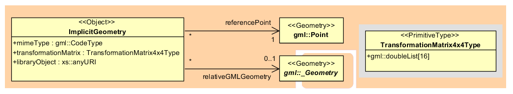
.. |image7| image:: media/image17.png
   :width: 5.51695in
   :height: 6.248in
.. |image8| image:: media/image18.png
   :width: 6.3in
   :height: 4.55556in
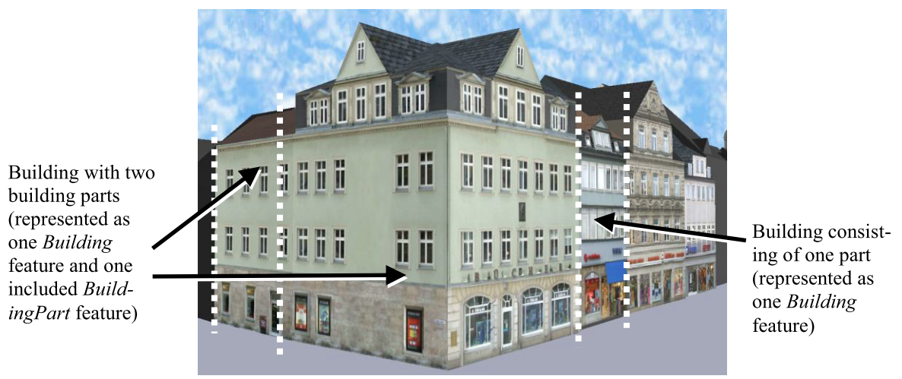
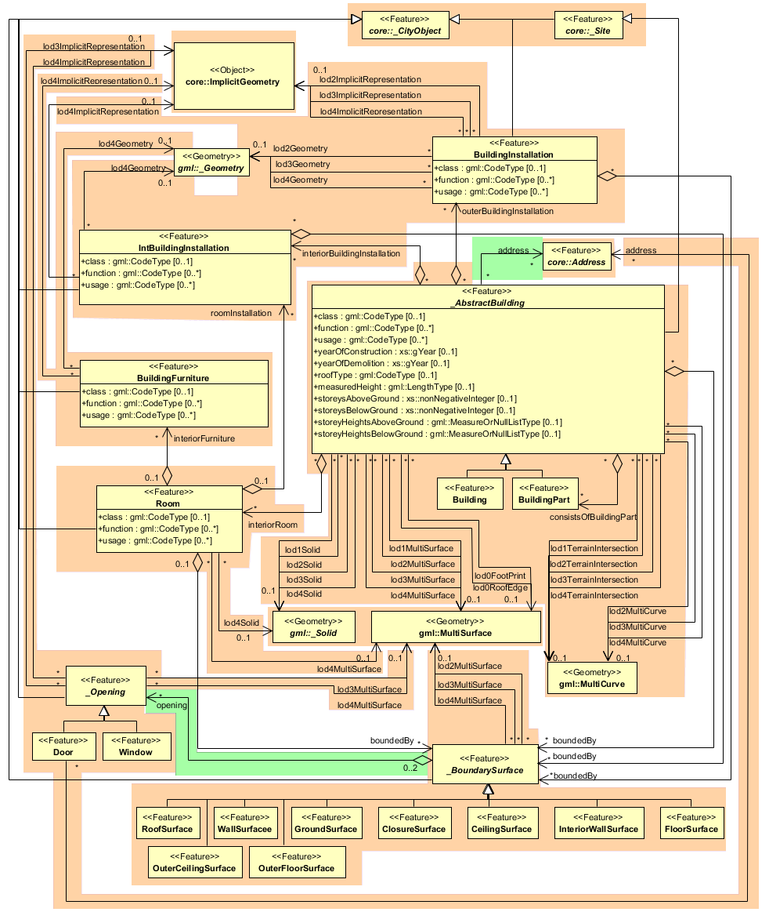
.. |image11| image:: media/image21.png
   :width: 5.78302in
   :height: 2.34483in
.. |image12| image:: media/image22.png
   :width: 4.12264in
   :height: 1.96701in
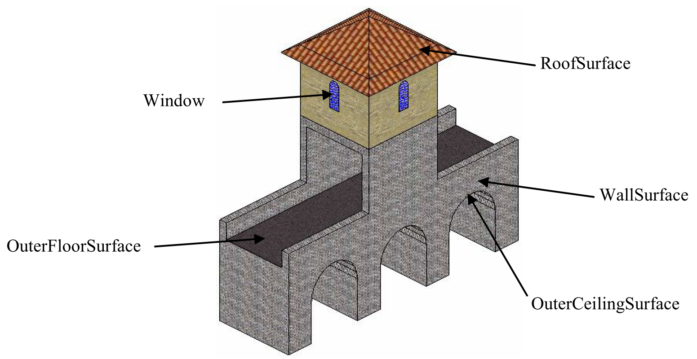
.. |image14| image:: media/image24.png
   :width: 4.72441in
   :height: 2.58121in
.. |image15| image:: media/image25.png
   :width: 6.29931in
   :height: 7.85486in
.. |image16| image:: media/image26.png
   :width: 5.85838in
   :height: 2.9434in
.. |image17| image:: media/image27.png
   :width: 6.29931in
   :height: 4.04306in
.. |DTM_1| image:: media/image28.png
   :width: 2.89565in
   :height: 2.6in
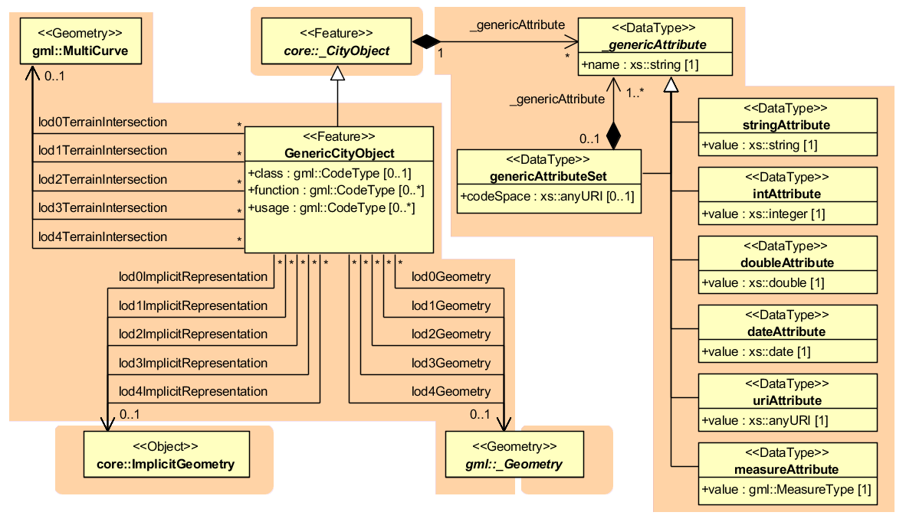
.. |image20| image:: media/image30.png
   :width: 4.60448in
   :height: 1.94848in
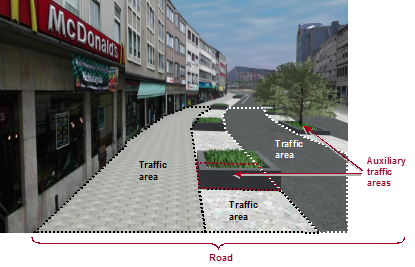
.. |image22| image:: media/image32.png
   :width: 6.3in
   :height: 3.02847in
.. |image23| image:: media/image33.png
   :width: 4.90831in
   :height: 2.66667in
.. |image24| image:: media/image34.png
   :width: 6.29931in
   :height: 7.09236in
.. |image25| image:: media/image35.png
   :width: 5.48148in
   :height: 3.92545in
.. |vegetation1| image:: media/image36.png
   :width: 3.6in
   :height: 2.7in
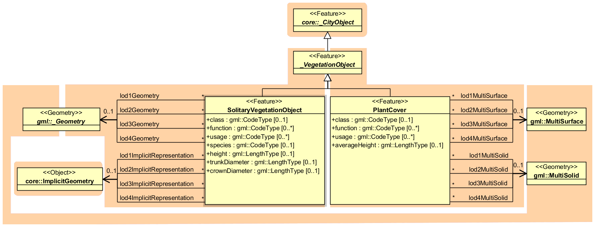
.. |image28| image:: media/image38.wmf
   :width: 3.54792in
   :height: 2.08681in
.. |image29| image:: media/image39.png
   :width: 6.3in
   :height: 2.61528in
.. |image30| image:: media/image40.EMF
   :width: 6.29921in
   :height: 3.49339in
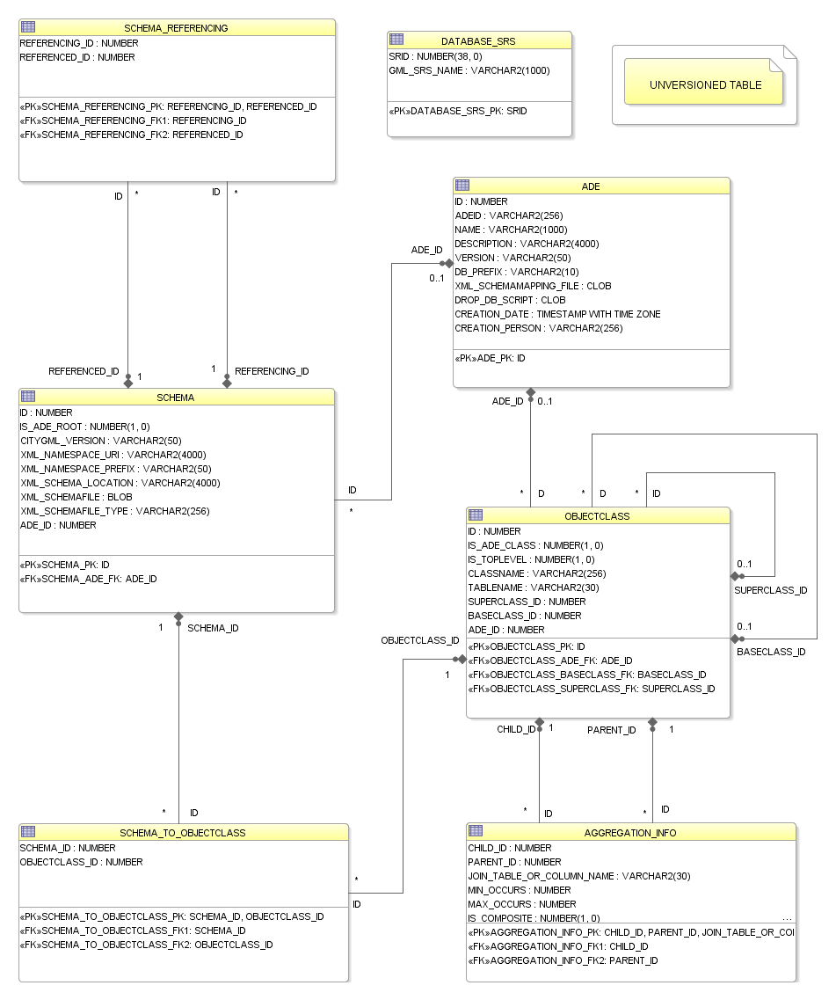
.. |envelope_basis_3f| image:: media/image42.png
   :width: 4.24528in
   :height: 2.31241in
.. |image33| image:: media/image43.png
   :width: 6.29921in
   :height: 5.52144in
.. |image34| image:: media/image44.emf
   :width: 6.3in
   :height: 2.99702in
.. |image35| image:: media/image45.emf
   :width: 1.49583in
   :height: 1.59097in
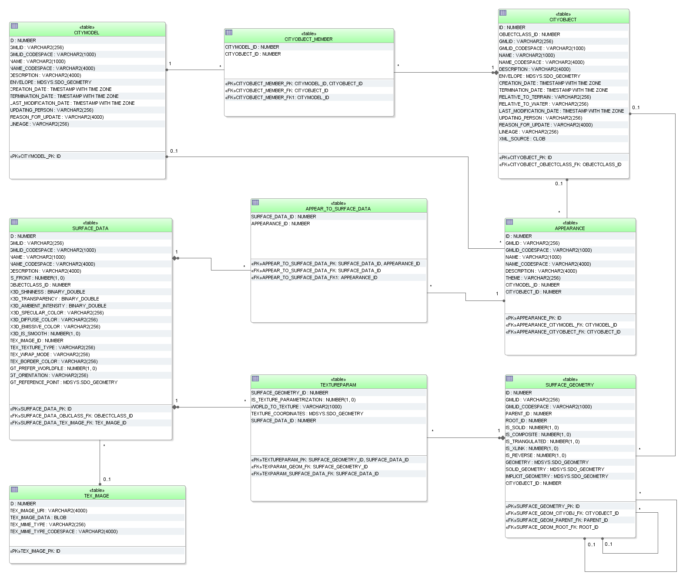
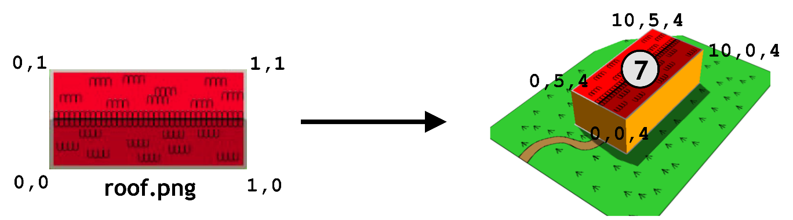
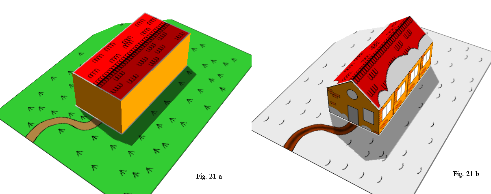
.. |image39| image:: media/image49.png
   :width: 3.75472in
   :height: 3.26415in
.. |image40| image:: media/image51.png
   :width: 0.60417in
   :height: 0.72917in
.. |image41| image:: media/image52.png
   :width: 1.575in
   :height: 0.78056in
.. |image42| image:: media/image53.png
   :width: 1.58333in
   :height: 0.79167in
.. |image43| image:: media/image54.png
   :width: 2.3125in
   :height: 1.72917in
.. |image44| image:: media/image55.png
   :width: 2.3125in
   :height: 1.72917in
.. |image45| image:: media/image56.png
   :width: 9.94218in
   :height: 9.24514in
.. |summer_roofoverhang_last| image:: media/image57.png
   :width: 3.03704in
   :height: 2.01149in
.. |image47| image:: media/image58.png
   :width: 9.84065in
   :height: 9.0579in
.. |image48| image:: media/image59.png
   :width: 5.63412in
   :height: 6.6389in
.. |image49| image:: media/image60.png
   :width: 6.1706in
   :height: 4.68125in
.. |image50| image:: media/image61.png
   :width: 5.30706in
   :height: 6.24138in
.. |image51| image:: media/image62.png
   :width: 5.35486in
   :height: 4.98148in
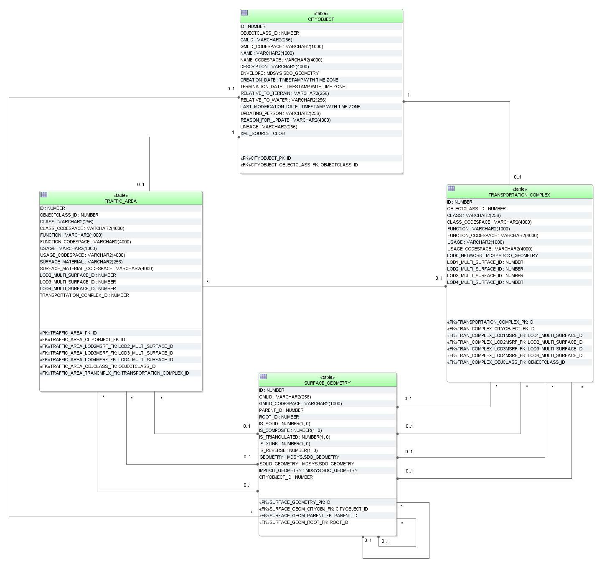
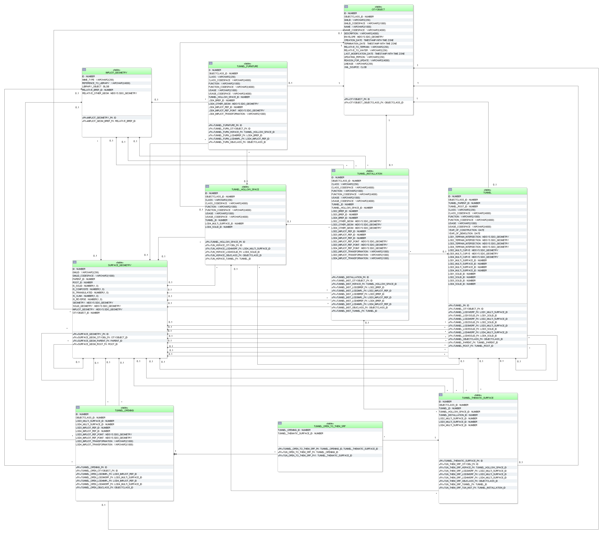
.. |image54| image:: media/image65.png
   :width: 6.13958in
   :height: 7.0463in
.. |image55| image:: media/image66.png
   :width: 6.42634in
   :height: 5.95858in
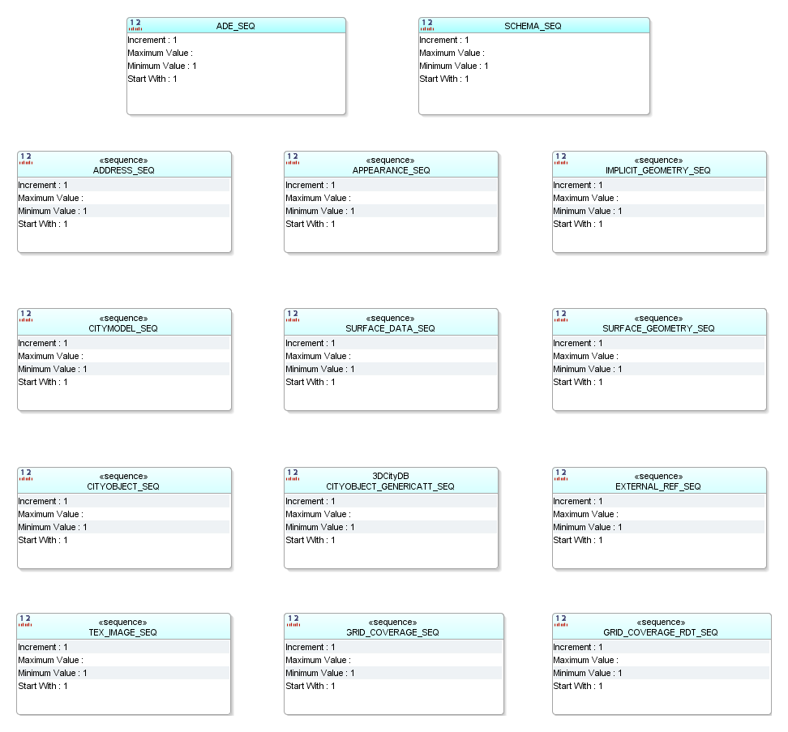
.. |image57| image:: media/image68.png
   :width: 4.58268in
   :height: 3.39205in
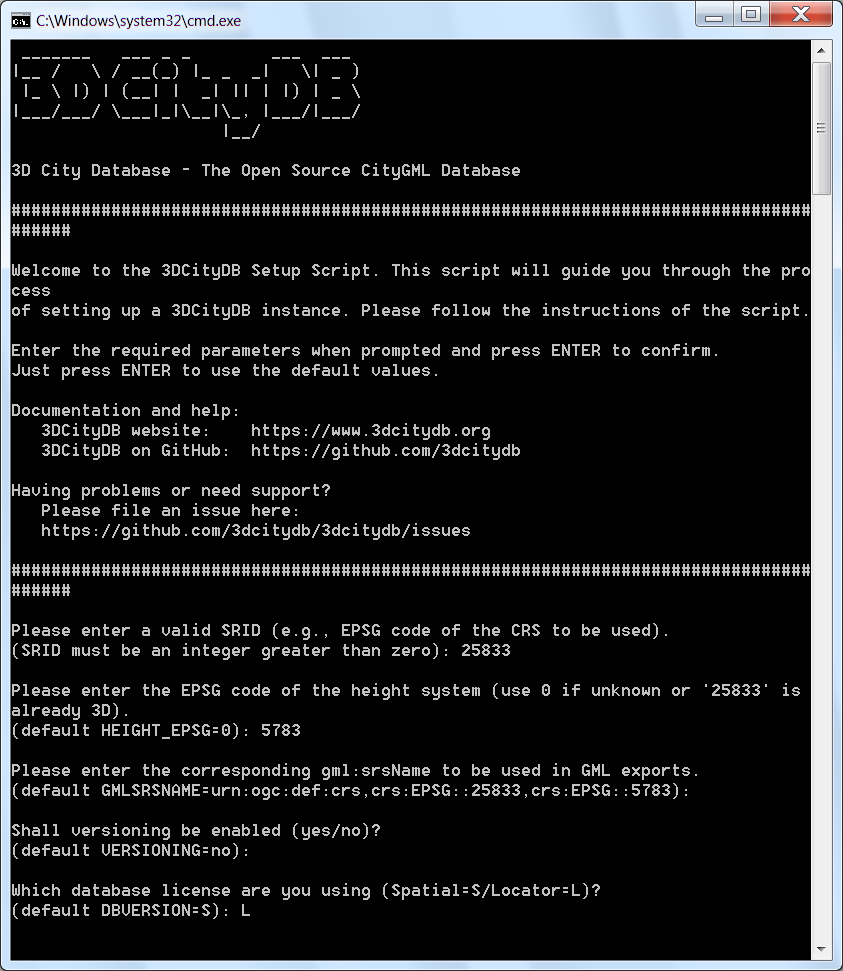
.. |image59| image:: media/image70.PNG
   :width: 4.51876in
   :height: 1.79921in
.. |image60| image:: media/image71.png
   :width: 1.9912in
   :height: 2.45in
.. |image61| image:: media/image72.png
   :width: 1.64967in
   :height: 2.63561in
.. |image62| image:: media/image73.png
   :width: 0.97014in
   :height: 0.34583in
.. |image63| image:: media/image74.png
   :width: 6.3in
   :height: 4.07639in
.. |image64| image:: media/image75.png
   :width: 4.29167in
   :height: 4.39671in
.. |image65| image:: media/image76.png
   :width: 5.07292in
   :height: 2.20248in
.. |image66| image:: media/image77.png
   :width: 5.01042in
   :height: 1.30833in
.. |image67| image:: media/image78.png
   :width: 4.37402in
   :height: 2.03513in

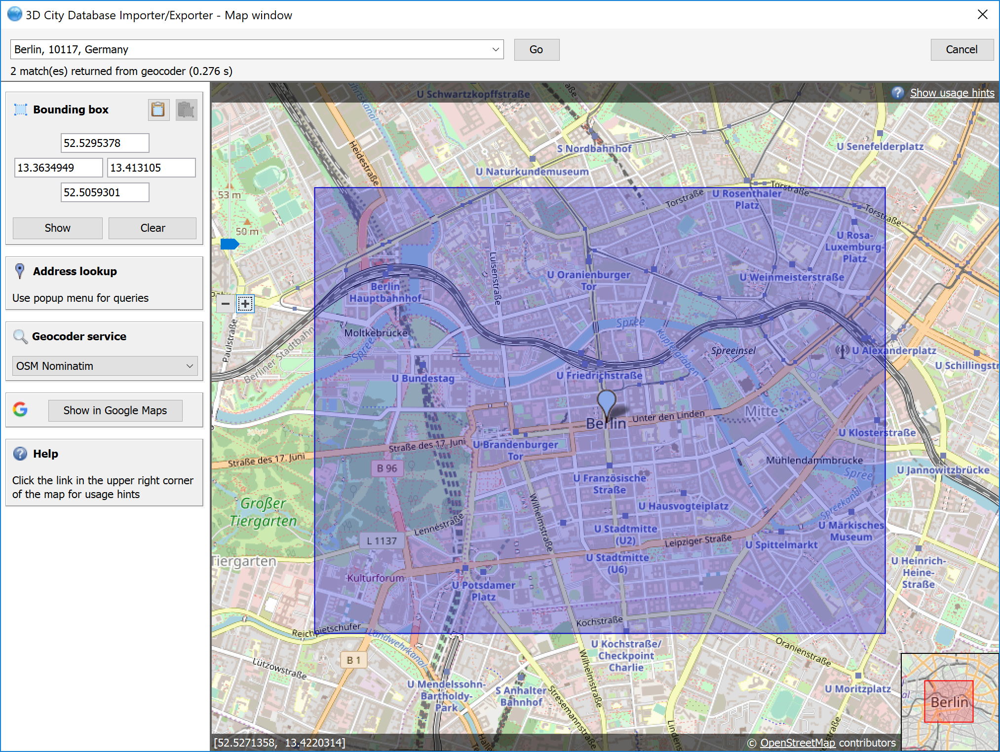
.. |image71| image:: media/image82.png
   :width: 5.08333in
   :height: 1.68225in
.. |image72| image:: media/image83.png
   :width: 4.55208in
   :height: 2.16716in
.. |image73| image:: media/image84.png
   :width: 5.52426in
   :height: 1.95833in
.. |image74| image:: media/image85.png
   :width: 5.65625in
   :height: 1.87893in
.. |image75| image:: media/image86.png
   :width: 3.88542in
   :height: 3.59761in
.. |image76| image:: media/image87.png
   :width: 4.5748in
   :height: 6.46937in
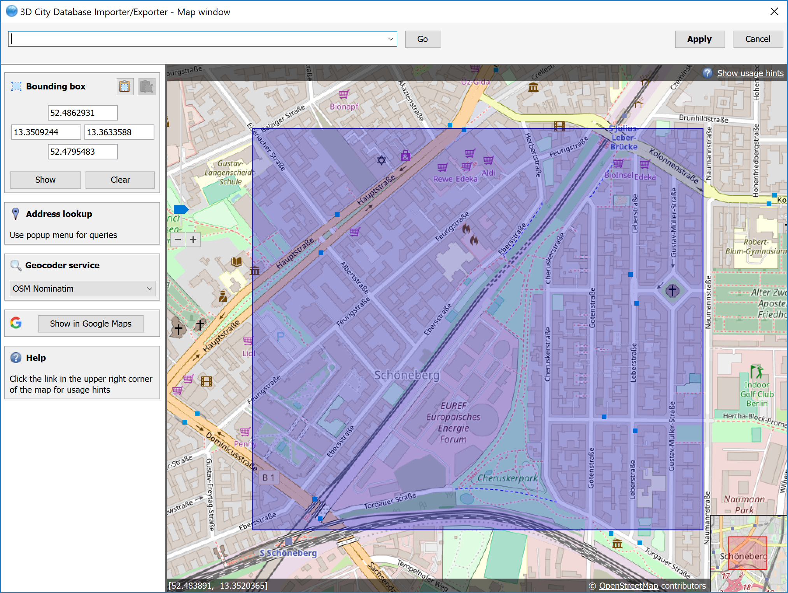
.. |C:\devel\java\impexp-oss\resources\jar\resources\img\common\bbox_paste.png| image:: media/image89.png
   :width: 0.16667in
   :height: 0.16667in
.. |image79| image:: media/image90.png
   :width: 4.87795in
   :height: 6.45608in
.. |image80| image:: media/image91.png
   :width: 5.17391in
   :height: 3.23198in

.. |image82| image:: media/image93.png
   :width: 0.18681in
   :height: 0.18681in
.. |image83| image:: media/image94.png
   :width: 0.18681in
   :height: 0.18681in
.. |image84| image:: media/image95.png
   :width: 5.51181in
   :height: 1.18232in
.. |image85| image:: media/image96.png
.. |image86| image:: media/image96.png
.. |image87| image:: media/image97.png
   :width: 5.56648in
   :height: 6.37826in
.. |image88| image:: media/image98.png
   :width: 6.29797in
   :height: 3.80165in
.. |display_styles| image:: media/image99.png
   :width: 5.89583in
   :height: 5.52083in
.. |image90| image:: media/image100.png
   :width: 5.84653in
   :height: 3.13043in
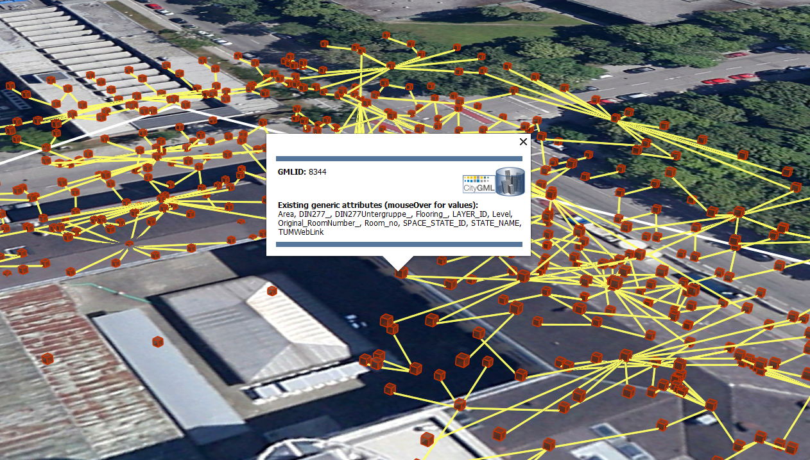
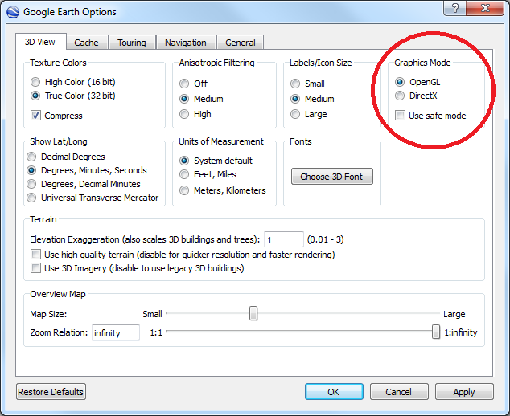
.. |image93| image:: media/image103.png
   :width: 5.11811in
   :height: 4.19727in
.. |image94| image:: media/image104.png
   :width: 5.11811in
   :height: 4.36694in
.. |image95| image:: media/image105.png
   :width: 5in
   :height: 4.35406in
.. |image96| image:: media/image106.png
   :width: 4.44792in
   :height: 4.08412in
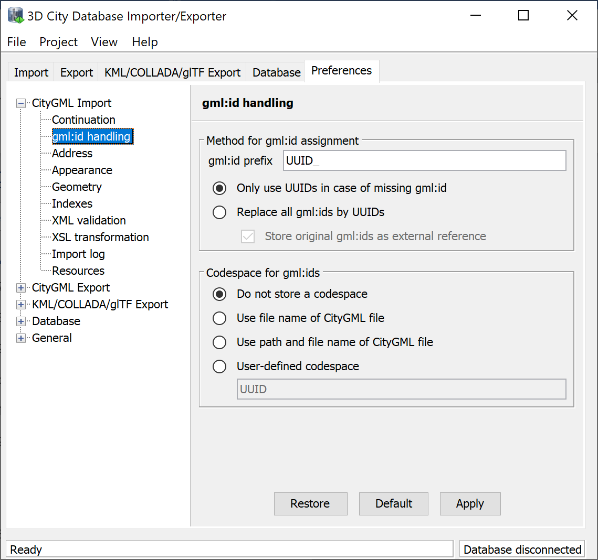
.. |image98| image:: media/image108.png
   :width: 3.85827in
   :height: 3.62563in
.. |image99| image:: media/image109.png
   :width: 3.89764in
   :height: 3.09336in
.. |image100| image:: media/image110.png
   :width: 3.85827in
   :height: 3.06212in
.. |image101| image:: media/image111.png
   :width: 3.85827in
   :height: 3.06212in
.. |image102| image:: media/image112.png
   :width: 3.85827in
   :height: 3.06212in
.. |image103| image:: media/image113.png
   :width: 3.85827in
   :height: 3.06212in
.. |image104| image:: media/image114.png
   :width: 4.44882in
   :height: 2.92076in
.. |image105| image:: media/image115.png
   :width: 3.92593in
   :height: 2.72306in
.. |image106| image:: media/image116.png
   :width: 3.88542in
   :height: 4.77754in
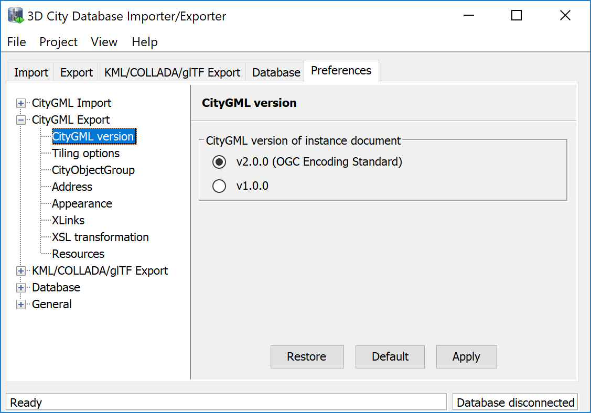
.. |image108| image:: media/image118.png
   :width: 3.85827in
   :height: 3.28667in
.. |image109| image:: media/image119.png
   :width: 3.85827in
   :height: 2.69764in
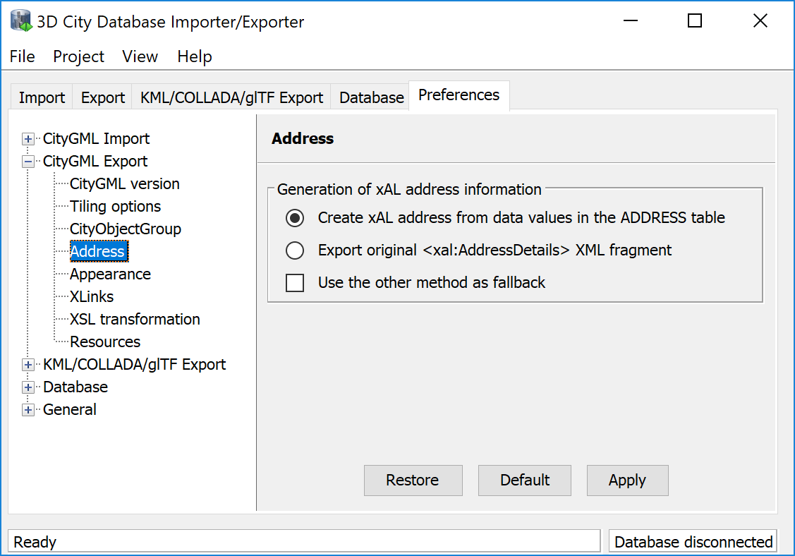
.. |image111| image:: media/image121.png
   :width: 4.08268in
   :height: 2.77804in
.. |image112| image:: media/image122.png
   :width: 3.85827in
   :height: 3.20587in
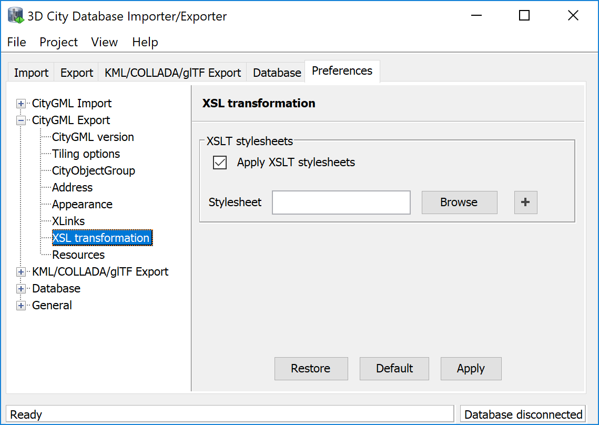
.. |image114| image:: media/image124.png
   :width: 3.85827in
   :height: 3.2518in
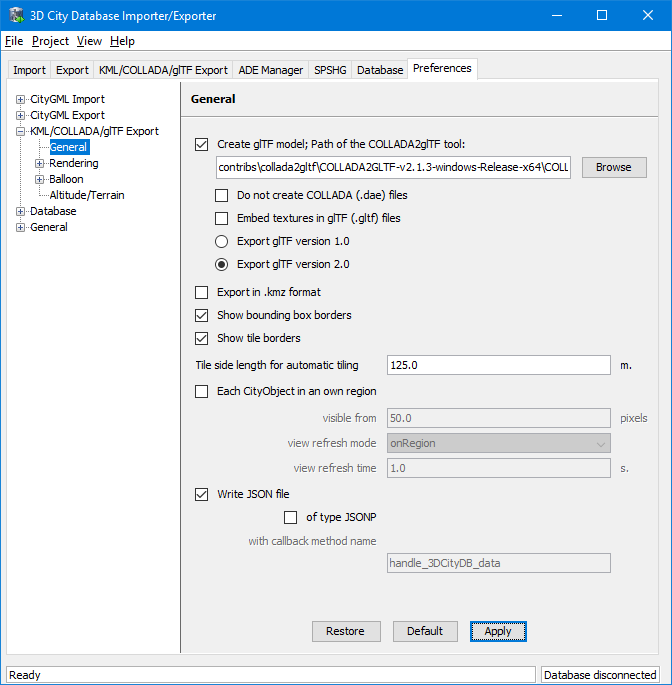
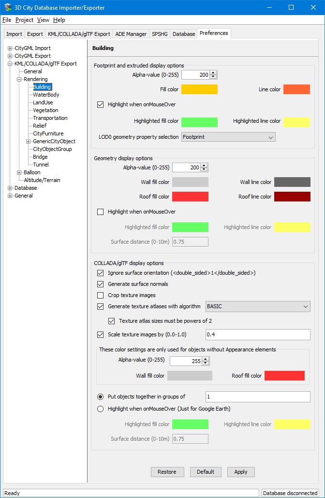
.. |image117| image:: media/image127.png
   :width: 5.6036in
   :height: 3.46387in
.. |image118| image:: media/image128.png
   :width: 5.27928in
   :height: 3.65766in
.. |image119| image:: media/image129.png
   :width: 4.72441in
   :height: 7.21316in
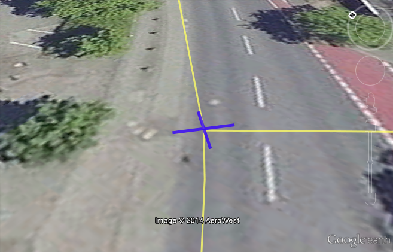
.. |image121| image:: media/image131.png
   :width: 4.72441in
   :height: 3.02566in
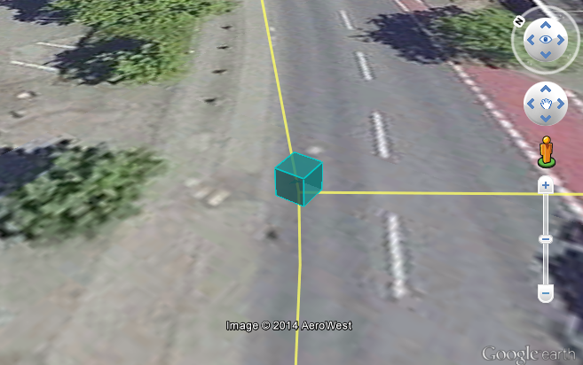
.. |image123| image:: media/image133.png
   :width: 5.41339in
   :height: 3.96337in
.. |Pergamonmuseum_2| image:: media/image134.png
   :width: 5.88696in
   :height: 5.53913in
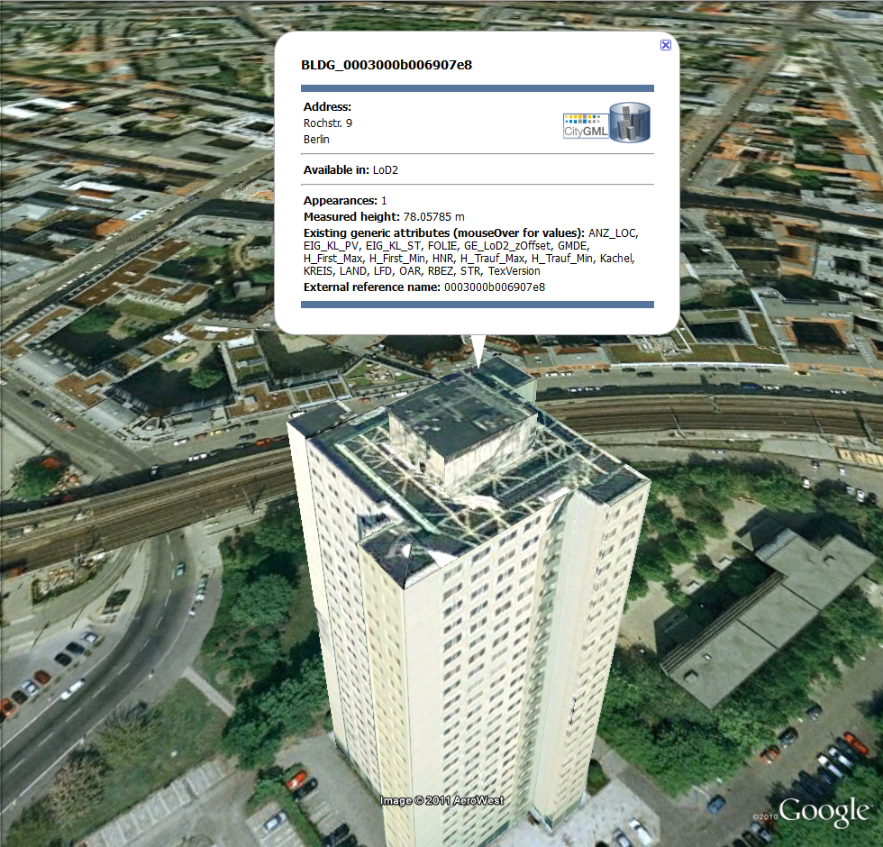
.. |image126| image:: media/image136.png
   :width: 5.41339in
   :height: 3.96337in
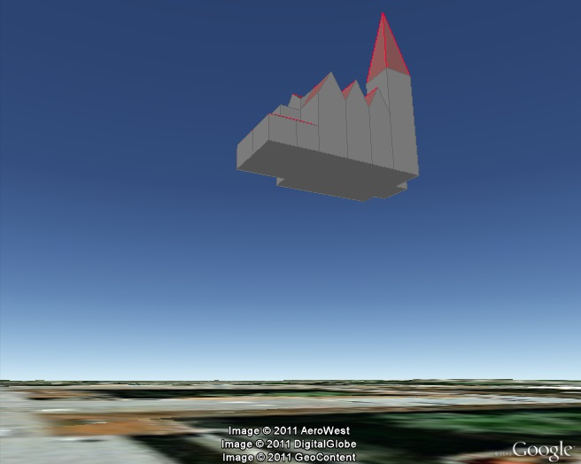
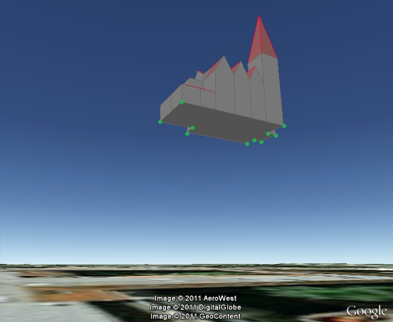
.. |kirche_absolute_without_grounding| image:: media/image139.png
   :width: 5.90551in
   :height: 3.75926in
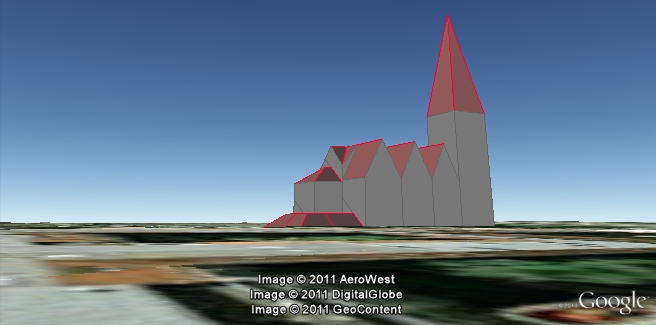
.. |image131| image:: media/image141.png
   :width: 3.94271in
   :height: 3.5985in
.. |image132| image:: media/image142.png
   :width: 3.94094in
   :height: 3.59689in
.. |image133| image:: media/image143.png
   :width: 3.85827in
   :height: 2.39568in
.. |image134| image:: media/image144.png
   :width: 3.85827in
   :height: 2.84947in
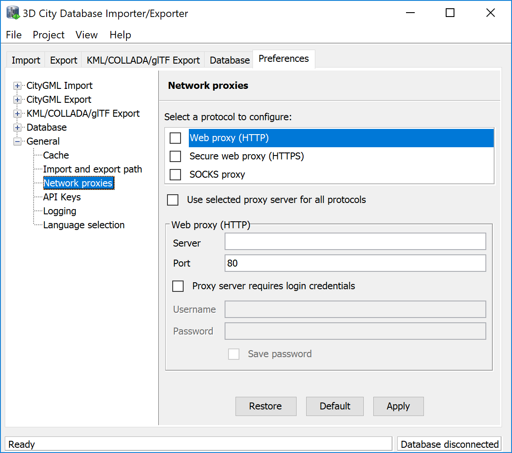
.. |image136| image:: media/image146.png
   :width: 3.85827in
   :height: 2.3825in
.. |image137| image:: media/image147.png
   :width: 3.85827in
   :height: 3.62393in
.. |image138| image:: media/image148.png
   :width: 3.85827in
   :height: 2.4918in
.. |image139| image:: media/image149.png
   :width: 2.18518in
   :height: 0.95872in
.. |image140| image:: media/image150.png
   :width: 5.28302in
   :height: 0.83333in
.. |image141| image:: media/image151.png
   :width: 5.42913in
   :height: 4.08681in

.. |image144| image:: media/image154.png
   :width: 5.42913in
   :height: 4.0904in
.. |image145| image:: media/image155.png
   :width: 2.63806in
   :height: 2.44444in

.. |C:\devel\java\impexp\resources\jar\resources\img\common\bbox_paste.png| image:: media/image89.png
   :width: 0.16667in
   :height: 0.16667in
.. |image148| image:: media/image156.png
   :width: 3.85827in
   :height: 3.17354in
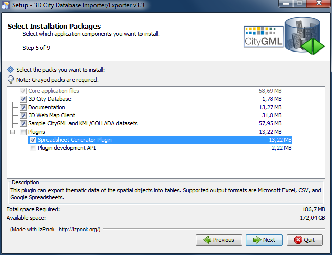
.. |image150| image:: media/image158.PNG
   :width: 4.78024in
   :height: 5.86512in
.. |image151| image:: media/image159.PNG
   :width: 3.99681in
   :height: 6.24324in
.. |image152| image:: media/image160.PNG
   :width: 4.71099in
   :height: 4.63648in
.. |image153| image:: media/image161.emf
   :width: 5.96111in
   :height: 2.53153in
.. |image154| image:: media/image162.png
   :width: 4.72352in
   :height: 2.90909in
.. |image155| image:: media/image163.png
   :width: 5.51181in
   :height: 1.78806in
.. |image156| image:: media/image164.png
   :width: 5.51106in
   :height: 3.83019in
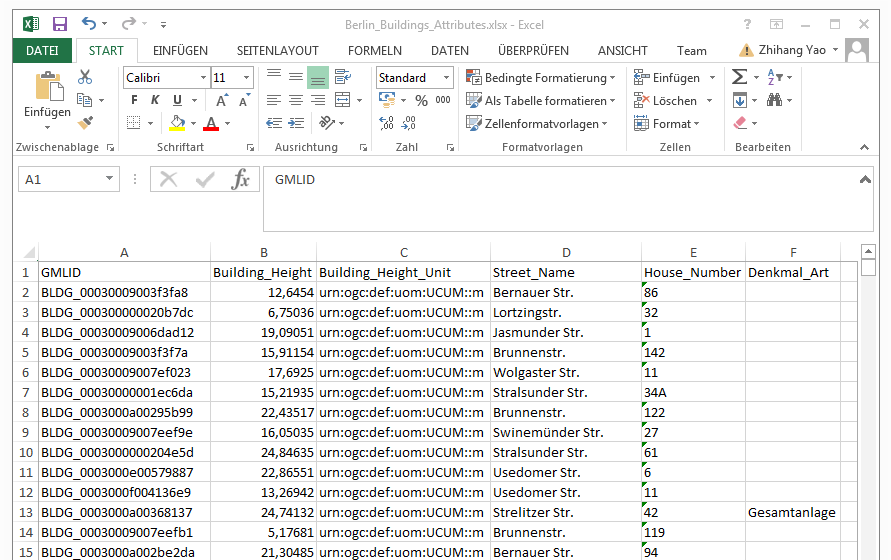
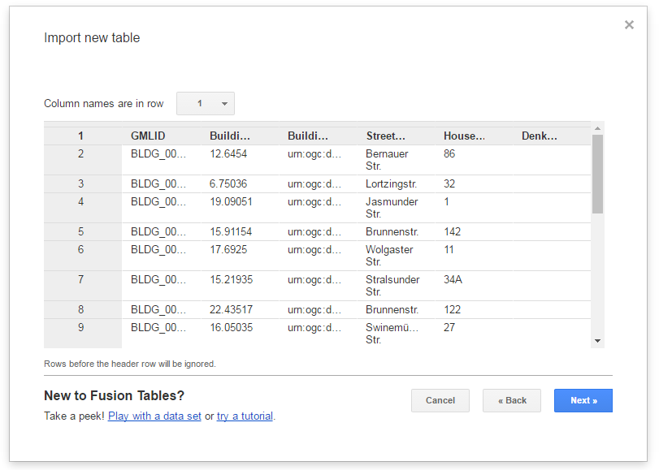
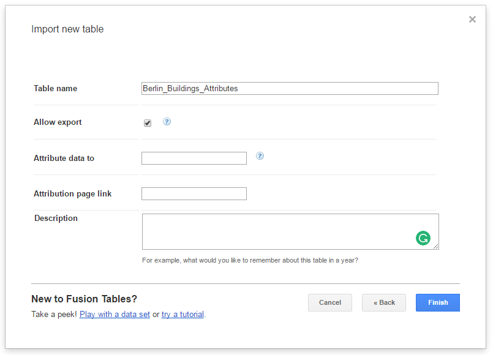
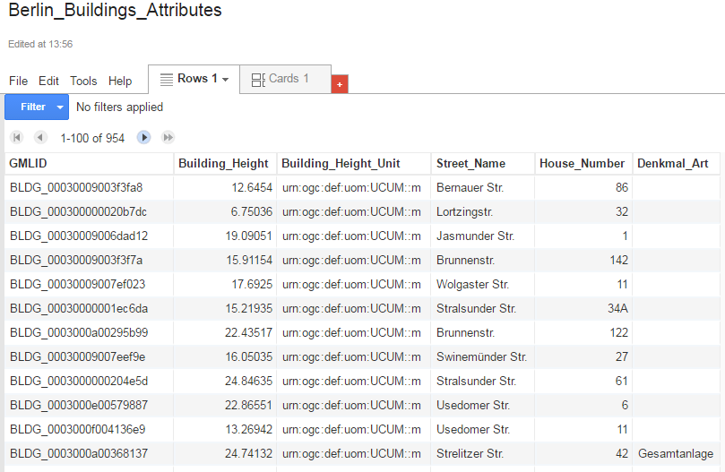
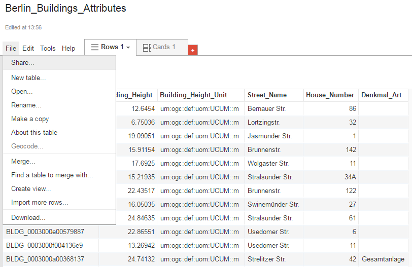

.. |image164| image:: media/image172.png
   :width: 5.51181in
   :height: 3.55667in
.. |image165| image:: media/image173.png
   :width: 5.11811in
   :height: 3.77596in
.. |image166| image:: media/image174.png
   :width: 6.3in
   :height: 6.92708in
.. |image167| image:: media/image175.png
   :width: 2.63308in
   :height: 2.10417in
.. |image168| image:: media/image176.png
   :width: 6.3in
   :height: 2.25972in
.. |image169| image:: media/image177.png
   :width: 6.3in
   :height: 2.45625in
.. |image170| image:: media/image178.png
   :width: 2.9375in
   :height: 2.7731in
.. |image171| image:: media/image179.png
   :width: 4.75in
   :height: 3.11914in
.. |image172| image:: media/image180.png
   :width: 6.29694in
   :height: 3.46512in
.. |image173| image:: media/image181.jpg
   :width: 5.51181in
   :height: 3.60313in
.. |image174| image:: media/image182.png
   :width: 2.35347in
   :height: 3.95715in
.. |image175| image:: media/image183.png
   :width: 6.3in
   :height: 3.52083in
.. |image176| image:: media/image184.png
   :width: 6.3in
   :height: 3.36458in
.. |image177| image:: media/image185.png
   :width: 6.3in
   :height: 7.14931in
.. |image178| image:: media/image186.png
   :width: 4.0279in
   :height: 2.25in
.. |image179| image:: media/image187.png
   :width: 6.3in
   :height: 4.32778in
.. |image180| image:: media/image188.png
   :width: 6.3in
   :height: 4.17917in
.. |image181| image:: media/image73.png
   :width: 0.97014in
   :height: 0.34583in
.. |image182| image:: media/image189.png
   :width: 3.95312in
   :height: 2.75699in
.. |image183| image:: media/image190.png
   :width: 5.42953in
   :height: 4.58446in
.. |image184| image:: media/image191.png
   :width: 6.31463in
   :height: 4.03602in
.. |image185| image:: media/image192.png
   :width: 2.1405in
   :height: 2.08631in
.. |image186| image:: media/image193.png
   :width: 5.50972in
   :height: 1.78512in
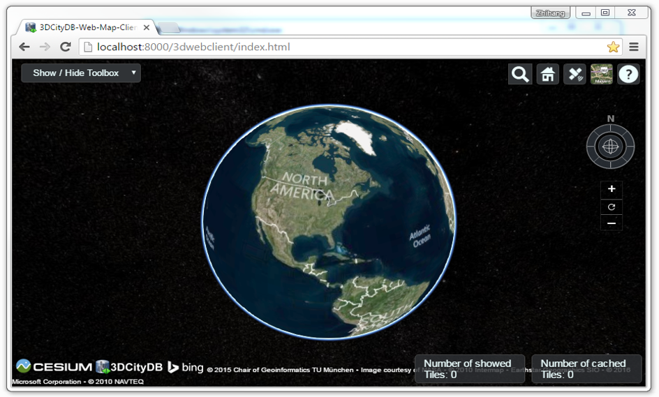
.. |image188| image:: media/image195.png
   :width: 6.17557in
   :height: 4.21538in

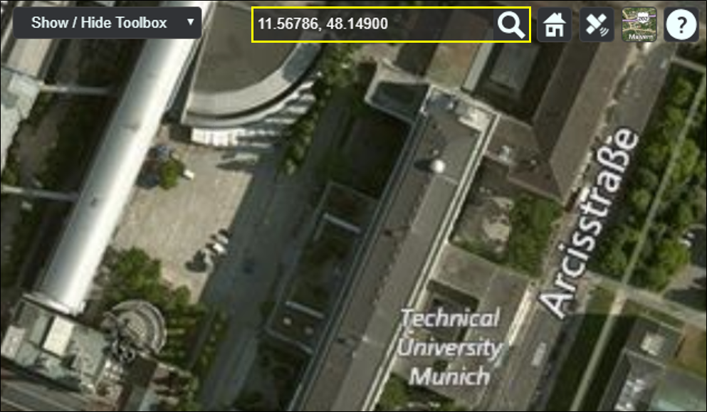
.. |image192| image:: media/image198.png
   :width: 0.18182in
   :height: 0.18768in
.. |image193| image:: media/image199.png
   :width: 0.18683in
   :height: 0.18898in
.. |image194| image:: media/image200.png
   :width: 6.29498in
   :height: 5.22917in

.. |image196| image:: media/image202.png
   :width: 6.29774in
   :height: 3.48542in
.. |image197| image:: media/image203.png
   :width: 5.21875in
   :height: 3.42974in
.. |image198| image:: media/image172.png
   :width: 6.11813in
   :height: 3.94792in
.. |image199| image:: media/image209.PNG
   :width: 6.3in
   :height: 4.15333in
.. |image200| image:: media/image210.png
   :width: 6.3in
   :height: 3.976in
.. |image201| image:: media/image211.PNG
   :width: 6.3079in
   :height: 3.11458in
.. |image202| image:: media/image212.PNG
   :width: 6.30709in
   :height: 4.35167in
.. |image203| image:: media/image213.PNG
   :width: 6.30625in
   :height: 3.77083in
.. |image204| image:: media/image214.PNG
   :width: 6.30119in
   :height: 4.14517in
.. |image205| image:: media/image215.PNG
   :width: 6.3026in
   :height: 4.07502in
.. |image206| image:: media/image216.PNG
   :width: 6.3in
   :height: 4.18in
.. |image207| image:: media/image217.PNG
   :width: 6.29502in
   :height: 4.21667in
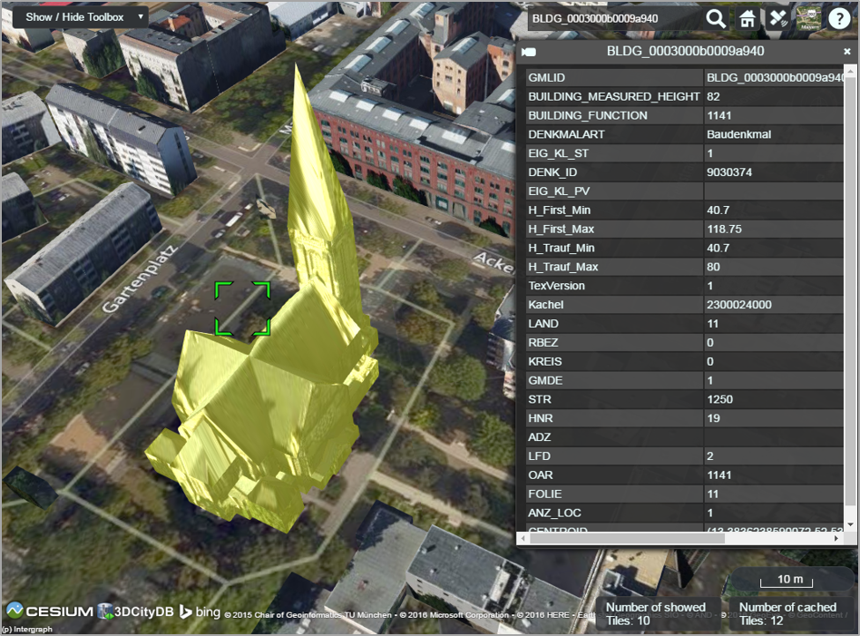
.. |image209| image:: media/image219.PNG
   :width: 6.30338in
   :height: 4.04884in
.. |image210| image:: media/image220.png
   :width: 6.3in
   :height: 4.16181in
.. |image211| image:: media/image221.PNG
   :width: 6.3in
   :height: 4.19333in
.. |image212| image:: media/image222.PNG
   :width: 6.3in
   :height: 4.2in
.. |image213| image:: media/image223.PNG
   :width: 6.3in
   :height: 4.20667in
.. |image214| image:: media/image224.PNG
   :width: 6.3in
   :height: 4.20667in
.. |image215| image:: media/image225.PNG
   :width: 6.3in
   :height: 4.19333in
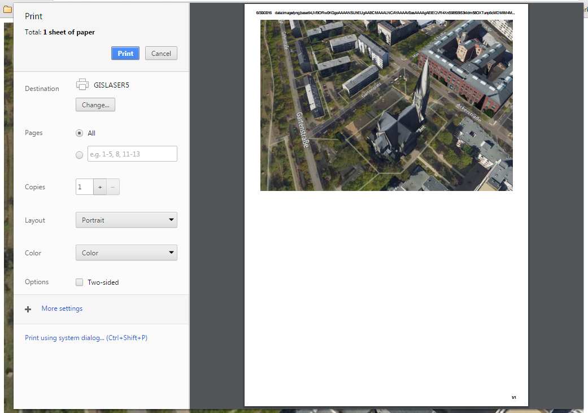
.. |image217| image:: media/image227.PNG
   :width: 6.29834in
   :height: 4.20556in
.. |image218| image:: media/image228.PNG
   :width: 6.3in
   :height: 3.7in
.. |image219| image:: media/image229.PNG
   :width: 2.73236in
   :height: 4.86021in
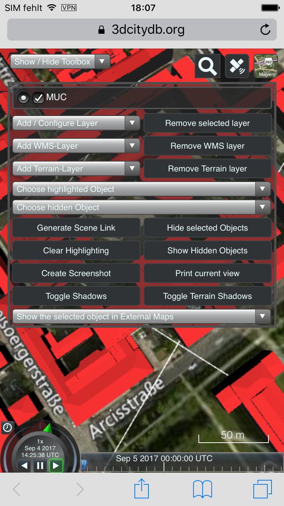
.. |image221| image:: media/image231.PNG
   :width: 2.87402in
   :height: 5.11219in
.. |image222| image:: media/image232.png
   :width: 3.7037in
   :height: 1.15434in
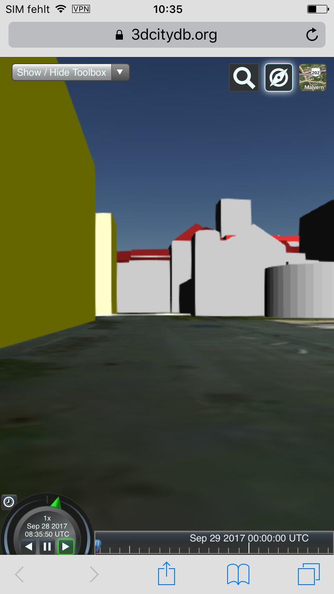
.. |image224| image:: media/image234.png
   :width: 1.29921in
   :height: 1.59142in
.. |image225| image:: media/image235.jpg
   :width: 6.3in
   :height: 3.48194in
.. |image226| image:: media/image236.png
   :width: 1.34653in
   :height: 1.84375in
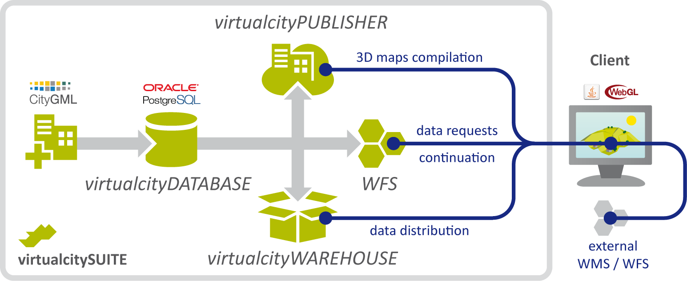
.. |image228| image:: media/image238.png
   :width: 4.5067in
   :height: 2.5375in
.. |visualisation heating demand Rotterdam| image:: media/image239.png
   :width: 3.58371in
   :height: 2.15in
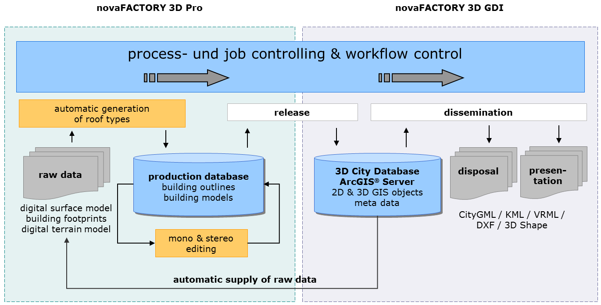
