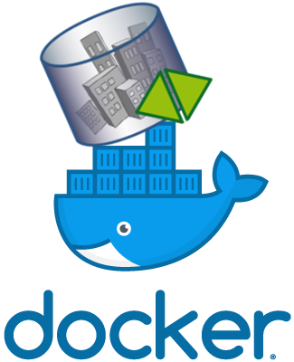
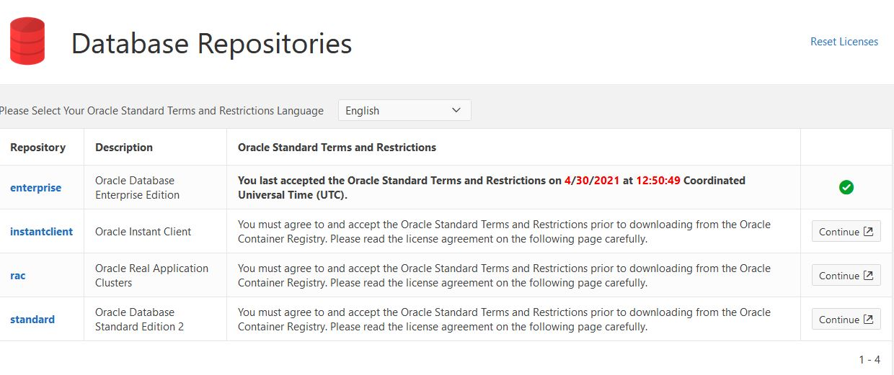

.. _citydb_docker_chapter:

###############################################################################
3D City Database using Docker
###############################################################################

The 3DCityDB Docker images are available for *PostgreSQL/PostGIS* and *Oracle*.
The PostgreSQL/PostGIS version is based on the official
`PostgreSQL <postgres_github_>`_ and
`PostGIS <postgis_github_>`_ Docker images.
The Oracle version is based on the
*Oracle Database Enterprise Edition* images available from the
`Oracle Container registry <https://container-registry.oracle.com>`_.
The images described here are available for 3DCityDB version ``v4.0.0`` and newer.
Images for older 3DCityDB versions are available from
`TUM-GIS 3DCityDB Docker images <https://github.com/tum-gis/
3dcitydb-docker-postgis>`_.

When designing the images we tried to stay as close as possible to the behavior of
the base images and the :ref:`3DCityDB Shell scripts <3dcitydb_shell_scripts>`.
Thus, all configuration options you may be used to from the base images, are
available for the 3DCityDB Docker images as well.

.. rubric:: Synopsis

.. code-block:: bash
  :name: citydb_docker_code_synopsis_psql
  :caption: Synopsis 3DCityDB Docker PostgreSQL/PostGIS

  docker run --name 3dciytdb -p 5432:5432 -d \
      -e POSTGRES_PASSWORD=<theSecretPassword> \
      -e SRID=<EPSG code> \
      [-e HEIGHT_EPSG=<EPSG code>] \
      [-e GMLSRSNAME=<mySrsName>] \
      [-e POSTGRES_DB=<database name>] \
      [-e POSTGRES_USER=<username>] \
      [-e POSTGIS_SFCGAL=<true|false|yes|no>] \
    3dcitydb/3dcitydb-pg

.. code-block:: bash
  :name: citydb_docker_code_synopsis_oracle
  :caption: Synopsis 3DCityDB Oracle

  docker run --name 3dciytdb -p 1521:1521 -d \
      -e ORACLE_USER=<theUserName> \
      -e ORACLE_PASSWORD=<theSecretPassword> \
      -e SRID=<EPSG code> \
      [-e HEIGHT_EPSG=<EPSG code>] \
      [-e GMLSRSNAME=<mySrsName>] \
      [-e ORACLE_PDB=<pluggable database name>] \
      [-e DBVERSION=<oracle license option>] \
      [-e VERSIONING=<version-enabled>] \
    3dcitydb/3dcitydb-oracle

.. _citydb_docker_image_variants:

*******************************************************************************
Image variants and versions
*******************************************************************************

The images are available in various *variants* and *versions*. The
PostgreSQL/PostGIS images are available based on *Debian* and *Alpine Linux*,
the Oracles image are based on *Oracle Linux*.
:numref:`citydb_docker_tbl_images` gives an overview on the available image
versions.

.. list-table:: 3DCityDB Docker image variants and versions for PostgreSQL/PostGIS.
  :widths: auto
  :header-rows: 1
  :stub-columns: 1
  :align: center
  :name: citydb_docker_tbl_images

  * - Tag
    - PostGIS (Debian)
    - PostGIS (Alpine)
    - Oracle
  * - edge
    - |psql-deb-build-edge| |psql-deb-size-edge|
    - |psql-alp-build-edge| |psql-alp-size-edge|
    - |ora-build-edge| |ora-size-edge|
  * - latest
    - |psql-deb-size-latest|
    - |psql-alp-size-latest|
    - |ora-size-edge|
  * - 4.0.0
    - |psql-deb-size-v4.0.0|
    - |psql-alp-size-v4.0.0|
    - |ora-size-edge|

.. note::
  | Minor releases are not listed in this table.
  | The latest 3DCityDB version is: |version-badge-github|
  | The latest image version on DockerHub is: |version-badge-dockerhub|
  | The latest image version on DockerHub is: |version-badge-ghcr|

The **edge** images are automatically built and published on every push to the
*master* branch of the `3DCityDB Github repository <https://github.com/3dcitydb/
3dcitydb>`_
using the latest stable version of the base images.
The **latest** and **release** image versions are only built
when a new release is published on Github. The **latest** tag will point to
the most recent release version using the latest base image version.

.. _citydb_docker_image_pg:

PostgreSQL/PostGIS images
===============================================================================

The PostgreSQL/PostGIS images are available from
`3DCityDB DockerHub <https://hub.docker.com/r/3dcitydb/3dcitydb-pg>`_ and
`Github container registry <https://github.com/3dcitydb/3dcitydb/pkgs/container/3dcitydb-pg>`_.

.. code-block:: Shell

  docker pull 3dcitydb/3dcitydb-pg[:TAG]
  docker pull ghcr.io/3dcitydb/3dcitydb-pg[:TAG]

The image tags are compose of the *base image version*, the
*3DCityDB version* and the *image variant*,
``<base image version>-<3DCityDB version>-<image variant>``.
The base image version is inherited
from the `PostGIS Docker images <https://hub.docker.com/r/postgis/postgis/tags>`_.
Debian is the default image variant, where no image variant is appended to the
tag. For the Alpine Linux images ``-alpine`` is appended. Currently supported
base image versions are listed in :numref:`citydb_docker_tbl_pgversions`.

.. note:: Depending on the

.. list-table:: Overview on supported PostgreSQL/PostGIS versions.
  :widths: auto
  :header-rows: 1
  :stub-columns: 1
  :align: center
  :name: citydb_docker_tbl_pgversions

  * - PostgreSQL/PostGIS version
    - 2.5
    - 3.0
    - 3.1
    - 3.2
    - 3.3
    - 3.4
  * - 12
    - 12-2.5
    - 12-3.0
    - 12-3.1
    - 12-3.2
    - 12-3.3
    - 12-3.4
  * - 13
    -
    - 13-3.0
    - 13-3.1
    - 13-3.2
    - 13-3.3
    - 13-3.4
  * - 14
    -
    -
    - 14-3.1
    - 14-3.2
    - 14-3.3
    - 14.3.4
  * - 15
    -
    -
    -
    -
    - 15-3.3
    - 15-3.4
  * - 16
    -
    -
    -
    -
    - 16-3.3
    - 16-3.4

The full list of available images can be found on `DockerHub <https://hub.
docker.com/r/3dcitydb/3dcitydb-pg/tags?page=1&ordering=last_updated>`_ or
`Github <https://github.com/3dcitydb/3dcitydb/pkgs/container/3dcitydb-pg>`_.
Here are some examples for full image tags:

.. code-block:: shell

  docker pull 3dcitydb/3dcitydb-pg:9.5-2.5-4.4.0
  docker pull 3dcitydb/3dcitydb-pg:13-3.2-4.4.0
  docker pull 3dcitydb/3dcitydb-pg:13-3.2-4.4.0-alpine
  docker pull 3dcitydb/3dcitydb-pg:16-3.4-4.4.0-alpine

  docker pull ghcr.io/3dcitydb/3dcitydb-pg:9.5-2.5-4.4.0
  docker pull ghcr.io/3dcitydb/3dcitydb-pg:13-3.2-4.4.0
  docker pull ghcr.io/3dcitydb/3dcitydb-pg:13-3.2-4.4.0-alpine
  docker pull ghcr.io/3dcitydb/3dcitydb-pg:16-3.4-4.4.0-alpine

.. _citydb_docker_image_oracle:

Oracle images
===============================================================================

Due to Oracle licensing conditions we cannot offer 3DCityDB images based on Oracle
in a public repository like DockerHub at the
moment. However, you can easily build the images yourself. A detailed description
of how to do that is available in :numref:`citydb_docker_oracle_build`.

.. _citydb_docker_config:

*******************************************************************************
Usage and configuration
*******************************************************************************

A 3DCityDB container is configured by settings environment variables inside
the container. For instance, this can be done using the ``-e VARIABLE=VALUE``
flag of `docker run <https://docs.docker.com/engine/reference/run/#env-
environment-variables>`_. The 3DCityDB Docker images introduce the variables
:option:`SRID`, :option:`HEIGHT_EPSG` and :option:`GMLSRSNAME`. Their behavior
is described here.
Furthermore, some variables inherited from the base images offer important
configuration options, they are described separately for the
:ref:`PostgreSQL/PostGIS <citydb_docker_config_psql>` and
:ref:`Oracle <citydb_docker_config_oracle>` image variants.

.. tip:: All variables besides :option:`POSTGRES_PASSWORD` and
  :option:`ORACLE_PWD` are optional.

.. option:: SRID=<EPSG code>

  EPSG code for the 3DCityDB instance. If :option:`SRID` is not set,
  the 3DCityDB schema will not be setup in the default database and
  you will end up with a plain PostgreSQL/PostGIS or Oracle container.

.. option:: HEIGHT_EPSG=<EPSG code>

  EPSG code of the height system, omit or use 0 if unknown or
  :option:`SRID` is already 3D. This variable is used only for the automatic
  generation of :option:`GMLSRSNAME`.

.. option:: GMLSRSNAME=<mySrsName>

  If set, the automatically generated :option:`GMLSRSNAME` from :option:`SRID`
  and :option:`HEIGHT_EPSG` is overwritten. If not set, the variable will
  be created automatically like this:

  If only :option:`SRID` is set: :option:`GMLSRSNAME` =
  ``urn:ogc:def:crs:EPSG::SRID``

  If :option:`SRID` and :option:`HEIGHT_EPSG` are set:
  :option:`GMLSRSNAME` = ``urn:ogc:def:crs,crs:EPSG::SRID,crs:EPSG::HEIGHT_EPSG``

.. _citydb_docker_config_psql:

PostgreSQL/PostGIS environment variables
===============================================================================

The 3DCityDB PostgreSQL/PostGIS Docker images make use of the following
environment variables inherited from the official
`PostgreSQL <postgres_dockerhub_>`_ and
`PostGIS <postgis_dockerhub_>`_ Docker images. Refer to
the documentations of both images for much more configuration options.

.. option:: POSTGRES_DB=<database name>

  Set name for the default database. If not set, the default database is named
  like :option:`POSTGRES_USER`.

.. option::  POSTGRES_USER=<username>

  Set name for the database user, defaults to ``postgres``.

.. option:: POSTGRES_PASSWORD=<password>

  Set the password for the database connection. This variable is **mandatory**.

.. option:: POSTGIS_SFCGAL=<true|false|yes|no>

  If set, `PostGIS SFCGAL <http://www.sfcgal.org/>`_ support is
  enabled. **Note:** SFCGAL may not be available in some older
  Alpine based images (PostgresSQL ``< v12``). Refer to the
  `official PostGIS Docker docs <postgis_dockerhub_>`_ for more details.
  Setting the variable on those images will have no effect.

.. _citydb_docker_config_oracle:

Oracle environment variables
===============================================================================

.. option:: DBUSER=<username>

  The database user name of the 3DCityDB instance to be created. The default value
  is 'citydb'.

.. option:: ORACLE_PWD=<password>

  The database password of the 3DCityDB instance to be created. This variable is
  mandatory.

.. option:: ORACLE_PDB=<pluggable database name>

  set the name of the pluggable database (PDB) that should be used (default:
  'ORCLPDB1'). Requires Oracle 12c or higher.

.. option:: VERSIONING=<version-enabled>

  'yes' or 'no' (default value) to specify whether the 3DCityDB instance should be
  versioned-enabled based on the Oracle's Workspace Manager.

.. _citydb_docker_build:

*******************************************************************************
How to build images
*******************************************************************************

This section describes how to build 3DCityDB Docker images on your own. Both
the PostgreSQL/PostGIS and Oracle version offer one build argument, that can
be used to set the tag of the base image that is used.

.. option:: BASEIMAGE_TAG=<tag of the base image>

  Tag of the base image that is used for the build. Available tags can be
  found on DockerHub for the `PostgreSQL/PostGIS images <https://registry.hub.
  docker.com/r/postgis/postgis/tags?page=1&ordering=last_updated>`_ and in
  the `Oracle container registry <https://container-registry.oracle.com>`_.

.. _citydb_docker_psql_build:

PostgreSQL/PostGIS
===============================================================================

The PostgreSQL/PostGIS images are build by cloning the 3DCityDB Github repository
and running `docker build <https://docs.docker.com/engine/reference/commandline
/build/>`_:

1. Clone 3DCityDB Github repository and navigate to the ``postgresql`` folder in
   the repo:

   .. code-block:: bash

    git clone https://github.com/3dcitydb/3dcitydb.git
    cd 3dcitydb/postgresql/

2. Build the Postgresql/PostGIS image using `docker build <https://docs.docker.com
/engine/reference/commandline/build/>`_:

  .. code-block:: bash

    docker build -t 3dcitydb/3dcitydb-pg .

    # or with a specific base image tag
    docker build -t 3dcitydb/3dcitydb-pg \
        --build-arg BASEIMAGE_TAG=16-3.4 \
      .

.. _citydb_docker_oracle_build:

Oracle
===============================================================================

To build 3DCityDB Docker images for Oracle, you first need a Docker image for
the Oracle database. You can either build the Oracle image yourself using the
Dockerfiles and guidelines provided in the
`Oracle GitHub repository <https://github.com/oracle/docker-images>`_.
Alternatively, you can download a pre-built Oracle database image from the
`Oracle Container registry <https://container-registry.oracle.com>`_.

.. note::
  The Oracle database is a commercial product and is subject to license terms
  and conditions of use. Make sure you observe these terms and conditions before
  building and using an Oracle database image.

The following steps illustrate how to build a 3DCityDB image based on a pre-built
Oracle database image from the Oracle Container registry. You need to create
an Oracle account and accept the licensing conditions first.

1. Visit https://login.oracle.com/mysso/signon.jsp and create an account.

2. Visit https://container-registry.oracle.com and navigate to *Database*.
   Click the *Continue* button in the right column of the *enterprise* repository.
   Scroll to the bottom of the license agreement, which should be displayed
   now and click *accept*.

3. The repository listing should now show a green hook for the enterprise
   repository, as shown in the example below.
   |oracle-license|

   If this is the case, you are ready to pull the required base images from
   Oracle container registry.

4. Signin Docker to the Oracle container registry using the account credentials
   from above using `docker login <https://docs.docker.com/engine/reference
   /commandline/login/>`_:

   .. code-block:: bash

    docker login container-registry.oracle.com

5. Clone the 3DCityDB repository and navigate to the ``oracle`` folder in the
   repo:

  .. code-block:: bash

    git clone https://github.com/3dcitydb/3dcitydb.git
    cd 3dcitydb/oracle/

6. Build the 3DCityDB Oracle image using `docker build <https://docs.docker.com
   /engine/reference/commandline/build/>`_:

   .. code-block:: bash

    docker build -t 3dcitydb/3dcitydb-oracle .

    # or with a specific base image tag
    docker build . \
      -t 3dcitydb/3dcitydb-oracle \
      --build-arg BASEIMAGE_TAG=19.3.0.0

After the build process has finished, you are ready to use the image
(see :numref:`citydb_docker_config` and :numref:`citydb_docker_config_oracle`)
or push it to a **private** Docker repository.

*******************************************************************************
Performance tuning for PostgreSQL/PostGIS containers
*******************************************************************************

PostgreSQL databases offer a wide range of configuration parameters that
affect database performance and enable e.g. parallelization of queries.
Database optimization is a complex topic but using `PGTune <https://pgtune.
leopard.in.ua/#/>`_ you can easily get a set of configuration options,
that may help to increase database performance.

1. Visit the `PGTune website <https://pgtune.leopard.in.ua/#/>`_, fill in the
   form and generate a set of parameters for your system. You will get
   something like this:

   .. code-block:: text

    # DB Version: 13
    # OS Type: linux
    # DB Type: mixed
    # Total Memory (RAM): 8 GB
    # CPUs num: 8
    # Connections num: 20
    # Data Storage: ssd

    max_connections = 20
    shared_buffers = 2GB
    effective_cache_size = 6GB
    maintenance_work_mem = 512MB
    checkpoint_completion_target = 0.9
    wal_buffers = 16MB
    default_statistics_target = 100
    random_page_cost = 1.1
    effective_io_concurrency = 200
    work_mem = 13107kB
    min_wal_size = 1GB
    max_wal_size = 4GB
    max_worker_processes = 8
    max_parallel_workers_per_gather = 4
    max_parallel_workers = 8
    max_parallel_maintenance_workers = 4

2. Pass these configuration parameters to ``postgres`` (see emphasized line)
   using the  the ``-c`` option when starting your 3DCityDB container with
   `docker run <https://docs.docker.com/engine/reference/run>`_.

   .. code-block:: bash
     :emphasize-lines: 4

     docker run -d -i -t --name citydb -p 5432:5342 \
       -e SRID=25832 \
       -e POSTGRES_PASSWORD=changeMe \
     3dcitydb/3dcitydb-pg postgres \
       -c max_connections=20 \
       -c shared_buffers=2GB \
       -c effective_cache_size=6GB \
       -c maintenance_work_mem=512MB \
       -c checkpoint_completion_target=0.9 \
       -c wal_buffers=16MB \
       -c default_statistics_target=100 \
       -c random_page_cost=1.1 \
       -c effective_io_concurrency=200 \
       -c work_mem=13107kB \
       -c min_wal_size=1GB \
       -c max_wal_size=4GB \
       -c max_worker_processes=8 \
       -c max_parallel_workers_per_gather=4 \
       -c max_parallel_workers=8 \
       -c max_parallel_maintenance_workers=4

*******************************************************************************
Creating 3DCityDB Docker images including data
*******************************************************************************

In general, it is **not recommended** to store data directly inside a Docker image
and use `docker volumes <https://docs.docker.com/storage/volumes/>`_ instead.
Volumes are the preferred mechanism for persisting data generated by and used by
Docker containers.
However, for some use-cases it can be very handy to create a Docker image including
data. For instance, if you have automated tests operating on the exact same
data every time or you want to prepare a 3DCityDB image including data for a
lecture or workshop, that will run out of the box, without having to import
data first.

.. warning:: The practise described here has many drawbacks and is a potential
  security threat. It should not be performed with sensitive data!

Here is how to create an image with data:

1. Choose a 3DCityDB image that is suitable for you purpose. You will not be able
   to change the image version later, as you could easily do when using volumes
   (the default). Available versions are listed in :ref:`citydb_docker_image_variants`.
   To update an image with data, it has to be recreated from scrap using the
   desired/updated base image.

2. Create a Docker network and start a 3DCityDB Docker container:

  .. code-block:: bash

    docker network create citydb-net

    docker run -d --name citydbTemp \
      --network citydb-net \
      -e "PGDATA=/mydata" \
      -e "POSTGRES_PASSWORD=changeMe" \
      -e "SRID=25832" \
    3dcitydb/3dcitydb-pg:latest-alpine

  .. warning:: The database credentials and settings provided in this step
    cannot be changed when later on creating containers from this image!

    Note down the database connection credentials (db name, username, password)
    or you won't be able to access the content later.

2. Import data to the container. For this example we are using the
   :download:`LoD3 Railway dataset <https://github.com/3dcitydb/importer-exporter/raw/master/resources/samples/Railway%20Scene/Railway_Scene_LoD3.zip>` and the
   :ref:`3DCityDB Importer/Exporter Docker image<impexp_docker_chapter>`:

  .. code-block:: bash

    docker run -i -t --rm --name impexp \
        --network citydb-net \
        -v /d/temp:/data \
      3dcitydb/impexp:latest-alpine import \
        -H citydbTemp \
        -d postgres \
        -u postgres \
        -p changeMe \
        /data/Railway_Scene_LoD3.zip

3. Stop the running 3DCityDB container, remove the network and commit it
   to an image:

  .. code-block:: bash

    docker stop citydbTemp
    docker network rm citydb-net
    docker commit citydbTemp 3dcitydb/3dcitydb-pg:4.1.0-alpine-railwayScene_LoD3

4. Remove the 3DCityDB container:

  .. code-block:: bash

    docker rm -f -v citydbTemp

We have now created a 3DCityDB image that contains data that can e.g. be pushed to a
Docker registry or exported as TAR.
When creating containers from this image, it is not required to specify any configuration
parameter as you usually would, when creating a fresh 3DCityDB container.

.. code-block:: bash

  docker run --name cdbWithData --rm -p 5432:5432 \
    3dcitydb/3dcitydb-pg:4.1.0-alpine-railwayScene_LoD3

To connect to the database, use the credentials you set in step 2. The following example
lists the tables of the DB running in the container using ``psql``.

.. code-block:: console

  $ export PGPASSWORD=postgres
  $ query='SELECT COUNT(*) FROM citydb.cityobject;'
  $ psql -h localhost -p 5432 -U postgres -d postgres -c "$query"

  count
  -------
    231
  (1 row)

.. Links ----------------------------------------------------------------------

.. _postgres_github: https://github.com/docker-library/postgres/
.. _postgis_github: https://github.com/postgis/docker-postgis/
.. _postgres_dockerhub: https://hub.docker.com/_/postgres
.. _postgis_dockerhub: https://registry.hub.docker.com/r/postgis/postgis/

.. Images ---------------------------------------------------------------------

.. version badges

.. |version-badge-github| image:: https://img.shields.io/github/v/release/3dcitydb/3dcitydb?label=Github&logo=github
  :target: https://github.com/3dcitydb/3dcitydb/releases

.. |version-badge-dockerhub| image:: https://img.shields.io/docker/v/3dcitydb/3dcitydb-pg?label=Docker%20Hub&logo=docker&logoColor=white&sort=semver
  :target: https://hub.docker.com/r/3dcitydb/3dcitydb-pg/tags

.. |version-badge-ghcr| image:: https://ghcr-badge.egpl.dev/3dcitydb/3dcitydb-pg/latest_tag?trim=major&label=latest
  :target: https://github.com/3dcitydb/3dcitydb/pkgs/container/3dcitydb-pg

.. Oracle license

.. edge

.. |psql-deb-build-edge| image:: https://img.shields.io/github/actions/workflow/status/
  3dcitydb/3dcitydb/psql-docker-build-push-edge.yml?label=Debian&
  style=flat-square&logo=Docker&logoColor=white
  :target: https://hub.docker.com/r/3dcitydb/3dcitydb-pg/tags?page=1&ordering=last_updated

.. |psql-deb-size-edge| image:: https://img.shields.io/docker/image-size/
  3dcitydb/3dcitydb-pg/edge?label=image%20size&logo=Docker&logoColor=white&style=flat-square
  :target: https://hub.docker.com/r/3dcitydb/3dcitydb-pg/tags?page=1&ordering=last_updated

.. |psql-alp-build-edge| image:: https://img.shields.io/github/actions/workflow/status/
  3dcitydb/3dcitydb/psql-docker-build-push-edge.yml?label=Alpine&
  style=flat-square&logo=Docker&logoColor=white
  :target: https://hub.docker.com/r/3dcitydb/3dcitydb-pg/tags?page=1&ordering=last_updated

.. |psql-alp-size-edge| image:: https://img.shields.io/docker/image-size/
  3dcitydb/3dcitydb-pg/edge-alpine?label=image%20size&logo=Docker&logoColor=white&
  style=flat-square
  :target: https://hub.docker.com/r/3dcitydb/3dcitydb-pg/tags?page=1&ordering=last_updated

.. |ora-build-edge| image:: https://img.shields.io/github/actions/workflow/status/
  3dcitydb/3dcitydb/oracle-docker-build-edge.yml?label=Oracle%20Linux&
  style=flat-square&logo=Docker&logoColor=white

.. |ora-size-edge| image:: https://img.shields.io/static/v1?label=image%20size&message=
  %3E3%20GB&color=blue&style=flat-square&logo=Docker&logoColor=white

.. latest

.. |psql-deb-size-latest| image:: https://img.shields.io/docker/image-size/
  3dcitydb/3dcitydb-pg/latest?label=image%20size&logo=Docker&logoColor=white&style=flat-square
  :target: https://hub.docker.com/r/3dcitydb/3dcitydb-pg/tags?page=1&ordering=last_updated

.. |psql-alp-size-latest| image:: https://img.shields.io/docker/image-size/
  3dcitydb/3dcitydb-pg/latest-alpine?label=image%20size&logo=Docker&logoColor=white&
  style=flat-square
  :target: https://hub.docker.com/r/3dcitydb/3dcitydb-pg/tags?page=1&ordering=last_updated

.. 4.0.0

.. |psql-deb-size-v4.0.0| image:: https://img.shields.io/docker/image-size/
  3dcitydb/3dcitydb-pg/14-3.2-4.0.0?label=image%20size&logo=Docker&logoColor=white&style=flat-square
  :target: https://hub.docker.com/r/3dcitydb/3dcitydb-pg

.. |psql-alp-size-v4.0.0| image:: https://img.shields.io/docker/image-size/
  3dcitydb/3dcitydb-pg/14-3.2-4.0.0-alpine?label=image%20size&logo=Docker&logoColor=white&
  style=flat-square
  :target: https://hub.docker.com/r/3dcitydb/3dcitydb-pg
