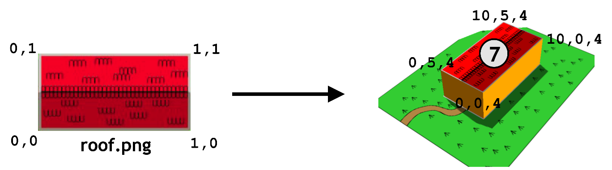
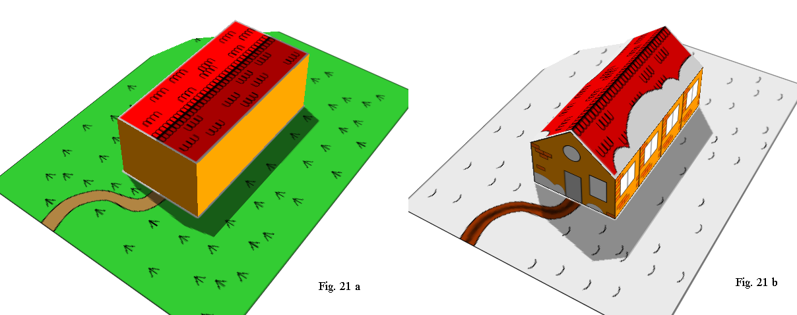
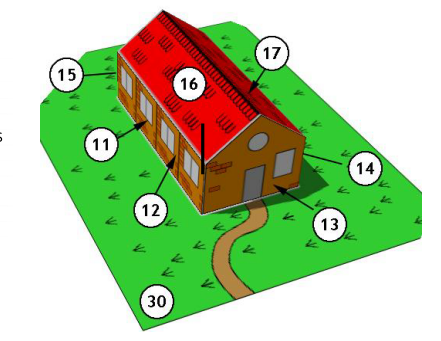
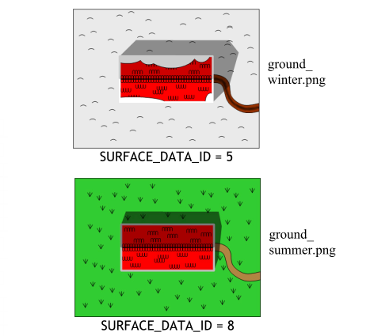
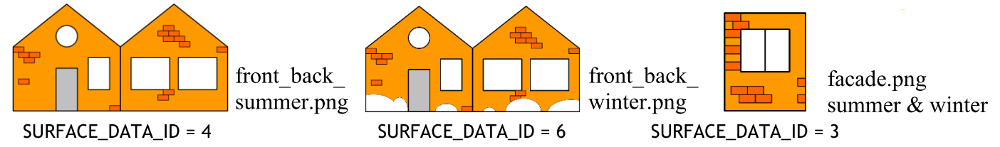
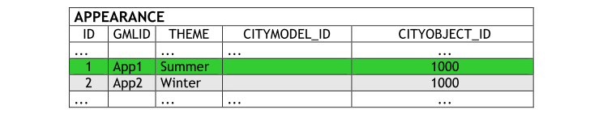
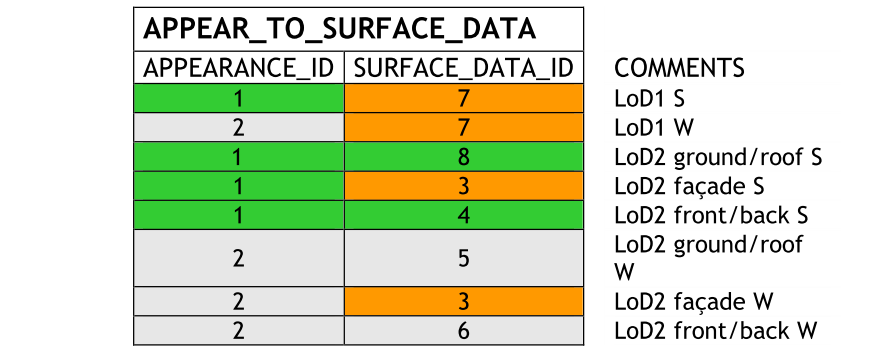
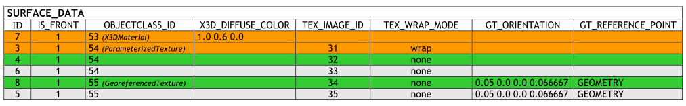
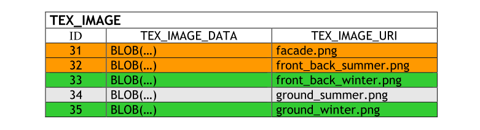
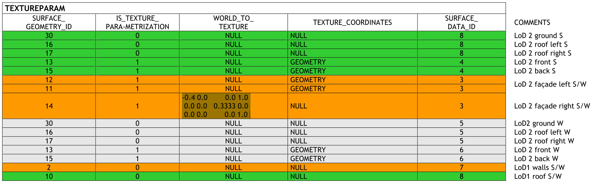

.. _citydb_managing_appearance_chapter:

Appearance schema
^^^^^^^^^^^^^^^^^

**APPEARANCE, APPEARANCE_SEQ**

The table APPEARANCE contains information about the surface data of
objects (attribute DESCRIPTION), its category is stored in attribute
THEME. Since each city model or city object may store its own appearance
data, the table APPEARANCE is related to the tables for the base classes
*CityObject* and *CityModel* by two foreign keys which may be used
alternatively. The classes *Appearance* and \_\ *SurfaceData* represent
features, which can be referenced by GML identifiers. For this reason,
the attributes GMLID and GMLID_CODESPACE were added to the corresponding
tables.

.. figure:: ../../media/citydb_schema_appearance.png
   :name: citydb_schema_appearance
   :align: center

   Appearance database schema

**SURFACE_DATA, TEX_IMAGE, APPEAR_TO_SURFACE_DATA**

An appearance is composed of data for each surface geometry object.
Information on the data types and its appearance are stored in the table
SURFACE_DATA.

IS_FRONT determines the side a surface data object applies to
(IS_FRONT=1: front face IS_FRONT=0: back face of the geometry).
The OBJECTCLASS_ID column denotes if materials or textures are used for
the specific object (values: *X3DMaterial*, *Texture* or
*GeoreferencedTexture*). Materials are specified by the attributes
X3D_xxx which define its graphic representation. Details on using
georeferenced textures, such as orientation and reference point, are
contained in attributes GT_xxx. See :numref:`citydb_appearance_model_chapter` for more information
on SURFACE_DATA attributes or the CityGML specification (cf. [GKNH2012]_, p. 33-45 )
which explains the texture mapping process in detail.

Raster-based 2D textures are stored in table TEX_IMAGE. The name of the
corresponding images for example is specified by the attribute
TEX_IMAGE_URI. The texture image can be stored within this table in the
attribute TEX_IMAGE_DATA using the BLOB data type under Oracle and the
BYTEA data type under PostgreSQL.

Table APPEAR_TO_SURFACE_DATA represents the interrelationship between
appearances and surfaces for different themes.

**TEXTUREPARAM**

Attributes for mapping textures to geometry objects (point list or transformation
matrix) which are defined by the CityGML classes
*\_TextureParameterization*, *TexCoordList*, and *TexCoordGen* are
stored in the table TEXTUREPARAM.

   Simple example explaining texture mapping using texture coordinates

.. list-table::  Example for table TEXTUREPARAM
   :name: citydb_schema_example_TEXTUREPARAM_table

   * - | **SURFACE_**
       | **GEOMETRY_ID**
     - | **IS_TEXTURE**
       | **_PARAMETRIZATION**
     - | **WORLD_TO**
       | **_TEXTURE**
     - | **TEXTURE_**
       | **COORDINATES**
     - | **SURFACE_**
       | **DATA_ID**
   * - | 7
     - | 1
     - | NULL
     - | GEOMETRY
     - | 20
   * - | ...
     - | ...
     - | ...
     - | ...
     - | ...

Texture coordinates are applicable to polygonal surfaces, whose
boundaries are described by a closed linear ring (last coordinate is
equal to first). Coordinates are stored with a geometry data type. The
WORLD_TO_TEXTURE attribute defines a transformation matrix from a
location in world space to texture space. For more details see the
CityGML Implementation Specification [GKNH2012]_.

   Visualisation of a simple building in LoD1 and LoD2 using the
   appearance model. Two themes are defined for the building and the
   surrounding terrain: (a) building in summertime and (b) building in
   wintertime

Six surface representations are listed in table SURFACE_DATA
(cf. :numref:`citydb_schema_surface_data_table_figure`).
First of all, a homogeneous material is defined (ID=1), represented
by a 3-component (RGB) colour value which will be used for both
appearances (summer and winter). This also applies to a general side
façade texture (ID=3, :numref:`citydb_schema_images_parameterized_textures` right)
which is repeated (wrapped) to
fill the entire surface. For each of the front side, the back side and
the ground two images are available: parameterized ones for the sides
(:numref:`citydb_schema_images_parameterized_textures` left and middle)
and georeferenced ones for the ground and
the roof surfaces (:numref:`citydb_schema_images_georeferenced_textures`).
The information of textures is stored in
a separate table TEX_IMAGE. The coordinates for mapping the textures to
the object are stored in table TEXTUREPARAM. For the general side
texture (SURFACE_DATA_ID=3) five coordinate pairs are needed to define a
closed ring (here: rectangle). Table SURFACE_GEOMETRY contains the
information of all geometry parts that form the building and its
appropriate 3D coordinates.

See the following page for an example of the storage of appearances in
the city database. :numref:`citydb_schema_images_parameterized_textures`
and :numref:`citydb_schema_images_georeferenced_textures` show the images used for
texturing a building in LoD2. In LoD1, a material definition is used to
define the wall colors of the building.

:numref:`citydb_schema_APPEARANCE_table_figure` to
:numref:`citydb_schema_TEXTUREPARAM_table_figure` show
a combination of tables representing the
building’s textures. There are different images available for summer and
winter resulting in two themes: Summer and Winter. The tuples within the
tables are color-coded according to their relation to the respective
theme:

-  Green: only summer related data

-  Light-grey: only winter related data

-  Orange: both summer and winter related data

:numref:`citydb_schema_example_lod2Surface_building` shows the LoD2 representation
of summer appearances (theme Summer).

   Surface geometries for the building in LoD2

   Images for georeferenced textures. The image ground_winter.png is assigned to the terrain
   and the roof surfaces of the building both in LoD1 and
   LoD2 within the winter theme (a), ground_summer.png
   within the summer theme (b)

   Images for parameterized textures

   Excerpt of table APEARANCE, The relation to the building feature is given by the foreign key CITYOBJECT_ID

   APPEAR_TO_SURFACE table

   Excerpt of table SURFACE_DATA table

   Excerpt of table TEX_IMAGE table

   TEXTUREPARAM Table
