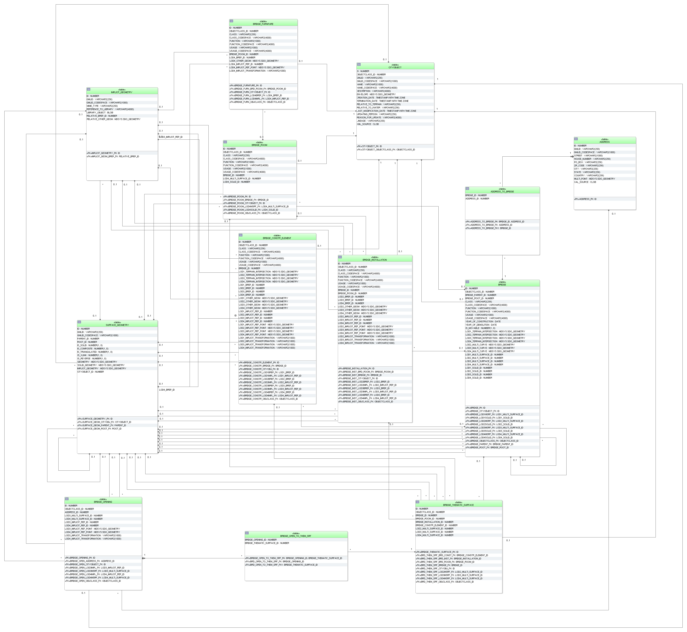

Bridge schema
^^^^^^^^^^^^^

   Bridge database schema

The bridge model, described in paragraph :numref:`citydb_bridge_model_chapter`
at the conceptual level, is realised by the tables shown
in :numref:`citydb_schema_bridge_diagram`. The relational
schema is identical to the building schema for the most parts except for
the naming. Please, refer to the explanation of the building schema on
the previous pages for a complete understanding. The main differences to
the building schema are the following:

-  Bridges cannot be modelled in LoD 0. Therefore, no corresponding
   columns appear in the BRIDGE table.

-  CityGML features belonging to bridges, such as boundary surfaces,
   installations, openings, rooms and furniture, are mapped to separate
   specific tables and are not stored in already existent ones (e.g.
   THEMATIC_SURFACE, OPENING, ROOM). Thus, values in OBJECTCLASS_ID
   columns are different as well. The reason for this is to provide a
   schema that is as close to the UML model as possible. There are
   slight differences between the building and the bridge model that
   would lead to ambiguous references e.g. a boundary surface of the
   building namespace cannot reference to a bridge construction element.

-  OBJECTCLASS_ID of table BRIDGE_THEMATIC_SURFACE allows the values:

   -  68 (*BridgeCeilingSurface*),

   -  69 (*InteriorBridgeWallSurface*)

   -  70 (*BridgeFloorSurface*),

   -  71 (*BridgeRoofSurface*),

   -  72 (*BridgeWallSurface*),

   -  73 (*BridgeGroundSurface*),

   -  74 (*BridgeClosureSurface*),

   -  75 (*OuterBridgeCeilingSurface*),

   -  76 (*OuterBridgeFloorSurface*).

..

   If a CityGML ADE is used that extends any of the classes named above,
   further values for OBJECTCLASS_ID may be added by the ADE manager.
   Their concrete numbers depend on the ADE registration
   (cf. :numref:`ade_manager_plugin_registration_chapter`).

-  In the BRIDGE_INSTALLATION table external bridge installations can be
   identified by the OBEJCTCLASS_ID 65 and internal ones by 66.

-  The CityGML class *BridgeConstructionElement* is represented by the
   table BRIDGE_CONSTR_ELEMENT. Its schema is analogue to the
   BRIDGE_INSTALLATION table for the most parts. The relation to the
   corresponding bridge results from the foreign key BRIDGE_ID. Explicit
   and implicit geometry or a decomposition through boundary surfaces is
   possible. Additionally, terrain intersections curves of construction
   elements can also be stored.

-  The OBJECTCLASS_ID column in table BRIDGE_OPENING can be of integer
   value 79 (*BridgeDoor*) or 78 (*BridgeWindow*). They are associated
   to entries in the table BRIDGE_THEMATIC_SURFACE via the
   BRIDGE_OPEN_TO_THEM_SRF link table. If a CityGML ADE is used that
   extends any of the two classes *BridgeDoor* or *BridgeWindow*,
   further values for OBJECTCLASS_ID may be added by the ADE manager.
   Their concrete numbers depend on the ADE registration
   (cf. :numref:`ade_manager_plugin_registration_chapter`). Like openings of building, bridge openings can have
   addresses assigned to it.

