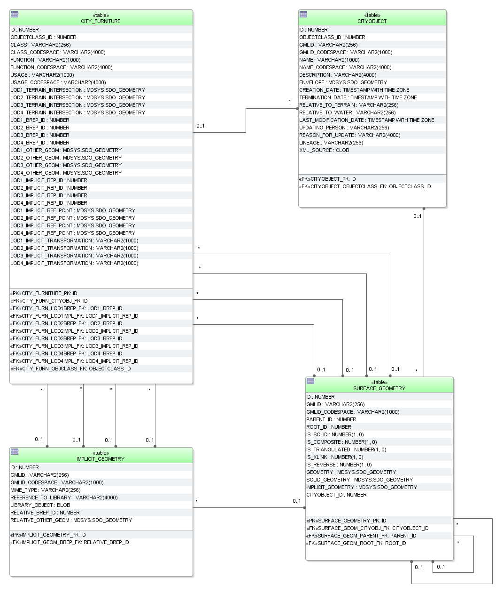

CityFurniture schema
^^^^^^^^^^^^^^^^^^^^

The CityGML feature class CityFurniture and its attributes specified in
the UML diagram (:numref:`citydb_cityfurniture_model`) are directly mapped the CITY_FURNITURE
table and its corresponding columns.

   CityFurniture database schema

The geometry of city furniture objects is represented either as a
surface-based geometry object (LODx_BREP_ID, where 1 ≤ x ≤ 4) related to
table SURFACE_GEOMETRY, as a point- or line-typed object
(LODx_OTHER_GEOM, where 1 ≤ x ≤ 4) or as implicit geometry
LODx_IMPLICIT_REP_ID, LODx_IMPLICIT_REF_POINT,
LODx_IMPLICIT_TRANSFORMATION with 1 ≤ x ≤ 4). Optionally terrain
intersection curves can be stored for city furniture objects.
