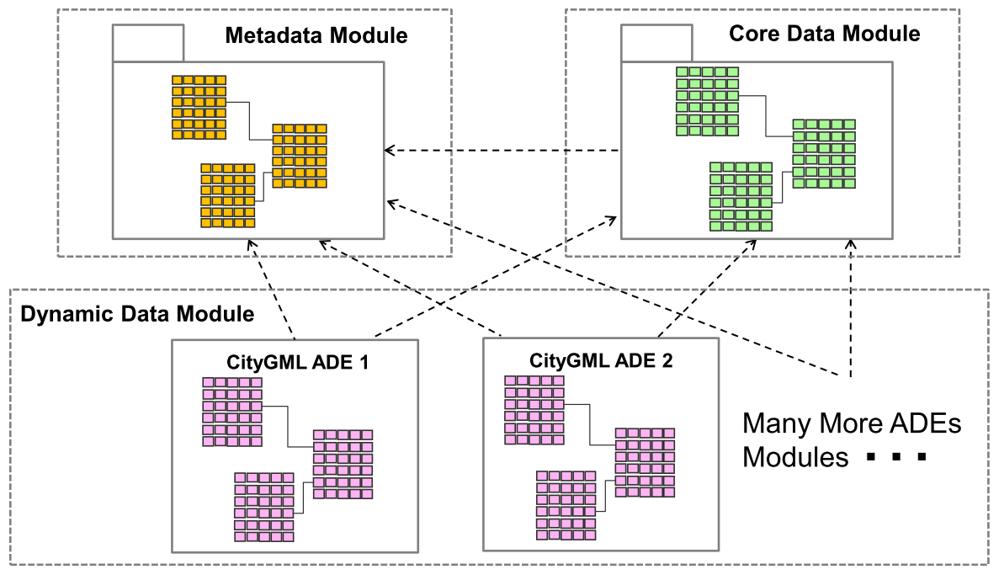

.. _citydb_conceptual_database_structure_chapter:

Conceptual database structure
~~~~~~~~~~~~~~~~~~~~~~~~~~~~~

Starting from version 4.0.0, the 3DCityDB database schema has been
slightly modified to support the handling of CityGML ADEs (Application
Domain Extensions). With this enhancement, user-defined database schemas
can be dynamically created and attached to a 3DCityDB instance for
storing ADE data contents. In addition, every existing CityGML class
table is now equipped with an OBJECTCLASS_ID column which allows to
distinguish the stored data contents of different CityGML and ADE
classes having inheritance relationships. Moreover, a set of new
metadata tables are introduced in addition to the existing OBJECTCLASS
table, for holding the relevant meta-information of the registered
CityGML ADEs. In general, all 3DCityDB tables now logically belong to
one of the three modules *Metadata Module*, *Core Data Module*, and
*Dynamic Data Module*, whose relations are shown in the following
figure.

   New conceptual 3DCityDB database structure for handling CityGML ADEs

The green tables enclosed in the *Core Data Module* represent those
database tables that are responsible for storing the standard CityGML
models such as *Building*, *Transportation, Tunnel, CityFurniture,
CityObjectGroup, Generic, Appearance* etc. This module comprises
basically the tables of the database schema of previous versions of the
3DCityDB (cf. the next section for more details). For a given CityGML
ADE, an additional group of database tables forming a separate module
belonging to the *Dynamic Data Module* (pink tables in the figure) can
be created and attached to the 3DCityDB database schema. In addition,
the relationships (e.g. generalization/specialization and associations)
among the model classes of CityGML and CityGML ADEs are adequately
reflected using database foreign key constraints which allow to ensure
the data integrity and consistency within the database system. The
*Metadata Module* associated with the *Dynamic Data Module* is utilized
for storing the relevant meta-information (e.g. the XML namespaces,
schema files, and class affiliations etc.) about ADEs as well as the
referencing relations among the ADE and CityGML application schemas.
This way, the dependencies between the registered ADE application
schemas can be directly read from the 3DCityDB database schema to
facilitate the database administration process, i.e. the registration
and deregistration of multiple CityGML ADEs within a 3DCityDB instance.
