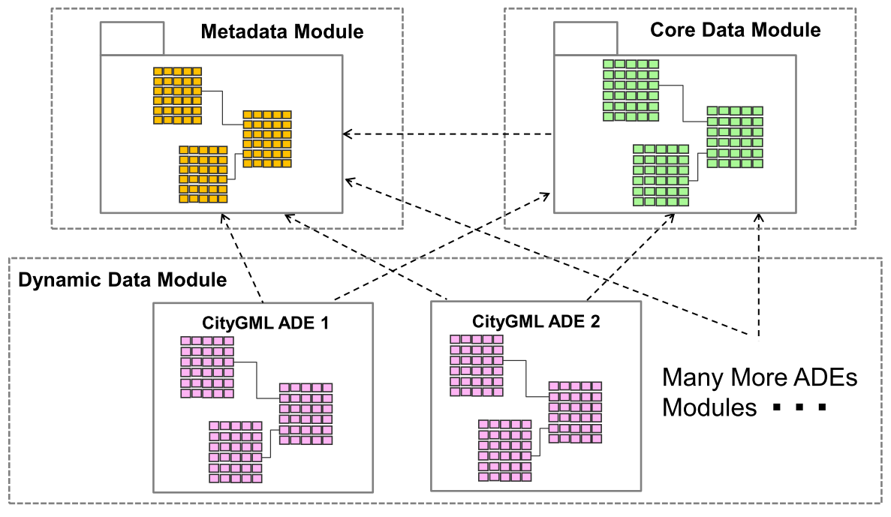

.. _citydb_managing_ades_chapter:

Managing ADE schemas
====================

.. _citydb_conceptual_database_structure_chapter:

Logical 3DCityDB schema modules
-------------------------------

The 3D City Database schema can be dynamically extended with user-defined
schemas for storing CityGML ADE data. Every additional
ADE schema is registered in special tables of the 3DCityDB schema
that hold relevant metadata about the ADE itself. The feature and object
classes defined in the ADE are added to the OBJECTCLASS table.

Logically, all tables within a 3D City Database instance can therefore
be grouped into three modules:

1. **Core Data Module** containing the core tables for storing CityGML data,
2. **Metadata Module** containing tables for the registration of ADEs, and
3. **Dynamic Data Module** containing the tables for storing the actual ADE data.

.. note::
  ADE support has been introduced with version 4.0 of the 3D City Database.
  The database schema of previous versions of the 3D City Database basically
  consists of the tables in the Core Data Module.

The relations between the modules are shown in the following figure.

   New conceptual 3DCityDB database structure for handling CityGML ADEs

The green tables enclosed in the **Core Data Module** represent those
database tables that are responsible for storing the standard CityGML
features such as *Building, Transportation, Tunnel, CityFurniture,
CityObjectGroup, Generic, Appearance* etc, which have been introduced and
discussed in the previous sections of this chapter.

For every CityGML ADE, an additional set of database tables for storing
the ADE data is dynamically added to the **Dynamic Data Module**
(pink tables in the figure). In addition,
relationships between model classes defined in the ADEs and classes from CityGML
such as generalization/specialization and associations are adequately
reflected using database foreign key constraints which allow to ensure
the data integrity and consistency within the database system.

The **Metadata Module** is used for storing the relevant meta-information (e.g. the XML namespaces,
schema files, and class affiliations etc.) about ADEs as well as the
referencing relations among the ADE and CityGML application schemas.
This way, the dependencies between the registered ADE application
schemas can be directly read from the 3DCityDB database schema to
facilitate the database administration process, i.e. the registration
and de-registration of multiple CityGML ADEs within a 3DCityDB instance.

.. _chapter_citydb_schema_metadata:

ADE metadata model
------------------

An overview of the relational structure of the **Metadata Module** is
shown in :numref:`citydb_schema_metadata_diagram`. The table ADE serves as a central registry for all
the registered CityGML ADEs each of which corresponds to a table row and
the relevant ADE metadata attributes are mapped onto the respective
columns. For example, each registered ADE shall own a globally unique ID
value for identification purpose. This ID value could be a UUID
(Universally Unique Identifier) that can be automatically generated and
stored in the column ADEID while registering the ADE. The columns NAME
and DESCRIPTION are mainly used for storing a basic description
about each ADE. The column VERSION denotes the version number
of an ADE and allows to distinguish different release versions.

In the 3DCityDB database schema, the database objects like tables, indexes,
foreign key constrains, and sequences of a certain ADE shall be named by
starting with a unique prefix stored that is stored in the DB_PREFIX column.
This allows applications to easily retrieve the database schema of
a certain ADE using a wildcard filter. This way, it is possible to automatically perform
statistics on the ADE data contents stored in the individual tables. In
addition, the column XML_SCHEMAMAPPING_FILE is used to store the
XML-formatted schema mapping information of each ADE and is hence
defined with the CLOB data type. Another CLOB-typed column is
DROP_DB_SCRIPT, which stores the SQL statements for dropping the individual ADE
database schema. To remove an ADE from the 3DCityDB, this script can
be easily retrieved and executed at the database side.

Moreover, the CREATION_DATE and CREATION_PERSON are
two application-specific attribute columns for providing the information
about when and by whom an ADE was registered in the 3DCityDB. This
meta-information is typically helpful for 3DCityDB users to accomplish
the administration work e.g. searching and cleaning up those ADEs that
are outdated or registered by certain database users.

.. figure:: ../../media/citydb_schema_metadata_diagram.png
   :name: citydb_schema_metadata_diagram

   Technical implementation of the 3DCityDB Metadata Module in a relational diagram

A CityGML ADE may consist of multiple application schemas one of which
should be the root schema referencing the others. Such dependency
information along with the meta-information about the individual schema(s) are
stored in two tables, namely SCHEMA and SCHEMA_REFERENCING. The
SCHEMA_REFERENCING table is an associative table which contains two
foreign key columns REFERENCED_ID and REFERENCING_ID to link the
respective referencing and referenced schemas. In the table SCHEMA, the
flag attribute IS_ADE_ROOT is used for denoting the root schema that
directly or indirectly references all the other ADE schemas of an ADE.
In this way, the dependency hierarchy of the ADE schemas can be fully
represented in a relational model to facilitate the reconstruction of
the original schema relations through user applications. For each
schema, its meta-information such as the schema location, namespace,
namespace prefix, source XML schema definition file, as well as the file
type (e.g. plain XML text or archived) of the schema can also be stored
in the further columns of the SCHEMA table. The column CITYGML_VERSION
refers to CityGML version for which the ADE has been defined.

The table OBJECTCLASS is a central registry for enumerating not only the
standard CityGML classes but also the classes of the registered ADEs.
For this reason, it has been logically moved from the Core Data Module into
the Metadata Module. Each class is assigned a globally unique numeric ID
in OBJECTCLASS for querying and accessing the class-related information.
As explained in the :numref:`citydb_class_affiliation_declaration_chapter`,
the ID values ranging from 0 to 113 used
for the standard CityGML classes.

.. important::
  To be able to implement future changes for the 3DCityDB schema,
  the ID value range **0 - 9999 is preserved** for the
  core CityGML schema and **shall not be used for ADE classes**.

In order to avoid ID clashes between ADEs, each ADE shall own a
certain value range which can be centrally maintained and
organized by an official community like the 3DCityDB group. The
OBJECTCLASS table also contains a few additional columns like the
IS_ADE_CLASS which is a flag to mark and easily identify those classes
belonging to ADEs. Another column named TABLENAME refers to the table
name of a CityGML or ADE class and provides the basic information about
model mapping. The last two columns SUPERCLASS_ID and BASECLASS_ID are
two foreign key columns of the ID column for representing the
inheritance hierarchy of all the CityGML and ADE classes in a relational
structure.

In addition to the inheritance relationship mapped in OBJECTCLASS, the aggregation
relationship between CityGML and ADE classes can also be represented
within a 3DCityDB instance by means of the table AGGREGATION_INFO. Its
first two columns CHILD_ID and PARENT_ID are two foreign key columns
which point to the primary key column of the table OBJECTCLASS to
reflect the two related classes. The aggregation or composition
relationship between each pair of classes can be distinguished by using
the flag attribute IS_COMPOSITE whose value can either be 0
(aggregation) or 1 (composition). In 3DCityDB, each
aggregation/composition is logically mapped onto a foreign key column or
an associative table for joining the two respective class tables. This
meta-information can also be stored in the table AGGREGATION_INFO using
its column JOIN_TABLE_OR_COLUMN_NAME. In addition, the multiplicity of
the individual aggregation/composition are stored in the two numeric
columns MIN_OCCURS and MAX_OCCURS. In case of a 0..\* relationship where
the value of the multiplicity end is unbounded, the value in the column
MAX_OCCURS shall be set NULL.