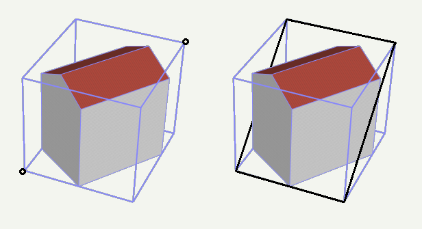

.. _citydb_schema_core_model_chapter:

Core Model
^^^^^^^^^^

**CITYOBJECT, CITYOBJECT_SEQ**

All *CityObjects* (and instances of the subclasses like *Buildings*
etc.) are represented by tuples in the table CITYOBJECT. The fields are
identical to the attributes of the corresponding UML class, plus
additional columns for metadata like LAST_MODIFICATION_DATE,
UPDATING_PERSON, REASON_FOR_UPDATE and LINEAGE.

The bounding box (*gml:Envelope*) is stored as rectangular geometry
using five points, that join the minimum and maximum x, y and z
coordinates of the bounding box and define it completely. For backwards
compatibility reasons (to Oracle 10g), the envelope cannot be stored as
a volume.

   The *CityObject*\ ’s envelope specified by two points with minimum
   and maximum coordinate values (left: black points) is stored as a
   3D rectangle (right: black polygon using five points)

In order to identify each object, a unique identifier is essential.
Therefore, the column GMLID stores the *gml:id* value of every city
object. But since *gml:ids* cannot be guaranteed to be unique over
different CityGML files, the column GMLID_CODESPACE is provided in
addition. It may contain, for instance, the full path to the imported
CityGML file containing the object. The combination of GMLID and
GMLID_CODESPACE should be ensured to be unique for each *CityObject*.

The attributes NAME or NAME_CODESPACE can contain more than one
*gml:name* proper­ty. In this case they have to be separated by the
string '-\\-/\\\\-\\-' (more details on the following page). The CityGML
exporter will then create multiple occurrences of <gml:name> elements.

The attribute OBJECTCLASS_ID provides information on the class
affiliation of the *CityObject*. This helps to identify the proper
subclass tables.

The next free ID value for the table CITYOBJECT is provided by the
database sequence CITYOBJECT_SEQ. This ID is also reused in the separate
tables for the different thematic features.

**CITYMODEL, CITYMODEL_SEQ**

*CityObject* features may be aggregated to a single *CityModel*. A
*CityModel* serves as root element of a CityGML feature collection. In
order to provide a unique identifier in table CITYMODEL, the next
available ID value is provided by the sequence CITYMODEL_SEQ.

**EXTERNAL_REFERENCE, EXTERNAL_REF_SEQ**

The table EXTERNAL_REFERENCE is used to store external references; the
foreign key CITYOBJECT_ID refers to the associated *CityObject*. The
sequence EXTERNAL_REF_SEQ provides the next available ID value for
EXTERNAL_REFERENCE.

**CITYOBJECTGROUP, GROUP_TO_CITYOBJECT**

The n:m relationship between an object group (table
CITYOBJECTGROUP) consisting of city objects contained in CITYOBJECT is
realized by the table GROUP_TO_CITYOBJECT, which associates the IDs of
both tables. The following tables shows an example, in which two buildings are
grouped to a hotel complex.

.. list-table::  *Cityobjectgroup* table (excerpt)
   :name: citydb_cityobject_group_table

   * - | **ID**
     - | **CLASS**
     - | **CLASS_**
       | **CODESPACE**
     - | **FUNCTION**
     - | **FUNCTION_**
       | **CODESPACE**
     - | **USAGE**
     - | **USAGE_**
       | **CODESPACE**
   * - | 1
     - | NULL
     - | NULL
     - | Building
       | group
     - | NULL
     - | Hotel
     - | NULL

.. list-table::  *GROUP_TO_CITYOBJECT* table
   :name: citydb_group_to_cityobject_table

   * - | **CITYOBJECT_ID**
     - | **CITYOBJECTGROUP_ID**
     - | **ROLE**
   * - | 2
     - | 1
     - | Main building
   * - | 4
     - | 1
     - | Annex

.. list-table::  *Cityobject* table (excerpt)
   :name: citydb_cityobject_table

   * - | **ID**
     - | **OBJECTCLASS**
       | **_ID**
     - | **GML_ID**
     - | **ENVELOPE**
     - | **CREATION**
       | **_DATE**
     - | **TERMINATION**
       | **_DATE**
   * - | 2
     - | 26
     - | Build1632
     - | GEOMETRY
     - | 2015-02-02
       | 09:26:07.441+01
     - | NULL
   * - | 4
     - | 26
     - | Build1633
     - | GEOMETRY
     - | 2015-02-02
       | 09:26:07.441+01
     - | NULL
   * - | 1
     - | 23
     - | Group1700
     - | NULL
     - | 2015-02-02
       | 09:26:07.441+01
     - | NULL

For attributes CLASS, FUNCTION and USAGE there is an additional
\_CODESPACE column in order to specify the source of code lists used for
values (e.g. by a globally unique URL). As a CityGML feature like
*CityObjectGroup* can have multiple instances of attributes *class*,
*function* and *usage* but only one target column exist in the table,
values are separated by the string sequence '-\\-/\\\\-\\-'. The CityGML
exporter will then create multiple occurrences of corresponding
elements. Normalization rules were not applied in this case in order to
avoid many joins when querying all information of building objects.
Array types weren’t used either as their implementation varies between
different database systems.

This concept applies to all CityGML features and can therefore be found
in every object table (except for boundary surfaces of buildings,
bridges and tunnels). They do not appear once in the CITYOBJECT table,
because they are belonging to the namespace of a certain thematic module
and should be stored along with other attributes of that feature.

.. figure:: ../../../media/citydb_schema_core.png
   :name: citydb_schema_core

   Database schema of the CityGML core elements
