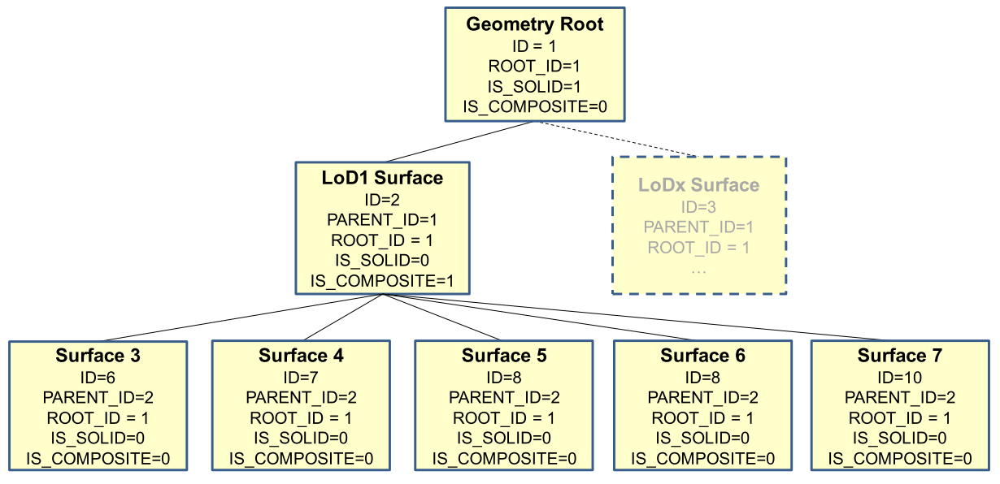
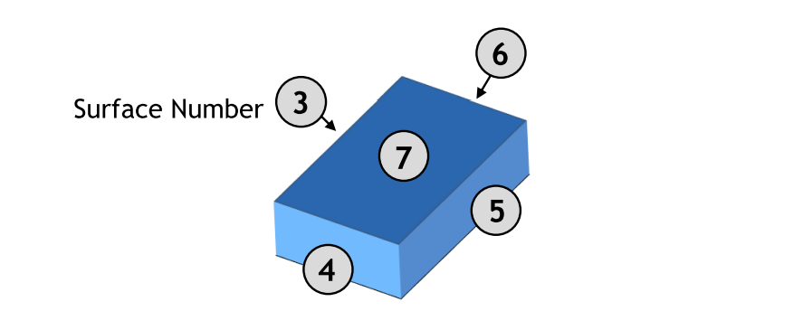

.. _chapter_citydb_schema_geometry:

Tables for geometry representation
^^^^^^^^^^^^^^^^^^^^^^^^^^^^^^^^^^

The representation of the geometry stored in table SURFACE_GEOMETRY
differs substantially from the UML chart explained in the CityGML
specification; nevertheless, it offers about the same functionality.

**SURFACE_GEOMETRY, SURFACE_GEOMETRY_SEQ**

In the database schema the geometry consists of planar surfaces which
correspond each to one entry in the table SURFACE_GEOMETRY. The
surface-based geometry is stored as attribute GEOMETRY (in each case
exactly one planar polygon, possibly including holes). The implicit
geometry is stored as attribute IMPLICIT_GEOMETRY. The volumetric
geometry is stored as attribute SOLID_GEOMETRY and its boundary surfaces
(outer shell) will be stored as attribute GEOMETRY as well. Any surface
may have textures or a colour on both sides. Textures are stored within
the tables which implement the appearance model (cf. :numref:`citydb_appearance_model_chapter`).

The geometry information in the fields GEOMETRY and IMPLICIT_GEOMETRY of
the table SURFACE_GEOMETRY is limited as follows:

.. list-table::  Storage of polygonal geometry
   :name: citydb_storage_of_polygonal_geometry_table

   * - | **Oracle**
     - | **PostGIS**
   * - | - SDO_GTYPE must have the type *Polygon*, i.e. a
       | polygon with 3D coordinates (SDO_GTYPE = 3003)
       |
       | - SDO_ETYPE must be 1003/2003 with
       | SDO_INTERPRETATION = 1 (i.e. polygon with
       | 3D coordinates in the boundary, bounded just by
       | linesegments, possibly including holes)
       |
       | - In addition Oracle allows the representation
       | of a rectangle by two corner points
       | (SDO_ETYPE=1003/2003,
       | with SDO_INTERPRETATION = 3)
       |
       | - SDO_SRID of implicit geometries can be
       | any SRID Oracle supports. No spatial index
       | is defined on the column by default.
     - | - Only POLYGON Z is allowed, i.e. a polygon
       | with 3D coordinates
       |
       | - Polygons might have holes
       |
       | - The IMPLICIT_GEOMETRY column has no
       | SRID defined. Thus, entries in that column
       | will have the SRID 0 automatically

A solid is the basis for 3-dimensional geometry. The extent of a solid
is defined by the boundary surfaces (outer shell). A shell is
represented by a composite surface, where every shell is used to
represent a single connected component of the boundary of a solid. It
consists of a composite surface (a list of *OrientableSurfaces*)
connected in a topological cycle. Unlike a ring, a shell's elements have
no natural sort order. Like rings, shells are simple. The geometry in
the field SOLID_GEOMETRY of the table SURFACE_GEOMETRY is limited as
follows:

.. list-table::  Storage of 3D geometry
   :name: citydb_storage_of_3D_geometry_table

   * - | **Oracle**
     - | **PostGIS**
   * - | - SDO_GTYPE must have the type Solid, i.e. a solid
       | with  3D coordinates (SDO_GTYPE = 3008)
       |
       | - SDO_ETYPE  must  be  1007  (simple solid) or
       | 1008 (composite solid)
       |
       | - A simple solid can be represented by using
       | several polygons as its boundary
       | (SDO_ETYPE=1007,
       | with SDO_INTERPRETATION = 1)
       |
       | - The composite solid can be constructed with
       | a number of simple  solids, e.g.  a  composite
       | solid  with  4  simple  solids (SDO_ETYPE=1008,
       | with SDO_INTERPRETATION = 4)
     - | - Only POLYHEDRALSURFACE is allowed, i.e.
       | the outer shell of a solid with 3D coordinates
       |
       | - A simple polyhedral surface can be represented
       | by using several polygons as its boundary

Surfaces can be aggregated to form a complex of surfaces or the boundary
of a volumetric object. The aggregation of multiple surfaces, e.g.
F\ :sub:`1` to F\ :sub:`n`, (IDs 6 to 10 in :numref:`citydb_schema_example_geometry_hierarchy` /
:numref:`citydb_schema_example_lod1solid_building`) is
realized the way that the newly created surface tuple F\ :sub:`n+1` (ID
2) is not assigned a geo­metry (cf. :numref:`citydb_aggregation_types_determination_table`).
Instead, the PARENT_ID of the surfaces F\ :sub:`1` to F\ :sub:`n` refer to the ID of
F\ :sub:`n+1`.

   Geometry hierarchy for the solid geometry shown in :numref:`citydb_schema_example_lod1solid_building`

In addition, a further tuple (ID 1) is introduced, which represent the
solid and defines the root element of the whole aggregation structure.
Each surface references to its root, using the ROOT_ID attribute. This
information has big influence on the system performance, as it allows to
avoid recursive queries. If e.g. the retrieval of all surface elements
forming a specific building is of importance, simply those tuples have
to be selected which contain the related ROOT_ID. On the downside there
also follows the limitation that each tuple in SURFACE_GEOMETRY can only
belong to one aggregate.

Various flags characterise the type of aggregation: IS_TRIANGULATED
denotes a TriangulatedSurface, IS_SOLID distinguishes between surface
(0) and solid (1), and IS_COMPOSITE defines whether this is an aggregate
(e.g. *MultiSolid*, *MultiSurface*) or a composite (e.g.,
*CompositeSolid*, *CompositeSurface*).

Based on these flags the geometry types listed in
:numref:`citydb_aggregation_types_determination_table` can be
distinguished. To distinguish a *MultiSolid* from a *MultiSurface* its
child elements have to be analysed: In case the child is a *Solid*, the
geometry can be identified as *MultiSolid*.

.. list-table::  Attributes determining aggregation types
   :name: citydb_aggregation_types_determination_table

   * - |
     - | **isSolid**
     - | **isComposite**
     - | **isTriangulated**
     - | **Geometry**
     - | **SOLID_**
       | **GEOMETRY**
   * - | Polygon, Triangle,
       | Rectangle
     - |
     - |
     - |
     - | GEOMETRY
     - | NULL
   * - | MultiSurface
     - |
     - |
     - |
     - | NULL
     - | NULL
   * - | CompositeSurface
     - |
     - | ✔
     - |
     - | NULL
     - | NULL
   * - | TriangulatedSurface
     - |
     - |
     - | ✔
     - | NULL
     - | NULL
   * - | Solid
     - | ✔
     - |
     - |
     - | NULL
     - | GEOMETRY
   * - | MultiSolid
     - |
     - |
     - |
     - | NULL
     - | NULL
   * - | CompositeSolid
     - | ✔
     - | ✔
     - |
     - | NULL
     - | GEOMETRY

Aggregated surfaces can be grouped again with other (compound) surfaces,
by generating a common parent. This way, arbitrary aggregations of
*Surfaces*, *CompositeSurfaces*, *Solids*, *CompositeSolids* can be
formed. Since all tuples in an aggregated geometry refer to the same
ROOT_ID all tuples can be retrieved efficiently from the table by
selecting those tuples with the same ROOT_ID.

The aggregation schema allows for the definition of nested aggregations
(hierarchy of components). For example, a building geometry
(*CompositeSolid*) can be composed of the house geometry
(*CompositeSolid*) and the garage geometry (*Solid*), while the house’s
geometry is further decomposed into the roof geometry (*Solid*) and the
geometry of the house body (*Solid*).

In addition, the foreign key CITYOBJECT_ID refers directly to the
CityGML features to which the geometry belongs. In order to select all
geometries forming the city object one only has to select those with the
same CITYOBJECT_ID.

In order to provide a unique identifier in table SURFACE_GEOMETRY, the
next available ID value is provided by the sequence
SURFACE_GEOMETRY_SEQ.

**Example:** The geometry shown in the figure below consists of seven
surfaces which form a volumetric object. In the table it is represented
by the following rows:

   LoD 1 building - closed volume bounded by a *CompositeSurface* which consists of single polygons

.. list-table::  Excerpt of table SURFACE_GEOMETRY representing the example given in :numref:`citydb_schema_example_lod1solid_building`
   :name: citydb_example_surface_geometry_table

   * - | **ID**
     - | **GMLID**
     - | **PARENT_**
       | **ID**
     - | **ROOT_**
       | **ID**
     - | **IS_**
       | **SOLID**
     - | **IS_COM**
       | **POSITE**
     - | **GEOMETRY**
     - | **SOLID_**
       | **GEOMETRY**
   * - | 1
     - | UUID
       | _lod1
     - | NULL
     - | 1
     - | 1
     - | 0
     - | NULL
     - | GEOMETRY
       | for Solid
   * - | 2
     - | lod1
       | Surface
     - | 1
     - | 1
     - | 0
     - | 1
     - | NULL
     - | NULL
   * - | 3
     - | Left1
     - | 2
     - | 1
     - | 0
     - | 0
     - | GEOMETRY
       | for surface 3
     - | NULL
   * - | 4
     - | Front1
     - | 2
     - | 1
     - | 0
     - | 0
     - | GEOMETRY
       | for surface 4
     - | NULL
   * - | 5
     - | Right1
     - | 2
     - | 1
     - | 0
     - | 0
     - | GEOMETRY
       | for surface 5
     - | NULL
   * - | 6
     - | Back1
     - | 2
     - | 1
     - | 0
     - | 0
     - | GEOMETRY
       | for surface 6
     - | NULL
   * - | 7
     - | Roof1
     - | 2
     - | 1
     - | 0
     - | 0
     - | GEOMETRY
       | for surface 7
     - | NULL

In addition, two further attributes are included in SURFACE_GEOMETRY:
IS_XLINK and IS_REVERSE.

**IS_XLINK**

CityGML allows for sharing of geometry objects between different
geometries or different thematic features using the XLink concept of
GML3. For this purpose, the geometry object to be shared is assigned an
unique *gml:id* which may be referenced by a GML geometry property
element through its *xlink:href* attribute. This concept allows for
avoiding data redundancy. Furthermore, CityGML does not employ the
built-in topology package of GML3 but rather uses the XLink concept for
the explicit modelling of topology (see [GKCN2008]_ p. 25).

Although an XLink can be seen as a pointer to an existing geometry
object the SURFACE_GEOMETRY table does not offer a foreign key attribute
which could be used to refer to another tuple within this table. The
main reason for this is that the referenced tuple typically belongs to a
different geometry aggregate, e.g. a different *gml:Solid* object, and
thus contains different values for its ROOT_ID and PARENT_ID attributes.
Therefore, foreign keys would violate the aggregation mechanism of the
SURFACE_GEOMETRY table.

The recommended way of resolving of XLink references to geometry objects
requires two steps: First, the referenced tuple of the SURFACE_GEOMETRY
table has to be identified by searching the GMLID column for the
referenced *gml:id* value. Second, all attribute values of the
identified tuple have to be copied to a new tuple. However, the ROOT_ID
and PARENT_ID of this new tuple have to be set according to the context
of the referencing geometry property element.

**Please note:**

1. If the referenced tuple is the top of an aggregation (sub)hierarchy
   within the SURFACE_GEOMETRY table, then also **all nested tuples have
   to be recursively copied** and their ROOT_ID and PARENT_ID have to be
   adapted.

2. Copying existing entries of the SURFACE_GEOMETRY table results in
   tuples sharing the same GMLID. Thus, these values cannot be used as a
   primary key.

When it comes to exporting data to a CityGML instance document, XLink
references can be rebuilt by keeping track of the GMLID values of
exported geometry tuples. Generally, for **each and every** tuple to be
exported it has to be checked whether a geometry object with the same
GMLID value has already been processed. If so, the export routine should
make use of an XLink reference.

However, checking the GMLID of each and every tuple may dramatically
slow down the export process. For this reason, the IS_XLINK flag of the
SURFACE_GEOMETRY has been introduced. It may be used to explicitly mark
just those tuples for which a corresponding check has to be performed.
The IS_XLINK flag should be used in the following manner. The
Importer/Exporter provides a corresponding reference implementation.

1. **During import**

a. By default, the IS_XLINK flag is set to “0”.

b. If existing tuples have to be copied due to an XLink reference,
   IS_XLINK has to be set to “1” for *each and every* copy. Please note,
   that this rule comprises all copies of nested tuples.

c. Furthermore, IS_XLINK has to be set to “1” on the original tuple
   addressed by the XLink reference. If this tuple is the top of an
   aggregation (sub)hierarchy, IS_XLINK remains “0” for all nested
   tuples.

2. **During export**

a. The export process just has to keep track of the GMLID values of
   those geometry tuples where IS_XLINK is set to “1”.

b. When it comes to exporting a tuple with IS_XLINK set to “1”, the
   export process has to check whether it already came across the same
   GMLID and, thus, can make use of an XLink reference in the instance
   document.

c. For each tuple with IS_XLINK=0 no further action has to be taken.

Especially due to (2c), the IS_XLINK attribute helps to significantly
speed up the export process when rebuilding XLink references. Please
note, that this is the only intended purpose of the IS_XLINK flag.

**IS_REVERSE**

The IS_REVERSE flag is used in the context of *gml:OrientableSurface*
geometry objects. Generally, an *OrientableSurface* instance cannot be
represented within the SURFACE_GEOMETRY table since it cannot be encoded
using the flags IS_SOLID, IS_COMPOSITE, and IS_TRIANGULATED (cf. Table
5). However, the IS_REVERSE flag is used to encode the information
provided by an *OrientableSurface* and to rebuild *OrientableSurfaces*
during data export.

According to GML3, an *OrientableSurface* consists of a base surface and
an orientation. If the orientation is “+”, then the *OrientableSurface*
is identical to the base surface. If the orientation is “-“, then the
*OrientableSurface* is a reference to a surface with an up-normal that
reverses the direction for this *OrientableSurface*.

During import, only the base surfaces are written to the
SURFACE_GEOMETRY table. The following rules have to be obeyed in the
context of *OrientableSurface*:

1. If the orientation of the *OrientableSurface* is “-“, then

a. The direction of the base surface has to be reversed prior to
   importing it (generally, this means reversing the order of coordinate
   tuples).

b. The IS_REVERSE flag has to be set to “1” for the corresponding entry
   in the SURFACE_GEOMETRY table.

c. If the base surface is an aggregate, then steps (a) and (b) have to
   be recursively applied for all of its surface members.

2. If the *OrientableSurface* is identical to its base surface (i.e., if
   its orientation is “+”), then the base surface can be written to the
   SURFACE_GEOMETRY table without taking any further action. The
   IS_REVERSE flag has to be set to “0” (which is also the default
   value).

3. Please note, that it is not sufficient to just rely on the
   *gml:orientation* attribute of an *OrientableSurface* in order to
   determine its orientation since *OrientableSurfaces* may be
   arbitrarily nested.

Flipping the direction of the base surface in step (1a) is essential in
order to guarantee that the objects stored within the GEOMETRY column
are always correctly oriented. This enables applications to just access
the GEOMETRY column without having to interpret further attributes of
the SURFACE_GEOMETRY table. For example, in the case of a viewer
application this allows for a fast rendering of a virtual 3d city scene.

When exporting CityGML instance documents, the IS_REVERSE flag can be
used to rebuild *OrientableSurface* in the following way:

1. If the IS_REVERSE flag is set to “1” for a table entry, the exporter
   routine has to reverse the direction of the corresponding surface
   object prior to exporting it (again, this means reversing the order
   of coordinate tuples).

2. The surface object has to be wrapped by a *gml:OrientableSurface*
   object with *gml:orientation*\ =”-”.

3. If the surface object is an aggregate, its surface members having the
   **same value** for the IS_REVERSE flag *may not* be embraced by
   another *OrientableSurface*. However, if the IS_REVERSE value
   changes, e.g., from “1” for the aggregate to “0” for the surface
   member, also the surface member has to be embraced by a
   *gml:OrientableSurface* according to (2). Since there might be nested
   structures of arbitrary depth this third rule has to be applied
   recursively.

Like with the IS_XLINK flag, the Importer/Exporter tool provides a
reference implementation of the IS_REVERSE flag.
