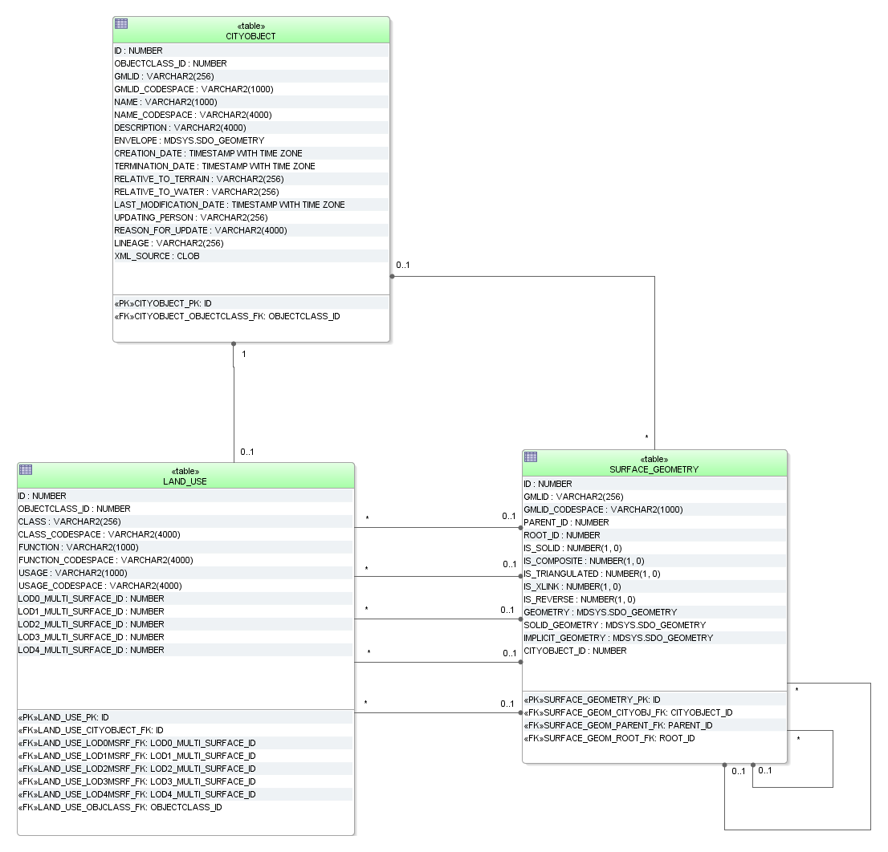

LandUse Model
^^^^^^^^^^^^^

The CityGML feature class *LandUse* and its attributes specified in the
UML (cf. :numref:`citydb_landuse_model`) diagram are directly mapped the LAND_USE table and
its corresponding columns. The relation to table SURFACE_GEOMETRY is
established by the foreign keys LODx_MULTI_SURFACE_ID, where 0 ≤ x ≤ 4.

   LandUse database schema
