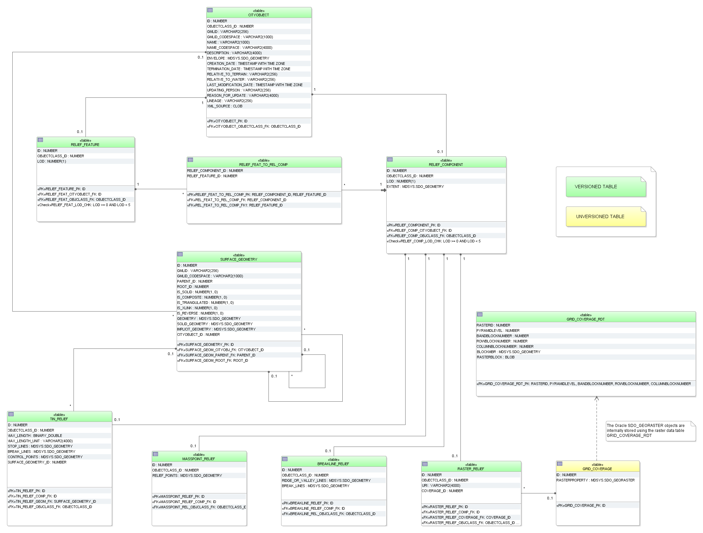

Digital terrain schema
^^^^^^^^^^^^^^^^^^^^^^

A tuple in the table RELIEF_FEATURE represents a complex relief object,
which consists of different relief components. It has an attribute LOD
that describes the affiliation of the relief object to a certain level
of detail (LoD) of the city model. The individual components of a
complex relief object are stored in the tables BREAKLINE_RELIEF,
TIN_RELIEF, MASSPOINT_RELIEF and RASTER_RELIEF. Every relief component
has an attribute LOD that describes the affiliation to a certain level
of detail (resolution, accuracy). However, individual components of a
complex relief object may belong to different LoD and may be
heterogeneous, i.e. a mixture of TINs, grids and mass points.
Optionally, the geometrical separation between the individual relief
components of a complex relief object can be realized via polygons
(attribute EXTENT), which specify the validity area of the relief
component. Every relief component has an attribute NAME that is used for
naming of the component. The relief as well as every relief component
are derived from CITYOBJECT and receive the same ID as the *CityObject*.
Table RELIEF_FEAT_TO_REL_COMP represents the interrelationship between
relief features and relief components.

   Digital Terrain Model database schema

A raster relief is the only feature in CityGML that can be described by
a grid coverage. Corresponding database types are SDO_GEORASTER in
Oracle Spatial 11g or higher (not available in Oracle Locator) and
RASTER in PostGIS 2.0 or higher. In Oracle for each table that stores
SDO_GEORASTER an additional table of type SDO_RASTER is mandatory
(raster data table = RDT). It stores the metadata of the SDO_GEORASTER.

In case of that a grid representation is introduced to other features in
CityGML in the future, numerous RDT tables would be created when storing
grids along with the thematic tables. Thus, a central table called
GRID_COVERAGE is used to register all grid data and to prevent numerous
additional tables in the 3DCityDB schema. This concept is analogue to
the storage of surface-based geometry whereas SURFACE_GEOMETRY is the
central table.

Since Oracle Spatial 11g the SDO_GEORASTER type supports Oracle
Workspace Manager (cf. [Murr2010]_). Therefore, the table GRD_COVERAGE_RDT can be
versioned for history management. However, Oracle Spatial doesn’t allow
user to version-enable the tables, where *GeoRaster* objects are stored.
Hence, the table GRID_COVERAGE cannot be versioned using the Oracle
Workspace Manager.

Geometry attributes for different relief components are limited to these
value domains:

**BREAKLINE_RELIEF**

-  BREAK_LINES and RIDGE_OR_VALLEY_LINES

   -  Oracle: MultiLine (GTYPE 3006)

   -  PostGIS: MultiLineString Z

**TIN_RELIEF**

-  STOP_LINES and BREAK_LINES

   -  Oracle: MultiLine (GTYPE 3006)

   -  PostGIS: MultiLineString Z

-  RELIEF_POINTS

   -  Oracle: *MultiPoint* (GTYPE 3001 or 3005)

   -  PostGIS: *MultiPoint Z*

-  TIN

   -  TIN triangles could be stored as triangulated surfaces in table
      SURFACE_GEOMETRY

**MASSPOINT_RELIEF**

-  RELIEF_POINTS

   -  Oracle: *MultiPoint* (GTYPE 3001 or 3005)

   -  PostGIS: *MultiPoint Z*

**RELIEF_COMPONENT**

-  EXTENT (defines the validity extents of each relief component)

   -  Oracle: *Polygon* (GTYPE 3003, ETYPE 1003, SDO\_ INTERPRETATION 1
      or 3 (optimized rectangle))

   -  PostGIS: *Polygon Z*

