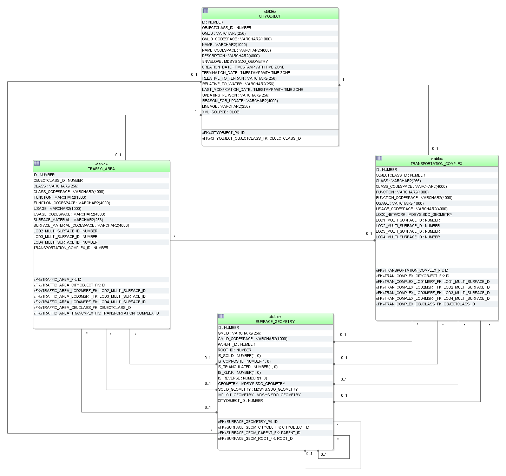

Transportation Model
^^^^^^^^^^^^^^^^^^^^

For the realisation of transportation objects two tables are provided:
TRAFFIC_AREA and TRANSPORTATION_COMPLEX.

**TRAFFIC_AREA**

Next to the common attribute triple *class*, *function* and *usage*
traffic areas can store information about their *surfaceMaterial*. In
the UML model this attribute is specified as *gml:CodeType* which makes
an additional \_CODESPACE column necessary. The representation of
geometry is handled by foreign keys LODx_MULTI_SURFACE_ID (with 2 ≤ x ≤
4). The aggregation relation between a transportation complex and the
corresponding traffic areas results from the foreign key
TRANSPORTATION_COMPLEX_ID. The foreign key OBJECTCLASS_ID indicates
whether a tuple represents a *TrafficArea* (value 47) or an
*AuxiliaryTrafficArea* (value 48) feature. If a CityGML ADE is used that
extends any of the two classes *TrafficArea* or *AuxiliaryTrafficArea*,
further values for OBJECTCLASS_ID may be added by the ADE manager. Their
concrete numbers depend on the ADE registration (cf. section 6.3.3.1).

**TRANSPORTATION_COMPLEX**

As shown in the UML diagram, every traffic area object may have the
attributes *class*, *function* and *usage*. For differentiation between
the subclasses an OBJECTCLASS_ID column is used again:

-  42 (*TransportationComplex*)

-  43 (*Track*)

-  44 (*Railway*)

-  45 (*Road*)

-  46 (*Square*)

If a CityGML ADE is used that extends any of the classes named above,
further values for OBJECTCLASS_ID may be added by the ADE manager. Their
concrete numbers depend on the ADE registration (cf. section 6.3.3.1).

In the coarsest level transportation complexes are modelled by line
objects. The corresponding column is called LOD0_NETWORK of geometry
type *MultiCurve* in Oracle and *MultiLineString Z* in PostGIS. Starting
form LOD1 the representation of object geometry is handled by foreign
keys LODx_MULTI_SURFACE_ID (with 1 ≤ x ≤ 4).

|image52|

Figure 46: Transportation database schema

