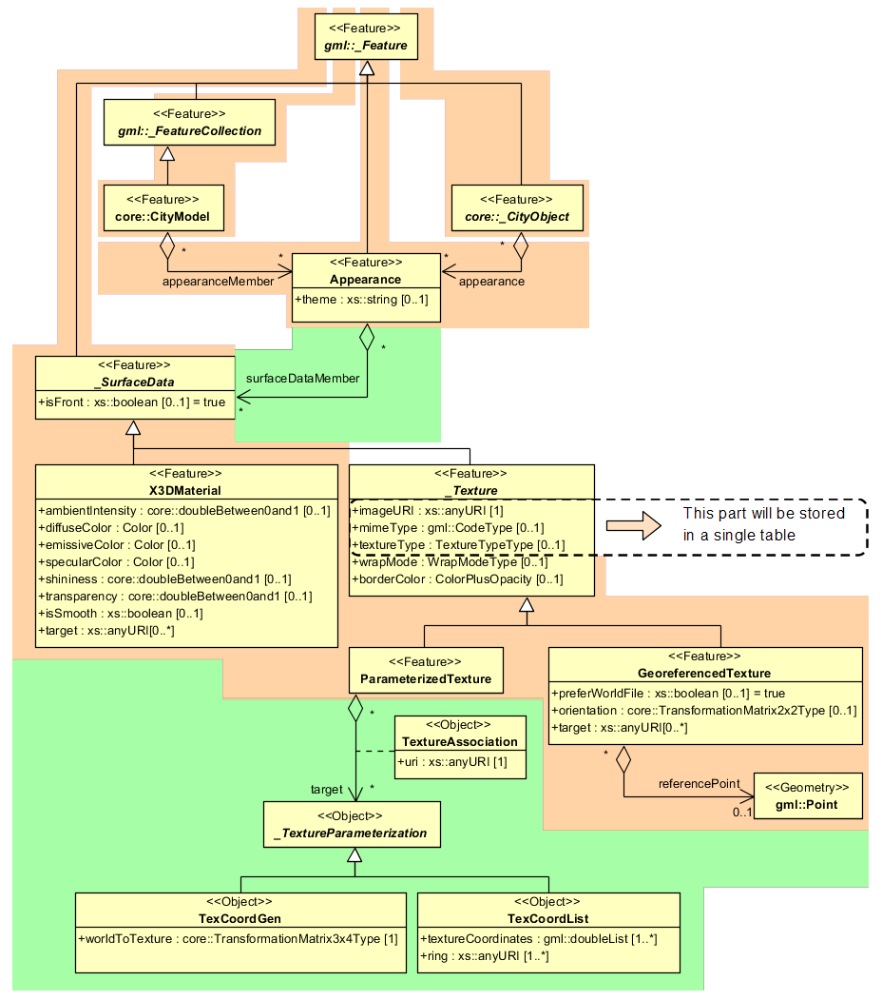

Appearance Model
~~~~~~~~~~~~~~~~

Information about a surface’s appearance, i.e. observable properties of
the surface, is considered an integral part of virtual 3D city models in
addition to semantics and geometry. Appearance relates to any
surface-based theme, e.g. infrared radiation or noise pollution, not
just visual properties and can be represented by – among others –
textures and georeferenced textures. Appearances are supported for an
arbitrary number of themes per city model. Each LoD of a feature can
have individual appearances. Each city object or city model respectively
may store its own appearance data. Therefore, the base CityGML classes
\_\ *CityObject* and *CityModel* contain a relation *appearance* and
*appearanceMember* respectively.

   Appearance model

Themes are represented by an identifier only. The appearance of a city
model for a given theme is defined by a set of objects of class
*Appearance*, referencing this theme through the attribute *theme*. All
appearance objects belonging to the same theme compose a virtual group.
An *Appearance* object collects surface data relevant for a specific
theme through the relation *surfaceDataMember*. Surface data is
represented by objects of the abstract class \_\ *SurfaceData*. Its only
attribute is the *Boolean* flag *isFront*, which determines the side
(front and back face of the surface) a surface data object applies to.

A constant surface property is modelled as material. A surface property,
which depends on the location within the surface, is modelled as
texture. Each surface object can have both a material and a texture per
theme and side. This allows for providing both a constant approximation
and a complex measurement of a surface’s property simultaneously. If a
surface object is to receive multiple textures or materials, each
texture or material requires a separate theme. The mixing of themes or
their usage is not explicitly defined but left to the application.

Materials define light reflection properties being constant for a whole
surface object. The definition of the class *X3DMaterial* is adopted
from the X3D and COLLADA specification (cf. X3D, COLLADA specification):

-  *diffuseColor* defines the colour of diffusely reflected light.

-  *specularColor* defines the colour of a directed reflection.

-  *emissiveColor* is the colour of light generated by the surface.

All colours use RGB values with red, green, and blue chanels, each
defined as value between 0 and 1. Transparency is stored separately
using the *transparency* element where 0 stands for fully opaque and 1
for fully transparent. *ambientIntensity* specifies the minimum
percentage of *diffuseColor* that is visible regardless of light
sources. *shininess* controls the sharpness of the specular highlight. 0
produces a soft glow while 1 results in a sharp highlight. *isSmooth*
gives a hint for normal interpolation. If this Boolean flag is set to
true, vertex normals should be used for shading (Gouraud shading).
Otherwise, normals should be constant for a surface patch (flat
shading). Target surfaces are specified using target elements. Each
element contains the URI of one target surface geometry object.

The base class for textures is *\_AbstractTexture*. Here, textures are
always raster-based 2D textures. The raster image is specified by
*imageURI* using a URI and may contain an arbitrary image data resource,
even a preformatted request for a web service. The image data format can
be defined using standard MIME types in the *mimeType* element. Textures
can be qualified by the attribute *textureType*, differentiating between
textures, which are specific for a certain object (*specific*) and
prototypic textures being typical for that object surface (*typical)*.
Textures may also be classified as *unknown*. The specification of
texture wrapping is adopted from the COLLADA standard. Possible values
of the attribute *wrapMode* are *none*, *wrap*, *mirror*, *clamp* and
*border*.

*\_AbstractTexture* is further specialised according to the texture
parameterisation, i.e. the mapping function from a location on the
surface to a location in the texture image. Texture parameterisation
uses the notion of texture space, where the texture image always
occupies of the region [0,1]² regardless of the actual image size or
aspect ratio. The lower left image corner is located at the origin. To
receive textures, the mapping function must be known for each surface
object.

The class *GeoreferencedTexture* describes a texture that uses a
planimetric projection. Such a texture has a unique mapping function
which is usually provided with the image file (e.g. georeferenced TIFF)
or as a separate ESRI world file. The search order for an external
georeference is determined by the Boolean flag *preferWorldFile*.
Alternatively, inline specification of a georeference similar to a world
file is possible. This internal georeference specification always takes
precedence over any external georeference. *referencePoint* defines the
location of the centre of the upper left image pixel in world space and
corresponds to values 5 and 6 in an ESRI world file. Since
*GeoreferencedTexture* uses a planimetric projection, *referencePoint*
is two-dimensional and the *orientation* defines the rotation and
scaling of the image in form of a 2x2 matrix (a list of 4 doubles in
row-major order corresponding to values 1, 3, 2, and 4 in an ESRI world
file). The CRS of this transformation is identical to the
*referencePoint*\ ’s CRS. If neither an internal nor an external
georeference is given, the *GeoreferencedTexture* is invalid. Target
surfaces are specified using target elements. Each element contains the
URI of one target surface geometry object. All target surface objects
share the mapping function defined by the georeference.

The class *ParameterizedTexture* describes a texture with a
target-dependent mapping function. Each target surface geometry object
is specified as URI in the *uri* attribute of a separate *target*
element. The mapping is defined by associated classes of
*\_TextureParameterization*:

-  *TexCoordList* for the concept of texture coordinates, defining an
   explicit mapping of a surface’s boundary points to points in texture
   space, and

-  *TexCoordGen* when using a common 3x4 transformation matrix from
   world space to texture space, specified by the attribute
   *worldToTexture.*
