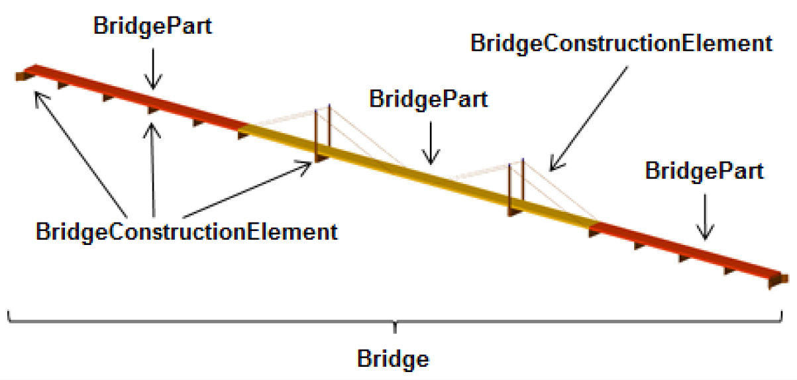
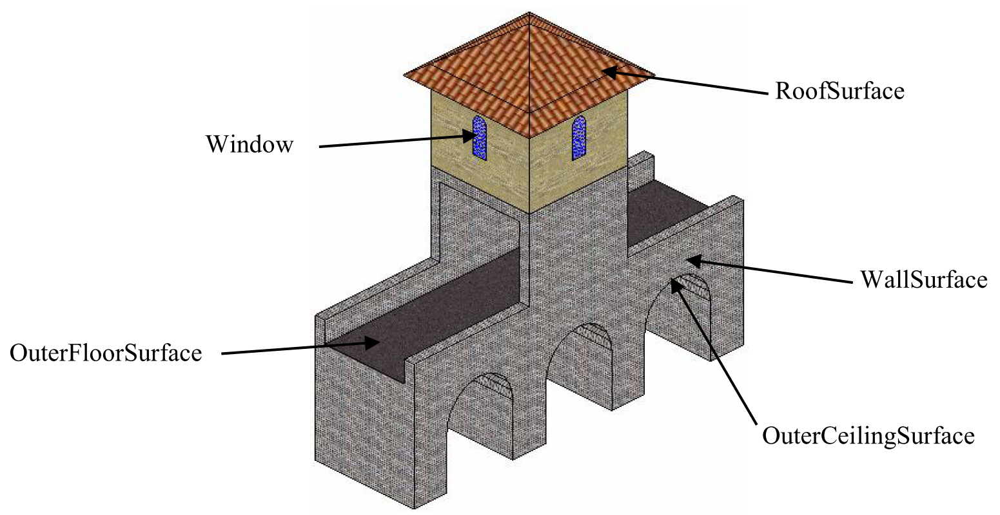
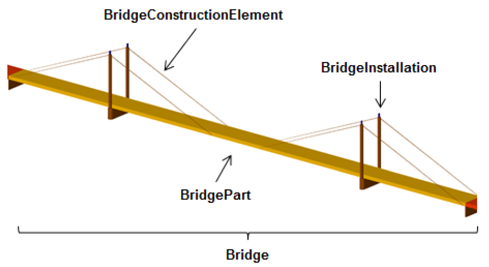
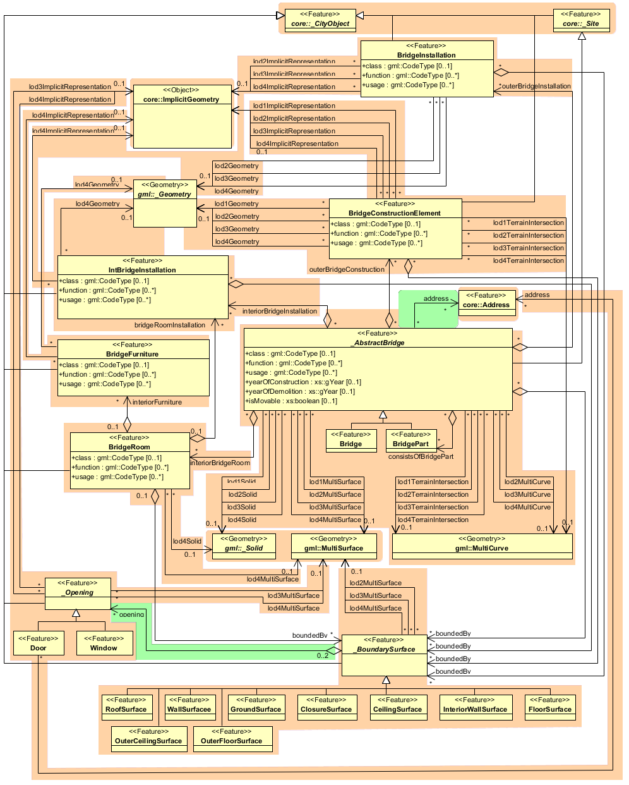

.. _citydb_bridge_model_chapter:

Bridge model
^^^^^^^^^^^^

The bridge model was developed in analogy to the building model (cf.
:numref:`citydb_building_model_chapter`) with regard to structure and attributes [GKCN2008]_.
The bridge model allows for the representation of the thematic,
spatial and visual aspects of bridges and bridge parts in four levels of
detail, LOD 1 – 4. A (movable or unmovable) bridge can consist of
multiple *BridgeParts*. Like *Bridge*, *BridgePart* is a subclass of
*\_AbstractBridge* and hence, has the same attributes and relations. The
relation *consistOfBridgePart* represents the aggregation hierarchy
between a *Bridge* (or a *BridgePart*) and it’s *BridgeParts*. By this
means, an aggregation hierarchy of arbitrary depth can be modelled. The
semantic attributes of an \_\ *AbstractBridge* are *class*, *function*,
*usage* and *is_movable*. The attribute class is used to classify
bridges, e.g. to distinguish different construction types (cf. :numref:`citydb_example_bridge_parts`).
The attribute function allows representing the utilization of the
bridge independently of the construction. Possible values may be railway
bridge, roadway bridge, pedestrian bridge, aqueduct, etc. The option to
denote a usage which is divergent to one of the primary functions of the
bridge (function) is given by the attribute usage. Each *Bridge* or
*BridgePart* feature may be assigned zero or more addresses using the
address property.

   Example of bridge consisting of bridge parts

The spatial properties are defined by a solid for each of the four LODs
(relations *lod1Solid* to *lod4Solid*). In analogy to the building
model, the semantical as well as the geometrical richness increases from
LOD1 (blocks model) to LOD3 (architectural model). Interior structures
like rooms are dedicated to LOD4. To cover the case of bridge models
where the topology does not satisfy the properties of a solid
(essentially water tightness), a multi-surface representation is allowed
(*lod1MultiSurface* to *lod4MultiSurface*). The line where the bridge
touches the terrain surface is represented by a terrain intersection
curve, which is provided for each LOD (relations
*lod1TerrainIntersection* to *lod4TerrainIntersection*). In addition to
the solid representation of a bridge, linear characteristics like ropes
or antennas can be specified geometrically by the *lod1MultiCurve* to
*lod4MultiCurve* relations.

The thematic boundary surfaces of a bridge are defined in analogy to the
building module. \_\ *BoundarySurface* is the abstract base class for
several thematic classes, structuring the exterior shell of a bridge as
well as the visible surfaces of rooms, bridge construction elements and
both outer and interior bridge installations. From *\_BoundarySurface*,
the thematic classes *RoofSurface*, *WallSurface, GroundSurface,
OuterCeilingSurface, OuterFloorSurface, ClosureSurface, FloorSurface,
InteriorWallSurface*, and *CeilingSurface* are derived.

   Different *BoundarySurfaces* of a bridge

Bridge elements which do not have the size, significance or meaning of a
*BridgePart* can be modelled either as *BridgeConstructionElement* or as
*BridgeInstallation*. Elements which are essential from a structural
point of view are modelled as *BridgeConstructionElement*, for example
structural elements like pylons, anchorages etc. (cf. :numref:`citydb_example_bridge_parts`
and :numref:`citydb_example_bridge_construction_element`).
A general classification as well as the intended and actual
function of the construction element are represented by the attributes
*class*, *function*, and *usage*. The visible surfaces of a bridge
construction element can be semantically classified using the concept of
boundary surfaces representing floor (*FloorSurface*), ceiling
(*CeilingSurface*), and interior walls (*InteriorWallSurface*) (cf.
:numref:`citydb_bridge_boundary_surface`). Whereas a *BridgeConstructionElement* has structural
relevance, a *BridgeInstallation* represents an element of the bridge
which can be eliminated without collapsing of the bridge (e.g. stairway,
antenna, and railing) (cf. :numref:`citydb_example_bridge_construction_element`). *BridgeInstallations* occur in
LOD 2 to 4. The class *BridgeInstallation* contains the semantic
attributes class, function and usage. The attribute class gives a
classification of installations of a bridge. With the attributes
function and usage, nominal and real functions of the bridge
installation can be described.

   Example of bridge consisting of *BridgeConstructionElement* and *BridgeInstallation*

In LOD3 and LOD4, a \_\ *BoundarySurface* may contain *\_Openings* like
doors and windows. The classes *BridgeRoom*, *IntBridgeInstallation* and
*BridgeFurniture* allow for the representation of the bridge interior.
They are designed in analogy to the classes *Room*,
*IntBuildingInstallation* and *BuildingFurniture* of the building module
and share the same meaning. The bridge interior can only be modelled in
LOD4.

   UML diagram of bridge model
