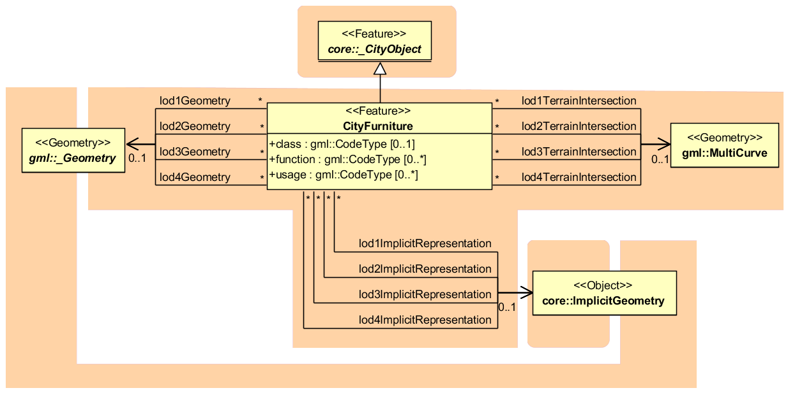

CityFurniture Model
^^^^^^^^^^^^^^^^^^^

City furniture objects are immovable objects like lanterns, traffic
lights, traffic signs, flower buckets, advertising columns, benches,
delimitation stakes, or bus stops. The class *CityFurniture* may have
the attributes *class*, *function and usage* (cf. UML-diagram, Figure
13). Their possible values are explained in detail in the CityGML
specification. The class attribute allows an object classification like
traffic light, traffic sign, delimitation stake, or garbage can, and can
occur only once. The function attribute describes, to which thematic
area the city furniture object belongs to (e.g. transportation, traffic
regulation, architecture etc.), and can occur multiple times. The
attribute *usage* denotes the real purpose of the city object, and can
occur multiple times as well.

|image16|

Figure 13: City furniture model

Since *CityFurniture* is a subclass of *CityObject* and hence is a
feature, it inherits the attribute *gml:name*. As with any *CityObject*,
*CityFurniture* objects may be assigned *ExternalReferences* and
*GenericAttributes*. For *ExternalReferences* city furniture objects can
have links to external thematic databases. Thereby, semantical
information of the objects, which cannot be modelled in CityGML, can be
transmitted and used in the 3D city model for further processing, for
example information from systems of power lines or pipelines, traffic
sign cadastre, or water resources for disaster management.

City furniture objects can be represented in city models with their
specific geometry, but in most cases the same kind of object has an
identical geometry. The geometry of *CityFurniture* objects in LoD 1-4
may be represented by an explicit geometry (*lodXGeometry* where X is
between 1 and 4) or an *ImplicitGeometry* object
(*lodXImplicitRepresentation* with X between 1 and 4). In the concept of
*ImplicitGeometry* the geometry of a prototype city furniture object is
stored only once in a local coordinate system and referenced by a number
of features. Spatial information of city furniture objects can be taken
from city maps or from public and private external information systems.
In order to specify the exact intersection of the DTM with the 3D
geometry of a city furniture object, the latter can have a
*TerrainIntersectionCurve* (TIC) for each LoD. This allows for ensuring
a smooth transition between the DTM and the city furniture object.

