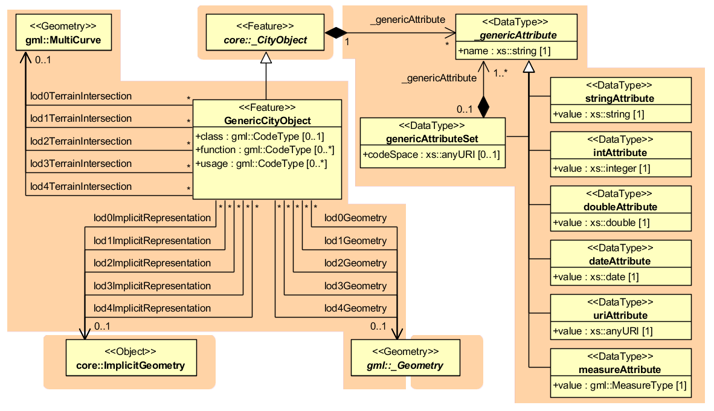

.. _citydb_generic_model_chapter:

Generics model
^^^^^^^^^^^^^^

The concept of generic objects and attributes has been introduced in CityGML to
facilitate the storage and exchange of 3D objects, which are not covered
by explicitly modelled classes within CityGML or which requires
additional attributes. These generic extensions are realised by the
class *GenericCityObject* and the data type *genericAttribute* (cf.
:numref:`citydb_generic_model`).

A *GenericCityObject* may have the attributes *class, function,* and
*usage* are specified as *gml:CodeType*. The *class* attribute allows an
object classification within the thematic area such as bridge, tunnel,
pipe, power line, dam, or unknown. The *function* attribute describes to
which thematic area the *GenericCityObject* belongs (e.g. site,
transportation, architecture, energy supply, water supply, unknown
etc.). The attribute *usage* can be used, if the object's usage differs
from its function. Each \_\ *CityObject* and all thematic subclasses can
have an arbitrary number of *genericAttributes*. Data types may be
*String*, *Integer*, *Double* (floating point number), *URI* (Unified
Resource Identifier), *Date,* and *gml:MeasureType.* The attribute type
is defined by the selection of the particular subclass of
*\_genericAttribute* (*stringAttribute*, *intAttribute* etc.). In
addition, generic attributes can be grouped using the
*genericAttributeSet* class which is derived from *\_genericAttribute*
and thus is also realized as generic attribute. Its value is the set of
contained generic attributes.

   *GenericCityObject* model

The geometry of a *GenericCityObject* can either be an explicit GML3
geometry or an *ImplicitGeometry*. In the case of an explicit geometry,
the object can have only one geometry for each LoD, which may be an
arbitrary 3D GML geometry object (class *\_Geometry*, which is the base
class of all GML geometries, *lodXGeometry, X in 0…4*). Absolute
coordinates according to the reference system of the city model must be
given for the explicit geometry. In the case of an *ImplicitGeometry*, a
reference point (anchor point) of the object and optionally a
transformation matrix must be given. In order to compute the actual
location of the object, the transformation of the local coordinates into
the reference system of the city model must be processed and the anchor
point coordinates must be added. The shape of an *ImplicitGeometry* can
be given as an external resource with a proprietary format, e.g. a VRML
or DXF file from a local file system or an external web service.
Alternatively, the shape can be specified as a 3D GML3 geometry with
local Cartesian coordinates using the property *relativeGeometry*.

In order to specify the exact intersection of the DTM with the 3D
geometry of a *GenericCityObject,* the latter can have
*TerrainIntersectionCurves* for every LoD. This is important for 3D
visualization but also for certain applications like driving simulators.
For example, if a city wall (e.g., the Great Wall of China) should be
represented as a *GenericCityObject,* a smooth transition between the
DTM and the road on the city wall would have to be ensured (in order to
avoid unrealistic bumps).

