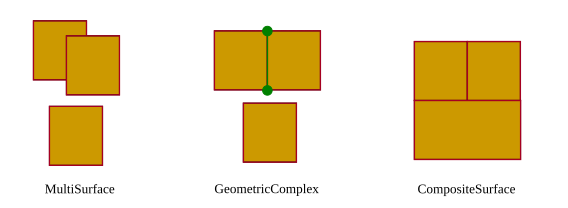

.. _citydb_geometric-topological_model:

Geometric-topological Model
~~~~~~~~~~~~~~~~~~~~~~~~~~~

The geometry model of CityGML consists of primitives, which may be
combined to form complexes, composite geometries or aggregates. A
zero-dimensional object is modelled as a *Point*, a one-dimensional as a
\_\ *Curve.* A curve is restricted to be a straight line, thus only the
GML3 class *LineString* is used.

Combined geometries can be aggregates, complexes or composites of
primitives (see illustration in :numref:`citydb_aggregated_geometry_types`). In an *Aggregate*, the
spatial relationship between components is not restricted. They may be
disjoint, overlapping, touching, or disconnected. GML3 provides a
special aggregate for each dimension, a *MultiPoint*, a *MultiCurve, a
MultiSurface* or a *MultiSolid*. In contrast to aggregates, a *Complex*
is topologically structured: its parts must be disjoint, must not
overlap and are allowed to touch, at most, at their boundaries or share
parts of their boundaries. A *Composite* is a special complex provided
by GML3. It can only contain elements of the same dimension. Its
elements must be disjoint as well, but they must be topologically
connected along their boundaries. *A Composite* can be a
*CompositeSolid,* a *CompositeSurface, or CompositeCurve*.

   Different types of aggregated geometries [GKNH2012]_

The modelling of two-dimensional and three-dimensional geometry types is
handled in a simplified way. All surface-based geometries are stored as
polygons, which are aggregated to *MultiSurfaces*, *CompositeSurfaces*,
*TriangulatedSurfaces*, *Solids*, *MultiSolids*, as well as
*CompositeSolids* accordingly. This simplification substitutes the more
complex representation used for those GML geometry classes in grey
blocks in Figure 2. Mapping the UML diagram to the relational schema now
requires only one table (SURFACE_GEOMETRY), which is explained in
:numref:`citydb_schema_geometry`.

.. figure:: ../../media/citydb_geometrical-topographical_model.png
   :name: citydb_geometrical-topographical_model

   Geometrical-topographical model. For simplification the geometry classes
   in the grey block are substituted by the construct in the orange block

In order to implement topology, CityGML uses the XML concept of *XLinks*
provided by GML. Each geometry object that should be shared by different
geometric aggregates or different thematic features is assigned a unique
identifier, which may be referenced by a GML geometry property using a
*href* attribute. The XLink topology is simple and flexible and nearly
as powerful as the explicit GML3 topology model. However, a disadvantage
of the XLink topology is that navigation between topologically connected
objects can only be performed in one direction (from an aggregate to its
components), not (immediately) bidirectional, as it is the case for
GML’s built-in topology.