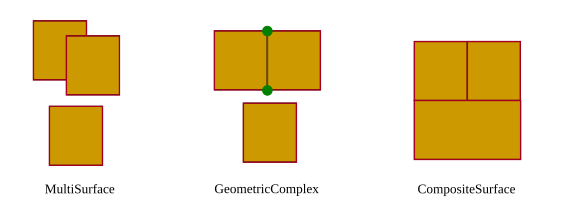
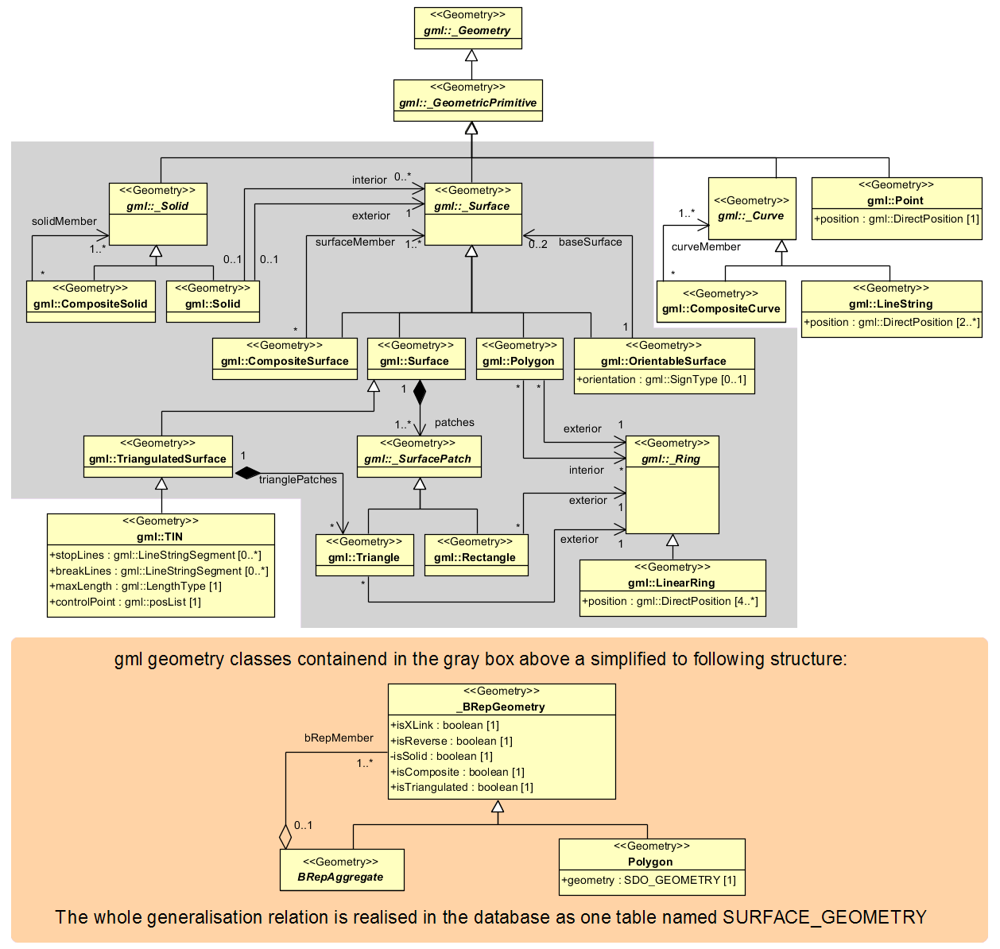

.. _citydb_geometry_model:

Geometry model
==============

Spatial properties of features are represented in CityGML using GML3’s
geometry model, which is based on the ISO 19107 standard *Spatial Schema*
[Herr2001]_ and represents 3D geometry according to the well-known
Boundary Representation (B-Rep, cf. [FVFH1995]_). Actually only a subset
of the GML3 geometry package is used in CityGML. In addition, GML3's
explicit Boundary Representation is extended by a *implicit geometry*
representation, which allows to define and reuse template geometries.

.. _citydb_geometric-topological_model:

Geometric-topological model
---------------------------

The geometry model of CityGML consists of primitives, which may be
combined to form complexes, composite geometries or aggregates. A
zero-dimensional object is modelled as a *Point*, a one-dimensional as a
*_Curve.* A curve is restricted to be a straight line, thus only the
GML3 class *LineString* is used.

Combined geometries can be aggregates, complexes or composites of
primitives (see illustration in :numref:`citydb_aggregated_geometry_types`).
In an *Aggregate*, the
spatial relationship between components is not restricted. They may be
disjoint, overlapping, touching, or disconnected. GML3 provides a
special aggregate for each dimension, a *MultiPoint*, a *MultiCurve, a
MultiSurface* or a *MultiSolid*. In contrast to aggregates, a *Complex*
is topologically structured: its parts must be disjoint, must not
overlap and are allowed to touch, at most, at their boundaries or share
parts of their boundaries. A *Composite* is a special complex provided
by GML3. It can only contain elements of the same dimension. Its
elements must be disjoint as well, but they must be topologically
connected along their boundaries. *A Composite* can be a
*CompositeSolid,* a *CompositeSurface, or CompositeCurve* and
must be homeomorphic to the corresponding primitive geometry.

   Different types of aggregated geometries [GKNH2012]_

The modelling of two-dimensional and three-dimensional geometry types in the 3DCityDB is
handled in a simplified way. All surface-based geometries are stored as
polygons, which are aggregated to *MultiSurfaces*, *CompositeSurfaces*,
*TriangulatedSurfaces*, *Solids*, *MultiSolids*, as well as
*CompositeSolids* accordingly. This simplification substitutes the more
complex representations used for the GML geometry classes in the grey
block of :numref:`citydb_geometrical-topographical_model` with the elements
in the orange block. This way, mapping surface-based geometries to the relational schema
can be done with **a single table** (called SURFACE_GEOMETRY, see
:numref:`chapter_citydb_schema_geometry` for a detailed description).

   Geometric-topological model. For simplification the geometry classes
   in the grey block are substituted by the construct in the orange block

Another reason for the explicit surface-based storage is that each surface can be
assigned multiple appearances (e.g., textures) in CityGML and, thus, each
appearance must be explicitly linkable to the corresponding polygons in
the database (see also :numref:`citydb_appearance_model_chapter`).

Implicit geometry
-----------------

The concept of implicit geometries is an enhancement of the GML3
geometry model. An implicit geometry is a geometric object, where the shape is stored
only once as a prototypical geometry. Examples are trees or other
vegetation objects, traffic lights or traffic signs. This template
geometry object is re-used or referenced many times, wherever the
corresponding feature occurs in the 3D city model. Each occurrence is
represented by a link to the prototypic shape geometry (in a local
Cartesian coordinate system), by a transformation matrix that is
multiplied with each 3D coordinate of the prototype, and by an anchor
point denoting the base point of the object in the world coordinate
reference system. The concept of implicit geometries is similar to the
well-known concept of **primitive instancing** used for the
representation of **scene graphs** in the field of computer graphics
[FVFH1995]_.

.. figure:: ../../media/citydb_implicit_geometry_model.png
   :name: citydb_implicit_geometry_model
   :align: center

   Implicit geometry model

Implicit geometries may be applied to features from different thematic
fields in order to geometrically represent the features within a
specific level of detail (LOD). Thus, each CityGML thematic extension
module (like *Building*, *Bridge*, and *Tunnel* etc.) may define spatial
properties providing implicit geometries for its thematic classes.

The shape of an implicit geometry can be represented in an external file
with a proprietary format, e.g. a VRML file, a DXF file, or a 3D Studio
MAX file. The reference to the implicit geometry can be specified by an
URI pointing to a local or remote file, or even to an appropriate web
service. Alternatively, a GML3 geometry object can define the shape.
This has the advantage that it can be stored or exchanged inline within
the CityGML dataset. Typically, the shape of the geometry is defined in
a local coordinate system where the origin lies within or near to the
object’s extent. If the shape is referenced by an URI, also the MIME
type of the denoted object has to be specified (e.g. “model/vrml” for
VRML models or “model/x3d+xml” for X3D models).

The implicit representation of 3D object geometry has some advantages
compared to the explicit modelling, which represents the objects using
absolute world coordinates. It is more space-efficient, and thus more
extensive scenes can be stored or handled by a system. The visualization
is accelerated since 3D graphics hardware supports the scene graph
concept. Furthermore, the usage of different shape versions of objects
is facilitated, e.g. different seasons, since only the library objects
have to be exchanged.