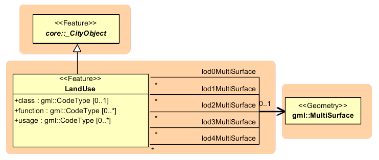

LandUse model
^^^^^^^^^^^^^

*LandUse* objects describe areas of the earth’s surface dedicated to a
specific land use. They can be employed to represent parcels in 3D.
:numref:`citydb_landuse_model` shows the UML diagram of land use objects.

Every *LandUse* object may have the attributes *class* (e.g. settlement
area, industrial area, farmland etc.), *function* (purpose, e.g.
cornfield), and *usage* which can be used, if the way the object is
actually used differs from the function. Since the attributes *usage*
and *function* may be used multiple times, storing them in only one
string requires a single white space as unique separatorRelational
database schema.

   *LandUse* model

The *LandUse* object is defined for all LoD 0-4 and may have different
geometries for each LoD. The surface geometry of a *LandUse* object is
required to have 3D coordinate values. It must be a GML3 *MultiSurface*,
which might be assigned appearance properties like material
(*X3DMaterial*) and texture (*\_Abstract­Texture* and its subclasses).

