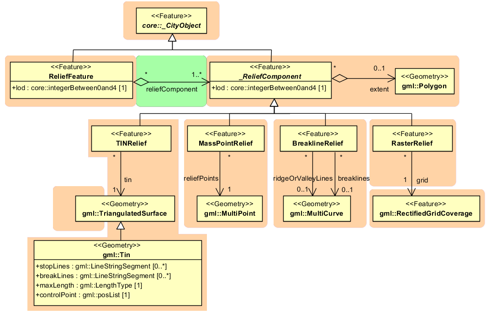
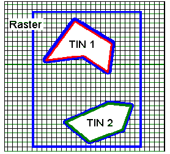

Digital terrain model
^^^^^^^^^^^^^^^^^^^^^

CityGML includes a very adaptable digital terrain model (DTM) which
permits the combination of heterogeneous DTM types (grid, TIN, break
lines, mass points) available in different levels of detail.

A DTM fitting to a certain city model is represented by the class
*ReliefFeature*. This is a *CityObject* having the LoD step that fits
the DTM as attribute. A relief consists of several *ReliefComponents*.
Each of these components that are likewise *CityObjects* also comprises
a LoD step. Individual geometrical types of the components are defined
by the four subclasses of *ReliefComponent*: breaklines, triangular
networks (TINs), mass points, and grids (raster). Geometrically, the
corresponding ISO 19107 or GML classes define these types: breaklines by
a single *MultiCurve*, TINs by *TriangulatedSurfaces*, mass points by
*MultiPoint*, and raster by *RectifiedGridCoverage*.

   UML diagram representing the digital terrain model

A relief can contain *ReliefComponents* of heterogeneous type and
different LoDs. A relief in LoD2, for example, can contain some
*LoD3-TIN-ReliefComponents* beside a *LoD2-Raster-ReliefComponent*. In
some cases even a LoD1 grid may exist in some regions of the relief.

In order to geometrically separate the individual components of a grid,
which can exist in different LoD, the validity polygon of a component
*(extent)* is used. This polygon defines the scope in which the
component is valid. A grid with three components is shown in :numref:`citydb_example_relief_components`.
It depicts a coarse raster containing two high-resolution TINs (TIN 1
and 2). The validity polygon of the raster is represented by the blue
line, while the validity polygons of the TINs are bordered in green and
red. In this case, the validity polygon of the raster (grid) has two
holes where the raster (grid) is not valid, although it does exist.
Instead, the high-resolution TINs are used for the representation of the
terrain in these regions. That means the validity polygons of the TINs
exactly fit the two holes in the validity polygon of the raster (grid).

   A relief, consisting of three components and its validity polygons (from: [PGKS2005]_)

In the simplest and most frequent case, the validity polygon of a grid
corresponds exactly with its bounding box, i.e. the spatial extent of
the grid.
