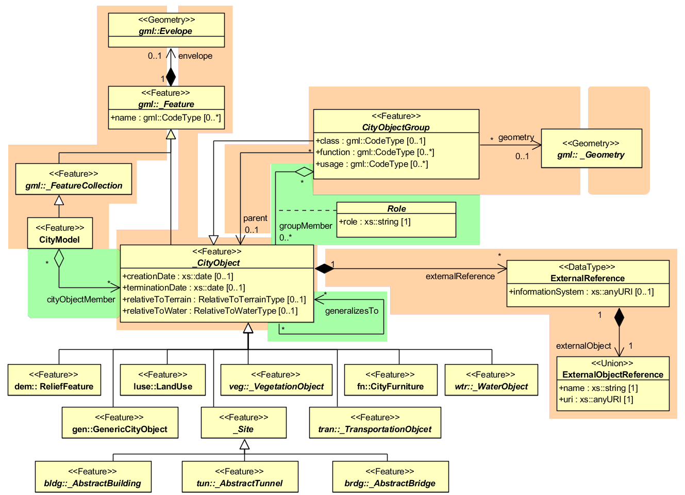

.. _citydb_core_model_chapter:

Core Model
^^^^^^^^^^

The base class of all thematic classes within CityGML’s data model is
the abstract class \_\ *CityObject*. \_\ *CityObject* provides a
creation and a termination date for the management of histories of
features as well as generic attributes and external references to
corresponding objects in other data sets. \_\ *CityObject* is a subclass
of the GML class *Feature*, thus it may inherit multiple names from
*Feature*, which may be optionally qualified by a *codeSpace*. This
enables the differentiation between, for example, an official name from
a popular name or names in different languages. The generalisation property
*generalizesTo* of \_\ *CityObject* may be used to relate features,
which represent the same real-world object in different LoD, i.e. a
feature and its generalized counterpart(s). The direction of this
relation is from the feature to the corresponding generalised feature.

Features of \_\ *CityObject* and its specialized subclasses may be
aggregated to a *CityModel*, which is a feature collection with optional
metadata. Generally, each feature has the attributes *class*,
*function*, and *usage*, unless it is stated otherwise. The *class*
attribute can occur only once, while the attributes *usage* and
*function* can be used multiple times. The *class* attribute describes
the classification of the objects, e.g. road, track, railway, or square.
The attribute *function* contains the purpose of the object, like
national highway or county road, while the attribute *usage* defines
whether an object is e.g. navigable or usable for pedestrians. The
attributes *class*, *function* and *usage* are specified as
*gml:CodeType*. The values of these properties can be enumerated in code
lists. Furthermore, for each feature the geographical extent can be
defined using the *Envelope* element. Minimum and maximum coordinate
values have to be assigned to opposite corners of the feature’s bounding
box.

   Core Model and thematic top level classes

The subclasses of *\_CityObject* comprise the different thematic
fields of a city model, in the following covered by separate thematic
models: building model (*\_AbstractBuilding*), tunnel model
(*\_AbstractTunnel*), bridge model (*\_AbstractBridge*), city furniture
model (*CiyFurniture*), digital terrain model (*ReliefFeature*), land
use model (*LandUse*), transportation model (*TransportationObject*),
vegetation model (*\_VegetationObject*), water bodies model
(*\_WaterObject*) and generic city object model (*GenericCityObject*). The
latter one allows for the modelling of features, which are not
explicitly covered by one of the other models. The separation into these
models strongly correlates with CityGML’s extension modules, each
defining a respective part of a virtual 3D city model.

3D objects are often derived from or have relations to objects in other
databases or data sets. For example, a 3D building model may have been
constructed from a two-dimensional footprint in a cadastre data set. The
reference of a 3D object to its corresponding object in an external data
set is essential, if an update must be propagated or if additional data
is required (like the name and address of a building’s owner in a
cadastral information system). In order to supply such information, each
\_\ *CityObject* may have *External References* to corresponding objects
in external data sets. Such a reference denotes the external information
system and the unique identifier of the object in this system.

*CityObjectGroups* aggregate *CityObjects* and furthermore are defined
as special *CityObjects*. This implies that a group may become a member
of another group realizing a recursive aggregation schema. Since
*CityObjectGroup* is a feature, it has the optional attributes *class*,
*function* and *usage*. The *class* attribute allows a group
classification with respect to the stated function and may occur only
once. The *function* attribute is intended to express the main purpose
of a group, possibly to which thematic area it belongs (e.g. site,
building, transportation, architecture, unknown etc.). The attribute
*usage* can be used, if the object’s usage differs from its function.
The attributes *class*, *function* and *usage* are specified as
*gml:CodeType*. The values of these properties can be enumerated in code
lists.

Each member of a group may be qualified by a role name, reflecting the
role each *CityObject* plays in the context of the group. Furthermore, a
*CityObjectGroup* can optionally be assigned an arbitrary geometry
object. This may be used to represent a generalised geometry generated
from the member’s geometries. The parent association linking a
*CityObjectGroup* to a *CityObject* allows for the modelling of generic
hierarchical groupings. This concept is used, for example, to represent
storeys in buildings. See :numref:`citydb_core_model_and_toplevel_classes` for the simplified UML diagram.

