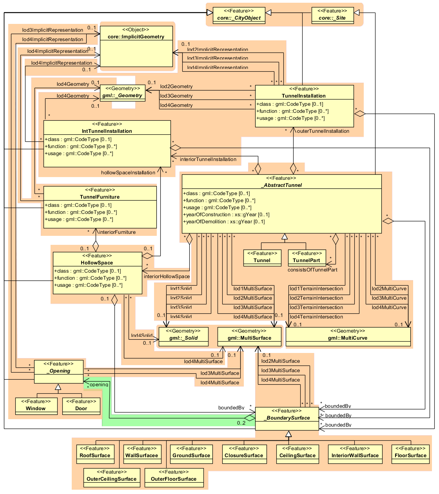

.. _citydb_tunnel_model_chapter:

Tunnel Model
^^^^^^^^^^^^

The tunnel model is closely related to the building model. It supports
the representation of thematic and spatial aspects of tunnels and tunnel
parts in four levels of detail, LOD1 to LOD4. The UML diagram of the
tunnel model is shown in :numref:`citydb_tunnel_model`. The pivotal class of the model is
\_\ *AbstractTunnel*, which is a subclass of the thematic class *\_Site*
(and transitively of the root class *\_CityObject*). *\_AbstractTunnel*
is specialized either to a Tunnel or to a TunnelPart. Since an
*\_AbstractTunnel* consists of TunnelParts, which again are
*\_AbstractTunnels*, an aggregation hierarchy of arbitrary depth may be
realized. Both classes Tunnel and TunnelPart inherit the attributes of
*\_AbstractTunnel*: the class of the tunnel, the function, the usage,
the year of construction and the year of demolition. In contrast to
*\_AbstractBuilding*, Address features cannot be assigned to
*\_AbstractTunnel*.

   Example of a tunnel modelled with two tunnel parts

The geometric representation and semantic structure of an
*\_AbstractTunnel* is shown in :numref:`citydb_tunnel_model`. The model is successively
refined from LOD1 to LOD4. Therefore, not all components of a tunnel
model are represented equally in each LOD and not all aggregation levels
are allowed in each LOD. An object can be represented simultaneously in
different LODs by providing distinct geometries for the corresponding
LODs.

   UML diagram of tunnel model

Similar to the building and bridge models (cf. :numref:`citydb_building_model_chapter` and
:numref:`citydb_bridge_model_chapter`), only the outer shell of a tunnel is represented in LOD1 – 3,
which is composed of the tunnel’s boundary surfaces to the surrounding
earth, water, or outdoor air. The interior of a tunnel may only be
modelled in LOD4.

In LOD1, a tunnel model consists of a geometric representation of the
tunnel volume. Optionally, a *MultiCurve* representing the
*TerrainIntersectionCurve* can be specified. The geometric
representation is refined in LOD2 by additional *MultiSurface* and
*MultiCurve* geometries. In LOD2 and higher LODs the outer structure of
a tunnel can also be differentiated semantically by the classes
*\_BoundarySurface* and *TunnelInstallation*. A boundary surface is a
part of the tunnel’s exterior shell with a special function like wall
(*WallSurface*), roof (*RoofSurface*), ground plate (*GroundSurface*),
outer floor (*OuterFloorSurface*), outer ceiling (*OuterCeilingSurface*)
or *ClosureSurface* (see :numref:`citydb_tunnel_boundary_surface`). The *TunnelInstallation* class is
used for tunnel elements like outer stairs, strongly affecting the outer
appearance of a tunnel. A *TunnelInstallation* may have the attributes
*class*, *function* and *usage*.

.. figure:: ../../../media/citydb_tunnel_boundary_surface.png
   :name: citydb_tunnel_boundary_surface

   Different BoundarySurfaces of a tunnel

In LOD3, the openings in *\_BoundarySurface* objects (doors and windows)
can be represented as thematic objects. In LOD4, the highest level of
resolution, also the interior of a tunnel, composed of several hollow
spaces, is represented in the tunnel model by the class *HollowSpace*.
This enlargement allows a virtual accessibility of tunnels, e.g. for
driving through a tunnel, for simulating disaster management or for
presenting the light illumination within a tunnel. The aggregation of
hollow spaces according to arbitrary, user defined criteria (e.g. for
defining the hollow spaces corresponding to horizontal or vertical
sections) is achieved by employing the general grouping concept provided
by CityGML (cf. :numref:`citydb_core_model_chapter`). Interior installations of a tunnel,
i.e. objects within a tunnel which (in contrast to furniture) cannot be
moved, are represented by the class *IntTunnelInstallation*. If an
installation is attached to a specific hollow space (e.g. lamps,
ventilator), they are associated with the *HollowSpace* class, otherwise
(e.g. pipes) with *\_AbstractTunnel*. A *HollowSpace* may have the
attributes *class*, *function* and *usage* whose possible values can be
enumerated in code lists. The *class* attribute allows a general
classification of hollow spaces, e.g. commercial or private rooms, and
occurs only once. The function attribute is intended to express the main
purpose of the hollow space, e.g. control area, installation space, and
storage space. The attribute *usage* can be used if the way the object
is actually used differs from the *function*. Both attributes can occur
multiple times. The visible surface of a hollow space is represented
geometrically as a *Solid* or *MultiSurface*. Semantically, the surface
can be structured into specialized *\_BoundarySurfaces*, representing
floor (*FloorSurface*), ceiling (*CeilingSurface*), and interior walls
(*InteriorWallSurface*). Hollow space furniture, like movable equipment
in control areas, can be represented in the CityGML tunnel model with
the class *TunnelFurniture*. A *TunnelFurniture* may have the attributes
*class, function* and *usage*.
