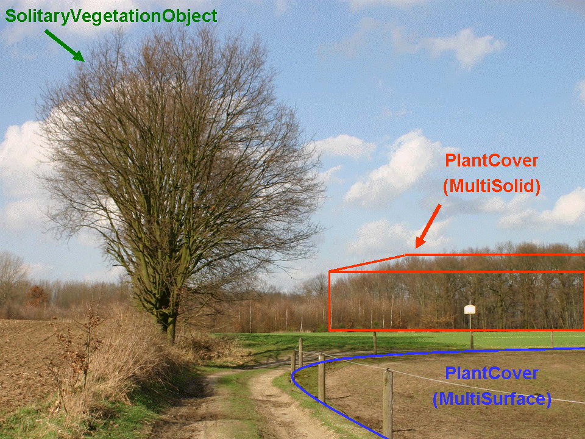
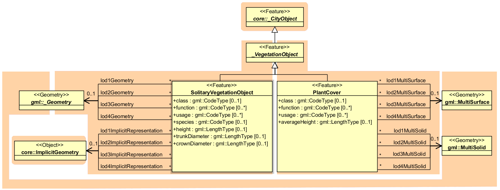

Vegetation Model
^^^^^^^^^^^^^^^^

The vegetation model of CityGML distinguishes between solitary
vegetation objects like trees and vegetation areas, which represent
biotopes like forests or other plant communities. Single vegetation
objects are modelled by the class *SolitaryVegetationObject*, while for
areas filled with specific vegetation the class *PlantCover* is used.

   Image illustrates objects of the vegetation model (from: [GKCN2008]_)

The geometry representation of a *PlantCover* feature may be a
*MultiSurface* or a *MultiSolid*, depending on the vertical extent of
the vegetation. For example, regarding forests, a *MultiSolid*
representation might be more appropriate (cf. :numref:`citydb_example_vegetation_model`).

The UML diagram of the vegetation model is depicted in :numref:`citydb_vegetation_model`. A
*SolitaryVegetation­Object* may have the attributes *class* (e.g. tree,
bush, grass), *species* (species’ name, e.g. Abies alba), *usage*, and
*function* (e.g. botanical monument)\ *, height,* *trunkDiameter* and
*crownDiameter*. A *PlantCover* feature may have the attributes *class*
(plant community)\ *, usage, function* (e.g. national forest) and
*averageHeight*. Since both *SolitaryVegetationObject* and *PlantCover*
are *CityObjects*, they inherit all attributes of a city object, in
particular its name (*gml:name)* and an *ExternalReference* to a
corresponding object in an external information system, which may
contain botanical information from public environmental agencies.

   Vegetation Model

The geometry of a *SolitaryVegetationObject* may be defined in LoD 1-4
by absolute coordinates, or prototypically by an *ImplicitGeometry*.
Season dependent appearances may be mapped using *ImplicitGeometries.*
For visualisation purposes, only the content of the library object
defining the object’s shape and appearance has to be swapped.

A *SolitaryVegetationObject* or a *PlantCover* may have a different
geometry in each LoD. Whereas a *SolitaryVegetationObject* is associated
with the \_\ *Geometry* class representing an arbitrary GML geometry (by
the relation *lodXGeometry*), a *PlantCover* is restricted to be either
a *MultiSolid* or a *MultiSurface*.

