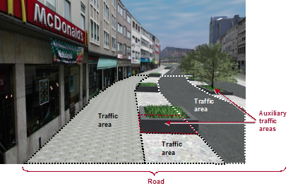
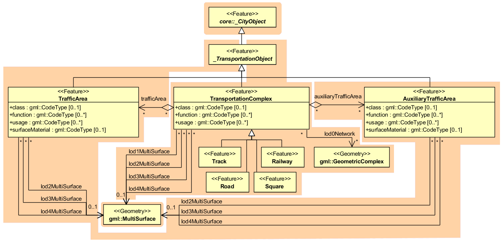

Transportation model
^^^^^^^^^^^^^^^^^^^^

The transportation model of CityGML is a multi-functional, multi-scale
model focusing on thematic and functional as well as
geometrical/topological aspects. Transportation features are represented
as a linear network in LoD0. Starting from LoD1, all transportation
features are geometrically described by 3D surfaces.

The main class is *TransportationComplex* (cf. :numref:`citydb_transportation_model`) which
represents, for example, a road, a track, a railway, or a square. It is
composed of the parts *TrafficArea* and *AuxiliaryTrafficArea*. :numref:`citydb_lod2_transportation_complex`
depicts an example for a LoD2 *TransportationComplex* configuration
within a virtual 3D city model. The *Road* consists of several
*TrafficAreas* for the sidewalks, road lanes, parking lots, and of
*AuxiliaryTrafficAreas* below the raised flower beds.

   LoD2 representation of a transportation complex (from: [GKCN2008]_)

The road itself is represented as a *TransportationComplex*, which is
further subdivided into *TrafficAreas* and *AuxiliaryTrafficAreas*. The
*TrafficAreas* are those elements, which are important in terms of
traffic usage, like car driving lanes, pedestrian zones and cycle lanes.
The *AuxiliaryTrafficAreas* are describing further elements of the road,
like kerbstones, middle lanes, and green areas.

   UML model for transportation complex

*TransportationComplex* objects can be thematically differentiated using
the subclasses *Track, Road, Railway,* and *Square.* Every
*TransportationComplex* has the attributes *class, function* and
*usage*, referencing to the external code lists. The attribute *class*
describes the classification of the object. The attribute *function*
describes the purpose of the object like, for example national motorway,
country road, or airport, while the attribute *usage* can be used, if
the actual usage differs from the function.

In addition, both *TrafficArea* and *AuxiliaryTrafficArea* may have the
attributes *class*, *function*, *usage*, and *surfaceMaterial*. The
attribute *class* describe the classification of the object. For
*TrafficArea*, the attribute *function* describes whether the object is
a car driving lane, a pedestrian zone, or a cycle lane, while the
*usage* attribute indicates which modes of transportation can use it
(e.g. pedestrian, car, tram, roller skates). The attribute
*surfaceMaterial* specifies the type of pavement and may also be used
for *AuxiliaryTrafficAreas* (e.g. asphalt, concrete, gravel, soil, rail,
grass etc.). The *function* attribute of the *AuxiliaryTrafficArea*
defines, among others, kerbstones, middle lanes, or green areas. The
possible values are specified in external code lists.

*TransportationComplex* is a subclass of *\_TransportationObject* and of
the root class *\_CityObject*. The geometrical representation of the
*TransportationComplex* varies through the different levels of detail.
In the coarsest LoD0, the transportation complexes are modelled by line
objects establishing a linear network. Starting from LoD1, a
*TransportationComplex* provides an explicit surface geometry,
reflecting the actual shape of the object, not just its centreline. In
LoD2 to LoD4, it is further subdivided thematically into *TrafficAreas*,
which are used by transportation, such as cars, trains, public
transport, airplanes, bicycles, or pedestrians and in
*AuxiliaryTrafficAreas*, which are of minor importance for
transportation purposes, for example road markings, green spaces or
flower tubs.