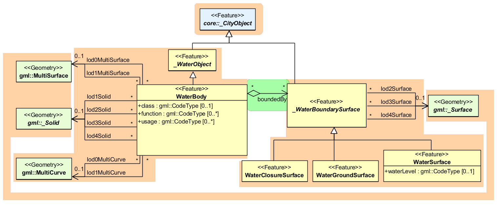

WaterBodies Model
^^^^^^^^^^^^^^^^^

The water bodies model represents the thematic aspects and 3D geometry
of rivers, canals, lakes, and basins. In LoD 2-4 water bodies are
bounded by distinct thematic surfaces. These surfaces are the obligatory
*WaterSurface*, defined as the boundary between water and air, the
optional *WaterGroundSurface*, defined as the boundary between water and
underground (e.g. DTM or floor of a 3D basin object), and zero or more
*WaterClosureSurfaces*, defined as virtual boundaries between different
water bodies or between water and the end of a modelled region (cf.
Figure 25\ **Fehler! Verweisquelle konnte nicht gefunden werden.**). A
dynamic element may be the *WaterSurface* to represent temporarily
changing situations of tidal flats.

|image28|

Figure 25: Definition of waterbody attributes (from: [Gröger et al.,
2012])

Each *WaterBody* object may have the attributes *class* (e.g. lake,
river, or fountain), *function* (e.g. national waterway or public
swimming) and *usage* (e.g. navigable) referencing to external code
lists. Since the attributes *usage* and *function* may be used multiple
times, storing them in only one string requires a unique delimiter.

*WaterBody* is a subclass of the root class *\_CityObject*. The
geometrical representation of the *WaterBody* varies for different
levels of detail. The *WaterBody* can be differentiated semantically by
the class \_\ *WaterBoundarySurface.* A \_\ *WaterBoundarySurface* is a
part of the water body’s exterior shell with a special function like
*WaterSurface*, *WaterGroundSurface* or *WaterClosureSurface.* As with
any \_\ *CityObject*, *WaterBody* objects as well as *WaterSurface*,
*WaterGroundSurface*, and *WaterClosureSurface* objects may be assigned
*ExternalReferences* and *GenericAttributes.*

Both LoD0 and LoD1 represent a low level of illustration and high grade
of generalisation. Here the rivers are modelled as *MultiCurve* geometry
and brooks are omitted. Seas, oceans, and lakes with significant extent
are represented as *MultiSurfaces.* (cf. Figure 26)

|image29|

Figure 26: Waterbody model

Starting from LoD1, water bodies may also be modelled as volumes filled
with water, represented by *Solids*. If a water body is represented by a
*Solid* in LoD2 or higher, the surface geometries of the corresponding
thematic *WaterClosureSurface*, *WaterGroundSurface*, and *WaterSurface*
objects must coincide with the exterior shell of the *Solid*. This can
be ensured, if for one LoD X the respective *lodXSurface* elements
(where *X* is between 2 and 4) of *WaterClosureSurface*,
*WaterGroundSurface*, and *WaterSurface* reference the corresponding
polygons (using XLink) within the *CompositeSurface* that defines the
exterior shell of the *Solid*. Furthermore, every
\_\ *WaterBoundarySurface* must have at least one associated surface
geometry attached.

The water body model implicitly includes the concept of
*TerrainIntersectionCurves* (TIC), e.g. to specify the exact
intersection of the DTM with the 3D geometry of a *WaterBody* or to
adjust a *WaterBody* or *WaterSurface* to the surrounding DTM. The rings
defining the *WaterSurface* polygons implicitly delineate the
intersection of the water body with the terrain or basin.

