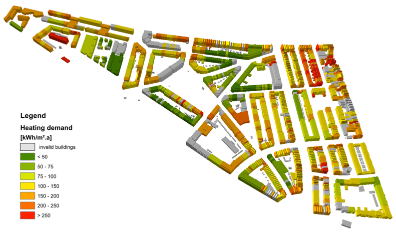
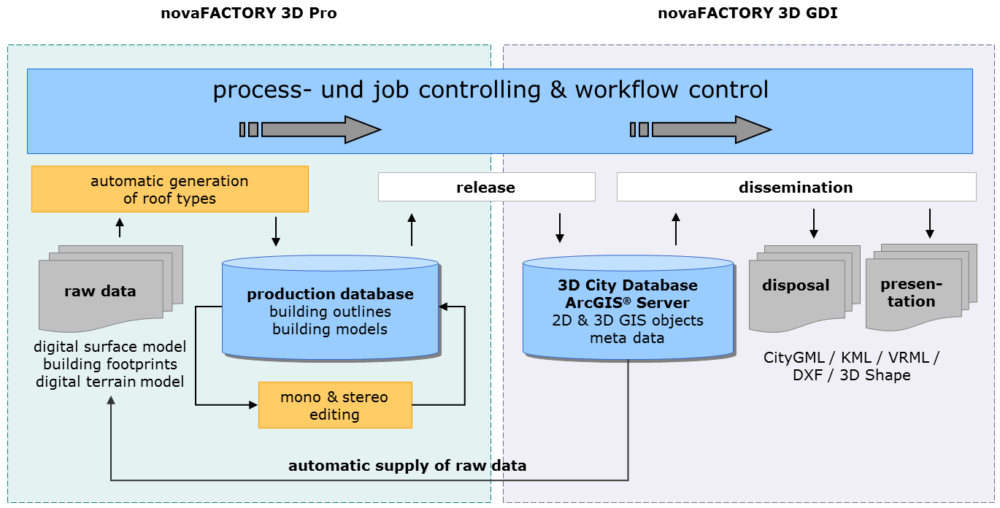

3DCityDB @ M.O.S.S.
===================

`M.O.S.S. Computer Grafik Systeme GmbH <http://www.moss.de/>`_
is a leading provider of geo
topographical data management and processing solutions. Within the
M.O.S.S. product suite novaFACTORY, the 3D City Database is used since
2011 as the primary storage container for 3D and CityGML based data.
M.O.S.S. as an active development partner within the 3D City Database
implementation group drives on the technological progress of the 3D City
Database. Within the M.O.S.S. customer projects millions of CityGML
objects are imported managed and exported by novaFACTORY and the
included 3D City Database. One example is the nationwide database for
the german LoD1 building product (LOD-DE) which is based on the 3D City
Database. novaFACTORY is also used as a 3D platform within different
projects concerning renewable energy topics like building heat demand
analysis or solar potential assessment.

   Example of a 3D building heat demand map for the city of
   Ludwigsburg created with novaFACTORY 3D within project
   `SimStadt <http://simstadt.hft-stuttgart.de/>`_

novaFACTORY at a glance
-----------------------

novaFACTORY is an advanced Spatial Data Management solution for
efficient geodata cataloguing, exploitation and dissemination. With
novaFACTORY we are leading the way in the full integration of
enterprise-wide geospatial data sources which the whole organization can
have access to and work from, covering all aspects of

-  **Data Import**

-  **Quality Assurance**

-  **Data Storage and Management**

-  **Data Processing and Enrichment**

-  **Data Dissemination**

As applications for geodata have grown, so too has the need to
efficiently administer them. Many businesses, whether government
departments or private companies, are faced with the complex task of
managing geospatial data. The challenge is to allow collaboration across
the organization in a meaningful way, from a range of sources and
formats located throughout their enterprise.

novaFACTORY is the solution to this challenge. It brings geodata
together and eliminates barriers to spatial data usability by
automatically uniting disparate data and combining them into one spatial
database. novaFACTORY is designed for seamlessly integrating large
geographical data sets from many different sources, e.g. topographic
maps, digital surface models, aerial photographs or 3D building models.

Within novaFACTORY the module 3D GDI is where the 3D City Database comes
into the action.

   novaFACTORY 3D overview and workflow. 3D data management based on 3D City Database

novaFACTORY 3D GDI
------------------

The novaFACTORY 3D GDI module is designed for handling and serving 3D
city models in CityGML format. It enables the RDBMS based seamless
storage and dissemination of 3D city models as well as setting up web
services using them. The data is kept within the 3D City Database and
can be automatically transferred into an ArcGIS® Geodatabase.

As with all novaFACTORY modules data can be disseminated via an
intuitive web interface and via any workstation, in alternatively
formats, e.g. CityGML, KML/COLLADA, VRML, 3D Shape, 3D PDF and 3D DXF.
Depending on which kind of format is chosen different export parameters
can be opted for showing specific object data.

Additional benefit is gained by automatically enhancing the 3D building
data. The novaFACTORY 3D GDI module offers a fully integrated solar
potential analysis during the export, targeted at the area of interest.
3D data can be visualized directly. Appropriate ArcGIS presentation
rules will be generated automatically during the export.

The novaFACTORY 3D GDI module works best in cooperation with the
novaFACTORY 3D Pro module for automatic recognition of building roofs
from photogrammetric raw data. This raw data will be supplied
automatically and the 3D City Database will be updated automatically
when production data are approved.
