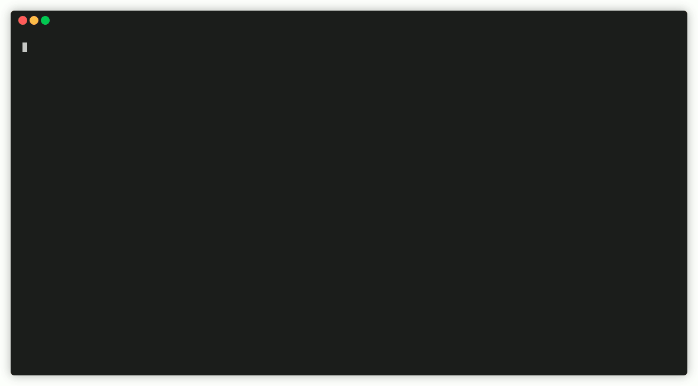

.. _first_steps_docker_chapter:

###############################################################################
Docker Images
###############################################################################

`Docker <https://docker.com>`_ is a widely used virtualization technology
that makes it possible to pack an application with all its required resources
into a standardized unit - the *Docker Container*. Software encapsulated in
this way can run on Linux, Windows, macOS and most cloud services
without any further changes or setup process. Docker containers are lightweight
compared to traditional virtualization environments that emulate an entire
operating system because they contain only the application and all the
tools, program libraries, and files it requires.

It allows you to get e.g. a 3DCityDB instance up and running in a fews seconds,
without having to setup a database server or the 3DCityDB database schema.

  Starting a 3DCityDB container and connecting to the database in seconds.

Docker images are available for the following tools of the 3DCityDB software
suite:

- :doc:`3D City Database <../3dcitydb/docker>`
- :doc:`3D City Database Importer/Exporter <../impexp/docker>`
- :doc:`3D Web Map Client <../webmap/docker>`
- :doc:`3DCityDB Web Feature Service (WFS) <../wfs/docker>`

All images are available from
`3DCityDB DockerHub <https://hub.docker.com/orgs/3dcitydb>`_.

`Docker Compose <https://hub.docker.com/u/tumgis/>`_ files are available
for orchestrating the individual services. This allows for example,
that a single command call can be used to create a 3DCityDB linked to a
3DCityDB WFS, which makes the data from the database accessible via a
standardized web interface.

*******************************************************************************
Getting started
*******************************************************************************
In this section you will find *quick start* code snippets for all 3DCityDB Docker
images to get you running in a few seconds.
For a more comprehensive documentation please visit the individual site of each
image.

.. note:: Replace the line continuation character  ``\`` with ``^`` for Windows
   systems.

3DCityDB Docker
===============================================================================

To run a PostgreSQL/PostGIS 3DCityDB container the only required settings are
a database password (``POSTGRES_PASSWORD``) and the EPSG code of the coordinate
reference system (``SRID``) of the 3DCityDB instance. Use the ``docker run -p``
switch to define a port to expose to the host system for database connections.

The detailed documentation for the 3DCityDB Docker image is available
:doc:`here <../3dcitydb/docker>`.

.. code-block:: bash

   docker run -d -p 5432:5432 --name cdb \
     -e POSTGRES_PASSWORD=changeMe! \
     -e SRID=25832 \
   3dcitydb/3dcitydb-pg

A container started with the command above will host a 3DCityDB instance
configured like this:

.. code-block:: text

   CONTAINER NAME    cdb
   DB HOST           localhost or 127.0.0.1
   DB PORT           5432
   DB NAME           postgres
   DB USER           postgres
   DB PASSWD         changeMe!
   DB SRID           25832
   DB GMLSRSNAME     urn:ogc:def:crs:EPSG::25832

Importer/Exporter Docker
===============================================================================

The 3DCityDB Importer/Exporter Docker image exposes the Command Line Interface
(CLI) of the 3DCityDB Importer/Exporter. For all export or import operations
a shared folder (``docker run -v``) to exchange data with the host system is
required. It is recommended to run the container as the currently logged in
user and group (``docker run -u``) to ensure files are readable/writeable.

The detailed documentation for the 3DCityDB Importer/Exporter Docker image is
available :doc:`here <../impexp/docker>`, the documentation of the CLI is
available :ref:`here <impexp_cli_chapter>`.

.. code-block:: bash

   docker run -i -t --name impexp --rm \
     -u $(id -u):$(id -g) \
     -v /local/share/dir:/share \
   3dcitydb/impexp COMMAND OPTS ARGS

Use the ``help`` command to see the CLI documentation and list all available commands:

.. code-block:: bash

   docker run -i -t --name impexp --rm 3dcitydb/impexp:edge-alpine help

Run ``help COMMAND`` to see the CLI documentation for a specific command:

.. code-block:: bash

   docker run -i -t --name impexp --rm 3dcitydb/impexp:edge-alpine help export

For instance, a simple CityGML export looks like this:

.. code-block:: bash

   docker run -i -t --name impexp --rm \
     -u $(id -u):$(id -g) \
     -v /local/share/dir:/share \
     3dcitydb/impexp \
       export -H my.citydb.host.de -d postgres -p postgres -u postgres -o /share/out.gml

The exported file will be available on the host system at: ``/local/share/dir/out.gml``.

3D-Web-Map-Client Docker
===============================================================================

The 3DCityDB 3D-Web-Map-Client Docker image provides an instance of the
3DCityDB 3D-Web-Map-Client. Use the ``docker run -p`` switch to expose a port
for connections to the web client.

Currently, the Webclient Docker images are maintained and documented at the
`TUM-GIS 3D-Web Client Docker repo <https://github.com/tum-gis/3dcitydb-web-map-docker>`_.

.. The detailed documentation for the 3DCityDB 3D-Web-Map-Client Docker image is
   available :doc:`here <../webmap/docker>`.

.. code-block:: bash

   docker run -d --name 3dwebmap-container -p 80:8000 tumgis/3dcitydb-web-map

Web-Feature-Service (WFS) Docker
===============================================================================

Currently, the 3DCityDB WFS Docker image is maintained and documented at the
`TUM-GIS 3DCityDB WFS Docker repo <https://github.com/tum-gis/3dcitydb-wfs-docker>`_.

.. The detailed documentation for the 3DCityDB WFS Docker image is available
   :doc:`here <../wfs/docker>`.

.. code-block:: bash

   docker run --name "citydb-wfs-container" -it -p 8080:8080 \
    -e CITYDB_CONNECTION_TYPE=PostGIS \
    -e CITYDB_CONNECTION_SERVER=my.citydb.host.de \
    -e CITYDB_CONNECTION_PORT=5432 \
    -e CITYDB_CONNECTION_SID=citydb \
    -e CITYDB_CONNECTION_USER=postgres \
    -e CITYDB_CONNECTION_PASSWORD=postgres \
  tumgis/3dcitydb-wfs
