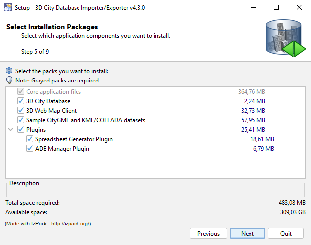

.. _first_steps_importer_exporter_installation:

Installation of the Importer/Exporter
-------------------------------------

Download the installer ``3DCityDB-Importer-Exporter-{version}-Setup.jar``
from the GitHub `release section <https://github.com/3dcitydb/importer-exporter/releases>`_
or from the 3DCityDB website at http://www.3dcitydb.org and save it to your
local file system. The installer is shipped as executable Java Archive (JAR)
file. A setup wizard will guide you through the steps of the installation
process. The wizard can be run with a graphical user interface (GUI) and as
command-line version. In addition, the installer offers an unattended
installation mode to enable automatic installation workflows.

.. _impexp_gui_installation_chapter:

GUI setup wizard
~~~~~~~~~~~~~~~~

Simply double-click on the installer file to launch the setup wizard
in GUI mode. This should work fine on most machines. Alternatively, you
can execute the wizard from the command line with the following command.

.. code:: bash

   $ java -jar 3DCityDB-Importer-Exporter-{version}-Setup.jar

Once the wizard has started, click through the steps to accept the license
agreement and to specify the installation directory for the
Importer/Exporter. Afterwards, the wizard lets you choose the
optional software packages that should be installed.

   Installation wizard of Importer/Exporter tool.

It is recommended to at least pick the *3D City Database* package
that contains all shell and SQL scripts required for setting
up an instance of the 3D City Database on your spatial database system.
Please refer to :numref:`3dcitydb_setup_schema_chapter`
for a step-by-step guide on how to use the scripts.
The *Sample CityGML and KML/COLLADA datasets* package contains
license-free sample data that may be used in your first tests.

The *Plugins* option installs plugins for the
Importer/Exporter, which add further functionality to the tool. This
release is shipped with the
:doc:`Spreadsheet Generator Plugin <../plugins/spreadsheet>`
and the
:doc:`ADE Manager Plugin <../plugins/ade-manager>`.
More plugins may be added in future releases.

The :doc:`3D Web Map Client <../webmap/index>` is a web-based
viewer for 3DCityDB content and provides high-performance 3D visualization
and interactive exploration of arbitrarily large semantic 3D city models
on top of the open source `Cesium Virtual Globe <https://cesiumjs.org/>`_.

After successful installation, the contents of all selected installation
packages are available from the installation directory. To run the
Importer/Exporter, simply use the starter script located in the installation
directory. More information on how to run the
software in GUI or CLI mode is provided in :numref:`impexp_chapter`.

.. note::
   Before the Importer/Exporter can be used to connect to a PostgreSQL or
   Oracle database, please **first follow the instructions** in
   :numref:`3dcitydb_setup_schema_chapter` to set up the 3D City Database
   schema on your database.

The installation directory contains the following subfolders:

..  table:: Contents of the installation directory
    :name: first_step_impexp_installation_directory_contents
    :widths: 25 10 65
    :class: longtable

    +---------------------+---------------+-------------------------------------------+
    | **Folder/File**     | **Optional**  | **Explanation**                           |
    +=====================+===============+===========================================+
    | 3dcitydb            | **x**         | Contains all shell and SQL scripts        |
    |                     |               | and stored procedures for operating       |
    |                     |               | the 3DCityDB                              |
    +---------------------+---------------+-------------------------------------------+
    | 3d-web-map-client   | **x**         | Contains a ZIP archive containing         | 
    |                     |               | all files required to install the         |
    |                     |               | 3D Web Map Client on a web server         |
    +---------------------+---------------+-------------------------------------------+
    | ade-extensions      |               | Contains extension packages to            |
    |                     |               | support CityGML ADEs. ADE extensions      |
    |                     |               | must only be copied into this directory   |
    |                     |               | to make them available in the program     |
    +---------------------+---------------+-------------------------------------------+
    | bin                 |               | Contains the platform-specific script     |
    |                     |               | **impexp.[bat|sh]** that allows you to    |
    |                     |               | run the Importer/Exporter from the        |
    |                     |               | command line                              |
    +---------------------+---------------+-------------------------------------------+
    | contribs            |               | Third-party tools required by the         |
    |                     |               | Importer/Exporter (e.g. **collada2gltf**  |
    |                     |               | converter binaries)                       |
    +---------------------+---------------+-------------------------------------------+
    | lib                 |               | Contains all libraries required by the    |
    |                     |               | Importer/Exporter                         |
    +---------------------+---------------+-------------------------------------------+
    | licence             |               | Contains the license files of the         |
    |                     |               | Importer/Exporter                         |
    +---------------------+---------------+-------------------------------------------+
    | plugins             |               | Contains plugins of the Importer/Exporter.|
    |                     |               | Plugins only have to be copied into this  |
    |                     |               | directory to make them available in the   |
    |                     |               | program.                                  |
    +---------------------+---------------+-------------------------------------------+
    | samples             | **x**         | Contains CityGML and KML/COLLADA/glTF     |
    |                     |               | test datasets                             |
    +---------------------+---------------+-------------------------------------------+
    | templates           |               | Contains HTML templates for information   |
    |                     |               | balloons for KML/COLLADA/glTF exports, a  |
    |                     |               | selection of coordinate reference systems |
    |                     |               | in the form of XML documents, and example |
    |                     |               | XSLT stylesheets to be used in imports    |
    |                     |               | and exports.                              |
    +---------------------+---------------+-------------------------------------------+
    | uninstaller         |               | Contains a JAR executable that uninstalls |
    |                     |               | the Importer/Exporter                     |
    +---------------------+---------------+-------------------------------------------+
    | 3DCityDB-Importer-  |               | Platform-specific starter script to       |
    | Exporter.[bat|sh]   |               | launch the Importer/Exporter with a       |
    |                     |               | graphical user interface. For instance,   |
    |                     |               | under Windows, simply double-click this   |
    |                     |               | script to run the program                 |
    +---------------------+---------------+-------------------------------------------+
    | README.txt          |               | A brief information about the application |
    +---------------------+---------------+-------------------------------------------+

.. _impexp_cli_installation_chapter:

Command-line installation
~~~~~~~~~~~~~~~~~~~~~~~~~

The setup wizard can alternatively be run in a full headless mode,
i.e., without a graphical user interface. This is useful, for instance,
if the target computer does not offer a graphical user interface or
in case the installation is done in a remote session, e.g. via SSH or
similar means.

To launch the installer in console mode rather than in GUI mode,
simply use the ``-console`` option as shown below.

.. code:: bash

   $ java -jar 3DCityDB-Importer-Exporter-{version}-Setup.jar -console

Similar to the GUI mode, the setup wizard guides you through the
steps of the installation process and user input is required at each
step to complete the installation. For example, you can also choose
from the optional software packages like in the GUI mode.

.. _impexp_unattended_installation_chapter:

Unattended installation
~~~~~~~~~~~~~~~~~~~~~~~

Instead of installing the Importer/Exporter in an interactive session
using the setup wizard, you can also automatically install and deploy
the software on multiple machines.

The following steps provide a simple way to build and deploy a default
installation:

1. Install the Importer/Exporter once using the setup wizard in GUI
   or in CLI mode as described above. Make sure to select all software
   packages required for your default installation.
2. Create a zip archive from the installation directory.
3. Copy the zip archive to the target machine(s) and unzip it to the
   destination folder.

Alternatively, you can conduct an automatic installation by using an
XML-based setup script. The advantage of this approach is that you
can adapt the setup script for each target machine. One option to
create a setup script is to run the setup wizard once
in GUI mode. When you conclude the installation and before you close
the wizard, you can save your installation settings to a file by
clicking the *Generate an automatic installation script* button.

You can also use the following template script instead.

.. code-block:: xml
   :linenos:

   <?xml version="1.0" encoding="UTF-8" standalone="no"?>
   <AutomatedInstallation langpack="eng">
     <com.izforge.izpack.panels.HelloPanel id="hello"/>
     <com.izforge.izpack.panels.InfoPanel id="info"/>
     <com.izforge.izpack.panels.LicencePanel id="license"/>
     <com.izforge.izpack.panels.TargetPanel id="target">
       <installpath>path/to/installation/directory</installpath>
     </com.izforge.izpack.panels.TargetPanel>
     <com.izforge.izpack.panels.TreePacksPanel id="packs">
       <pack index="0" name="core" selected="true"/>
       <pack index="1" name="3dcitydb" selected="false"/>
       <pack index="2" name="3d-web-map-client" selected="false"/>
       <pack index="3" name="samples" selected="false"/>
       <pack index="4" name="plugins" selected="false"/>
       <pack index="5" name="plugin.spreadsheet.generator" selected="false"/>
       <pack index="6" name="plugin.ade-manager" selected="false"/>
     </com.izforge.izpack.panels.TreePacksPanel>
     <com.izforge.izpack.panels.SummaryPanel id="summary"/>
     <com.izforge.izpack.panels.InstallPanel id="install"/>
     <com.izforge.izpack.panels.ShortcutPanel id="shortcut"/>
     <com.izforge.izpack.panels.FinishPanel id="finish"/>
   </AutomatedInstallation>

The installation directory is mandatory input and must be provided as
value of the ``<installpath>`` element (see line 7). In addition,
the software packages to be installed can be defined by setting
the *selected* attribute of the corresponding ``<pack>`` element
to either ``true`` or ``false`` (lines 10-16).

.. note::

  - The ``core`` package (l. 10) is mandatory and cannot be deselected.
  - The ``plugins`` package (l. 14) is just a container entry for the
    different plugins. It therefore makes no difference whether it is
    selected or not.
  - The rest of the template file may not be changed.

Once you have completed the setup script, copy it together with the
installer to the target machine. On the target machine, run the
installer from the command line and provide the setup script as argument.
Assuming your setup script is named ``auto-install.xml``, use the
following command to run the automatic installation.

.. code:: bash

   $ java -jar 3DCityDB-Importer-Exporter-{version}-Setup.jar auto-install.xml
