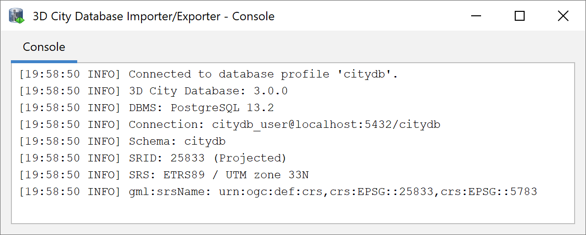

.. _first_steps_migration_chapter:

Migration from previous releases
--------------------------------

Shell scripts for migrating an existing 3DCityDB instance
to the latest version are located in the folder `ShellScripts/[Windows|Unix]/MIGRATION`
inside the installation directory of the Importer/Exporter tool.

You will only need the migration scripts for a **major version update**,
for instance, if you want to upgrade a 3DCityDB instance from version
2.x or 3.x to version 4.x. For minor version updates (i.e.,
from version 4.x to 4.y), separate upgrade scripts are provided
(see :numref:`first_steps_upgade_chapter` below). A migration might
involve changes to the 3DCityDB tables or objects, so please make sure
to backup your data before starting the migration.

.. hint::
   Another **safe and simple migration approach** is to export the
   database content from the v2.x/v3.x instance as CityGML with the
   previous version of the Importer/Exporter and re-import the data into
   the new 3D City Database version using the new Importer/Exporter
   shipped with this release. This approach might take more time though,
   depending on the amount of data stored in the database.

.. note::
   The migration scripts do not handle version-enabled tables under
   Oracle. Therefore, if you are using Oracle and have enabled
   versioning, then exporting and re-importing the data is the
   recommended way to migrate to the new 3DCityDB version.

To start the migration process run the `MIGRATE_DB` shell script. Make
sure that the database credentials entered in the `CONNECTION_DETAILS` file
are correct. The script will first prompt the user for the major version
number of the currently installed 3D City Database instance – either
**`2` or `3`**. To identify the actual version of your 3D City Database
you can use the Importer/Exporter tool to connect to the 3D City Database
instance that you want to upgrade. Starting from v3.0.0 the version
string is printed to the console window after the connection has been
successfully established as shown below (see also chapter about
:doc:`Managing connections <../impexp/db-connection-operations>`).

   Version information of a 3D City Database.

If the version string does not show up, you are running a v2.x
instance. Alternatively, the version information can also be queried
using database functions.

For PostgreSQL the command is:

.. code:: sql

   psql> SELECT major_version FROM citydb_pkg.citydb_version();

For Oracle it is:

.. code:: sql

   SQL> select MAJOR_VERSION from table(CITYDB_UTIL.CITYDB_VERSION);

If the function is not known to the system, you are probably running
a v2.x instance. For Oracle, migrating from v2 to v4 has some
prerequisites which are explained in the next chapter.

Migration from v2 to v4 on PostgreSQL
~~~~~~~~~~~~~~~~~~~~~~~~~~~~~~~~~~~~~

**Step 1 – Run MIGRATE_DB**

For PostgreSQL, migrating an existing v2.x of the 3DCityDB simply
requires executing the MIGRATE_DB shell script and choosing the
value 2 as first user input.

**Step 2 – Be sure of using unique texture URIs**

Starting from v3 of the 3D City Database, textures that are
referenced by more than one geometry are no longer stored redundantly in
the SURFACE_DATA table but only once in the TEX_IMAGE table. This
optimization can also be applied during the migration process, if you can
guarantee that texture URIs are unique and not used for different
texture files. Otherwise, some textures would get lost during the
migration and remaining images would be referenced to wrong surfaces.

If you can assure that there a no duplicate texture URIs in your
database, then trigger the optimization by choosing ‘y’ or ‘yes’ as second
input for the migration script. In case you know that textures in the
database are named equally (or if you do not know) you can still run the
script by entering ‘n’ (which is also the default value). Entries
in the TEX_IMAGE column of the SURFACE_DATA table from v2 are
then further mapped 1:1 to the TEX_IMAGE table of v4.

.. note::
   A simple unification of texture URIs in advance of the migration
   will not help to store the textures only once, because same textures
   with different URIs are regarded as different image files and would all
   end up in the new TEX_IMAGE table. You would have to compare the binary
   data itself.

**Step 3 – Check if the setup is correct**

After a series of log messages reporting the selection of data from the
v2.x schema, updates of references and the creation of database objects,
the script is finished with the message '3DCityDB migration complete!'.
If the old database schema is not dropped during the migration (see
last step), both versions of the 3D City Database will remain in one
database. This is actually a good thing, because you can further compare
if everything has been transferred correctly.

**Re-run migration if required**

If the migration process has been interrupted by the user or by severe
software errors, the migration script can be simply executed again (only
if the old v2.x schema still exists) without manually dropping already
created parts of the v4 schema because the script does it for you.

**Step 4 – Drop the deprecated v2.x schema**

To remove the deprecated parts of your 3D City Database invoke the
DROP_DB_V2 shell script.

.. warning::
   DO NOT execute the DROP_DB script from the `ShellScripts/[Windows|Unix]` folder.
   The old and new instances of the 3D City Database are both stored inside the same database
   (new = ``citydb`` schema, old = ``public`` schema). DROP_DB drops all
   database schemas for which it finds a DATABASE_SRS table, so all your data
   would be lost. So be careful to use DROP_DB_V2 instead!

Migration from v2 to v4 on Oracle
~~~~~~~~~~~~~~~~~~~~~~~~~~~~~~~~~

**Step 1 – Upgrade an existing installation**

The migration to v4.x **must be carried out on a version 2.1.0
instance** of the 3D City Database. Versions prior to version 2.1.0 must
first be upgraded to 2.1.0 since the internal storage of envelopes of
city objects changed substantially. Corresponding upgrade scripts are
shipped with the v2.1.0 release. Upgrades to 2.1.0 can be carried out
from any older version 2.0.0 to 2.0.6. A more detailed description of
the upgrade procedure can be found in the version 2.1.0 manual.

Before upgrading your 3D City Database, a database backup is highly
recommended to secure all data. The latter can be easily done using the
Importer/Exporter tool or by tools provided by Oracle.

.. note::
    Please note that the last step in the upgrade process is
    a lengthy one. Altering the internal storage of the envelopes of all
    city objects in a large and/or versioned database may take hours.
    Depending on their initial state, spatial indexes may be disabled and
    re-enabled in the process, adding to the duration as a whole. This
    process **MUST NOT** be interrupted since it could lead to an inconsistent
    state. Please be patient and remember that backing up all of your data
    before starting any database upgrade is the commonly recommended
    practice.

**Step 2 – Creating a new installation**

The migration script transfers data from a user schema with the v2.1.0
installation to another user schema that has to contain the 3D City
Database schema v4. Install the new version like it is described in
:numref:`3dcitydb_setup_schema_chapter` if not done so yet.

**Step 3 – Grant select on v2.1.0 schema to v4 schema**

The migration process requires that the user with the v4 schema can
access the user schema with the v2.1.0 version. Therefore, run the
GRANT_ACCESS_V2 shell script (see :numref:`3dcitydb_shell_scripts`) as the v2 user.
When executed the user is requested to type in the schema name for the
3D City Database v4 instance.

**Step 4 – Run MIGRATE_DB**

Now, start the MIGRATE_DB script located in the same folder like
GRANT_ACCESS_V2 as the v4 user. Choose the value 2 as first input and
specify the name of the schema with the v2.1.0 instance.

**Step 5 – Be sure of using unique texture URIs**

Like with the PostgreSQL version, you are requested to guarantee that
there are no duplicate texture URIs used for different images, or enter 'n'
to skip the texture storage optimization. See Step 2
in the description of the PostgreSQL migration for more details.

**Step 6 – Choose Spatial or Locator license option**

With the last input parameter you specify the database license running
on your Oracle server, like you have done when setting up the v4
instance of the 3D City Database. Choose ‘S’ for Spatial (which will
additionally migrate raster data) and ‘L’ for Locator.

**Step 7 – Check if the setup is correct**

The script temporary disables databases indexes and foreign key
constraints and creates an additional package with migration procedures
(CITYDB_MIGRATE). The package is removed again when the migration
progress is completed and the message "DB migration is completed."
is displayed on the console. It is recommended to
generate a database report of the new user schema and compare it with a
report of the schema that contains the 2.1 instance of the 3D City
Database (done with the previous version of the Import/Export tool).
**Verify that**

-  no city objects are missing (do a database report),

-  indexes and foreign keys got activated again,

-  relations between features and attributes are correct, and

-  exports look correct inside a viewer application.

**Step 8 – Drop the deprecated v2.x schema**

If the migration was successful, the v2.x user simply has to invoke
the DROP_DB (of version 2.x) to drop the deprecated schema. Deleting the
v2.x user works as well.

Migration from v3 to v4
~~~~~~~~~~~~~~~~~~~~~~~

The migration process from v3 to v4 does not require any user inputs
after entering the value **`3`** in the `MIGRATE_DB` script (except for
choosing the license under Oracle).

.. note::
   Schema changes on existing tables are applied with ALTER TABLE
   statements which can lock these tables for a longer period if they
   contain millions of rows.

.. _first_steps_upgade_chapter:

Upgrade between minor releases
~~~~~~~~~~~~~~~~~~~~~~~~~~~~~~

Every minor release of the 3D City Database is shipped with an `UPGRADE_DB` shell
script to update an existing database instance that is already of version 4.x.
This script can also be found in the MIGRATION folder.

When running the `UPGRADE_DB` script, it will try and check whether
a minor version update is appropriate or whether a major version update
must be performed instead. In the latter case, the script terminates with a
corresponding error message. It is always recommended to also manually
check the version information of your existing 3DCityDB instance as described
above before running the upgrade script.

During the upgrade, check the output messages of the script for errors and
warnings. The process should finish the message `3D City Database
upgrade complete`.