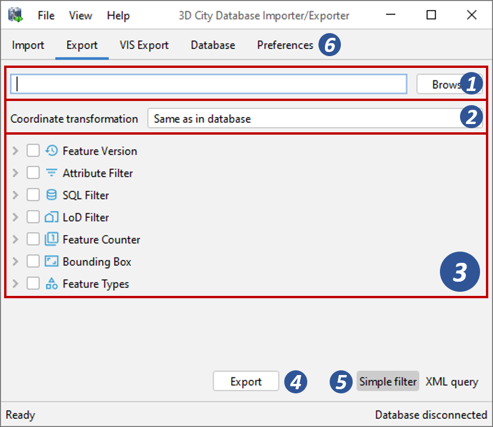
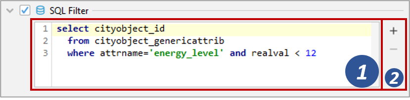

.. _impexp_citygml_export_chapter:

Exporting to CityGML
--------------------

3D city model content stored in a 3D City Database instance can be fully
or partially exported as CityGML datasets. The CityGML export is
available on the Export tab of the operations window as depicted in the
following figure.

   The CityGML export dialog.

**Output file selection.** At the top of the export dialog, the folder
and filename of the target CityGML dataset must be specified [1]. You
can either manually enter the target file or open a file selection
dialog via the *Browse* button.

The exporter supports the following file formats for writing CityGML
datasets: 1) regular XML files (\*.gml, \*.xml), 2) GZIP compressed XML
files (\*.gz, \*.gzip), and 3) ZIP archives (\*.zip). Simply make sure to
add the file extension of the file format of your choice to the name of
the target file in [1]. When choosing ZIP as target format, then all
additional files such as texture images are also written into the ZIP
container per default.

The export operation supports tiled exports, which typically results in
multiple datasets being written to the file system. Nevertheless, also
for tiled exports, only a single target file must be specified. More
details on tiled exports are provided below and in
:numref:`impexp_preferences_export_tiling_chapter`.

**Workspace selection.** If the 3D City Database instance is
version-enabled (Oracle only), the name of the *workspace* and the
*timestamp* from which the data shall be exported can be specified [2].
If no workspace is provided, the *LIVE* workspace is used by default.

**Coordinate transformation.** In general, coordinate values of geometry
objects are associated with the coordinate reference system defined for
the 3D City Database instance during setup and are exported “as is” from
the database. The export operation allows a user to apply a coordinate
transformation to another reference system during export. The target
coordinate reference system is chosen from the corresponding drop-down
list [3]. This list can be augmented with user-defined reference systems
(cf. :numref:`impexp_crs_management_chapter` for more details). When picking the entry “\ *Same as
in database*\ ”, no transformation will be applied (default behavior).

**Simple export filters.** Similar to the import process, the
export operation supports thematic and spatial filter criteria to
restrict exports to subsets of the 3D city model content. The checkboxes
on the left side of the export dialog let you choose between an
*attribute filter*, an *SQL filter*, an *LoD filter*, a *feature*
*counter filter*, a spatial *bounding box filter* and a *feature type
filter* [4]. If more than one filter is chosen, the filter criteria
are combined in a logical AND operation. If no checkbox is enabled, no
filter criteria are applied and thus all CityGML features contained in
the database will be exported.

-  **Attribute filter**: This filter lets you define values for the attributes *gml:id*, *gml:name* and
   *citydb:lineage*, which must be matched by city objects to be exported. More than one gml:id can be
   provided in a comma-separated list. Multiple gml:name or citydb:lineage values are not supported though.
-  **SQL filter**: The attribute filter only operates on predefined attributes (see above).
   To overcome this limitation, you can alternatively choose the *SQL Filter* tab and enter an arbitrary
   SELECT statement into the input field. The query must return a list of database ids of the
   city objects to be exported (i.e., references to the column ID of the table CITYOBJECT).
   The SQL filter is very powerful as you can access every column of every table in the 3DCityDB and make use
   of all functions and operations offered by the underlying database system to define your filter.
   More information about the SQL filter is provided in chapter :numref:`impexp_sql_queries_chapter`.
-  **LoD filter**: This filter allows for exporting only specific LoDs of the city objects.
   The LoD selection can be either AND or OR combined. City objects not having a spatial representation
   in one (OR) or all (AND) of the selected LoDs will not be exported. The *search depth* parameter specifies
   how many levels of nested city objects shall be considered when searching for matching LoD representations.
-  **Counter filter**: The feature counter filter limits the number of explicitly exported top-level features.
   Simply enter the number of features into the *count* field [4]. The *start index* parameter indicates
   the index within the result set from which the export shall begin. The index starts with 0. The
   parameters can be used together or individually.
-  **Bounding box filter**: The bounding box filter takes the same parameters as on the Import tab.
   It is evaluated against the ENVELOPE column of the CITYOBJECT table. The user can choose whether
   the bounding box of top-level features only needs to *overlap with* or must be strictly *inside*
   the filter geometry to satisfy the filter. Alternatively, the export can be tiled by splitting the
   bounding box into a regular grid. The number of rows and columns can be defined by the user. Each
   tile of this grid is exported into its own file. To make sure that every city object is assigned to one tile only,
   the center point of its envelope is checked to be either inside or on the left or top border of the tile.
-  **Feature type filter**: With the feature types filter, you can restrict the export to one or more
   features types by enabling the corresponding checkboxes. Only features of the
   chosen type(s) will be exported.

When exporting 3D city model content to a single CityGML file, the file
size may quickly grow. Although the Importer/Exporter supports writing
files of arbitrary size (only limited by the file system of the
operating system), such files might become too big to be processed by
other applications. A bounding box filter with tiling enabled is useful
in this case because the contents of each tile are written to separate
and thus smaller files. The output files are put into subfolders, and
the names of both the subfolders and the output files can be augmented
with tile-specific suffixes (see the tiling options of the export
preferences in chapter :numref:`impexp_preferences_export_tiling_chapter`).

.. note::
   Both the gml:name and the citydb:lineage filter internally use
   an SQL LIKE operator and wildcards for identifying matches. For example,
   if you provide the string “castle” as gml:name, this will be translated
   to “LIKE ‘%castle%’” in the SQL query.

.. note::
   When choosing a spatial *bounding filter*, make sure that
   *spatial indexes are enabled* (use the index operation on the Database tab to check the
   status of indexes, cf. :numref:`impexp_executing_database_operations_chapter`).

.. note::
   If the entire 3D city model stored in the 3DCityDB instance
   shall be exported with tiling enabled, then a bounding box spanning the
   overall area of the model must be provided. This bounding box can be
   easily calculated on the Database tab (cf. :numref:`impexp_executing_database_operations_chapter`).

.. note::
   Using the center point of the envelope as criterion for a tiled
   export has a side-effect when tiling is combined with the *counter
   filter*: the number of city objects on the tile can be less than the
   number of city objects returned by the database query because the tile
   check happens after the objects have been queried. Therefore, the
   *counter filter* only sets a possible maximum number in this filter
   combination. This is a correct behavior, so the Importer/Exporter will
   not report any errors.

.. note::
   The *feature type filter* in general behaves like for the
   CityGML import. However, regarding *city object groups* the following
   rules apply:

   1. If only the feature type *CityObjectGroup* is checked, then all city
      object groups and all their group members (independent of their
      feature type) are exported.
   2. If further feature types are selected in addition to
      *CityObjectGroup*, then only group members matching those feature
      types are exported. Of course, all features that match the type
      selection but are not group members are also exported.

**Advanced XML export query.** The export can also be controlled through
a more advanced query expression. In addition to the simple filter capabilities
explained above, a query expression offers logical operators (AND, OR,
NOT) that combine thematic and spatial filters to complex conditions.
Moreover, it allows for defining projections on the properties of the
exported city objects and provides a filter for different appearance
themes. Operators like the LoD filter or tiling are, of course, also
available for query expressions.

Query expressions are encoded in XML using a ``<query>`` element. The
query language used has been developed for the purpose of the 3DCityDB
but is strongly inspired by and very similar to the OGC Filter Encoding
2.0 standard and the query expressions used by the OGC Web Feature
Service 2.0 standard.

To enter an XML-based query expression, click on the *Use XML query*
button [6] at the bottom right of the export dialog
(cf. :numref:`impexp_CityGML_export_dialog_fig`). The
simple filter settings dialog will be replaced with an XML input field
like shown below.

   Input field to enter an XML-based query expression for CityGML exports.

The XML query is entered in [7]. This requires knowledge about the
structure and the allowed elements of the query language. A
documentation of the query language is provided in :numref:`impexp_xml_queries_chapter`.

The *new query* button |new_query_icon| on the right side of the input field
[8] can be used to create an empty query element that contains all
allowed subelements. The *copy query* button |copy_query_icon| translates all
settings defined on the simple filter dialog (cf. :numref:`impexp_CityGML_export_dialog_fig`) to an XML
query. The results of both actions can therefore be used as starting
point for defining your own query expression. The *validate query*
button |validate_query_icon| [8] performs a validation of the query entered in [7]
and prints the validation report to the console window. Only valid query
expressions are accepted by the export operation. The *Use simpe filter*
button [9] takes you back to the simple filter dialog.

You can also use an external XML editor to write XML query expressions.
External editors might be more comfortable to use and often offer
additional tools like auto completion. The XML Schema definition of the
query language (required for validation and auto completion) can be
exported via “Project Save Project XSD As…” on the main menu of the
Importer/Exporter (cf. :numref:`impexp_interface_chapter`). Make sure to use a ``<query>`` element
as root element of the query expression in your external XML editor.

**Export preferences.** In addition to the settings on the Export tab,
more fine-grained preference settings affecting the CityGML export are
available on the Preferences tab of the operations window. Make sure to
check these settings before starting the export process. A full
documentation of the export preferences can be found in :numref:`impexp_citygml_export_preferences_chapter`.
The following table provides a summary overview.

.. list-table::  Summery overview of the export preferences
   :name: citygml_export_preferences_summary_table

   * - | **Preference name**
     - | **Description**
   * - | CityGML version
     - | CityGML version to be used for exports.
   * - | Tiling options
     - | More settings for tiled exports. Requires that tiling is enabled on the
       | bounding box filter.
   * - | CityObjectGroup
     - | Defines whether group members are exported by value or by reference.
   * - | Address
     - | Controls the way in which xAL address fragments are exported from the
       | database.
   * - | Appearance
     - | Defines whether appearance information is exported.
   * - | XLinks
     - | Controls whether referenced features or geometry objects are exported using
       | XLinks or as deep copies.
   * - | XSL transformation
     - | Defines one or more XSLT stylesheets that shall be applied to the exported
       | city objects in the given order before writing them to file.
   * - | Resources
     - | Allocation of computer resources used in the export operation.

**CityGML export.** Having completed all settings, the CityGML data
export is triggered with the *Export* button [5] at the bottom of the
dialog (cf. :numref:`impexp_CityGML_export_dialog_fig`). If a database connection has not been
established manually beforehand, the currently selected entry on the
Database tab is used to connect to the 3D City Database. Progress
information is displayed within a separate status window. This status
window also offers a *Cancel* button that lets a user abort the export
process. The separate steps of the export process as well as possible
error messages are reported to the console window.

.. _impexp_sql_queries_chapter:

SQL queries
~~~~~~~~~~~

The simple filter settings on the Export tab of the Importer/Exporter
support user-defined SQL queries. The figure below shows the
corresponding SQL input field.

   Input field to enter a SQL query for CityGML exports.

The SQL query is entered in [1]. The + and - buttons [2] on the right
side of the input field allow for increasing or reducing the size of the
input field.

In general, any SELECT statement supported by the underlying database
system can be used as SQL filter. The query may operate on all tables
and columns of the database instance and may involve any database
function or operator. The SQL filter therefore provides a high degree of
flexibility for querying content from the 3DCityDB.

The only mandatory restriction is that the SQL query must return a list
of ID values of the selected city objects. Put differently, the result
set returned by the query may only contain a single column with
references to the ID column of the CITYOBJECT table. The name of the
result column can be freely chosen, and the result set may contain
duplicate ID values. Of course, it must also be ensured that the SELECT
statement follows the specification of the database system.

The following example shows a simple query that selects all city objects
having a generic attribute of name *energy_level* with a double value
less than 10.

.. code-block:: SQL

   select cityobject_id from cityobject_genericattrib where attrname='energy_level' and realval < 10

The CITYOBJECT_ID column of CITYOBJECT_GENERICATTRIB stores foreign keys
to the ID column of CITYOBJECT. The return set therefore fulfills the
above requirement.

Note that you do not have to care about the type of the city objects
belonging to the ID values in the return set. Since the SQL filter is
evaluated together with all other filter settings on the Export tab, the
export operation will automatically make sure that only top-level
features in accordance with the *feature type filter* are exported. For
example, the above query might return ID values of buildings, city
furniture, windows or traffic surfaces. If, however, only buildings
have been chosen in the feature type filter, then all ID values in the
result set not belonging to buildings will be ignored. This allows
writing generic queries that can be reused in different filter
combinations. Of course, you may also limit the result set to specific
city objects if you like.

The following example illustrates a more complex query selecting all
buildings having at least one door object.

.. code-block:: SQL

   select
        t.building_id
   from
        thematic_surface t
   inner join
        opening_to_them_surface o2t on o2t.thematic_surface_id = t.id
   inner join
        opening o on o.id = o2t.opening_id
   where
        o.objectclass_id = 39
   group by
        t.building_id
   having
        count(distinct o.id) > 0

.. note::
  Other statements than SELECT such as UPDATE, DELETE or
  DDL commands will be rejected and yield an error message. However, in
  principle, it is possible to create database functions that can be
  invoked with a SELECT statement and that delete or change content in the
  database. An example are the DELETE functions offered by the 3DCityDB
  itself (cf. :numref:`citydb_sproc_delete_chapter`). For this reason, the export operation scans
  the SQL query for these well-known DELETE functions and refuses to
  execute it in case one is found. However, similar functions can also be
  created after setting up the 3DCityDB schema and thus are not known to
  the export operation a priori. If such functions exist and a user of the
  Importer/Exporter shall not be able to accidentically invoke them
  through an SQL query, then it is **strongly recommended** that the user
  may only connect to the 3DCityDB instance via a *read-only user* (cf.
  :numref:`citydb_schema_rw_access_chapter`).

.. _impexp_xml_queries_chapter:

XML query expressions
~~~~~~~~~~~~~~~~~~~~~

A query expression is an action that directs the export operation to
search the 3DCityDB for city objects that satisfy some filter expression
encoded within the query. Query expressions are given in XML using a
``<query>`` root element. The XML language used is specific to the
Importer/Exporter and the 3DCityDB but draws many concepts from OGC
standards such as *Filter Encoding* (FE) 2.0 and *Web Feature Service*
(WFS) 2.0.

.. note::
   All XML elements of the query language are defined in the XML
   namespace http://www.3dcitydb.org/importer-exporter/config. Simply
   define this namespace as default namespace on your ``<query>`` root element.

A query expression may contain a *typeNames* parameter, a *projection
clause*, a *selection clause*, a *sorting clause*, a *counter filter*, an *LoD filter*,
an *appearance filter*, *tiling* options and a *targetSrid* attribute for
coordinate transformations.

.. list-table::  Elements of an XML query expression.
   :name: impexp_query_expression_table

   * - | **Element**
     - | **Description**
   * - | ``<typeNames>``
     - | Lists the name of one or more feature types to query (*optional*).
   * - | ``<propertyNames>``
     - | Projection clause that identifies a subset of optional feature properties that shall be
       | kept or removed in the target dataset (*optional*).
   * - | ``<filter>``
     - | Selection clause that specifies criteria that conditionally select city objects from
       | the 3DCityDB (*optional*).
   * - | ``<sortBy>``
     - | Sorting clause to specify how city objects shall be ordered in the target
       | dataset (*optional*).
   * - | ``<limit>``
     - | Limits the number of requested city objects that are exported to the target dataset
       | (*optional*).
   * - | ``<lod>``
     - | Limits the LoDs of the exported city objects to a given subset (*optional*).
   * - | ``<appearance>``
     - | Limits the appearances of the exported city objects to a given subset (*optional*).
   * - | ``<tiling>``
     - | Defines a tiling scheme for the export (*optional*).
   * - | *targetSrid*
     - | Defines a coordinate transformation *(optional)*.

<typeNames> parameter
^^^^^^^^^^^^^^^^^^^^^

The ``<typeNames>`` parameter lists the name of one or more feature types to
query from the 3DCityDB. Each name is given as *xsd:QName* and must use
an official XML namespace from CityGML 2.0 or 1.0. Only top-level
feature types are supported. The CityGML version of the associated XML
namespace determines the CityGML version used for the export dataset.
Namespaces from different CityGML versions shall not be mixed.

The following example shows how to query CityGML 2.0 bridges and
buildings:

.. code-block:: xml

    <query xmlns="http://www.3dcitydb.org/importer-exporter/config">
      <typeNames>
        <typeName xmlns:brid="http://www.opengis.net/citygml/bridge/2.0">brid:Bridge</typeName>
        <typeName xmlns:bldg="http://www.opengis.net/citygml/building/2.0">bldg:Building</typeName>
      </typeNames>
    </query>

If you want to query all feature types, then simply use the name
*core:_CityObject* of the abstract base type in CityGML, or just skip
the ``<typeNames>`` parameter.

The following table shows all supported top-level feature types together
with their official CityGML XML namespace(s) and their recommended XML
prefix.

.. list-table::  Supported CityGML top-level feature types together with their XML namespace.
   :name: impexp_toplevel_feature_types_table

   * - | **Feature type**
     - | **XML prefix**
     - | **XML namespace**
   * - | \_CityObject
     - | core
     - | http://www.opengis.net/citygml/2.0
       | http://www.opengis.net/citygml/1.0
   * - | Building
     - | bldg
     - | http://www.opengis.net/citygml/building/2.0
       | http://www.opengis.net/citygml/building/1.0
   * - | Bridge
     - | brid
     - | http://www.opengis.net/citygml/bridge/2.0
   * - | Tunnel
     - | tun
     - | http://www.opengis.net/citygml/tunnel/2.0
   * - | TransportationComplex
     - | tran
     - | http://www.opengis.net/citygml/transportation/2.0
       | http://www.opengis.net/citygml/transportation/1.0
   * - | Road
     - | tran
     - | http://www.opengis.net/citygml/transportation/2.0
       | http://www.opengis.net/citygml/transportation/1.0
   * - | Track
     - | tran
     - | http://www.opengis.net/citygml/transportation/2.0
       | http://www.opengis.net/citygml/transportation/1.0
   * - | Road
     - | tran
     - | http://www.opengis.net/citygml/transportation/2.0
       | http://www.opengis.net/citygml/transportation/1.0
   * - | Square
     - | tran
     - | http://www.opengis.net/citygml/transportation/2.0
       | http://www.opengis.net/citygml/transportation/1.0
   * - | Railway
     - | tran
     - | http://www.opengis.net/citygml/transportation/2.0
       | http://www.opengis.net/citygml/transportation/1.0
   * - | CityFurniture
     - | frn
     - | http://www.opengis.net/citygml/cityfurniture/2.0
       | http://www.opengis.net/citygml/cityfurniture/1.0
   * - | LandUse
     - | luse
     - | http://www.opengis.net/citygml/landuse/2.0
       | http://www.opengis.net/citygml/landuse/1.0
   * - | WaterBody
     - | wtr
     - | http://www.opengis.net/citygml/waterbody/2.0
       | http://www.opengis.net/citygml/waterbody/1.0
   * - | PlantCover
     - | veg
     - | http://www.opengis.net/citygml/vegetation/2.0
       | http://www.opengis.net/citygml/vegetation/1.0
   * - | SolitaryVegetationObject
     - | veg
     - | http://www.opengis.net/citygml/vegetation/2.0
       | http://www.opengis.net/citygml/vegetation/1.0
   * - | ReliefFeature
     - | dem
     - | http://www.opengis.net/citygml/relief/2.0
       | http://www.opengis.net/citygml/relief/1.0
   * - | GenericCityObject
     - | gen
     - | http://www.opengis.net/citygml/generics/2.0
       | http://www.opengis.net/citygml/generics/1.0
   * - | CityObjectGroup
     - | grp
     - | http://www.opengis.net/citygml/cityobjectgroup/2.0
       | http://www.opengis.net/citygml/cityobjectgroup/1.0

In order to simplify typing the ``<typeNames>`` parameter, you can skip the
namespace declaration from the type names. The Importer/Exporter will
then assume the corresponding CityGML 2.0 namespace, but only if you use
the recommended XML prefix from the table above. The listing below
exemplifies how to use this simplification to query all city furniture
objects from the 3DCityDB.

.. code-block:: xml

    <query>
      <typeNames>
        <typeName>frn:CityFurniture</typeName>
      </typeNames>
    </query>

<propertyNames> projection clause
^^^^^^^^^^^^^^^^^^^^^^^^^^^^^^^^^

The ``<propertyNames>`` parameter identifies a subset of optional feature
properties that shall be kept or removed in the target dataset. Property
projections can be defined for all feature types that are part of the
export, and thus not just for top-level feature types but also for
nested feature types.

The ``<propertyNames>`` parameter consists of one ore more ``<context>``
child elements, each of which must define the target feature type through
the *typeName* attribute. A context then lists the name of one ore more
feature properties and/or generic attributes. The *mode* attribute
determines the action for these properties: 1) if set to *keep*, then
only the listed properties are kept in the target dataset, and all other
properties are deleted from the feature (*default*); 2) if set to
*remove*, then only the listed properties are deleted from the feature,
and all other properties are kept.

The following listing shows an example in which only the properties
*bldg:measuredHeight* and *bldg:lod2Solid* shall be exported for
*bldg:Building* features (*mode =* keep). Note that this implies that
all other thematic and spatial properties of buildings are deleted. For
*bldg:WallSurface* features, all properties shall be kept besides the
generic measure attribute *area* (*mode =* remove).

.. code-block:: xml

    <query>
      <propertyNames>
        <context typeName="bldg:Building" mode="keep">
          <propertyName>bldg:measuredHeight</propertyName>
          <propertyName>bldg:lod2Solid</propertyName>
        </context>
        <context typeName="bldg:WallSurface" mode="remove">
          <genericAttributeName type="measureAttribute">area</genericAttributeName>
        </context>
      </propertyNames>
    </query>

The *typeName* of the target feature type must be given as *xsd:QName*.
Like for the ``<typeNames>`` parameter, the XML namespace declaration can be
skipped if XML prefixes from :numref:`impexp_toplevel_feature_types_table`
are used. Multiple ``<context>`` elements for the same *typeName* are not allowed.

Each *propertyName* must reference a valid property of the given feature
type. This includes properties that are defined for the feature type or
inherited from a parent type in the CityGML schemas, but also properties
injected through an ADE. The *propertyName* is given as *xsd:QName*.
Mandatory properties like *gml:id* cannot be removed.

Generic attributes are also referenced by their name using a
*genericAttributeName* element. The name is case sensitive and thus must
exactly match the name stored in the database. The optional *type*
attribute can be used to more precisely specify the target generic
attribute. If *type* is omitted, then all generic attributes matching
the name are kept or removed, independent of their type. If you want to
address all generic attributes of a given type but independent of their
name, then use a *propertyName* instead as illustrated below. In this
example, all *gen:stringAttributes* are removed from *bldg:Building*.

.. code-block:: xml

    <query>
      <propertyNames>
        <context typeName="bldg:Building" mode="remove">
          <propertyName>gen:stringAttribute</propertyName>
        </context>
      </propertyNames>
    </query>

The *typeName* may also point to an abstract feature type such as
*bldg:_AbstractBuilding* or *core:_CityObject*. The property projection
is then applied to all subtypes and can even be refined on the level of
individual subtypes if the value of the *mode* attribute is identical.
If *mode* differs, then the context of the subtype overrides the context
of the (abstract) supertype.

The listing below shows how to remove *gml:name* and generic attributes
of name *location* from all city objects by defining a projection
context for the abstract type *core:_CityObject*. The projection is
refined for *bldg:Building* by additionally removing
*bldg:measuredHeight*.

.. code-block:: xml

    <query>
      <propertyNames>
        <context typeName="core:_CityObject" mode="remove">
          <propertyName>gml:name</propertyName>
          <genericAttributeName>location</genericAttributeName>
        </context>
        <context typeName="bldg:Building" mode="remove">
          <propertyName>bldg:measuredHeight</propertyName>
        </context>
      </propertyNames>
    </query>

If mode would be switched to *keep* on the *bldg:Building* context in
the above example, then this would override the *core:_CityObject*
settings for buildings. Thus, buildings would only keep the
*bldg:measuredHeight* property. The *core:_CityObject* context would,
however, still apply to all other city objects besides buildings.

<filter> selection clause
^^^^^^^^^^^^^^^^^^^^^^^^^

The ``<filter>`` parameter is used to identify a subset of city objects from
the 3DCityDB whose property values satisfy a set of logically connected
predicates. If the property values of a city object satisfy all the
predicates in a filter, then that city object is part of the export.

Predicates can be expressed both on properties of the top-level feature
types listed by the ``<typeNames>`` parameter and on properties of their
nested feature types. If the predicates are not satisfied, then the
entire top-level feature is not exported.

If the ``<typeNames>`` parameter lists more than one top-level feature type,
then predicates may only be expressed on properties common to all of
them.

The ``<filter>`` parameter supports *comparison operators*, *spatial
operators* and *logical operators*. The meaning of the operators is
identical to the operators defined in the `OGC Filter Encoding (FE) 2.0
standard <http://docs.opengeospatial.org/is/09-026r2/09-026r2.html>`_,
but their encoding slightly differs.

Most expressions are formed using a *valueReference* pointing to a
property value and a *literal* value that is checked against the
property value.

.. _value:

Value references
""""""""""""""""

A value reference is a string that represents a value that is to be
evaluated by a predicate. The string can be the name of a property of
the feature type or an *XML Path Language* (XPath) expression that
represents the property of a nested feature type or a complex property.

Property names are given as *xsd:QName*. Examples for valid property
names are *core:creationDate*, *bldg:measuredHeight*, and
*tun:lod2MultiSurface*.

In cases where a property of a nested feature type or complex property
shall be evaluated, the value reference must be encoded using XPath. The
XPath expression is to be formulated based on the XML encoding of
CityGML. Note that the Importer/Exporter only supports a subset of the
full XPath language:

-  Only the abbreviated form of the child and attribute axis specifier
   is supported.
-  The context node is the top-level feature type to be exported. In
   case two or more top-level feature types are listed by the
   ``<typeNames>`` parameter, then the context node is their common parent
   type.
-  Each step in the path may include an XPath predicate of the form
   “\ *.=value*\ ” or “\ *child=value*\ ”. Equality tests can be
   logically combined using the "and" or "or" operators. Indexes are not
   supported as XPath predicate.
-  The *schema-element()* function is supported. It takes the
   *xsd:QName* of a feature type as parameter. The function selects the
   given feature type and all its subtypes.
-  The last step of the XPath must be a simple thematic attribute or a
   spatial property. Property elements that contain a nested feature are
   not allowed as last step.

Assuming that *bldg:Building* is the top-level feature type to be
exported, then the following examples are valid XPath expressions:

-  ``gen:stringAttribute/@gen:name`` selects the gen:name attribute of the
   generic string attributes of the building
-  ``gen:stringAttribute[@gen:name=’area’]/gen:value`` selects the
   gen:value of a generic string attribute with the name “area”
-  ``bldg:boundedBy/bldg:WallSurface/bldg:lod2MultiSurface`` selects the
   spatial LoD2 representation of the wall surfaces of the building
-  ``bldg:boundedBy/bldg:WallSurface[@gml:id='ID_01' or gml:name='wall']/bldg:opening/bldg:Door/gml:name``
   selects the gml:name of doors that are associated with wall surfaces having a specific gml:id
   or gml:name
-  ``bldg:boundedBy/schema-element(bldg:_BoundarySurface)/core:creationDate``
   selects the core:creationDate attribute of all boundary surfaces of the building
-  ``core:externalReference[core:informationSystem='http://somewhere.de']/core:externalObject/core:name``
   selects the core:name of the external object in an external reference to a given information system
-  ``gen:genericAttributeSet[@gen:name='energy']/gen:measureAttribute/gen:value``
   selects the gen:value of all generic measure attributes
   contained in the generic attribute set named “energy”

.. note::
   CityGML uses the *eXtensible Address Language* (xAL) to encode
   addresses of buildings, bridges and tunnels. xAL is very flexible and
   allows an address to be encoded in different ways, which makes XPath
   expressions complex to write. For this reason, the Importer/Exporter
   uses a simple ADE that can be used in XPath expressions to evaluate
   address elements such as the street or city name. More information is
   provided in :numref:`impexp_address_filter_chapter`.

.. _literals:

Literals and geometric values
"""""""""""""""""""""""""""""

Literals are explicitly stated values that are evaluated against a
*valueReference*. The type of the literal value must match the type of
the referenced value.

If the literal value is a geometric value, the value must be encoded
using one of the geometry types offered by the query language.
The following geometry types are available:

-  ``<envelope>``
-  ``<point>``
-  ``<lineString>``
-  ``<polygon>``
-  ``<multiPoint>`` (list of ``<point>`` elements)
-  ``<multiLineString>`` (list of ``<lineString>`` elements)
-  ``<multiPolygon>`` (list of ``<polygon>`` elements)

An ``<envelope>`` is defined by its ``<lowerCorner>`` and ``<upperCorner>`` elements
that carry the coordinate values. The coordinates of a ``<point>`` are
provided by a ``<pos>`` element, whereas ``<lineString>`` uses a ``<posList>``
element. A ``<polygon>`` can have one ``<exterior>`` and zero or more ``<interior>``
rings. Rings are supposed to be closed meaning that the first and the
last coordinate tuple in the list must be identical. Interior rings must
be defined in opposite direction compared to the exterior ring.

The dimension of the points contained in a ``<posList>`` as well as in
``<exterior>`` and ``<interior>`` rings can be denoted using the *dimension*
attribute. Valid values are *2* (default) or *3*.

Every geometry type offers an optional *srid* attribute to reference an
SRID defined in the underlying database. If *srid* is present, then the
coordinate tuples are assumed to be given in the reference system
associated with the corresponding SRID, which is also used in coordinate
transformations. If *srid* is not present, then the coordinate tuples
are assumed to be given in the SRID of the 3DCityDB instance.

.. list-table::

   * - 2D bounding box
     - .. code-block:: xml

        <envelope>
          <lowerCorner>30 10</lowerCorner>
          <upperCorner>60 20</upperCorner>
        </envelope>

   * - 2D point
     - .. code-block:: xml

        <point>
          <pos>30 10</pos>
        </point>

   * - 2D line string given in SRID 4326
     - .. code-block:: xml

        <lineString srid="4326">
          <posList dimension="2">45.67 88.56 55.56 89.44</posList>
        </lineString>

   * - 2D polygon with hole
     - .. code-block:: xml

        <polygon>
          <exterior>35 10 45 45 15 40 10 20 35 10</exterior>
          <interior>20 30 35 35 30 20 20 30</interior>
        </polygon>

.. _operators:

Comparison operators
""""""""""""""""""""

A comparison operator is used to form expressions that evaluate the
mathematical comparison between two arguments. The following binary
comparisons are supported:

-  ``<propertyIsEqualTo>`` (=)
-  ``<propertyIsLessThan>`` (<)
-  ``<propertyIsGreaterThan>`` (>)
-  ``<propertyIsEqualTo>`` (=)
-  ``<propertyIsLessThanOrEqualTo>`` (<=)
-  ``<propertyIsGreaterThanOrEqualTo>`` (>=)
-  ``<propertyIsNotEqualTo>`` (<>)

The optional *matchCase* attribute can be used to specify how string
comparisons should be performed. A value of *true* means that string
comparisons shall match case (default), *false* means caseless.

The following example shows how to export all buildings from the
3DCityDB whose *bldg:measuredHeight* attribute has a values less than
50.

.. code-block:: xml

    <query>
      <typeNames>
        <typeName>bldg:Building</typeName>
      </typeNames>
      <filter>
        <propertyIsLessThan>
          <valueReference>bldg:measuredHeight</valueReference>
          <literal>50</literal>
        </propertyIsLessThan>
      </filter>
    </query>

Besides these default binary operators, the following additional
comparison operators are supported:

-  ``<propertyIsLike>``
-  ``<propertyIsNull>``
-  ``<propertyIsBetween>``

The ``<propertyIsLike>`` operator expresses a string comparison with pattern
matching. A combination of regular characters, the *wildCard* character
(default: \*), the *singleCharacter* (default: .), and the
*escapeCharacter* (default: \\) define the pattern. The *wildCard*
character matches zero or more characters. The *singleCharacter* matches
exactly one character. The *escapeCharacter* is used to escape the
meaning of the *wildCard*, *singleCharacter* and *escapeCharacter*
itself. The *matchCase* attribute is also available for the
<propertyIsLike> operator.

The following example shows how to find all roads whose *gml:name*
contains the string “main”.

.. code-block:: xml

    <query>
      <typeNames>
        <typeName>tran:Road</typeName>
      </typeNames>
      <filter>
        <propertyIsLike wildCard="*" singleCharacter="." escapeCharacter="\" matchCase="false">
          <valueReference>gml:name</valueReference>
          <literal>*main*</literal>
        </propertyIsLike>
      </filter>
    </query>

The ``<propertyIsNull>`` operator tests the specified property to see if it
exists for the feature type being evaluated.

The ``<propertyIsBetween>`` operator is a compact way of expressing a range
check. The lower and upper boundary values are inclusive. The operator
is used below to find all buildings having between 10 and 20 storeys.

.. code-block:: xml

    <query>
      <typeNames>
        <typeName>bldg:Building</typeName>
      </typeNames>
      <filter>
        <propertyIsBetween>
          <valueReference>bldg:storeysAboveGround</valueReference>
          <lowerBoundary>10</lowerBoundary>
          <upperBoundary>20</upperBoundary>
        </propertyIsBetween>
      </filter>
    </query>

.. _spatial:

Spatial operators
"""""""""""""""""

A spatial operator determines whether its geometric arguments satisfy
the stated spatial relationship. The following operators are supported:

-  ``<bbox>``
-  ``<equals>``
-  ``<disjoint>``
-  ``<touches>``
-  ``<within>``
-  ``<overlaps>``
-  ``<intersects>``
-  ``<contains>``
-  ``<dWithin>``
-  ``<beyond>``

The semantics of the spatial operators are defined in OGC Filter
Encoding 2.0, 7.8.3, and in ISO 19125-1:2004, 6.1.14.

The *valueReference* of the spatial operators must point to a geometric
property of the feature type or its nested feature types. If
*valueReference* is omitted, then the *gml:boundedBy* property is used
per default.

The listing below exemplifies how to use the ``<bbox>`` operator to find all
city objects whose envelope stored in *gml:boundedBy* is not disjoint
with the given geometry.

.. code-block:: xml

    <query>
      <filter>
        <bbox>
          <envelope>
            <lowerCorner>30 10</lowerCorner>
            <upperCorner>60 20</upperCorner>
          </envelope>
        </bbox>
      </filter>
    </query>

The following example exports all buildings having a nested
*bldg:GroundSurface* feature whose *bldg:lod2MultiSurface* property
intersects the given 2D polygon.

.. code-block:: xml

    <query>
      <typeNames>
        <typeName>bldg:Building</typeName>
      </typeNames>
      <filter>
        <intersects>
          <valueReference>bldg:boundedBy/bldg:GroundSurface/bldg:lod2MultiSurface</valueReference>
          <polygon>
            <exterior>35 10 45 45 15 40 10 20 35 10</exterior>
          </polygon>
        </intersects>
      </filter>
    </query>

The last example demonstrates how to find all city furniture features
whose envelope geometry is within the distance of 80 meters from a given
point location. The *uom* attribute denotes the unit of measure for the
distance. If *uom* is omitted, then the unit is taken from the
definition of the associated reference system. If the reference system
lacks a unit definition, meter is used as default value.

.. code-block:: xml

    <query>
      <typeNames>
        <typeName>frn:CityFurniture</typeName>
      </typeNames>
      <filter>
        <dWithin>
          <valueReference>gml:boundedBy</valueReference>
          <point srid="4326">
            <pos>45.67 88.56</pos>
          </point>
          <distance uom="m">80</distance>
        </dWithin>
      </filter>
    </query>

.. _logical:

Logical operators
"""""""""""""""""

A logical operator can be used to combine one or more conditional
expressions. The logical operator ``<and>`` evaluates to true if all the
combined expressions evaluate to true. The operator ``<or>`` operator
evaluates to true is any of the combined expressions evaluate to true.
The ``<not>`` operator reverses the logical value of an expression. Logical
operators can contain nested logical operators.

The following ``<and>`` filter combines a ``<propertyIsLessThan>`` comparison
and a spatial ``<dWithin>`` operator to find all buildings with a
*bldg:measuredHeight* less than 50 and within a distance of 80 meters
from a given point location.

.. code-block:: xml

    <query>
      <typeNames>
        <typeName>bldg:Building</typeName>
      </typeNames>
      <filter>
        <and>
          <propertyIsLessThan>
            <valueReference>bldg:measuredHeight</valueReference>
            <literal>50</literal>
          </propertyIsLessThan>
          <dWithin>
            <valueReference>gml:boundedBy</valueReference>
            <point srid="4326">
              <pos>45.67 88.56</pos>
            </point>
            <distance uom="m">80</distance>
          </dWithin>
        </and>
      </filter>
    </query>

.. _gmlid:

gml:id filter operator
""""""""""""""""""""""

The ``<resourceIds>`` operator is a compact way of finding city objects
whose *gml:id* value is contained in the provided list of ``<id>`` elements.

The example below exports all buildings whose *gml:id* matches one of
the values in the list.

.. code-block:: xml

    <query>
      <typeNames>
        <typeName>bldg:Building</typeName>
      </typeNames>
      <filter>
        <resourceIds>
          <id>ID_01</id>
          <id>ID_02</id>
          <id>ID_03</id>
        </resourceIds>
      </filter>
    </query>

.. _sql:

SQL operator
""""""""""""

The ``<sql>`` operator lets you add arbitrary SQL queries to your filter
expression. It can be combined with all other predicates.

The SQL query is provided in the ``<select>`` subelement. It must follow the
same rules as discussed in chapter :numref:`impexp_sql_queries_chapter`.
Most importantly, the query shall return a list of id values that reference
the ID column of the table CITYOBJECT.

Note that the query is encoded in XML. Thus, characters having special
meaning in the XML language must be encoded using entity references. For
example, the less-than sign < and greater-than sign > must be encoded as
&lt; and &gt; respectively. Instead of using entity references, you can
put your SQL string into a CDATA section. The string is then parsed as
purely character data.

For example, the following SQL filter expression selects all id values
from city objects having a generic attribute called *energy_level* whose
double value is less than 10. The entity reference &lt; must be used
here.

.. code-block:: xml

    <query>
      <filter>
        <sql>
          <select>select cityobject_id from cityobject_genericattrib
            where attrname='energy_level' and realval &lt; 10</select>
        </sql>
      </filter>
    </query>

When putting the same query into a CDATA section, the less-than sign
must not be replaced with an entity reference.

.. code-block:: xml

    <query>
      <filter>
        <sql>
          <select>
            <![CDATA[
              select cityobject_id from cityobject_genericattrib
                where attrname='energy_level' and realval < 10
            ]]>
          </select>
        </sql>
      </filter>
    </query>

<sortBy> sorting clause
^^^^^^^^^^^^^^^^^^^^^^^

The ``<sortBy>`` parameter is used to specify a list of property names whose values
should be used to order the set of city objects that satisfy the query. If no
sorting clause is provided, the city objects are exported in an arbitrary order.

The value of the ``<sortBy>`` parameter is a list of one or more ``<sortProperty>``
elements, each of which must define a ``<valueReference>`` pointing to the property
that shall be used for sorting. Only simple thematic attributes of the requested
top-level feature type or one of its nested feature types are supported. If you specify
multiple ``<sortProperty>`` elements, the result set is sorted by the first property
in the list and that sorted result is sorted by the second property, and so on.

For each ``<sortProperty>``, the sort order can be defined using the ``<sortOrder>``
parameter. The value *asc* indicates an ascending sort (default) and *desc* indicates
a descending sort.

The following example illustrates how to sort all buildings according to their
measured height in descending order.

.. code-block:: xml

    <query>
      <typeNames>
        <typeName>bldg:Building</typeName>
      </typeNames>
      <sortBy>
        <sortProperty>
          <valueReference>bldg:measuredHeight</valueReference>
          <sortOrder>desc</sortOrder>
        </sortProperty>
      </sortBy>
    </query>

<limit> parameter
^^^^^^^^^^^^^^^^^

The ``<limit>`` parameter limits the number of explicitly requested
top-level city objects in the export dataset. It offers the elements ``<count>``
and ``<startIndex>`` that can be used together or individually.

The ``<count>`` parameter indicates the total number of city objects that shall
be exported from the set of city objects satisfying the query. And ``<startIndex>``
lets you define the index within this result set from which the export shall begin.
The index starts with 0, which is also the default value.

The query below shows how to export at maximum 10 buildings from the
database, even if more buildings satisfy the query.

.. code-block:: xml

    <query>
      <typeNames>
        <typeName>bldg:Building</typeName>
      </typeNames>
      <limit>
        <count>10</count>
      </limit>
    </query>

The following query exports the next 10 buildings by starting with the 11\ :sup:`th`
building in the result set. If the result set contains less
buildings, the export dataset will, of course, also contain less buildings.

.. code-block:: xml

    <query>
      <typeNames>
        <typeName>bldg:Building</typeName>
      </typeNames>
      <limit>
        <count>10</count>
        <startIndex>10</startIndex>
      </limit>
    </query>

<lods> parameter
^^^^^^^^^^^^^^^^

The ``<lods>`` parameter lists the level of details (LoD) that shall be
exported for the requested feature types.

The LoDs to be exported are given as list of one or more <lod> element
having an integer value between 0 and 4. The optional *mode* attribute
specifies whether a feature must have a spatial representation in all of
the enumerated LoDs to be exported (*mode* = and), or whether it is
enough that the feature has a spatial representation in at least one LoD
from the list (*mode* = or) (default). If a feature has additional
spatial representations in LoDs that are not listed, then these
representations are not exported. If a feature does not satisfy the LoD
filter condition at all, then it is skipped from the export.

Many feature types in CityGML can have nested sub-features. In such
cases, the top-level feature itself is not required to have a spatial
property, but the geometry can be modelled for its nested sub-features.
For example, a *bldg:Building* feature does not need to provide an LoD 2
geometry through its own *bldg:lod2Solid* or *bldg:lod2MultiSurface*
properties. Instead, it can have a list of nested boundary surfaces such
as *bldg:WallSurface* and *bldg:RoofSurface* features that have own LoD
2 representations. Nevertheless, in this case the *bldg:Building* is
considered to be represented in LoD 2.

To handle these cases, the ``<lods>`` parameter offers the optional
*searchMode* attribute. When set to *all*, then all nested features are
recursively scanned for having a spatial representation in the provided
list of LoDs. If an LoD representation is found for any (transitive)
sub-feature, then the top-level feature is considered to satisfy the
filter condition. The *all* mode is, however, expensive because it
requires many joins and sub-queries on the database level. When setting
*searchMode* to *depth* instead, you can use the additional
*searchDepth* attribute to specify the maximum depth to which nested
sub-features are searched for LoD representations.

For example, the following *bldg:Building* feature has a nested
*bldg:BuildingInstallation* sub-feature and a nested *bldg:WallSurface*
sub-feature. Moreover, the *bldg:BuildingInstallation* itself has a
nested *bldg:RoofSurface* sub-feature.

.. code-block:: xml

    <bldg:Building>
      …
      <bldg:outerBuildingInstallation>
        <bldg:BuildingInstallation>
          <bldg:boundedBy>
            <bldg:RoofSurface> … </bldg:RoofSurface>
          </bldg:boundedBy>
        </bldg:BuildingInstallation>
      </bldg:outerBuildingInstallation>
      …
      <bldg:boundedBy>
        <bldg:WallSurface> … </bldg:WallSurface>
      </bldg:boundedBy>
      …
    </bldg:Building>

When setting *searchDepth* to 1 in this example, then not only the
*bldg:Building* but also its nested *bldg:BuildingInstallation* and
*bldg:WallSurface* are searched for a matching LoD representation, but
**not** the *bldg:RoofSurfaces* of the *bldg:BuildingInstallation*. This
roof surface is on the nesting depth 2 when counted from the
*bldg:Building*. Thus, *searchDepth* would have to be set to 2 to also
consider this *bldg:RoofSurface* feature.

Per default, *searchMode* is set to *depth* with a *searchDepth* of 1.

The following listing exemplifies the use of the ``<lods>`` parameter. In
this example, all tunnels shall be exported that have either an LoD 2 or
LoD 3 representation. LoD representations are also searched on
sub-features up to a nesting depth of 2.

.. code-block:: xml

    <query>
      <typeNames>
        <typeName>tun:Tunnel</typeName>
      </typeNames>
      <lods mode="or" searchMode="depth" searchDepth="2">
        <lod>2</lod>
        <lod>3</lod>
      </lods>
    </query>

<appearance> parameter
^^^^^^^^^^^^^^^^^^^^^^

The ``<appearance>`` parameter filters appearances by their theme. To keep
an appearance in the target dataset, the value of its *app:theme*
attribute simply has to be enumerated using a ``<theme>`` subelement. The
string values must match exactly.

The *app:theme* attribute in CityGML is optional and thus can be null.
To be able to also express whether appearances having a *null* theme
should be exported, the ``<appearance>`` parameter offers another subelement
``<nullTheme>``, which is of type Boolean. If set to *true*, appearances
with a null theme are exported, otherwise not (default).

The following query exports road features and appearances with theme
*summer* and *winter*. Since ``<nullTheme>`` is set to *false*, appearances
lacking an *app:theme* attribute are not exported.

.. code-block:: xml

    <query>
      <typeNames>
        <typeName>tran:Road</typeName>
      </typeNames>
      <appearance>
        <nullTheme>false</nullTheme>
        <theme>summer</theme>
        <theme>winter</theme>
      </appearance>
    </query>

<tiling> parameter
^^^^^^^^^^^^^^^^^^

The ``<tiling>`` parameter allows for exporting the requested top-level
features in tiles. Every tile is exported to its own target file within
a separate subfolder of the export directory.

Like the tiling settings of the simple GUI-based export filter (cf.
chapter :numref:`impexp_citygml_export_chapter`),
the ``<tiling>`` parameter requires three mandatory inputs:
the ``<extent>`` of the geographic region that should be tiled and the
number of ``<rows>`` and ``<columns>`` into which the region should be evenly
split. The ``<extent>`` must be provided as bounding box using a
``<lowerCorner>`` and an ``<upperCorner>`` element.

The example below exports all buildings within the provided ``<extent>``
into 2x2 tiles.

.. code-block:: xml

    <query>
      <typeNames>
        <typeName>bldg:Building</typeName>
      </typeNames>
      <tiling>
        <extent srid="4326">
          <lowerCorner>10.7005978 47.5707931</lowerCorner>
          <upperCorner>10.7093525 47.5767573</upperCorner>
        </extent>
        <rows>2</rows>
        <columns>2</columns>
      </tiling>
    </query>

Besides the mandatory input, the optional ``<cityGMLTilingOptions>`` parameter
can be used to control the names of the subfolders and tile files, and
whether tile information should be stored as generic attribute. The
following subelements are supported:

-  ``<tilePath>`` Name of subfolder that is created for each tile
   (default: *tile*).
-  ``<tilePathSuffix>`` Suffix to append to each <tilePath>. Allowed values
   are *row_column* (default), *xMin_yMin*, *xMax_yMin*, *xMin_yMax*,
   *xMax_yMax* and *xMin_yMin_xMax_yMax*.
-  ``<tileNameSuffix>`` Suffix to append to each tile filename. Allowed
   values are *none* (default) and *sameAsPath*.
-  ``<includeTileAsGenericAttribute>`` Add a generic attribute named *TILE*
   to each city object.
-  ``<genericAttributeValue>`` Value for the generic attribute. Allowed
   values are identical to those for <tilePathSuffix> (default:
   *xMin_yMin_xMax_yMax)*.

If the ``<cityGMLTilingOptions>`` element is not present, then the settings
defined in the export preferences
(cf. :numref:`impexp_preferences_export_tiling_chapter`) are used instead.

*targetSrid* attribute
^^^^^^^^^^^^^^^^^^^^^^

The ``<query>`` element offers an optional *targetSrid* attribute. If
*targetSrid* is provided, all exported geometries will be
transformed into the target coordinate reference system. The
*targetSrid* attribute must reference an SRID available in the underlying
database. The transformation is performed using corresponding database functions.

.. code-block:: xml

    <query targetSrid="25832">
      …
    </query>

.. _impexp_address_filter_chapter:

Address information
^^^^^^^^^^^^^^^^^^^

The 3DCityDB comes with a CityGML ADE that allows a simple use of address
information and metadata columns in XML queries. The following table
shows the XML namespaces to be used with CityGML version 2.0
respectively 1.0 and the recommended XML prefix of the 3DCityDB ADE.

.. list-table:: XML prefix and namespace of the 3DCityDB ADE.
   :name: impexp_citydb_ade_table

   * - | **ADE**
     - | **XML prefix**
     - | **XML namespace**
   * - | 3DCityDB ADE
     - | citydb
     - | http://www.3dcitydb.org/citygml-ade/3.0/citygml/2.0
       | http://www.3dcitydb.org/citygml-ade/3.0/citygml/1.0

**Address information.** CityGML uses the OASIS xAL standard for the
representation of address information. xAL is very flexible in that it
supports various address styles that can be XML-encoded in many ways. As
a drawback, this flexibility makes it difficult to define a filter on
address elements (e.g., the street or the city) using an XPath
expression based on xAL. When importing address information into the
3DCityDB, the xAL address fragment is parsed and mapped onto the columns
STREET, HOUSE_NUMBER, PO_BOX, ZIP_CODE, CITY, STATE and COUNTRY of the
ADDRESS table. Thus, it is much simpler to express filter
criteria on these columns.

For this reason, the 3DCityDB ADE injects additional properties into the
*core:Address* feature of CityGML that correspond to the columns of the
ADDRESS table. By this means, these properties can be used in filter
expressions. The mapping between ADE properties and columns of the
ADDRESS table is shown below. Note that the *citydb* prefix must be
associated with the ADE XML namespace (see above). If omitted, the
CityGML 2.0 namespace is assumed given that the prefix *citydb* is used.

.. list-table:: 3DCityDB ADE properties for accessing address information.
   :name: impexp_ade_address_properties_table

   * - | **ADE property**
       | (injected into core:Address)
     - | **Data type**
     - | **Column of the ADDRESS table**
   * - | citydb:street
     - | xs:string
     - | STREET
   * - | citydb:houseNumber
     - | xs:string
     - | HOUSE_NUMBER
   * - | citydb:poBox
     - | xs:string
     - | PO_BOX
   * - | citydb:zipCode
     - | xs:string
     - | ZIP_CODE
   * - | citydb:city
     - | xs:string
     - | CITY
   * - | citydb:state
     - | xs:string
     - | STATE
   * - | citydb:country
     - | xs:string
     - | COUNTRY

The following example illustrates how to query all buildings along the
street *Unter den Linden*. It uses the *citydb:street* ADE property as
value reference in the filter expression.

.. code-block:: xml

    <query>
      <typeNames>
        <typeName>bldg:Building</typeName>
      </typeNames>
      <filter>
        <propertyIsLike wildCard="*" singleCharacter="." escapeCharacter="\" matchCase="true">
          <valueReference>bldg:address/core:Address/citydb:street</valueReference>
          <literal>Unter den Linden*</literal>
        </propertyIsLike>
      </filter>
    </query>

3DCityDB metadata
^^^^^^^^^^^^^^^^^

The 3DCityDB stores database-specific metadata with every city object using the columns
LAST_MODIFICATION_DATE, UPDATING_PERSON, REASON_FOR_UPDATE and LINEAGE
of the CITYOBJECT table. In order to make these metadata properties
available in filter expressions, the 3DCityDB ADE injects them into the
CityGML *core:_CityObject* feature.

.. list-table:: 3DCityDB ADE properties for accessing  database-specific metadata information.
   :name: impexp_ade_metadata_properties_table

   * - | **ADE property**
       | (injected into core:_CityObject)
     - | **Data type**
     - | **Column of the CITYOBJECT table**
   * - | citydb:lastModificationDate
     - | xs:string
     - | LAST_MODIFICATION_DATE
   * - | citydb:updatingPerson
     - | xs:string
     - | UPDATING_PERSON
   * - | citydb:reasonForUpdate
     - | xs:string
     - | REASON_FOR_UPDATE
   * - | citydb:lineage
     - | xs:string
     - | LINEAGE

The properties can also be used in filter expressions. For instance, the
query below fetches all bridges that have been modified in the database
after *2018-01-01*.

.. code-block:: xml

    <query>
      <typeNames>
        <typeName>brid:Bridge</typeName>
      </typeNames>
      <filter>
        <propertyIsGreaterThan>
          <valueReference>citydb:lastModificationDate</valueReference>
          <literal>2018-01-01</literal>
        </propertyIsGreaterThan>
      </filter>
    </query>

Using XML queries in batch processes
^^^^^^^^^^^^^^^^^^^^^^^^^^^^^^^^^^^^

The Importer/Exporter offers a Command-Line Interface (CLI) which allows
for embedding the tool in batch processing workflows and third-party
applications (cf. :numref:`impexp_cli_chapter`). XML queries can also be used in CityGML
exports that are triggered via this CLI interface. For this purpose, the
XML query has to be copied into the *config file* that is used for
running the Importer/Exporter. This can be either the *default config
file* (cf. :numref:`impexp_citygml_export_chapter`) or a local file that is passed to the CLI using
the ``-config`` command-line parameter.

Each config file must use a ``<project>`` root element associated with the
XML namespace http://www.3dcitydb.org/importer-exporter/config. Export
settings are then provided in the ``<export>`` subelement. The ``<query>``
element of an XML query expression can simply be copied as child element
of the ``<export>`` element. In addition, the *useSimpleQuery* attribute on
the ``<export>`` element has to be set to *false*.

The listing below shows an excerpt of a config file using an XML export
query.

.. code-block:: xml

   <?xml version="1.0" encoding="UTF-8" standalone="yes"?>
   <project xmlns="http://www.3dcitydb.org/importer-exporter/config">
     <database>
       … database connection details go here …
     </database>
     <export useSimpleQuery="false">
       … copy your query here …
       <query>
         <typeNames>
           <typeName>bldg:Building</typeName>
         </typeNames>
       </query>
       … provide more export settings here …
     </export>
   </project>

.. |new_query_icon| image:: ../media/new_query_icon.png
   :width: 0.1875in
   :height: 0.1875in

.. |copy_query_icon| image:: ../media/copy_query_icon.png
   :width: 0.18681in
   :height: 0.18681in

.. |validate_query_icon| image:: ../media/validate_query_icon.png
   :width: 0.18681in
   :height: 0.18681in
