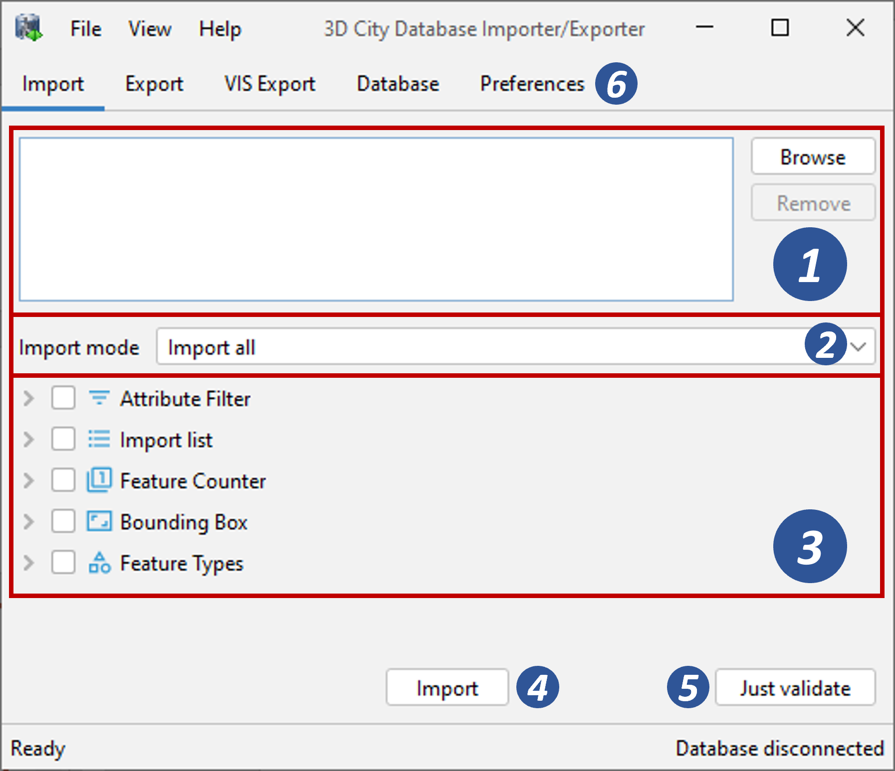

.. _impexp_citygml_import_chapter:

Importing CityGML files
-----------------------

To load 3D city model content into a 3D City Database instance, the
Importer/Exporter supports the import of CityGML files. Supported
CityGML versions are 2.0.0, 1.0.0 and 0.4.0. The CityGML import
operation is available on the Import tab of the operations window as
shown below.

   The CityGML import dialog.

**Input file selection.** At the top of the Import dialog [1], a list of
one or more CityGML files to be imported must be provided. Files can be
selected through clicking on the *Browse* button, which opens a regular
file selection dialog. Alternatively, you can drag&drop files from your
preferred file explorer onto the Import tab. If the file list already
contains entries, the drag&drop operation will replace its content. If
you want to keep the previous entries and only append additional files,
keep the CTRL key pressed while dropping (on Windows). The *Remove*
button or DEL key lets you remove selected entries from the input files.
Note that adding folders to the list is also supported. Each folder will
be recursively scanned for CityGML files, and every CityGML file found
will be imported.

The importer supports the following file formats for CityGML datasets:
1) regular XML files (\*.gml, \*.xml), 2) GZIP compressed XML files
(\*.gz, \*.gzip), and 3) ZIP archives (\*.zip). ZIP archives are
recursively scanned for contained XML files. Additional files such as
texture images will also be imported from the ZIP archive if they are
correctly referenced from the XML file(s) using relative paths within
the ZIP archive.

**Workspace selection.** If the 3D City Database instance is
version-enabled (Oracle only), the name of the *workspace* into which
the data shall be imported can be specified [2]. If no workspace is
provided, the *LIVE* workspace is used by default.

.. note::
   Importing into version-enabled tables typically takes
   *considerably more time* than importing into non-version-enabled tables.
   The import time can be reduced if spatial indexes are disabled
   beforehand.

**Import filter.** The import dialog allows for setting thematic and
spatial filter criteria to narrow down the set of CityGML top-level
features that are to be imported from the input files. The checkboxes on
the left side of the import dialog let you choose between an *attribute
filter*, a *feature* *counter filter*, a spatial *bounding box filter*
and a *feature type filter*. If more than one filter is chosen, the
filter criteria are combined in a logical AND operation. If no checkbox
is enabled, no filter criteria are applied and thus all CityGML features
contained in the input file(s) will be imported.

-  **Attribute filter**: This filter takes a *gml:id* and/or a *gml:name* as
   parameter [3] and only imports CityGML features having a matching value for
   the respective attribute. More than one gml:id can be provided in a comma-separated list.
   Multiple gml:name values are not supported though.
-  **Counter filter**: The feature counter filter limits the number of top-level features to be imported.
   Simply enter the number of features into the *count* field [4]. The *start index* parameter indicates
   the index within the set of all feature over all input files from which the import shall begin. The index starts with 0.
   The parameters can be used together or individually.
-  **Bounding box filter**: This filter takes a 2D bounding box as parameter that is given by the
   coordinate values of its lower left (x\ :sub:`min`, y\ :sub:`min`) and upper right corner (x\ :sub:`max`, y\
   :sub:`max`) [5]. The bounding box is evaluated against the gml:boundedBy property of the CityGML input features.
   You can choose whether features *overlapping* with the provided bounding box are to be
   imported, or whether features must be *inside* of it.
-  **Feature type filter**: With the feature types filter, you can restrict the import to one or more
   features types by enabling the corresponding checkboxes [7]. Only features of the
   chosen type(s) will be imported.

.. note::
   All filters only work on *top-level features* but *not on nested
   sub-features*.

For the *bounding box filter*, make sure that you choose a *coordinate
reference system* from the drop-down choice list that matches the
provided coordinate values. Otherwise, the spatial filter may not work
as expected. The coordinate reference system list can be augmented with
user-defined reference systems (see :numref:`impexp_crs_management_chapter` for more information).

The coordinate values of the bounding box filter can either be entered
manually or chosen interactively in a 2D map window. To open the map
window, click on the map button |map_select| [6].

   Bounding box selection using the 2D map window.

In the map window, keep the left mouse button clicked while holding the
ALT key. This lets you draw a bounding box on the map. In order to move
the map to a specific location or address, simply enter the location or
address in the input field on top of the map and click the *Go* button
or use the map navigation controls. If you are happy with the bounding
box selection, click the *Apply* button. This will close the map window
and carry the coordinate values of the selected area into the
corresponding fields of the bounding box filter [5]. Click *Cancel* if
you want to close the map window but skip your selection. A more
comprehensive guide on how to use the map window is provided in chapter
:numref:`impexp_preferences_map_window_chapter`.

With the |bbox_copy| button on the bounding box filter dialog [6], you can copy a bounding
box to the clipboard, while the |bbox_paste|
button pastes a bounding box from the clipboard to the input fields of
the bounding box filter [5] (or use the right-click context menu).

**XML validation.** Before importing, the CityGML input files can be
validated against the official CityGML XML schemas. Simply click the
*Just Validate* button [9] in order to run the validation process.
Filter settings are **not considered** in this process. Note that this
operation does not require internet access since the XML schemas are
packaged with the application. The CityGML features are **not imported**
into the database during validation. The validation results are printed
to the console window.

.. note::
   It is **strongly recommended** that only CityGML files having
   successfully passed XML validation are imported into the database.
   Otherwise, errors in the data may lead to unexpected behavior or
   abnormal termination.

**Import preferences.** More fine-grained preference settings affecting
the CityGML import are available on the Preferences tab of the
operations window. Make sure to check these settings *before* starting
the import process. A full documentation of the import preferences is
available in :numref:`impexp_citygml_import_preferences_chapter`.
The following table provides a summary overview.

.. list-table::  Summary overview of the import preferences
   :name: citygml_import_preferences_summary_table

   * - | **Preference name**
     - | **Description**
   * - | Continuation
     - | Metadata that is stored for every object in the database such as the data
       | lineage, the updating person or the creationDate property.
   * - | gml:id handling
     - | Generates UUIDs where gml:ids are missing on input features or replaces all
       | gml:ids with UUIDs.
   * - | Address
     - | Controls the way in which xAL address fragments are imported into the
       | database.
   * - | Appearance
     - | Defines whether appearance information is imported.
   * - | Geometry
     - | Allows for applying an affine transformation to the input geometry.
   * - | Indexes
     - | Settings for automatically enabling/disabling spatial and normal indexes
       | during imports.
   * - | XML validation
     - | Performs XML validation automatically and exclude invalid features from
       | being imported.
   * - | XSL transformation
     - | Defines one or more XSLT stylesheets that shall be applied to the city objects
       | in the given order before import.
   * - | Import log
     - | Creates a list of all successfully imported CityGML top-level features.
   * - | Resources
     - | Allocation of computer resources used in the import operation.

**CityGML import.** Once all import settings are correct, the *Import*
button [8] starts the import process. If a database connection has not
been established manually beforehand, the currently selected entry on
the Database tab is used to connect to the 3D City Database. The
separate steps of the import process as well as all errors that might
occur during the import are reported to the console window, whereas the
overall progress is shown in a separate status window. The import
process can be aborted at any time by pressing the *Cancel* button in
the status window. The Importer/Exporter will make sure that all pending
city objects are completely imported before it terminates the import
process.

After having completed the import, a summary of the imported CityGML
top-level features is printed to the console window.

.. note::
   The import operation does **not automatically** **apply** a
   **coordinate transformation** to the internal reference system of the 3D
   City Database instance. Thus, if the coordinate reference system of the
   CityGML input data does not match the coordinate reference system
   defined for the 3D City Database instance, the user must transform the
   coordinate values **before importing** the data (or use an affine
   transformation during import if this is enough). A possible workaround
   procedure can be realized as follows:

   1. Set up a second (temporary) instance of the 3D City Database with an
      internal CRS matching the CRS of the CityGML instance document.
   2. Import the dataset into this second 3D City Database instance.
   3. Export the data from this second instance into the target CRS by
      applying a coordinate transformation (see CityGML export
      documentation in :numref:`impexp_citygml_export_chapter`).
   4. The exported CityGML document now matches the CRS of the target 3D
      City Database instance and can be imported into that database. The
      temporary database instance can be dropped.

   Alternatively, you can change the reference system in the database to
   the one used by the imported geometries (see the corresponding
   database operation in :numref:`impexp_executing_database_operations_chapter`).

.. note::
   The Importer/Exporter *does not check by any means* whether a
   *CityGML feature* from an input file *already exists* in the database.
   Thus, if an import is executed twice on the same dataset, all CityGML
   features contained in the dataset will be imported twice.

.. |bbox_copy| image:: ../media/bbox_copy.png
   :width: 0.16667in
   :height: 0.16667in

.. |bbox_paste| image:: ../media/bbox_paste.png
   :width: 0.16667in
   :height: 0.16667in

.. |map_select| image:: ../media/map_select.png
   :width: 0.16667in
   :height: 0.16667in

