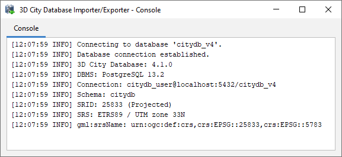

.. _impexp_database_connection_management_chapter:

Database connections and operations
-----------------------------------

The Database tab of the operations window shown in the figure below
allows a user to manage and establish database connections and to
execute database operations.

.. figure:: ../media/impexp_gui_database_tab_fig.png
   :name: impexp_gui_database_tab_fig
   :align: center

   Database tab.

In order to connect to an instance of the 3D City Database, valid
connection parameters must be entered in the above dialog.
Mandatory database connection details comprise the *username* and
*password* of the database user, the *type* of the database, the
*server* name (network name or IP address) and *port* number (default:
5432 for PostgreSQL; 1521 for Oracle) of the database server, and the
*database* name (when using Oracle, enter the database SID or service
name here). For convenience, a user can choose to *save* the *password*
in the config file of the Importer/Exporter. Please be aware that the
password is stored as plain text.

The optional *schema* parameter lets you define the database
schema you want to connect to. Leave it empty to connect to the default
schema. The *Query* button lets you retrieve a list of available schemas
from the database. More information on how to work with multiple 3DCityDB
schemas can be found in :numref:`citydb_multiple_database_schemas_chapter`.

For Oracle databases, you can additionally choose to connect to a specific
*workspace* in case the database is version-enabled. **All operations**
of the Importer/Exporter will be executed against this workspace. Please provide the
name of the workspace and an optional *timestamp*. If no workspace is
specified, the default *LIVE* workspace is chosen by default. Again,
use the *Query* button to get a list of available workspaces in the database.

.. hint::
  If you need assistance, ask your database
  administrator for connection details, schemas and workspaces.

To manage more than one database connection, connection details are
assigned a short *description* text. The drop-down list at the top of
the Database tab allows a user to switch between connections based on
their description. By using the *Apply*, *New*, *Copy* and *Delete*
buttons, edits to the parameters of the currently selected connection
can be saved, a new connection with empty connections details can be
created, and existing connections can be copied or deleted from the
list.

The *Connect* / *Disconnect* button lets a user connect to / disconnect
from a 3D City Database instance based on the provided connection
details.

.. note::
   With this version of the Importer/Exporter, you will be able to
   **connect to version 4.1.x to 3.0 instances** of the 3D City Database
   **but not to any previous or later version**.
   See :numref:`first_steps_migration_chapter` for a guide on how
   to migrate a version 2 and 3 instances of the 3D City Database to the
   latest version 4.1.

**Connection messages**

The console window logs all messages that occur during the connection
attempt. In case a connection could not be established, error messages
are displayed that help to identify the cause of the connection problem.
Otherwise, the console window contains information about the connected
3D City Database instance like those shown
in :numref:`impexp_db_connection_log_fig`. This
information comprises the version of the 3D City Database, the name and
version of the underlying database system, the connection string, the
schema name, the spatial reference system ID (SRID) as well as its name
and GML encoding (as specified during the setup of the 3D City
Database).

   Log messages for a successful database connection.

This information can be requested from a connected 3D City Database at
any time using the *Info* button on the Database tab. Upon successful
connection, the description of the active connection is moreover
displayed in the title bar of the application window.

**Executing database operations**

After having established a connection to an instance of the 3D City
Database, the Database tab (cf. [2] in :numref:`impexp_gui_database_tab_fig`) offers the following
database operations as separate tabs below the database connection details:

.. toctree::
   :maxdepth: 1

   db-operations/db-report
   db-operations/db-bbox
   db-operations/db-index
   db-operations/db-change-crs
   db-operations/db-citygml-ades