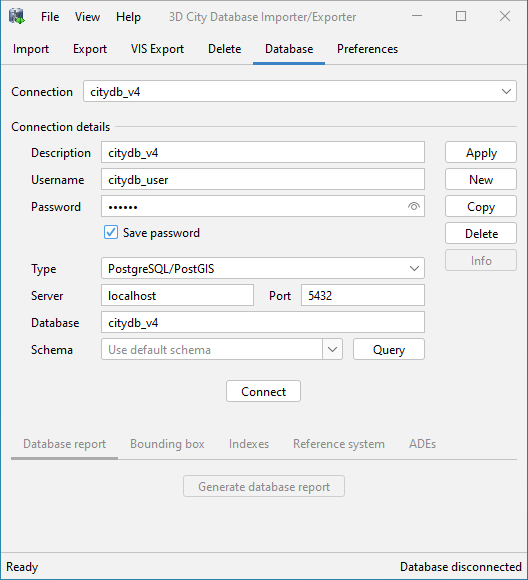
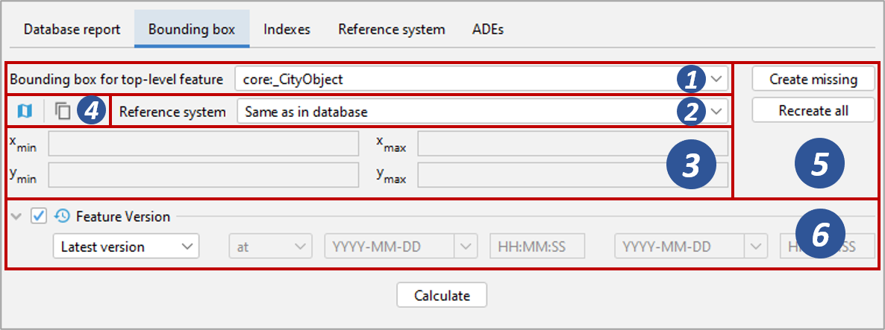
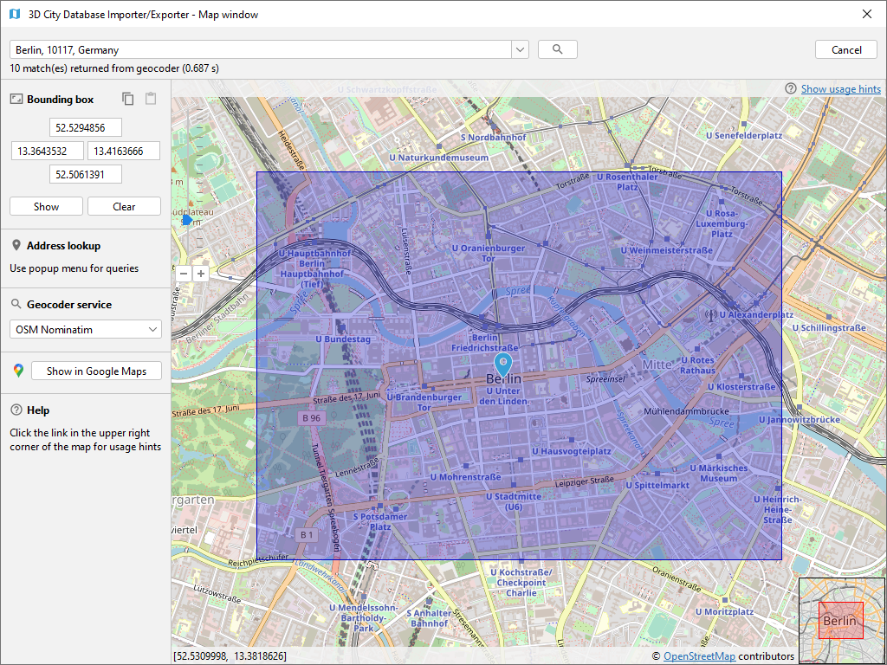
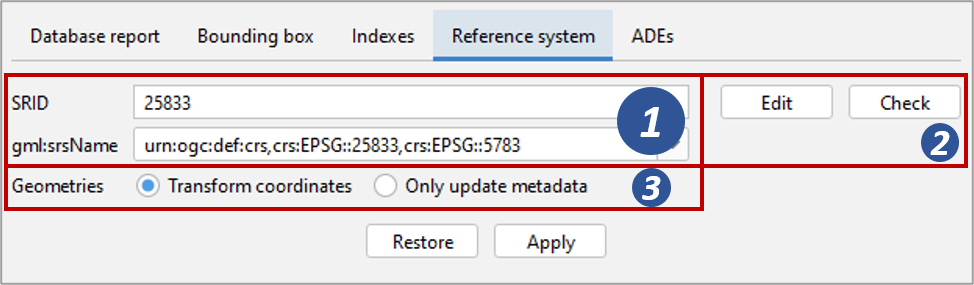

Database connections and operations
-----------------------------------

The Database tab of the operations window shown in the figure below
allows a user to manage and establish database connections [1] and to
execute database operations [2].

   Database tab.

.. _impexp_database_connection_management_chapter:

Managing and establishing database connections
~~~~~~~~~~~~~~~~~~~~~~~~~~~~~~~~~~~~~~~~~~~~~~

In order to connect to an instance of the 3D City Database, valid
connection parameters must be provided on the Database tab.

Mandatory database connection details comprise the *username* and
*password* of the database user, the *type* of the database, the
*server* name (network name or IP address) and *port* number (default:
1521 for Oracle; 5432 for PostgreSQL) of the database server, and the
*database* name (when using Oracle, enter the database SID or service
name here). The optional *schema* parameter lets you define the database
schema you want to connect to. Leave it empty to connect to the default
schema. More information on how to work with multiple 3DCityDB schemas
can be found in :numref:`citydb_multiple_database_schemas_chapter`.
If you need assistance, ask your database
administrator for connection details and schemas. For convenience, a
user can choose to *save* the *password* in the config file of the
Importer/Exporter. Please be aware that the password will be stored as
plain text.

To manage more than one database connection, connection details are
assigned a short *description* text. The drop-down list at the top of
the Database tab allows a user to switch between connections based on
their description. By using the *Apply*, *New*, *Copy* and *Delete*
buttons, edits to the parameters of the currently selected connection
can be saved, a new connection with empty connections details can be
created, and existing connections can be copied or deleted from the
list.

The *Connect* / *Disconnect* button lets a user connect to / disconnect
from a 3D City Database instance based on the provided connection
details.

.. note::
   With this version of the Importer/Exporter, you will be able to
   **connect to version 4.0 to 3.0 instances** of the 3D City Database
   **but not to any previous version**.
   See :numref:`first_steps_migration_chapter` for a guide on how
   to migrate a version 2 and 3 instances of the 3D City Database to the
   latest version 4.0.

The console window logs all messages that occur during the connection
attempt. In case a connection could not be established, error messages
are displayed that help to identify the cause of the connection problem.
Otherwise, the console window contains information about the connected
3D City Database instance like those shown
in :numref:`impexp_db_connection_log_fig`. This
information comprises the version of the 3D City Database, the name and
version of the underlying database system, the connection string, the
schema name, the spatial reference system ID (SRID) as well as its name
and GML encoding (as specified during the setup of the 3D City
Database), and whether the database tables are version-enabled.

.. figure:: ../media/impexp_db_connection_log_fig.png
   :name: impexp_db_connection_log_fig

   Log messages for a successful database connection.

This information can be requested from a connected 3D City Database at
any time using the *Info* button on the Database tab. Upon successful
connection, the description of the active connection is moreover
displayed in the title bar of the application window.

.. _impexp_executing_database_operations_chapter:

Executing database operations
~~~~~~~~~~~~~~~~~~~~~~~~~~~~~

After having established a connection to an instance of the 3D City
Database, the Database tab (cf. [2] in :numref:`impexp_gui_database_tab_fig`) offers the following
database operations to be executed on that instance:

-  Generating a database report;
-  Calculating/updating the bounding box of selected feature types;
-  Managing indexes on database tables;
-  Managing the spatial reference system of the database; and
-  Displaying supported CityGML ADEs.

.. _db-report:

Generating a database report
^^^^^^^^^^^^^^^^^^^^^^^^^^^^

A database report is a list of all tables of the 3D City Database
together with their total number of rows. This operation therefore
provides a quick overview of the contents of the 3D City Database.
The report is printed to the console window.

   Generating a database report.

If the database is version-enabled (Oracle only), the database report
can be created for the contents of a specific *workspace* [1] at a given
*timestamp* [2]. If no workspace is specified, the default *LIVE* workspace is
chosen per default. If the workspace does not exist, a
corresponding error message is provided.

.. note::
  Workspaces are not a feature of
  the 3D City Database but are managed through the *Oracle Workspace
  Manager* tool. Please refer to the Oracle database documentation for
  details. Since PostgreSQL currently does not support workspaces, the
  corresponding input fields are disabled when connecting to a 3D City
  Database running on PostgreSQL.

.. _get-bbox:

Calculating/updating the bounding box
^^^^^^^^^^^^^^^^^^^^^^^^^^^^^^^^^^^^^

This dialog lets you calculate the 2D bounding box of the city objects
stored in the database. The bounding box is useful, for instance, as
input to spatial filters in CityGML imports and exports as well as
KML/COLLADA/glTF exports (see documentation of the corresponding
operations).

   Calculating the bounding box for selected feature types.

The coordinate values of the lower left (x\ :sub:`min`, y\ :sub:`min`) and upper
right (x\ :sub:`max`, y\ :sub:`max`) corner of the calculated bounding box are
rendered in the corresponding fields of the dialog [3]. The values are
also copied to the clipboard of your operating system and can therefore
easily be pasted into the import and export dialogs. You can also
manually copy the values to the clipboard by clicking the
|bbox_copy| button [4], or by right-clicking on a data field [3] and choosing the
corresponding option from the context menu.

The calculation of the bounding box can be restricted to a specific city
object type such as Building or WaterBody [1]. Similar to the generation of a
database report, the user can request the bounding box for city objects
living in a specific *workspace* at a given *timestamp* if the database
is version-enabled (Oracle only). The coordinate values can optionally
be transformed into a user-defined coordinate *reference system* that is
available from the drop-down list [2]. Per default, the coordinate
values are presented in the same reference system as specified for the
3D City Database instance during setup. See :numref:`citydb_crs_definition_chapter`
for details on how to define and manage user-defined reference systems.

By using the map |map_select| button [4],
the calculated bounding box is rendered in a separate 2D map window
for visual inspection as shown below. The usage of this map window is
described in :numref:`impexp_preferences_map_window_chapter`.

   Map window for displaying and choosing bounding boxes. Note
   that the coordinate values of the bounding box are shown in the upper
   left component.

The calculation of the bounding box is based on the values stored in the
ENVELOPE column of the CITYOBJECT table. If this column is NULL or
contains an incorrect value (e.g., in case the value could not correctly
filled during import or the geometry representation of a city object has
been changed), then the resulting bounding box will be wrong and
subsequent operations might not provide the expected result. To fix the
ENVELOPE values in the database, simply let the Importer/Exporter
*create missing* values (i.e., replace NULL values) or *recreate all*
values by clicking on the corresponding buttons [5]. This update process
either affects only the city objects of a given feature type or all city
objects based on the selection made in [1].

.. note::
   This process directly updates the ENVELOPE column of the
   affected city objects and might take long to complete since the new
   values are calculated by evaluating all geometries of the city objects
   in all LoDs including implicit geometries.

.. _db-index:

Managing indexes
^^^^^^^^^^^^^^^^

The Importer/Exporter allows the user to manually activate or deactivate
indexes on predefined tables of the 3D City Database schema, and to
check their status.

   Managing spatial and normal indexes.

The operation dialog differentiates between *spatial indexes* on
geometry columns and *normal indexes* on columns with any other datatype
[1]. The buttons *Activate*, *Deactivate*, and *Status* trigger a
corresponding database process on spatial indexes only, normal indexes
only or both index types depending on which checkboxes are selected [1].
Again, the user can define a *workspace* and *timestamp* on which the
operation shall be executed if the database is version-enabled (Oracle
only).

The index operations only affect the following subset of all indexes
defined by the 3D City Database schema:

.. list-table::  Spatial and normal indexes affected by the index operation
   :name: impexp_gui_managing_indexes__table

   * - | **Index type**
     - | **Column(s)**
     - | **Table**
   * - | Spatial
     - | ENVELOPE
     - | CITYOBJECT
   * - | Spatial
     - | GEOMETRY
     - | SURFACE_GEOMETRY
   * - | Spatial
     - | SOLID_GEOMETRY
     - | SURFACE_GEOMETRY
   * - | Normal
     - | GMLID, GMLID_CODESPACE
     - | CITYOBJECT
   * - | Normal
     - | LINEAGE
     - | CITYOBJECT
   * - | Normal
     - | CREATION_DATE
     - | CITYOBJECT
   * - | Normal
     - | TERMINATION_DATE
     - | CITYOBJECT
   * - | Normal
     - | LAST_MODIFICATION_DATE
     - | CITYOBJECT
   * - | Normal
     - | GMLID, GMLID_CODESPACE
     - | SURFACE_GEOMETRY
   * - | Normal
     - | GMLID, GMLID_CODESPACE
     - | APPEARANCE
   * - | Normal
     - | THEME
     - | APPEARANCE
   * - | Normal
     - | GMLID, GMLID_CODESPACE
     - | SURFACE_DATA
   * - | Normal
     - | GMLID, GMLID_CODESPACE
     - | ADDRESS

The result of an index operation is reported in the console window as
shown below. For instance, :numref:`impexp_gui_indexes_status_report_fig` shows the
result of a status query on both spatial and normal indexes. The status *ON* means
that the corresponding index is enabled.

   Result of a status query on spatial and normal indexes.

.. note::
   It is *strongly recommended* to *deactivate the spatial indexes
   before running a CityGML import* on a *big amount of data* and to
   reactive the spatial indexes afterwards. This way the import will
   typically be a lot faster than with spatial indexes enabled. The
   situation may be different when importing only a small dataset.

.. warning::
   Activating and deactivating indexes can take a long time,
   especially if the database fill level is high. Note that the operation
   **cannot be aborted** by the user since this would result in an
   inconsistent database state.

.. _change-crs:

Managing the spatial reference system of the database
^^^^^^^^^^^^^^^^^^^^^^^^^^^^^^^^^^^^^^^^^^^^^^^^^^^^^

When setting up a 3DCityDB instance, you have to choose a spatial
reference system (SRS) by picking a spatial reference ID (SRID)
supported by the database and a corresponding SRS name identifier
(*gml:srsName*) that is used in CityGML exports (see
and :numref:`3dcitydb_setup_schema_chapter`).
These settings can be easily changed at any later time using the
reference system operation.

   Changing the SRS information of the 3DCityDB instance.

After connecting to a 3DCityDB, the *SRID* and *gml:srsName* input
fields shown in the above dialog [1] are assigned the current values
from the database. Simply edit the fields to pick a new SRID or SRS name
identifier. Since changing the SRID potentially affects all geometries
in your database and thus may take a long time to complete, the *SRID*
field is disabled per default. Click on *Edit* [2] to enable changes to
this field. Use the *Check* button [2] to make sure that your new SRID
value is supported by the database. The *gml:srsName* field provides a
drop-down list of common SRS identifier encoding schemes (such as OGC
URN encoding, see :numref:`citydb_crs_definition_chapter`). You may pick one of these proposals
(be careful to replace the HEIGHT_SRID token with the correct value if
required) or enter any other value.

When changing the SRID, you can choose whether the *coordinates* of
geometry objects already stored in the database should be *transformed*
to the new SRID or whether only the *metadata* should be *updated* [3].
The latter option might be enough, for example, if you accidentally
picked a wrong SRID that does not match the imported geometries when
setting up the database, and you simply want to correct this mistake.

Click on *Apply* to update the reference system information in the
database according to your settings. The *Restore* button lets you
discard any changes made to the *SRID* and *gml:srsName* fields.

.. note::
   If you just want to use different *gml:srsName* values for
   different CityGML exports, then instead of changing the identifier in
   the database before every export it is simpler to create multiple
   user-defined reference systems for the same SRID (cf. :numref:`impexp_crs_management_chapter`) and
   pick one for each CityGML export (cf. :numref:`impexp_citygml_export_chapter`).

.. _ade-list:

Displaying supported CityGML ADEs
^^^^^^^^^^^^^^^^^^^^^^^^^^^^^^^^^

This tab provides a list of all CityGML Application Domain Extensions
(ADEs) that are registered in the 3DCityDB instance and/or are
supported by the Importer/Exporter. The following screenshot shows the
corresponding dialog.

   Table of all supported CityGML ADEs.

The ADE table [1] contains one entry per CityGML ADE. Each entry lists
the *name* and the *version* of the ADE and indicates whether it is
supported by the *database* and/or the *Importer/Exporter* (using check
or cross signs). Database support requires that the ADE has been
successfully registered in the 3DCityDB instance using the ADE Manager
Plugin (see :numref:`impexp_plugin_ade_manager_chapter`).
Additional support by the Importer/Exporter requires that a
corresponding ADE extension has been copied into the *ade-extensions*
folder within the installation directory of the Importer/Exporter. Only
if both conditions are met both fields will contain a check sign. If no
ADE has been detected upon database connection, the table remains empty.

In the example of :numref:`impexp_gui_ADE_list_fig`, there is only an Importer/Exporter
extension for an ADE called *TestADE* but the connected 3DCityDB
instance lacks support for it. TestADE data would therefore not be
handled by the Importer/Exporter and thus not stored into the database
in this scenario.

If you select an entry in the ADE table and click the *Info* button (or
simply double-click on the entry), metadata about the ADE will be
displayed in a separate window as shown below. The *Status* field shows
whether the ADE is fully supported, or some user action is required.

   ADE metadata dialog.

.. |bbox_copy| image:: ../media/bbox_copy.png
   :width: 0.16667in
   :height: 0.16667in

.. |map_select| image:: ../media/map_select.png
   :width: 0.16667in
   :height: 0.16667in

