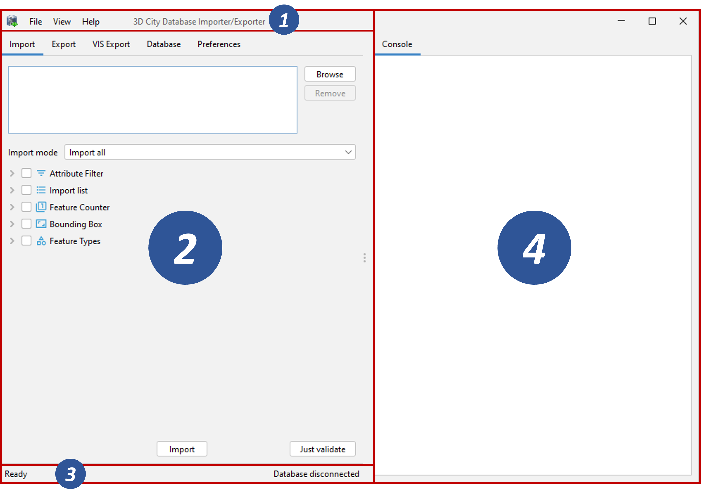

.. _impexp_interface_chapter:

Interfaces
----------

The 3D City Database Importer/Exporter offers both a graphical user
interface (GUI) and a command line interface (CLI). The CLI allows for
embedding the tool in batch processing workflows and third-party
applications. The usage of the CLI is documented in :numref:`impexp_cli_chapter`.

To launch the GUI, simply use the starter scripts located in the ``bin``
subfolder of the installation directory of the 3D City Database
Importer/Exporter. A desktop icon as well as shortcuts in the start menu
of your operating system will additionally be available in case you
chose to create shortcuts during setup. Depending on your platform, one
of the following starter scripts is provided:

- ``3DCityDB-Importer-Exporter.bat`` (Microsoft Windows family)
- ``3DCityDB-Importer-Exporter.sh`` (UNIX/Linux/Mac OS family)

On most platforms, double-clicking the starter script or its shortcut
runs the Importer/Exporter.

For some UNIX/Linux distributions, you will have to run the starter
script from within a shell environment though. Please open your
favourite shell and first check whether execution rights are correctly
set on the starter script. If not, change to the installation folder and
enter the following command to make the starter script executable for
the owner of the file:

.. code::

   $ chmod u+x 3DCityDB-Importer-Exporter.sh

Afterwards, simply run the software by issuing the following command:

.. code::

   $ ./3DCityDB-Importer-Exporter.sh

.. note::
   With every release, the README.txt file in the installation
   folder provides version-specific information on how to
   run the Importer/Exporter.

The starter scripts define default values for the Java Virtual Machine
(JVM) that runs the Importer/Exporter. Most importantly, they specify
the minimum amount of main memory for the application through the ``–Xms``
parameter of the JVM. The default value has been chosen to be reasonable
for most platforms but may need to be *adapted to your needs* before
launching the application (e.g., if you want to increase or limit the
available main memory).

The graphical user interface of the Importer/Exporter is organized into
four main components as shown in :numref:`impexp_gui_organization_fig`.
A *menu bar* [1] is located
either below (Windows, some Linux distributions) or above (Mac, some
Linux distributions) the title bar. The main application window is
divided into an *operations window* [2] that renders the user dialogs of
the separate operations of the Importer/Exporter and a *console window*
[4] that displays log messages. Via the View entry in the menu bar, the
console window can be detached from the main window and rendered in a
separate window. At the bottom of the operations window, a *status bar*
[3] provides information about running processes and database
connections.

   Organization of the Importer/Exporter GUI.

The tab menu on top of the operations window lets you switch between the
operations of the Importer/Exporter and their user dialogs. The
following tabs are available:

- **Import**: Import of CityGML models into the database
- **Export**: Export of city model data as CityGML
- **KML/COLLADA/glTF Export**: Export of city model data in KML, COLLADA or glTF format
- **Database**: Database connection settings and operations
- **Preferences**: Preference settings for each operation

.. note::
   If you have installed plugins, the tab menu may contain
   additional entries. Please refer to the documentation of your plugin in
   this case.

The main menu bar [1] offers the entries File, Project, View and Help.
The File menu only contains one entry Exit to close the application.

The Project menu lets a user store and load settings from a config file.
The separate menu entries provide the following functionality:

- **Open Project…**: Load a config file and recover all settings from this file.
- **Save Project**: Save all settings made in the GUI to the default config file.
- **Save Project As…**: Save all settings made in the GUI to a separate config file.
- **Restore Default Settings**: Set all settings to default values.
- **Save Project XSD As…**: Save the XML Schema defining the XML structure of config files to a separate file.
  The XML Schema is helpful in case a user wants to manually edit the config file. Only
  config files conforming to the XML Schema definition will be successfully loaded by the Importer/Exporter.
- **Recently Used Projects…**: List of recently loaded config files.

The Importer/Exporter uses one *default config file* per operating
system user running the Importer/Exporter. All settings made in the GUI
are automatically stored to this default config file when the
Importer/Exporter is closed and are loaded from this file upon program
start. The default config file is named ``project.xml`` and is stored in the
*home directory* of the user. Precisely, you will find the config file
in the subfolder ``3dcitydb/importer-exporter/config``. Note that the
location of the home directory differs for different operating systems.
Using environment variables, the location can be identified dynamically:

- ``%HOMEDRIVE%%HOMEPATH%\3dcitydb\importer-exporter\config`` (Windows 7 and higher)
- ``$HOME/3dcitydb/importer-exporter/config`` (UNIX/Linux, Mac OS families)

The View menu affects the GUI elements of the Importer/Exporter and
offers the following entries:

- **Open Map Window**: Opens the 2D map window for bounding box selections (cf. :numref:`impexp_preferences_map_window_chapter`).
- **Detach Console**: Renders the console window in a separate application window.
- **Restore default perspective**: Restores the GUI to its default settings.

Finally, the Help menu gives access to this online documentation and provides a
Read Me file shipped with the Importer/Exporter. The About dialog displays, amongst
other information, the official *version and build number* of the
Importer/Exporter.