.. _impexp_plugin_ade_manager_chapter:

ADE Manager Plugin
------------------

Definition
~~~~~~~~~~

The ADE Manager is a plugin for the 3D City Database Importer/Exporter
and allows to dynamically extend a 3D City Database (3DCityDB) instance
to facilitate the storage and management of CityGML Application Domain
Extensions (ADE). It is implemented based on the Open Source Attributed
Graph Grammar (AGG) [AGG2019]_ transformation engine for realizing the
automatic transformation from an XML application schema (XSD) to a
compact relational database schema (including tables, indexes, and
constraints etc.) for a given CityGML ADE. In addition, an XML-based
schema mapping file can also be automatically generated which contains
the relevant meta-information about the derived database schema as well
as the explicit mapping relationships between the source and target
schemas and allows developers to implement applications for managing and
processing the ADE data contents stored in a 3DCityDB instance.

.. _install:

Plugin installation
~~~~~~~~~~~~~~~~~~~

Like with the Spreadsheet Generator Plugin, the ADE manager plugin can
also be optionally installed together with the 3DCityDB Import/Export
tool. During the Installation of the Import/Export tool, the wizard will
ask you if you want to install the ADE Manager Plugin (cf. the following
figure):

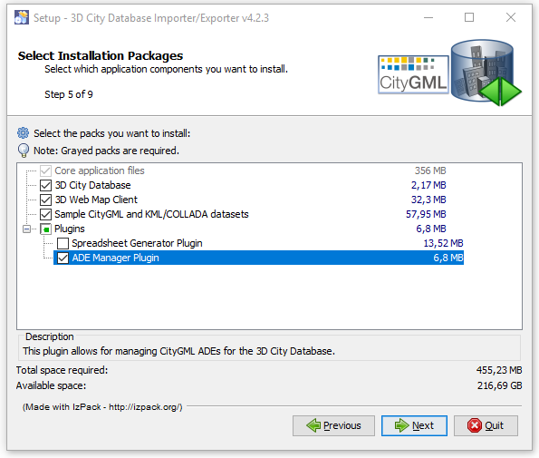

   GUI wizard for prompting the installation of ADE Manager Plugin

If the users haven’t checked the “\ *ADE Manager Plugin*\ ” box during
the installation process, it is also possible to install the plugin
later. The installation steps are very similar to those operation steps
for installing the Spreadsheet Generator Plugin. For more details,
please refer to :numref:`spreadsheet_plugin_install`. Once the Import/Export tool and ADE
Manager Plugin have been successfully installed, the user interface of
the ADE Manager Plugin should look like the figure below:

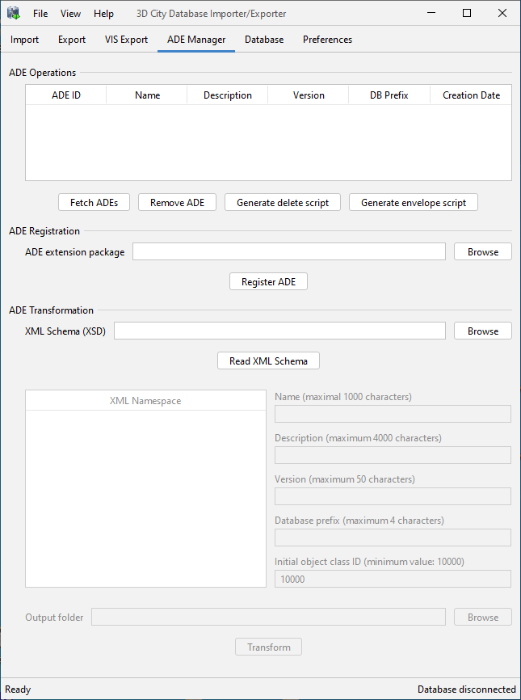

   User interface of the ADE Manager Plugin

User Interface
~~~~~~~~~~~~~~

.. _ade_manager_plugin_registration_chapter:

ADE Registration
^^^^^^^^^^^^^^^^

The user interface of the ADE Manager Plugin is composed of two parts.
The first part is mainly used for registering CityGML ADEs into a
3DCityDB database instance. During the ADE registration process, new
ADE-specific database objects such as feature tables, foreign key
contstraints, sequences, simple and spatial indexes are added to the
existing 3DCityDB database schema. Also, the metatdata tables (cf.
:numref:`chapter_citydb_schema_metadata`) are populated with the meta-information about the
registered ADE. To run the ADE registration process, the input files
required by the ADE Manager Plugin must be strictly organized according
to the following folder structure.

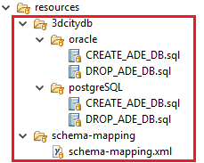

   Specific folder structure of the required input files for ADE registration

The input folder must comprise at least two mandatory subfolders namely
*3dcitydb* and *schema-mapping*. The first subfolder *3dcitydb* further
contains two subfolders *oracle* and *postgresql*, which contain the SQL
definition file *CREATE_ADE_DB.sql.* This file can be excuted by the ADE
Manager Plugin for creating the 3DCityDB-compliant ADE database schema
according to the database type (Oracle or PostgreSQL) being used. The
SQL file *DROP_ADE_DB.sql* contains the DDL-statements for removing the
corresponding ADE database schema. These DDL-statements are imported
into the metadata table ADE during the ADE registration process and
hence are persistently stored at the database side. When unregistering
an ADE, the DDL-statements will be read from the table ADE and excuted
by the ADE Manager Plugin.

The second subfolder *schema-mapping* shall contain an XML-formatted
file which holds the relevant meta-information (e.g. name, description,
XML namespace, and value range of object class id etc.) about an ADE as
well as the explicit mapping information between the XML application
schema and relational database schema. This schema-mapping file is not
only used for the ADE registration purpose but also required for the
Importer/Exporter and WFS tools to control the query and transaction of
ADE datasets. The Importer/Exporter also uses a schema-mapping file for
mapping the elements of the CityGML XML schemas to tables and columns of
the 3DCityDB core schema. This mapping file, its XML Schema definition
as well as a Java API for reading and writing a valid schema-mapping
files can be found in the Github repository [3DCI2019a]_ .

Registration of a Test ADE
""""""""""""""""""""""""""

The *TestADE* is an artificial CityGML ADE which is intended to be used
for testing and demonstrating how to use the citygml4j and 3DCityDB
software APIs to implement 3DCityDB-compilant applications for working
with the real-world ADEs. The TestADE has been designed to reflect the
most typical modelling structures offered by the CityGML ADE mechanism
such as subtyping or property injection. Moreover, the contained feature
and data types have been copied (and simplified) from existing CityGML
ADEs such as the Energy ADE and the UtilityNetwork ADE. A central
repository containing the TestADE’s UML data model, XML schema
definition file, database schema, schema-mapping file as well as the
Java classes for reading and writing ADE datasets is hosted in the
3DCityDB’s Github website [3DCI2019b]_.

The input SQL and schema-mapping files for ADE registration are located
under the relative path
“\ *extension-test-ade/test-ade-citydb/resources*\ ” of the TestADE’s
Github repository. After opening the ADE Manager Plugin, the users can
click on the *Browse* button to open a file chooser dialog for providing
the local path of the input folder. After connecting to the target
3DCityDB instance, the ADE registration process can be started by
clicking on the **Register ADE** button.

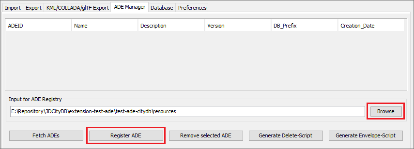

   Dialog panel for registering CityGML ADEs

While performing the ADE registration process, the ADE database schema
will be firstly created, and the metadata information will be written to
the 3DCityDB metadata tables subsequently. In addition, the database
stored functions and procedures e.g. DELETE script and ENVELOPE script
will also be newly generated. After the ADE has been successfully
registered, a list of all ADEs registered in the 3DCityDB instance along
with their relevant meta-information is shown on the ADE information
panel (cf. the following figure).

.. figure:: ../../media/ade_manager_plugin_list_registered_ades.png
   :name: ade_manager_plugin_list_registered_ades

   GUI panel for displaying the relevant meta-information of registered ADEs

The users may also use a database client application like pgAdmin
(PostgreSQL) and SQLDeveloper (Oracle) to check whether the ADE database
schema has been correctly created. All new tables should be prefixed
with the characters “\ *test\_*\ ” and the new delete and envelope
functions/procedures should have the prefix “\ *del_test\_*\ ” and
“\ *env_test\_*\ ” respectively.

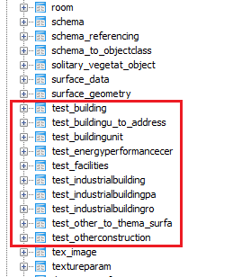

   Exploration of the newly created ADE tables using pgAdmin

When connecting to another 3DCityDB instance, the users may click on the
*Fetch ADEs* button to update the contents in the meta-information panel
and thus to check which ADEs have already been registered into the
target database. The *Generate Delete-Script* and *Generate
Envelope-Script* buttons allow to generate the respective database
stored functions/procedures again and display them in a popup dialog
window. It is possible to install the script directly by clicking on the
the *Install* button or save it to a SQL file. This gives the developers
the possibility to modify the script functions and to install them via
the database client applications e.g. pgAdmin and SQLDeveloper.

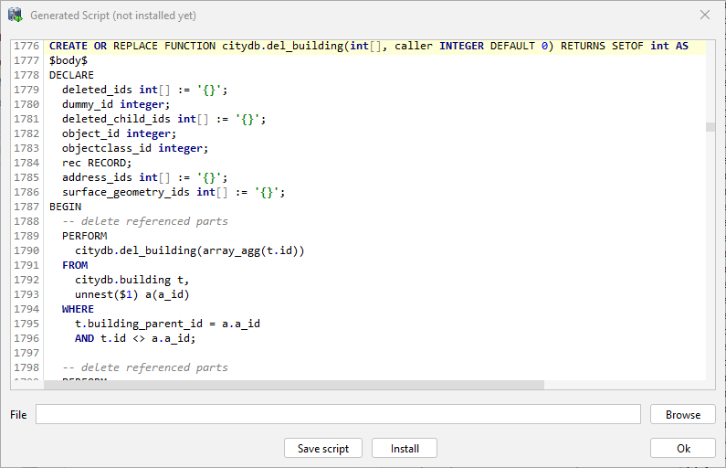

   Dialog window for showing and installing newly generated database stored functions/procedures

.. _ade-transformation:

ADE Transformation
^^^^^^^^^^^^^^^^^^

The second part of the ADE Manager Plugin offers the functionality to
read an ADE’s XML application schema definition file and automatically
generate the database schema and XML schema-mapping files according to
the specific folder structure required for the ADE registration.
However, a notable issue is that some relevant meta-information about an
ADE are usually missing in its XML schema, since they cannot be encoded
using the native syntax of the XML schema and will be lost while
deriving the XML schema from its ADE’s UML model (e.g. when using a
transformation tool like ‘ShapeChange’ (cf. [SHAP2019]_). Moreover, some certain
kinds of meta-information can even not be represented in the UML model.
A good model-driven solution for solving this issue is to extend the UML
model by adding a few specific *taggedValues* (cf. the table below)
which can be automatically translated and encoded into the
<xs:annotation> elements in XML schema.

.. list-table:: Tagging top-level feature classes

   * - | taggedValue
     - | :code:`topLevel` (true \| false)
   * - | Description
     - | This taggedValue allows determining whether an ADE feature class is top-level or not
   * - | Example
       | Of using
       | <xs:annotation>
       | in XML-Schema
     - .. code-block:: XML

        <element name="IndustrialBuilding" substitutionGroup="bldg:_AbstractBuilding"
          type="TestADE:IndustrialBuildingType">
          <annotation>
            <appinfo>
              <taggedValue tag="topLevel">true</taggedValue>
            </appinfo>
          </annotation>
        </element>

.. list-table:: Tagging the Multiplicity of ADE Hook Properties

   * - | taggedValue
     - | :code:`minOccurs` and :code:`maxOccurs` (Integer value \| „unbounded")
   * - | Description
     - | The combiniation of the two taggedValues allows for determining the
       | multiplicity information of each ADE hook property. In UML model, this
       | multiplicity information can be explicitly specified but it is lost in
       | the XML schema, because every ADE hook property is hard-encoded with a
       | multiplicity of [0..*] in the XML schema. Since the current version
       | (2.5.1) of the ShapeChange tool is still not able to read the multiplicity
       | of the hook properties from the UML model directly, the two taggedValues
       | are hence required although they provide the redundant multiplicity
       | information in UML model
   * - | Example
       | Of using
       | <xs:annotation>
       | in XML-Schema
     - .. code-block:: XML

        <element name="ownerName"
          substitutionGroup="bldg:_GenericApplicationPropertyOfAbstractBuilding"
          type="string">
          <annotation>
            <appinfo>
              <taggedValue tag="maxOccurs">1</taggedValue>
            </appinfo>
          </annotation>
        </element>

.. list-table:: Tagging the relationship type between classes

   * - | taggedValue
     - | :code:`relationType` (association \|aggregation \| composition)
   * - | Description
     - | An enumeration attribute allowing to distinguish the three relationships
       | between two associated classes. This meta-information is also lost while
       | mapping UML -> XML schema, because the XML schema doesn’t support the
       | distinguishment between the three relation types. This taggedValue is also
       | redundant from the view of UML, but required when using ShapeChange
   * - | Example
       | Of using
       | <xs:annotation>
       | in XML-Schema
     - .. code-block:: XML

        <element maxOccurs="unbounded" minOccurs="0" name="boundedBy"
          type="bldg:BoundarySurfacePropertyType">
          <annotation>
            <appinfo>
              <taggedValue tag="relationType">composition</taggedValue>
            </appinfo>
          </annotation>
        </element>

The realization of the model transformation process is mainly based on
the concept of “\ *Graph Transformation*\ ” and implemented using the
Open Source graph transformation engine AGG. It comes with a graphical
editor (a runnable jar file *AggV21Build.jar* in the folder lib) that
allows users to define an arbitrary number of graph-structured
transformation rules for mapping complex object-oriented models onto a
compact relational database models (cf. [YaKo2017]_). While
developing the ADE Manager Plugin, around 50 mapping rules have been
designed, which can also be modified by developers for customizing the
model transformation behaviour. The workspace file containing the
transformation rules is located under
“\ */src/main/resources/org/citydb/plugins/ade_manager/graph/Working_Graph.ggx*\ ”
and can be opened using the AGG editor. Using the predefined mapping
rules we were able to correctly transform all well-known CityGML ADEs
like the Energy ADE, Noise ADE, UtilityNetwork ADE, Dynamizer ADE,
IMGeo3D and further custom ADEs to compact relational schemas. In the
future, for some ADEs we may publish complete ADE packages on the
3DCityDB github pages as Open Source. Some will be commercially
available from the 3DCityDB development partners.

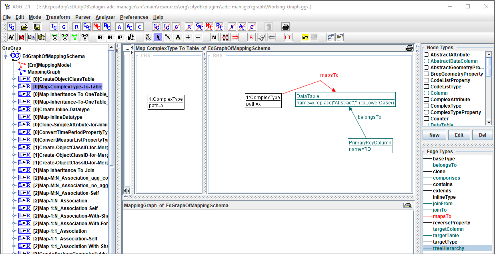

   AGG graph editor for defining model transformation rules for the ADE Manager Plugin

Transformation of the TestADE
"""""""""""""""""""""""""""""

The XML schema definition file of the TestADE is located under the path
“\ *test-ade-citygml4j\src\main\resources\org\citygml\ade\test\schema\CityGML-TestADE.xsd*\ ”.
It can be selected or entered using a file chooser dialog window by
clicking on the *Browse* button in the input panel (cf. [1] in
:numref:`ade_manager_plugin_schema_transform_GUI`). After entering the path of the XML schema and clicking on the
button *Read XML Schema*, the XML schema file will be read and parsed.
All namespaces (except the GML and CityGML namespaces) included in the
the XML schema file will be listed on the left panel (cf. [2] in
:numref:`ade_manager_plugin_schema_transform_GUI`). The namespace
“\ *http://www.citygml.org/ade/TestADE/1.0*\ ” of the target ADE shall
be selected and its background will be highlighted with blue color. In
the next step, some additional relevant meta-information for the ADE
must be specified in the panel (cf. [3] in :numref:`ade_manager_plugin_schema_transform_GUI`) and will be
written into the output schema-mapping file. More details about the
meaning of the individual metadata attribute are described in
:numref:`chapter_citydb_schema_metadata`. In the last step, the path for the output files should
be specified and the *Transform* button can be clicked to start the
transformation process.

The entire transformation process should take just a few seconds, since
the TestADE has a rather simple structure with only 10 classes and data
types. The output files are exactly organized according to the specific
folder structure described in :numref:`ade_manager_plugin_registration_chapter`. A full example of the
output files is located under the path *“test-ade-citydb\resources*\ ”
which can be directly used as the input folder for performing the ADE
registration into a 3DCityDB instance.

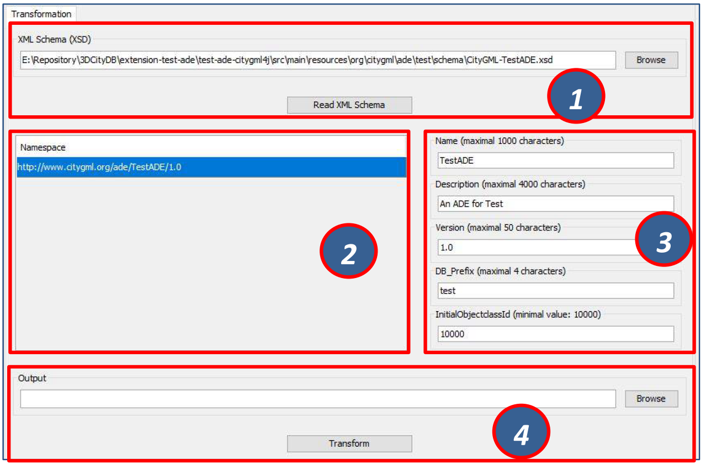

   GUI panel for transforming XML schema to 3DCityDB database schema and schema-mapping file

.. _extend-impexp:

Workflow of extending the Import/Export Tool 
~~~~~~~~~~~~~~~~~~~~~~~~~~~~~~~~~~~~~~~~~~~~~

Once an ADE has been successfully registered into an 3DCityDB instance,
the Import/Export tool must be manually extended to support the import
and export of the ADE datasets. The Import/Export tool provides a
specific Java API that allows developers to implement the ADE-specific
Import/Export-extensions based on a simple plugin mechnism. An example
of how to implement such Java extensions for the TestADE can be found in
the Github repository. In the following, a brief guide about operating
the Import/Export tool with ADE extensions is presented.

-  Create a folder named “ade-extensions” in the installation directory
   of the Import/Export tool, if the folder does not exist.

-  Download the latest version of the TestADE’s Java extension, database
   schema, and schema-mapping file from the Github website:
   https://github.com/3dcitydb/extension-test-ade/releases

-  Unpack the zip file to a folder e.g. named
   “\ **extension-test-ade**\ ” which shall contain three subfolders
   **3dcitydb**, **lib**, and **schema-mapping.**

-  Copy the **extension-test-ade** folder into the **ade-extension**
   folder. The folder structure should look like below.

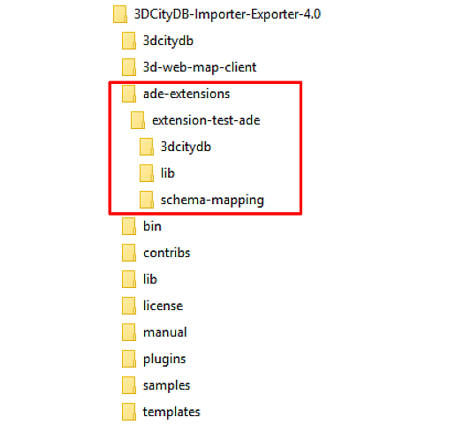

   Folder structure of the Import/Export tool with ADE extensions

-  Start the Import/Export tool. The JAR files in the
   *extension-test-ade/lib* folder along with the schema-mapping file in
   the *extension-test-ade/schema-mapping* will be automatically loaded
   by the Import/Export tool.

-  Connect to an empty 3DCityDB instance. This database could be named
   as “\ **TestADE**\ ” and its coordinate reference system can be
   defined with SRID = 31468

-  Open the tab panel **Database Database operations ADEs** to check
   whether the ADE-extensions for Import/Export tool is successfully
   installed.

The screenshot below shows that the Import/Export tool is now enabled
for supporting the TestADE, while the connected 3DCityDB instance is
still not. Therefore, the next step is to use the ADE Manager plugin to
complete the ADE registration and database schema creation.

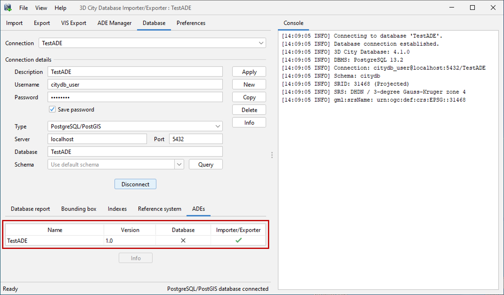

   User interface for checking the status of ADE support of database and Import/Export tool

-  Activate the ADE Manager Plugin and follow the operation steps
   described in :numref:`ade_manager_plugin_registration_chapter`.

-  Reconnect the TestADE database again. The ADE status panel should be
   updated like the figure below.

.. figure:: ../../media/ade_manager_plugin_impexp_support_status_yes.png
   :name: ade_manager_plugin_impexp_support_status_yes

   Status indicating the full support of database and Import/Export tool

-  To test the Import/Export function, open the Import panel and the
   select the ADE datasets which are located under the path
   “\ *resources\\datasets\\*\ ”

It is possible to use the filter options of the CityGML import panel to
import a subset of the ADE datasets. For example, if the the **Feature
classes** filter is used (cf. the figure below), only TestADE feature
objects will be imported.

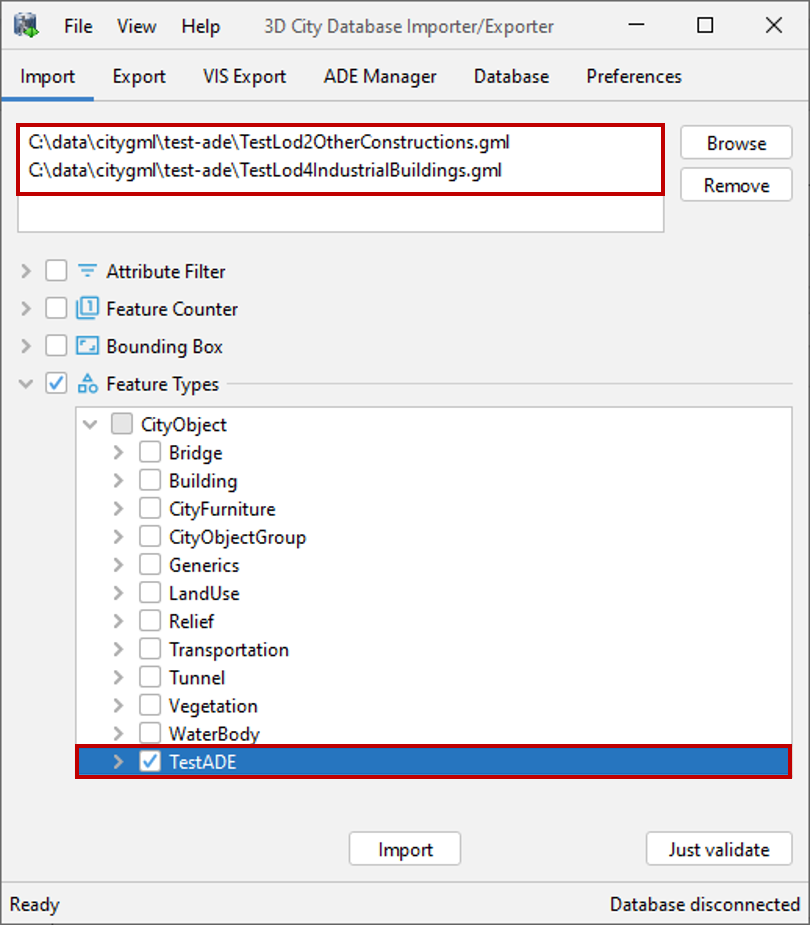

   Import of ADE dataset using Feature Class filter

A summary of the ADE import process is printed in the console window
like the following screenshot:

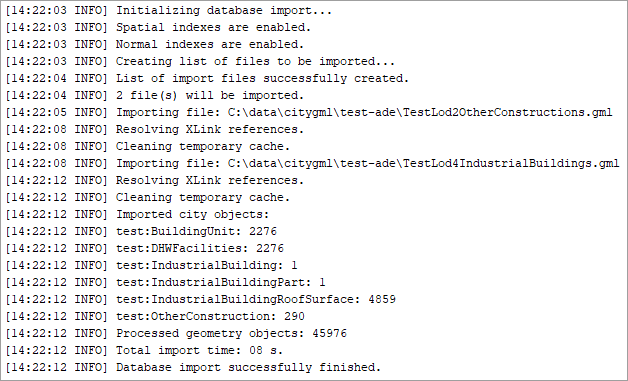

   Console window displaying the summary of the ADE import process

-  Activate the **Database** panel and activate the **Database report**
   subpanel.

-  Click on the **Generate database report** button to generate a
   statistic of the data contents stored in the ADE tables.

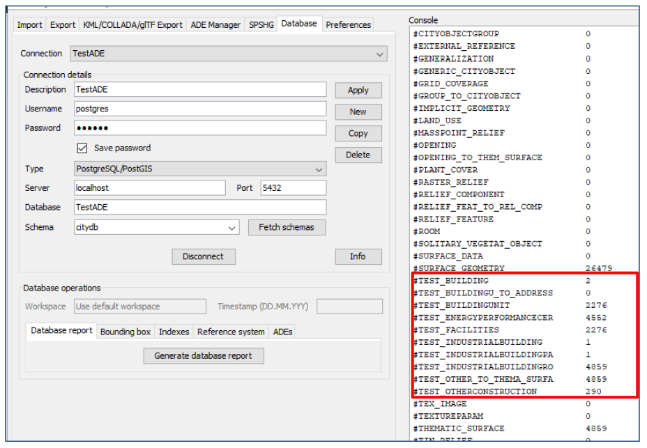

   Console window showing a statistic of the ADE tables

The operation steps for performing ADE export are very similar to those
for the ADE import.

-  Activate the **Export** panel and configure the filter options e.g.
   activate the **Feature class** filter and choose the **TestADE**

-  Click on the **Export** button to start the export process. The
   export configuration and a summary of the ADE export process is shown
   in the figure below:

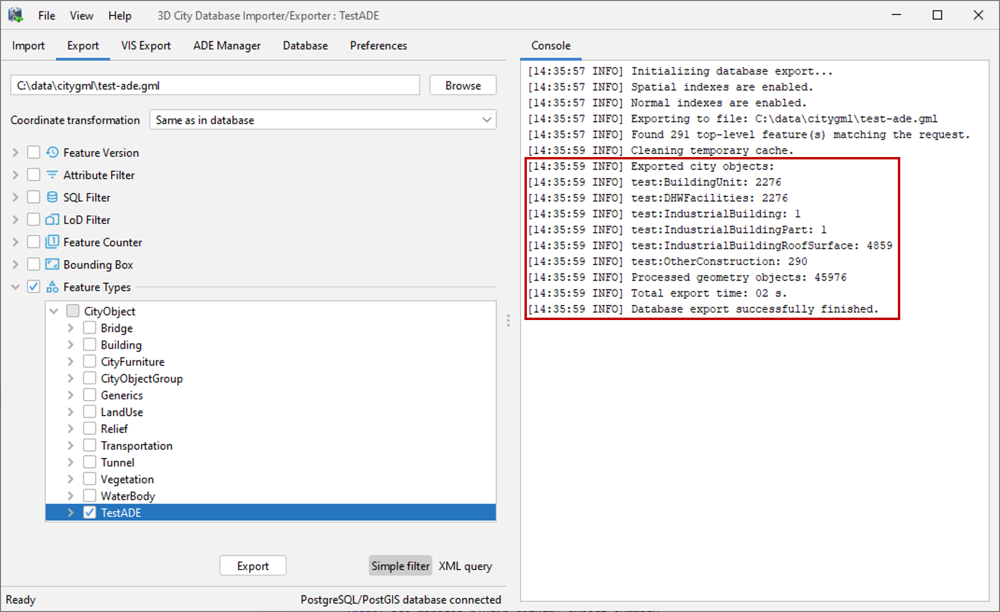

   Console window showing a summary of ADE export
