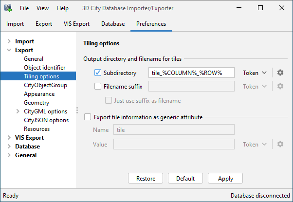
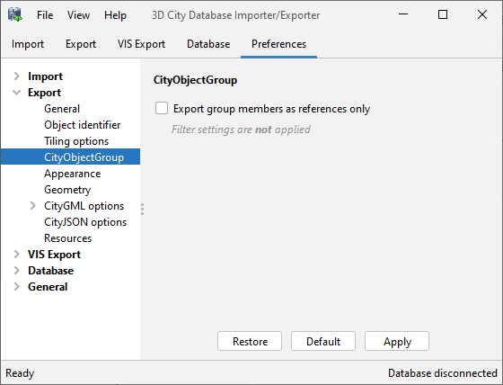
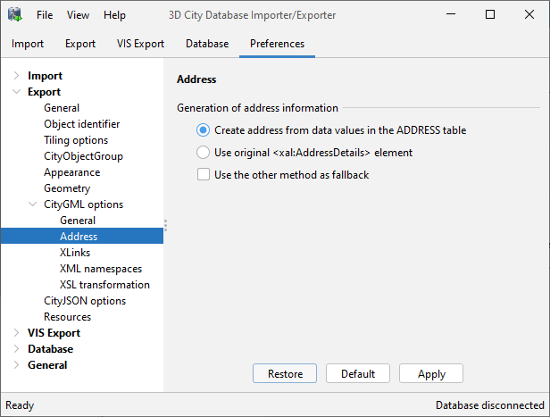
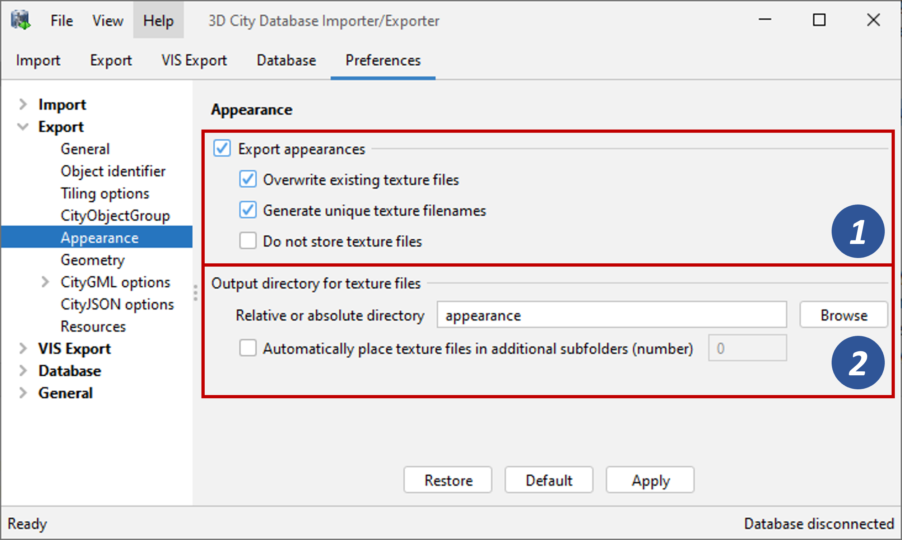
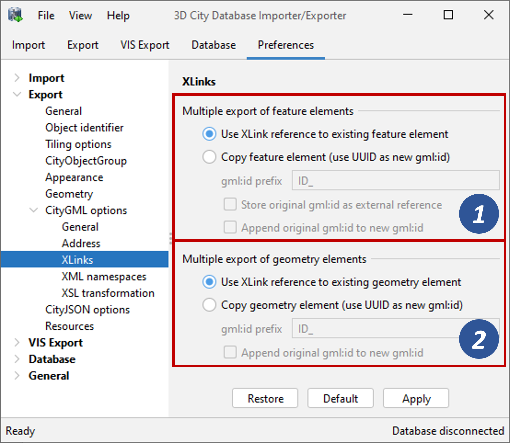
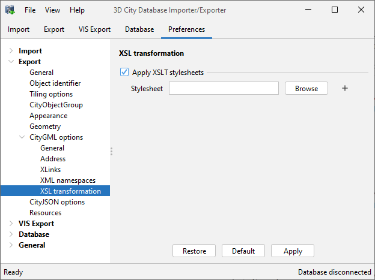
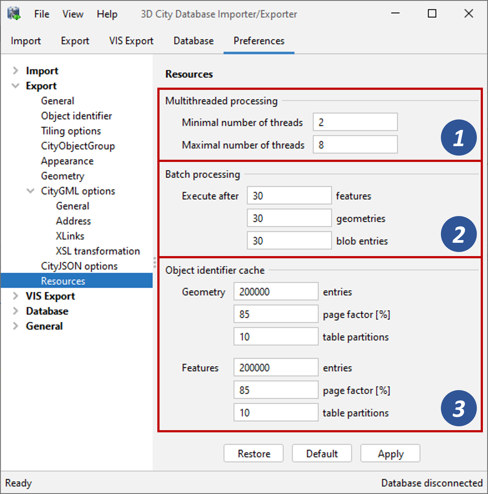

.. _impexp_citygml_export_preferences_chapter:

CityGML export preferences
~~~~~~~~~~~~~~~~~~~~~~~~~~

.. _citygml-version:

CityGML version
^^^^^^^^^^^^^^^

The CityGML version preference settings let you choose the target
CityGML version when exporting 3D city model content from the database
to a CityGML dataset.

.. figure:: ../../media/impexp_export_preferences_citygml_version_fig.png
   :name: impexp_export_preferences_citygml_version_fig
   :align: center

   CityGML export preferences – CityGML version.

The default value is CityGML *version 2.0.0*, which is the current
version of the OGC CityGML Encoding Standard. In addition, also the
preceding *version 1.0.0* is still supported.

.. note::
   CityGML 2.0.0 introduces new feature types such as bridges and
   tunnels that are not available in CityGML 1.0.0. If the 3D City Database
   instance contains features of these types, they *will be neglected* in
   an export to CityGML version 1.0.0 simply because they cannot be encoded
   in this version.

.. _impexp_preferences_export_tiling_chapter:

Tiling options
^^^^^^^^^^^^^^

The Importer/Exporter allows for applying a spatial *bounding box
filter* to CityGML exports on the Export tab of the operations window.
To trigger a tiled export, a user can additionally check the *Tiling*
option and provide the number of rows of columns into which the bounding
box shall be evenly split (cf. :numref:`impexp_citygml_export_chapter`).

When tiling is enabled, the export operation iterates over all tiles
within the bounding box and exports the city objects on each tile. Every
tile is exported to its own file within a separate subfolder of the
export directory. With the Tiling options preferences, the names of the
subfolders and tile files can be adapted as shown below.

   CityGML export preferences – Tiling options.

Each subfolder name consists of a prefix and a tile-specific suffix [1].
The suffix may contain the row and column number of the tile exported or
a combination of the tile’s minimum / maximum coordinates. If a
coordinate suffix is chosen, the coordinates will be given in the
reference system specified for the CityGML export (cf. :numref:`impexp_citygml_export_chapter`;
default value is the internal SRS of the 3D City Database instance),
even if the coordinates of the bounding box filter are given in another
user-defined SRS. This makes it easy to relate objects to tiles since
the coordinates of the objects contained in the tile are exported in the
same reference system. The filename of the CityGML instance document
created in each subfolder corresponds to the one defined on the Export
tab. However, a tile-specific suffix may be appended [1].

For further traceability, it is possible to attach a generic string
attribute called *TILE* to each exported CityGML feature, indicating
which tile it belongs to [2]. The options for the value of the generic
attribute are the same as for the suffix of the tile subfolder.

.. _cityobjectgroup:

CityObjectGroup
^^^^^^^^^^^^^^^

When exporting city object groups, also group members are written to the
target CityGML dataset (cf. :numref:`impexp_citygml_export_chapter`).
Group members are always given
*by reference* (i.e., the *grp:member* property uses an *xlink:href*
reference to point to the group member in the dataset) and only group
members satisfying the filter settings are export.

   CityGML export preferences – CityObjectGroup.

The default behavior can be changed using this preference dialog. When
checking the option *Export all group members as xlink:href references*,
then an *xlink:href* reference is created for each group member defined
in the database, no matter whether this group member is also exported or
skipped due to filter settings. Thus, the consistency of the
*xlink:href* references is not checked, and some references might not be
resolvable in the final dataset. The benefit of skipping this check is
that the performance of the CityGML export is increased.

.. _impexp_export_preferences_address_chapter:

Address
^^^^^^^

Similar to the import of xAL address information
(see :numref:`impexp_import_preferences_address_chapter`), a
user can choose how address information should be exported to a target
CityGML dataset. The available options of the Address export preferences
are shown in the figure below.

   CityGML export preferences – Address.

Address data is typically stored in the attributes STREET, HOUSE_NUMBER, etc.
of the ADDRESS table. As discussed in :numref:`impexp_import_preferences_address_chapter`,
the original ``<xal:AddressDetails>`` element might have been additionally
imported into the XAL_SOURCE column. Thus, there are two possible ways to
reconstruct the address information.

1. The default option is to build the xAL address from the columns of
   the ADDRESS table *without considering* the XAL_SOURCE column. In
   this case, the XML encoding of the xAL address uses the
   following template:

   .. code-block:: xml

       <Address>
         <xalAddress>
           <xAL:AddressDetails>
             <xAL:Country>
               <xAL:CountryName>COUNTRY</xAL:CountryName>
               <xAL:Locality Type="City">
                 <xAL:LocalityName>CITY</xAL:LocalityName>
                 <xal:PostBox>
                   <xal:PostBoxNumber>PO_BOX</xal:PostBoxNumber>
                 </xal:PostBox>
                 <xAL:Thoroughfare Type="Street">
                   <xAL:ThoroughfareNumber>HOUSE_NUMBER</xAL:ThoroughfareNumber>
                   <xAL:ThoroughfareName>STREET</xAL:ThoroughfareName>
                 </xAL:Thoroughfare>
                 <xAL:PostalCode>
                   <xAL:PostalCodeNumber>ZIP_CODE</xAL:PostalCodeNumber>
                 </xAL:PostalCode>
               </xAL:Locality>
             </xAL:Country>
           </xAL:AddressDetails>
         </xalAddress>
       </Address>

2. Optionally, the xAL fragment is taken “as is” from the XAL_SOURCE
   column and inserted literally into the target CityGML document. This
   way there will be no loss of information and the address encoding
   will be identical to the original source datasets. Obviously, this
   option requires that the XAL_SOURCE column has been populated during
   import (cf. :numref:`impexp_import_preferences_address_chapter`).

Both options are mutually exclusive, but if the chosen option does
not provide results, the other option can be used as fallback.

.. _impexp_export_preferences_appearance_chapter:

Appearance
^^^^^^^^^^

The Appearance export preferences control how appearance information of
city objects is written to the output datasets.

   CityGML export preferences – Appearance.

By default, both appearance information and texture image files
associated with the city objects in the 3D City Database are exported
[1]. Alternatively, the user can choose to only export the appearance
information without textures or to drop appearances completely.

When exporting texture files, the additional options *Overwrite existing
texture files* and *Generate unique texture filenames* influence the way
in which texture files are written to the file system [1].

1) *Overwrite existing texture files*:
   Texture files are stored in a separate folder of the file system.
   Before exporting a texture image file into this folder, the
   Importer/Exporter can check whether a file of the same filename
   already exists in this folder. In this case, the existing file will
   be kept if this option is *not enabled*. Otherwise, and by default,
   there is no check and a texture file of the same name will be
   overwritten.

2) *Generate unique texture filenames*:
   Often filenames for texture images are automatically created from a
   naming scheme involving some counter (e.g., a prefix “\ *tex*\ ”
   followed by a number incremented by 1 for each new image). It thus
   can happen that two city objects within the same or different
   instance documents are assigned a texture image file of the same
   name but with different content. In the 3D City Database, texture
   images are stored in separate records and thus duplicate filenames
   are not an issue. When exporting to CityGML, however, two texture
   files of the same name might be written to the same target folder,
   in which case one is replaced with the other. This will obviously
   lead to false visualizations and issues in workflows consuming the
   exported CityGML data. For this reason, checking this option
   will force the export process to generate unique and stable
   filenames for each texture file.

The location where to store the texture files can be defined by the user
[2]. The default option is to pick a folder below the export directory
and thus relative to the target CityGML file. The default folder name is
“\ *appearance*\ ”. Instead of a local path, also an absolute path can
be provided. In this case, the same folder will be used in subsequent
exports from the 3D City Database.

When appearances are chosen to be exported but the *Do not store texture
files* option [1] is checked, then appearance information is generated
for the city objects in the CityGML dataset, but the texture files are
not stored in the file system. However, since the texture path is part
of the appearance information, the directory settings [2] and whether to
generate unique texture filenames [1] still has an impact on the
generated appearance information. The *Do not store texture files*
option is useful, for example, if the texture files have already been
exported to an absolute directory in a previous run of the export
operation.

Especially when running the Importer/Exporter on a Windows machine,
placing a large number of files into the
same folder might lead to severe I/O lags. This might
negatively affect the performance for large exports. For this reason,
the Importer/Exporter can automatically distribute the texture files
over additional subfolders that are automatically created. Simply check
the option *Automatically place texture files in additional subfolders*
and provide the number of subfolders to be used.

.. _impexp_export_preferences_xlinks_chapter:

XLinks
^^^^^^

Both the 3D City Database and the Importer/Exporter are capable of
handling XLinks. If the CityGML input document that is imported into the
3D City Database contains XLink references to features and/or
geometries, then this information is kept in the database in order to be
able to reconstruct the XLinks upon database export. This is also the
default behavior.

Depending on the target application that consumes the exported CityGML
dataset, this default behavior may be disadvantageous, especially if the
target application cannot follow and resolve XLink references. In such
cases, the XLinks preference settings let a user change the default
behavior so that the referenced objects are exported *by value* rather
than *by reference*. Put differently, instead of an XLink reference, a
copy of the original feature or geometry is placed into the CityGML
dataset. This necessarily requires that the gml:id of the copy is
different from the gml:id of the original object because identical
gml:id values are not allowed in the same dataset. The Importer/Exporter
takes care of this issue and creates new gml:id values for the copies
based on UUID values.

   CityGML export preferences – XLinks.

The user can define the behavior for exporting XLinks differently for
features [1] and geometries [2]. The settings allow providing a
*prefix* string that will be used when creating new gml:id values
(default: “\ *UUID\_*\ ”) and whether the original gml:id should be
appended to the newly created one. Only for features, the user can
additionally choose to store the original gml:id as ``<ExternalReference>``
property in the copied feature.

.. _impexp_export_preferences_xsl_transformation:

XSL Transformation
^^^^^^^^^^^^^^^^^^

As for CityGML imports, you can apply XSLT transformations
during the export process to change the resulting CityGML output data.
Simply check the *Apply XSLT stylesheets* option and point to an XSLT
stylesheet in your local file system using the *Browse* button. The
stylesheet will be automatically considered by the export process to
transform the CityGML data before it is written to a file.

   CityGML export preferences – XSL transformation.

By clicking the + and - buttons, more than one XSLT stylesheet can be
provided to the exporter. The stylesheets are applied in the given order,
with the output of a stylesheet being the input for its direct
successor. The Importer/Exporter is shipped with example XSLT
stylesheets in the folder ``templates/XSLTransformations`` of the
installation directory.

.. note::
   - To be able to handle arbitrarily large exports, the export
     process reads single top-level features from the database, which are
     then written to the target file. Each XSLT stylesheet will thus just
     work on individual top-level features but not on the entire file.
   - The output of each XSLT stylesheet must again be a valid CityGML
     structure.
   - Only stylesheets written in the XSLT language version 1.0 are
     supported.

.. _impexp_export_preferences_resources_chapter:

Resources
^^^^^^^^^

Just like with CityGML imports, the export process is implemented based
on multithreaded data processing in order to increase the overall
application performance. Likewise, in order to reconstruct XLinks during
exports (cf. :numref:`impexp_export_preferences_xlinks_chapter`),
the export process also needs to keep
track of each and every gml:id of exported features and geometry
objects. For fast access, the gml:id values are kept in main memory and
are only paged to temporary database tables in case the predefined cache
size limit is reached.

   CityGML export preferences – Resources.

The Resource preferences allow for setting the number of *concurrent
threads* to be used in the export process and for defining the *sizes*
and *page factors* of the gml:id caches for features and geometries. The
meaning of the values is identical to the Resource preferences for
CityGML imports. So, please refer to
:numref:`impexp_import_preferences_resources_chapter` for more details.