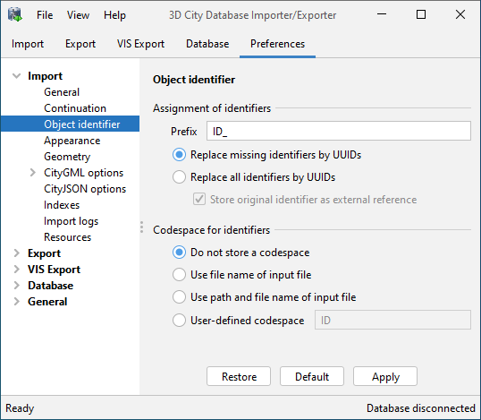
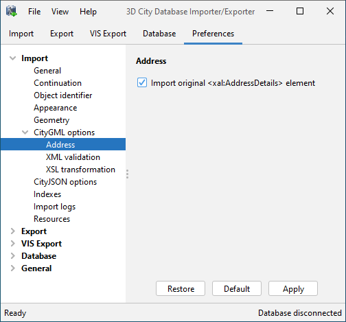
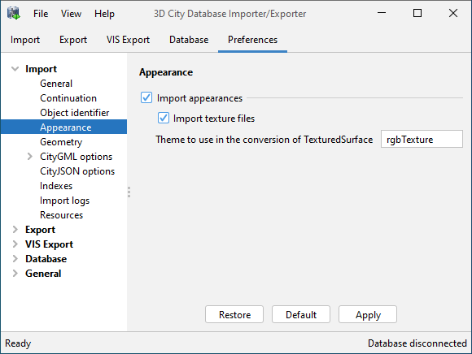
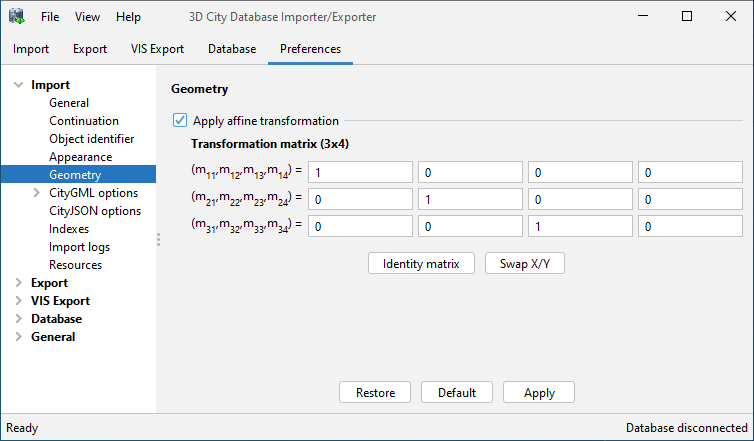
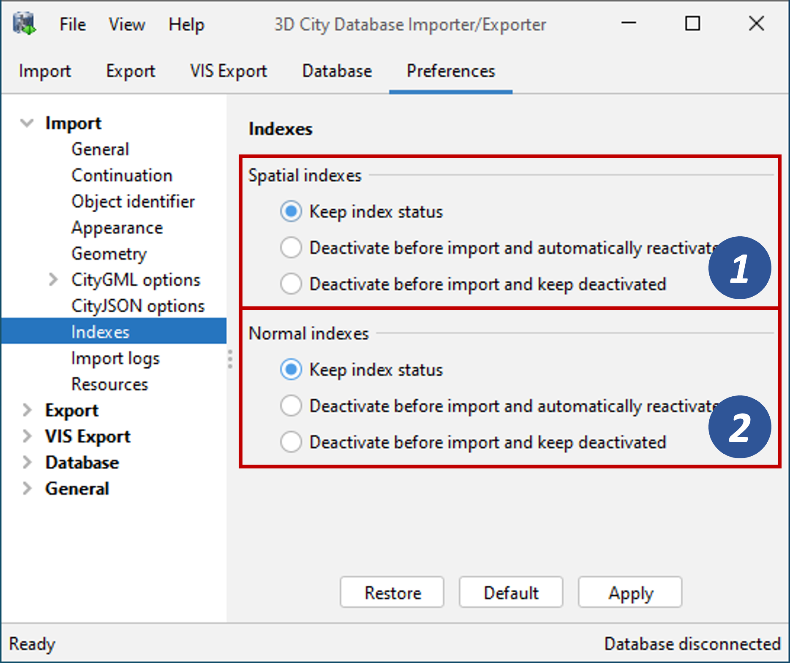
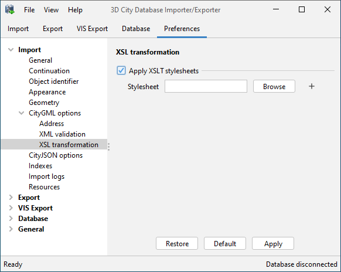
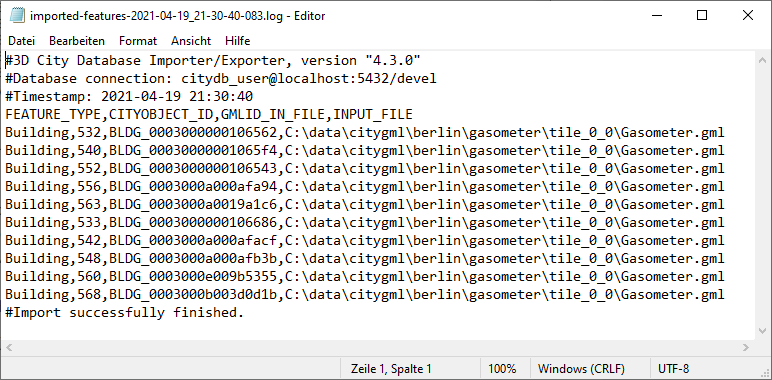
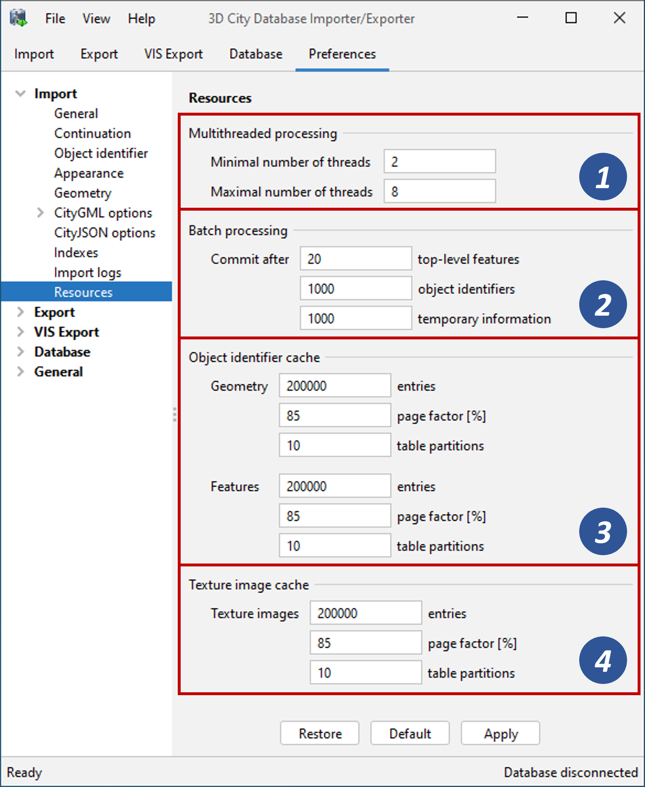

.. _impexp_citygml_import_preferences_chapter:

CityGML import preferences
~~~~~~~~~~~~~~~~~~~~~~~~~~

.. _continuation:

Continuation
^^^^^^^^^^^^

The Continuation preferences allow for specifying metadata that is
assigned to every city object at import time. The metadata is carried to
columns of the table CITYOBJECT and is therefore accessible in SQL
queries.

   CityGML import preferences – Continuation.

The following metadata can be set:

.. list-table:: Metadata stored with every city object in the table CITYOBJECT.
   :name: impexp_cityobject_metadata_table

   * - | **ADE Metadata**
     - | **Description**
   * - | Data lineage [1]
     - | A string value denoting the origin of the data.
       | (column: LINEAGE; default value: NULL)
   * - | Reason for update [1]
     - | A string value providing the reason for a data update.
       | (column: REASON_FOR_UPDATE; default value: NULL)
   * - | Updating person [2]
     - | A string value identifying the person being responsible for importing
       | or updating the city object.
       | (column: UPDATING_PERSON; default value: name of the database user)
   * - | creationDate [3]
     - | A timestamp value denoting the date of creation of the city object.
       | If this date is not available from the CityGML feature during import,
       | it may either be set to the import date or be inherited from the parent
       | feature (if available). Alternatively, the user can choose to replace
       | all creation dates from the input files with the import date.
       | (column: CREATION_DATE; default value: import date)
   * - | terminationDate [4]
     - | A timestamp value denoting the date of termination of the city object.
       | If this date is not available from the CityGML feature during import,
       | it may either be set to NULL or be inherited from the parent feature
       | (if available). Alternatively, the user can choose to replace all termination
       | dates in the input files with NULL.
       | (column: TERMINATION_DATE; default value: NULL)

.. note::
   Both *creationDate* and *terminationDate* are CityGML properties
   of city objects and therefore are exported to CityGML datasets. The
   remaining metadata information does not map to CityGML properties. It is
   therefore not exported to CityGML datasets but is only available in the
   database.

.. _gmlid:

gml:id handling
^^^^^^^^^^^^^^^

Globally unique object identifiers are crucial for ensuring data
consistency and for enabling data management workflows. Especially when
it comes to (subsequently) updating the city model content in the
database, unique identifiers will help to quickly identify and replace
objects in the database with candidates from external datasets.
Unfortunately, gml:id values do not meet the requirement of global
uniqueness since they are, per definition, optional and only unique
within the scope of a single dataset.

   CityGML import preferences – gml:id handling.

Per default, the Importer/Exporter assumes that the gml:id values
associated with the city objects to be imported are globally unique and
therefore imports them “as is” into the database. Only in case a city
object (or geometry object) lacks a gml:id, a UUID value will be
generated at import time and stored with the object.

This default behavior can be overridden with this preferences dialog in
order to let the Importer/Exporter replace all gml:id values in the
input file(s) with generated UUID values. The user may choose a prefix
for the gml:id value. Use this option with caution. The original gml:id
value may optionally be stored as external reference to not lose this
information.

In addition to the gml:id, the 3DCityDB allows for storing a second
GMLID_CODESPACE metadata value. The idea is that the compound value of
gml:id and GMLID_CODESPACE is globally unique. The user can choose to
use the file name of the CityGML import file, its complete path or a
user-defined string as GMLID_CODESPACE. Per default, the
Importer/Exporter does not import a GMLID_CODESPACE value though.

.. note::
   The Importer/Exporter internally only relies on the gml:id value
   to identify objects, for example, when resolving XLink references. The
   GMLID_CODESPACE value therefore supports user-defined data management
   processes in the first place.

.. _impexp_import_preferences_address_chapter:

Address
^^^^^^^

CityGML relies upon the *OASIS Extensible Address Language* (xAL)
standard for the representation and exchange of address information. xAL
provides a flexible and generic framework for encoding address data
according to arbitrary address schemes. The columns of the ADDRESS table
of the 3D City Database however only map the most common fields in
address records (cf. :numref:`_citydb_schema_chapter`). Moreover, the Importer/Exporter
currently does not support arbitrary xAL fragments but is tailored to
the parsing of following two xAL templates that are taken from the
CityGML specification.

.. code-block:: xml

   <bldg:Building>
     …
     <bldg:address>
       <Address>
         <xalAddress>
           <!-- Bussardweg 7, 76356 Weingarten, Germany -->
           <xAL:AddressDetails>
             <xAL:Country>
               <xAL:CountryName>Germany</xAL:CountryName>
               <xAL:Locality Type="City">
                 <xAL:LocalityName>Weingarten</xAL:LocalityName>
                 <xAL:Thoroughfare Type="Street">
                   <xAL:ThoroughfareNumber>7</xAL:ThoroughfareNumber>
                   <xAL:ThoroughfareName>Bussardweg</xAL:ThoroughfareName>
                 </xAL:Thoroughfare>
                 <xAL:PostalCode>
                   <xAL:PostalCodeNumber>76356</xAL:PostalCodeNumber>
                 </xAL:PostalCode>
               </xAL:Locality>
             </xAL:Country>
           </xAL:AddressDetails>
         </xalAddress>
       </Address>
     </bldg:address>
   </bldg:Building>
   <bldg:Building>
     …
     <bldg:address>
       <Address>
         <xalAddress>
           <!-- 46 Brynmaer Road Battersea LONDON, SW11 4EW United Kingdom -->
           <xAL:AddressDetails>
             <xAL:Country>
               <xAL:CountryName>United Kingdom</xAL:CountryName>
               <xAL:Locality Type="City">
                 <xAL:LocalityName>LONDON</xAL:LocalityName>
                 <xAL:DependentLocality Type="District">
                   <xAL:DependentLocalityName>Battersea</xAL:DependentLocalityName>
                   <xAL:Thoroughfare>
                     <xAL:ThoroughfareNumber>46</xAL:ThoroughfareNumber>
                     <xAL:ThoroughfareName>Brynmaer Road</xAL:ThoroughfareName>
                   </xAL:Thoroughfare>
                 </xAL:DependentLocality>
                 <xAL:PostalCode>
                   <xAL:PostalCodeNumber>SW11 4EW</xAL:PostalCodeNumber>
                 </xAL:PostalCode>
               </xAL:Locality>
             </xAL:Country>
           </xAL:AddressDetails>
         </xalAddress>
       </Address>
     </bldg:address>
   </bldg:Building>

If xAL address information in a CityGML instance document does not
comply with one of the templates (e.g., because of additional or
completely different entries), the address information will only
partially be stored in the database (if at all). In order to not lose
any original address information, the entire <xal:AddressDetail> XML
fragment can be imported “as is” from the input CityGML file and stored
in the XAL_SOURCE column of the ADDRESS table in the 3D City Database.

For this purpose, simply check the *Import original <xal:AddressDetail>
XML* option (this is the default value). Note that the import of the XML
fragment does not affect the filling of the remaining columns of the
ADDRESS table (STREET, HOUSE_NUMBER, etc.) from the xAL address
information.

   CityGML import preferences – Address.

The symmetrical setting for CityGML exports (i.e., recovering the xAL
fragment from XAL_SOURCE) is explained in :numref:`impexp_preferences_address_chapter`.

.. _impexp_import_preferences_appearance_chapter:

Appearance
^^^^^^^^^^

The Appearance preference settings define how appearance information
(i.e., materials and textures associated with the observable surfaces of
a city object) is processed at import time.

   CityGML import preferences – Appearance.

Per default, all appearance information as well as all related texture
image files are loaded into the 3D City Database [1]. The
Importer/Exporter will work on both image files located in a relative
path to the CityGML dataset and image files referenced by a valid URL.
The latter might require network access. Alternatively, a user may
choose to only consider the appearance information but to not load the
texture image files. As a third option, appearance information can be
completely skipped during import [1].

Prior to version 1.0 of the CityGML standard, material and texture
information of surface objects was modelled using the TexturedSurface
concept. This concept was however replaced by the Appearance module in
CityGML 1.0 and therefore is marked deprecated. Although the CityGML
specification disadvises the use of the TexturedSurface concept, it is
still allowed even in CityGML 2.0 datasets. The Importer/Exporter can
parse and interpret TexturedSurface information but will automatically
convert this information losslessly into the Appearance module. Since
TextureSurface information is not organized into themes but a theme is
mandatory in the context of the Appearance module, the user has to
define a *theme* that shall be used in the conversion process [2]. The
default value is *rgbTexture.*

.. _geometry:

Geometry
^^^^^^^^

Before importing the city objects into the 3D City Database, the
Importer/Exporter can apply an affine coordinate transformation to all
geometry objects. Per default, this option is disabled though.

   CityGML import preferences – Geometry.

An affine transformation is any transformation that preserves
collinearity (i.e., points initially lying on a line still lie on a line
after transformation) and ratios of distances (e.g., the midpoint of a
line segment remains the midpoint after transformation). It will move
lines into lines, polylines into polylines and polygons into polygons
while preserving all their intersection properties. Geometric
contraction, expansion, dilation, reflection, rotation, skewing,
similarity transformations, spiral similarities, and translation are all
affine transformations, as are their combinations.

The affine transformation is defined as the result of the multiplication
of the original coordinate vectors by a matrix plus the addition of a
translation vector.

.. math:: {\overrightarrow{p}}^{'} = A \bullet \overrightarrow{p} + \overrightarrow{b}

In matrix form using homogenous coordinates:

.. math::

   \begin{bmatrix}
   x^{'} \\
   y^{'} \\
   z^{'} \\
   \end{bmatrix} = \begin{bmatrix}
   m_{11} & m_{12} & m_{13} & m_{14} \\
   m_{21} & m_{22} & m_{23} & m_{24} \\
   m_{31} & m_{32} & m_{33} & m_{34} \\
   \end{bmatrix} \bullet \begin{bmatrix}
   x \\
   y \\
   z \\
   1 \\
   \end{bmatrix}

The coefficients of this matrix and translation vector can be entered in
this preferences dialog (cf. :numref:`impexp_import_preferences_geometry_fig`).
The first three columns define
any linear transformation; the fourth column contains the translation
vector. The affine transformation does neither affect the dimensionality
nor the associated reference system of the geometry object, but only
changes its coordinate values. It is applied the same to all coordinates
in all objects in the original CityGML file. This also includes all
matrixes in CityGML like the 2x2 matrixes of GeoreferencedTextures, the
3x4 transformation matrixes of TexCoordGen elements used for texture
mapping and the 4x4 transformation matrixes for ImplicitGeometries.

.. warning::
   An affine transformation cannot be undone or reversed after the
   import using the Importer/Exporter.

Two elementary affine transformations are predefined: 1) *Identity
matrix* (leave all geometry coordinates unchanged), which serves as an
explanatory example of how values in the matrix should be set, and 2)
*Swap X/Y*, which exchanges the values of *x* and *y* coordinates in all
geometries (and thus performs a 90 degree rotation around the z axis).
The latter is very helpful in correcting CityGML datasets that have
northing and easting values in wrong order.

**Example:** For an ordinary translation of all city objects by 100
meters along the x-axis and 50 meters along the y-axis (assuming all
coordinate units are given in meters), the *identity matrix* must be
applied together with the translation values set as coefficients in the
translation vector:

.. math::

   {\overrightarrow{p}}^{'} = \begin{bmatrix}
   1 & 0 & 0 & 100 \\
   0 & 1 & 0 & 50 \\
   0 & 0 & 1 & 0 \\
   \end{bmatrix} \bullet \overrightarrow{p}

.. _indexes:

Indexes
^^^^^^^

In addition to the Database tab on the operations window, which lets you
enable and disable spatial and normal indexes in the 3D City Database
manually (cf. chapter 5.2.2), with this preference settings a default
index strategy for database imports can be determined.

   CityGML import preferences – Indexes.

The dialog differentiates between settings for *spatial indexes* [1] and
*normal indexes* [2] but offers the same options for each index type.

The default setting is to not change the status (i.e., either enabled or
disabled) of the indexes. This default behavior can be changed so that
indexes are always disabled before starting and import process. The user
can choose whether the indexes shall be automatically reactivated after
the import has been finished.

.. note::
   All indexes are *enabled* after setting up a new instance of 3D
   City Database.

.. note::
   It is *strongly recommended* to *deactivate the spatial indexes
   before running a CityGML import* on a *big amount of data* and to
   reactive the spatial indexes afterwards. This way the import will
   typically be a lot faster than with spatial indexes enabled. The
   situation may be different if only a small dataset is to be imported.
   Deactivating normal indexes should however never be required.

.. warning::
   Activating and deactivating indexes can take a long time,
   especially if the database fill level is high. Note that the operation
   **cannot be aborted** by the user since this could result in an
   inconsistent database state.

.. _xml-validation:

XML validation
^^^^^^^^^^^^^^

On the Import tab of the operations window, the CityGML input files to
be imported into the database can be manually validated against the
official CityGML XML Schemas. This preference dialog lets a user choose
to perform XML validation automatically with every database import.

   CityGML import preferences – XML validation.

In general, it is **strongly recommended** to ensure (either manually or
automatically) that the input files are valid with respect to the
CityGML XML schemas. Invalid files might cause the import procedure to
behave unexpectedly or even to abort abnormally.

If XML validation is chosen to be performed automatically during
imports, then every invalid top-level feature will be discarded from the
import. Nevertheless, the import procedure will continue to work on the
remaining features in the input file(s).

Validation errors are printed to the console window. Often, error
messages quickly become lengthy and confusing. To keep the console
output low, the user can choose to only report the first validation
error per top-level feature and to suppress all subsequent error
messages.

.. note::

   The XML validation in general does not require internet access
   since the CityGML XML schemas are packaged with the Importer/Exporter.
   These internal copies of the official XML schemas will be used to
   check CityGML XML content in input files. The user cannot change this
   behavior. External XML schemas will only be considered in case of
   unknown XML content, which might require internet access. Precisely,
   the following rules apply:

    -  If an XML element’s namespace is part of the official CityGML 2.0 or
       1.0 standard, it will be validated against the internal copies of
       the official CityGML 2.0 or 1.0 schemas (no internet access
       needed).

    -  If the element’s namespace is unknown, the element will be validated
       against the schema pointed to by the *xsi:schemaLocation* value on
       the root element or the element itself. This is necessary when,
       for instance, the input document contains XML content from a
       CityGML Application Domain Extension (ADE). Note that loading the
       schema might require internet access.

    -  If the element’s namespace is unknown and the *xsi:schemaLocation*
       value (provided either on the root element or the element itself)
       is empty, validation will fail with a hint to the element and the
       missing schema document.

.. _xsl-transformation:

XSL Transformation
^^^^^^^^^^^^^^^^^^

This preference is used to apply changes to the CityGML input data
before it is imported into the database using XSL transformations.
Simply check the *Apply XSLT stylesheets* option and point to an XSLT
stylesheet in your local file system using the *Browse* button. The
stylesheet will be automatically considered by the import process to
transform the CityGML data.

   CityGML import preferences – XSL transformation.

By clicking the *+* and *-* buttons, more than one XSLT stylesheet can
be fed to the importer. The stylesheets are executed in the given order,
with the output of a stylesheet being the input for its direct
successor. The Importer/Exporter is shipped with example XSLT
stylesheets in subfolders below templates/ XSLTransformations in the
installation directory.

.. note::
   To be able to handle arbitrarily large input files, the importer
   chunks every CityGML input file into top-level features, which are then
   imported into the database. Each XSLT stylesheet will hence just work on
   individual top-level features but not on the entire file.

.. note::
   The output of each XSLT stylesheet must again be a valid CityGML
   structure.

.. note::
   Only stylesheets written in the XSLT language version 1.0 are
   supported.

.. _import-log:

Import log
^^^^^^^^^^

A CityGML import process not necessarily works on all CityGML features
within the provided input file(s). An obvious reason for this is that
spatial or thematic filters that naturally narrow down the set of
imported features. Also, in case the import procedure aborts early
(either requested by the user or caused by severe import errors), not
all input features might have been processed. To understand which
top-level features were actually loaded into the database during an
import session, the user can choose to let the Importer/Exporter create
an *import log*.

.. figure:: ../../media/impexp_import_preferences_log_fig.png
   :name: impexp_import_preferences_log_fig

   CityGML import preferences – Import log.

Simply enable the checkbox on this settings dialog to activate import
logs (disabled per default). You additionally must provide a folder
where the import log files will be created in. Either type the folder
name manually or use the *Browse* button to open a file selection
dialog. The application proposes to use a folder within your user’s home
directory, but this proposal can be overridden.

To easily relate import logs to different 3D City Database instances
managed on the Database tab, the Importer/Exporter creates one subfolder
for each connection entry below the folder provided in the settings
dialog. The *description text* of the connection entry (cf.
:numref:`impexp_database_connection_management_chapter`)
is used as folder name. Within that subfolder, a separate log
file is created for every input file during an import to that 3D City
Database connection. The filename includes the date and time of the
import session according to following pattern:

imported-features-yyyy_MM_dd-HH_mm_ss_SSS.log

The import log is a simple CSV file with one record (line) per imported
top-level feature. The following figure shows an example.

   Example import log.

The first four lines of the import log contain metadata about the
*version of the Import/Exporter* that was used for the import, the
*absolute path to the CityGML input file*, the database *connection
string*, and the *timestamp of the import*. Each line starts with #
character in order to mark its content as metadata.

The first line below the metadata block provides a header for the fields
of each record. The field names are FEATURE_TYPE, CITYOBJECT_ID, and
GML_ID_IN_FILE. A single comma separates the fields. The records follow
the header line. The meaning of the fields is as follows:

-  FEATURE_TYPE An uppercase string representing the type of the
   imported CityGML feature.

-  CITYOBJECT_ID The value of the ID column (primary key) of the
   CITYOBJECT table where the feature was inserted.

-  GML_ID_IN_FILE The original gml:id value of the feature in the input
   file (might differ in database due to import settings).

The last line of each import log is a footer that contains metadata
about whether the import was *successfully finished* or *aborted*.

.. _impexp_import_preferences_resources_chapter:

Resources
^^^^^^^^^

**Multithreading settings.** The software architecture of the
Importer/Exporter is based on multithreading. Put simply, the different
tasks of an import process are carried out by separate threads. The
decoupling of compute bound from I/O bound tasks and their parallel
non-blocking processing usually leads to an increase of the overall
application performance. For example, threads waiting for database
response do not block threads parsing the input document or processing
the CityGML input features. In a multi-core environment, threads can
even be executed simultaneously on multiple CPUs or cores.

   CityGML import preferences – Resources.

The Resource settings allow for controlling the minimum and maximum
number of concurrent threads during import [1]. Make sure to enter
reasonable values depending on your hardware configuration. By default,
the maximum number is set to the number of available CPUs/cores times
two. Before starting the import process, the minimum number of threads
is created. Further threads up to the specified maximum number are only
created if necessary.

.. warning::
   A higher number of threads *does not necessarily result in a
   better performance*. In contrast, a too high number of active threads
   faces disadvantages such as thread life-cycle overhead and resource
   thrashing. Also, note that each thread requires its *own physical
   connection to the database*. Therefore, your database must be ready to
   handle enough parallel physical connections. Ask you database
   administrator for assistance.

**Cache settings.** The Importer/Exporter employs strategies for parsing
CityGML datasets of arbitrary file size and for resolving XLink
references. A naive approach for XLink resolving would read the entire
CityGML dataset into main memory. However, CityGML datasets quickly
become too big to fit into main memory. For this reason, the import
process follows a two-phase strategy: In a first run, features are
written to the database neglecting references to remote objects. If a
feature contains an XLink though, any context information about the
XLink is written to temporary database tables. This information
comprises, for instance, the table name and primary key of the
referencing feature/geometry instance as well as the gml:id of the
target object.

In addition, while parsing the document, the import process keeps track
of every encountered gml:id as well as the table name and primary key of
the corresponding object in database. It is important to record this
information because a priori it cannot be predicted whether or not a
gml:id is referenced by an XLink from somewhere else in the document. In
order to ensure fast access, the information is cached in memory. If the
maximum cache size is reached, the cache is paged to temporary database
tables to prevent memory overflows. In a second run, the temporary
tables containing the context information about XLinks are revisited and
queried. Since the entire CityGML document has been processed at this
point in time, valid references can be resolved and processed
accordingly. With the help of the gml:id cache, the referenced objects
can be quickly identified within the database.

The caching and paging behaviour for gml:id values can be influenced via
the Resource preferences [3]. The dialog lets a user enter the maximum
number of gml:id values to be held in main memory (default: 200,000
*entries*), the percentage of entries that will be written to the
database if the cache limit is reached (*page factor*, default: 85%), as
well as the number of parallel temporary tables used for paging (*table
partitions*, default: 10). The Importer/Exporter employs different
caches for gml:id values of geometries and features [3]. Moreover, a
third cache is used for handling texture atlases and offers similar
settings [4].

**Batch settings.** In order to optimize database response times,
multiple database statements are submitted to the database in a single
request (*batch processing*). This allows for an efficient data
processing on the database side. The user can influence the number of
SQL statements in one batch through the settings dialog [2]. The dialog
differentiates between batch sizes for CityGML features (default: 20)
and gml:id caches respectively temporary XLink information (default:
1000 each).

.. note::
   All database operations within one batch are buffered in main
   memory before being submitted to the database. Thus, the
   Importer/Exporter might run out of memory if the batch size is too high.
   After a batch is submitted, the transaction is committed.
