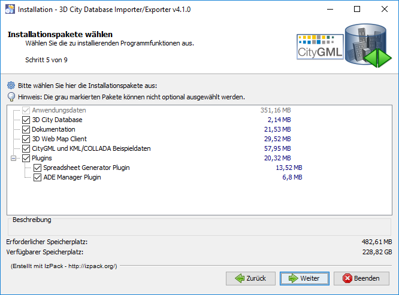

Installation of the Importer/Exporter
-------------------------------------

Download the universal installer from the 3DCityDB website at
http://www.3dcitydb.org or from the GitHub
`release section <https://github.com/3dcitydb/importer-exporter/releases>`_
and save it to your local file system. The installer is shipped as an
executable Java Archive (JAR) file. To run the installation wizard,
simply double-click on the *3DCityDB-Importer-Exporter-4.1.0-Setup.jar*
file. After accepting the license agreement and specifying an installation
directory, you can choose the software packages to be installed.

   Installation wizard of Import/Export tool (Step 5).

It is recommended to at least select the packages ‘\ *3D City Database*\ ’
and ‘\ *Documentation’*. The ‘\ *3D City Database*\ ’ package contains all
:doc:`SQL scripts <3dcitydb-scripts>` that are required for setting
up an instance of the 3D City Database on your spatial database system.
Please refer to the step-by-step guide for :doc:`Oracle <db-setup-oracle>`
or :doc:`PostgreSQL <db-setup-postgis>` on how to use the SQL scripts.
The package ‘\ *Sample CityGML and KML/COLLADA datasets*\ ’ contains
license-free sample data that may be used in first tests.

The option ‘\ *Plugins*\ ’ allows a user to install plugins for the
Importer/Exporter, which add further functionality to the tool. This
release is shipped with the
:doc:`*Spreadsheet Generator Plugin*\ <../impexp/plugins/spreadsheet>`
and the
:doc:`*ADE Manager Plugin* <../impexp/plugins/ade-manager>`.
More plugins may be added in future releases.

The :doc:`*3D Web Map Client* <../webmap/index>` is a web-based
viewer for 3DCityDB content and provides high-performance 3D visualization
and interactive exploration of arbitrarily large semantic 3D city models
on top of the open source `Cesium Virtual Globe <https://cesiumjs.org/>`_.

After successful installation, the contents of all selected installation
packages are available in the installation directory. To run the
Importer/Exporter (as :doc:`GUI or CLI <../impexp/interfaces`), simply
use the starter script in the *bin* subfolder.

.. note::
   Before the Importer/Exporter can connect to an Oracle/PostgreSQL
   database, **the 3D City Database schema must have been set up**.
   Please, follow the instructions provided in the next chapter.

The installation directory contains the following subfolders:

.. table:: Contents of the installation directory

    ================= ============ ==============================================================================================
    **Folder**        **Optional** **Explanation**
    3dcitydb          **x**        **Contains all SQL scripts and stored procedures for operating the 3DCityDB**
    3d-web-map-client **x**        **Contains a ZIP archive containing all files required to install the 3D Web Map Client on a web server**
    ade-extensions                 **Contains extension packages to support CityGML ADEs.** ADE extensions only must be copied to this directory to make them available in the program.
    bin                            **Platform-specific starter scripts to launch the Importer/Exporter. For instance, under Windows, double-click on 3DCityDB-Importer-Exporter.bat to run the program**
    contribs                       **Third-party tools required by the Importer/Exporter (e.g. collada2gltf converter binaries)**
    lib                            Contains all libraries required by the Importer/Exporter
    licence                        Contains the license documents for Importer/Exporter
    manual            x            Contains the documentation for the **3DCityDB and the tools**
    plugins                        Contains plugins of the Importer/Exporter. Plugins only have to be copied to this directory to make them available in the program.
    samples           x            Contains CityGML and KML/COLLADA test datasets
    templates                      Contains HTML templates for information balloons for KML/COLLADA exports, a selection of coordinate reference systems in the form of XML documents, and example XSLT stylesheets to be used in imports and exports.
    uninstaller                    Contains a JAR executable that uninstalls the Importer/Exporter
    README.txt                     A brief information about the application
    ================= ============ ==============================================================================================
