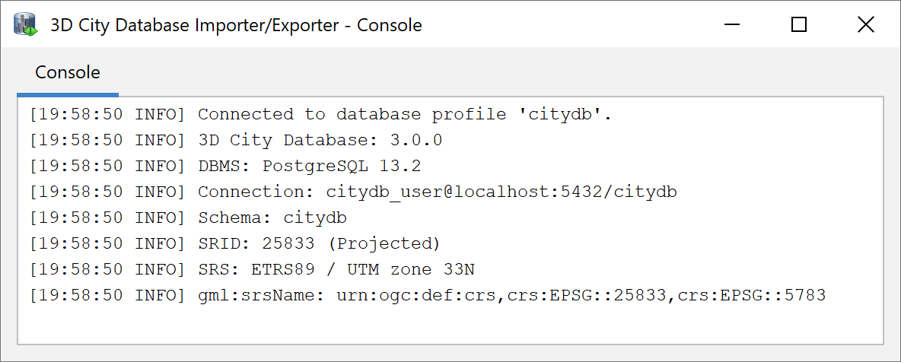

.. _first_steps_migration_chapter:

Migration from previous releases
--------------------------------

Scripts are located in the folder `3dcitydb/[oracle/postgresql]/MIGRATION`
within the installation directory of the Importer/Exporter tool. A
migration path is provided for 3D City Databases of version 2.1 and of
version 3.3.

.. hint::
   Another **safe and simple migration approach** is to export the
   database content from the v2.x/v3.x instance as CityGML with the
   previous version of the Importer/Exporter and re-import the data into
   the new 3D City Database version by using the new Importer/Exporter
   shipped with this release. This approach might take more time though,
   depending on the amount of data stored in the database.

.. note::
   The migration scripts do not handle version-enabled tables under
   Oracle. Therefore, if you are using Oracle and have enabled
   versioning, then exporting and re-importing the data is the
   recommended way to migrate to the new 3DCityDB version.

To start the migration process run the `MIGRATE_DB` shell script. Make
sure, the database credentials taken from the `CONNECTION_DETAILS` file
are correct. With the first input you need to enter the major version
number of the currently installed 3D City Database instance – either
**`2` or `3`**. To identify the actual version of your 3D City Database
you can use the Importer/Exporter tool to connect to the 3D City Database
instance that you want to upgrade. Starting from v3.0.0 the version
string is printed to the console window after the connection has been
successfully established as shown below (see also chapter about
:doc:`Managing connections <../impexp/db-connection-operations>`).

   Version information of a 3D City Database.

If the version string does not show up, you are running a v2.x
instance. Alternatively, the version information can also be queried
using database-side functions.

For Oracle the command is:

.. code:: sql

   SQL> select MAJOR_VERSION from table(CITYDB_UTIL.CITYDB_VERSION);

For PostgreSQL it is:

.. code:: sql

   psql> SELECT major_version FROM citydb_pkg.citydb_version();

If the function is not known to the system, you are probably running
a v2.x instance. For Oracle Database, migrating from v2 to v4 has some
prerequisites which are explained in the next chapter.

V2 to V4 Migration on Oracle
~~~~~~~~~~~~~~~~~~~~~~~~~~~~

**Step 1 – Upgrade an existing installation**

The migration to v4.0 **must be carried out on a version 2.1.0
instance** of the 3D City Database. Versions prior to version 2.1.0 must
first be upgraded to 2.1.0 since the internal storage of envelopes of
city objects changed substantially. Corresponding upgrade scripts are
shipped with the v2.1.0 release. Upgrades to 2.1.0 can be carried out
from any older version 2.0.0 to 2.0.6. A more detailed description of
the upgrade procedure can be found in the document “Documentation of the
3D City Database v2.1.0 and the Importer/Exporter v1.6.0”.

Before upgrading your 3D City Database, a database backup is highly
recommended to secure all data. The latter can be easily done using the
Importer/Exporter tool or by tools provided by Oracle.

.. note::
    Please note that the last step in the upgrade process is
    a lengthy one. Altering the internal storage of the envelopes of all
    city objects in a large and/or versioned database may take hours.
    Depending on their initial state, spatial indexes may be disabled and
    re-enabled in the process, adding to the duration as a whole. This
    process **MUST NOT** be interrupted since it could lead to an inconsistent
    state. Please be patient and remember that backing up all of your data
    before starting any database upgrade is the commonly recommended
    practice.

**Step 2 – Creating a new installation**

The migration script transfers data from a user schema with the v2.1.0
installation to another user schema that has to contain the 3D City
Database schema v4.0. Install the new version like it is described in
:numref:`3dcitydb_setup_schema_chapter`
if not done so yet.

**Step 3 – Grant select on v2.1.0 schema to v4.0 schema**

The migration process requires that the user with the v4.0 schema can
access the user schema with the v2.1.0 version. Therefore, run the
GRANT_ACCESS_V2 shell script (see :numref:`3dcitydb_shell_scripts`) as the V2 user.
When executed the user is requested to type in the schema name for the
3D City Database v4.0 instance.

**Step 4 – Run MIGRATE_DB**

Now, start the MIGRATE_DB script located in the same folder like
GRANT_ACCESS_V2 as the V4 user. Choose the value 2 as first input and
specify the name of the schema with the v2.1.0 instance.

**Step 5 – Be sure of using unique texture URIs**

Starting from v3.0.0 of the 3D City Database, textures that are
referenced to more than one geometry are no longer stored redundantly in
the SURFACE_DATA table but only once in the TEX_IMAGE table. This
optimization can also be done during the migration process, if it is
guaranteed that texture URIs are unique and not used for different
texture files. Otherwise, some textures would get lost during the
migration and remaining images would be referenced to wrong surfaces.
Therefore, if you can assure the non-existence of duplicate texture
URIs, verify with ‘y’ or ‘yes’. In case you know that textures in the
database are named equally (or if you do not know) you can still run the
script by entering ‘n’ or nothing (because it is the default). Entries
in the TEX_IMAGE column of the SURFACE_DATA table from version 2.1 are
then further mapped 1:1 to the TEX_IMAGE table of version 4.0.

.. note::
   A simple unification of texture URIs in advance of the migration
   will not help to store the textures only once, because same textures
   with different URIs are regarded as different image files and would all
   end up in the new TEX_IMAGE table. You would have to compare the binary
   data itself.

**Step 6 – Choose Spatial or Locator license option**

With the last input parameter you specify the database license running
on your Oracle server, like you have done when setting up the v4.0
instance of the 3D City Database. Choose ‘S’ for Spatial (which will
additionally migrate raster data) and ‘L’ for Locator.

**Step 7 – Check if the setup is correct**

The script temporary disables databases indexes and foreign key
constraints and creates an additional package with migration procedures
(CITYDB_MIGRATE). The package is removed again when the migration
progress is completed and the message "DB migration is completed
successfully." is displayed on the console. It is recommended to
generate a database report of the new user schema and compare it with a
report of the schema that contains the 2.1 instance of the 3D City
Database (done with the previous version of the Import/Export tool).
**Verify that**

-  no city objects are missing (do a database report),

-  indexes and foreign keys got activated again,

-  relations between features and attributes are correct, and

-  exports look correct inside a viewer application.

**Step 8 – Drop the deprecated v2.x schema**

If the migration was successful, the v2.x user simply has to invoke
the DROP_DB (of version 2.x) to drop the deprecated schema. Deleting the
v2.x user works as well.

V2 to V4 Migration on PostgreSQL
~~~~~~~~~~~~~~~~~~~~~~~~~~~~~~~~

**Step 1 – Run MIGRATE_DB**

For PostgreSQL, setting up a new v4.0 instance is not necessary.
Simply execute the MIGRATE_DB shell script and choose the value 2 as
first input.

**Step 2 – Be sure of using unique texture URIs**

Like with the Oracle version, you are requested to guarantee that no
texture URI is used for different images. See Step 5 in the workflow
explanation of the Oracle version for further details.

**Step 3 – Check if the setup is correct**

After a series of log messages reporting the selection of data from the
v2.x schema, updates of references and the creation of database objects,
the script is finished with the message '3DCityDB migration complete!'.
If the old database schema is not dropped during the migration (see
last step), both versions of the 3D City Database will remain in one
database. This is actually a good thing, because you can further compare
if everything has been transferred correctly.

**Idempotent migration**

If the migration process has been interrupted by the user or by severe
software errors, the migration script can simply be executed again (only
if the old v2.x schema still exists) without manually dropping already
created parts of the v4.0 schema because the script does it for you.

**Step 4 – Drop** **the deprecated v2.x schema**

To remove the deprecated parts of your 3D City Database invoke the
DROP_DB_V2 shell script.

.. warning::
   DO NOT execute the DROP_DB script as the old and new instance of
   the 3D City Database are both stored inside the same database
   (new = citydb schema, old = public schema). DROP_DB drops all
   database schemas where it finds a DATABASE_SRS table, so all your data
   would be lost. Be careful!

V3 to V4 Migration
~~~~~~~~~~~~~~~~~~

The migration process from v3 to v4 does not require any user inputs
after entering the value **`3`** in the `MIGRATE_DB` script (except for
choosing the license under Oracle).

.. note::
   Schema changes on existing tables are applied with ALTER TABLE
   statements which can lock these tables for a longer period if they
   contain millions of rows.

Upgrade between minor releases
~~~~~~~~~~~~~~~~~~~~~~~~~~~~~~

Every minor release of the 3D City Database is shipped with an upgrade
script if necessary. Starting from version 4.x.x it can be found in the
MIGRATION folder. Like with other database DDL tasks a shell script will
be provided as well to ease the upgrade process. Make sure to first
check the current version of your 3D City Database installation before
performing an upgrade, as mentioned in the migration chapter.

During an upgrade check the output messages of the script for errors and
warnings. The process should finish the message `3D City Database
upgrade complete`.
