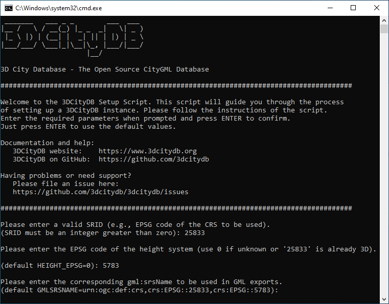

.. _3dcitydb_setup_schema_chapter:

Setting up the database schema
------------------------------

The required scripts for setting up the 3D City Database are in the
installation directory of the Importer/Exporter within the
*3dcitydb/oracle/* or *3dcitydb/postgresql/* subfolders.

.. _3dcitydb_shell_scripts:

Shell Scripts
~~~~~~~~~~~~~

In previous versions of the 3D City Database the setup was managed
through user prompts in SQL scripts. To facilitate continuous
integration workflows these inputs have been moved to batch (Windows)
and shell scripts (UNIX/Linux/macOS). The following table provides an
overview of the different shell scripts:

.. list-table::  Overview of all shell scripts within the 3dcitydb/oracle or 3dcitydb/postgresql folder

   * - | **File**
     - | **Oracle**
     - | **PgSQL**
     - | **Explanation**
   * - | CONNECTION_DETAILS
     - | **x**
     - | **x**
     - | Sets database credentials
   * - | CREATE_DB
     - | **x**
     - | **x**
     - | Runs all scripts for creating the
       | relational schema of a 3DCityDB incl.
       | database types and functions
   * - | CREATE_SCHEMA
     - |
     - | **x**
     - | Creates an additional 3DCityDB
       | instance in a separate schema within the
       | same database
   * - | DROP_DB
     - | **x**
     - | **x**
     - | Deletes all elements of the 3DCityDB
   * - | DROP_SCHEMA
     - |
     - | **x**
     - | Removes a given database schema that
       | contains a 3DCityDB instance
   * - | MIGRATION/GRANT_ACCESS_V2
     - | **x**
     - | **x**
     - | Grants access on a 3DCityDB v2 to a
       | v4 user (only relevant for migration)
   * - | MIGRATION/MIGRATE_DB
     - | **x**
     - | **x**
     - | Migrate an instance of the 3DCityDB
       | from v2 or v3 to v4
   * - | MIGRATION/UPGRADE_DB
     - | **x**
     - | **x**
     - | Upgrade an instance of the 3DCityDB
       | to the latest v4
   * - | GRANT_ACCESS
     - | **x**
     - | **x**
     - | Grants read-only of read-write access
       | on the 3DCityDB for a given user
   * - | REVOKE_ACCESS
     - | **x**
     - | **x**
     - | Revokes access rights for a given user

The batch/shell scripts can be executed on double click. On some
UNIX/Linux distributions though, you will have to run the .sh scripts
from within a shell environment. Please open your favorite shell and
check whether execution permission is set for the starter script. Change
to the installation folder and enter the following to make the starter
script executable for the owner of the file, e.g.:

.. code:: bash
   
   $ chmod u+x CREATE_DB.sh

Afterwards, simply run the shell script by typing:

.. code:: bash
   
   $ ./CREATE_DB.sh

.. note::
   The **database connection details need to be set** in the
   CONNECTION_DETAILS script prior to executing the batch/shell scripts.

SQL Scripts
~~~~~~~~~~~

The SQLScripts directory contains four subfolders:

**SCHEMA**

Includes SQL files about the logical (tables, constraints) and physical
(datatypes, indexes) database schema of the 3D City Database exported
from the schema modelling tools `JDeveloper <https://www.oracle.com/technetwork/developer-tools/jdev/overview/index.html>`_ (Oracle) or `pgModeler <https://pgmodeler.io/>`_ (PostgreSQL) (with
minor changes). INSERT statements for the prefilled lookup tables
`OBJECTCLASS` and `AGGREGATION_INFO` as well as converter functions
between table names and objectclass IDs can be found in the OBJECTCLASS
subfolder. Because of PostgreSQL’s way to handle database schemas the
SCHEMA folder contains a few more scripts with stored procedures. See
chapter :doc:`Working with multiple database schemas <../3dcitydb/multi-schema>`
for more details.

**CITYDB_PKG**

Contains scripts that create database objects and stored procedures
mainly to be used by the Importer/Exporter application. They are written
in PL/SQL (Oracle) or PL/pgSQL (PostgreSQL) and grouped by the type of
operation (data manipulation, maintenance etc.). The APIs are introduced
in :doc:`Stored Procedures <../3dcitydb/sproc/index>` chapter.

**UTIL**

This folder assembles different database management utilities:

-  Grant and revoke read rights to and from the 3D City Database.
   (cf. :numref:`citydb_schema_rw_access_chapter`)

-  Create additional database schemas with a 3D City Database layout
   (PostgreSQL-only) (cf. :numref:`citydb_create_address_schemas_chapter`)

-  Enable or disable versioning (execution can be time-consuming)
   (Oracle-only)

-  Update table statistics for spatial columns (PostgreSQL-only)

**MIGRATION**

Provides a migration path from previous releases to the newest version.
See :doc:`Migration <migration>` chapter for more details. This folder will
also include upgrade scripts for upcoming minor releases.

.. _first_step_3dcitydb_installation_oracle:

Installation steps on Oracle Databases
~~~~~~~~~~~~~~~~~~~~~~~~~~~~~~~~~~~~~~

**Step 1 - Define a user for the 3D City Database**

A dedicated database user should be created for your work with the 3D
City Database. This user must have the roles CONNECT and RESOURCE
assigned and must own the privileges CREATE SEQUENCE and CREATE TABLE.

.. note::
   The privileges CREATE SEQUENCE and CREATE TABLE are required for
   enabling and disabling spatial indexes. It is *not sufficient* to
   inherit these privileges through a role.

**Step 2 – Edit the CONNECTION_DETAILS[.sh \| .bat] script**

Go to the 3dcitydb/oracle/ShellScrpts directory, choose the folder
corresponding to your operating system and open the file named
CONNECTION_DETAILS within a text editor. There are five variables that
will be used to connect to the DBMS. If **SQL*Plus** is already
registered in your system path, you do not have to set the directory for
the SQLPLUSBIN variable. The other parameters should be obvious to
Oracle users. Here is an example how the complete CONNECTION_DETAILS can
look like:

.. code:: bash

    SQLPLUSBIN= C:\\Oracle\\instantclient_11_2
    HOST=localhost
    PORT=1521
    SID=orcl
    USERNAME=citydb_v4

.. note::
    The scripts to grant or revoke read access require SYSDBA
    privileges. You can specify a SYSDBA user in the CONNECTION_DETAILS
    script under an additional parameter called SYSDBA_USERNAME.

**Step 3 - Execute the CREATE_DB script:**

As soon as the database credentials are defined run the CREATE_DB script
– located in the same folder as CONNECTION_DETAILS (see also :numref:`3dcitydb_shell_scripts`).

**Step 4 - Define the coordinate reference system**

When executing the CREATE_DB script, the user is prompted for the
coordinate reference system (CRS) to be used in the 3D City Database.
You have to enter the Oracle-specific SRID (spatial reference ID) of the
CRS which – in most cases – resembles the EPSG code of the CRS. There
are three prompts in total to define the spatial reference:

-  First, specify the SRID to be used for the geometry columns of the
   database. Unlike previous version of the 3D City Database there is no
   default CRS defined.

-  Second, specify the SRID of the height system if no true 3D CRS is
   used for the data. This can be regarded as metadata and has no effect
   on the geometry columns in the database. The default value is 0 –
   which means “not set”.

-  Third, provide the GML-conformant uniform resource name (URN)
   encoding of the CRS. The default value uses the OGC namespace and
   comprises of the first two user inputs:
   ``urn:ogc:def:crs,crs:EPSG::<crs1>[,crs:EPSG::<crs2>]``.

More information about the SRID and the URN encoding can be found in
:numref:`citydb_crs_definition_chapter`.

**Step 5 – Enable or disable versioning**

After providing the CRS information, the user is asked whether or not
the database should be versioned-enabled. Versioning is realized based
on Oracle’s *Workspace Manager* functionality (see the Oracle
documentation for more information). Please enter ‘yes’ or ‘no’. The
default value ‘no’ is confirmed by simply pressing *Enter*. Note that,
in general, insert, update, delete and index operations on
version-enabled tables *take considerably more time* than on tables
without versioning support.

**Step 6 – Choose Spatial or Locator license option**

You can set up a 3D City Database instance on an Oracle database with
*Spatial* or *Locator* support. Since *Locator* differs from *Spatial*
with respect to the available spatial data types, you need to specify
which license option is valid for your Oracle installation. Simply enter
‘L’ for *Locator* or ‘S’ for *Spatial* (default value) to make your
choice.

.. note::
   Since *Locator* lacks the GeoRaster data type, the 3D City
   Database tables for storing raster reliefs (RASTER_RELIEF,
   GRID_COVERAGE, GRID_COVERAGE_RDT) are not created when choosing Locator.

.. note::
   Several spatial operations and functionalities that are
   available in Oracle *Spatial* are not covered by the *Locator* license
   even though they might be available from your Oracle installation. It
   is the **responsibility of the database user** to observe the Oracle
   license option. Choosing *Locator* or *Spatial* when setting up the 3D
   City Database does neither affect the license option nor the users’
   responsibility.

The following figure exemplifies the required user input during steps 4
to 6.

   Example user input when executing CREATE_DB on an Oracle database.

**Step 7 – Check if the setup is correct**

After successful completion of the setup procedure, the tables,
sequences and packages (that contain stored procedures) should appear in
the user schema.

Versioning of the database can also be switched on and off at any time.
The corresponding scripts are ENABLE_VERSIONING.sql and
DISABLE_VERSIONING.sql. These scripts invoke routines of the Oracle
Workspace Manager and will take some time for execution depending on the
amount of data stored in the 3D City Database instance.

Last but not least, the schema and stored procedures of the 3D City
Database can be dropped with the DROP_DB script, which is executed like
CREATE_DB. Similar to CREATE_DB, you need to provide the license option
(*Locator* or *Spatial*). Note that the script will **delete all data**
stored in the 3D City Database schema. The database user will, however,
not be deleted.

.. _first_step_3dcitydb_installation_postgis:

Installation steps on PostgreSQL
~~~~~~~~~~~~~~~~~~~~~~~~~~~~~~~~

**Step 1 - Create an empty PostgreSQL database**

Choose a superuser or a user with the CREATEDB privilege to create a new
database on the PostgreSQL server (e.g. 'citydb_v4'). As owner of this
new database, choose or create a user who will later set up the 3D City
Database instance. Otherwise, more permissions have to be granted. In
the following steps, this user is called 'citydb_user'.

Connect to the database and type:

.. code:: sql

    CREATE DATABASE citydb_v4 OWNER citydb_user;

or use a graphical database client such as *pgAdmin* that is shipped
with PostgreSQL. Please check the *pgAdmin* documentation for more
details.

**Step 2 – Add the PostGIS extension**

The 3D City Database requires the PostGIS extension to be added to the
database. This can **only be done as superuser**. The extension is added
with the following command (or, alternatively, using *pgAdmin*):

.. code:: sql

    CREATE EXTENSION postgis;

Some 3D operations such as extrusion or volume calculation are only
available through the PostGIS **SFCGAL** extension. **The installed
PostGIS add-on should at least be on version 2.2** to execute the DDL
command:

.. code:: sql

    CREATE EXTENSION postgis_sfcgal;

.. note::
   Starting from PostGIS v3, all the raster functionality has been moved
   to a separate extension ``postgis_raster``. Since the 3DCityDB requires
   the raster functionality, this extension must be installed if PostGIS 3 or
   higher version is used.

   .. code:: sql

       CREATE EXTENSION postgis_raster;

**Step 3 – Edit the CONNECTION_DETAILS[.sh \| .bat] script**

Go to the 3dcitydb/postgresql/ShellScrpts directory, choose the folder
corresponding to your operating system and open the file named
CONNECTION_DETAILS within a text editor. There are five variables that
will be used to connect to the DBMS. If **psql** is already registered
in your system path, you do not have to set the directory for the PGBIN
variable. The other parameters should be obvious to PostgreSQL users.
Here is an example how the complete CONNECTION_DETAILS can look like:

.. code:: bash

    PGBIN= C:\PostgreSQL\9.6\bin
    PGHOST=localhost
    PGPORT=5432
    CITYDB=citydb_v4
    PGUSER=citydb_user

**Step 4 - Execute the CREATE_DB script**

As soon as the database credentials are defined run the CREATE_DB script
– located in the same folder as CONNECTION_DETAILS (see also :numref:`3dcitydb_shell_scripts`).

**Step 5 – Specify the coordinate reference system**

Like with the Oracle version, the user is prompted to enter the SRID
used for the geometry columns, the SRID of the height system and the URN
encoding of the coordinate reference system to be used (see :numref:`citydb_crs_definition_chapter` for more information).

.. note::
   The setup process will terminate immediately if an error occurs.
   Reasons might be:

-  The user executing CREATE_DB.sql is neither a superuser nor the owner
   of the specified database (or does not own privileges to create
   objects in that database);

-  The PostGIS extension has not been installed; or

-  Parts of the 3D City Database do already exist because of a previous
   setup attempt. Therefore, make sure that the schemas ‘citydb’ and
   ‘citydb_pkg’ do not exist in the database when setting up the 3D City
   Database.

After a series of log messages reporting the creation of database
objects, the chosen reference system is applied to the spatial columns
(expect for those that will store data with local coordinate systems).
This takes some seconds and is finished when the word ‘Done’ is
displayed.

**Step 5 – Check if the setup is correct**

The 3D City Database is stored in a separate PostgreSQL schema called
‘citydb’. The stored procedures are written to a separate PostgreSQL
schema called ‘citydb_pkg’. Usually different schemas have to be
addressed in every query via dot notation, e.g.

.. code:: sql

    SELECT * FROM citydb.building;

Fortunately, this can be avoided when the corresponding schemas are on
the database **search path**. The search path is **automatically
adapted** during the setup. Execute the command

.. code:: sql

    SHOW search_path;

to check if the schemas citydb, citydb_pkg and public (for PostGIS
elements) are contained.

.. note::
   When using the created 3D City Database as a template database
   for new databases, the search path information is not transferred and
   thus has to be set again, e.g.:

   .. code:: sql

       ALTER DATABASE new_citydb_v4 SET search_path TO citydb, citydb_pkg, public;

   The search path will be updated upon the next login, not within the
   same session.

To drop the 3D City Database with all data, execute the DROP_DB.sql
script in the same way like CREATE_DB.sql. Simply dropping the schemas
‘citydb’ and ‘citydb_pkg’ in a cascading way will also do the job.
