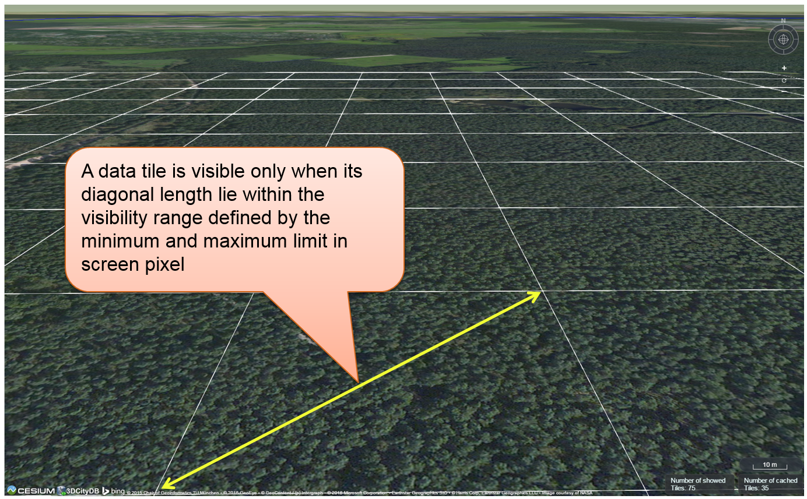

Handling KML/glTF models with online spreadsheet 
~~~~~~~~~~~~~~~~~~~~~~~~~~~~~~~~~~~~~~~~~~~~~~~~~

As mentioned before, the 3D web client extends the Cesium Virtual Globe
to support efficient displaying, caching, dynamic loading and unloading
of large pre-styled 3D visualization models in the form of tiled
KML/glTF datasets exported the 3DCityDB using the KML/COLLADA/glTF
Exporter. However, there is a major problem regarding the graphical
visualization of semantic 3D city models as their attribute information
is completely or partly lost in the 3D graphics formats. This issue has
been considered and solved within the 3D web client by supporting the
explicit linking of the 3D visualization models with thematic data which
can be exported using the Spreadsheet Generator Plugin (SPSHG) and
uploaded to an online spreadsheet (Google Fusion Table [15]_) stored and
published via the Google Cloud. This strategy can therefore offer the
possibilities for collaborative and interactive data exploration of
semantic 3D city models by means of querying the thematic data of the
selected city object. The corresponding system architecture is
illustrated in the following figure.

.. figure:: /media/3d_web_map_overview.png
   :name: pic_3d_web_map_overview
   
   Coupling an online spreadsheet with a 3D visualization model
   (i.e. a KML/glTF visualization model) in the cloud [Herreruela et al.
   2012]

.. figure:: /media/image172.png
   :name: pic_3d_web_map_example_google_fusion
   
   Example of an online spreadsheet (Google Fusion Table)

Similar to the structure of a database table, the first row of the
online spreadsheet defines the attribute names, and the further rows
store the respective attribute values for each 3D object. The logical
links between the 3D models and the respective rows are established via
a specific column within the spreadsheet, namely the ``GMLID`` column, which
contains the unique identifiers of the 3D objects. Each further column
is used to represent one attribute of the 3D object. By using the freely
available Google Drive application, all users having access to the
online spreadsheet are able to edit it, for example to modify attribute
values or insert new attribute fields, in order to keep the contents
up-to-date without affecting the original (possibly official) 3D city
model. Besides, such a detachment of the thematic data from the 3D
visualization models also has the advantage that any update of thematic
contents can exclusively take place within the online spreadsheet and
therefore does not require exporting and deploying the 3D visualization
models again.

In order to add a KML/glTF data layer along with its linked online
spreadsheet to the 3D web client, the parameters must be properly
specified (some of which are optional) on the corresponding input panel
[1] (cf. :numref:`pic_3d_web_map_example_toolbox`) which can be expanded and collapsed by clicking on
the *Add / Configure Layer* button.

.. note::
   All default parameter values used in the 3D web client were
   chosen accordingly to the standard settings (e.g., the standard
   predefined tile size is 125m x 125m) specified in the preference
   settings of the KML/COLLADA/glTF Exporter (cf. section 5.6.3.1). The
   parameter name with the suffix “(*)” denotes that this parameter is
   mandatory; otherwise it is optional.

.. figure:: /media/3d_web_map_toolbox.png
   :name: pic_3d_web_map_example_toolbox
   
   The input panel [1] for adding a new KML/glTF data layer and
   the extended ``Geocoder`` widget [2] allowing to search a 3D object also by
   its gmlId

First of all, the web link of the master JSON file (cf. section 5.5)
holding the relevant meta-information of this data layer has to be
entered into the input field *URL(*)*. In the input field *Name(*)*, a
proper layer name must be specified which will be listed at the top of
the input panel [1] once the KML/glTF data layer has been successfully
loaded into the 3D web client. The parameter *thematicDataUrl* denotes
the URL of an online spreadsheet (Google Fusion Table) which stores the
attribute data. This parameter is optional and is only required if the
user wants to attach thematic data to the KML/glTF visualization model.

The next optional parameter *cityobjectsJsonUrl* holds the URL of the
JSON file which can be generated automatically by using the
KML/COLLADA/glTF Exporter (cf. section 5.6.3.1). This JSON file contains
a list of GMLIDs of all 3D objects which were exported and might be
distributed over different tiles. For every 3D object, it is also stored
in which tile it is contained together with its envelope represented
using a bounding box in WGS84 lat/lon. These location information can be
used to search for a certain 3D object with the help of the Geocoder
widget [2], which has been extended to support a specific geocoding
process performed in the following manner: In the input field, either a
GMLID of a 3D object or an address can be entered. If an object with the
given GMLID is found in the JSON file, the camera perspective will be
adjusted to look at the center point of the 3D object with a proper
oblique view. If not, the Bing Maps Locations API will be automatically
called and the map view will be adjusted to the returned location and
bounding box.

The combination of the parameters *minLodPixels* and *maxLodPixels*
defines the minimum and maximum limit of the visibility range for each
data layer to control the dynamic loading and unloading of the data
tiles. The maximum visibility range can start at 0 and end at an
infinite value expressed as -1. Optionally, the user can directly
specify the two parameter values within the 3D web client. Otherwise,
the parameter values will be achieved from the master JSON file, which
also contains the parameters *minLodPixels* and *maxLodPixels* and their
values which have been specified using the KML/COLLADA/glTF Exporter
before performing the export process.

With these two parameters, the 3D web client implements the so-called
*Level of Details* (LoD) concept which is a common solution being used
in 3D computer graphics and GIS (e.g. KML NetworkLinks) for efficient
streaming and rendering of tiled datasets. According to the LoD concept,
the data tiles with higher resolution should be loaded and visualized
when the observer is viewing them from a short distance. When data tiles
are far away from the observer, the data tiles with higher resolution
should be substituted by the data tiles with lower resolution. In order
to realize this LoD concept in the 3D web client, each data tile which
is being intersected with the current view frustum will be projected
onto the screen while navigating the Earth map. Subsequently, the
diagonal length of the projected area on the screen will be calculated
by the 3D web client to determine whether the respective data tile
should be loaded or unloaded. If the diagonal length is greater than
*minLodPixels* and less than *maxLodPixels*, the respective data tile
will be loaded and displayed; otherwise it will be hidden from display
and unloaded. Of course, all data tiles lying outside of the view
frustum are unloaded and invisible anyway.

.. figure:: /media/image210.png
   :name: pic_3d_web_map_example_tilesize

   Efficient determination of which data tiles should be loaded
   according to the user-defined visibility range in screen pixel

Loading massive amounts of data tiles often result in poor performance
of the 3D web client or even memory overload of the web browser. This
could happen when, for example, the visibility range (determined by the
parameters *minLodPixels* and *maxLodPixels*) starts at a very small
value and ends at an infinite size. In this case, each data tile will
always be visualized even though it only takes up a very small screen
space. This issue can be avoided by a proper setting of the parameter
*maxCountOfVisibleTiles* which specifies the maximum number of allowed
visible data tiles. When this limit is reached, any additional data
tiles that are farthest away from the camera will not be shown,
regardless the size of screen space they occupy. Per default, this
parameter receives a value of 200, which is appropriate in most use
cases. However, depending on data volume of each tile and the hardware
you use, this parameter value has to be adjusted by means of practical
tests.

As mentioned before, the 3D web client implements a caching mechanism
allowing for high-speed reloading of those data tiles that have been
loaded before and which are stored in the memory of the web browser. In
order to prevent memory overload, the parameter *maxSizeOfCachedTiles*
can be applied for specifying the maximum allowable cache size expressed
as a number of data tiles. With this parameter, the 3D web client
implements the so-called *Least Recently Used* (LRU) algorithm which is
a caching strategy being widely used in many computer systems. According
to this caching algorithm, newly loaded data tiles will be successively
put into the cache. When the cache size limit is reached, the 3D web
client will remove the least recently visualized data tiles from the
cache. By default, the value of this parameter is set to 200 and can of
course be increased to achieve a better viewing experience depending on
the hardware you use.

Usage example
"""""""""""""

In this example, a tiled KML dataset containing around 8000 LoD1
buildings in the Manhattan district of New York City (NYC) will be
visualized on the 3D web client. This KML dataset is derived from the
semantic 3D city model of New York City (NYC) [16]_ which has been
created by the Chair of Geoinformatics at Technical University of Munich
on the basis of datasets provided by the NYC Open Data Portal [17]_. The
following parameter values should be entered into the corresponding
input fields:

.. table::
   :widths: auto

   ================================= ====================================================================================================================================================================================================================================
   **url**                              https://www.3dcitydb.org/3dcitydb/fileadmin/public/3dwebclientprojects/NYC-Model-20170501/Building_gltf/Building_gltf_collada_MasterJSON.json
   **name**                             NYC_Manhattan_Buildings
   **thematicDataUrl**                  https://www.google.com/fusiontables/DataSource?docid=1iG6_vYe7JGTNAUwFw7TpD8EMO-iQe6gSpa6MJlCF
   **cityobjectsJsonUrl**               https://www.3dcitydb.org/3dcitydb/fileadmin/public/3dwebclientprojects/NYC-Model-20170501/Building_gltf/Building_gltf.json
   **minLodPixels**                     100
   **maxLodPixels**                     -1
   **maxSizeOfCachedTiles**             200
   **maxCountOfVisibleTiles**           200
   ================================= ====================================================================================================================================================================================================================================

After clicking on *Add layer*, a data layer will be loaded into the 3D
web client and the corresponding layer name *NYC_Manhattan_Buildings*
will be listed above the input panel. The Earth map can be zoomed to the
extent of the loaded data layer by double-clicking on the layer name.
The parameter values of the data layer (its radio button must be
activated) can be changed and applied at any time by clicking on the
*Save layer settings* button.

.. figure:: /media/3d_web_map_screenshot_kml_gltf.png
   :name: pic_3d_web_map_screenshot_kml_gltf
   
   Screenshot showing how to add a new KML/glTF data layer into
   the 3D web client

Users are also able to control the visibility of the selected data
layers by deactivating its checkbox or clicking on the *Remove selected
layer* button to completely remove it from the 3D web client (cf. the
following two screenshots)

.. figure:: /media/3d_web_map_layer_box.png
   :name: pic_3d_web_map_screenshot_kml_gltf
   
   Screenshot showing how to hide a KML/glTF data layer

.. figure:: /media/3d_web_map_layer_remove.png
   :name: 3d_web_map_layer_remove
   
   Screenshot showing how to remove a KML/glTF data layer from
   the 3D web client

.. |image197| image:: ../media/image203.png
   :width: 5.21875in
   :height: 3.42974in

.. |image198| image:: ../media/image172.png
   :width: 6.11813in
   :height: 3.94792in

.. |image199| image:: ../media/image209.PNG
   :width: 6.3in
   :height: 4.15333in

.. |image201| image:: ../media/image211.PNG
   :width: 6.3079in
   :height: 3.11458in

.. |image202| image:: ../media/image212.PNG
   :width: 6.30709in
   :height: 4.35167in

.. |image203| image:: ../media/image213.PNG
   :width: 6.30625in
   :height: 3.77083in
